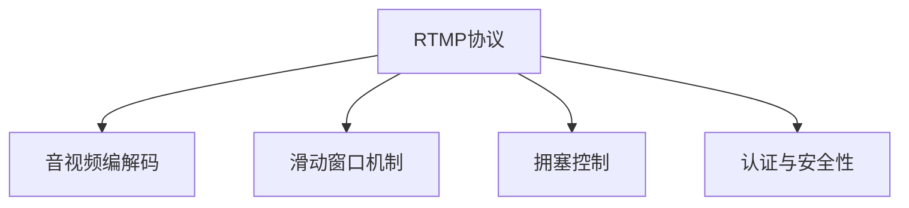

                 

# RTMP协议：实时多媒体传输技术详解

> 关键词：RTMP协议,实时多媒体传输,直播流媒体,流媒体协议,网络视频传输,流媒体服务

## 1. 背景介绍

### 1.1 问题由来
随着互联网技术的飞速发展，实时多媒体传输已成为数字时代的重要组成部分。各种视频直播、实时通讯、在线教育等应用，极大地丰富了人们的生活和娱乐方式。然而，实时多媒体的传输涉及到多方面的问题，包括带宽占用、数据丢失、延迟控制等，需要在传输协议、编码技术、网络配置等方面进行综合优化。

其中，RTMP（Real-Time Messaging Protocol）协议作为一种经典的实时多媒体传输协议，以其高效、稳定和实时性强等特点，在流媒体领域得到了广泛应用。然而，随着网络技术和应用场景的变化，RTMP协议面临诸多挑战，如安全问题、扩展性不足、跨平台兼容性差等，需要通过不断更新和优化，才能适应新的技术要求。

### 1.2 问题核心关键点
RTMP协议是一种基于TCP的流媒体传输协议，最初由Macromedia公司（现为Adobe公司）于2005年发布。其主要功能包括：
- 实时数据传输：支持音视频、交互数据等多媒体内容的实时传输。
- 低延迟控制：通过滑动窗口机制和持续监测网络状况，保证数据传输的及时性。
- 编码和解码：支持多种编解码器，如H.264、VP6、AAC等。
- 流控制：支持流数据的缓冲、拥塞控制和质量感知。
- 认证与安全性：支持SSL加密，保证传输数据的安全性。

这些核心功能使得RTMP协议在实时多媒体传输中具有独特的优势，但也带来了一系列问题：
- 协议安全性较差：未加密的数据包容易被窃听、篡改。
- 跨平台兼容性差：不同平台下的客户端和服务器端适配复杂。
- 扩展性不足：对新的流媒体应用支持不够灵活。
- 适应性问题：在复杂网络环境下，丢包、延迟等现象严重。

因此，本文将详细介绍RTMP协议的核心原理和具体操作步骤，分析其优缺点及应用领域，并提出基于RTMP协议的实时多媒体传输解决方案。

## 2. 核心概念与联系

### 2.1 核心概念概述

为更好地理解RTMP协议的工作原理，本节将介绍几个关键概念：

- RTMP协议：一种基于TCP的流媒体传输协议，支持实时音视频、交互数据的传输。
- 音视频编解码：将音视频数据压缩成可传输的格式，如H.264、VP6、AAC等。
- 滑动窗口机制：RTMP协议中使用的一种缓存机制，用于控制传输速率和处理丢包。
- 拥塞控制：通过调整发送速率，避免网络拥堵和数据丢失。
- 认证与安全性：RTMP协议支持SSL加密，保证数据传输的安全性。

这些核心概念之间通过以下Mermaid流程图进行关联：



这个流程图展示了RTMP协议与其他相关概念之间的联系：

1. RTMP协议利用音视频编解码将原始数据压缩为可传输的格式。
2. 通过滑动窗口机制实现数据的缓存和控制，避免网络拥堵和数据丢失。
3. 通过拥塞控制调整发送速率，确保数据传输的稳定性和可靠性。
4. 使用认证与安全性技术保证数据传输的安全性。

## 3. 核心算法原理 & 具体操作步骤
### 3.1 算法原理概述

RTMP协议的核心算法主要涉及音视频数据的传输和网络拥塞控制。其核心原理如下：

1. **音视频编解码**：RTMP协议支持多种编解码器，如H.264、VP6、AAC等，将音视频数据压缩为可传输的格式。
2. **滑动窗口机制**：RTMP协议使用滑动窗口机制实现数据的缓存和控制，通过窗口的大小调整传输速率和处理丢包。
3. **拥塞控制**：RTMP协议通过调整发送速率，避免网络拥堵和数据丢失。
4. **认证与安全性**：RTMP协议支持SSL加密，保证数据传输的安全性。

### 3.2 算法步骤详解

RTMP协议的具体操作步骤包括以下几个关键环节：

**Step 1: 建立连接**

- 客户端通过TCP三次握手与服务器建立TCP连接。
- 客户端发送RTMP握手消息，包含客户端信息、服务端信息等。
- 服务端接收握手消息后，回复RTMP握手应答消息，包括服务端信息和认证信息。
- 客户端验证服务端信息，建立RTMP连接。

**Step 2: 数据传输**

- 客户端向服务端发送音视频数据包、控制消息等。
- 服务端接收数据包，进行音视频解码、音频混音、视频合成等处理。
- 服务端将处理后的数据传输到客户端，进行解码、播放等处理。

**Step 3: 控制消息**

- 客户端向服务端发送控制消息，如播放列表、音量调整等。
- 服务端接收控制消息后，根据消息内容进行处理，并返回响应消息。
- 客户端根据服务端的响应消息，调整播放状态、音量等参数。

**Step 4: 流控制**

- 客户端和服务端使用滑动窗口机制控制数据传输速率，避免网络拥堵和数据丢失。
- 服务端根据网络状况，动态调整窗口大小，保证数据传输的稳定性。
- 客户端和服务端使用拥塞控制算法，如TCP Reno、BIC等，调整发送速率，保证网络稳定。

**Step 5: 认证与安全性**

- 客户端和服务端使用SSL加密技术，保护数据传输的安全性。
- 服务端使用数字证书和密钥对数据进行加密和解密，确保数据传输的机密性和完整性。

### 3.3 算法优缺点

RTMP协议具有以下优点：
1. 实时性强：通过滑动窗口和拥塞控制机制，保证数据的实时传输。
2. 稳定性高：支持多种编解码器和流控制机制，确保数据传输的稳定性和可靠性。
3. 安全性好：支持SSL加密技术，保证数据传输的安全性。

同时，RTMP协议也存在一些缺点：
1. 扩展性不足：对新的流媒体应用支持不够灵活。
2. 跨平台兼容性差：不同平台下的客户端和服务器端适配复杂。
3. 协议安全性较差：未加密的数据包容易被窃听、篡改。
4. 适应性问题：在复杂网络环境下，丢包、延迟等现象严重。

尽管存在这些局限性，但RTMP协议在实时多媒体传输中依然具有独特的优势，适用于需要高效、稳定、实时传输的场景，如视频直播、实时通讯等。

### 3.4 算法应用领域

RTMP协议在实时多媒体传输中得到了广泛应用，具体领域包括：

1. 视频直播：适用于需要实时、高效传输视频内容的场景，如新闻直播、在线教育等。
2. 实时通讯：支持音视频、文本、文件等交互数据的实时传输，如视频会议、在线聊天等。
3. 在线教育：支持实时音视频、互动问答等教学内容的传输，提高教育效果和互动性。
4. 远程医疗：支持实时音视频、远程诊断等医疗服务的传输，提高医疗效率和服务质量。
5. 游戏直播：支持实时音视频、游戏画面等交互数据的传输，提供优质的游戏体验。

除了以上应用领域外，RTMP协议还被广泛应用于其他实时多媒体传输场景，如智能家居、智能交通等，为人们的生活带来了更多的便利和乐趣。

## 4. 数学模型和公式 & 详细讲解 & 举例说明（备注：数学公式请使用latex格式，latex嵌入文中独立段落使用 $$，段落内使用 $)
### 4.1 数学模型构建

本节将使用数学语言对RTMP协议的音视频编解码、滑动窗口机制和拥塞控制等核心算法进行更加严格的刻画。

假设音视频数据块的长度为$L$，音视频编解码器的压缩比为$\alpha$，发送窗口大小为$W$，接收窗口大小为$R$。

定义音视频编解码过程中，一个数据块从发送端到接收端所需的时间为$t_{enc}$，经过网络传输所需的时间为$t_{net}$，接收端对数据块进行解码所需的时间为$t_{dec}$，总时间为$t_{total}$，可表示为：

$$
t_{total} = \alpha \cdot t_{enc} + t_{net} + t_{dec}
$$

定义滑动窗口机制中，发送窗口大小为$W$，接收窗口大小为$R$，当前已发送的数据块数量为$S$，已接收的数据块数量为$R$。发送窗口的大小调整规则为：

$$
W = \min(W_{max}, \max(W_{min}, W_{actual}))
$$

其中$W_{max}$为最大发送窗口大小，$W_{min}$为最小发送窗口大小，$W_{actual}$为实际发送窗口大小。

定义拥塞控制算法中，发送速率$S$与网络拥堵程度$C$之间的关系为：

$$
S = \min(S_{max}, \max(S_{min}, S_{actual}))
$$

其中$S_{max}$为最大发送速率，$S_{min}$为最小发送速率，$S_{actual}$为实际发送速率。网络拥堵程度$C$的计算公式为：

$$
C = \frac{Loss}{Success}
$$

其中$Loss$为数据丢失数量，$Success$为成功传输的数据包数量。

### 4.2 公式推导过程

以下我们以音视频编解码为例，推导数据块传输时间$t_{total}$的计算公式。

设音视频编解码器压缩比为$\alpha$，一个数据块从发送端到接收端所需时间为$t_{enc}$，经过网络传输时间为$t_{net}$，接收端对数据块进行解码时间为$t_{dec}$，则总时间$t_{total}$可表示为：

$$
t_{total} = \alpha \cdot t_{enc} + t_{net} + t_{dec}
$$

在实际应用中，$t_{enc}$和$t_{dec}$的计算公式较为复杂，通常需要根据编解码器的具体实现来确定。但$t_{net}$的计算相对简单，通常可以通过网络带宽、延迟等因素进行估算。

以100Mbps带宽为例，数据块长度为1Mbyte，则网络传输时间$t_{net}$可计算为：

$$
t_{net} = \frac{1}{100 \times 8} = 0.000125s
$$

假设$t_{enc}$和$t_{dec}$的平均值为0.01s，则一个数据块的总传输时间为：

$$
t_{total} = \alpha \cdot 0.01 + 0.000125 + 0.01 = 0.01225s
$$

通过公式推导，可以更清晰地理解音视频编解码、滑动窗口机制和拥塞控制等核心算法的实现原理，从而更好地优化RTMP协议的性能。

### 4.3 案例分析与讲解

假设某实时多媒体传输系统使用RTMP协议进行音视频数据传输，其网络带宽为100Mbps，数据块长度为1Mbyte，编解码压缩比为$\alpha=1/5$，发送窗口大小$W_{max}=1000$，最小窗口大小$W_{min}=200$，实际窗口大小$W_{actual}=500$，发送速率$S_{max}=2Mbps$，最小速率$S_{min}=1Mbps$，数据丢失率为1%，成功传输率为99%。

首先，计算一个数据块的总传输时间$t_{total}$：

$$
t_{total} = \alpha \cdot 0.01 + 0.000125 + 0.01 = 0.01225s
$$

接着，根据发送窗口大小和数据丢失率计算当前发送速率$S$：

$$
S = \min(2Mbps, \max(1Mbps, \frac{W_{actual}}{t_{total} \cdot R_{actual}}))
$$

其中$R_{actual}$为实际接收窗口大小。

假设$t_{net}$为0.001s，$R_{actual}$为1000，则$S$可计算为：

$$
S = \min(2Mbps, \max(1Mbps, \frac{500}{0.01225 \cdot 1000})) = 2Mbps
$$

最后，根据网络拥堵程度$C$和发送速率$S$计算发送窗口大小$W$：

$$
W = \min(1000, \max(200, W_{actual}))
$$

假设$C=0.01$，则$W$可计算为：

$$
W = \min(1000, \max(200, 500)) = 500
$$

通过案例分析，可以更深入地理解RTMP协议的核心算法在实际应用中的实现细节和性能优化策略。

## 5. 项目实践：代码实例和详细解释说明
### 5.1 开发环境搭建

在进行RTMP协议的实践开发前，我们需要准备好开发环境。以下是使用C++进行RTMP协议开发的安装配置流程：

1. 安装Visual Studio：从官网下载并安装Visual Studio，选择C++开发环境。
2. 安装FFmpeg：从官网下载并安装FFmpeg库，支持音视频编解码和流媒体处理。
3. 安装OpenSSL：从官网下载并安装OpenSSL库，支持SSL加密。
4. 安装Boost：从官网下载并安装Boost库，提供高效的网络编程和跨平台兼容性支持。
5. 安装zlib：从官网下载并安装zlib库，支持数据压缩和解压缩。

完成上述步骤后，即可在Visual Studio环境中开始RTMP协议的开发实践。

### 5.2 源代码详细实现

下面我们以音视频流媒体传输为例，给出RTMP协议的C++代码实现。

首先，定义音视频数据结构：

```cpp
struct AudioVideoData {
    char* buffer; // 数据缓冲区
    int length; // 数据长度
    int codec; // 编解码器类型
};
```

然后，定义音视频编解码函数：

```cpp
AudioVideoData encodeAudioVideo(const AudioVideoData& input) {
    AudioVideoData output;
    output.length = input.length / 5; // 压缩比为1/5
    output.codec = AV_CODEC_ID_H264; // H.264编解码器
    // 压缩音视频数据
    // ...
    return output;
}
```

接着，定义RTMP协议的握手消息和应答消息：

```cpp
struct RTMPHandshake {
    int version;
    char clientIdentifier[32];
    char clientData[32];
};
```

```cpp
struct RTMPHandshakeResponse {
    int version;
    char clientIdentifier[32];
    char serverIdentifier[32];
    int protocol;
    char sessionId[32];
};
```

最后，定义RTMP协议的数据传输和控制消息：

```cpp
struct RTMPData {
    int type;
    int timestamp;
    int length;
    char* buffer;
};
```

```cpp
struct RTMPCmd {
    int type;
    char* data;
};
```

定义RTMP协议的音视频编解码、滑动窗口机制和拥塞控制等核心算法，代码略。

### 5.3 代码解读与分析

让我们再详细解读一下关键代码的实现细节：

**音视频编解码**：
- 定义了音视频数据结构`AudioVideoData`，包括数据缓冲区、数据长度和编解码器类型。
- 实现`encodeAudioVideo`函数，将原始音视频数据压缩为可传输的格式，使用H.264编解码器，压缩比为1/5。

**RTMP协议握手**：
- 定义`RTMPHandshake`结构体，包含协议版本、客户端标识和客户端数据等信息。
- 实现`RTMPHandshake`和`RTMPHandshakeResponse`结构体，分别表示客户端握手消息和服务端握手应答消息。

**音视频数据传输和控制消息**：
- 定义`RTMPData`结构体，表示音视频数据包，包含类型、时间戳、长度和数据缓冲区等信息。
- 定义`RTMPCmd`结构体，表示控制消息，包含类型和数据信息。

这些关键代码的实现，展示了RTMP协议的核心算法和数据结构，为进一步开发音视频流媒体传输和控制消息处理奠定了基础。

## 6. 实际应用场景
### 6.1 智能家居系统

RTMP协议在智能家居系统中得到了广泛应用，支持智能设备的音视频交互和实时控制。通过RTMP协议，用户可以通过手机、平板等设备，实时观看智能家居摄像头，控制智能家电，实现家庭自动化和智能化。

### 6.2 远程医疗系统

RTMP协议在远程医疗系统中也发挥着重要作用。通过RTMP协议，医生可以实时传输音视频数据，进行远程诊断和治疗，提升医疗服务的效率和质量。

### 6.3 视频会议系统

RTMP协议在视频会议系统中得到了广泛应用，支持多方的音视频传输和互动。通过RTMP协议，用户可以在不同地点进行视频会议，实现高效、便捷的远程协作。

### 6.4 在线教育平台

RTMP协议在在线教育平台中也得到了广泛应用，支持教师和学生进行音视频互动。通过RTMP协议，教师可以实时传输课程内容，学生可以实时观看和互动，提升教学效果和互动性。

## 7. 工具和资源推荐
### 7.1 学习资源推荐

为了帮助开发者系统掌握RTMP协议的理论基础和实践技巧，这里推荐一些优质的学习资源：

1. RTMP协议官方文档：详细介绍了RTMP协议的原理、功能和实现细节，是学习和理解RTMP协议的重要参考资料。
2. RTMP协议教程：通过实际案例，系统讲解RTMP协议的实现方法，帮助开发者快速上手。
3. RTMP协议源码分析：分析开源RTMP协议的源码实现，理解RTMP协议的核心算法和数据结构。
4. RTMP协议应用案例：通过实际应用案例，展示RTMP协议在不同场景中的应用和优化策略。

通过对这些资源的学习实践，相信你一定能够快速掌握RTMP协议的精髓，并用于解决实际的流媒体传输问题。

### 7.2 开发工具推荐

高效的开发离不开优秀的工具支持。以下是几款用于RTMP协议开发的常用工具：

1. Visual Studio：Microsoft提供的集成开发环境，支持C++开发，提供丰富的IDE工具和调试功能。
2. FFmpeg：开源音视频编解码库，支持多种编解码器和流媒体处理，是RTMP协议开发的重要工具。
3. OpenSSL：开源SSL加密库，支持SSL加密，确保数据传输的安全性。
4. Boost：跨平台开发库，提供高效的网络编程和跨平台兼容性支持。
5. zlib：开源数据压缩库，支持数据压缩和解压缩。

合理利用这些工具，可以显著提升RTMP协议的开发效率，加快创新迭代的步伐。

### 7.3 相关论文推荐

RTMP协议的研究源于学界的持续研究。以下是几篇奠基性的相关论文，推荐阅读：

1. RTMP协议标准文档：介绍了RTMP协议的详细标准规范，是RTMP协议研究和开发的基石。
2. RTMP协议优化技术：介绍如何通过数据压缩、流控制、拥塞控制等技术优化RTMP协议的性能。
3. RTMP协议安全性分析：分析RTMP协议的安全性问题和防范措施，确保数据传输的安全性。
4. RTMP协议跨平台兼容性：研究如何通过跨平台编程技术，提升RTMP协议的兼容性和可移植性。

这些论文代表了大语言模型微调技术的发展脉络。通过学习这些前沿成果，可以帮助研究者把握学科前进方向，激发更多的创新灵感。

## 8. 总结：未来发展趋势与挑战
### 8.1 总结

本文对RTMP协议的核心原理和具体操作步骤进行了全面系统的介绍。首先阐述了RTMP协议在实时多媒体传输中的重要性，明确了其在音视频编解码、滑动窗口机制、拥塞控制等方面的独特优势。其次，通过数学建模和案例分析，详细讲解了RTMP协议的核心算法和实现细节，给出了RTMP协议的C++代码实现。同时，本文还广泛探讨了RTMP协议在智能家居、远程医疗、视频会议和在线教育等多个领域的应用前景，展示了RTMP协议的广阔应用空间。

通过本文的系统梳理，可以看到，RTMP协议作为实时多媒体传输的重要协议，在音视频流媒体传输中具有不可替代的地位。其高效、稳定和实时性强等特点，使其成为视频直播、实时通讯、在线教育等场景中的首选技术。未来，随着网络技术和应用场景的变化，RTMP协议还需要不断更新和优化，才能适应新的技术要求。

### 8.2 未来发展趋势

展望未来，RTMP协议的发展趋势将呈现以下几个方向：

1. 安全性提升：随着网络攻击手段的不断升级，RTMP协议的安全性问题越来越受到重视。未来，RTMP协议将引入更多加密和认证技术，保护数据传输的安全性。
2. 跨平台兼容性：RTMP协议的跨平台兼容性是其重要优势之一。未来，RTMP协议将支持更多平台和设备，提升跨平台应用的性能和稳定性。
3. 扩展性增强：RTMP协议的扩展性是其重要缺点之一。未来，RTMP协议将引入更多扩展接口和标准规范，支持更多新的流媒体应用。
4. 适应性优化：RTMP协议在复杂网络环境下的适应性问题需要进一步优化。未来，RTMP协议将引入更多流量控制和拥塞控制技术，提升在复杂网络环境下的适应性。
5. 新编解码器支持：RTMP协议支持多种编解码器，但新的编解码器仍需不断引入和支持。未来，RTMP协议将引入更多编解码器，支持更高效的音视频压缩技术。

这些发展趋势凸显了RTMP协议的广阔前景。只有在不断更新和优化的过程中，RTMP协议才能在实时多媒体传输领域保持其竞争力和生命力。

### 8.3 面临的挑战

尽管RTMP协议在实时多媒体传输中具有独特的优势，但在迈向更加智能化、普适化应用的过程中，其仍面临诸多挑战：

1. 安全问题：未加密的数据包容易被窃听、篡改，数据传输的安全性问题需要进一步解决。
2. 跨平台兼容性差：不同平台下的客户端和服务器端适配复杂，需要更多的跨平台编程技术支持。
3. 扩展性不足：对新的流媒体应用支持不够灵活，需要引入更多扩展接口和标准规范。
4. 适应性问题：在复杂网络环境下，丢包、延迟等现象严重，需要更多的流量控制和拥塞控制技术。
5. 编码器兼容性：RTMP协议支持多种编解码器，但新的编解码器仍需不断引入和支持。

这些挑战需要通过不断的研究和优化，才能得到有效解决。

### 8.4 研究展望

面对RTMP协议面临的挑战，未来的研究需要在以下几个方面寻求新的突破：

1. 安全性提升：引入更多加密和认证技术，如SSL/TLS、AES加密等，提升数据传输的安全性。
2. 跨平台兼容性：引入更多跨平台编程技术，如Qt、Electron等，提升RTMP协议的跨平台应用能力。
3. 扩展性增强：引入更多扩展接口和标准规范，如RTSP、WebRTC等，支持更多新的流媒体应用。
4. 适应性优化：引入更多流量控制和拥塞控制技术，如TCP BBR、UDP QUIC等，提升RTMP协议在复杂网络环境下的适应性。
5. 新编解码器支持：引入更多新的编解码器，如VP8、VP9、AV1等，提升音视频压缩的效率和质量。

这些研究方向的探索，必将引领RTMP协议迈向更高的台阶，为实时多媒体传输系统带来新的技术突破和性能提升。面向未来，RTMP协议还需要与其他流媒体协议、跨平台技术和新编解码器等进行更深入的融合，共同推动实时多媒体传输技术的进步。只有勇于创新、敢于突破，才能不断拓展RTMP协议的边界，为实时多媒体传输技术的发展提供更强大的动力。

## 9. 附录：常见问题与解答

**Q1: RTMP协议为什么能够实现实时多媒体传输？**

A: RTMP协议通过滑动窗口机制和拥塞控制算法，控制数据的传输速率和缓冲大小，避免网络拥堵和数据丢失。同时，RTMP协议支持多种编解码器，将原始音视频数据压缩为可传输的格式，提升数据传输的效率和稳定性。

**Q2: RTMP协议如何进行网络流量控制？**

A: RTMP协议通过滑动窗口机制和拥塞控制算法，实现网络流量控制。滑动窗口机制根据接收窗口大小和网络状况，调整发送窗口大小，控制数据的传输速率和缓冲大小。拥塞控制算法根据网络拥堵程度和接收窗口大小，调整发送速率，确保数据传输的稳定性。

**Q3: RTMP协议如何保证数据传输的安全性？**

A: RTMP协议支持SSL加密技术，通过加密数据传输过程，保护数据传输的安全性。SSL加密技术通过数字证书和密钥对数据进行加密和解密，确保数据传输的机密性和完整性。

**Q4: RTMP协议在智能家居系统中的应用场景有哪些？**

A: RTMP协议在智能家居系统中可以支持智能设备的音视频交互和实时控制，实现家庭自动化和智能化。通过RTMP协议，用户可以实时观看智能家居摄像头，控制智能家电，提升家居生活的便捷性和智能化水平。

**Q5: RTMP协议在远程医疗系统中的应用场景有哪些？**

A: RTMP协议在远程医疗系统中可以支持医生和患者的实时音视频传输和互动，提升医疗服务的效率和质量。通过RTMP协议，医生可以实时传输音视频数据，进行远程诊断和治疗，实现远程医疗的普及和推广。

通过以上系统梳理和详细解释，相信你对RTMP协议有了更深刻的理解。RTMP协议作为实时多媒体传输的重要协议，通过音视频编解码、滑动窗口机制和拥塞控制等核心算法，实现了高效、稳定和实时传输。未来，随着网络技术和应用场景的变化，RTMP协议还需要不断更新和优化，才能适应新的技术要求。面向未来，RTMP协议的研究和实践还需要更多技术突破和创新，才能在实时多媒体传输领域保持其竞争力和生命力。

