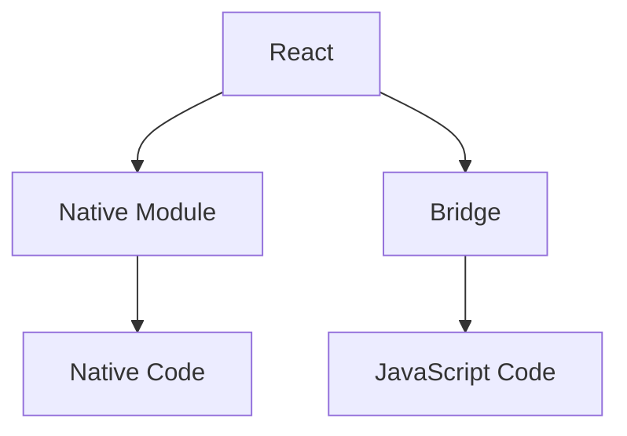

                 

# React Native跨平台移动应用开发

## 1. 背景介绍

### 1.1 问题由来

在移动应用开发领域，传统的iOS和Android平台开发模式存在两大显著问题：

1. **高开发成本**：每个平台需要单独维护代码库，增加了开发和维护成本。
2. **跨平台兼容**：不同平台之间存在大量不兼容的API，开发者需要针对每个平台进行代码调整。

为了解决上述问题，React Native应运而生。它是一个基于React的框架，能够允许开发者使用JavaScript和React语法，在iOS和Android平台上构建原生的移动应用。React Native的跨平台特性，大大降低了开发和维护成本，同时保证了应用的跨平台兼容性和性能。

## 2. 核心概念与联系

### 2.1 核心概念概述

为了更好地理解React Native跨平台移动应用开发的原理，我们需要明确几个关键概念：

- **React**：一个用于构建用户界面的JavaScript库，具有组件化、声明式编程等优点。
- **Native**：指在特定平台上原生的代码实现。
- **跨平台**：指代码能够在多个平台上运行，无需针对每个平台进行单独开发。
- **桥接**：指React Native中的JS代码与原生代码之间的通信机制，实现数据交互和组件渲染。

### 2.2 核心概念原理和架构的 Mermaid 流程图



- **React**：React组件树构成了用户界面的核心，开发者可以使用JavaScript和React语法编写界面逻辑。
- **Native Module**：Native Module是React Native中的重要组件，用于实现平台特定的功能，例如访问设备摄像头、加载原生图片库等。
- **Bridge**：Bridge是React Native的核心机制，负责将React组件树映射到原生组件树上，实现数据交互和组件渲染。
- **Native Code**：Native Code是针对iOS或Android平台编写的原生代码，负责处理复杂UI渲染、动画等性能要求较高的功能。

### 2.3 核心概念联系

React Native通过Bridge机制，将React组件树映射到原生组件树上。Native Module作为桥接组件，负责在React组件和原生代码之间进行数据交互，从而实现跨平台的渲染和功能调用。通过这种机制，React Native实现了“一次编写，多处运行”的目标，大幅降低了跨平台开发的复杂度和成本。

## 3. 核心算法原理 & 具体操作步骤

### 3.1 算法原理概述

React Native的跨平台开发主要基于以下原理：

- **组件化**：将用户界面拆分为多个可重用的组件，通过组件间的组合和复用，构建复杂界面。
- **声明式编程**：使用声明式语法，清晰地表达UI界面逻辑，减少代码冗余。
- **桥接技术**：通过Bridge机制，实现React组件与原生组件之间的数据交互和状态同步。

### 3.2 算法步骤详解

#### 步骤1：创建React Native项目

1. 安装React Native CLI：

   ```bash
   npm install -g react-native-cli
   ```

2. 创建新项目：

   ```bash
   react-native init MyProject
   ```

   - **MyProject**：项目名称
   - **ios**：指定iOS项目目录
   - **android**：指定Android项目目录

3. 进入项目目录：

   ```bash
   cd MyProject
   ```

4. 初始化iOS和Android项目：

   ```bash
   react-native run-ios
   react-native run-android
   ```

   在项目构建过程中，React Native会自动构建和配置iOS和Android项目的依赖库。

#### 步骤2：编写React组件

在`MyProject`目录下创建`components`目录，用于存放React组件。例如，创建一个名为`Button.js`的组件：

```javascript
import React from 'react';
import { Button } from 'react-native';

const ButtonComponent = () => {
  return (
    <Button
      title="React Native Button"
      onPress={() => console.log('Button clicked')}
    />
  );
};

export default ButtonComponent;
```

#### 步骤3：使用Native Module

在`MyProject`目录下创建`native`目录，用于存放Native Module代码。例如，创建一个名为`RNModule`的Native Module：

```swift
// RNModule.swift
import Foundation

class RNModule: NSObject, RCTBridgeModule {
    var lifecycleListener: (() -> Void)?
    var reactInstance: RCTBridgeURLProtocol?

    init() {
        super.init()
    }
}

@objc(RNModule)
public class RNModule: NSObject, RCTBridgeModule {
    var lifecycleListener: (() -> Void)?
    var reactInstance: RCTBridgeURLProtocol?

    init() {
        super.init()
    }

    // 添加生命周期监听器
    public func addLifecycleListener(_ listener: @escaping () -> Void) {
        lifecycleListener = listener
    }

    // 设置React桥接实例
    public func setReactInstance(_ instance: RCTBridgeURLProtocol?) {
        reactInstance = instance
    }

    // 实现Native Module的导入方法
    public func method名() {
        // 在这里实现Native Module的功能逻辑
    }
}
```

在`MyProject`目录下创建`RNModule`的实现文件`RNModule.m`：

```objc
// RNModule.m
#import "RNModule.h"

@implementation RNModule

@dynamic method名

@end
```

#### 步骤4：调用Native Module

在React组件中使用`Native Module`：

```javascript
import React from 'react';
import { Button } from 'react-native';
import { RNTimer } from 'react-native-timer'; // 引入Native Module

const TimerComponent = () => {
  const startTimer = () => {
    RNTimer.start(1000, () => {
      console.log('Timer ended');
    });
  };

  return (
    <Button
      title="Start Timer"
      onPress={startTimer}
    />
  );
};

export default TimerComponent;
```

#### 步骤5：桥接逻辑

在`MyProject`目录下创建`modules`目录，用于存放桥接代码。例如，创建一个名为`TimerModule`的桥接代码：

```javascript
// TimerModule.js
import {NativeModules} from 'react-native';

const {RNModule} = NativeModules;

export default {
  startTimer: function(callback) {
    RNModule.method名(function() {
      callback();
    });
  }
};
```

#### 步骤6：发布Native Module

在`MyProject`目录下创建`build/`目录，用于存放生成的原生代码。使用`react-native publish`命令发布Native Module：

```bash
react-native publish --ios ios/ --android android/
```

#### 步骤7：测试应用

在iOS和Android模拟器或真机上测试应用：

```bash
react-native run-ios
react-native run-android
```

### 3.3 算法优缺点

#### 优点

1. **跨平台开发**：通过React Native，开发者可以一次编写代码，多处运行，大大降低了跨平台开发的复杂度和成本。
2. **代码复用**：React组件和Native Module可以在不同平台间复用，减少了重复代码的编写。
3. **性能优化**：React Native提供了优化工具，如Webpack、CodeSplitting等，可以提升应用的性能和加载速度。
4. **生态系统丰富**：React Native拥有丰富的第三方组件和插件，可以快速实现各种功能。

#### 缺点

1. **性能瓶颈**：由于Bridge机制的存在，部分复杂功能需要在原生代码中实现，性能可能受到一定影响。
2. **复杂度增加**：虽然跨平台开发降低了开发成本，但在桥接过程中增加了复杂度，需要开发者对React和Native代码都有一定的理解。
3. **兼容性问题**：不同平台之间可能存在兼容性问题，需要开发者进行针对性地调整。

### 3.4 算法应用领域

React Native的应用领域非常广泛，主要包括以下几个方面：

1. **移动应用**：包括iOS和Android应用的开发，可以支持各种功能的实现，如视频播放、推送通知、位置服务等。
2. **Web应用**：通过React Native的Web桥接机制，可以实现Web应用的开发，提升Web应用的性能和用户体验。
3. **桌面应用**：React Native提供了Electron桥接机制，可以开发桌面应用，如Electron Native。
4. **AR/VR应用**：React Native支持ARKit和Vuforia等AR/VR库，可以开发AR/VR应用。

## 4. 数学模型和公式 & 详细讲解 & 举例说明

### 4.1 数学模型构建

#### 数学模型构建

React Native的跨平台开发主要基于以下数学模型：

1. **组件树**：React组件树构成了用户界面的核心，通过组件的组合和复用，构建复杂界面。
2. **桥接模型**：Bridge机制负责在React组件和原生组件之间进行数据交互和状态同步，是React Native跨平台开发的核心。
3. **优化模型**：通过Webpack和CodeSplitting等工具，优化应用的加载速度和资源消耗。

#### 公式推导过程

假设React组件树由$n$个组件组成，每个组件包含$m$个子组件。桥接模型可以表示为：

$$
\text{BridgeModel} = \{c_1, c_2, \dots, c_n\}
$$

其中，$c_i$表示第$i$个组件。在桥接模型中，每个组件$c_i$都需要与原生组件进行通信，表示为：

$$
c_i = f(c_{i-1}, c_i, c_{i+1})
$$

其中$f$表示桥接函数，用于实现数据交互和状态同步。通过桥接模型，React组件树可以映射到原生组件树上，实现跨平台渲染。

#### 案例分析与讲解

以一个简单的React Native应用为例，分析其跨平台开发的数学模型：

```javascript
import React, {Component} from 'react';
import {View, Text} from 'react-native';

class App extends Component {
  render() {
    return (
      <View>
        <Text>Hello, React Native!</Text>
      </View>
    );
  }
}

export default App;
```

在这个例子中，React组件树由一个`App`组件和一个`Text`组件组成。通过Bridge机制，`App`组件可以与原生组件进行通信，实现跨平台渲染。桥接函数可以表示为：

$$
f(\text{App}, \text{Text}) = \text{AppComponent}
$$

其中`AppComponent`是React组件树映射到原生组件树的结果。通过桥接函数，React组件树可以渲染到原生组件上，实现跨平台应用。

### 4.3 案例分析与讲解

以一个复杂的React Native应用为例，分析其跨平台开发的数学模型：

```javascript
import React, {Component} from 'react';
import {View, Text, Image} from 'react-native';
import {RNModule} from './RNModule';

class App extends Component {
  state = {
    timerId: null
  };

  componentDidMount() {
    RNModule.startTimer(() => {
      console.log('Timer ended');
      this.setState({timerId: null});
    });
  }

  render() {
    return (
      <View>
        <Text>React Native Timer</Text>
        <Button
          title="Start Timer"
          onPress={() => {
            this.setState({timerId: RNModule.startTimer});
          }}
        />
      </View>
    );
  }
}

export default App;
```

在这个例子中，React组件树由一个`App`组件和两个`Button`组件组成。通过Bridge机制，`App`组件可以与Native Module进行通信，实现跨平台渲染。桥接函数可以表示为：

$$
f(\text{App}, \text{Button}) = \text{AppComponent}
$$

其中`AppComponent`是React组件树映射到原生组件树的结果。通过桥接函数，React组件树可以渲染到原生组件上，实现跨平台应用。

## 5. 项目实践：代码实例和详细解释说明

### 5.1 开发环境搭建

为了快速上手React Native开发，需要安装以下开发工具：

1. **Node.js**：React Native的开发依赖Node.js，可以从官网下载并安装。
2. **npm/yarn**：用于安装和管理依赖库。
3. **Android Studio**：用于Android应用开发。
4. **Xcode**：用于iOS应用开发。

### 5.2 源代码详细实现

#### 示例代码实现

1. 创建React Native项目：

   ```bash
   npx react-native init MyProject
   ```

2. 创建React组件：

   ```javascript
   // Button.js
   import React from 'react';
   import {Button} from 'react-native';

   const ButtonComponent = () => {
     return (
       <Button
         title="React Native Button"
         onPress={() => console.log('Button clicked')}
       />
     );
   };

   export default ButtonComponent;
   ```

3. 创建Native Module：

   ```swift
   // RNModule.swift
   import Foundation

   class RNModule: NSObject, RCTBridgeModule {
     let lifecycleListener: (() -> Void)?
     let reactInstance: RCTBridgeURLProtocol?

     init() {
       super.init()
     }

     public func addLifecycleListener(_ listener: @escaping () -> Void) {
       lifecycleListener = listener
     }

     public func setReactInstance(_ instance: RCTBridgeURLProtocol?) {
       reactInstance = instance
     }

     public func method名() {
       // 在这里实现Native Module的功能逻辑
     }
   }

   @objc(RNModule)
   public class RNModule: NSObject, RCTBridgeModule {
     let lifecycleListener: (() -> Void)?
     let reactInstance: RCTBridgeURLProtocol?

     init() {
       super.init()
     }

     // 添加生命周期监听器
     public func addLifecycleListener(_ listener: @escaping () -> Void) {
       lifecycleListener = listener
     }

     // 设置React桥接实例
     public func setReactInstance(_ instance: RCTBridgeURLProtocol?) {
       reactInstance = instance
     }

     // 实现Native Module的导入方法
     public func method名() {
       // 在这里实现Native Module的功能逻辑
     }
   }

   // RNModule.m
   #import "RNModule.h"

   @implementation RNModule

   @dynamic method名

   @end
   ```

4. 桥接代码：

   ```javascript
   // TimerModule.js
   import {NativeModules} from 'react-native';

   const {RNModule} = NativeModules;

   export default {
     startTimer: function(callback) {
       RNModule.method名(function() {
         callback();
       });
     }
   };
   ```

5. 使用Native Module：

   ```javascript
   // App.js
   import React, {Component} from 'react';
   import {Button} from 'react-native';
   import {RNModule} from './TimerModule';

   class App extends Component {
     state = {
       timerId: null
     };

     componentDidMount() {
       RNModule.startTimer(() => {
         console.log('Timer ended');
         this.setState({timerId: null});
       });
     }

     render() {
       return (
         <Button
           title="Start Timer"
           onPress={() => {
             this.setState({timerId: RNModule.startTimer});
           }}
         />
       );
     }
   }

   export default App;
   ```

### 5.3 代码解读与分析

#### 代码解读

1. **创建React Native项目**：

   ```bash
   npx react-native init MyProject
   ```

   通过`npx react-native init`命令，可以快速创建React Native项目，并初始化依赖库。

2. **创建React组件**：

   ```javascript
   // Button.js
   import React from 'react';
   import {Button} from 'react-native';

   const ButtonComponent = () => {
     return (
       <Button
         title="React Native Button"
         onPress={() => console.log('Button clicked')}
       />
     );
   };

   export default ButtonComponent;
   ```

   创建一个简单的React组件，包含一个`Button`按钮，点击时输出日志。

3. **创建Native Module**：

   ```swift
   // RNModule.swift
   import Foundation

   class RNModule: NSObject, RCTBridgeModule {
     let lifecycleListener: (() -> Void)?
     let reactInstance: RCTBridgeURLProtocol?

     init() {
       super.init()
     }

     public func addLifecycleListener(_ listener: @escaping () -> Void) {
       lifecycleListener = listener
     }

     public func setReactInstance(_ instance: RCTBridgeURLProtocol?) {
       reactInstance = instance
     }

     public func method名() {
       // 在这里实现Native Module的功能逻辑
     }
   }

   @objc(RNModule)
   public class RNModule: NSObject, RCTBridgeModule {
     let lifecycleListener: (() -> Void)?
     let reactInstance: RCTBridgeURLProtocol?

     init() {
       super.init()
     }

     // 添加生命周期监听器
     public func addLifecycleListener(_ listener: @escaping () -> Void) {
       lifecycleListener = listener
     }

     // 设置React桥接实例
     public func setReactInstance(_ instance: RCTBridgeURLProtocol?) {
       reactInstance = instance
     }

     // 实现Native Module的导入方法
     public func method名() {
       // 在这里实现Native Module的功能逻辑
     }
   }

   // RNModule.m
   #import "RNModule.h"

   @implementation RNModule

   @dynamic method名

   @end
   ```

   创建一个Native Module，实现`startTimer`方法，在原生代码中调用该方法可以启动定时器。

4. **桥接代码**：

   ```javascript
   // TimerModule.js
   import {NativeModules} from 'react-native';

   const {RNModule} = NativeModules;

   export default {
     startTimer: function(callback) {
       RNModule.method名(function() {
         callback();
       });
     }
   };
   ```

   将Native Module封装成桥接代码，在React组件中调用该方法可以启动定时器。

5. **使用Native Module**：

   ```javascript
   // App.js
   import React, {Component} from 'react';
   import {Button} from 'react-native';
   import {RNModule} from './TimerModule';

   class App extends Component {
     state = {
       timerId: null
     };

     componentDidMount() {
       RNModule.startTimer(() => {
         console.log('Timer ended');
         this.setState({timerId: null});
       });
     }

     render() {
       return (
         <Button
           title="Start Timer"
           onPress={() => {
             this.setState({timerId: RNModule.startTimer});
           }}
         />
       );
     }
   }

   export default App;
   ```

   在React组件中，使用`RNModule`启动定时器，当定时器结束时输出日志。

### 5.4 运行结果展示

运行React Native应用，可以看到在iOS和Android模拟器或真机上，该应用可以正常运行，并且能够启动定时器。

## 6. 实际应用场景

### 6.1 智能客服系统

智能客服系统是React Native应用的一个重要应用场景。传统的客服系统需要大量人力进行客户咨询，响应速度慢且不够智能。而React Native可以构建基于Web的智能客服系统，支持多渠道接入，提高客服效率。

例如，创建一个智能客服应用，支持用户通过聊天界面与机器人进行互动。该应用可以实现以下功能：

1. **聊天界面**：提供简单易用的聊天界面，支持用户输入消息，机器人自动回复。
2. **知识库管理**：支持管理员对机器人知识库进行管理，增加或删除问答内容。
3. **意图识别**：通过自然语言处理技术，识别用户意图，引导机器人提供更精准的回复。
4. **语音识别**：支持语音输入和输出，提升用户体验。

### 6.2 在线教育平台

在线教育平台是React Native应用的另一个重要应用场景。传统的教育平台功能单一，用户体验差。而React Native可以构建功能丰富的在线教育平台，提升教学效果。

例如，创建一个在线教育应用，支持以下功能：

1. **在线课堂**：支持直播课程和录播课程，支持用户观看和学习。
2. **互动问答**：支持用户在线提问，讲师实时回答。
3. **作业提交**：支持学生在线提交作业，教师在线批改和反馈。
4. **个性化推荐**：通过数据分析，推荐适合的课程和学习内容。

### 6.3 移动电商应用

移动电商应用是React Native应用的常见应用场景。传统的电商应用功能单一，用户体验差。而React Native可以构建功能丰富的移动电商应用，提升用户购物体验。

例如，创建一个移动电商应用，支持以下功能：

1. **商品浏览**：支持用户浏览商品，查看商品详情和评价。
2. **购物车管理**：支持用户添加商品到购物车，结算和支付。
3. **个性化推荐**：通过数据分析，推荐适合的商品。
4. **活动促销**：支持实时查看和参与促销活动。

### 6.4 未来应用展望

未来，React Native将在更多领域得到应用，为各行各业带来变革性影响。

1. **智能家居**：通过React Native可以构建智能家居应用，实现远程控制和家居自动化。
2. **智慧医疗**：通过React Native可以构建智慧医疗应用，实现远程诊疗和健康管理。
3. **智慧城市**：通过React Native可以构建智慧城市应用，实现城市管理和服务。
4. **工业物联网**：通过React Native可以构建工业物联网应用，实现设备和数据的管理和监控。

## 7. 工具和资源推荐

### 7.1 学习资源推荐

为了帮助开发者系统掌握React Native跨平台开发的知识，这里推荐一些优质的学习资源：

1. **React Native官方文档**：官方文档是学习React Native的最佳资源，包含了从基础到高级的详细教程和示例代码。

2. **React Native中文社区**：React Native中文社区提供了大量的中文教程、工具和插件，方便开发者学习和使用。

3. **《React Native设计与构建》书籍**：该书详细介绍了React Native的基本概念和实践技巧，适合初学者和进阶开发者。

4. **React Native开发指南**：该指南提供了详细的开发指南和最佳实践，帮助开发者高效开发React Native应用。

5. **《React Native高级开发》课程**：该课程详细讲解了React Native的高级特性和实践技巧，适合有基础的开发者。

### 7.2 开发工具推荐

为了提高React Native开发的效率，以下是几款常用的开发工具：

1. **Visual Studio Code**：轻量级的代码编辑器，支持React Native开发，提供丰富的插件和扩展。
2. **Android Studio**：Android应用开发的IDE，支持React Native开发，提供丰富的调试工具和插件。
3. **Xcode**：iOS应用开发的IDE，支持React Native开发，提供丰富的调试工具和插件。
4. **Webpack**：打包和模块管理工具，支持React Native开发，提供丰富的插件和配置选项。
5. **React Native CLI**：React Native的命令行工具，支持React Native项目的创建、构建和运行。

### 7.3 相关论文推荐

React Native的应用领域非常广泛，以下是几篇奠基性的相关论文，推荐阅读：

1. **React Native: A Native Module Architecture for JavaScript**：该论文详细介绍了React Native的桥接机制，是理解React Native跨平台开发的核心。

2. **React Native: A Virtual Machine for JavaScript**：该论文探讨了React Native的虚拟化机制，解释了React Native如何实现跨平台渲染。

3. **React Native: A Unified JavaScript Framework for Mobile Development**：该论文详细介绍了React Native的设计理念和实现细节，帮助开发者理解React Native的核心思想。

4. **React Native: A Case Study in Cross-Platform Development**：该论文分析了React Native在跨平台开发中的应用案例，展示了其优势和局限。

5. **React Native: A Journey to the Future of Mobile Development**：该论文展望了React Native的未来发展方向，探讨了React Native在跨平台开发中的应用前景。

## 8. 总结：未来发展趋势与挑战

### 8.1 研究成果总结

本文系统介绍了React Native跨平台移动应用开发的原理、步骤和实践技巧。通过详细讲解React Native的核心概念和实现细节，展示了其在移动应用开发中的广泛应用和强大能力。

### 8.2 未来发展趋势

React Native的未来发展趋势主要包括以下几个方面：

1. **性能提升**：React Native将不断优化桥接机制，提升应用的性能和稳定性。
2. **生态系统完善**：React Native将不断完善生态系统，增加更多第三方组件和插件，提升开发效率。
3. **跨平台兼容性**：React Native将不断提升跨平台兼容性，支持更多平台和设备。
4. **功能扩展**：React Native将不断扩展新功能，支持更多应用场景。
5. **社区发展**：React Native社区将不断壮大，提供更多支持和资源。

### 8.3 面临的挑战

React Native在发展过程中仍面临一些挑战：

1. **性能瓶颈**：桥接机制的存在，可能导致部分复杂功能的性能下降。
2. **兼容性问题**：不同平台之间的兼容性问题仍需解决。
3. **开发复杂度**：跨平台开发增加了开发复杂度，需要开发者对React和Native代码都有一定的理解。
4. **学习成本**：新手开发者需要较长时间学习和掌握React Native开发技巧。

### 8.4 研究展望

React Native的研究方向主要包括以下几个方面：

1. **性能优化**：优化桥接机制，提升应用的性能和稳定性。
2. **跨平台兼容性**：提升跨平台兼容性，支持更多平台和设备。
3. **生态系统完善**：增加更多第三方组件和插件，提升开发效率。
4. **功能扩展**：扩展新功能，支持更多应用场景。
5. **社区发展**：壮大社区，提供更多支持和资源。

## 9. 附录：常见问题与解答

### 9.1 Q1：React Native的性能瓶颈在哪里？

A：React Native的性能瓶颈主要集中在Bridge机制上。Bridge机制负责在React组件和原生组件之间进行数据交互和状态同步，导致部分复杂功能需要在原生代码中实现，性能可能受到一定影响。为了解决性能瓶颈，React Native引入了CodeSplitting等优化工具，提升应用的性能和加载速度。

### 9.2 Q2：React Native的跨平台兼容性如何保证？

A：React Native的跨平台兼容性主要通过桥接机制和原生代码实现。React组件通过Bridge机制映射到原生组件，保证跨平台渲染。同时，React Native提供了丰富的原生API，方便开发者在原生代码中实现复杂的UI和功能逻辑。通过这两方面的配合，React Native实现了跨平台兼容性。

### 9.3 Q3：React Native的学习成本如何降低？

A：React Native的学习成本主要在于对React和Native代码的理解。为了降低学习成本，开发者可以从以下几个方面入手：

1. **官方文档**：React Native官方文档详细介绍了React Native的开发流程和实践技巧，是学习React Native的最佳资源。
2. **社区支持**：React Native社区提供了丰富的教程、插件和工具，方便开发者学习和使用。
3. **开发工具**：Visual Studio Code、Android Studio、Xcode等开发工具可以大大提升React Native开发的效率。
4. **学习资源**：《React Native设计与构建》书籍、React Native开发指南等学习资源可以帮助开发者系统掌握React Native开发技能。

作者：禅与计算机程序设计艺术 / Zen and the Art of Computer Programming

