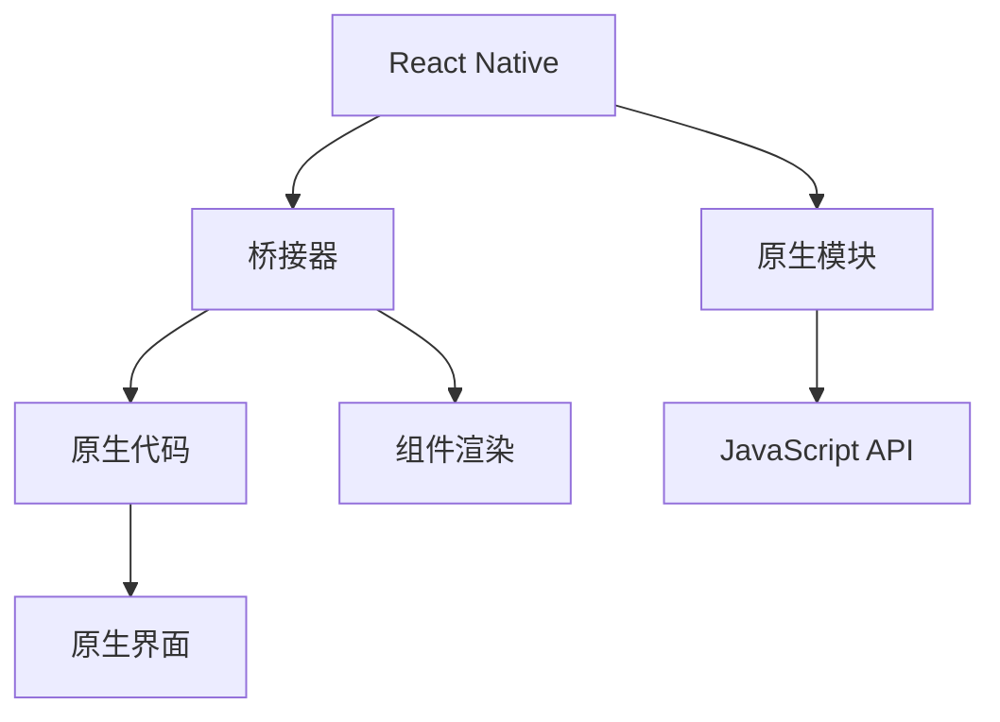

                 

# React Native：构建跨平台移动应用程序

在当今数字化时代，移动应用程序开发的重要性不言而喻。无论是个人应用还是企业级解决方案，移动应用都已成为连接用户与数字世界的桥梁。然而，构建一个跨平台的移动应用，往往需要耗费大量的时间和资源，特别是在维护和更新上。为了解决这个问题，React Native应运而生。本文将深入探讨React Native的核心概念、原理、操作步骤、实际应用，并展望其未来发展方向，同时提供详细的项目实践和资源推荐。

## 1. 背景介绍

### 1.1 问题由来

传统的移动应用开发，通常需要分别针对iOS和Android平台进行开发和维护，即使用Objective-C或Swift开发iOS应用，使用Java或Kotlin开发Android应用。这种“一次编写，多次维护”的方式不仅耗时耗力，还容易导致平台间的代码差异，增加了开发和维护成本。

随着移动设备用户基数的不断增长，跨平台开发的需求日益增长。企业需要快速响应市场变化，推出适应不同平台的应用，同时节省开发成本，提高应用质量和效率。

### 1.2 问题核心关键点

React Native的核心在于其“一次编写，多平台运行”的跨平台特性。它使用JavaScript和React框架，允许开发者使用相同的代码库，构建原生级别的iOS和Android应用。这种开发方式不仅提高了开发效率，还降低了维护成本。

React Native的工作原理是，通过将JavaScript代码编译为原生代码，从而实现跨平台应用。它支持热更新，开发者可以在不停止应用运行的情况下，对代码进行修改和部署，进一步提升了开发效率。

## 2. 核心概念与联系

### 2.1 核心概念概述

为更好地理解React Native的核心概念和原理，本节将介绍几个关键概念：

- **React Native**：由Facebook开发的开源框架，用于构建原生级别的iOS和Android应用。它将JavaScript和React框架与原生平台桥接，实现跨平台开发。

- **JSX**：一种JavaScript的语法扩展，用于描述组件的结构和属性。通过JSX，开发者可以直观地描述组件的UI和行为，而无需处理原生平台的复杂性。

- **桥接器**：React Native中负责将JavaScript代码转换为原生代码的组件。桥接器使用原生代码实现各种操作，如触摸、动画等，同时通过JavaScript API与开发者交互。

- **热更新(Hot Reloading)**：一种功能，允许开发者在运行时即时更新代码，而无需重新编译和部署应用。热更新依赖于开发者本地构建的调试工具。

- **原生模块**：React Native提供了一套API，允许开发者使用原生模块访问平台特有的功能，如相机、位置、通知等。原生模块通常使用Objective-C或Java编写，并通过桥接器与JavaScript交互。

这些核心概念之间通过React Native的架构和桥接机制紧密联系在一起，共同构成了React Native的跨平台开发框架。通过理解这些概念，我们可以更好地把握React Native的工作原理和开发方式。

### 2.2 核心概念原理和架构的 Mermaid 流程图(Mermaid 流程节点中不要有括号、逗号等特殊字符)



这个流程图展示了React Native的核心架构：

1. React Native通过桥接器将JavaScript代码转换为原生代码。
2. 桥接器通过原生代码实现各种操作，如触摸、动画等。
3. 原生模块提供平台特有的功能，如相机、位置等。
4. 组件渲染将组件结构映射到原生界面。

## 3. 核心算法原理 & 具体操作步骤

### 3.1 算法原理概述

React Native的跨平台开发依赖于桥接器和原生模块。其核心算法原理可以概括为以下几点：

1. **桥接器**：将JavaScript代码转换为原生代码，并实现与原生系统的交互。桥接器是React Native的核心组件，负责处理所有的平台特有操作。

2. **原生模块**：提供平台特有的功能，如相机、位置等。原生模块使用原生语言编写，并通过桥接器与JavaScript交互。

3. **热更新**：允许开发者在运行时即时更新代码，而无需重新编译和部署应用。热更新依赖于开发者本地构建的调试工具。

4. **组件渲染**：将组件结构映射到原生界面，实现跨平台UI一致性。

### 3.2 算法步骤详解

以下是React Native跨平台开发的核心步骤：

**Step 1: 环境准备**

- 安装Node.js和npm，配置开发环境。
- 安装React Native CLI工具，创建新项目。

**Step 2: 初始化项目**

- 使用React Native CLI工具，创建新项目。
- 配置项目依赖，如React Native CLI、React Native core和React Native core libraries。

**Step 3: 组件开发**

- 使用JSX语法，定义组件的结构和属性。
- 编写组件的逻辑和行为。
- 使用原生模块，访问平台特有的功能。

**Step 4: 组件渲染**

- 使用组件渲染API，将组件结构映射到原生界面。
- 实现跨平台UI一致性。

**Step 5: 热更新**

- 使用热更新工具，即时更新代码。
- 在运行时加载新代码，避免应用停机。

**Step 6: 发布应用**

- 使用React Native CLI工具，生成构建文件。
- 将构建文件打包为iOS和Android应用。

**Step 7: 测试与优化**

- 在多个设备上测试应用，验证跨平台一致性。
- 优化性能和用户体验。

通过以上步骤，开发者可以使用React Native快速构建跨平台移动应用，提升开发效率，降低维护成本。

### 3.3 算法优缺点

React Native具有以下优点：

1. **跨平台开发**：使用相同的代码库，构建原生级别的iOS和Android应用，节省了时间和资源。

2. **热更新**：允许开发者在运行时即时更新代码，提高开发效率。

3. **组件复用**：使用相同的组件库，减少代码重复，提升开发效率。

4. **平台一致性**：通过组件渲染API，实现跨平台UI一致性。

5. **生态系统**：丰富的第三方组件和库，帮助开发者快速实现各种功能。

然而，React Native也存在一些缺点：

1. **性能瓶颈**：由于依赖原生桥接器，部分操作可能存在性能瓶颈。

2. **学习曲线**：需要掌握JavaScript、React和原生模块的开发，有一定学习曲线。

3. **跨平台限制**：部分原生操作可能不支持跨平台，需要额外的代码处理。

4. **热更新限制**：热更新可能存在兼容性问题，需要开发者谨慎使用。

5. **调试复杂性**：跨平台调试可能存在一定的复杂性，需要开发者具备一定的调试技巧。

尽管存在这些缺点，但React Native凭借其跨平台特性和高效开发方式，已经在移动应用开发领域占据了一席之地。

### 3.4 算法应用领域

React Native广泛应用于各种跨平台移动应用开发，包括但不限于以下领域：

1. **企业级应用**：如CRM、ERP、OA等，需要快速响应市场需求，同时降低维护成本。

2. **社交网络应用**：如微信、微博等，需要构建统一的UI界面，提升用户体验。

3. **游戏应用**：如休闲游戏、MOBA游戏等，需要高效开发和快速迭代。

4. **教育应用**：如在线课程、虚拟实验室等，需要跨平台支持，实现无缝体验。

5. **健康医疗应用**：如远程诊疗、健康管理等，需要跨平台支持，提升用户粘性。

6. **金融应用**：如移动支付、理财应用等，需要高效开发和安全性保障。

## 4. 数学模型和公式 & 详细讲解 & 举例说明（备注：数学公式请使用latex格式，latex嵌入文中独立段落使用 $$，段落内使用 $)
### 4.1 数学模型构建

在React Native中，数学模型的构建通常涉及以下内容：

1. **组件的数学模型**：描述组件的UI结构和布局。

2. **原生模块的数学模型**：描述平台特有的功能。

3. **热更新的数学模型**：描述代码更新的过程和效果。

### 4.2 公式推导过程

**组件的数学模型**

假设有一个React组件，其UI结构可以描述为：

```javascript
import React from 'react';
import { View, Text } from 'react-native';

const MyComponent = () => {
  return (
    <View style={styles.container}>
      <Text style={styles.text}>Hello, React Native!</Text>
    </View>
  );
};

const styles = StyleSheet.create({
  container: {
    flex: 1,
    justifyContent: 'center',
    alignItems: 'center',
    backgroundColor: '#F5FCFF',
  },
  text: {
    fontSize: 30,
  },
});

export default MyComponent;
```

在上述代码中，我们定义了一个包含一个`<Text>`组件的`<View>`组件。通过JSX语法，我们描述了组件的结构和属性。

**原生模块的数学模型**

假设我们需要使用原生相机模块，可以编写如下代码：

```javascript
import React from 'react';
import { View, Text, CameraRoll } from 'react-native';

const MyComponent = () => {
  const takePicture = async () => {
    const image = await CameraRoll.takePicture();
    console.log('Picture taken:', image);
  };

  return (
    <View style={styles.container}>
      <Text style={styles.text}>Take a picture!</Text>
      <Button title="Take a picture" onPress={takePicture} />
    </View>
  );
};

const styles = StyleSheet.create({
  container: {
    flex: 1,
    justifyContent: 'center',
    alignItems: 'center',
    backgroundColor: '#F5FCFF',
  },
  text: {
    fontSize: 30,
  },
});

export default MyComponent;
```

在上述代码中，我们使用了`CameraRoll`原生模块，实现了拍照功能。

**热更新的数学模型**

热更新可以描述为：

1. 开发者在本地构建环境中修改代码。

2. 热更新工具加载新代码，生成新的构建文件。

3. 应用加载新的构建文件，更新UI。

热更新过程可以表示为：

$$
\text{热更新} = \text{本地构建} \rightarrow \text{新构建文件} \rightarrow \text{应用更新}
$$

### 4.3 案例分析与讲解

假设我们需要实现一个简单的跨平台导航器，可以通过以下步骤进行开发：

1. 使用React Native CLI工具，创建新项目。

2. 安装`react-navigation`库，配置导航器。

3. 编写两个页面组件，如`Home`和`Details`。

4. 在`App.js`中配置导航器，实现页面切换。

5. 运行应用，测试导航器效果。

6. 通过热更新工具，修改页面代码，并即时验证效果。

通过上述案例，我们可以看到React Native的跨平台特性和热更新功能如何应用于实际开发中。

## 5. 项目实践：代码实例和详细解释说明

### 5.1 开发环境搭建

进行React Native项目开发，需要以下环境配置：

1. 安装Node.js和npm，配置开发环境。

2. 安装React Native CLI工具。

3. 安装`react-navigation`库和其他必要的依赖。

4. 创建新项目，编写初始代码。

### 5.2 源代码详细实现

以下是一个简单的React Native项目的代码实现：

```javascript
import React from 'react';
import { View, Text, Button, StyleSheet } from 'react-native';
import { NavigationContainer } from '@react-navigation/native';
import { createStackNavigator } from '@react-navigation/stack';

const HomeScreen = () => {
  return (
    <View style={styles.container}>
      <Text style={styles.text}>Home Screen</Text>
    </View>
  );
};

const DetailsScreen = () => {
  return (
    <View style={styles.container}>
      <Text style={styles.text}>Details Screen</Text>
    </View>
  );
};

const Stack = createStackNavigator();

const App = () => {
  return (
    <NavigationContainer>
      <Stack.Navigator>
        <Stack.Screen name="Home" component={HomeScreen} />
        <Stack.Screen name="Details" component={DetailsScreen} />
      </Stack.Navigator>
    </NavigationContainer>
  );
};

const styles = StyleSheet.create({
  container: {
    flex: 1,
    justifyContent: 'center',
    alignItems: 'center',
    backgroundColor: '#F5FCFF',
  },
  text: {
    fontSize: 30,
  },
});

export default App;
```

### 5.3 代码解读与分析

在上述代码中，我们使用了`react-navigation`库来实现导航器。通过`NavigationContainer`组件，我们创建了一个导航器，并使用`Stack.Navigator`组件来定义两个页面：`HomeScreen`和`DetailsScreen`。每个页面都是一个简单的`<View>`组件，包含一个`<Text>`组件。

### 5.4 运行结果展示

运行上述代码，可以得到一个简单的跨平台导航器，支持页面切换和热更新。

```shell
react-native run-ios
react-native run-android
```

## 6. 实际应用场景

### 6.1 智能客服系统

React Native可以应用于智能客服系统的构建，快速开发和部署客服应用。通过热更新和组件复用，开发者可以高效实现用户界面和功能逻辑。

### 6.2 金融舆情监测

React Native可以应用于金融舆情监测系统，实时监控市场舆情，并提供智能分析。通过原生模块和热更新，系统可以快速响应市场变化，提升数据处理效率。

### 6.3 个性化推荐系统

React Native可以应用于个性化推荐系统，通过组件渲染和热更新，系统可以快速更新推荐算法，提升用户体验。

### 6.4 未来应用展望

随着React Native的发展，未来的应用场景将更加广阔。React Native将进一步融合人工智能、机器学习等技术，提升应用的智能化水平。

## 7. 工具和资源推荐

### 7.1 学习资源推荐

以下是一些学习React Native的优质资源：

1. React Native官方文档：详细介绍了React Native的各个组件和API。

2. React Native社区：提供了丰富的示例代码和社区讨论。

3. React Native学习教程：由官方提供的入门教程，适合初学者。

4. React Native实战项目：通过实战项目，深入理解React Native的开发流程。

### 7.2 开发工具推荐

以下是一些常用的React Native开发工具：

1. React Native CLI：官方提供的开发工具，支持快速创建项目和运行应用。

2. Expo：提供了跨平台的开发环境和集成服务，适合快速开发和部署应用。

3. Android Studio和Xcode：原生开发工具，支持调试和测试原生模块。

4. Visual Studio Code：常用的代码编辑器，支持多种语言的代码编写。

### 7.3 相关论文推荐

以下是一些相关的论文，推荐阅读：

1. React Native: Cross-platform mobile development made easy：介绍React Native的核心特性和开发流程。

2. React Native: Cross-platform mobile development with JavaScript and React：介绍React Native的跨平台特性和开发方式。

3. React Native: Building real-world mobile applications with JavaScript and React：介绍React Native的实际应用案例。

## 8. 总结：未来发展趋势与挑战

### 8.1 研究成果总结

React Native作为跨平台开发的重要工具，已经得到了广泛应用。其核心特性包括跨平台开发、热更新、组件复用等，极大地提升了开发效率和应用质量。

### 8.2 未来发展趋势

React Native的未来发展趋势包括：

1. 功能增强：引入更多原生模块和API，支持更多的平台特有功能。

2. 性能优化：优化原生桥接器，提升应用性能和用户体验。

3. 跨平台支持：支持更多的平台和设备，实现真正的全平台支持。

4. 组件库扩展：引入更多的第三方组件库，提升开发效率。

5. 社区生态：建立更活跃的社区生态，促进开发者交流和合作。

### 8.3 面临的挑战

尽管React Native取得了诸多成就，但仍面临一些挑战：

1. 性能瓶颈：部分操作可能存在性能瓶颈，需要进一步优化。

2. 跨平台限制：部分原生操作可能不支持跨平台，需要额外的代码处理。

3. 热更新限制：热更新可能存在兼容性问题，需要开发者谨慎使用。

4. 学习曲线：需要掌握JavaScript、React和原生模块的开发，有一定学习曲线。

5. 调试复杂性：跨平台调试可能存在一定的复杂性，需要开发者具备一定的调试技巧。

### 8.4 研究展望

未来，React Native需要在以下方向进行深入研究：

1. 性能优化：引入更多高性能的原生模块和优化算法，提升应用性能。

2. 组件库扩展：引入更多高质量的第三方组件库，提升开发效率。

3. 社区生态：建立更活跃的社区生态，促进开发者交流和合作。

4. 跨平台支持：支持更多的平台和设备，实现真正的全平台支持。

5. 功能增强：引入更多原生模块和API，支持更多的平台特有功能。

通过不断优化和创新，React Native必将在跨平台开发领域占据更加重要的地位，为开发者提供更高效、更便捷的开发方式。

## 9. 附录：常见问题与解答

### Q1: React Native的跨平台开发原理是什么？

A: React Native通过桥接器和原生模块实现跨平台开发。桥接器将JavaScript代码转换为原生代码，并实现与原生系统的交互。原生模块提供平台特有的功能，如相机、位置等。

### Q2: 如何使用热更新功能？

A: 热更新允许开发者在运行时即时更新代码。具体步骤包括：

1. 在本地构建环境中修改代码。

2. 使用热更新工具加载新代码，生成新的构建文件。

3. 应用加载新的构建文件，更新UI。

### Q3: React Native的性能瓶颈有哪些？

A: React Native可能存在的性能瓶颈包括：

1. 原生桥接器的性能开销。

2. 部分操作的性能瓶颈。

3. 热更新过程中的一些额外开销。

### Q4: React Native的学习曲线高吗？

A: 对于有JavaScript和React基础的人来说，React Native的学习曲线不算高。但需要掌握原生模块的开发，有一定学习曲线。

通过上述内容，相信读者已经对React Native有了全面的了解。React Native不仅可以帮助开发者快速构建跨平台应用，还能提升开发效率和应用质量，是跨平台开发的重要工具。希望本文能为您的React Native开发提供帮助，助您顺利实现跨平台移动应用开发。

---

作者：禅与计算机程序设计艺术 / Zen and the Art of Computer Programming

