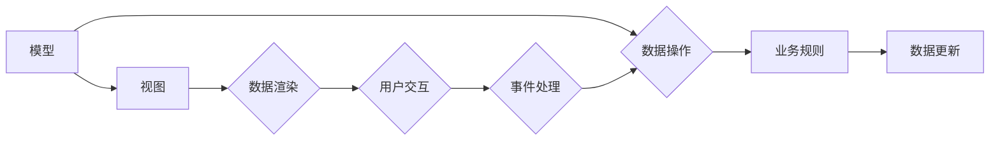

                 

## Angular 入门：Google 的 MVW 框架

> 关键词：Angular, MVW, TypeScript,组件,数据绑定,路由,单页应用,前端开发

### 1. 背景介绍

前端开发领域近年来发展迅速，各种框架和库层出不穷。其中，Angular 作为 Google 开发的开源框架，凭借其强大的功能和完善的生态系统，在单页应用 (SPA) 开发中占据着重要地位。Angular 基于 MVW (Model-View-Whatever) 架构，提供了一套完整的开发工具和最佳实践，帮助开发者构建高质量、可维护的 Web 应用。

### 2. 核心概念与联系

Angular 的 MVW 架构将应用程序逻辑分为三个主要部分：模型 (Model)、视图 (View) 和 Whatever (W)。

* **模型 (Model):** 负责处理应用程序的数据逻辑，包括数据存储、数据操作和业务规则。
* **视图 (View):** 负责呈现应用程序的用户界面，将模型中的数据渲染到页面上。
* **Whatever (W):**  这个部分可以是控制器、服务或其他逻辑组件，负责协调模型和视图之间的交互。

**Mermaid 流程图:**



**核心概念联系:**

* 模型负责管理应用程序的数据，视图负责呈现数据，Whatever 部分负责协调两者之间的交互。
* 数据变化会触发视图更新，用户交互会触发 Whatever 部分处理事件，进而更新模型数据。

### 3. 核心算法原理 & 具体操作步骤

Angular 的核心算法原理是基于数据绑定和组件化的思想。

#### 3.1  算法原理概述

* **数据绑定:** Angular 使用双向数据绑定机制，将模型中的数据与视图中的元素绑定在一起。当模型数据发生变化时，视图会自动更新；反之亦然。
* **组件化:** Angular 鼓励将应用程序拆分成小的、可复用的组件。每个组件都包含自己的模板、逻辑和数据，可以独立开发和测试。

#### 3.2  算法步骤详解

1. **定义模型:** 创建一个 JavaScript 对象或类来表示应用程序的数据结构。
2. **创建视图:** 使用 HTML 模板定义视图的结构，并使用 Angular 数据绑定语法将模型数据绑定到模板元素。
3. **编写组件逻辑:** 使用 TypeScript 创建组件类，并在其中编写处理业务逻辑的代码。
4. **组合组件:** 将多个组件组合在一起，构建应用程序的整体结构。
5. **使用路由:** 使用 Angular 路由模块实现应用程序的导航功能。

#### 3.3  算法优缺点

**优点:**

* **易于维护:** 组件化设计使得应用程序结构清晰，易于维护和扩展。
* **可复用性高:** 组件可以独立开发和测试，并可以被多个地方复用。
* **数据绑定高效:** 双向数据绑定机制简化了数据同步操作，提高了开发效率。

**缺点:**

* **学习曲线较陡:** Angular 的语法和概念相对复杂，需要一定的学习成本。
* **性能问题:** 在处理大量数据时，Angular 的数据绑定机制可能会导致性能问题。

#### 3.4  算法应用领域

Angular 广泛应用于各种类型的 Web 应用，例如：

* **单页应用 (SPA):** Angular 非常适合构建 SPA，因为它提供了高效的数据绑定和路由机制。
* **企业级应用:** Angular 的组件化设计和模块化架构使得它非常适合构建大型、复杂的企业级应用。
* **移动应用:** 使用 Angular 的 Ionic 框架可以开发跨平台的移动应用。

### 4. 数学模型和公式 & 详细讲解 & 举例说明

Angular 的 MVW 架构可以抽象为一个数学模型，其中模型、视图和 Whatever 部分分别对应不同的数学实体。

#### 4.1  数学模型构建

* **模型:** 可以用一个集合 $M$ 来表示，其中每个元素代表应用程序的数据属性。
* **视图:** 可以用一个函数 $V(M)$ 来表示，该函数将模型数据 $M$ 映射到用户界面元素的结构。
* **Whatever:** 可以用一个变换函数 $W(M, E)$ 来表示，该函数将模型数据 $M$ 和用户交互事件 $E$ 映射到模型数据的更新。

#### 4.2  公式推导过程

数据绑定机制可以表示为以下公式：

$$
M' = W(M, E)
$$

其中：

* $M'$ 是模型数据更新后的值。
* $M$ 是模型数据初始值。
* $E$ 是用户交互事件。

视图更新机制可以表示为：

$$
V'(M') = V(M')
$$

其中：

* $V'$ 是视图更新后的结构。
* $M'$ 是模型数据更新后的值。

#### 4.3  案例分析与讲解

例如，一个简单的文本输入框，模型数据为文本内容，视图为文本框元素，用户交互事件为输入框内容的改变。

* 当用户输入文本时，事件 $E$ 会触发 $W(M, E)$ 函数，更新模型数据 $M$。
* 模型数据更新后，视图 $V(M')$ 会自动更新，显示新的文本内容。

### 5. 项目实践：代码实例和详细解释说明

#### 5.1  开发环境搭建

1. 安装 Node.js 和 npm。
2. 使用 Angular CLI 创建一个新的项目：`ng new my-app`。
3. 启动开发服务器：`ng serve`。

#### 5.2  源代码详细实现

```typescript
// app.component.ts
import { Component } from '@angular/core';

@Component({
  selector: 'app-root',
  templateUrl: './app.component.html',
  styleUrls: ['./app.component.css']
})
export class AppComponent {
  title = 'Angular 入门';
  name = 'Zen';
}
```

```html
<!-- app.component.html -->
<h1>{{ title }}</h1>
<p>Hello, {{ name }}!</p>
```

#### 5.3  代码解读与分析

* `app.component.ts` 文件定义了一个名为 `AppComponent` 的组件。
* `@Component` 装饰器用于声明组件的元数据，例如选择器、模板路径和样式路径。
* `title` 和 `name` 是组件的属性，用于存储数据。
* `{{ title }}` 和 `{{ name }}` 是 Angular 数据绑定语法，用于将属性值绑定到模板元素。

#### 5.4  运行结果展示

启动开发服务器后，在浏览器中访问 `http://localhost:4200/`，将会看到标题 "Angular 入门" 和 "Hello, Zen!" 的文本。

### 6. 实际应用场景

Angular 在各种实际应用场景中都有广泛的应用，例如：

* **电商平台:** Angular 可以用于构建电商平台的商品展示、购物车、订单管理等功能。
* **社交媒体:** Angular 可以用于构建社交媒体平台的用户界面、消息推送、动态发布等功能。
* **企业管理系统:** Angular 可以用于构建企业管理系统的用户管理、权限控制、报表分析等功能。

#### 6.4  未来应用展望

随着 Web 技术的不断发展，Angular 将会继续演进，并应用于更多新的领域，例如：

* **虚拟现实 (VR) 和增强现实 (AR):** Angular 可以用于构建 VR 和 AR 应用的交互界面和用户体验。
* **物联网 (IoT):** Angular 可以用于构建物联网设备的控制界面和数据分析平台。
* **区块链:** Angular 可以用于构建区块链应用的钱包、交易记录和智能合约界面。

### 7. 工具和资源推荐

#### 7.1  学习资源推荐

* **Angular 官方文档:** https://angular.io/docs
* **Angular 中文网:** https://ng.cn/
* **Angular Udemy 课程:** https://www.udemy.com/topic/angular/

#### 7.2  开发工具推荐

* **Angular CLI:** https://angular.io/cli
* **Visual Studio Code:** https://code.visualstudio.com/
* **WebStorm:** https://www.jetbrains.com/webstorm/

#### 7.3  相关论文推荐

* **AngularJS: A Framework for Building Dynamic Web Applications:** https://www.researchgate.net/publication/263386415_AngularJS_A_Framework_for_Building_Dynamic_Web_Applications
* **Angular 2: A Comprehensive Overview:** https://www.researchgate.net/publication/319373500_Angular_2_A_Comprehensive_Overview

### 8. 总结：未来发展趋势与挑战

Angular 作为 Google 的旗舰前端框架，在 Web 开发领域占据着重要地位。其 MVW 架构、组件化设计和数据绑定机制，为开发者提供了高效、可维护的开发体验。

#### 8.1  研究成果总结

Angular 的发展历程见证了前端开发技术的进步，从 AngularJS 到 Angular 2+，框架不断迭代更新，功能更加强大，性能更加优越。

#### 8.2  未来发展趋势

* **更强大的组件化:** Angular 将会继续加强组件化设计，提供更丰富的组件库和工具，帮助开发者构建更复杂的应用。
* **更好的性能优化:** Angular 将会持续优化框架性能，提高处理大规模数据和复杂交互的效率。
* **更完善的生态系统:** Angular 的生态系统将继续扩展，提供更多第三方库、工具和服务，为开发者提供更全面的开发体验。

#### 8.3  面临的挑战

* **学习曲线:** Angular 的语法和概念相对复杂，对于初学者来说，学习曲线可能比较陡峭。
* **性能瓶颈:** 在处理大量数据时，Angular 的数据绑定机制可能会导致性能瓶颈。
* **竞争压力:** 前端框架市场竞争激烈，Angular 需要不断创新和迭代，才能保持领先地位。

#### 8.4  研究展望

未来，Angular 将会继续朝着更强大、更易用、更高效的方向发展，并应用于更多新的领域，为 Web 开发带来更多可能性。

### 9. 附录：常见问题与解答

**Q1: Angular 和 React 的区别是什么？**

**A1:** Angular 和 React 都是流行的前端框架，但它们有不同的设计理念和特点。Angular 是一个完整的 MVC 框架，提供了一套完整的开发工具和最佳实践，而 React 则是一个更轻量级的库，专注于视图层。

**Q2: 如何学习 Angular？**

**A2:** 可以参考 Angular 官方文档、中文网、Udemy 课程等资源进行学习。

**Q3: Angular 的性能如何？**

**A3:** Angular 的性能在处理大量数据时可能会出现瓶颈，但 Google 团队一直在努力优化框架性能。

**Q4: Angular 的未来发展趋势是什么？**

**A4:** Angular 将会继续加强组件化设计、优化性能、完善生态系统，并应用于更多新的领域。


作者：禅与计算机程序设计艺术 / Zen and the Art of Computer Programming 
<end_of_turn>

