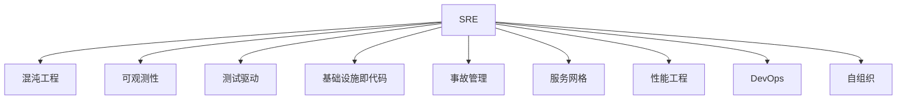

                 

# SRE混沌工程应用实践

> 关键词：
- SRE（Site Reliability Engineering）
- 混沌工程（Chaos Engineering）
- 可观测性（Observability）
- 测试驱动（Test-Driven Development, TDD）
- 基础设施即代码（Infrastructure as Code, IaC）
- 事故管理（Incident Management）
- 服务网格（Service Mesh）
- 性能工程（Performance Engineering）
- DevOps
- 自组织（Self-Organizing Systems）

## 1. 背景介绍

### 1.1 问题由来

在信息技术飞速发展的今天，互联网企业的业务规模和复杂度不断增加，用户数量激增，系统架构日趋庞大。然而，随着系统规模的不断扩大，企业的运维成本也不断攀升。传统IT运维团队面临的挑战也日益严峻：

1. **系统复杂度高**：分布式系统难以管理，微服务化导致服务数量爆炸，增加了复杂度。
2. **故障排除难度大**：当故障发生时，排查问题困难，缺乏有效的故障诊断工具和流程。
3. **响应速度慢**：问题响应时间过长，用户满意度下降。
4. **运维成本高**：随着系统规模的增大，运维人员和基础设施成本也随之增加。

### 1.2 问题核心关键点

混沌工程（Chaos Engineering）作为一种新兴的运维技术，通过在生产环境中主动引入故障和破坏性实验，来测试系统的鲁棒性和健壮性，从而确保系统的高可用性和可靠性。其核心思想是通过对系统进行混乱和故障模拟，提前发现系统中的问题，确保系统具备高可用性、高可扩展性、高性能和高效能等特性。

混沌工程不仅是运维团队提升系统稳定性的工具，也是整个组织提升对系统复杂性、可用性、性能和安全性等能力的保障。本文将详细阐述SRE中的混沌工程应用实践，帮助读者系统地掌握如何在实际工作中应用混沌工程，以提升系统可靠性。

## 2. 核心概念与联系

### 2.1 核心概念概述

为了更好地理解SRE中的混沌工程应用实践，本节将介绍几个关键概念：

1. **SRE（Site Reliability Engineering）**：负责构建和运营可用的服务基础设施，通过工程化手段保证服务的高可用性、高性能和稳定性。
2. **混沌工程（Chaos Engineering）**：一种在生产环境中通过引入故障和破坏性实验来测试系统鲁棒性的技术，旨在提前发现问题，确保系统的高可用性。
3. **可观测性（Observability）**：通过收集和分析系统状态信息，帮助运维团队快速诊断问题，提升系统可见性。
4. **测试驱动（Test-Driven Development, TDD）**：通过编写自动化测试来驱动开发和维护，提升代码质量和系统可靠性。
5. **基础设施即代码（Infrastructure as Code, IaC）**：通过代码管理基础设施配置，提升资源管理和部署的自动化和可重复性。
6. **事故管理（Incident Management）**：通过优化事故处理流程，减少事故响应时间和恢复时间，提升系统可靠性。
7. **服务网格（Service Mesh）**：一种分布式系统架构，通过透明的网络代理和分布式通信模型，提升系统可观测性和可靠性。
8. **性能工程（Performance Engineering）**：通过优化系统架构和性能指标，提升系统响应速度和资源利用效率。
9. **DevOps**：开发与运维团队的紧密协作，通过自动化和持续集成持续交付，提升开发效率和系统质量。
10. **自组织（Self-Organizing Systems）**：系统通过自我管理和自我优化，提高系统的稳定性和可靠性。

这些概念之间的逻辑关系可以通过以下Mermaid流程图来展示：



这个流程图展示了大规模分布式系统的运维过程中，各个概念之间的相互关系和作用：

1. **SRE**：负责全面推动系统的可靠性工程，集成和应用各种运维技术。
2. **混沌工程**：通过模拟故障和破坏性实验，提升系统的鲁棒性和健壮性。
3. **可观测性**：提供系统的可见性，帮助快速诊断问题。
4. **测试驱动**：通过自动化测试提升代码质量和系统可靠性。
5. **基础设施即代码**：提升资源管理和部署的自动化和可重复性。
6. **事故管理**：优化事故处理流程，减少事故响应时间和恢复时间。
7. **服务网格**：提升系统的可观测性和可靠性。
8. **性能工程**：优化系统架构和性能指标，提升系统响应速度和资源利用效率。
9. **DevOps**：提升开发效率和系统质量，实现自动化和持续交付。
10. **自组织**：系统通过自我管理和自我优化，提高系统的稳定性和可靠性。

这些概念共同构成了SRE中的混沌工程应用实践，为系统可靠性的提升提供了全面的保障。

## 3. 核心算法原理 & 具体操作步骤

### 3.1 算法原理概述

混沌工程的算法原理基于“错误是系统可靠性的一个重要方面”这一理念。通过主动引入故障和破坏性实验，测试系统在不同环境中的表现，从而提前发现问题，提升系统的鲁棒性和健壮性。

### 3.2 算法步骤详解

#### 3.2.1 确定目标

混沌工程的第一步是确定目标。目标是发现系统中的潜在风险和薄弱环节，以提升系统的整体可靠性和健壮性。目标应明确具体，且易于测试。

#### 3.2.2 设计实验

设计实验时应考虑系统的复杂性和风险，选择适当的故障注入方式和注入频率。实验应具有破坏性，但不应导致系统崩溃或重大故障。

#### 3.2.3 执行实验

在生产环境中执行实验，观察系统的反应。实验执行过程中应记录所有数据，包括日志、指标和事故信息。

#### 3.2.4 分析和优化

对实验结果进行分析，找出系统的薄弱环节和潜在风险。针对发现的问题进行优化和改进，确保系统在未来能够更好地应对类似情况。

### 3.3 算法优缺点

混沌工程具有以下优点：
1. **提前发现问题**：通过主动引入故障和破坏性实验，提前发现系统中的潜在问题，减少故障的发生频率。
2. **提高系统可靠性**：通过测试系统的鲁棒性和健壮性，提升系统的整体可靠性。
3. **提升运维效率**：通过自动化和系统化的方法，提升运维团队的工作效率。
4. **优化系统设计**：通过实验和分析，优化系统设计，提升系统的可用性和性能。

然而，混沌工程也存在一些缺点：
1. **资源消耗大**：实验的执行和数据收集需要大量资源，包括计算、存储和人力资源。
2. **实验风险高**：实验可能会引入实际故障或意外后果，需要谨慎设计和管理。
3. **复杂度增加**：实验设计和执行过程复杂，需要系统的架构和运维团队共同协作。

### 3.4 算法应用领域

混沌工程主要应用于以下几个领域：

1. **分布式系统**：通过在分布式系统中引入故障和破坏性实验，测试系统的鲁棒性和健壮性，提升系统的整体可靠性。
2. **微服务架构**：测试微服务之间的通信和协调能力，提升微服务架构的可靠性和稳定性。
3. **云计算**：测试云计算平台在高负载和故障情况下的表现，确保云服务的高可用性。
4. **大数据**：测试大数据处理框架的稳定性和性能，提升大数据系统的可靠性。
5. **安全领域**：测试系统的安全性和防护能力，确保系统的安全性和隐私保护。
6. **生产环境**：在实际生产环境中执行实验，测试系统的实际表现和可靠性。

## 4. 数学模型和公式 & 详细讲解 & 举例说明（备注：数学公式请使用latex格式，latex嵌入文中独立段落使用 $$，段落内使用 $)
### 4.1 数学模型构建

在混沌工程中，常用的数学模型包括：

1. **故障注入模型**：通过引入故障来测试系统的鲁棒性。
2. **系统可靠性模型**：通过可靠性理论来评估系统的故障率和服务时间。
3. **故障传播模型**：通过故障传播模型来评估故障在系统中的传播路径和影响范围。
4. **负载均衡模型**：通过负载均衡模型来优化系统资源分配，提升系统性能。

#### 4.1.1 故障注入模型

故障注入模型通过在系统中引入故障，测试系统的鲁棒性。假设系统在t时刻引入故障，则在t到t+d时间内，系统发生故障的概率为P。则系统的可靠性R可以表示为：

$$
R(t)=1-(1-P)^d
$$

其中，d为实验持续时间。

#### 4.1.2 系统可靠性模型

系统可靠性模型通过评估系统的故障率和服务时间，来计算系统的可靠性。假设系统故障率为λ，服务时间为T。则系统的可靠性R可以表示为：

$$
R(t)=e^{-\lambda t}
$$

其中，e为自然常数，t为时间。

#### 4.1.3 故障传播模型

故障传播模型通过评估故障在系统中的传播路径和影响范围，来优化故障处理和修复。假设系统中有n个节点，每个节点的故障传播概率为p，则节点i在时间t发生故障的概率为：

$$
P_i(t)=1-(1-p)^{t/DT}
$$

其中，D为节点间的距离，T为节点间通信时间。

#### 4.1.4 负载均衡模型

负载均衡模型通过优化系统资源分配，来提升系统性能。假设系统中有m个任务，每个任务的执行时间为t，则系统的负载均衡率为：

$$
\eta=\frac{m\cdot t}{T}
$$

其中，T为系统总执行时间。

### 4.2 公式推导过程

#### 4.2.1 故障注入模型推导

故障注入模型的推导基于泊松分布，假设系统在t时刻引入故障，则在t到t+d时间内，系统发生故障的概率为P。根据泊松分布的性质，系统在t到t+d时间内发生n次故障的概率为：

$$
P(n,t+d)=\frac{d^n}{n!}e^{-d}\cdot (1-(1-P)^d)^n
$$

当n=1时，系统发生一次故障的概率为：

$$
P(1,t+d)=\frac{d}{1!}e^{-d}\cdot (1-(1-P)^d)
$$

即系统的可靠性R可以表示为：

$$
R(t)=1-(1-P)^d
$$

#### 4.2.2 系统可靠性模型推导

系统可靠性模型的推导基于指数分布，假设系统故障率为λ，服务时间为T。根据指数分布的性质，系统在时间t内发生故障的概率为：

$$
P(t)=\lambda\cdot t
$$

则系统的可靠性R可以表示为：

$$
R(t)=e^{-\lambda t}
$$

#### 4.2.3 故障传播模型推导

故障传播模型的推导基于马尔可夫链，假设系统中有n个节点，每个节点的故障传播概率为p。根据马尔可夫链的性质，节点i在时间t发生故障的概率为：

$$
P_i(t)=1-(1-p)^{t/DT}
$$

其中，D为节点间的距离，T为节点间通信时间。

#### 4.2.4 负载均衡模型推导

负载均衡模型的推导基于线性规划，假设系统中有m个任务，每个任务的执行时间为t，则系统的负载均衡率为：

$$
\eta=\frac{m\cdot t}{T}
$$

其中，T为系统总执行时间。

### 4.3 案例分析与讲解

#### 4.3.1 故障注入模型案例

假设某电商网站在其前端页面上引入一个不可用状态，观察系统反应。在t=0时刻引入故障，在t=10分钟内系统发生一次故障的概率为：

$$
P(1,10)=\frac{10}{1!}e^{-10}\cdot (1-(1-P)^{10})
$$

通过故障注入模型，可以测试系统的鲁棒性和健壮性，及时发现系统中的潜在问题。

#### 4.3.2 系统可靠性模型案例

假设某金融系统的故障率为λ=0.01/年，服务时间为T=1年。则系统在t=1年的可靠性为：

$$
R(1)=e^{-\lambda \cdot 1}=0.9048
$$

通过系统可靠性模型，可以评估系统的故障率和可靠性，优化系统设计。

#### 4.3.3 故障传播模型案例

假设某分布式系统中有5个节点，每个节点的故障传播概率为p=0.1。则节点i在时间t=10分钟内发生故障的概率为：

$$
P_i(10)=1-(1-p)^{10/DT}
$$

其中，D=1，T=1。

通过故障传播模型，可以评估故障在系统中的传播路径和影响范围，优化故障处理和修复。

#### 4.3.4 负载均衡模型案例

假设某电商网站有10个并发用户，每个用户的访问时间为1分钟，系统总执行时间为100分钟。则系统的负载均衡率为：

$$
\eta=\frac{10\cdot 1}{100}=0.1
$$

通过负载均衡模型，可以优化系统资源分配，提升系统性能。

## 5. 项目实践：代码实例和详细解释说明

### 5.1 开发环境搭建

在进行混沌工程实践前，我们需要准备好开发环境。以下是使用Python进行混沌工程实践的环境配置流程：

1. **安装Python**：从官网下载并安装Python，选择最新版本进行安装。
2. **安装Pip**：在终端输入 `pip install --upgrade pip` 安装pip，Pip是Python的包管理工具。
3. **安装依赖包**：在终端输入 `pip install -r requirements.txt` 安装依赖包，其中 `requirements.txt` 文件包含所有依赖包名称及其版本。
4. **安装Kubernetes**：在终端输入 `sudo apt-get update && sudo apt-get install -y kubectl` 安装Kubernetes，Kubernetes是一个开源的容器编排系统。
5. **安装Prometheus**：在终端输入 `sudo apt-get install prometheus` 安装Prometheus，Prometheus是一款开源的网络监控工具。

完成上述步骤后，即可在开发环境中开始混沌工程实践。

### 5.2 源代码详细实现

这里我们以混沌工程中最常见的故障注入实验为例，给出使用Python实现混沌工程的代码实现。

```python
import time
from prometheus_client import Gauge

# 定义一个计数器，用于记录故障注入次数
gauge = Gauge('chaos_injection_counter', 'Counter for chaos injection')

# 定义一个定时器，每5秒检查一次系统状态
def check_system_state():
    # 使用Prometheus的计数器记录故障注入次数
    gauge.set(1)
    # 模拟故障注入，将系统状态设置为不可用
    time.sleep(5)
    print('Chaos injection started.')
    # 一段时间后恢复系统状态
    time.sleep(5)
    print('Chaos injection completed.')

# 开始定时器
while True:
    check_system_state()
    time.sleep(30)
```

上述代码实现了一个简单的故障注入实验，每5秒将系统状态设置为不可用，一段时间后恢复系统状态。使用Prometheus的计数器记录故障注入次数。

### 5.3 代码解读与分析

让我们再详细解读一下关键代码的实现细节：

**Gauge类**：
- `Gauge` 类用于记录系统状态或计数器，可以通过设置值来记录故障注入次数。

**check_system_state函数**：
- 该函数用于检查系统状态，并记录故障注入次数。
- 使用 `gauge.set(1)` 记录故障注入次数。
- 通过 `time.sleep(5)` 模拟故障注入，将系统状态设置为不可用。
- 通过 `print` 函数记录故障注入开始和完成状态。

**while循环**：
- 该循环用于定时器，每隔30秒执行一次 `check_system_state` 函数。

可以看到，上述代码实现了一个简单的故障注入实验，通过定时器定期检查系统状态，并记录故障注入次数。在实际应用中，我们可以根据具体的业务需求，设计更加复杂的实验，提升系统的鲁棒性和健壮性。

## 6. 实际应用场景

### 6.1 云服务可靠性测试

云计算平台在大规模企业中得到了广泛应用，其可靠性直接影响企业业务的稳定性和用户体验。通过对云服务进行混沌工程测试，可以评估云服务的可靠性，提升服务质量。

具体而言，可以针对云服务的负载均衡、数据库服务、存储服务、网络服务等方面，引入故障和破坏性实验，测试其鲁棒性和健壮性。通过实验结果的分析和优化，提升云服务的可靠性和稳定性。

### 6.2 微服务架构测试

微服务架构以其灵活性和可扩展性，成为企业系统中广泛使用的架构模式。但微服务架构的复杂性也带来了诸多挑战，如服务之间的通信和协调问题。通过引入故障和破坏性实验，测试微服务架构的鲁棒性和健壮性，可以提升系统的可靠性和性能。

具体而言，可以针对微服务之间的通信和协调能力，设计实验，测试服务的可用性和性能。通过实验结果的分析和优化，提升微服务架构的可靠性和稳定性。

### 6.3 分布式系统测试

分布式系统在企业系统中得到了广泛应用，其可靠性直接影响系统业务的稳定性和用户体验。通过对分布式系统进行混沌工程测试，可以评估系统的可靠性，提升服务质量。

具体而言，可以针对分布式系统的各个组件，引入故障和破坏性实验，测试其鲁棒性和健壮性。通过实验结果的分析和优化，提升分布式系统的可靠性和稳定性。

## 7. 工具和资源推荐

### 7.1 学习资源推荐

为了帮助开发者系统掌握混沌工程的理论基础和实践技巧，这里推荐一些优质的学习资源：

1. **《SRE: The Book》**：SRE领域的经典书籍，详细介绍了SRE的理论和实践方法，涵盖SRE的各个方面。
2. **《Chaos Engineering》**：混沌工程领域的经典书籍，介绍了混沌工程的理论和实践方法，涵盖混沌工程的各个方面。
3. **《Observability: The Definitive Guide》**：关于可观测性的经典书籍，介绍了可观测性的理论和技术，涵盖可观测性的各个方面。
4. **《Test-Driven Development》**：测试驱动开发的经典书籍，介绍了TDD的理论和技术，涵盖TDD的各个方面。
5. **《Infrastructure as Code》**：基础设施即代码的经典书籍，介绍了IaC的理论和技术，涵盖IaC的各个方面。
6. **《Site Reliability Engineering》**：SRE领域的经典博客和资源，详细介绍了SRE的理论和实践方法，涵盖SRE的各个方面。
7. **《Service Mesh: Beyond Microservices》**：关于服务网格的经典书籍，介绍了服务网格的理论和技术，涵盖服务网格的各个方面。
8. **《Performance Engineering》**：性能工程的经典书籍，介绍了性能工程的理论和技术，涵盖性能工程的各个方面。
9. **《DevOps Handbook》**：DevOps的经典书籍，介绍了DevOps的理论和技术，涵盖DevOps的各个方面。
10. **《Self-Organizing Systems》**：自组织的经典书籍，介绍了自组织的理论和技术，涵盖自组织的各个方面。

通过对这些资源的学习实践，相信你一定能够快速掌握混沌工程的精髓，并用于解决实际的系统可靠性问题。

### 7.2 开发工具推荐

高效的开发离不开优秀的工具支持。以下是几款用于混沌工程开发的常用工具：

1. **Prometheus**：网络监控工具，可以实时监控系统状态和性能指标，提供强大的报警和告警功能。
2. **Grafana**：开源数据可视化平台，可以实时展示系统状态和性能指标，提供丰富的图表和仪表盘。
3. **Kubernetes**：开源的容器编排系统，可以自动化管理容器的部署、扩展和恢复。
4. **Canary**：蓝绿部署工具，可以实现无中断的服务发布和回滚。
5. **Jenkins**：持续集成和持续交付工具，可以自动化构建、测试和发布。
6. **Ansible**：自动化运维工具，可以自动化管理基础设施和应用程序。
7. **Helm**：Kubernetes的应用分发和管理工具，可以自动化管理Kubernetes的应用。

合理利用这些工具，可以显著提升混沌工程实践的开发效率，加快创新迭代的步伐。

### 7.3 相关论文推荐

混沌工程作为一种新兴的运维技术，其理论基础和实践方法仍在不断发展。以下是几篇奠基性的相关论文，推荐阅读：

1. **《Chaos Engineering: From Hobby to Profession》**：混沌工程的奠基性论文，介绍了混沌工程的理论和实践方法。
2. **《Holistic DevOps》**：DevOps领域的经典论文，介绍了DevOps的理论和实践方法。
3. **《Site Reliability Engineering: How Google Runs Production Systems》**：SRE领域的经典书籍，详细介绍了SRE的理论和实践方法。
4. **《Observability for SRE: Patterns and Practices》**：可观测性领域的经典论文，介绍了可观测性的理论和技术。
5. **《Infrastructure as Code: The Future of Cloud Computing》**：基础设施即代码的经典论文，介绍了IaC的理论和技术。
6. **《Service Meshes: A Network Revolution》**：服务网格的经典论文，介绍了服务网格的理论和技术。
7. **《Performance Engineering: The Art of Building High-Performance Software》**：性能工程的经典书籍，介绍了性能工程的理论和技术。

这些论文代表了大规模分布式系统的运维技术的发展脉络。通过学习这些前沿成果，可以帮助研究者把握学科前进方向，激发更多的创新灵感。

## 8. 总结：未来发展趋势与挑战

### 8.1 总结

本文对基于SRE的混沌工程应用实践进行了全面系统的介绍。首先阐述了混沌工程在SRE中的重要性，明确了混沌工程在提升系统可靠性方面的独特价值。其次，从原理到实践，详细讲解了混沌工程的数学模型和操作步骤，给出了混沌工程任务开发的完整代码实例。同时，本文还广泛探讨了混沌工程在实际应用场景中的应用，展示了混沌工程范式的巨大潜力。此外，本文精选了混沌工程相关的学习资源、开发工具和研究论文，力求为读者提供全方位的技术指引。

通过本文的系统梳理，可以看到，基于SRE的混沌工程技术正在成为运维系统可靠性的重要保障，极大地拓展了运维团队对系统复杂性、可用性、性能和安全性等能力的提升。随着混沌工程方法论的不断演进，相信运维技术必将在更广泛的领域得到应用，为企业的数字化转型提供强有力的技术支撑。

### 8.2 未来发展趋势

展望未来，混沌工程在SRE中的应用将呈现以下几个发展趋势：

1. **持续集成和持续交付**：通过持续集成和持续交付，实现自动化运维，提升运维效率和系统可靠性。
2. **自动化和智能化**：通过自动化工具和智能化技术，提升运维管理的自动化和智能化水平，减少人为干预。
3. **数据驱动和可视**：通过数据驱动和可视化技术，提升运维管理的可视性和可控性，优化运维决策。
4. **跨团队协作**：通过跨团队协作，提升运维管理的协作性和协同性，提高系统可靠性和稳定性。
5. **全球化和多云**：通过全球化和多云管理，提升运维管理的全球化和扩展性，优化系统性能和可用性。
6. **隐私和安全**：通过隐私和安全技术，提升运维管理的隐私保护和安全性，保障系统安全性和用户隐私。

这些趋势凸显了SRE中的混沌工程技术的广阔前景。这些方向的探索发展，必将进一步提升运维系统的可靠性，推动企业数字化转型的进程。

### 8.3 面临的挑战

尽管混沌工程在SRE中取得了显著成效，但在迈向更加智能化、自动化和数据驱动的运维管理过程中，它仍面临着诸多挑战：

1. **复杂性和灵活性**：随着系统规模的不断扩大，混沌工程设计和执行的复杂性和灵活性也在不断增加，需要运维团队具备更高的技能水平。
2. **资源消耗**：混沌工程实验的执行和数据收集需要大量资源，包括计算、存储和人力资源。
3. **实验风险**：实验可能会引入实际故障或意外后果，需要谨慎设计和管理。
4. **效果评估**：如何有效评估实验结果和优化系统设计，是一个复杂的问题。
5. **跨团队协作**：跨团队协作的协调性和协同性，是运维管理中的重要挑战。
6. **隐私和安全**：在实验中如何保护用户隐私和安全，也是一个重要的问题。

正视混沌工程面临的这些挑战，积极应对并寻求突破，将是大规模分布式系统运维管理的必然选择。相信随着学界和产业界的共同努力，这些挑战终将一一被克服，混沌工程必将在构建高可用性、高可靠性的运维系统中发挥更大的作用。

### 8.4 研究展望

面对SRE中的混沌工程所面临的种种挑战，未来的研究需要在以下几个方面寻求新的突破：

1. **自动化工具**：开发更加自动化和智能化的工具，提升运维管理的自动化和智能化水平。
2. **数据驱动方法**：通过数据驱动方法，提升运维管理的可视性和可控性，优化运维决策。
3. **跨团队协作机制**：建立跨团队协作机制，提升运维管理的协作性和协同性，提高系统可靠性和稳定性。
4. **隐私和安全技术**：通过隐私和安全技术，提升运维管理的隐私保护和安全性，保障系统安全性和用户隐私。
5. **全球化和多云管理**：通过全球化和多云管理，提升运维管理的全球化和扩展性，优化系统性能和可用性。

这些研究方向的探索，必将引领SRE中的混沌工程技术迈向更高的台阶，为构建高可用性、高可靠性的运维系统提供强有力的技术保障。面向未来，混沌工程技术还需要与其他运维技术进行更深入的融合，如自动化运维、持续集成、容器编排、网络监控等，多路径协同发力，共同推动运维技术的发展。只有勇于创新、敢于突破，才能不断拓展混沌工程技术的边界，让运维系统更好地服务于企业的数字化转型。

## 9. 附录：常见问题与解答

**Q1：什么是混沌工程？**

A: 混沌工程是一种在生产环境中通过引入故障和破坏性实验来测试系统鲁棒性的技术。通过主动引入故障和破坏性实验，提前发现系统中的潜在问题，提升系统的整体可靠性和健壮性。

**Q2：如何进行混沌工程实验？**

A: 进行混沌工程实验需要设计合适的实验方案，包括实验目标、实验方法、实验数据收集和分析等。实验过程中需要记录所有数据，包括日志、指标和事故信息。实验结束后，需要评估实验结果，找出系统的薄弱环节和潜在风险，并针对发现的问题进行优化和改进。

**Q3：混沌工程的主要应用场景有哪些？**

A: 混沌工程主要应用于以下场景：

1. 分布式系统：测试分布式系统的鲁棒性和健壮性。
2. 微服务架构：测试微服务之间的通信和协调能力。
3. 云服务：评估云服务的可靠性，提升服务质量。
4. 数据库服务：测试数据库服务的稳定性和可用性。
5. 存储服务：测试存储服务的稳定性和性能。
6. 网络服务：测试网络服务的稳定性和性能。
7. 负载均衡：优化系统资源分配，提升系统性能。
8. 故障处理：优化故障处理和修复流程。

**Q4：混沌工程对运维管理有什么帮助？**

A: 混沌工程对运维管理有以下帮助：

1. 提前发现系统中的潜在问题，减少故障的发生频率。
2. 提升系统的鲁棒性和健壮性，保障系统的稳定性和可靠性。
3. 优化故障处理和修复流程，提高事故响应效率和恢复时间。
4. 提升运维管理的自动化和智能化水平，提升运维效率。

**Q5：混沌工程对企业数字化转型有什么帮助？**

A: 混沌工程对企业数字化转型有以下帮助：

1. 提升系统的稳定性和可靠性，保障企业业务的持续运行。
2. 提升事故响应效率和恢复时间，提高用户满意度。
3. 优化系统资源分配和性能，提升企业的服务质量和用户体验。
4. 通过跨团队协作和智能化运维，提升企业的数字化转型效率和质量。

**Q6：如何衡量混沌工程实验的效果？**

A: 衡量混沌工程实验的效果需要从以下几个方面进行评估：

1. 实验前后的系统状态和性能指标的变化。
2. 实验过程中系统稳定性和可用性的变化。
3. 实验过程中故障的发生次数和影响范围。
4. 实验过程中事故的响应时间和恢复时间。
5. 实验结果的分析报告和优化建议。

通过以上指标的评估，可以全面衡量混沌工程实验的效果，并根据实验结果进行优化和改进，提升系统的可靠性。

**Q7：混沌工程和DevOps有什么关系？**

A: 混沌工程和DevOps是紧密相关的。DevOps倡导开发和运维团队的紧密协作，通过自动化和持续集成持续交付，提升开发效率和系统质量。混沌工程则通过在生产环境中主动引入故障和破坏性实验，测试系统的鲁棒性和健壮性，提升系统的可靠性。两者共同推动了企业系统的数字化转型进程。

总之，混沌工程作为SRE中的一项重要技术，通过主动引入故障和破坏性实验，测试系统的鲁棒性和健壮性，提升了系统的可靠性。随着技术的不断发展，混沌工程必将在未来的数字化转型中发挥更大的作用。

