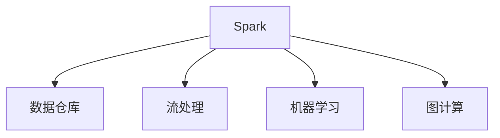

                 

# Spark 数据处理：大数据分析

> 关键词：Spark, 大数据, 数据处理, 分布式计算, 数据仓库, 机器学习

## 1. 背景介绍

### 1.1 问题由来

在当今数字化、信息化迅猛发展的背景下，数据已经成为了企业最宝贵的资产之一。无论是互联网公司、金融企业、零售行业，还是传统制造业，数据无处不在，价值巨大。然而，传统的数据处理技术，如关系型数据库、批处理系统，难以胜任海量数据的高并发、高吞吐、高复杂度计算需求。为此，大数据技术应运而生，通过分布式计算和并行处理，极大提升了数据处理的效率和能力。

Spark，作为大数据处理生态系统中的佼佼者，以其高灵活性、高效率和易于使用的特点，迅速成为企业级大数据分析和计算的首选工具。本文将深入探讨Spark在大数据分析和处理中的核心原理、应用场景及优化技巧，帮助读者掌握其在实际项目中的应用方法。

### 1.2 问题核心关键点

Spark作为大数据处理的重要工具，其核心特点和优势在于：

- **高灵活性**：支持批处理、流处理、机器学习等多种计算模式，可以灵活应对不同的数据处理需求。
- **高效率**：通过内存计算和数据本地化等优化策略，极大提升了数据处理的效率和吞吐量。
- **易用性**：提供了高级API和操作界面，降低了数据处理的门槛和复杂度。

### 1.3 问题研究意义

Spark作为大数据处理的核心工具，其应用范围已经覆盖了大数据生态的各个角落，包括数据仓库构建、实时流处理、机器学习、图计算等多个领域。Spark的应用不仅能大幅提升数据处理的效率，还能为企业创造巨大的商业价值。因此，深入理解Spark的核心原理和应用技巧，对于从事大数据相关工作的人员来说，具有重要的理论价值和实践意义。

## 2. 核心概念与联系

### 2.1 核心概念概述

为了更好地理解Spark在大数据分析中的应用，本节将介绍几个关键概念：

- **Spark**：由Apache基金会维护的开源大数据处理框架，支持批处理、流处理、机器学习等多种计算模式。
- **数据仓库**：通过集中存储和统一管理企业内外部数据，为数据驱动决策提供支持。
- **流处理**：对实时产生的数据进行实时分析、处理和响应，满足实时性要求。
- **机器学习**：通过构建数据模型，实现对数据的预测、分类、聚类等高级应用。
- **图计算**：对数据间的关系进行建模和计算，如社交网络分析、推荐系统等。

这些概念之间的逻辑关系可以通过以下Mermaid流程图来展示：



这个流程图展示了Spark的核心应用场景及其与其他大数据技术的关系：

1. Spark通过高灵活性支持数据仓库构建，提供高效的数据存储和管理能力。
2. 支持流处理模式，对实时数据进行快速响应和处理。
3. 支持机器学习算法，提供强大的数据建模和预测能力。
4. 支持图计算模型，分析数据间的关系和结构。

## 3. 核心算法原理 & 具体操作步骤

### 3.1 算法原理概述

Spark的核心原理基于内存计算和分布式计算技术，通过将数据分散存储在多台计算节点上，并通过并行计算的方式，实现高效率的数据处理。

Spark的内存计算机制，使得数据能够被快速地读入内存，避免了传统磁盘IO的延迟和开销，大大提升了数据处理的效率。同时，Spark通过数据本地化（Data Localization）技术，将计算任务尽量分配到数据存储的本地节点上执行，进一步提升了计算速度。

### 3.2 算法步骤详解

Spark的数据处理流程主要包括数据输入、数据转换、数据输出三个阶段。以下详细介绍每个阶段的实现步骤：

#### 数据输入阶段

Spark支持多种数据源的读取，包括本地文件系统、Hadoop分布式文件系统、NoSQL数据库等。具体实现步骤为：

1. 配置数据源信息，包括数据路径、数据格式、数据分割方式等。
2. 通过Spark的API读取数据，转化为RDD或DataFrame格式。
3. 对数据进行预处理，如清洗、去重、分片等，保证数据质量。

#### 数据转换阶段

数据转换阶段是Spark的核心功能，主要通过一系列的API实现数据操作的逻辑转换。具体步骤包括：

1. 数据选择：通过`filter()`、`where()`等API筛选数据，去除无用信息。
2. 数据操作：通过`map()`、`mapPartitions()`、`foreach()`等API对数据进行操作，生成新数据。
3. 数据聚合：通过`groupBy()`、`reduce()`、`join()`等API对数据进行聚合，生成汇总结果。
4. 数据分组：通过`partitionBy()`、`repartition()`等API对数据进行分组，优化计算效率。

#### 数据输出阶段

数据输出阶段是将处理结果转化为目标格式，并写入目标数据源。具体实现步骤为：

1. 将处理结果转化为格式化的数据，如文本、JSON等。
2. 通过API将数据写入目标数据源，如本地文件、Hadoop、数据库等。
3. 对输出结果进行校验和回滚，保证数据的一致性和可靠性。

### 3.3 算法优缺点

Spark作为一种大数据处理框架，具有以下优点：

- **高效性**：通过内存计算和数据本地化，极大提升了数据处理的效率和吞吐量。
- **灵活性**：支持多种计算模式，包括批处理、流处理、机器学习等，适应不同场景的需求。
- **易用性**：提供了丰富的API和操作界面，降低了数据处理的复杂度和门槛。

同时，Spark也存在以下缺点：

- **资源消耗**：由于需要存储大量数据在内存中，对于内存有限的环境中，Spark的资源消耗可能较大。
- **延迟性**：对于小数据量，Spark的启动和数据分区过程可能会带来一定的延迟。
- **学习曲线**：虽然易用性较高，但对于初学者来说，需要花费一定时间学习其核心概念和API使用方法。

### 3.4 算法应用领域

Spark作为大数据处理的核心工具，已经在多个领域得到了广泛的应用，包括但不限于：

- **数据仓库构建**：通过Spark构建企业级数据仓库，实现数据的集中存储和管理，为数据分析和决策提供支持。
- **实时流处理**：通过Spark Streaming处理实时数据流，实现实时分析和响应。
- **机器学习**：利用Spark的MLlib库进行数据建模和预测，支持大规模机器学习任务。
- **图计算**：通过Spark GraphX库进行图数据的建模和计算，支持社交网络分析、推荐系统等应用。
- **文本处理**：通过Spark的MLlib库和机器学习算法，实现文本数据的分类、聚类等处理。
- **推荐系统**：通过Spark的推荐算法，实现个性化推荐，提升用户满意度。

## 4. 数学模型和公式 & 详细讲解 & 举例说明

### 4.1 数学模型构建

Spark的数学模型主要基于分布式计算和内存计算技术，通过并行处理和内存存储，实现高效的数据处理。以下介绍几个核心的数学模型：

#### 1. 分布式计算模型

Spark的分布式计算模型基于RDD（弹性分布式数据集），通过将数据分割为多个小数据块，分布在多个计算节点上并行处理。

数学模型为：

$$
\text{RDD} = \{(p_i, d_i)\}_{i=1}^n
$$

其中，$(p_i, d_i)$表示数据块$i$的分区点和数据块，$n$表示数据块的总数。

#### 2. 内存计算模型

Spark的内存计算模型基于DataFrame和Dataset，通过内存存储和优化，实现高效的内存计算。

数学模型为：

$$
\text{DataFrame} = \{(p_i, d_i)\}_{i=1}^n
$$

其中，$(p_i, d_i)$表示数据块$i$的分区点和数据块，$n$表示数据块的总数。

### 4.2 公式推导过程

#### 1. 分布式计算公式推导

Spark的分布式计算公式推导如下：

$$
RDD = \bigcup_{i=1}^n \text{Block}_i
$$

其中，$\text{Block}_i$表示数据块$i$。

通过并行计算，Spark可以高效地处理大规模数据，提升数据处理的效率。

#### 2. 内存计算公式推导

Spark的内存计算公式推导如下：

$$
\text{DataFrame} = \bigcup_{i=1}^n \text{Row}_i
$$

其中，$\text{Row}_i$表示数据行$i$。

通过内存计算，Spark能够快速地读写数据，减少IO开销，提升数据处理速度。

### 4.3 案例分析与讲解

#### 案例1：数据仓库构建

假设某电商企业需要构建一个数据仓库，用于存储和分析其销售数据。具体实现步骤为：

1. 配置Spark环境，包括数据源路径、存储格式、分区方式等。
2. 通过Spark的API读取数据，转化为DataFrame格式。
3. 对数据进行预处理，如清洗、去重、分组等，生成数据仓库。
4. 将数据仓库保存到Hadoop分布式文件系统中，方便后续查询和分析。

#### 案例2：实时流处理

假设某互联网公司需要实时分析其用户访问日志，生成访问报表。具体实现步骤为：

1. 配置Spark Streaming环境，包括数据源路径、数据格式、分区方式等。
2. 通过Spark Streaming的API读取数据，转化为实时流数据。
3. 对实时流数据进行处理，如去重、过滤、统计等，生成实时报表。
4. 将实时报表保存到数据库中，供后续查询和分析。

## 5. 项目实践：代码实例和详细解释说明

### 5.1 开发环境搭建

在进行Spark项目实践前，我们需要准备好开发环境。以下是使用PySpark进行Spark开发的Python环境配置流程：

1. 安装Anaconda：从官网下载并安装Anaconda，用于创建独立的Python环境。
2. 创建并激活虚拟环境：
```bash
conda create -n pyspark-env python=3.8 
conda activate pyspark-env
```
3. 安装PySpark：根据CUDA版本，从官网获取对应的安装命令。例如：
```bash
conda install pyspark -c conda-forge -c pypi
```
4. 安装Spark依赖：
```bash
pip install pyspark[bigdata] -i https://pypi.douban.com/simple/
```
5. 安装Spark配置文件：
```bash
wget https://spark.apache.org/archive/spark-3.1.2.tgz
tar -xvf spark-3.1.2.tgz
cd spark-3.1.2
./sbin/start-cluster.sh spark-standalone-mode
```

完成上述步骤后，即可在`pyspark-env`环境中开始Spark项目实践。

### 5.2 源代码详细实现

下面我们以构建数据仓库为例，给出使用PySpark进行Spark开发的Python代码实现。

首先，定义数据处理函数：

```python
from pyspark.sql import SparkSession
from pyspark.sql.functions import col

spark = SparkSession.builder.appName("DataWarehouse").getOrCreate()

def process_data(data):
    df = spark.read.format("csv").option("header", "true").load(data)
    df = df.drop("id")  # 去除无用字段
    df = df.select("date", "product", "sales")  # 保留关键字段
    df = df.dropDuplicates()  # 去重
    df = df.repartition(10)  # 分区
    df.write.format("parquet").save("/path/to/output")  # 保存为Parquet格式
```

然后，启动数据处理流程：

```python
data_path = "/path/to/data"
process_data(data_path)
```

以上是使用PySpark构建数据仓库的完整代码实现。可以看到，通过Spark的API，数据处理变得简洁高效。

### 5.3 代码解读与分析

让我们再详细解读一下关键代码的实现细节：

**process_data函数**：
- `spark.read.format("csv").option("header", "true").load(data)`：读取CSV格式的数据文件，指定文件路径和字段名。
- `df.drop("id")`：去除无用的`id`字段。
- `df.select("date", "product", "sales")`：保留关键字段`date`、`product`和`sales`。
- `df.dropDuplicates()`：去除重复数据。
- `df.repartition(10)`：将数据按照`date`字段进行分区，共分成10个分区。
- `df.write.format("parquet").save("/path/to/output")`：将数据保存为Parquet格式，并指定保存路径。

**启动数据处理流程**：
- `data_path = "/path/to/data"`：指定数据文件路径。
- `process_data(data_path)`：调用数据处理函数，处理指定数据文件。

可以看到，通过Spark的API，数据处理变得简单易用，无需关心底层实现细节，大大降低了开发难度。

## 6. 实际应用场景

### 6.1 智能推荐系统

Spark在推荐系统中的应用非常广泛，通过实时分析用户行为数据，实现个性化推荐，提升用户满意度和留存率。具体实现步骤为：

1. 收集用户历史行为数据，包括浏览记录、点击记录、评分记录等。
2. 通过Spark构建推荐模型，使用协同过滤、矩阵分解等算法，生成推荐列表。
3. 将推荐列表推送给用户，供用户选择。
4. 收集用户反馈数据，进一步优化推荐模型。

### 6.2 金融风控系统

金融行业对数据的安全性和实时性要求极高，Spark通过流处理模式，能够实时分析交易数据，及时发现异常行为，防范金融风险。具体实现步骤为：

1. 收集交易数据，包括账户信息、交易记录、交易金额等。
2. 通过Spark Streaming进行实时分析，使用规则引擎、异常检测算法，识别异常交易。
3. 将异常交易报告给风控系统，进行后续处理。
4. 收集历史数据，进一步优化风控模型。

### 6.3 物流管理系统

物流企业需要实时分析订单数据，实现货物流转的优化和调度。Spark通过实时流处理模式，能够高效处理海量订单数据，提升物流效率。具体实现步骤为：

1. 收集订单数据，包括订单信息、货物信息、物流信息等。
2. 通过Spark Streaming进行实时处理，使用优化算法，生成最优物流方案。
3. 将物流方案推送给配送中心，进行货物调度和配送。
4. 收集历史数据，进一步优化物流模型。

### 6.4 未来应用展望

随着Spark技术的不断演进，其应用领域将更加广泛，未来有望在以下几个方面得到新的突破：

1. 云化部署：Spark通过云平台进行部署和调度，进一步降低使用成本，提升系统可扩展性。
2. 异构计算：Spark支持多种硬件设备，包括CPU、GPU、FPGA等，实现异构计算加速。
3. 联邦学习：Spark支持联邦学习算法，实现跨区域数据共享和模型训练。
4. 数据可视化：Spark通过强大的数据可视化功能，帮助用户直观理解数据处理结果，进行决策分析。
5. 自动化调优：Spark支持自动调优算法，优化数据处理性能和资源利用率。
6. 边缘计算：Spark通过边缘计算技术，实现数据本地化处理，减少网络延迟和带宽占用。

Spark作为一种高效、灵活的大数据处理工具，其应用前景非常广阔，未来必将在更多领域发挥重要作用。

## 7. 工具和资源推荐

### 7.1 学习资源推荐

为了帮助开发者系统掌握Spark的原理和应用技巧，这里推荐一些优质的学习资源：

1. Apache Spark官方文档：包含Spark的详细介绍、API文档、示例代码等，是学习Spark的最佳资料。
2. Spark实战指南：由知名Spark专家撰写，通过实战案例，讲解Spark的原理和应用方法。
3. Spark权威指南：涵盖Spark的各个模块，包括Spark SQL、Spark Streaming、Spark GraphX等，深入讲解Spark的各项功能。
4. PySpark官方文档：PySpark的API文档和示例代码，帮助开发者快速上手Spark。
5. Spark编程指南：提供Spark的编程技巧和最佳实践，帮助开发者提高代码质量和效率。

通过对这些资源的学习实践，相信你一定能够快速掌握Spark的核心原理和应用方法，用于解决实际项目中的数据处理问题。

### 7.2 开发工具推荐

Spark作为一种分布式计算框架，其开发工具的选择对于项目效率和性能至关重要。以下是几款推荐的开发工具：

1. PySpark：Python语言的Spark实现，简单易用，支持丰富的API和操作界面。
2. Spark Shell：命令行界面，支持交互式编程和调试。
3. Spark UI：Spark的可视化监控界面，提供实时数据分析和优化建议。
4. Zeppelin：交互式的数据分析平台，支持多种编程语言和数据源。
5. Jupyter Notebook：交互式编程和数据可视化工具，支持Spark的API使用。
6. Scala Shell：Scala语言的Spark实现，支持Scala语言的特性和语法。

合理利用这些工具，可以显著提升Spark项目的开发效率和代码质量，加快创新迭代的步伐。

### 7.3 相关论文推荐

Spark作为大数据处理的核心工具，其研究论文已经覆盖了各个领域，以下是几篇经典的Spark论文，推荐阅读：

1. Resilient Distributed Datasets: A Fault-Tolerant Abstraction for In-Memory Cluster Computing（Spark论文）：提出了Spark的核心概念RDD和分布式计算模型。
2. Spark: Cluster Computing with Working Sets（Spark论文）：介绍了Spark的内存计算机制和数据本地化技术。
3. Spark SQL: Relational Query Engine for Large Data Sets（Spark SQL论文）：介绍了Spark的SQL接口和优化策略。
4. Spark Streaming: Real-time Computation on Large Structured Data（Spark Streaming论文）：介绍了Spark的流处理机制和实时分析方法。
5. Spark GraphX: Graph Processing with the GraphX Spark Library（Spark GraphX论文）：介绍了Spark的图计算模块和算法。

这些论文代表了大数据处理技术的演进历程，通过学习这些前沿成果，可以帮助研究者把握学科前进方向，激发更多的创新灵感。

## 8. 总结：未来发展趋势与挑战

### 8.1 总结

本文对Spark在大数据分析中的应用进行了全面系统的介绍。首先阐述了Spark作为大数据处理的重要工具，其核心特点和优势在于高灵活性、高效率和易用性。接着，从原理到实践，详细讲解了Spark的核心计算模型和API使用方法，提供了Spark项目实践的完整代码实现。同时，本文还广泛探讨了Spark在大数据领域的广泛应用，展示了其巨大的应用潜力。

通过本文的系统梳理，可以看到，Spark作为一种高效、灵活的大数据处理工具，已经在大数据生态的各个领域得到广泛应用，为大数据分析和处理提供了强大的技术支持。未来，伴随Spark技术的不断演进，必将在更多领域发挥重要作用。

### 8.2 未来发展趋势

展望未来，Spark的发展趋势主要体现在以下几个方面：

1. 云化部署：Spark通过云平台进行部署和调度，进一步降低使用成本，提升系统可扩展性。
2. 异构计算：Spark支持多种硬件设备，包括CPU、GPU、FPGA等，实现异构计算加速。
3. 联邦学习：Spark支持联邦学习算法，实现跨区域数据共享和模型训练。
4. 数据可视化：Spark通过强大的数据可视化功能，帮助用户直观理解数据处理结果，进行决策分析。
5. 自动化调优：Spark支持自动调优算法，优化数据处理性能和资源利用率。
6. 边缘计算：Spark通过边缘计算技术，实现数据本地化处理，减少网络延迟和带宽占用。

这些发展趋势使得Spark在大数据领域的地位进一步巩固，应用场景将更加广泛。

### 8.3 面临的挑战

尽管Spark已经取得了巨大的成功，但在迈向更加智能化、普适化应用的过程中，仍面临以下挑战：

1. 资源消耗：由于需要存储大量数据在内存中，对于内存有限的环境中，Spark的资源消耗可能较大。
2. 延迟性：对于小数据量，Spark的启动和数据分区过程可能会带来一定的延迟。
3. 学习曲线：虽然易用性较高，但对于初学者来说，需要花费一定时间学习其核心概念和API使用方法。
4. 延迟性：对于小数据量，Spark的启动和数据分区过程可能会带来一定的延迟。
5. 安全性：Spark需要在数据安全和隐私保护方面做出更多努力，以应对恶意攻击和数据泄露的风险。

这些挑战需要Spark社区和开发者共同努力，不断优化和改进Spark的核心算法和架构，才能进一步提升其性能和可靠性。

### 8.4 研究展望

Spark作为一种高效、灵活的大数据处理工具，其未来的发展方向需要关注以下几个方面：

1. 更高效的数据本地化：通过优化数据本地化算法，进一步减少网络延迟和带宽占用。
2. 更智能的自动调优：通过机器学习算法，实现更智能的数据处理性能优化。
3. 更灵活的数据模型：支持更多数据源和数据类型，提升数据处理的灵活性和可扩展性。
4. 更强大的安全保障：通过数据加密、访问控制等手段，保障数据的安全性和隐私保护。
5. 更广泛的应用场景：通过与更多大数据技术进行融合，拓展Spark的应用范围，提升其竞争力。

这些研究方向将为Spark技术的进一步发展和应用提供新的方向和思路。

## 9. 附录：常见问题与解答

**Q1: Spark在大数据处理中的核心优势是什么？**

A: Spark在大数据处理中的核心优势主要体现在以下几个方面：

1. 高灵活性：支持多种计算模式，包括批处理、流处理、机器学习等，适应不同场景的需求。
2. 高效率：通过内存计算和数据本地化等优化策略，极大提升了数据处理的效率和吞吐量。
3. 易用性：提供了丰富的API和操作界面，降低了数据处理的复杂度和门槛。

**Q2: 如何优化Spark的性能？**

A: 优化Spark性能可以从以下几个方面入手：

1. 数据本地化：通过设置合理的分区方式，使得计算任务尽量分配到数据存储的本地节点上执行，减少网络延迟和带宽占用。
2. 内存计算：利用内存计算机制，提升数据处理的效率。
3. 自动调优：通过自动调优算法，优化数据处理性能和资源利用率。
4. 异构计算：支持多种硬件设备，如CPU、GPU、FPGA等，实现异构计算加速。
5. 数据压缩：对数据进行压缩，减少存储和传输开销。
6. 数据缓存：利用数据缓存机制，减少重复计算。

**Q3: Spark与Hadoop的异同点是什么？**

A: Spark与Hadoop的异同点如下：

1. 计算模型：Spark支持内存计算，通过内存存储和优化，提升数据处理效率；Hadoop支持磁盘IO，依赖传统的文件系统进行数据存储和处理。
2. 数据处理方式：Spark通过RDD、DataFrame等方式进行数据处理，易于编程和调试；Hadoop通过MapReduce等方式进行数据处理，更接近于底层API。
3. 应用场景：Spark适用于大规模数据处理和复杂计算任务，如数据仓库构建、机器学习、流处理等；Hadoop适用于大规模批处理和海量数据存储，如大数据仓库、HDFS文件系统等。
4. 生态系统：Spark拥有更丰富的生态系统和工具链，如PySpark、Spark Streaming等；Hadoop生态系统相对单一，依赖Hadoop自身。

**Q4: Spark在数据仓库构建中的应用场景是什么？**

A: Spark在数据仓库构建中的应用场景主要包括：

1. 数据采集：通过Spark的API读取数据源，如文件、数据库、Hadoop等，转化为RDD或DataFrame格式。
2. 数据清洗：通过Spark的API进行数据清洗、去重、过滤等处理，保证数据质量。
3. 数据聚合：通过Spark的API进行数据聚合、汇总、统计等处理，生成数据仓库。
4. 数据导出：通过Spark的API将数据导出为多种格式，如Parquet、CSV、JSON等，便于后续查询和分析。

这些应用场景使得Spark成为构建高效、灵活的数据仓库的理想工具。

**Q5: Spark在流处理中的应用场景是什么？**

A: Spark在流处理中的应用场景主要包括：

1. 实时数据采集：通过Spark Streaming读取实时数据源，如Kafka、Flume等，转化为实时流数据。
2. 实时数据处理：通过Spark Streaming进行实时数据处理，如去重、过滤、统计等，生成实时结果。
3. 实时数据存储：通过Spark Streaming将实时结果保存为数据库、文件等格式，供后续查询和分析。
4. 实时数据监控：通过Spark UI进行实时数据监控和性能分析，优化实时数据处理。

这些应用场景使得Spark成为实现高效、可靠、实时的流处理系统的重要工具。

**Q6: Spark在机器学习中的应用场景是什么？**

A: Spark在机器学习中的应用场景主要包括：

1. 数据预处理：通过Spark的API进行数据清洗、特征工程、数据转换等处理，为机器学习模型提供高质量的数据。
2. 模型训练：通过Spark的MLlib库进行机器学习模型的训练，支持多种算法如分类、回归、聚类等。
3. 模型评估：通过Spark的API进行模型评估和性能测试，优化模型效果。
4. 模型部署：通过Spark的API将训练好的模型部署到生产环境，供后续调用。

这些应用场景使得Spark成为构建高效、灵活的机器学习系统的理想工具。

---

作者：禅与计算机程序设计艺术 / Zen and the Art of Computer Programming

