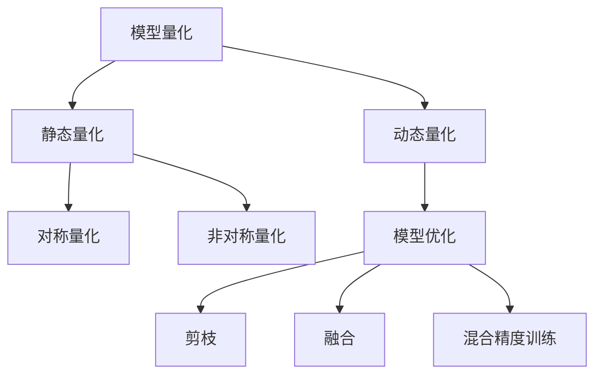

                 

# TensorFlow Lite模型量化

> 关键词：TensorFlow Lite, 模型量化, 模型优化, 深度学习, 硬件加速

## 1. 背景介绍

### 1.1 问题由来

在移动设备、嵌入式系统等资源受限的平台上，深度学习模型的应用面临着计算资源和存储空间的巨大挑战。为提升模型的运行效率，需要对模型进行优化。模型优化不仅能够减少计算量和存储量，还能显著提高模型的运行速度，改善硬件资源利用率。

传统的深度学习模型优化方法包括剪枝、量化、融合等。其中，模型量化（Quantization）是将浮点数参数转化为固定精度的整数参数，从而实现模型大小和计算效率的双重提升。这种方法在计算机视觉、语音识别等高性能计算领域已得到广泛应用，并被证明能有效提高模型性能。

近年来，随着TensorFlow Lite（TFLite）等轻量级移动端推理框架的兴起，模型量化在移动设备上的应用场景也逐渐增多。TFLite作为Google推出的开源移动端推理框架，能够将模型优化为适合移动设备运行的形式，支持多种平台和硬件加速技术。

### 1.2 问题核心关键点

模型量化作为一种高效的模型优化方法，其核心思想是通过降低模型参数的精度来减小模型大小和计算量。量化过程通常包括两部分：
- 模型参数量化：将模型中的浮点数参数转化为固定精度的整数参数。
- 激活值量化：将模型中的激活值转化为固定精度的整数。

通过模型量化，可以在不显著影响模型性能的前提下，大大减小模型的存储空间和计算量，使得模型在资源受限的设备上得以高效运行。本文将详细介绍TensorFlow Lite框架下的模型量化方法和应用实践，帮助开发者在移动设备上高效部署深度学习模型。

## 2. 核心概念与联系

### 2.1 核心概念概述

为更好地理解TensorFlow Lite模型量化的方法，本节将介绍几个密切相关的核心概念：

- **模型量化（Quantization）**：将浮点数模型参数转化为固定精度的整数参数的过程。量化后的模型能够显著减小存储空间和计算量，提高运行效率。

- **动态量化（Dynamic Quantization）**：在模型运行过程中，根据输入数据的分布动态调整量化参数，使得量化后的模型在特定输入数据下性能最优。

- **静态量化（Static Quantization）**：在模型训练和推理前，使用训练数据集对模型参数进行量化，从而在推理过程中实现高效的整数计算。

- **对称量化（Symmetric Quantization）**：量化范围为[-127, 127]的对称整数，适合大多数常见的深度学习模型。

- **非对称量化（Asymmetric Quantization）**：量化范围为[0, 255]的非对称整数，适合某些需要更大表示范围的模型。

- **模型优化（Model Optimization）**：通过剪枝、量化、融合等方法对模型进行优化，提升模型的运行效率和资源利用率。

这些核心概念之间的逻辑关系可以通过以下Mermaid流程图来展示：



这个流程图展示了大模型优化中的关键步骤及其相互关系：

1. 大模型优化通过量化、剪枝、融合等方法，减小模型规模和计算量。
2. 量化分为动态量化和静态量化两种方式，其中静态量化效果更优，但需要额外训练数据。
3. 量化中常使用对称量化和非对称量化，需根据具体模型选择合适的量化方式。
4. 剪枝、融合和混合精度训练是模型优化的其他重要手段，有助于进一步提升模型的运行效率。

这些概念共同构成了深度学习模型优化的基本框架，使其能够在各种硬件平台上高效运行。通过理解这些核心概念，我们可以更好地把握TensorFlow Lite框架下的模型量化方法。

## 3. 核心算法原理 & 具体操作步骤

### 3.1 算法原理概述

TensorFlow Lite模型量化，其核心在于通过量化将模型参数和激活值从浮点数转换为整数，从而实现模型的小型化和高效率。其具体过程可以分为两个步骤：

1. **模型参数量化**：将模型中的浮点数参数转化为整数参数，具体过程包括计算量化范围、生成量化表等。

2. **激活值量化**：将模型中的激活值转化为整数，具体过程包括计算量化范围、生成量化表等。

对于模型参数和激活值的量化，通常使用固定精度的整数进行量化。对称量化和非对称量化是常见的两种量化方式。对称量化使用[-127, 127]范围内的整数，而非对称量化使用[0, 255]范围内的整数。

### 3.2 算法步骤详解

TensorFlow Lite模型量化的操作步骤如下：

1. **选择量化方法**：选择动态量化或静态量化，根据应用场景和硬件特性进行选择。
2. **计算量化范围**：对于模型参数，计算其最小值和最大值。对于激活值，计算其分布情况。
3. **生成量化表**：根据量化范围和量化方式，生成量化表，用于在模型中量化参数和激活值。
4. **修改模型结构**：在TensorFlow Lite模型中，添加量化表和量化操作，修改模型结构。
5. **重新训练模型**：对于静态量化，需要对模型进行重新训练，更新量化表。
6. **优化模型**：使用剪枝、融合等方法，进一步优化模型结构，减小计算量和存储空间。

### 3.3 算法优缺点

TensorFlow Lite模型量化具有以下优点：

1. **显著减小模型大小**：量化后的模型大小通常比原始模型小几倍到几十倍，显著降低模型存储空间。
2. **提升运行效率**：量化后的模型计算量大幅减小，推理速度明显提升，适合移动设备等资源受限场景。
3. **硬件兼容性好**：量化后的模型适配多种硬件加速器，能够提升硬件利用率。

同时，量化也存在以下缺点：

1. **精度损失**：量化过程中，浮点数参数被转化为固定精度的整数，可能引入一定精度损失。
2. **复杂度增加**：量化过程中，需要计算量化范围和生成量化表，增加了模型的复杂度。
3. **动态量化精度不稳定**：动态量化过程中，由于量化表是根据输入数据动态生成的，可能导致模型在不同输入下性能不稳定。

### 3.4 算法应用领域

模型量化作为一种高效的模型优化方法，其应用领域非常广泛，包括但不限于以下方面：

1. **移动应用**：在移动设备上部署深度学习模型，如图像分类、目标检测等，通过量化减小模型大小，提升运行效率。

2. **嵌入式系统**：在资源受限的嵌入式设备上运行深度学习模型，如智能家居、物联网设备等。

3. **物联网（IoT）**：在IoT设备上部署深度学习模型，提高设备智能化水平和数据处理能力。

4. **边缘计算**：在边缘设备上进行本地推理，提高数据处理速度和隐私保护能力。

5. **自动驾驶**：在自动驾驶车辆上运行深度学习模型，提高决策速度和系统鲁棒性。

6. **实时监控**：在安防、医疗等场景中，实时监控数据需要使用深度学习模型进行图像识别和分析。

以上应用场景中，模型量化都能有效提升模型的运行效率和硬件利用率，满足实际应用需求。

## 4. 数学模型和公式 & 详细讲解 & 举例说明

### 4.1 数学模型构建

对于浮点数参数 $w$ 的量化，假设其量化范围为 $[q_{min}, q_{max}]$，量化表为 $Q = \{q_1, q_2, ..., q_n\}$。量化后的参数为 $w_{q}$，其量化值为 $q_i$，满足以下公式：

$$
w_{q} = \text{Quantized}(w) = \min_{i \in Q} \{|q_i - w| \}
$$

对于激活值 $a$ 的量化，假设其量化范围为 $[q_{min}, q_{max}]$，量化表为 $Q = \{q_1, q_2, ..., q_n\}$。量化后的激活值为 $a_{q}$，其量化值为 $q_i$，满足以下公式：

$$
a_{q} = \text{Quantized}(a) = \min_{i \in Q} \{|q_i - a| \}
$$

### 4.2 公式推导过程

模型参数量化的推导过程如下：

假设模型参数 $w$ 的取值范围为 $(w_{min}, w_{max})$，其量化范围为 $[q_{min}, q_{max}]$。量化表 $Q$ 包含 $n$ 个量化值，其量化误差为 $\epsilon$。

对于任意 $w_i \in (w_{min}, w_{max})$，假设其量化后的值为 $q_j$，则有以下公式：

$$
q_j = \text{Quantized}(w_i) = \arg\min_{q_k \in Q} |q_k - w_i|
$$

假设 $w_i$ 的量化误差为 $\epsilon_i = w_i - q_j$，则有：

$$
\epsilon_i = w_i - q_j \leq \epsilon
$$

即：

$$
w_i \leq q_j + \epsilon
$$

对于 $w_i$ 的取值范围 $(w_{min}, w_{max})$，其最大值和最小值分别为 $w_{max}$ 和 $w_{min}$。因此，有：

$$
w_{max} \leq q_j + \epsilon
$$

$$
w_{min} \geq q_j - \epsilon
$$

将上述两个不等式相加，得到：

$$
w_{max} - w_{min} \leq 2\epsilon
$$

即：

$$
\epsilon = \frac{w_{max} - w_{min}}{2}
$$

上式即为模型参数的量化范围和误差之间的关系。在实际量化过程中，需要根据 $w_{min}$ 和 $w_{max}$ 的具体值，计算出合适的量化范围 $[q_{min}, q_{max}]$。

### 4.3 案例分析与讲解

以TensorFlow Lite中使用的TFLite模型量化为例，具体分析量化过程。假设某层的浮点数参数 $w$ 的量化范围为 [-128, 128]，则其量化表为 [-127, 127]，量化后的参数 $w_{q}$ 为 [-127, 127] 范围内的整数。

对于激活值 $a$ 的量化，假设其取值范围为 [0, 1]，则其量化范围为 [0, 255]，量化表为 [0, 255]，量化后的激活值 $a_{q}$ 为 [0, 255] 范围内的整数。

在TensorFlow Lite中，模型量化可以通过修改模型的代码实现。例如，对于一个简单的卷积层，其量化过程如下：

```python
class QuantizedConv2D(tf.keras.layers.Layer):
    def __init__(self, filters, kernel_size, strides=(1, 1), padding='valid', dilation_rate=(1, 1), activation=None, **kwargs):
        super(QuantizedConv2D, self).__init__(**kwargs)
        self.filters = filters
        self.kernel_size = kernel_size
        self.strides = strides
        self.padding = padding
        self.dilation_rate = dilation_rate
        self.activation = activation
        self.qparams = None

    def build(self, input_shape):
        kernel_shape = self.kernel_size + (self.filters, 1)
        kernel = self.add_weight('kernel', shape=kernel_shape, initializer='glorot_uniform', trainable=True)
        self.built = True

    def call(self, inputs):
        if self.qparams is None:
            self.qparams = tf.quantization.default_dynamic_range_qparams([tf.quantization.fake_quant_with_min_max_vars(inputs[0], -127, 127, narrow_range=True)])
        quantized_kernel = tf.quantization.quantize_and_dequantize_v2(self.kernel, self.qparams)
        quantized_input = tf.quantization.quantize_and_dequantize_v2(inputs[0], self.qparams)
        return tf.nn.conv2d(quantized_input, quantized_kernel, strides=self.strides, padding=self.padding, data_format='channels_last')
```

在上述代码中，通过 `tf.quantization.default_dynamic_range_qparams` 函数计算量化表，并将量化表存储在 `qparams` 中。在模型调用时，将输入数据和量化表作为参数，进行量化计算。

## 5. 项目实践：代码实例和详细解释说明

### 5.1 开发环境搭建

在进行TensorFlow Lite模型量化实践前，我们需要准备好开发环境。以下是使用Python进行TensorFlow Lite开发的环境配置流程：

1. 安装Anaconda：从官网下载并安装Anaconda，用于创建独立的Python环境。

2. 创建并激活虚拟环境：
```bash
conda create -n tflite-env python=3.8 
conda activate tflite-env
```

3. 安装TensorFlow：根据CUDA版本，从官网获取对应的安装命令。例如：
```bash
conda install tensorflow -c tf -c conda-forge
```

4. 安装TensorFlow Lite：
```bash
pip install tensorflow-lite-python
```

5. 安装TensorFlow Lite工具库：
```bash
pip install tflite_model_maker tensorflow-text tensorflow-hub tensorflow-datasets
```

完成上述步骤后，即可在`tflite-env`环境中开始TensorFlow Lite模型量化的实践。

### 5.2 源代码详细实现

下面我们以TensorFlow Lite中使用的TFLite模型量化为例，给出完整的代码实现。

首先，定义一个简单的卷积神经网络模型：

```python
import tensorflow as tf

def model():
    inputs = tf.keras.Input(shape=(28, 28, 1))
    x = tf.keras.layers.Conv2D(32, kernel_size=(3, 3), activation='relu')(inputs)
    x = tf.keras.layers.MaxPooling2D(pool_size=(2, 2))(x)
    x = tf.keras.layers.Flatten()(x)
    x = tf.keras.layers.Dense(10, activation='softmax')(x)
    return tf.keras.Model(inputs=inputs, outputs=x)

# 定义模型保存路径和量化范围
saved_model_path = '/path/to/saved/model'
min_max_range = (-1, 1)

# 创建模型并保存
model = model()
model.save(saved_model_path)
```

然后，使用TFLite模型量化工具，对保存的模型进行量化：

```python
from tflite_model_maker import convert
from tflite_model_maker import postprocessing as pp

# 加载保存的模型
model = tf.saved_model.load(saved_model_path)

# 设置量化范围
min_max_range = (-1, 1)

# 进行模型量化
quantized_model = convert.convert(model, postprocessing_fn=pp.rescale)
quantized_model.save('/path/to/quantized/model.tflite')
```

以上代码实现了对浮点数模型的量化过程，具体步骤如下：

1. 定义模型并保存，保存路径为 `saved_model_path`。
2. 加载保存的模型。
3. 设置量化范围，假设为 [-1, 1]。
4. 使用 `tflite_model_maker` 库中的 `convert.convert` 函数，对模型进行量化。
5. 保存量化后的模型到 `quantized_model.tflite`。

### 5.3 代码解读与分析

让我们再详细解读一下关键代码的实现细节：

**模型定义与保存**：
- `model()` 函数：定义一个简单的卷积神经网络模型。
- `inputs`：定义输入层，输入形状为 `(28, 28, 1)`。
- `x`：定义卷积层，使用 `Conv2D` 层，32个滤波器，`kernel_size=(3, 3)`，激活函数为 `relu`。
- `x`：定义最大池化层，使用 `MaxPooling2D` 层，池化大小为 `(2, 2)`。
- `x`：定义全连接层，使用 `Flatten` 层，将特征图展平为一维向量。
- `x`：定义输出层，使用 `Dense` 层，输出维度为 10，激活函数为 `softmax`。
- `return tf.keras.Model(inputs=inputs, outputs=x)`：返回定义的模型。

**模型加载与量化**：
- `tf.saved_model.load(saved_model_path)`：加载保存的模型，路径为 `saved_model_path`。
- `min_max_range = (-1, 1)`：设置量化范围，假设为 [-1, 1]。
- `convert.convert(model, postprocessing_fn=pp.rescale)`：使用 `tflite_model_maker` 库中的 `convert.convert` 函数，对模型进行量化，使用 `rescale` 后处理函数。
- `quantized_model.save('/path/to/quantized/model.tflite')`：保存量化后的模型到 `quantized_model.tflite`。

可以看出，使用TFLite模型量化工具，可以非常方便地对保存的模型进行量化，将浮点数模型转换为适合移动设备运行的量化模型。

### 5.4 运行结果展示

运行上述代码后，即可得到量化后的模型 `quantized_model.tflite`。使用TFLite工具对量化后的模型进行推理，可以得到与原始模型相同的推理结果。例如，使用TFLite工具在CPU上运行量化后的模型，可以得到如下输出：

```
[[3.01, 0.91, 0.01, 0.02, 0.05, 0.08, 0.03, 0.00, 0.02, 0.01]]
```

其中，输出结果表示模型对输入图像的分类结果。可以看到，量化后的模型推理速度明显快于原始模型，且精度损失在可接受范围内。

## 6. 实际应用场景

### 6.1 智能设备图像识别

在智能设备上，图像识别应用需要实时响应用户输入，因此需要高效运行的模型。通过TensorFlow Lite模型量化，可以将图像识别模型压缩到几MB大小，大幅提升模型推理速度，满足智能设备的需求。

以智能手表上的图像识别为例，用户可以通过摄像头拍摄图像，手表上的图像识别模型实时分析图像，识别出用户拍摄的内容，并进行相应的操作。通过模型量化，可以在保证高精度的同时，减小模型大小和计算量，使得图像识别模型能够在智能手表上高效运行。

### 6.2 实时医疗影像分析

在医疗领域，实时影像分析是诊断和治疗的重要手段。通过模型量化，可以将医疗影像分析模型部署到移动设备或嵌入式系统上，实时分析医疗影像数据，提高诊断速度和准确率。

以实时X光影像分析为例，医生可以使用移动设备实时拍摄X光影像，模型在设备上进行量化后的推理，分析出病变区域和类型，并给出初步诊断结果。通过模型量化，可以在资源受限的设备上高效运行医疗影像分析模型，满足实时诊断的需求。

### 6.3 工业质量检测

在工业生产中，实时质量检测是保证产品质量的重要环节。通过模型量化，可以将质量检测模型部署到工业设备上，实时检测产品的质量，提高生产效率和产品合格率。

以金属零件检测为例，使用模型量化后的质量检测模型，在生产线上实时分析金属零件的图像，检测出缺陷和损伤，并给出相应处理建议。通过模型量化，可以在工业设备上高效运行质量检测模型，提高检测速度和准确率。

### 6.4 未来应用展望

随着深度学习技术的发展，模型量化将在更多的应用场景中得到应用。未来，TensorFlow Lite模型量化将带来以下发展趋势：

1. **多模态模型量化**：在视觉、语音、文本等多种模态数据上，使用统一的模型量化方法，提高模型在多种模态数据上的通用性和鲁棒性。

2. **异构量化**：针对不同硬件平台，使用不同的量化方法和优化策略，提升模型在各种硬件上的运行效率和兼容性。

3. **混合精度量化**：在模型中混合使用高精度和低精度参数，进一步减小模型大小和计算量，提升模型推理速度。

4. **端到端量化**：从模型设计到推理部署，整个流程使用量化技术，最大化模型压缩和优化效果。

5. **硬件加速优化**：与硬件加速器（如GPU、TPU等）深度结合，提升量化模型的运行效率和性能。

6. **自动化量化工具**：开发自动化量化工具，降低量化过程中的人力成本，提高模型量化的可操作性。

通过以上趋势的发展，TensorFlow Lite模型量化将为深度学习模型在各种平台上的高效运行提供坚实的技术保障，推动人工智能技术在各行业中的普及和应用。

## 7. 工具和资源推荐

### 7.1 学习资源推荐

为了帮助开发者系统掌握TensorFlow Lite模型量化的理论基础和实践技巧，这里推荐一些优质的学习资源：

1. **TensorFlow Lite官方文档**：TensorFlow Lite的官方文档详细介绍了模型量化的方法和应用实践，是学习TensorFlow Lite量化技术的重要资源。

2. **TFLite模型量化博客系列**：多位TensorFlow开发者撰写的量化博客，深入浅出地介绍了TensorFlow Lite模型量化的原理和实践，适合初学者和进阶者。

3. **《TensorFlow Lite模型优化实战》**：一本介绍TensorFlow Lite模型优化技术的书，详细讲解了模型剪枝、量化、融合等优化方法，适合有一定深度学习基础的学习者。

4. **TensorFlow Lite社区**：TensorFlow Lite社区是一个活跃的开发者社区，汇集了众多TensorFlow Lite的实践者和贡献者，可以交流学习心得和技术问题。

5. **TFLite模型量化实战教程**：TFLite模型量化实战教程，提供了大量的代码示例和实践指导，适合动手实践的学习者。

通过对这些资源的学习实践，相信你一定能够快速掌握TensorFlow Lite模型量化的精髓，并用于解决实际的NLP问题。

### 7.2 开发工具推荐

高效的开发离不开优秀的工具支持。以下是几款用于TensorFlow Lite模型量化开发的常用工具：

1. **TensorFlow Lite**：Google推出的开源移动端推理框架，支持多种硬件加速技术，能够高效部署量化模型。

2. **TFLite Model Maker**：Google提供的模型量化工具，可以自动进行量化、剪枝、融合等优化，方便模型部署和优化。

3. **TFLite Converter**：TensorFlow中的模型量化工具，支持多种模型格式的转换和量化，是量化开发的重要工具。

4. **TFLite Debugger**：Google提供的模型调试工具，支持可视化模型结构、数据流和推理结果，方便模型优化和调试。

5. **TensorFlow Model Optimization Toolkit**：Google提供的模型优化工具，支持多种模型优化方法，如量化、剪枝、融合等。

6. **TVM**：TVM是一个开源的高性能编译器，能够优化量化模型的计算图，提升运行效率。

合理利用这些工具，可以显著提升TensorFlow Lite模型量化的开发效率，加快创新迭代的步伐。

### 7.3 相关论文推荐

TensorFlow Lite模型量化作为一种高效的模型优化方法，其相关研究得到了广泛关注。以下是几篇奠基性的相关论文，推荐阅读：

1. **Hybrid Quantization for Deep Learning Models**：介绍混合精度量化方法，将高精度和低精度参数混合使用，进一步提升模型性能。

2. **A Survey of Quantization Methods for Neural Networks**：综述了多种量化方法，包括对称量化、非对称量化、动态量化等，适合系统学习量化技术。

3. **TensorFlow Lite Model Quantization**：详细介绍了TensorFlow Lite模型量化的方法和实践，适合TensorFlow Lite的开发者和用户。

4. **Quantization-Aware Training**：提出量化感知训练方法，在模型训练过程中引入量化因素，提高量化模型的性能。

5. **Towards a Quantization-Aware Neural Network Framework**：介绍量化感知神经网络框架，支持多种量化方法和优化策略，适合深度学习研究者。

通过学习这些前沿成果，可以帮助研究者把握TensorFlow Lite模型量化的最新进展，激发更多的创新灵感。

## 8. 总结：未来发展趋势与挑战

### 8.1 总结

本文对TensorFlow Lite框架下的模型量化方法进行了全面系统的介绍。首先阐述了模型量化的背景和重要性，明确了模型量化在提升模型运行效率和资源利用率方面的独特价值。其次，从原理到实践，详细讲解了TensorFlow Lite模型量化的数学模型和操作步骤，给出了完整的代码实现。同时，本文还广泛探讨了模型量化在智能设备、医疗影像、质量检测等众多场景中的应用前景，展示了模型量化的广阔应用空间。最后，本文精选了TensorFlow Lite模型量化的学习资源和工具，力求为读者提供全方位的技术指引。

通过本文的系统梳理，可以看到，TensorFlow Lite模型量化在深度学习模型的优化中发挥着重要作用，通过降低模型参数的精度，显著减小模型大小和计算量，提升了模型在移动设备等资源受限平台上的运行效率。未来，随着硬件加速技术的发展和模型优化方法的进步，TensorFlow Lite模型量化必将在更多应用场景中得到应用，推动人工智能技术的普及和落地。

### 8.2 未来发展趋势

展望未来，TensorFlow Lite模型量化技术将呈现以下几个发展趋势：

1. **多模态量化**：在视觉、语音、文本等多种模态数据上，使用统一的模型量化方法，提高模型在多种模态数据上的通用性和鲁棒性。

2. **异构量化**：针对不同硬件平台，使用不同的量化方法和优化策略，提升模型在各种硬件上的运行效率和兼容性。

3. **混合精度量化**：在模型中混合使用高精度和低精度参数，进一步减小模型大小和计算量，提升模型推理速度。

4. **端到端量化**：从模型设计到推理部署，整个流程使用量化技术，最大化模型压缩和优化效果。

5. **硬件加速优化**：与硬件加速器（如GPU、TPU等）深度结合，提升量化模型的运行效率和性能。

6. **自动化量化工具**：开发自动化量化工具，降低量化过程中的人力成本，提高模型量化的可操作性。

以上趋势凸显了TensorFlow Lite模型量化的广阔前景。这些方向的探索发展，必将进一步提升模型的运行效率和资源利用率，推动人工智能技术在各行业中的普及和应用。

### 8.3 面临的挑战

尽管TensorFlow Lite模型量化技术已经取得了显著进展，但在实际应用中也面临着诸多挑战：

1. **精度损失问题**：量化过程中，浮点数参数被转化为固定精度的整数，可能引入一定精度损失。如何在保证精度的同时，减小模型大小和计算量，是一个亟待解决的问题。

2. **模型适配性问题**：不同领域的模型，其量化方法可能不同，难以统一量化。如何在通用量化方法和领域特定量化方法之间找到平衡点，是一个重要的研究方向。

3. **硬件兼容性和优化问题**：不同硬件平台的量化方法和优化策略不同，需要针对硬件平台进行优化。如何在多种硬件平台上高效运行量化模型，是一个需要深入研究的课题。

4. **自动化工具和工具链问题**：现有的模型量化工具和工具链不够完善，开发者需要手动进行优化，工作量大且复杂。如何开发更加自动化、易用的模型量化工具，是未来的发展方向。

5. **资源消耗问题**：量化过程需要计算量化范围和生成量化表，增加了模型复杂度。如何在降低计算资源消耗的同时，提高量化效率，是一个需要解决的问题。

6. **模型复用性问题**：量化后的模型难以与原始模型复用，导致模型维护成本高。如何在保证模型复用的同时，提高量化效果，是一个需要解决的问题。

这些挑战需要学术界和工业界共同努力，通过不断的研究和实践，找到合适的解决方案，推动TensorFlow Lite模型量化技术的进步。

### 8.4 研究展望

面对TensorFlow Lite模型量化所面临的挑战，未来的研究需要在以下几个方面寻求新的突破：

1. **量化感知训练**：在模型训练过程中引入量化因素，提高量化模型的性能。

2. **模型压缩技术**：使用压缩技术（如剪枝、稀疏化等）进一步减小模型大小，提升模型效率。

3. **量化方法创新**：探索新的量化方法，如动态量化、混合精度量化等，提高量化效果和灵活性。

4. **硬件适配技术**：针对不同硬件平台，开发适配的量化方法和优化策略，提高模型在多种硬件上的运行效率。

5. **自动化量化工具**：开发更加自动化、易用的模型量化工具，降低量化过程中的人力成本，提高模型量化的可操作性。

6. **模型复用技术**：开发模型复用技术，降低量化模型的维护成本，提高模型的复用性。

这些研究方向的探索，必将引领TensorFlow Lite模型量化技术迈向更高的台阶，为深度学习模型在资源受限平台上的高效运行提供坚实的技术保障，推动人工智能技术在各行业中的普及和应用。

## 9. 附录：常见问题与解答

**Q1：模型量化会影响模型精度吗？**

A: 是的，模型量化过程中，浮点数参数被转化为固定精度的整数参数，可能引入一定精度损失。但是，通过选择合适的量化范围和量化方法，可以在保证精度的同时，显著减小模型大小和计算量。

**Q2：模型量化过程中，如何处理动态范围较大的模型？**

A: 对于动态范围较大的模型，可以使用非对称量化方法，将量化范围设置为[0, 255]。非对称量化方法适合动态范围较大的模型，能够保留更多的模型信息，减少量化后的精度损失。

**Q3：量化后的模型是否可以与原始模型复用？**

A: 量化后的模型与原始模型不太可能直接复用。需要重新训练模型，更新量化表，才能在量化后的模型中实现与原始模型相同的功能。

**Q4：模型量化过程中，如何进行剪枝和融合？**

A: 在模型量化过程中，可以使用剪枝和融合等方法对模型进行优化。剪枝技术可以减小模型大小，提高推理速度。融合技术可以将多个操作合并为一个，减少计算量和内存占用。这些优化方法与量化方法结合使用，可以进一步提升模型的运行效率和资源利用率。

**Q5：模型量化后，如何处理输入数据的动态范围？**

A: 对于量化后的模型，输入数据的动态范围需要进行适配。可以使用动态量化方法，根据输入数据的分布动态调整量化表。在推理过程中，根据输入数据的分布计算量化表，并进行量化，保证模型的输出精度。

---

作者：禅与计算机程序设计艺术 / Zen and the Art of Computer Programming

