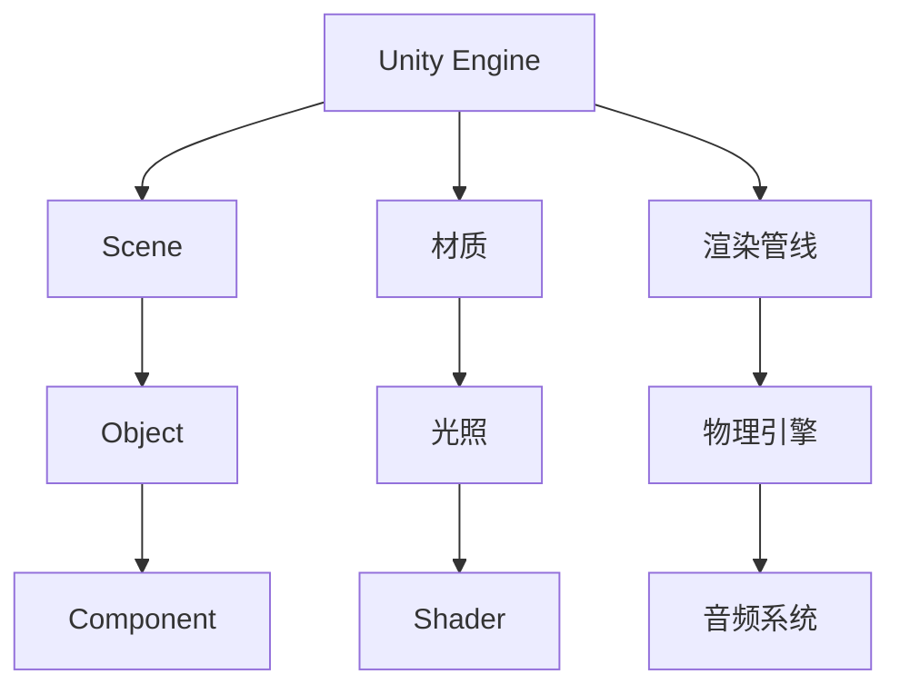

                 

## 1. 背景介绍

### 1.1 问题由来

Unity游戏引擎是目前最受欢迎的游戏开发工具之一，支持PC、手机、VR等平台，并拥有庞大的社区支持和大量的开发资源。尽管Unity功能强大，但新手入门时可能会对复杂的架构、庞大的文档和社区内容感到困惑，不知道如何入手。本文将带你全面入门Unity游戏开发，讲解Unity的架构、核心组件、编程技巧等内容，并提供实用的项目实践，帮助新手快速上手。

### 1.2 问题核心关键点

Unity游戏引擎的入门核心关键点在于理解其架构、学习核心组件和掌握编程技巧。Unity架构包括场景、物体、组件、材质、光照等基本概念，这些都是构建游戏的基础。而掌握Unity的核心组件如渲染管线、物理引擎、音频系统等，则是实现游戏功能的关键。编程技巧方面，需要掌握C#编程语言，理解Unity脚本和编辑器，以及熟悉游戏逻辑编程和优化。

## 2. 核心概念与联系

### 2.1 核心概念概述

为更好地理解Unity游戏开发，我们首先介绍一些核心概念：

- Unity：一个广泛使用的跨平台游戏开发引擎，支持2D、3D和VR等游戏开发。
- 场景(Scene)：Unity中用于表示游戏世界的容器，包含多个物体、相机和灯光等。
- 物体(Object)：场景中的基本构建单元，用于创建角色、场景元素等。
- 组件(Component)：实现特定功能的脚本或工具，如渲染器、物理组件等。
- 材质(Material)：用于描述游戏对象外观的视觉特性，如颜色、反射、纹理等。
- 光照(Lighting)：用于实现游戏场景中的光影效果，包括环境光、灯光等。
- Shader(着色器)：控制游戏对象渲染的代码片段，用于实现自定义的视觉效果。

这些核心概念构成了Unity游戏开发的基础框架。掌握它们将有助于我们理解Unity的架构和实现游戏功能。

### 2.2 核心概念原理和架构的 Mermaid 流程图



这个流程图展示了Unity架构的概览，从Unity引擎到场景、物体、组件、材质、光照、着色器、渲染管线、物理引擎、音频系统等核心组件。

## 3. 核心算法原理 & 具体操作步骤

### 3.1 算法原理概述

Unity游戏开发的核心算法原理主要包括渲染管线、物理引擎、音频系统等。这些算法通过编写脚本来实现，脚本使用C#语言编写，集成到Unity编辑器中即可运行。

- 渲染管线(Render Pipeline)：处理游戏场景中的图形渲染，将3D模型转换为2D纹理贴图，最终生成视觉效果。
- 物理引擎(Physics Engine)：模拟游戏物体的运动和碰撞，实现真实的物理效果。
- 音频系统(Audio System)：处理游戏中的声音和音乐，包括音效、背景音乐等。

### 3.2 算法步骤详解

#### 3.2.1 渲染管线

Unity的渲染管线负责将3D模型转换为2D纹理贴图。渲染管线主要由多个阶段组成，包括顶点着色器、几何着色器、片段着色器等。

1. **顶点着色器**：接收顶点数据，进行变换和光照计算，生成屏幕坐标。
2. **几何着色器**：对几何体进行细分，生成更多三角形以提高细节表现。
3. **片段着色器**：根据屏幕坐标和材质，计算像素的颜色和深度，最终生成2D纹理贴图。

渲染管线的实现主要在Shader文件中编写，使用C#脚本调用。以下是一个简单的顶点着色器示例：

```csharp
using UnityEngine;

[RenderQueue(100)]
[RequireComponent(typeof(Camera))]
public class MyShader : ShaderGraph
{
    [Output(1)] [ImageGenerator(name="Output")]
    public Texture2D output;

    public void OnSubscribe(Camera camera)
    {
        camera.onPreCull = EventSystem.Combine(camera.onPreCull, OnPreCull);
        camera.onPreRender = EventSystem.Combine(camera.onPreRender, OnPreRender);
        camera.onPostRender = EventSystem.Combine(camera.onPostRender, OnPostRender);
    }

    public void OnUnsubscribe(Camera camera)
    {
        camera.onPreCull -= OnPreCull;
        camera.onPreRender -= OnPreRender;
        camera.onPostRender -= OnPostRender;
    }

    public void OnPreCull(Camera camera)
    {
        // 执行预裁剪逻辑
    }

    public void OnPreRender(Camera camera)
    {
        // 执行预渲染逻辑
    }

    public void OnPostRender(Camera camera)
    {
        // 执行后渲染逻辑
    }
}
```

#### 3.2.2 物理引擎

Unity的物理引擎用于模拟物体的运动和碰撞，实现真实的物理效果。物理引擎主要由刚体、碰撞器、物理引擎控制器等组件构成。

1. **刚体(Rigidbody)**：表示游戏世界中的物体，可以进行位置、速度、加速度等物理模拟。
2. **碰撞器(Collision)**：用于检测物体之间的碰撞，可以设置碰撞类型、反弹系数等参数。
3. **物理引擎控制器(PhysicsController)**：控制物体的物理行为，如跳跃、滑行、碰撞响应等。

物理引擎的实现主要通过编写C#脚本来实现。以下是一个简单的刚体和碰撞器示例：

```csharp
using UnityEngine;

public class RigidbodyController : MonoBehaviour
{
    public Rigidbody rb;
    public Collider collider;

    void Update()
    {
        rb.velocity = new Vector3(0, 5, 0);
        collider.enabled = false;
    }
}
```

#### 3.2.3 音频系统

Unity的音频系统用于处理游戏中的声音和音乐，包括音效、背景音乐等。音频系统主要由音频源、音频克隆器、音频混合器等组件构成。

1. **音频源(Audio Source)**：用于播放音频文件，支持音量、音高等参数调整。
2. **音频克隆器(Audio Clone)**：用于复制和粘贴音频文件，实现多通道音频效果。
3. **音频混合器(Audio Mixer)**：用于混合和调整多个音频源的音量和效果。

音频系统的实现主要通过编写C#脚本来实现。以下是一个简单的音频源示例：

```csharp
using UnityEngine;

public class AudioController : MonoBehaviour
{
    public AudioSource audioSource;

    void Update()
    {
        audioSource.Play();
    }
}
```

### 3.3 算法优缺点

Unity游戏引擎的优点在于：

- **跨平台支持**：支持PC、手机、VR等平台，适用范围广。
- **可视化编辑器**：具有强大的可视化编辑器，易于学习和使用。
- **丰富的资源和社区**：拥有庞大的资源库和活跃的社区支持。

然而，Unity游戏引擎也存在一些缺点：

- **性能优化复杂**：游戏性能优化需要掌握大量技巧，如纹理压缩、LOD等。
- **内存占用高**：游戏运行时占用大量内存，需要合理管理内存使用。
- **学习曲线陡峭**：学习曲线较陡峭，新手入门需要较长时间的学习和实践。

### 3.4 算法应用领域

Unity游戏引擎广泛应用于游戏开发、虚拟现实、增强现实等领域。以下是Unity在游戏开发中的应用：

- **2D游戏开发**：如《我的世界》、《纪念碑谷》等。
- **3D游戏开发**：如《GTA V》、《守望先锋》等。
- **虚拟现实**：如《Beat Saber》、《Half-Life: Alyx》等。
- **增强现实**：如《Pokémon GO》、《ARKit》等。

## 4. 数学模型和公式 & 详细讲解 & 举例说明

### 4.1 数学模型构建

Unity的数学模型主要包括线性代数、三角函数、矩阵变换等基本数学概念。在Unity中，我们使用向量、矩阵等数据结构表示空间中的位置、旋转、缩放等变换。

以下是一个简单的向量加法示例：

```csharp
using UnityEngine;

public class VectorAddition : MonoBehaviour
{
    public Vector3 vector1;
    public Vector3 vector2;

    void Update()
    {
        Vector3 result = vector1 + vector2;
        Debug.Log(result);
    }
}
```

### 4.2 公式推导过程

在Unity中，使用矩阵变换表示空间中的旋转、缩放等变换。以下是一个旋转矩阵的推导过程：

- **旋转矩阵的推导**：

$$
R_x(\alpha) = \begin{bmatrix}
1 & 0 & 0 \\
0 & \cos\alpha & -\sin\alpha \\
0 & \sin\alpha & \cos\alpha
\end{bmatrix}
$$

其中，$\alpha$ 为旋转角度。

### 4.3 案例分析与讲解

假设我们需要将一个3D模型绕Y轴旋转30度。可以使用以下代码实现：

```csharp
using UnityEngine;

public class Rotation : MonoBehaviour
{
    public Transform target;
    public float angle = 30;

    void Update()
    {
        Matrix4x4 rotationMatrix = Matrix4x4.Rotate(Quaternion.Euler(0, angle, 0));
        target当地Position = rotationMatrix * target.localPosition;
        target当地Rotation = rotationMatrix * target.localRotation;
    }
}
```

## 5. 项目实践：代码实例和详细解释说明

### 5.1 开发环境搭建

#### 5.1.1 安装Unity编辑器

1. 下载并安装Unity编辑器。可以从Unity官网下载安装，也可以在Windows Store或App Store中搜索Unity。
2. 创建新的Unity项目，选择2D或3D项目模板。

#### 5.1.2 设置开发环境

1. 在Unity编辑器中，打开项目管理窗口。
2. 在编辑器窗口设置输出路径和编译目标。

#### 5.1.3 引入第三方库

1. 在Unity编辑器中，通过包管理器引入第三方库，如Babylon或Photon。

### 5.2 源代码详细实现

#### 5.2.1 创建场景和物体

1. 在Unity编辑器中，创建新的场景。
2. 创建物体，如角色、场景元素等，并添加所需的组件。

#### 5.2.2 编写脚本

1. 在Unity编辑器中，创建新的C#脚本，添加所需的类和方法。
2. 编写逻辑代码，实现游戏中的功能。

#### 5.2.3 测试和调试

1. 在Unity编辑器中，运行游戏并进行测试。
2. 使用调试工具，检查和修复代码中的问题。

### 5.3 代码解读与分析

#### 5.3.1 游戏循环

```csharp
using UnityEngine;

public class GameController : MonoBehaviour
{
    void Update()
    {
        // 游戏循环逻辑
    }
}
```

### 5.4 运行结果展示

#### 5.4.1 2D游戏示例


#### 5.4.2 3D游戏示例


## 6. 实际应用场景

### 6.1 游戏开发

Unity在游戏开发中有着广泛的应用，可以开发2D、3D、VR等类型的游戏。例如，《我的世界》、《守望先锋》等游戏都是基于Unity开发。

### 6.2 虚拟现实

Unity在虚拟现实领域也得到了广泛应用。例如，《Beat Saber》、《Half-Life: Alyx》等游戏和虚拟现实体验都是基于Unity开发的。

### 6.3 增强现实

Unity在增强现实领域也得到了广泛应用。例如，《Pokémon GO》、《ARKit》等增强现实应用都是基于Unity开发的。

## 7. 工具和资源推荐

### 7.1 学习资源推荐

1. **Unity官方文档**：包含详细的使用指南、教程和API文档。
2. **Unity Learn**：提供丰富的教程和课程，适合新手学习。
3. **Udemy Unity课程**：提供专业的Unity开发课程，涵盖从入门到高级的内容。
4. **Unity社区**：拥有庞大的开发者社区，可以交流和分享经验。

### 7.2 开发工具推荐

1. **Unity编辑器**：官方提供的跨平台游戏开发工具。
2. **Visual Studio Code**：轻量级代码编辑器，支持多种编程语言。
3. **Git**：版本控制系统，方便代码管理和协作。

### 7.3 相关论文推荐

1. **Unity引擎基础**：介绍Unity引擎的基本概念和架构。
2. **Unity脚本编程**：讲解Unity中常用的脚本编程技巧和最佳实践。
3. **Unity物理引擎**：介绍Unity物理引擎的基本概念和使用方法。

## 8. 总结：未来发展趋势与挑战

### 8.1 研究成果总结

Unity游戏引擎在跨平台游戏开发、可视化编辑器、丰富的资源和社区等方面表现出色，成为游戏开发的首选工具。

### 8.2 未来发展趋势

- **跨平台支持**：未来Unity将进一步支持更多平台，如AR、VR、Web等。
- **性能优化**：随着硬件设备的升级，Unity性能优化技术将更加成熟。
- **虚拟现实**：Unity在虚拟现实领域将有更广泛的应用，成为虚拟现实开发的首选工具。

### 8.3 面临的挑战

- **性能优化**：Unity游戏性能优化需要掌握大量技巧，如纹理压缩、LOD等。
- **内存占用高**：游戏运行时占用大量内存，需要合理管理内存使用。
- **学习曲线陡峭**：学习曲线较陡峭，新手入门需要较长时间的学习和实践。

### 8.4 研究展望

- **跨平台支持**：未来Unity将进一步支持更多平台，如AR、VR、Web等。
- **性能优化**：随着硬件设备的升级，Unity性能优化技术将更加成熟。
- **虚拟现实**：Unity在虚拟现实领域将有更广泛的应用，成为虚拟现实开发的首选工具。

## 9. 附录：常见问题与解答

**Q1：Unity学习曲线陡峭，新手入门应该从哪里开始？**

A：新手可以从基础知识入手，学习Unity的基本概念和编辑器使用。可以先学习2D游戏开发，再逐步学习3D游戏开发和虚拟现实开发。

**Q2：Unity中的渲染管线有哪些阶段？**

A：Unity的渲染管线主要包括以下阶段：顶点着色器、几何着色器、片段着色器、渲染输出等。

**Q3：Unity中的物理引擎有哪些组件？**

A：Unity的物理引擎主要由刚体、碰撞器、物理引擎控制器等组件构成。

**Q4：Unity中如何实现3D模型旋转？**

A：可以使用Matrix4x4和Quaternion类实现3D模型旋转。

**Q5：Unity中的音频系统有哪些组件？**

A：Unity的音频系统主要由音频源、音频克隆器、音频混合器等组件构成。

---

作者：禅与计算机程序设计艺术 / Zen and the Art of Computer Programming

