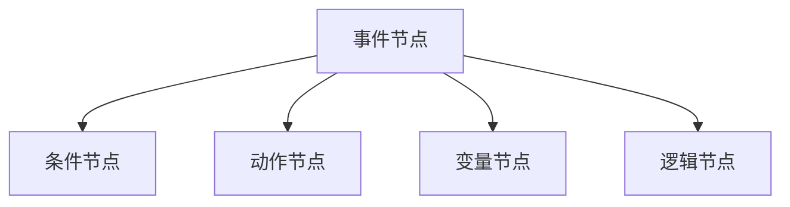
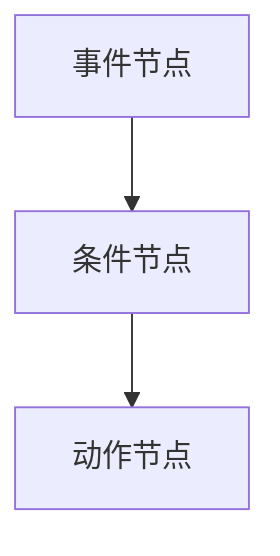
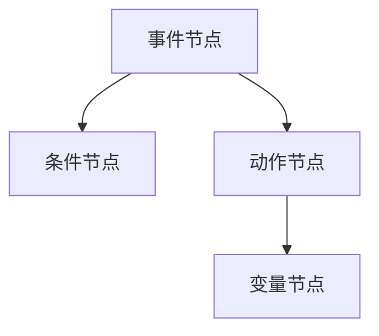

                 

# Unreal Engine蓝图系统：快速游戏原型开发

## 1. 背景介绍

### 1.1 问题由来
Unreal Engine（虚幻引擎）是一款由Epic Games开发的强大游戏引擎，广泛应用于视频游戏开发、电影特效制作等领域。然而，对于初学者或小型团队来说，直接上手C++代码编写可能门槛较高。为此，虚幻引擎引入了蓝图系统（Blueprints），允许开发者以拖拽和连接模块的方式快速构建游戏原型，显著降低了开发难度。

蓝图系统利用可视化编程的方式，将复杂的程序逻辑拆解为一系列可拖拽的节点模块，开发者只需在拖拽界面中构建连接，便可完成功能实现。这种编程方式对非程序员非常友好，使得即使是游戏设计的初学者也能快速上手。

### 1.2 问题核心关键点
蓝图系统作为Unreal Engine的核心编程工具之一，其核心功能包括：

- 可视化编程：通过拖拽模块构建功能，无需编写代码。
- 高度自定义：支持丰富的节点模块，灵活组合，满足各种开发需求。
- 自动生成代码：蓝图中的逻辑最终会自动生成C++代码，确保与原生代码兼容。
- 脚本支持：蓝图脚本可以在C++脚本中调用，实现脚本化扩展。
- 跨平台支持：支持Windows、Mac、Linux等多个平台，并支持跨平台开发。

蓝图系统不仅极大地降低了游戏开发的门槛，还为快速原型开发提供了高效的解决方案。对于开发者来说，蓝图系统使得他们能够专注于创意和设计，而非繁琐的编程细节。

## 2. 核心概念与联系

### 2.1 核心概念概述
蓝图系统是Unreal Engine中一种强大的可视化编程工具，允许开发者通过拖拽和连接模块的方式构建游戏逻辑，生成自动化的C++代码。蓝图系统由多个核心组件组成，包括：

- **事件节点**：用于触发事件，如用户操作、时间间隔等。
- **条件节点**：用于逻辑判断，如判断变量值、判断状态等。
- **动作节点**：用于执行操作，如播放动画、生成碰撞、移动对象等。
- **变量节点**：用于存储和处理数据，如变量、常量、数组等。
- **逻辑节点**：用于组合多个模块，实现复杂的逻辑功能。

### 2.2 核心概念原理和架构的 Mermaid 流程图

### 2.3 核心概念联系

蓝图系统的各个核心组件之间通过数据流进行连接和通信，实现复杂的逻辑功能。事件节点触发动作节点执行操作，条件节点判断逻辑分支，变量节点存储和处理数据，逻辑节点组合多个模块，最终生成自动化的C++代码。这种连接方式使得开发者无需编写代码，即可实现复杂的游戏逻辑。

## 3. 核心算法原理 & 具体操作步骤
### 3.1 算法原理概述
蓝图系统的核心算法原理在于可视化编程的自动代码生成。开发者在拖拽界面中构建的蓝图逻辑，最终会自动转化为C++代码，确保蓝图功能与原生代码无缝兼容。

蓝图系统的自动代码生成流程如下：

1. 开发者在拖拽界面中构建蓝图逻辑。
2. Unreal Engine自动解析蓝图逻辑，生成相应的C++代码。
3. C++代码被编译和优化，最终与原生代码链接，实现功能。

### 3.2 算法步骤详解

蓝图系统的具体操作步骤如下：

1. **创建蓝图**：在编辑器中，选择“Create Blueprint”（创建蓝图），输入蓝图名称和类别。
2. **添加节点**：在拖拽界面中添加所需的事件、条件、动作等节点。
3. **连接数据流**：拖拽节点之间的连线，建立数据流关系。
4. **测试和调试**：运行蓝图，检查是否达到预期效果，并进行调试。
5. **生成代码**：保存蓝图后，Unreal Engine自动生成对应的C++代码。
6. **编译和测试**：在编辑器中运行蓝图生成的C++代码，测试其功能。

### 3.3 算法优缺点

蓝图系统的优点包括：

- 降低编程难度：可视化编程方式降低了编程难度，即使没有编程基础也能快速上手。
- 提高开发效率：拖拽和连接模块的方式，加快了开发速度。
- 代码自动生成：自动生成C++代码，减少了编写和维护原生代码的工作量。
- 高度自定义：丰富的节点模块，灵活组合，满足各种开发需求。

蓝图系统的缺点包括：

- 功能受限：蓝图系统适合原型开发和快速迭代，但复杂逻辑和性能优化仍需依赖原生C++代码。
- 学习曲线：对于不熟悉图形界面的开发者，学习成本可能较高。
- 自动生成的代码质量：生成的代码可能存在冗余，需要进行后期优化。

### 3.4 算法应用领域

蓝图系统广泛应用于游戏开发中的原型设计和功能实现，以下是几个典型应用场景：

- **快速原型开发**：通过拖拽和连接模块的方式，快速实现游戏功能原型。
- **交互设计**：实现复杂的交互逻辑，如用户界面、输入输出等。
- **动画控制**：控制角色的动画播放，实现流畅的动作表现。
- **碰撞检测**：实现对象的碰撞检测和物理交互。
- **脚本调用**：在蓝图脚本中调用C++脚本，实现更复杂的功能扩展。

## 4. 数学模型和公式 & 详细讲解 & 举例说明

### 4.1 数学模型构建

蓝图系统的数学模型主要涉及事件处理、条件判断和数据处理等。以下以条件判断为例，介绍蓝图系统的数学模型构建。

设事件 $E$ 触发，需要判断变量 $x$ 是否满足条件 $C$。在蓝图中，可以如下构建数学模型：

1. 创建事件节点 $E$，设置事件类型。
2. 添加条件节点 $C$，判断 $x$ 是否满足条件。
3. 添加动作节点 $A$，根据判断结果执行相应操作。

### 4.2 公式推导过程

设 $x$ 为条件判断变量，$C$ 为判断条件，$A$ 为操作，则条件判断的数学模型可以表示为：

$$
\text{IF } x \text{ satisfies } C \text{ THEN } A
$$

在蓝图中，通过事件节点触发条件判断，条件节点执行判断，动作节点执行操作，实现了上述数学模型的逻辑表达。

### 4.3 案例分析与讲解

以下通过一个简单的蓝图案例，展示蓝图系统的应用：

假设我们开发一个简单的跳跃游戏，玩家按下跳跃按钮后，角色进行跳跃。在蓝图中，可以按照以下步骤构建：

1. 创建蓝图“JumpSystem”，添加事件节点“跳跃按钮”。
2. 添加条件节点，判断玩家是否按下跳跃按钮。
3. 添加动作节点，控制角色跳跃。

具体实现如下：

在这个案例中，事件节点触发条件判断，条件节点判断玩家是否按下跳跃按钮，动作节点控制角色进行跳跃。这种逻辑结构简单明了，易于理解和调试。

## 5. 项目实践：代码实例和详细解释说明

### 5.1 开发环境搭建

要使用蓝图系统，需要先搭建好Unreal Engine开发环境。以下是在Windows平台上搭建Unreal Engine的简要步骤：

1. 下载并安装Unreal Engine：从官方网站下载安装程序，安装Unreal Engine。
2. 创建新的项目：启动Unreal Engine，创建新的项目。
3. 创建蓝图：在项目浏览器中，选择“Blueprints”，点击“Create Blueprint”，输入蓝图名称和类别。
4. 添加节点：在拖拽界面中添加事件、条件、动作等节点，连接数据流。

### 5.2 源代码详细实现

以下是一个简单的蓝图脚本示例，用于实现游戏角色的移动功能：

在这个蓝图中，事件节点触发条件判断，条件节点判断玩家是否按下移动按钮，动作节点控制角色移动。变量节点用于存储和处理数据，如玩家的移动方向、速度等。

### 5.3 代码解读与分析

在拖拽界面中，每个节点都有详细的描述和参数设置。例如，事件节点可以设置事件类型，条件节点可以设置判断条件，动作节点可以设置执行操作。通过拖拽和连接模块，可以构建出复杂的逻辑功能。

### 5.4 运行结果展示

运行蓝图后，可以看到角色在屏幕上移动，实现预期效果。蓝图系统通过自动生成的C++代码，确保了蓝图功能和原生代码的兼容性和一致性。

## 6. 实际应用场景

### 6.1 快速游戏原型开发

蓝图系统特别适合用于快速游戏原型开发。通过拖拽和连接模块的方式，可以快速构建游戏功能原型，显著降低开发难度。例如，在开发一个简单的跑酷游戏时，开发者可以在拖拽界面中实现角色的移动、跳跃、碰撞等功能，快速迭代和测试游戏原型。

### 6.2 交互设计

蓝图系统适用于实现复杂的交互逻辑，如用户界面、输入输出等。例如，在游戏UI设计中，开发者可以通过拖拽节点，实现按钮点击、滚动条拖动等功能，提升用户体验。

### 6.3 动画控制

蓝图系统支持控制角色的动画播放，实现流畅的动作表现。例如，在动作游戏中，开发者可以通过拖拽节点，实现角色的攻击、跳跃、倒地等动画效果，提升游戏沉浸感。

### 6.4 脚本调用

蓝图系统可以在蓝图脚本中调用C++脚本，实现更复杂的功能扩展。例如，在游戏AI设计中，开发者可以通过蓝图脚本调用C++脚本，实现复杂的AI行为和决策逻辑。

## 7. 工具和资源推荐

### 7.1 学习资源推荐

为了帮助开发者系统掌握蓝图系统的使用技巧，这里推荐一些优质的学习资源：

1. **Unreal Engine官方文档**：Unreal Engine官方提供的详细文档，包含蓝图系统的使用方法、参数设置等。
2. **Unreal Engine开发手册**：一本系统介绍Unreal Engine开发流程的书籍，涵盖蓝图系统的详细讲解。
3. **Unreal Engine蓝图教程**：Unreal Engine官方提供的蓝图系统教程，包含大量示例和实战案例。
4. **蓝图脚本开发指南**：一本专门介绍蓝图脚本开发的书籍，详细讲解蓝图脚本的使用技巧和最佳实践。
5. **蓝图系统在线课程**：各大在线学习平台提供的蓝图系统课程，涵盖蓝图系统的基本原理和实践技巧。

通过这些资源的学习实践，相信你一定能够快速掌握蓝图系统的精髓，并用于解决实际的游戏开发问题。

### 7.2 开发工具推荐

Unreal Engine提供了丰富的开发工具，以下推荐的工具可以显著提升蓝图系统的开发效率：

1. **Visual Studio**：用于开发和管理蓝图脚本。
2. **Git版本控制**：用于版本管理和团队协作。
3. **JIRA项目管理**：用于项目管理和任务分配。
4. **Postman接口测试**：用于测试和调试蓝图脚本生成的API接口。

这些工具可以显著提升蓝图系统的开发效率，帮助开发者更快地实现功能和优化性能。

### 7.3 相关论文推荐

蓝图系统的核心思想在于可视化编程和自动代码生成，以下推荐几篇相关论文，供深入学习：

1. **Visual Programming with Eponymous Variables in Unreal Engine**：介绍在Unreal Engine中使用可视化编程的技术。
2. **Blueprints: A Visual Programming System for Unreal Engine**：介绍Unreal Engine中蓝图系统的实现原理和应用场景。
3. **An Analysis of Unreal Engine's Blueprints**：对蓝图系统的优缺点进行系统分析，提出改进建议。
4. **Blueprints: A Comparative Study of Visual Programming Languages**：对比分析蓝图系统与其他可视化编程语言的特点和应用效果。
5. **Graphical Programming in Unreal Engine**：介绍蓝图系统在图形编程中的应用和未来发展方向。

这些论文代表了蓝图系统研究的最新进展，能够为开发者提供更深入的理论支持和实践指导。

## 8. 总结：未来发展趋势与挑战

### 8.1 研究成果总结

蓝图系统作为Unreal Engine的核心编程工具之一，具有可视化编程、自动代码生成等优点，在原型开发和交互设计中发挥了重要作用。蓝图系统的应用范围广泛，涵盖游戏开发、动画控制、脚本调用等多个方面。

### 8.2 未来发展趋势

展望未来，蓝图系统将呈现以下几个发展趋势：

1. **功能扩展**：蓝图系统将继续扩展新的功能模块，提升开发效率和灵活性。
2. **性能优化**：自动生成的代码将进一步优化，提升运行效率。
3. **跨平台支持**：蓝图系统将继续支持更多平台，提升跨平台开发能力。
4. **社区扩展**：蓝图系统将引入更多的社区资源和插件，丰富应用场景。
5. **AI集成**：蓝图系统将集成AI技术，实现更加智能化的游戏开发。

### 8.3 面临的挑战

尽管蓝图系统具有诸多优点，但在实际应用中，仍面临一些挑战：

1. **功能受限**：复杂的逻辑和性能优化仍需依赖原生C++代码，限制了蓝图系统的应用范围。
2. **自动生成的代码质量**：自动生成的代码可能存在冗余，需要进行后期优化。
3. **学习曲线**：对于不熟悉图形界面的开发者，学习成本较高。
4. **兼容性问题**：不同版本的Unreal Engine可能存在兼容性问题，需要开发者注意版本管理。

### 8.4 研究展望

未来，蓝图系统的研究需要在以下几个方面寻求新的突破：

1. **功能增强**：进一步扩展蓝图系统的功能模块，提升开发效率和灵活性。
2. **性能优化**：提升自动生成的代码质量和运行效率，优化性能表现。
3. **社区支持**：丰富蓝图系统的社区资源和插件，提升用户体验。
4. **跨平台支持**：提升跨平台开发能力，支持更多平台和设备。
5. **AI集成**：集成AI技术，实现更加智能化的游戏开发。

这些研究方向将进一步提升蓝图系统的应用价值，推动游戏开发技术的不断进步。

## 9. 附录：常见问题与解答

### Q1：蓝图系统是否适用于所有开发任务？

A: 蓝图系统适用于原型开发和交互设计等相对简单的任务，但对于复杂的逻辑和性能优化，仍需依赖原生C++代码。对于需要高精度的功能，如AI和物理模拟，蓝图系统可能无法胜任。

### Q2：蓝图系统是否会降低代码的可读性和可维护性？

A: 蓝图系统通过可视化编程方式，简化了代码逻辑，但过度依赖拖拽和连接模块可能导致代码结构复杂，难以理解和维护。开发者在开发蓝图脚本时，应保持代码的简洁和清晰，避免过度复杂化。

### Q3：蓝图系统是否支持跨平台开发？

A: 蓝图系统支持Windows、Mac、Linux等多个平台，并支持跨平台开发。开发者可以在不同平台上共享蓝图脚本，实现跨平台开发和部署。

### Q4：蓝图系统是否支持与其他工具的集成？

A: 蓝图系统可以通过API接口与其他工具进行集成，如版本控制工具、项目管理工具等。开发者可以使用JIRA等项目管理工具进行任务分配和跟踪，使用Git进行版本管理，提升开发效率和协作能力。

### Q5：蓝图系统是否支持脚本扩展？

A: 蓝图系统支持在蓝图脚本中调用C++脚本，实现更复杂的功能扩展。开发者可以在蓝图脚本中编写C++代码，实现更灵活的逻辑处理和数据处理。

---

作者：禅与计算机程序设计艺术 / Zen and the Art of Computer Programming

