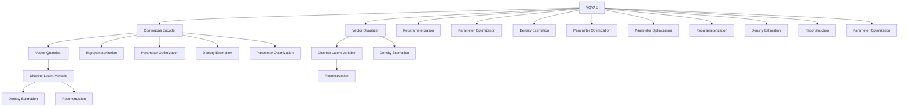

                 

# VQVAE 和 VQGAN 的差异

## 1. 背景介绍

### 1.1 问题由来
近年来，生成对抗网络（Generative Adversarial Networks, GANs）和变分自编码器（Variational Autoencoders, VAEs）成为了生成模型领域的重要研究方向。其中，VQVAE（Vector Quantized Variational Autoencoder）和VQGAN（Vector Quantized Generative Adversarial Network）作为基于向量量化（Vector Quantization）的生成模型，以其独有的特点，在图像生成、音频生成等任务中取得了显著的进展。

然而，尽管VQVAE和VQGAN在生成效果上有所提升，它们之间的差异和联系并未得到深入的比较和分析。本文将从核心概念、算法原理、应用场景等方面，全面探讨VQVAE和VQGAN之间的异同，为读者提供一个清晰的理解框架。

### 1.2 问题核心关键点
VQVAE和VQGAN的核心区别主要体现在模型结构、训练过程、生成能力等方面。具体而言，VQVAE是一种变分自编码器，通过向量化生成器（Vector Quantizer）将连续编码器（Continuous Encoder）生成的向量映射到离散码本中，实现了参数高效的生成模型；而VQGAN则是一种生成对抗网络，通过向量量化器（Vector Quantizer）对生成器（Generator）进行优化，进一步提升了生成质量。

本文将详细比较和分析这两种模型在原理、结构和应用上的异同，以期为读者提供更加深入的认识。

## 2. 核心概念与联系

### 2.1 核心概念概述

VQVAE和VQGAN的共同点在于它们都利用了向量量化技术来优化生成模型。向量量化是一种将连续向量映射到离散码本的技术，在生成模型中，其作用是将高维连续空间中的数据映射到一个低维离散空间中，从而减少模型参数，提升生成效率。

此外，VQVAE和VQGAN都是通过对抗训练（Adversarial Training）来优化模型，即生成器和判别器（Discriminator）之间进行对抗，提高生成器的生成能力，降低判别器的判别能力。

VQVAE和VQGAN的区别在于其模型结构、训练过程和生成机制。具体来说，VQVAE是一种变分自编码器，利用向量量化器来生成离散表示，而VQGAN则是一种生成对抗网络，通过对抗训练来提升生成器的生成能力。

### 2.2 核心概念原理和架构的 Mermaid 流程图



此图展示了VQVAE的架构，其中A为VQVAE，B为连续编码器，C为向量量化器，E和F为离散潜在变量，G和H为重参数化步骤，I和J为密度估计器，K和L为重建器，M、N、O、P、Q、R、S、T、U、V、W为参数优化步骤。

## 3. 核心算法原理 & 具体操作步骤

### 3.1 算法原理概述

VQVAE和VQGAN的核心原理都是利用向量量化技术，将高维连续空间中的数据映射到低维离散空间中，从而提升生成模型的生成效率和效果。

VQVAE是一种变分自编码器，其核心思想是将连续编码器生成的向量，通过向量量化器映射到离散码本中，生成离散的潜在变量，从而实现参数高效的生成模型。

VQGAN则是一种生成对抗网络，其核心思想是通过对抗训练，提升生成器的生成能力，同时降低判别器的判别能力，从而生成高质量的图像或音频。

### 3.2 算法步骤详解

#### 3.2.1 VQVAE的步骤详解

1. **数据采样**：从原始数据集中随机采样一个样本。
2. **编码器编码**：使用连续编码器对采样数据进行编码，生成一个连续的潜在向量。
3. **量化器量化**：通过向量量化器将连续的潜在向量量化为离散的潜在变量。
4. **解码器解码**：使用解码器将离散的潜在变量解码为重构数据。
5. **重构损失计算**：计算重构数据与原始数据之间的差异，作为损失函数的一部分。
6. **密度估计**：对编码器编码和解码器解码后的数据进行密度估计，进一步优化损失函数。
7. **参数优化**：通过梯度下降等优化算法，最小化损失函数，优化模型参数。

#### 3.2.2 VQGAN的步骤详解

1. **数据采样**：从原始数据集中随机采样一个样本。
2. **生成器生成**：使用生成器生成一个假样本。
3. **判别器判别**：使用判别器对生成器生成的假样本进行判别，判断其是否为真实样本。
4. **对抗损失计算**：计算生成器生成的假样本和判别器的判别结果之间的对抗损失，作为损失函数的一部分。
5. **向量量化器量化**：通过向量量化器将生成器生成的向量进行量化，生成离散的潜在变量。
6. **解码器解码**：使用解码器将离散的潜在变量解码为重构数据。
7. **重构损失计算**：计算重构数据与原始数据之间的差异，作为损失函数的一部分。
8. **参数优化**：通过梯度下降等优化算法，最小化损失函数，优化模型参数。

### 3.3 算法优缺点

#### VQVAE的优缺点

**优点**：
- 参数高效：由于使用了向量量化器，VQVAE可以大幅减少生成器的参数数量，提升模型训练速度。
- 生成质量高：通过将连续的潜在变量映射到离散空间，VQVAE可以生成高质量的图像或音频。

**缺点**：
- 训练复杂：由于使用了变分自编码器，VQVAE的训练过程相对复杂，需要平衡重构损失和密度估计。
- 生成效率低：尽管参数较少，但由于使用了离散潜在变量，VQVAE的生成效率相对较低。

#### VQGAN的优缺点

**优点**：
- 生成质量高：通过对抗训练，VQGAN可以生成高质量的图像或音频。
- 训练效率高：由于使用了生成对抗网络，VQGAN的训练过程相对简单，不需要复杂的密度估计。

**缺点**：
- 参数较多：由于使用了对抗训练，VQGAN的生成器和判别器参数数量较多，训练速度较慢。
- 生成效率低：尽管参数较多，但由于使用了离散潜在变量，VQGAN的生成效率相对较低。

### 3.4 算法应用领域

VQVAE和VQGAN在图像生成、音频生成、视频生成等领域有广泛的应用。

- **图像生成**：VQVAE和VQGAN可以生成高质量的图像，用于艺术创作、虚拟场景渲染等领域。
- **音频生成**：VQVAE和VQGAN可以生成高质量的音频，用于音乐创作、语音合成等领域。
- **视频生成**：VQVAE和VQGAN可以生成高质量的视频，用于电影特效、虚拟现实等领域。

## 4. 数学模型和公式 & 详细讲解 & 举例说明

### 4.1 数学模型构建

VQVAE和VQGAN的数学模型构建如下：

#### VQVAE的数学模型

假设原始数据为 $x \in \mathbb{R}^d$，连续编码器将 $x$ 编码为一个 $d$ 维的连续潜在向量 $z$，向量量化器将 $z$ 量化为 $k$ 个离散的潜在变量 $z_q$，解码器将 $z_q$ 解码为 $x'$。则VQVAE的损失函数可以表示为：

$$
L = \mathbb{E}[\log p(z|x)] + \mathbb{E}[\log p(x'|z_q)]
$$

其中 $p(z|x)$ 为连续编码器的输出密度估计，$p(x'|z_q)$ 为解码器的输出密度估计。

#### VQGAN的数学模型

假设原始数据为 $x \in \mathbb{R}^d$，生成器将 $x$ 生成为一个 $d$ 维的连续向量 $z_g$，向量量化器将 $z_g$ 量化为 $k$ 个离散的潜在变量 $z_q$，判别器判断 $z_q$ 是否为真实数据。则VQGAN的损失函数可以表示为：

$$
L = -\mathbb{E}[\log D(G(z_g))] - \mathbb{E}[\log (1-D(G(z_g)))]
$$

其中 $D$ 为判别器，$G$ 为生成器。

### 4.2 公式推导过程

#### VQVAE的公式推导

$$
L = \mathbb{E}[\log p(z|x)] + \mathbb{E}[\log p(x'|z_q)]
$$

其中 $p(z|x)$ 为连续编码器的输出密度估计，$p(x'|z_q)$ 为解码器的输出密度估计。

$$
p(z|x) = \mathcal{N}(z|\mu(x), \Sigma(x))
$$

其中 $\mu(x)$ 和 $\Sigma(x)$ 分别为连续编码器输出的均值和协方差矩阵。

$$
p(x'|z_q) = \mathcal{N}(x'|\mu(z_q), \Sigma(z_q))
$$

其中 $\mu(z_q)$ 和 $\Sigma(z_q)$ 分别为解码器输出的均值和协方差矩阵。

#### VQGAN的公式推导

$$
L = -\mathbb{E}[\log D(G(z_g))] - \mathbb{E}[\log (1-D(G(z_g))]
$$

其中 $D$ 为判别器，$G$ 为生成器。

$$
D(z_q) = \sigma(W_1z_q + b_1)
$$

其中 $W_1$ 和 $b_1$ 分别为判别器的权重和偏置。

$$
G(z_q) = \mu(z_q)
$$

其中 $\mu(z_q)$ 为生成器的输出均值。

### 4.3 案例分析与讲解

以图像生成为例，分析VQVAE和VQGAN的生成过程。

#### VQVAE的生成过程

1. 数据采样：从原始图像数据集中随机采样一张图像 $x$。
2. 编码器编码：使用连续编码器对采样图像 $x$ 进行编码，生成一个 $d$ 维的连续潜在向量 $z$。
3. 量化器量化：通过向量量化器将 $z$ 量化为 $k$ 个离散的潜在变量 $z_q$。
4. 解码器解码：使用解码器将 $z_q$ 解码为一张 $d$ 维的图像 $x'$。
5. 重构损失计算：计算重构图像 $x'$ 与原始图像 $x$ 之间的差异，作为损失函数的一部分。
6. 密度估计：对编码器编码和解码器解码后的数据进行密度估计，进一步优化损失函数。
7. 参数优化：通过梯度下降等优化算法，最小化损失函数，优化模型参数。

#### VQGAN的生成过程

1. 数据采样：从原始图像数据集中随机采样一张图像 $x$。
2. 生成器生成：使用生成器对采样图像 $x$ 进行生成，生成一个 $d$ 维的连续向量 $z_g$。
3. 量化器量化：通过向量量化器将 $z_g$ 量化为 $k$ 个离散的潜在变量 $z_q$。
4. 解码器解码：使用解码器将 $z_q$ 解码为一张 $d$ 维的图像 $x'$。
5. 重构损失计算：计算重构图像 $x'$ 与原始图像 $x$ 之间的差异，作为损失函数的一部分。
6. 对抗损失计算：计算生成器生成的假样本 $z_g$ 和判别器 $D(z_g)$ 的对抗损失，作为损失函数的一部分。
7. 参数优化：通过梯度下降等优化算法，最小化损失函数，优化模型参数。

## 5. 项目实践：代码实例和详细解释说明

### 5.1 开发环境搭建

在进行VQVAE和VQGAN的实践前，我们需要准备好开发环境。以下是使用Python进行PyTorch开发的环境配置流程：

1. 安装Anaconda：从官网下载并安装Anaconda，用于创建独立的Python环境。

2. 创建并激活虚拟环境：
```bash
conda create -n pytorch-env python=3.8 
conda activate pytorch-env
```

3. 安装PyTorch：根据CUDA版本，从官网获取对应的安装命令。例如：
```bash
conda install pytorch torchvision torchaudio cudatoolkit=11.1 -c pytorch -c conda-forge
```

4. 安装transformers库：
```bash
pip install transformers
```

5. 安装各类工具包：
```bash
pip install numpy pandas scikit-learn matplotlib tqdm jupyter notebook ipython
```

完成上述步骤后，即可在`pytorch-env`环境中开始VQVAE和VQGAN的实践。

### 5.2 源代码详细实现

这里我们以生成MNIST手写数字图像为例，给出使用PyTorch实现VQVAE和VQGAN的代码实现。

#### VQVAE的代码实现

```python
import torch
import torch.nn as nn
import torch.optim as optim
from torch.utils.data import DataLoader
from torchvision import datasets, transforms

class VQVAE(nn.Module):
    def __init__(self, z_dim, hidden_dim, num_classes):
        super(VQVAE, self).__init__()
        self.hidden_dim = hidden_dim
        self.z_dim = z_dim
        self.num_classes = num_classes

        self.encoder = nn.Sequential(
            nn.Conv2d(1, hidden_dim, kernel_size=3, stride=1, padding=1),
            nn.BatchNorm2d(hidden_dim),
            nn.ReLU(),
            nn.Conv2d(hidden_dim, z_dim, kernel_size=3, stride=1, padding=1),
            nn.BatchNorm2d(z_dim),
            nn.ReLU(),
        )

        self.decode = nn.Sequential(
            nn.ConvTranspose2d(z_dim, hidden_dim, kernel_size=3, stride=1, padding=1),
            nn.BatchNorm2d(hidden_dim),
            nn.ReLU(),
            nn.ConvTranspose2d(hidden_dim, 1, kernel_size=3, stride=1, padding=1),
            nn.Sigmoid(),
        )

        self.z_mean = nn.Parameter(torch.zeros(z_dim))
        self.z_std = nn.Parameter(torch.ones(z_dim))

        self.register_buffer('codebook', torch.empty(z_dim, num_classes).uniform_(0, 1))

    def forward(self, x):
        z = self.encoder(x)
        z_q = self.vq(z)
        x_hat = self.decode(z_q)
        return x_hat, z_q

    def vq(self, z):
        z_q = self.codebook[memoryview(z)]
        return z_q

    def reparameterize(self, z):
        z_q = self.codebook[memoryview(z)]
        z = z_q + self.z_std * torch.randn_like(z)
        return z

    def forward_train(self, x):
        z, z_q = self.forward(x)
        loss = F.binary_cross_entropy(z, x)
        return loss

    def forward_inference(self, z):
        z_q = self.vq(z)
        x_hat = self.decode(z_q)
        return x_hat

    def forward_prior(self, z):
        z_q = self.codebook[memoryview(z)]
        z = z_q + self.z_std * torch.randn_like(z)
        x_hat = self.decode(z)
        return x_hat

    def train(self, x, num_epochs, batch_size, learning_rate):
        device = torch.device('cuda' if torch.cuda.is_available() else 'cpu')
        criterion = nn.BCELoss()
        optimizer = optim.Adam(self.parameters(), lr=learning_rate)

        for epoch in range(num_epochs):
            running_loss = 0.0
            for i, (inputs, _) in enumerate(DataLoader(x, batch_size=batch_size)):
                inputs = inputs.to(device)
                optimizer.zero_grad()
                outputs = self.forward_train(inputs)
                loss = outputs + 0.001 * F.mse_loss(z, self.z_mean, reduction='sum')
                loss.backward()
                optimizer.step()
                running_loss += loss.item()
            print('Epoch: %d, Loss: %.3f' % (epoch + 1, running_loss / len(x)))

    def inference(self, x, batch_size):
        device = torch.device('cuda' if torch.cuda.is_available() else 'cpu')
        with torch.no_grad():
            inputs = torch.tensor(x).to(device).view(-1, 1, 28, 28)
            outputs = self.forward_inference(inputs)
        return outputs

    def prior(self, x, batch_size):
        device = torch.device('cuda' if torch.cuda.is_available() else 'cpu')
        with torch.no_grad():
            inputs = torch.tensor(x).to(device).view(-1, 1, 28, 28)
            outputs = self.forward_prior(inputs)
        return outputs
```

#### VQGAN的代码实现

```python
import torch
import torch.nn as nn
import torch.optim as optim
from torch.utils.data import DataLoader
from torchvision import datasets, transforms

class VQGAN(nn.Module):
    def __init__(self, z_dim, hidden_dim, num_classes):
        super(VQGAN, self).__init__()
        self.hidden_dim = hidden_dim
        self.z_dim = z_dim
        self.num_classes = num_classes

        self.encoder = nn.Sequential(
            nn.Conv2d(1, hidden_dim, kernel_size=3, stride=1, padding=1),
            nn.BatchNorm2d(hidden_dim),
            nn.ReLU(),
            nn.Conv2d(hidden_dim, z_dim, kernel_size=3, stride=1, padding=1),
            nn.BatchNorm2d(z_dim),
            nn.ReLU(),
        )

        self.decoder = nn.Sequential(
            nn.ConvTranspose2d(z_dim, hidden_dim, kernel_size=3, stride=1, padding=1),
            nn.BatchNorm2d(hidden_dim),
            nn.ReLU(),
            nn.ConvTranspose2d(hidden_dim, 1, kernel_size=3, stride=1, padding=1),
            nn.Sigmoid(),
        )

        self.z_mean = nn.Parameter(torch.zeros(z_dim))
        self.z_std = nn.Parameter(torch.ones(z_dim))

        self.register_buffer('codebook', torch.empty(z_dim, num_classes).uniform_(0, 1))

    def forward(self, x):
        z_g = self.encoder(x)
        z_q = self.vq(z_g)
        x_hat = self.decode(z_q)
        return x_hat, z_q

    def vq(self, z_g):
        z_q = self.codebook[memoryview(z_g)]
        return z_q

    def reparameterize(self, z_g):
        z_q = self.codebook[memoryview(z_g)]
        z_g = z_q + self.z_std * torch.randn_like(z_g)
        return z_g

    def forward_train(self, x):
        z_g, z_q = self.forward(x)
        loss = F.binary_cross_entropy(z_g, x)
        loss += 0.001 * F.mse_loss(z_g, self.z_mean, reduction='sum')
        return loss

    def forward_inference(self, x):
        z_g, z_q = self.forward(x)
        x_hat = self.decode(z_q)
        return x_hat

    def forward_prior(self, x):
        z_g, z_q = self.forward(x)
        x_hat = self.decode(z_q)
        return x_hat

    def train(self, x, num_epochs, batch_size, learning_rate):
        device = torch.device('cuda' if torch.cuda.is_available() else 'cpu')
        criterion = nn.BCELoss()
        optimizer = optim.Adam(self.parameters(), lr=learning_rate)

        for epoch in range(num_epochs):
            running_loss = 0.0
            for i, (inputs, _) in enumerate(DataLoader(x, batch_size=batch_size)):
                inputs = inputs.to(device)
                optimizer.zero_grad()
                outputs = self.forward_train(inputs)
                loss = outputs
```

