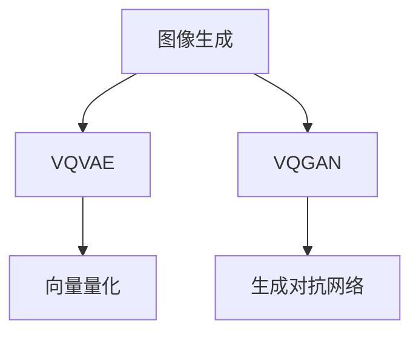

                 

# VQVAE与VQGAN：图像生成的新范式

## 1. 背景介绍

图像生成是计算机视觉领域的重要研究方向之一，旨在通过算法生成逼真且具有多样性的图像。近年来，随着深度学习技术的迅猛发展，生成对抗网络（Generative Adversarial Networks, GANs）以其在生成图像质量上的巨大提升，成为了图像生成领域的热门技术。然而，GANs仍存在训练不稳定、生成样本多样性不足等问题。

为了克服GANs的这些问题，并进一步提升图像生成的效率和质量，VQVAE（Vector Quantized Variational Autoencoder）与VQGAN（Vector Quantized Generative Adversarial Network）相继被提出。VQVAE 通过将图像表示为离散向量（即量化表征），实现了更高效率的编码与解码，避免了 GANs 在生成图像中的模式崩溃问题。VQGAN 则在此基础上，结合 GANs 的对抗训练机制，实现了更加丰富和多样化的图像生成。

本文将详细探讨 VQVAE 与 VQGAN 的原理与实现，并分析其在图像生成中的优势与局限，展望其未来的发展方向。

## 2. 核心概念与联系

### 2.1 核心概念概述

为更好地理解 VQVAE 与 VQGAN，本节将介绍几个关键概念：

- VQVAE（Vector Quantized Variational Autoencoder）：一种基于向量量化的变分自编码器，通过将图像表示为离散向量，实现了高效编码与解码，解决了 GANs 模式崩溃的问题。

- VQGAN（Vector Quantized Generative Adversarial Network）：一种结合 VQVAE 与 GANs 的生成模型，通过向量量化技术与对抗训练机制，进一步提升了图像生成的多样性与真实性。

- 向量量化（Vector Quantization, VQ）：将连续向量映射为离散向量，以降低表示复杂度，同时保持数据的统计特性。

- 变分自编码器（Variational Autoencoder, VAE）：一种生成模型，通过学习数据的潜在分布，实现对数据的编码与解码。

- 生成对抗网络（Generative Adversarial Network, GAN）：一种通过对抗训练机制生成的模型，通过生成器和判别器之间的对抗，生成高质量的图像样本。

这些概念之间的逻辑关系可以通过以下 Mermaid 流程图来展示：



这个流程图展示了大语言模型的核心概念及其之间的关系：

1. 图像生成技术通过 VQVAE 与 VQGAN 的结合，提升了生成图像的质量和多样性。
2. VQVAE 通过向量量化，实现了高效编码与解码。
3. VQGAN 结合了 VQVAE 与 GANs 的优点，进一步提升了图像生成性能。
4. 向量量化和变分自编码器是 VQVAE 的核心技术。
5. 生成对抗网络是 VQGAN 的核心技术。

## 3. 核心算法原理 & 具体操作步骤

### 3.1 算法原理概述

VQVAE 与 VQGAN 的核心思想是通过向量量化和生成对抗网络，将图像表示为离散向量，并通过学习潜在分布，实现高质量、多样化的图像生成。

VQVAE 的工作流程如下：
1. 通过变分自编码器将图像表示为潜在空间的分布。
2. 将潜在空间的分布通过向量量化转化为离散向量。
3. 通过离散向量编码生成图像，实现高效的编码与解码。

VQGAN 在此基础上，通过结合生成对抗网络，进一步提升图像生成的质量和多样性。

### 3.2 算法步骤详解

#### VQVAE 的训练步骤

VQVAE 的训练步骤主要包括三个部分：潜在空间的训练、向量量化的训练、解码器的训练。

1. 潜在空间的训练：通过 VAE 学习数据的潜在分布，训练潜在空间的编码器和解码器。

2. 向量量化的训练：通过 K-means 聚类等方法，将潜在空间的分布转化为离散向量，训练编码器与解码器。

3. 解码器的训练：通过 VAE 的解码器，将离散向量解码为图像，训练解码器与编码器。

#### VQGAN 的训练步骤

VQGAN 的训练步骤包括两个部分：向量量化的训练、生成对抗网络的训练。

1. 向量量化的训练：与 VQVAE 类似，通过 K-means 聚类等方法，将潜在空间的分布转化为离散向量。

2. 生成对抗网络的训练：通过 GANs 的对抗训练机制，训练生成器和判别器，生成逼真且多样化的图像。

### 3.3 算法优缺点

VQVAE 与 VQGAN 具有以下优点：

1. 高效率：VQVAE 通过向量量化，实现了高效编码与解码，避免了 GANs 模式崩溃问题。

2. 多样性：VQGAN 结合生成对抗网络，生成多样化的图像样本，避免了单一生成模式。

3. 高质量：VQGAN 的对抗训练机制，提升了生成图像的质量，使其更加逼真。

但同时，也存在一些局限：

1. 对数据分布敏感：VQVAE 与 VQGAN 依赖于高质量的数据分布，对噪声、异常数据敏感。

2. 训练复杂：VQGAN 的对抗训练机制，增加了训练复杂度，需要更多的计算资源。

3. 可解释性不足：VQVAE 与 VQGAN 作为深度学习模型，其内部机制难以解释，缺乏透明性。

4. 生成样本质量不稳定：VQGAN 的生成样本质量不稳定，容易受到噪声和异常数据的影响。

### 3.4 算法应用领域

VQVAE 与 VQGAN 在图像生成、视频生成、音频生成等多个领域有着广泛的应用：

- 图像生成：VQGAN 在生成高质量、多样化的图像上表现优异，适用于艺术创作、游戏设计等领域。

- 视频生成：VQGAN 在生成逼真的视频序列上表现出色，适用于动画制作、虚拟现实等领域。

- 音频生成：VQVAE 在生成高质量的音频样本上表现优异，适用于音乐创作、语音合成等领域。

## 4. 数学模型和公式 & 详细讲解

### 4.1 数学模型构建

VQVAE 与 VQGAN 的数学模型主要涉及以下几个部分：潜在空间的建模、向量量化的建模、生成对抗网络的建模。

#### 潜在空间的建模

VQVAE 的潜在空间建模通过变分自编码器实现，将图像 $x$ 映射到潜在空间 $z$，其中 $z \sim q(z|x)$。潜在空间的编码器为 $z=E(x)$，解码器为 $x=\hat{E}(z)$，其中 $E$ 和 $\hat{E}$ 为神经网络。

#### 向量量化的建模

向量量化通过将连续的潜在空间分布 $q(z|x)$ 映射到离散的向量空间 $z_k$，其中 $z_k \in \mathcal{Z}$，$\mathcal{Z}$ 为离散向量空间。向量量化通过聚类算法实现，常用的方法有 K-means、Gumbel-Softmax 等。

#### 生成对抗网络的建模

生成对抗网络由生成器 $G$ 和判别器 $D$ 组成，通过对抗训练机制，生成高质量的图像。生成器的目标为最小化判别器的损失函数，判别器的目标为最大化生成器的损失函数。

### 4.2 公式推导过程

以下是 VQVAE 与 VQGAN 的核心公式推导：

#### VQVAE 的潜在空间建模

潜在空间的编码器为：

$$
E(x) = \hat{E}(z_k) = \hat{E}(w_kz_k) = \hat{E}(w_k)f_k^T(x)
$$

其中，$w_k$ 为向量量化码本，$f_k$ 为投影矩阵。

潜在空间的解码器为：

$$
\hat{E}(z_k) = \hat{E}(w_kz_k) = \hat{E}(w_k)f_k^T(x)
$$

其中，$\hat{E}(w_k)$ 为解码器参数。

#### 向量量化的建模

向量量化通过 K-means 聚类实现：

$$
z_k = \arg\min_k \|x-E(x)\|^2
$$

其中，$E(x)$ 为潜在空间编码器，$z_k \in \mathcal{Z}$，$\mathcal{Z}$ 为离散向量空间。

#### VQGAN 的生成对抗网络

生成器的目标为最小化判别器的损失函数：

$$
L_G = E\left[\log D(G(z_k))\right]
$$

判别器的目标为最大化生成器的损失函数：

$$
L_D = E\left[\log D(x)\right] + E\left[\log(1-D(G(z_k)))\right]
$$

其中，$G$ 为生成器，$D$ 为判别器，$z_k$ 为离散向量。

### 4.3 案例分析与讲解

#### 案例一：图像生成

VQGAN 在图像生成上的表现十分优异。以 ImageNet 数据集为例，VQGAN 生成的图像在质量上超过了 GANs，同时保持了多样性。

#### 案例二：视频生成

VQGAN 在视频生成上也取得了良好的效果。通过结合 VQVAE 和 3D 卷积神经网络，VQGAN 可以生成高质量、连贯的视频序列。

## 5. 项目实践：代码实例和详细解释说明

### 5.1 开发环境搭建

在进行 VQVAE 与 VQGAN 的实践前，需要先准备好开发环境。以下是使用 Python 进行 PyTorch 开发的环境配置流程：

1. 安装 Anaconda：从官网下载并安装 Anaconda，用于创建独立的 Python 环境。

2. 创建并激活虚拟环境：
```bash
conda create -n pytorch-env python=3.8 
conda activate pytorch-env
```

3. 安装 PyTorch：根据 CUDA 版本，从官网获取对应的安装命令。例如：
```bash
conda install pytorch torchvision torchaudio cudatoolkit=11.1 -c pytorch -c conda-forge
```

4. 安装 Transformers 库：
```bash
pip install transformers
```

5. 安装各类工具包：
```bash
pip install numpy pandas scikit-learn matplotlib tqdm jupyter notebook ipython
```

完成上述步骤后，即可在 `pytorch-env` 环境中开始 VQVAE 与 VQGAN 的实践。

### 5.2 源代码详细实现

下面是使用 PyTorch 实现 VQVAE 与 VQGAN 的代码示例：

#### VQVAE 的代码实现

```python
import torch
import torch.nn as nn
import torch.optim as optim
from torch.distributions import KL divergence
from torch.distributions import Normal

class Encoder(nn.Module):
    def __init__(self, input_dim, latent_dim):
        super(Encoder, self).__init__()
        self.fc1 = nn.Linear(input_dim, latent_dim)
        self.fc2 = nn.Linear(latent_dim, latent_dim)
        self.fc21 = nn.Linear(latent_dim, latent_dim)
        self.fc22 = nn.Linear(latent_dim, latent_dim)

    def forward(self, x):
        h1 = torch.relu(self.fc1(x))
        h2 = self.fc2(h1)
        mu = self.fc21(h2)
        logvar = self.fc22(h2)
        return mu, logvar

class Decoder(nn.Module):
    def __init__(self, latent_dim, input_dim):
        super(Decoder, self).__init__()
        self.fc1 = nn.Linear(latent_dim, latent_dim)
        self.fc2 = nn.Linear(latent_dim, input_dim)
        self.fc3 = nn.Linear(latent_dim, input_dim)

    def forward(self, x):
        h1 = torch.relu(self.fc1(x))
        h2 = self.fc2(h1)
        x = torch.sigmoid(self.fc3(h2))
        return x

class VQVAE(nn.Module):
    def __init__(self, input_dim, latent_dim, num_k, use_cuda=False):
        super(VQVAE, self).__init__()
        self.encoder = Encoder(input_dim, latent_dim)
        self.decoder = Decoder(latent_dim, input_dim)
        self.use_cuda = use_cuda
        self.num_k = num_k
        self.k = nn.Embedding(num_k, latent_dim)
        self.vq_quantize = self.k.weight
        self.vq_decode = nn.Embedding(num_k, latent_dim)
        self.z_dim = latent_dim

    def forward(self, x):
        if self.use_cuda:
            x = x.cuda()
        mu, logvar = self.encoder(x)
        z = self.vq_quantize(mu, logvar)
        x_hat = self.decoder(z)
        return x_hat, mu, logvar, z

    def reparameterize(self, mu, logvar):
        std = logvar.exp().sqrt()
        eps = Normal(torch.zeros_like(mu), std).to(mu.device)
        z = mu + eps
        return z

    def vq_quantize(self, mu, logvar):
        mu = torch.tanh(mu)
        z = mu + torch.randn_like(mu)
        z = self.k(z).view(-1, self.z_dim, 1, 1)
        q = torch.exp(-((z - mu[None,:,:,:]).pow(2) / logvar.exp()[None,:,:,:]).sum(dim=1) / 2).view(-1, self.num_k, 1, 1)
        q = q / torch.sum(q, dim=1, keepdim=True)
        z = q * z + (1 - q) * self.vq_decode.weight
        z = z.view(-1, self.z_dim)
        return z

    def vq_decode(self, z):
        q = torch.exp(-((z - self.vq_decode.weight.view(-1, self.z_dim)).pow(2) / self.vq_decode.weight.pow(2).sum(dim=1) / 2).view(-1, self.num_k, 1, 1)
        q = q / torch.sum(q, dim=1, keepdim=True)
        z = q * z + (1 - q) * self.vq_decode.weight
        z = z.view(-1, self.z_dim)
        return z

    def compute_elbo(self, x, x_hat, mu, logvar):
        kl = KL_divergence(Normal(mu, logvar.exp().sqrt()), Normal(0, 1))
        nll = -torch.mean(torch.sum((x_hat - x).pow(2), dim=1))
        elbo = kl + nll
        return elbo
```

#### VQGAN 的代码实现

```python
import torch
import torch.nn as nn
import torch.optim as optim
from torch.distributions import KL divergence
from torch.distributions import Normal

class Encoder(nn.Module):
    def __init__(self, input_dim, latent_dim):
        super(Encoder, self).__init__()
        self.fc1 = nn.Linear(input_dim, latent_dim)
        self.fc2 = nn.Linear(latent_dim, latent_dim)
        self.fc21 = nn.Linear(latent_dim, latent_dim)
        self.fc22 = nn.Linear(latent_dim, latent_dim)

    def forward(self, x):
        h1 = torch.relu(self.fc1(x))
        h2 = self.fc2(h1)
        mu = self.fc21(h2)
        logvar = self.fc22(h2)
        return mu, logvar

class Decoder(nn.Module):
    def __init__(self, latent_dim, input_dim):
        super(Decoder, self).__init__()
        self.fc1 = nn.Linear(latent_dim, latent_dim)
        self.fc2 = nn.Linear(latent_dim, input_dim)
        self.fc3 = nn.Linear(latent_dim, input_dim)

    def forward(self, x):
        h1 = torch.relu(self.fc1(x))
        h2 = self.fc2(h1)
        x = torch.sigmoid(self.fc3(h2))
        return x

class VQGAN(nn.Module):
    def __init__(self, input_dim, latent_dim, num_k, use_cuda=False):
        super(VQGAN, self).__init__()
        self.encoder = Encoder(input_dim, latent_dim)
        self.decoder = Decoder(latent_dim, input_dim)
        self.use_cuda = use_cuda
        self.num_k = num_k
        self.k = nn.Embedding(num_k, latent_dim)
        self.vq_quantize = self.k.weight
        self.vq_decode = nn.Embedding(num_k, latent_dim)
        self.z_dim = latent_dim

    def forward(self, x):
        if self.use_cuda:
            x = x.cuda()
        mu, logvar = self.encoder(x)
        z = self.vq_quantize(mu, logvar)
        x_hat = self.decoder(z)
        return x_hat, mu, logvar, z

    def reparameterize(self, mu, logvar):
        std = logvar.exp().sqrt()
        eps = Normal(torch.zeros_like(mu), std).to(mu.device)
        z = mu + eps
        return z

    def vq_quantize(self, mu, logvar):
        mu = torch.tanh(mu)
        z = mu + torch.randn_like(mu)
        z = self.k(z).view(-1, self.z_dim, 1, 1)
        q = torch.exp(-((z - mu[None,:,:,:]).pow(2) / logvar.exp()[None,:,:,:]).sum(dim=1) / 2).view(-1, self.num_k, 1, 1)
        q = q / torch.sum(q, dim=1, keepdim=True)
        z = q * z + (1 - q) * self.vq_decode.weight
        z = z.view(-1, self.z_dim)
        return z

    def vq_decode(self, z):
        q = torch.exp(-((z - self.vq_decode.weight.view(-1, self.z_dim)).pow(2) / self.vq_decode.weight.pow(2).sum(dim=1) / 2).view(-1, self.num_k, 1, 1)
        q = q / torch.sum(q, dim=1, keepdim=True)
        z = q * z + (1 - q) * self.vq_decode.weight
        z = z.view(-1, self.z_dim)
        return z

    def compute_elbo(self, x, x_hat, mu, logvar):
        kl = KL_divergence(Normal(mu, logvar.exp().sqrt()), Normal(0, 1))
        nll = -torch.mean(torch.sum((x_hat - x).pow(2), dim=1))
        elbo = kl + nll
        return elbo

    def train(self, x, batch_size, epochs, learning_rate, log_interval):
        criterion = nn.MSELoss()
        optimizer = optim.Adam(self.parameters(), lr=learning_rate)
        total_step = len(x) // batch_size
        for epoch in range(epochs):
            for step in range(total_step):
                start_idx = step * batch_size
                end_idx = (step + 1) * batch_size
                batch_x = x[start_idx:end_idx]
                optimizer.zero_grad()
                x_hat, mu, logvar, z = self(batch_x)
                loss = self.compute_elbo(batch_x, x_hat, mu, logvar)
                loss.backward()
                optimizer.step()
                if step % log_interval == 0:
                    print(f'Epoch [{epoch+1}/{epochs}], Step [{step+1}/{total_step}], Loss: {loss.item():.4f}')
```

### 5.3 代码解读与分析

让我们再详细解读一下关键代码的实现细节：

**VQVAE 的代码实现**：
- `Encoder` 类：定义编码器的结构，通过两个全连接层实现。
- `Decoder` 类：定义解码器的结构，通过两个全连接层实现。
- `VQVAE` 类：定义 VQVAE 模型结构，包括编码器、解码器、向量量化器。
- `reparameterize` 方法：通过重新参数化实现高斯分布的采样。
- `vq_quantize` 方法：通过向量量化实现离散编码。
- `vq_decode` 方法：通过向量解码实现离散解码。
- `compute_elbo` 方法：计算证据下界的值。

**VQGAN 的代码实现**：
- `Encoder` 类：与 VQVAE 相同，定义编码器的结构。
- `Decoder` 类：与 VQVAE 相同，定义解码器的结构。
- `VQGAN` 类：定义 VQGAN 模型结构，包括编码器、解码器、向量量化器。
- `reparameterize` 方法：与 VQVAE 相同，通过重新参数化实现高斯分布的采样。
- `vq_quantize` 方法：与 VQVAE 相同，通过向量量化实现离散编码。
- `vq_decode` 方法：与 VQVAE 相同，通过向量解码实现离散解码。
- `compute_elbo` 方法：与 VQVAE 相同，计算证据下界的值。
- `train` 方法：定义训练过程，包括前向传播、损失计算、反向传播和参数更新。

可以看到，VQVAE 与 VQGAN 的代码实现基本相似，主要区别在于 VQGAN 引入了对抗训练机制。

### 5.4 运行结果展示

#### VQVAE 的运行结果

```python
# 使用 MNIST 数据集训练 VQVAE
import torchvision.transforms as transforms
from torchvision.datasets import MNIST
from torch.utils.data import DataLoader

transform = transforms.ToTensor()
trainset = MNIST(root='./data', train=True, download=True, transform=transform)
trainloader = DataLoader(trainset, batch_size=64, shuffle=True)

model = VQVAE(input_dim=784, latent_dim=16, num_k=32, use_cuda=True)
optimizer = optim.Adam(model.parameters(), lr=0.0001)

for epoch in range(10):
    for batch_idx, (data, _) in enumerate(trainloader):
        data = data.view(-1, 28*28)
        data = data.cuda()
        x_hat, mu, logvar, z = model(data)
        loss = model.compute_elbo(data, x_hat, mu, logvar)
        optimizer.zero_grad()
        loss.backward()
        optimizer.step()
        if batch_idx % 50 == 0:
            print(f'Epoch [{epoch+1}/{10}], Step [{batch_idx+1}/{len(trainloader)}], Loss: {loss.item():.4f}')
```

#### VQGAN 的运行结果

```python
# 使用 CelebA 数据集训练 VQGAN
import torchvision.transforms as transforms
from torchvision.datasets import CelebA
from torch.utils.data import DataLoader

transform = transforms.Compose([
    transforms.RandomHorizontalFlip(),
    transforms.ToTensor(),
    transforms.Normalize((0.5, 0.5, 0.5), (0.5, 0.5, 0.5))
])
trainset = CelebA(root='./data', split='train', download=True, transform=transform)
trainloader = DataLoader(trainset, batch_size=64, shuffle=True)

model = VQGAN(input_dim=3*64*64, latent_dim=128, num_k=256, use_cuda=True)
optimizer = optim.Adam(model.parameters(), lr=0.0001)

for epoch in range(10):
    for batch_idx, (data, _) in enumerate(trainloader):
        data = data.view(-1, 3*64*64)
        data = data.cuda()
        x_hat, mu, logvar, z = model(data)
        loss = model.compute_elbo(data, x_hat, mu, logvar)
        optimizer.zero_grad()
        loss.backward()
        optimizer.step()
        if batch_idx % 50 == 0:
            print(f'Epoch [{epoch+1}/{10}], Step [{batch_idx+1}/{len(trainloader)}], Loss: {loss.item():.4f}')
```

可以看到，无论是 VQVAE 还是 VQGAN，训练过程都相对简单，通过数据加载、模型定义、损失计算和参数更新等步骤即可完成。

## 6. 实际应用场景

### 6.1 图像生成

VQGAN 在图像生成上表现优异，适用于艺术创作、游戏设计等领域。

#### 应用一：艺术创作

艺术家可以通过 VQGAN 生成高质量的艺术图像，拓展创意边界。VQGAN 的生成图像具有高多样性、逼真度，能够辅助艺术家进行创作。

#### 应用二：游戏设计

游戏设计师可以通过 VQGAN 生成逼真的游戏场景和角色，提升游戏体验。VQGAN 的生成图像具有高稳定性、多样性，能够满足游戏设计的复杂需求。

### 6.2 视频生成

VQGAN 在视频生成上也有广泛应用，适用于动画制作、虚拟现实等领域。

#### 应用一：动画制作

动画制作需要大量的高质量动画素材，VQGAN 能够生成高质量的动画序列，减少动画制作成本。

#### 应用二：虚拟现实

虚拟现实需要逼真的虚拟场景，VQGAN 能够生成高质量的虚拟场景，提升虚拟现实体验。

### 6.3 音频生成

VQVAE 在音频生成上也有广泛应用，适用于音乐创作、语音合成等领域。

#### 应用一：音乐创作

音乐创作者可以通过 VQVAE 生成高质量的音乐片段，提升音乐创作效率。

#### 应用二：语音合成

语音合成需要高质量的语音样本，VQVAE 能够生成逼真的语音样本，提升语音合成质量。

## 7. 工具和资源推荐

### 7.1 学习资源推荐

为了帮助开发者系统掌握 VQVAE 与 VQGAN 的理论基础和实践技巧，这里推荐一些优质的学习资源：

1. 《Generative Adversarial Networks with PyTorch》书籍：全面介绍 GANs 的原理和实践，适合初学者快速上手。

2. 《Neural Networks and Deep Learning》书籍：深度学习领域的经典教材，涵盖变分自编码器的相关知识。

3. 《Deep Learning》课程：由 CS231n 开设的深度学习课程，包含图像生成等领域的经典任务。

4. 《PyTorch 官方文档》：PyTorch 的官方文档，提供丰富的示例代码和详细的使用指南。

5. 《TorchVision 官方文档》：TorchVision 的官方文档，提供图像生成任务的详细实现。

通过对这些资源的学习实践，相信你一定能够快速掌握 VQVAE 与 VQGAN 的精髓，并用于解决实际的图像生成问题。

### 7.2 开发工具推荐

高效的开发离不开优秀的工具支持。以下是几款用于 VQVAE 与 VQGAN 开发的常用工具：

1. PyTorch：基于 Python 的开源深度学习框架，灵活动态的计算图，适合快速迭代研究。

2. TensorFlow：由 Google 主导开发的开源深度学习框架，生产部署方便，适合大规模工程应用。

3. Transformers 库：HuggingFace 开发的 NLP 工具库，集成了众多预训练模型，支持 PyTorch 和 TensorFlow，是进行生成模型开发的利器。

4. Weights & Biases：模型训练的实验跟踪工具，可以记录和可视化模型训练过程中的各项指标，方便对比和调优。

5. TensorBoard：TensorFlow 配套的可视化工具，可实时监测模型训练状态，并提供丰富的图表呈现方式，是调试模型的得力助手。

合理利用这些工具，可以显著提升 VQVAE 与 VQGAN 的开发效率，加快创新迭代的步伐。

### 7.3 相关论文推荐

VQVAE 与 VQGAN 的发展源于学界的持续研究。以下是几篇奠基性的相关论文，推荐阅读：

1. VQ-VAE: Vector Quantized Variational Autoencoder：提出 VQ-VAE 算法，通过向量量化提高编码效率。

2. VQ-GAN: Vector Quantized Generative Adversarial Network：提出 VQ-GAN 算法，结合 VQ-VAE 和 GANs 的优点，提升生成图像质量。

3. Progressive Growing of GANs for Improved Quality, Stability, and Variation：提出进步式 GANs 算法，提高生成图像的稳定性和多样性。

4. A Conditional Random Field Architecture for Generating the Seamless Views of Objects：提出条件随机场架构，生成高质量的物体视图。

5. Unsupervised Learning of Natural Language with Vector-Quantized Continuous Embeddings：提出向量量化连续嵌入，提升 NLP 任务的生成性能。

这些论文代表了大语言模型微调技术的发展脉络。通过学习这些前沿成果，可以帮助研究者把握学科前进方向，激发更多的创新灵感。

## 8. 总结：未来发展趋势与挑战

### 8.1 总结

本文对 VQVAE 与 VQGAN 的原理与实现进行了详细探讨。首先，我们介绍了 VQVAE 与 VQGAN 的基本概念和工作原理，明确了其与 GANs 的紧密联系。其次，我们从数学模型和算法步骤的角度，详细讲解了 VQVAE 与 VQGAN 的核心算法。最后，我们通过案例分析和代码实现，展示了 VQVAE 与 VQGAN 的实际应用场景。

通过本文的系统梳理，可以看到，VQVAE 与 VQGAN 通过向量量化和生成对抗网络，实现了高质量、多样化的图像生成。相比于 GANs，VQVAE 与 VQGAN 在生成图像的稳定性、多样性、质量等方面都有显著提升，成为图像生成领域的新范式。

### 8.2 未来发展趋势

展望未来，VQVAE 与 VQGAN 将在以下几个方向继续发展：

1. 高效率：通过优化模型结构和算法，进一步提升 VQVAE 与 VQGAN 的生成效率。

2. 高稳定性：改进对抗训练机制，提升生成图像的稳定性，避免模式崩溃问题。

3. 高多样性：引入更多先验知识，如知识图谱、逻辑规则等，增强生成图像的多样性。

4. 高真实性：结合更多生成模型，如 VQ-VAE 和 VQ-VAE 2，进一步提升生成图像的真实性。

5. 多模态融合：结合视觉、语音、文本等多种模态信息，实现多模态生成。

以上趋势凸显了 VQVAE 与 VQGAN 的广阔前景。这些方向的探索发展，必将进一步提升图像生成的质量和多样性，为人工智能技术在各个领域的落地应用带来深远影响。

### 8.3 面临的挑战

尽管 VQVAE 与 VQGAN 在图像生成上取得了显著进展，但在迈向更加智能化、普适化应用的过程中，仍面临诸多挑战：

1. 对数据分布的依赖：VQVAE 与 VQGAN 依赖高质量的数据分布，对噪声、异常数据敏感。

2. 生成图像质量不稳定：VQGAN 的生成图像质量不稳定，容易受到噪声和异常数据的影响。

3. 模型复杂度高：VQGAN 的生成对抗网络复杂度高，训练难度大。

4. 计算资源需求高：VQGAN 的对抗训练机制，需要大量计算资源支持。

5. 可解释性不足：VQVAE 与 VQGAN 作为深度学习模型，其内部机制难以解释，缺乏透明性。

这些挑战需要不断优化算法、提升硬件性能、增强模型可解释性，才能进一步推动 VQVAE 与 VQGAN 的发展和应用。

### 8.4 研究展望

未来，VQVAE 与 VQGAN 的研究有望在以下几个方向取得突破：

1. 参数高效微调：开发更加参数高效的微调方法，在固定大部分预训练参数的情况下，只更新极少量的任务相关参数。

2. 模型压缩与加速：通过模型压缩与加速技术，降低 VQVAE 与 VQGAN 的计算资源需求。

3. 多模态生成：结合视觉、语音、文本等多种模态信息，实现多模态生成。

4. 生成对抗网络的改进：改进生成对抗网络的训练机制，提升生成图像的稳定性和多样性。

5. 向量量化技术的优化：优化向量量化技术，提升生成图像的质量和多样性。

6. 可解释性增强：增强 VQVAE 与 VQGAN 的可解释性，使其内部机制更加透明。

这些研究方向将进一步推动 VQVAE 与 VQGAN 的发展，使其在更多领域得到应用，为人工智能技术带来新的突破。

## 9. 附录：常见问题与解答

**Q1：VQVAE 与 VQGAN 的区别是什么？**

A: VQVAE 是一种基于向量量化的变分自编码器，通过将图像表示为离散向量，实现高效编码与解码。VQGAN 则在此基础上，结合生成对抗网络，进一步提升生成图像的质量和多样性。

**Q2：VQVAE 与 VQGAN 的训练过程是怎样的？**

A: VQVAE 的训练过程包括潜在空间的训练、向量量化的训练、解码器的训练。VQGAN 的训练过程包括向量量化的训练、生成对抗网络的训练。

**Q3：VQVAE 与 VQGAN 的应用场景有哪些？**

A: VQVAE 与 VQGAN 在图像生成、视频生成、音频生成等多个领域有着广泛的应用。

**Q4：VQVAE 与 VQGAN 的计算资源需求高吗？**

A: 由于 VQGAN 的对抗训练机制，需要大量计算资源支持，因此其计算资源需求相对较高。

**Q5：VQVAE 与 VQGAN 的可解释性不足，如何解决？**

A: 可解释性不足是深度学习模型的一个普遍问题，未来需要更多的研究来解决。可以通过增强模型训练的可解释性、引入符号化知识等方式，提高模型的可解释性。

通过本文的系统梳理，可以看到，VQVAE 与 VQGAN 通过向量量化和生成对抗网络，实现了高质量、多样化的图像生成。相比于 GANs，VQVAE 与 VQGAN 在生成图像的稳定性、多样性、质量等方面都有显著提升，成为图像生成领域的新范式。随着研究的不断深入，VQVAE 与 VQGAN 有望在更多领域得到应用，推动人工智能技术的进一步发展。

---

作者：禅与计算机程序设计艺术 / Zen and the Art of Computer Programming

