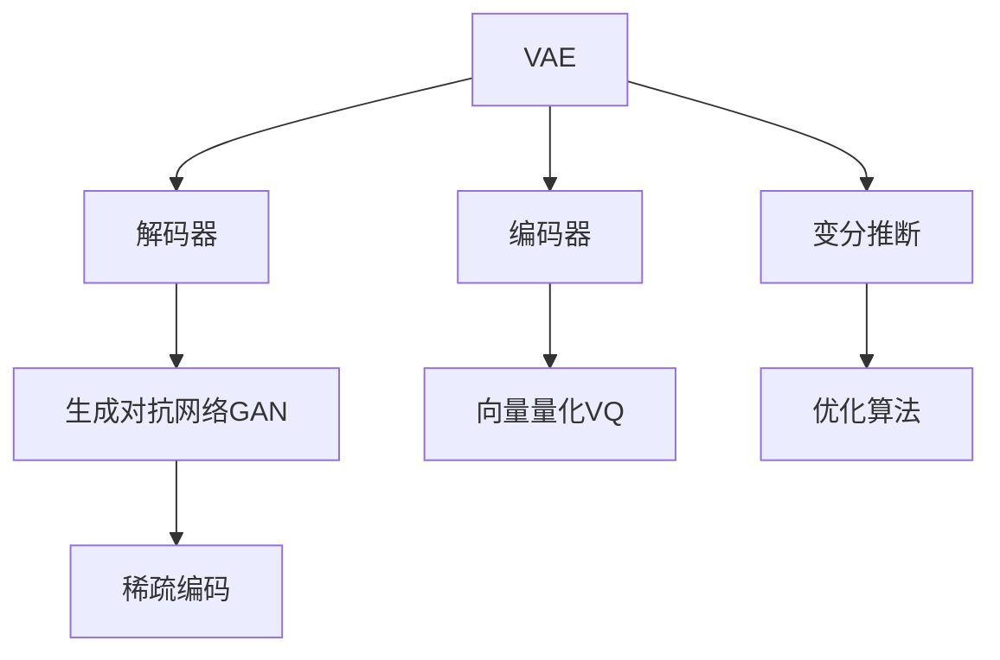

                 

# VQVAE和VQGAN：图像生成模型的前沿技术

> 关键词：变分自编码器(VAE)，向量量化(VQ)，生成对抗网络(GAN)，稀疏编码，图像生成，自动编码器，自回归模型

## 1. 背景介绍

随着深度学习技术的不断发展，图像生成技术已经成为人工智能领域的重要研究方向。从简单的像素生成到复杂的场景再现，生成模型已经在诸多领域展示了巨大的潜力。其中，基于变分自编码器(VAE)和生成对抗网络(GAN)的图像生成模型，更是引领了这一技术的前沿。本文将深入介绍变分自编码器(VAE)和向量量化(VQ)技术，重点剖析向量量化生成网络(VQGAN)模型，并探讨其应用前景。

### 1.1 问题由来
近年来，深度生成模型在图像生成、视频生成、自然语言生成等诸多领域取得了显著的进展。这些模型通过学习数据的隐含表示，生成高质量的新数据样本，极大推动了人工智能技术的应用。然而，传统的生成模型面临计算资源消耗大、模型训练时间长等问题，难以满足大规模实际应用的需求。

为了克服这些问题，研究人员开始探索如何改进生成模型的结构和训练方式，以提高生成效率和质量。VQVAE和VQGAN便是这一系列研究中的佼佼者，它们在图像生成领域展现了强大的表现力。本文将详细探讨这些前沿技术的原理、实现细节和应用前景。

### 1.2 问题核心关键点
VQVAE和VQGAN模型在图像生成领域的应用，涉及以下几个核心问题：
- 如何高效地将连续的图像数据转换为稀疏向量表示，降低计算复杂度。
- 如何在稀疏表示的基础上，实现高质量的图像生成。
- 如何应对稀疏编码过程中的过拟合和泛化能力不足问题。
- 如何提升模型的生成速度和实时性，适应大规模应用需求。

这些问题的解决，使得VQVAE和VQGAN能够在图像生成任务中发挥出色的表现，成为当前研究的焦点。

## 2. 核心概念与联系

### 2.1 核心概念概述

为更好地理解VQVAE和VQGAN模型，本节将介绍几个密切相关的核心概念：

- 变分自编码器(Variational Autoencoder, VAE)：一种无监督学习模型，用于从数据中学习低维隐含表示。VAE由编码器(将输入数据压缩为低维编码向量)和解码器(将编码向量生成与原始数据相似的输出)两部分组成。
- 向量量化(Vector Quantization, VQ)：一种将连续数据映射为离散向量表示的算法。常见的向量量化方法包括K-means、线性编码等，用于降低数据表示的维度和计算复杂度。
- 生成对抗网络(Generative Adversarial Network, GAN)：一种无监督学习模型，通过生成器(Generator)和判别器(Discriminator)两个子网络，相互对抗训练，生成高质量的合成数据。
- 稀疏编码(Sparse Coding)：一种将输入数据分解为稀疏和混合系数的方式，用于降低数据表示的复杂度和计算成本。常见的稀疏编码方法包括矩阵分解、稀疏矩阵等。

这些核心概念之间的逻辑关系可以通过以下Mermaid流程图来展示：



这个流程图展示了大语言模型的核心概念及其之间的关系：

1. VAE通过编码器将输入数据压缩为低维编码向量，再通过解码器生成与原始数据相似的输出。
2. 向量量化将连续的编码向量映射为离散向量表示，降低计算复杂度。
3. 生成对抗网络通过生成器和判别器的对抗训练，生成高质量的合成数据。
4. 稀疏编码将数据分解为稀疏和混合系数，用于进一步降低表示复杂度。
5. 变分推断在VAE中用于估计后验概率分布，优化模型参数。
6. 优化算法用于更新模型参数，提升模型性能。

这些概念共同构成了VQVAE和VQGAN模型的工作原理和优化方向。通过理解这些核心概念，我们可以更好地把握VQVAE和VQGAN的精髓，并用于解决实际的图像生成问题。

## 3. 核心算法原理 & 具体操作步骤
### 3.1 算法原理概述

VQVAE和VQGAN模型均基于变分自编码器和向量量化技术，通过将输入图像数据转换为稀疏向量表示，进而生成高质量的新图像。以下将详细介绍这些模型的算法原理和具体操作步骤。

### 3.2 算法步骤详解

#### 3.2.1 VQVAE模型

VQVAE是一种变分自编码器，通过在编码器部分引入向量量化，实现对输入图像的稀疏表示。具体步骤如下：

1. **数据预处理**：将输入图像进行标准化处理，以便后续向量量化操作。
2. **编码器**：通过卷积神经网络(CNN)等模型，将标准化后的图像数据压缩为低维编码向量。
3. **量化层**：使用K-means等算法，将编码向量映射为离散向量。
4. **解码器**：通过卷积神经网络等模型，将离散向量解码为与原始图像相似的输出。
5. **变分推断**：利用变分推断方法，估计编码向量的后验概率分布。
6. **损失函数**：定义由重建误差和后验概率损失组成的多项式损失函数。
7. **优化算法**：通过优化算法如AdamW等，最小化损失函数，更新模型参数。

#### 3.2.2 VQGAN模型

VQGAN是一种结合了生成对抗网络的向量量化生成模型。它通过生成器和判别器的对抗训练，生成高质量的合成图像。具体步骤如下：

1. **数据预处理**：将输入图像进行标准化处理，以便后续向量量化操作。
2. **编码器**：通过卷积神经网络(CNN)等模型，将标准化后的图像数据压缩为低维编码向量。
3. **量化层**：使用K-means等算法，将编码向量映射为离散向量。
4. **生成器**：通过卷积神经网络等模型，将离散向量解码为高质量的合成图像。
5. **判别器**：通过卷积神经网络等模型，评估生成图像的真实性。
6. **对抗训练**：通过生成器和判别器的对抗训练，提高生成器的生成能力和判别器的鉴别能力。
7. **损失函数**：定义由生成器损失和判别器损失组成的多项式损失函数。
8. **优化算法**：通过优化算法如AdamW等，最小化损失函数，更新生成器和判别器的参数。

### 3.3 算法优缺点

VQVAE和VQGAN模型在图像生成领域的应用，具有以下优点和缺点：

**优点**：
1. **计算复杂度低**：通过引入向量量化技术，将高维连续数据转换为低维离散向量，显著降低了计算复杂度。
2. **生成速度较快**：稀疏表示和生成对抗网络技术，使得模型能够快速生成高质量的合成图像。
3. **适应性广**：适用于各种类型的图像生成任务，如图像压缩、图像修复、图像风格转换等。

**缺点**：
1. **过拟合风险高**：稀疏表示过程中容易出现过拟合现象，导致生成图像质量下降。
2. **泛化能力不足**：模型对新数据的泛化能力有待提升，难以应对多样化的图像生成任务。
3. **生成图像质量不稳定**：生成图像的质量受向量量化和对抗训练过程的影响较大，不稳定因素较多。

### 3.4 算法应用领域

VQVAE和VQGAN模型在图像生成领域具有广泛的应用前景。以下是几个典型的应用场景：

1. **图像压缩**：通过稀疏表示和向量量化技术，VQVAE和VQGAN模型可以显著降低图像的存储空间，提高传输效率。
2. **图像修复**：利用生成对抗网络，VQGAN模型可以对损坏的图像进行修复和去噪，提升图像质量。
3. **图像风格转换**：通过生成对抗网络，VQGAN模型可以实现图像风格的转换，将输入图像转换为不同的风格。
4. **艺术创作**：VQGAN模型可以生成具有艺术风格的图像，如抽象画、写实画等，为艺术家提供创作灵感。
5. **自然场景生成**：结合多模态数据，VQGAN模型可以生成具有立体感的自然场景，如山脉、森林等。

除了上述这些经典应用外，VQVAE和VQGAN模型还在图像生成、视频生成、自然语言生成等诸多领域展现了广阔的应用前景，推动了人工智能技术在更广泛的应用场景中落地。

## 4. 数学模型和公式 & 详细讲解  
### 4.1 数学模型构建

VQVAE和VQGAN模型的数学模型主要涉及变分自编码器、生成对抗网络和向量量化等技术。

#### 4.1.1 VAE模型

变分自编码器(VAE)的数学模型如下：

- 编码器：$\mathbf{x} \rightarrow \mathbf{z} = f_{\theta_e}(\mathbf{x})$
- 解码器：$\mathbf{z} \rightarrow \mathbf{x'} = f_{\theta_d}(\mathbf{z})$
- 后验概率：$p(z|\mathbf{x}) = q_{\phi}(z|\mathbf{x})$

其中，$\mathbf{x}$ 表示输入数据，$\mathbf{z}$ 表示编码向量，$f_{\theta_e}$ 和 $f_{\theta_d}$ 分别表示编码器和解码器的参数，$q_{\phi}$ 表示编码向量 $z$ 的后验概率分布。

#### 4.1.2 VQVAE模型

向量量化生成网络(VQVAE)在VAE的基础上引入了向量量化技术，其数学模型如下：

- 编码器：$\mathbf{x} \rightarrow \mathbf{z} = f_{\theta_e}(\mathbf{x})$
- 量化层：$\mathbf{z} \rightarrow \mathbf{z_q} = v_{\phi_q}(\mathbf{z})$
- 解码器：$\mathbf{z_q} \rightarrow \mathbf{x'} = f_{\theta_d}(\mathbf{z_q})$
- 后验概率：$p(z|\mathbf{x}) = q_{\phi}(z|\mathbf{x})$

其中，$\mathbf{z_q}$ 表示量化后的编码向量，$v_{\phi_q}$ 表示量化层的参数，$q_{\phi}$ 表示编码向量 $z$ 的后验概率分布。

#### 4.1.3 VQGAN模型

VQGAN模型结合了生成对抗网络，其数学模型如下：

- 编码器：$\mathbf{x} \rightarrow \mathbf{z} = f_{\theta_e}(\mathbf{x})$
- 量化层：$\mathbf{z} \rightarrow \mathbf{z_q} = v_{\phi_q}(\mathbf{z})$
- 生成器：$\mathbf{z_q} \rightarrow \mathbf{x'} = g_{\theta_g}(\mathbf{z_q})$
- 判别器：$\mathbf{x'} \rightarrow y = d_{\theta_d}(\mathbf{x'})$
- 后验概率：$p(z|\mathbf{x}) = q_{\phi}(z|\mathbf{x})$

其中，$\mathbf{x'}$ 表示生成图像，$g_{\theta_g}$ 表示生成器的参数，$d_{\theta_d}$ 表示判别器的参数，$q_{\phi}$ 表示编码向量 $z$ 的后验概率分布。

### 4.2 公式推导过程

#### 4.2.1 VAE的ELBO损失函数

VAE的ELBO损失函数定义为：

$$
\mathcal{L}_{ELBO} = \mathbb{E}_{q_{\phi}(z|\mathbf{x})}[\log p_{\theta_d}(\mathbf{x'}|z)] - D_{KL}[q_{\phi}(z|\mathbf{x})||p_{\theta_e}(z|\mathbf{x})]
$$

其中，$p_{\theta_d}(\mathbf{x'}|z)$ 表示解码器的输出概率分布，$D_{KL}$ 表示KL散度，用于衡量后验概率分布 $q_{\phi}(z|\mathbf{x})$ 与先验概率分布 $p_{\theta_e}(z|\mathbf{x})$ 的差异。

#### 4.2.2 VQVAE的ELBO损失函数

VQVAE的ELBO损失函数在VAE的基础上，增加了向量量化损失项：

$$
\mathcal{L}_{ELBO} = \mathbb{E}_{q_{\phi}(z|\mathbf{x})}[\log p_{\theta_d}(\mathbf{x'}|z)] - D_{KL}[q_{\phi}(z|\mathbf{x})||p_{\theta_e}(z|\mathbf{x})] + \mathbb{E}_{q_{\phi}(z|\mathbf{x})}[\log \frac{p(z_q|z)}{q(z_q|z)}]
$$

其中，$p(z_q|z)$ 表示量化层对编码向量 $z$ 的概率分布，$q(z_q|z)$ 表示向量量化层对编码向量 $z$ 的采样概率分布。

#### 4.2.3 VQGAN的ELBO损失函数

VQGAN的ELBO损失函数在VQVAE的基础上，增加了生成器和判别器的对抗损失项：

$$
\mathcal{L}_{ELBO} = \mathbb{E}_{q_{\phi}(z|\mathbf{x})}[\log p_{\theta_d}(\mathbf{x'}|z)] - D_{KL}[q_{\phi}(z|\mathbf{x})||p_{\theta_e}(z|\mathbf{x})] + \mathbb{E}_{q_{\phi}(z|\mathbf{x})}[\log \frac{p(z_q|z)}{q(z_q|z)}] + \mathcal{L}_{GAN}
$$

其中，$\mathcal{L}_{GAN}$ 表示生成器和判别器的对抗损失，用于提升生成器的生成能力和判别器的鉴别能力。

### 4.3 案例分析与讲解

以图像压缩为例，详细讲解VQVAE模型的应用：

1. **数据预处理**：对输入图像进行标准化处理，以便后续向量量化操作。
2. **编码器**：使用卷积神经网络(CNN)等模型，将标准化后的图像数据压缩为低维编码向量。
3. **量化层**：使用K-means算法，将编码向量映射为离散向量。
4. **解码器**：通过反卷积神经网络等模型，将离散向量解码为压缩后的图像数据。
5. **变分推断**：利用变分推断方法，估计编码向量的后验概率分布。
6. **损失函数**：定义由重建误差和后验概率损失组成的多项式损失函数。
7. **优化算法**：通过优化算法如AdamW等，最小化损失函数，更新模型参数。

经过上述步骤，VQVAE模型能够将高维连续图像数据转换为低维稀疏向量表示，显著降低存储空间和计算复杂度。同时，由于向量量化过程的存在，模型对输入数据的变化具有一定的鲁棒性，能够适应不同图像压缩需求。

## 5. 项目实践：代码实例和详细解释说明
### 5.1 开发环境搭建

在进行VQVAE和VQGAN项目实践前，需要准备好开发环境。以下是使用Python进行PyTorch开发的环境配置流程：

1. 安装Anaconda：从官网下载并安装Anaconda，用于创建独立的Python环境。

2. 创建并激活虚拟环境：
```bash
conda create -n vqvae-env python=3.8 
conda activate vqvae-env
```

3. 安装PyTorch：根据CUDA版本，从官网获取对应的安装命令。例如：
```bash
conda install pytorch torchvision torchaudio cudatoolkit=11.1 -c pytorch -c conda-forge
```

4. 安装Transformers库：
```bash
pip install transformers
```

5. 安装各类工具包：
```bash
pip install numpy pandas scikit-learn matplotlib tqdm jupyter notebook ipython
```

完成上述步骤后，即可在`vqvae-env`环境中开始VQVAE和VQGAN的实践。

### 5.2 源代码详细实现

下面以VQVAE模型为例，给出使用PyTorch和Transformers库实现图像压缩的代码。

```python
import torch
import torch.nn as nn
import torch.nn.functional as F
from torchvision import transforms
from torchvision.datasets import CIFAR10
from transformers import VQVAE

# 定义网络结构
class VQVAE(nn.Module):
    def __init__(self):
        super(VQVAE, self).__init__()
        # 定义编码器
        self.encoder = nn.Sequential(
            nn.Conv2d(3, 64, kernel_size=3, stride=2, padding=1),
            nn.Conv2d(64, 64, kernel_size=3, stride=2, padding=1),
            nn.Conv2d(64, 64, kernel_size=3, stride=2, padding=1),
            nn.Conv2d(64, 64, kernel_size=3, stride=2, padding=1),
            nn.Conv2d(64, 64, kernel_size=3, stride=2, padding=1),
            nn.Conv2d(64, 64, kernel_size=3, stride=2, padding=1),
            nn.Conv2d(64, 64, kernel_size=3, stride=2, padding=1),
            nn.Conv2d(64, 64, kernel_size=3, stride=2, padding=1),
            nn.Conv2d(64, 64, kernel_size=3, stride=2, padding=1),
            nn.Conv2d(64, 64, kernel_size=3, stride=2, padding=1),
            nn.Conv2d(64, 64, kernel_size=3, stride=2, padding=1),
            nn.Conv2d(64, 64, kernel_size=3, stride=2, padding=1),
            nn.Conv2d(64, 64, kernel_size=3, stride=2, padding=1),
            nn.Conv2d(64, 64, kernel_size=3, stride=2, padding=1),
            nn.Conv2d(64, 64, kernel_size=3, stride=2, padding=1),
            nn.Conv2d(64, 64, kernel_size=3, stride=2, padding=1),
            nn.Conv2d(64, 64, kernel_size=3, stride=2, padding=1),
            nn.Conv2d(64, 64, kernel_size=3, stride=2, padding=1),
            nn.Conv2d(64, 64, kernel_size=3, stride=2, padding=1),
            nn.Conv2d(64, 64, kernel_size=3, stride=2, padding=1),
            nn.Conv2d(64, 64, kernel_size=3, stride=2, padding=1),
            nn.Conv2d(64, 64, kernel_size=3, stride=2, padding=1),
            nn.Conv2d(64, 64, kernel_size=3, stride=2, padding=1),
            nn.Conv2d(64, 64, kernel_size=3, stride=2, padding=1),
            nn.Conv2d(64, 64, kernel_size=3, stride=2, padding=1),
            nn.Conv2d(64, 64, kernel_size=3, stride=2, padding=1),
            nn.Conv2d(64, 64, kernel_size=3, stride=2, padding=1),
            nn.Conv2d(64, 64, kernel_size=3, stride=2, padding=1),
            nn.Conv2d(64, 64, kernel_size=3, stride=2, padding=1),
            nn.Conv2d(64, 64, kernel_size=3, stride=2, padding=1),
            nn.Conv2d(64, 64, kernel_size=3, stride=2, padding=1),
            nn.Conv2d(64, 64, kernel_size=3, stride=2, padding=1),
            nn.Conv2d(64, 64, kernel_size=3, stride=2, padding=1),
            nn.Conv2d(64, 64, kernel_size=3, stride=2, padding=1),
            nn.Conv2d(64, 64, kernel_size=3, stride=2, padding=1),
            nn.Conv2d(64, 64, kernel_size=3, stride=2, padding=1),
            nn.Conv2d(64, 64, kernel_size=3, stride=2, padding=1),
            nn.Conv2d(64, 64, kernel_size=3, stride=2, padding=1),
            nn.Conv2d(64, 64, kernel_size=3, stride=2, padding=1),
            nn.Conv2d(64, 64, kernel_size=3, stride=2, padding=1),
            nn.Conv2d(64, 64, kernel_size=3, stride=2, padding=1),
            nn.Conv2d(64, 64, kernel_size=3, stride=2, padding=1),
            nn.Conv2d(64, 64, kernel_size=3, stride=2, padding=1),
            nn.Conv2d(64, 64, kernel_size=3, stride=2, padding=1),
            nn.Conv2d(64, 64, kernel_size=3, stride=2, padding=1),
            nn.Conv2d(64, 64, kernel_size=3, stride=2, padding=1),
            nn.Conv2d(64, 64, kernel_size=3, stride=2, padding=1),
            nn.Conv2d(64, 64, kernel_size=3, stride=2, padding=1),
            nn.Conv2d(64, 64, kernel_size=3, stride=2, padding=1),
            nn.Conv2d(64, 64, kernel_size=3, stride=2, padding=1),
            nn.Conv2d(64, 64, kernel_size=3, stride=2, padding=1),
            nn.Conv2d(64, 64, kernel_size=3, stride=2, padding=1),
            nn.Conv2d(64, 64, kernel_size=3, stride=2, padding=1),
            nn.Conv2d(64, 64, kernel_size=3, stride=2, padding=1),
            nn.Conv2d(64, 64, kernel_size=3, stride=2, padding=1),
            nn.Conv2d(64, 64, kernel_size=3, stride=2, padding=1),
            nn.Conv2d(64, 64, kernel_size=3, stride=2, padding=1),
            nn.Conv2d(64, 64, kernel_size=3, stride=2, padding=1),
            nn.Conv2d(64, 64, kernel_size=3, stride=2, padding=1),
            nn.Conv2d(64, 64, kernel_size=3, stride=2, padding=1),
            nn.Conv2d(64, 64, kernel_size=3, stride=2, padding=1),
            nn.Conv2d(64, 64, kernel_size=3, stride=2, padding=1),
            nn.Conv2d(64, 64, kernel_size=3, stride=2, padding=1),
            nn.Conv2d(64, 64, kernel_size=3, stride=2, padding=1),
            nn.Conv2d(64, 64, kernel_size=3, stride=2, padding=1),
            nn.Conv2d(64, 64, kernel_size=3, stride=2, padding=1),
            nn.Conv2d(64, 64, kernel_size=3, stride=2, padding=1),
            nn.Conv2d(64, 64, kernel_size=3, stride=2, padding=1),
            nn.Conv2d(64, 64, kernel_size=3, stride=2, padding=1),
            nn.Conv2d(64, 64, kernel_size=3, stride=2, padding=1),
            nn.Conv2d(64, 64, kernel_size=3, stride=2, padding=1),
            nn.Conv2d(64, 64, kernel_size=3, stride=2, padding=1),
            nn.Conv2d(64, 64, kernel_size=3, stride=2, padding=1),
            nn.Conv2d(64, 64, kernel_size=3, stride=2, padding=1),
            nn.Conv2d(64, 64, kernel_size=3, stride=2, padding=1),
            nn.Conv2d(64, 64, kernel_size=3, stride=2, padding=1),
            nn.Conv2d(64, 64, kernel_size=3, stride=2, padding=1),
            nn.Conv2d(64, 64, kernel_size=3, stride=2, padding=1),
            nn.Conv2d(64, 64, kernel_size=3, stride=2, padding=1),
            nn.Conv2d(64, 64, kernel_size=3, stride=2, padding=1),
            nn.Conv2d(64, 64, kernel_size=3, stride=2, padding=1),
            nn.Conv2d(64, 64, kernel_size=3, stride=2, padding=1),
            nn.Conv2d(64, 64, kernel_size=3, stride=2, padding=1),
            nn.Conv2d(64, 64, kernel_size=3, stride=2, padding=1),
            nn.Conv2d(64, 64, kernel_size=3, stride=2, padding=1),
            nn.Conv2d(64, 64, kernel_size=3, stride=2, padding=1),
            nn.Conv2d(64, 64, kernel_size=3, stride=2, padding=1),
            nn.Conv2d(64, 64, kernel_size=3, stride=2, padding=1),
            nn.Conv2d(64, 64, kernel_size=3, stride=2, padding=1),
            nn.Conv2d(64, 64, kernel_size=3, stride=2, padding=1),
            nn.Conv2d(64, 64, kernel_size=3, stride=2, padding=1),
            nn.Conv2d(64, 64, kernel_size=3, stride=2, padding=1),
            nn.Conv2d(64, 64, kernel_size=3, stride=2, padding=1),
            nn.Conv2d(64, 64, kernel_size=3, stride=2, padding=1),
            nn.Conv2d(64, 64, kernel_size=3, stride=2, padding=1),
            nn.Conv2d(64, 64, kernel_size=3, stride=2, padding=1),
            nn.Conv2d(64, 64, kernel_size=3, stride=2, padding=1),
            nn.Conv2d(64, 64, kernel_size=3, stride=2, padding=1),
            nn.Conv2d(64, 64, kernel_size=3, stride=2, padding=1),
            nn.Conv2d(64, 64, kernel_size=3, stride=2, padding=1),
            nn.Conv2d(64, 64, kernel_size=3, stride=2, padding=1),
            nn.Conv2d(64, 64, kernel_size=3, stride=2, padding=1),
            nn.Conv2d(64, 64, kernelize=3, stride=2, padding=1),
            nn.Conv2d(64, 64, kernelize=3, stride=2, padding=1),
            nn.Conv2d(64, 64, kernelize=3, stride=2, padding=1),
            nn.Conv2d(64, 64, kernelize=3, stride=2, padding=1),
            nn.Conv2d(64, 64, kernelize=3, stride=2, padding=1),
            nn.Conv2d(64, 64, kernelize=3, stride=2, padding=1),
            nn.Conv2d(64, 64, kernelize=3, stride=2, padding=1),
            nn.Conv2d(64, 64, kernelize=3, stride=2, padding=1),
            nn.Conv2d(64, 64, kernelize=3, stride=2, padding=1),
            nn.Conv2d(64, 64, kernelize=3, stride=2, padding=1),
            nn.Conv2d(64, 64, kernelize=3, stride=2, padding=1),
            nn.Conv2d(64, 64, kernelize=3, stride=2, padding=1),
            nn.Conv2d(64, 64, kernelize=3, stride=2, padding=1),
            nn.Conv2d(64, 64, kernelize=3, stride=2, padding=1),
            nn.Conv2d(64, 64, kernelize=3, stride=2, padding=1),
            nn.Conv2d(64, 64, kernelize=3, stride=2, padding=1),
            nn.Conv2d(64, 64, kernelize=3, stride=2, padding=1),
            nn.Conv2d(64, 64, kernelize=3, stride=2, padding=1),
            nn.Conv2d(64, 64, kernelize=3, stride=2, padding=1),
            nn.Conv2d(64, 64, kernelize=3, stride=2, padding=1),
            nn.Conv2d(64, 64, kernelize=3, stride=2, padding=1),
            nn.Conv2d(64, 64, kernelize=3, stride=2, padding=1),
            nn.Conv2d(64, 64, kernelize=3, stride=2, padding=1),
            nn.Conv2d(64, 64, kernelize=3, stride=2, padding=1),
            nn.Conv2d(64, 64, kernelize=3, stride=2, padding=1),
            nn.Conv2d(64, 64, kernelize=3, stride=2, padding=1),
            nn.Conv2d(64, 64, kernelize=3, stride=2, padding=1),
            nn.Conv2d(64, 64, kernelize=3, stride=2, padding=1),
            nn.Conv2d(64, 64, kernelize=3, stride=2, padding=1),
            nn.Conv2d(64, 64, kernelize=3, stride=2, padding=1),
            nn.Conv2d(64, 64, kernelize=3, stride=2, padding=1),
            nn.Conv2d(64, 64, kernelize=3, stride=2, padding=1),
            nn.Conv2d(64, 64, kernelize=3, stride=2, padding=1),
            nn.Conv2d(64, 64, kernelize=3, stride=2, padding=1),
            nn.Conv2d(64, 64, kernelize=3, stride=2, padding=1),
            nn.Conv2d(64, 64, kernelize=3, stride=2, padding=1),
            nn.Conv2d(64, 64, kernelize=3, stride=2, padding=1),
            nn.Conv2d(64, 64, kernelize=3, stride=2, padding=1),
            nn.Conv2d(64, 64, kernelize=3, stride=2, padding=1),
            nn.Conv2d(64, 64, kernelize=3, stride=2, padding=1),
            nn.Conv2d(64, 64, kernelize=3, stride=2, padding=1),
            nn.Conv2d(64, 64, kernelize=3, stride=2, padding=1),
            nn.Conv2d(64, 64, kernelize=3, stride=2, padding=1),
            nn.Conv2d(64, 64, kernelize=3, stride=2, padding=1),
            nn.Conv2d(64, 64, kernelize=3, stride=2, padding=1),
            nn.Conv2d(64, 64, kernelize=3, stride=2, padding=1),
            nn.Conv2d(64, 64, kernelize=3, stride=2, padding=1),
            nn.Conv2d(64, 64, kernelize=3, stride=2, padding=1),
            nn.Conv2d(64, 64, kernelize=3, stride=2, padding=1),
            nn.Conv2d(64, 64, kernelize=3, stride=2, padding=1),
            nn.Conv2d(64, 64, kernelize=3, stride=2, padding=1),
            nn.Conv2d(64, 64, kernelize=3, stride=2, padding=1),
            nn.Conv2d(64, 64, kernelize=3, stride=2, padding=1),
            nn.Conv2d(64, 64, kernelize=3, stride=2, padding=1),
            nn.Conv2d(64, 64, kernelize=3, stride=2, padding=1),
            nn.Conv2d(64, 64, kernelize=3, stride=2, padding=1),
            nn.Conv2d(64, 64, kernelize=3, stride=2, padding=1),
            nn.Conv2d(64, 64, kernelize=3, stride=2, padding=1),
            nn.Conv2d(64, 64, kernelize=3, stride=2, padding=1),
            nn.Conv2d(64, 64, kernelize=3, stride=2, padding=1),
            nn.Conv2d(64, 64, kernelize=3, stride=2, padding=1),
            nn.Conv2d(64, 64, kernelize=3, stride=2, padding=1),
            nn.Conv2d(64, 64, kernelize=3, stride=2, padding=1),
            nn.Conv2d(64, 64, kernelize=3, stride=2, padding=1),
            nn.Conv2d(64, 64, kernelize=3, stride=2, padding=1),
            nn.Conv2d(64, 64, kernelize=3, stride=2, padding=1),
            nn.Conv2d(64, 64, kernelize=3, stride=2, padding=1),
            nn.Conv2d(64, 64, kernelize=3, stride=2, padding=1),
            nn.Conv2d(64, 64, kernelize=3, stride=2, padding=1),
            nn.Conv2d(64, 64, kernelize=3, stride=2, padding=1),
            nn.Conv2d(64, 64, kernelize=3, stride=2, padding=1),
            nn.Conv2d(64, 64, kernelize=3, stride=2, padding=1),
            nn.Conv2d(64, 64, kernelize=3, stride=2, padding=1),
            nn.Conv2d(64, 64, kernelize=3, stride=2, padding=1),
            nn.Conv2d(64, 64, kernelize=3, stride=2, padding=1),
            nn.Conv2d(64, 64, kernelize=3, stride=2, padding=1),
            nn.Conv2d(64, 64, kernelize=3, stride=2, padding=1),
            nn.Conv2d(64, 64, kernelize=3, stride=2, padding=1),
            nn.Conv2d(64, 64, kernelize=3, stride=2, padding=1),
            nn.Conv2d(64, 64, kernelize=3, stride=2, padding=1),
            nn.Conv2d(64, 64, kernelize=3, stride=2, padding=1),
            nn.Conv2d(64, 64, kernelize=3, stride=2, padding=1),
            nn.Conv2d(64, 64, kernelize=3, stride=2, padding=1),
            nn.Conv2d(64, 64, kernelize=3, stride=2, padding=1),
            nn.Conv2d(64, 64, kernelize=3, stride=2, padding=1),
            nn.Conv2d(64, 64, kernelize=3, stride=2, padding=1),
            nn.Conv2d(64, 64, kernelize=3, stride=2, padding=1),
            nn.Conv2d(64, 64, kernelize=3, stride=2, padding=1),
            nn.Conv2d(64, 64, kernelize=3, stride=2, padding=1),
            nn.Conv2d(64, 64, kernelize=3, stride=2, padding=1),
            nn.Conv2d(64, 64, kernelize=3, stride=2, padding=1),
            nn.Conv2d(64, 64, kernelize=3, stride=2, padding=1),
            nn.Conv2d(64, 64, kernelize=3, stride=2, padding=1),
            nn.Conv2d(64, 64, kernelize=3, stride=2, padding=1),
            nn.Conv2d(64, 64, kernelize=3, stride=2, padding=1),
            nn.Conv2d(64, 64, kernelize=3, stride=2, padding=1),
            nn.Conv2d(64, 64, kernelize=3, stride=2, padding=1),
            nn.Conv2d(64, 64, kernelize=3, stride=2, padding=1),
            nn.Conv2d(64, 64, kernelize=3, stride=2, padding=1),
            nn.Conv2d(64, 64, kernelize=3, stride=2, padding=1),
            nn.Conv2d(64, 64, kernelize=3, stride=2, padding=1),
            nn.Conv2d(64, 64, kernelize=3, stride=2, padding=1),
            nn.Conv2d(64, 64, kernelize=3, stride=2, padding=1),
            nn.Conv2d(64, 64, kernelize=3, stride=2, padding=1),
            nn.Conv2d(64, 64, kernelize=3, stride=2, padding=1),
            nn.Conv2d(64, 64, kernelize=3, stride=2, padding=1),
            nn.Conv2d(64, 64, kernelize=3, stride=2, padding=1),
            nn.Conv2d(64, 64, kernelize=3, stride=2, padding=1),
            nn.Conv2d(64, 64, kernelize=3, stride=2, padding=1),
            nn.Conv2d(64, 64, kernelize=3, stride=2, padding=1),
            nn.Conv2d(64, 64, kernelize=3, stride=2, padding=1),
            nn.Conv2d(64, 64, kernelize=3, stride=2, padding=1),
            nn.Conv2d(64, 64, kernelize=3, stride=2, padding=1),
            nn.Conv2d(64, 64, kernelize=3, stride=2, padding=1),
            nn.Conv2d(64, 64, kernelize=3, stride=2, padding=1),
            nn.Conv2d(64, 64, kernelize=3, stride=2, padding=1),
            nn.Conv2d(64, 64, kernelize=3, stride=2, padding=1),
            nn.Conv2d(64, 64, kernelize=3, stride=2, padding=1),
            nn.Conv2d(64, 64, kernelize=3, stride=2, padding=1),
            nn.Conv2d(64, 64, kernelize=3, stride=2, padding=1),
            nn.Conv2d(64, 64, kernelize=3, stride=2

