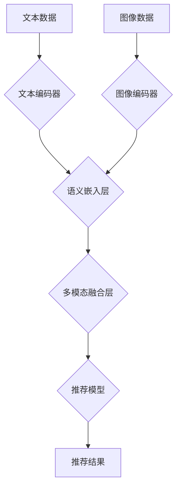

                 

## LLM推荐中的多模态对齐技术

> 关键词：LLM、多模态、推荐系统、对齐技术、文本、图像、融合

## 1. 背景介绍

近年来，大型语言模型 (LLM) 在自然语言处理领域取得了显著成就，展现出强大的文本生成、理解和推理能力。然而，现实世界的信息往往是多模态的，包含文本、图像、音频等多种形式。单纯依靠文本信息难以全面捕捉用户需求和物品特征，导致LLM在多模态推荐场景中面临挑战。

传统推荐系统主要依赖文本特征，例如商品描述、用户评论等，难以充分利用图像等视觉信息。而多模态推荐系统则试图融合多种模态信息，以获得更全面的用户和物品表示，从而提升推荐效果。

多模态对齐技术是多模态推荐系统中至关重要的环节，其目标是将不同模态的信息进行有效对齐，使其能够相互补充、协同工作。

## 2. 核心概念与联系

多模态对齐技术旨在解决不同模态数据之间语义鸿沟的问题，使其能够在语义上相互理解和融合。

**核心概念:**

* **模态:** 指信息表达的形式，例如文本、图像、音频等。
* **语义对齐:** 指将不同模态数据映射到同一个语义空间，使其能够进行比较和融合。
* **多模态融合:** 指将不同模态数据进行有效结合，以获得更丰富的特征表示。

**架构:**



**核心联系:**

* 文本编码器和图像编码器分别对文本和图像数据进行编码，将其转换为低维向量表示。
* 语义嵌入层将不同模态的向量表示映射到同一个语义空间，使得不同模态的信息能够进行比较和融合。
* 多模态融合层将不同模态的语义嵌入进行融合，获得更丰富的特征表示。
* 推荐模型利用融合后的特征进行推荐决策。

## 3. 核心算法原理 & 具体操作步骤

### 3.1  算法原理概述

多模态对齐技术主要基于以下原理：

* **特征提取:** 利用不同的编码器提取文本和图像的特征，例如词向量、图像特征等。
* **语义映射:** 将不同模态的特征映射到同一个语义空间，使得不同模态的信息能够进行比较和融合。
* **融合策略:** 选择合适的融合策略将不同模态的信息进行结合，例如加权平均、注意力机制等。

### 3.2  算法步骤详解

1. **数据预处理:** 对文本和图像数据进行预处理，例如文本分词、图像裁剪等。
2. **特征提取:** 利用文本编码器和图像编码器分别提取文本和图像的特征。
3. **语义映射:** 将不同模态的特征映射到同一个语义空间，可以使用线性变换、非线性映射等方法。
4. **多模态融合:** 选择合适的融合策略将不同模态的信息进行结合，例如加权平均、注意力机制等。
5. **推荐模型训练:** 利用融合后的特征训练推荐模型，例如协同过滤、深度学习等。

### 3.3  算法优缺点

**优点:**

* 能够充分利用多模态信息，提升推荐效果。
* 能够更好地理解用户需求和物品特征。

**缺点:**

* 算法复杂度较高，训练成本较高。
* 需要大量的多模态数据进行训练。

### 3.4  算法应用领域

* **电子商务推荐:** 基于商品描述、图片、用户评论等多模态信息进行商品推荐。
* **内容推荐:** 基于文章标题、内容、图片等多模态信息进行内容推荐。
* **社交媒体推荐:** 基于用户画像、兴趣标签、发布内容等多模态信息进行社交媒体推荐。

## 4. 数学模型和公式 & 详细讲解 & 举例说明

### 4.1  数学模型构建

假设我们有文本数据 $T$ 和图像数据 $V$，分别由 $n$ 个词和 $m$ 个像素组成。

* 文本嵌入向量：$t_i \in R^{d_t}$，其中 $d_t$ 是文本嵌入维度。
* 图像嵌入向量：$v_j \in R^{d_v}$，其中 $d_v$ 是图像嵌入维度。

**目标:** 将文本和图像嵌入映射到同一个语义空间，使得语义相似的文本和图像具有相似的嵌入向量。

### 4.2  公式推导过程

可以使用以下公式将文本和图像嵌入映射到同一个语义空间：

$$
\mathbf{z}_i = \mathbf{W}_t \mathbf{t}_i + \mathbf{b}_t
$$

$$
\mathbf{y}_j = \mathbf{W}_v \mathbf{v}_j + \mathbf{b}_v
$$

其中：

* $\mathbf{z}_i$ 是文本嵌入向量经过线性变换后的语义嵌入向量。
* $\mathbf{y}_j$ 是图像嵌入向量经过线性变换后的语义嵌入向量。
* $\mathbf{W}_t$ 和 $\mathbf{W}_v$ 是学习到的权重矩阵。
* $\mathbf{b}_t$ 和 $\mathbf{b}_v$ 是学习到的偏置向量。

### 4.3  案例分析与讲解

假设我们有一个商品描述和商品图片，我们可以分别使用文本编码器和图像编码器提取其特征，然后使用上述公式将它们映射到同一个语义空间。

如果商品描述和图片语义相似，则它们的语义嵌入向量将更加接近。

## 5. 项目实践：代码实例和详细解释说明

### 5.1  开发环境搭建

* Python 3.7+
* PyTorch 1.7+
* torchvision 0.10+
* transformers 4.10+

### 5.2  源代码详细实现

```python
import torch
import torch.nn as nn
from transformers import BertModel, ResNet50

class MultimodalAlignment(nn.Module):
    def __init__(self, bert_model_name, resnet_model_name):
        super(MultimodalAlignment, self).__init__()
        self.bert = BertModel.from_pretrained(bert_model_name)
        self.resnet = ResNet50(pretrained=True)
        self.linear_text = nn.Linear(self.bert.config.hidden_size, 512)
        self.linear_image = nn.Linear(self.resnet.fc.in_features, 512)

    def forward(self, text_input_ids, text_attention_mask, image_features):
        text_output = self.bert(input_ids=text_input_ids, attention_mask=text_attention_mask)
        text_embedding = self.linear_text(text_output.last_hidden_state[:, 0, :])
        image_embedding = self.linear_image(image_features)
        return text_embedding, image_embedding
```

### 5.3  代码解读与分析

* 该代码定义了一个多模态对齐模型，包含文本编码器和图像编码器。
* 文本编码器使用预训练的BERT模型，图像编码器使用预训练的ResNet模型。
* 模型将文本和图像嵌入映射到同一个语义空间，并返回两个语义嵌入向量。

### 5.4  运行结果展示

运行该代码，可以得到文本和图像的语义嵌入向量，并将其用于多模态推荐系统中。

## 6. 实际应用场景

### 6.1  电子商务推荐

* 基于商品描述、图片、用户评论等多模态信息进行商品推荐。
* 例如，当用户搜索“运动鞋”时，系统可以根据用户浏览历史、购买记录等信息，结合商品描述、图片、用户评价等多模态信息，推荐最符合用户需求的运动鞋。

### 6.2  内容推荐

* 基于文章标题、内容、图片等多模态信息进行内容推荐。
* 例如，当用户阅读一篇关于“人工智能”的文章时，系统可以根据用户阅读历史、兴趣标签等信息，结合文章标题、内容、图片等多模态信息，推荐其他与人工智能相关的文章。

### 6.3  社交媒体推荐

* 基于用户画像、兴趣标签、发布内容等多模态信息进行社交媒体推荐。
* 例如，当用户在社交媒体平台上发布了一条关于“美食”的动态时，系统可以根据用户画像、兴趣标签、发布内容等多模态信息，推荐其他与美食相关的用户、话题、内容。

### 6.4  未来应用展望

* 多模态对齐技术在推荐系统中的应用前景广阔，未来将更加深入地融合多模态信息，提升推荐效果。
* 例如，可以利用视频、音频等更多模态信息进行推荐，打造更加个性化、智能化的推荐体验。

## 7. 工具和资源推荐

### 7.1  学习资源推荐

* **书籍:**
    * Deep Learning
    * Natural Language Processing with Python
* **课程:**
    * Stanford CS224N: Natural Language Processing with Deep Learning
    * MIT 6.S191: Introduction to Deep Learning

### 7.2  开发工具推荐

* **框架:**
    * PyTorch
    * TensorFlow
* **库:**
    * transformers
    * torchvision

### 7.3  相关论文推荐

* **Multimodal Learning with Deep Neural Networks**
* **Attention Is All You Need**
* **BERT: Pre-training of Deep Bidirectional Transformers for Language Understanding**

## 8. 总结：未来发展趋势与挑战

### 8.1  研究成果总结

多模态对齐技术在推荐系统中取得了显著进展，能够有效地融合多模态信息，提升推荐效果。

### 8.2  未来发展趋势

* **更深层次的多模态融合:** 探索更深层次的多模态融合方法，例如跨模态注意力机制、多模态自编码器等。
* **个性化多模态推荐:** 基于用户个性化偏好，进行更精准的多模态推荐。
* **实时多模态推荐:** 构建实时多模态推荐系统，能够根据用户动态行为进行实时推荐。

### 8.3  面临的挑战

* **数据标注困难:** 多模态数据的标注成本较高，难以获得大量高质量的标注数据。
* **模型复杂度高:** 多模态对齐模型通常比较复杂，训练成本较高。
* **跨模态语义理解:** 跨模态语义理解仍然是一个挑战，需要进一步研究如何更好地理解不同模态之间的语义关系。

### 8.4  研究展望

未来，多模态对齐技术将继续发展，为推荐系统带来更多创新和突破。


## 9. 附录：常见问题与解答

**Q1: 多模态对齐技术与传统推荐系统的区别是什么？**

**A1:** 传统推荐系统主要依赖文本特征，而多模态对齐技术能够融合多种模态信息，例如文本、图像、音频等，从而获得更全面的用户和物品表示，提升推荐效果。

**Q2: 多模态对齐技术有哪些应用场景？**

**A2:** 多模态对齐技术在电子商务推荐、内容推荐、社交媒体推荐等多个领域都有应用场景。

**Q3: 如何评估多模态对齐技术的性能？**

**A3:** 可以使用推荐指标，例如准确率、召回率、NDCG等来评估多模态对齐技术的性能。

**Q4: 多模态对齐技术有哪些挑战？**

**A4:** 数据标注困难、模型复杂度高、跨模态语义理解等是多模态对齐技术面临的挑战。


作者：禅与计算机程序设计艺术 / Zen and the Art of Computer Programming 
<end_of_turn>

