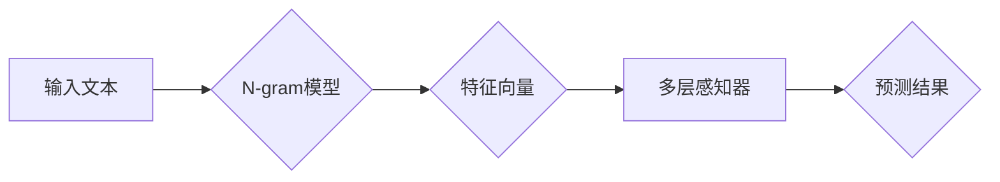

                 

## N-gram模型：多层感知器与矩阵乘法

> 关键词：N-gram模型, 多层感知器, 矩阵乘法, 自然语言处理, 机器学习, 文本预测, 词汇统计

## 1. 背景介绍

自然语言处理 (NLP) 领域一直致力于让计算机理解和处理人类语言。文本预测是 NLP 中一项重要的任务，它涉及预测下一个词、句子或段落。N-gram 模型作为一种经典的统计语言模型，在文本预测领域发挥着重要作用。

N-gram 模型基于统计语言学原理，它假设一个词的出现概率取决于其前 N-1 个词的上下文。例如，一个三元组 (bigram) 模型会考虑两个前一个词来预测下一个词，而四元组 (trigram) 模型则会考虑三个前一个词。N-gram 模型的优势在于其简单易懂、易于实现，并且能够捕捉到一定的上下文信息。

然而，传统的 N-gram 模型存在一些局限性：

* **稀疏性问题:** 当 N 值较大时，模型需要处理大量的词组合，许多组合出现的频率很低，导致模型训练数据稀疏，性能下降。
* **上下文信息有限:** N-gram 模型只能考虑有限长度的上下文，对于长距离依赖关系的捕捉能力有限。

为了克服这些局限性，近年来，深度学习技术被广泛应用于文本预测任务。多层感知器 (MLP) 作为一种强大的深度学习模型，能够学习更复杂的文本表示，并更好地捕捉上下文信息。

## 2. 核心概念与联系

N-gram 模型和多层感知器 (MLP) 都是文本预测任务中的重要模型。

**N-gram 模型**

* 基于统计语言学原理，假设一个词的出现概率取决于其前 N-1 个词的上下文。
* 优点：简单易懂、易于实现。
* 缺点：稀疏性问题、上下文信息有限。

**多层感知器 (MLP)**

* 是一种深度学习模型，由多个全连接层组成。
* 优点：能够学习更复杂的文本表示，更好地捕捉上下文信息。
* 缺点：训练数据量大、计算复杂度高。

**核心概念联系**

N-gram 模型和 MLP 可以结合使用，发挥各自的优势。

* N-gram 模型可以作为 MLP 的输入特征，提供文本的局部上下文信息。
* MLP 可以学习 N-gram 模型无法捕捉到的长距离依赖关系。

**Mermaid 流程图**



## 3. 核心算法原理 & 具体操作步骤

### 3.1  算法原理概述

N-gram 模型的核心原理是基于词的频率统计。它通过计算不同词组合出现的频率，来预测下一个词的出现概率。

多层感知器 (MLP) 是一种前馈神经网络，它通过多个全连接层来学习数据的特征表示。

结合 N-gram 模型和 MLP，可以构建一个更强大的文本预测模型。

### 3.2  算法步骤详解

1. **预处理文本数据:** 将文本数据进行清洗、分词、标记等预处理操作，以便于模型训练。
2. **构建 N-gram 模型:** 计算不同词组合出现的频率，并构建 N-gram 模型。
3. **提取 N-gram 特征:** 将输入文本序列转换为 N-gram 特征向量，作为 MLP 的输入。
4. **训练多层感知器:** 使用训练数据训练 MLP 模型，学习文本特征和预测关系。
5. **预测下一个词:** 将新的输入文本序列转换为 N-gram 特征向量，输入到训练好的 MLP 模型中，得到下一个词的预测概率分布。

### 3.3  算法优缺点

**优点:**

* 能够捕捉到一定的上下文信息。
* MLP 模型能够学习更复杂的文本表示，提高预测精度。

**缺点:**

* 训练数据量大，需要大量的计算资源。
* 对于长距离依赖关系的捕捉能力有限。

### 3.4  算法应用领域

* 文本生成
* 机器翻译
* 语音识别
* 自动摘要
* 情感分析

## 4. 数学模型和公式 & 详细讲解 & 举例说明

### 4.1  数学模型构建

N-gram 模型的数学模型可以表示为：

$$P(w_t | w_{t-1}, w_{t-2}, ..., w_{t-n})$$

其中：

* $w_t$ 是当前要预测的词。
* $w_{t-1}, w_{t-2}, ..., w_{t-n}$ 是前 n 个词的上下文。

多层感知器的数学模型可以表示为：

$$y = f(W^L \cdot a^L + b^L)$$

其中：

* $y$ 是预测结果。
* $a^L$ 是上一层神经元的输出。
* $W^L$ 是当前层的权重矩阵。
* $b^L$ 是当前层的偏置向量。
* $f$ 是激活函数。

### 4.2  公式推导过程

N-gram 模型的概率计算基于词的频率统计。假设训练数据中词组合 $(w_{t-n}, w_{t-n+1}, ..., w_{t-1}, w_t)$ 出现的次数为 $C(w_{t-n}, w_{t-n+1}, ..., w_{t-1}, w_t)$，则该词组合的概率为：

$$P(w_t | w_{t-1}, w_{t-2}, ..., w_{t-n}) = \frac{C(w_{t-n}, w_{t-n+1}, ..., w_{t-1}, w_t)}{C(w_{t-n}, w_{t-n+1}, ..., w_{t-1})}$$

其中，$C(w_{t-n}, w_{t-n+1}, ..., w_{t-1})$ 是前 n 个词的词组合出现的次数。

### 4.3  案例分析与讲解

例如，假设训练数据中词组合 "the cat sat" 出现的次数为 100，则该词组合的概率为：

$$P(\text{sat} | \text{the}, \text{cat}) = \frac{100}{C(\text{the}, \text{cat})}$$

其中，$C(\text{the}, \text{cat})$ 是词组合 "the cat" 出现的次数。

## 5. 项目实践：代码实例和详细解释说明

### 5.1  开发环境搭建

* Python 3.x
* TensorFlow 或 PyTorch

### 5.2  源代码详细实现

```python
import tensorflow as tf

# 定义 N-gram 模型
def n_gram_model(input_sequence, n):
  # 将输入序列转换为 N-gram 特征向量
  # ...
  # 返回 N-gram 特征向量
  return n_gram_features

# 定义多层感知器模型
def mlp_model(input_features):
  # 创建多层感知器模型
  model = tf.keras.Sequential([
    tf.keras.layers.Dense(128, activation='relu'),
    tf.keras.layers.Dense(64, activation='relu'),
    tf.keras.layers.Dense(vocab_size, activation='softmax')
  ])
  # 返回多层感知器模型
  return model

# 训练模型
model = mlp_model(n_gram_model)
model.compile(optimizer='adam', loss='sparse_categorical_crossentropy', metrics=['accuracy'])
model.fit(train_data, train_labels, epochs=10)

# 预测下一个词
predicted_word = model.predict(test_data)
```

### 5.3  代码解读与分析

* `n_gram_model` 函数负责将输入文本序列转换为 N-gram 特征向量。
* `mlp_model` 函数定义了多层感知器模型的结构。
* `model.compile` 函数配置模型的训练参数。
* `model.fit` 函数训练模型。
* `model.predict` 函数预测下一个词。

### 5.4  运行结果展示

运行结果展示包括模型的训练精度、测试精度以及预测结果等。

## 6. 实际应用场景

N-gram 模型和 MLP 结合的文本预测模型在许多实际应用场景中发挥着重要作用：

* **机器翻译:** 预测目标语言中的下一个词，实现文本翻译。
* **语音识别:** 预测语音信号对应的文本序列。
* **自动摘要:** 预测文本中最重要的句子，生成文本摘要。
* **情感分析:** 预测文本的情感倾向。

### 6.4  未来应用展望

随着深度学习技术的不断发展，N-gram 模型和 MLP 结合的文本预测模型将会有更广泛的应用场景，例如：

* **个性化推荐:** 预测用户的兴趣爱好，提供个性化推荐。
* **对话系统:** 构建更智能的对话系统，能够更好地理解和响应用户的需求。
* **代码生成:** 预测代码中的下一个字符或语句，辅助程序员编写代码。

## 7. 工具和资源推荐

### 7.1  学习资源推荐

* **书籍:**
    * Speech and Language Processing by Jurafsky and Martin
    * Deep Learning by Goodfellow, Bengio, and Courville
* **在线课程:**
    * Stanford CS224N: Natural Language Processing with Deep Learning
    * Coursera: Deep Learning Specialization

### 7.2  开发工具推荐

* **TensorFlow:** https://www.tensorflow.org/
* **PyTorch:** https://pytorch.org/

### 7.3  相关论文推荐

* **A Neural Probabilistic Language Model** by Bengio et al. (2003)
* **Sequence to Sequence Learning with Neural Networks** by Sutskever et al. (2014)

## 8. 总结：未来发展趋势与挑战

### 8.1  研究成果总结

N-gram 模型和 MLP 结合的文本预测模型取得了显著的成果，在许多实际应用场景中发挥着重要作用。

### 8.2  未来发展趋势

* **更强大的模型架构:** 研究更深、更复杂的模型架构，例如 Transformer 模型，以更好地捕捉长距离依赖关系。
* **更丰富的特征表示:** 结合其他文本特征，例如词向量、语法结构等，构建更丰富的文本表示。
* **跨语言文本预测:** 研究跨语言文本预测模型，实现不同语言之间的文本生成和翻译。

### 8.3  面临的挑战

* **数据稀疏性:** 许多低频词组合的出现概率很低，导致模型训练数据稀疏。
* **计算复杂度:** 深度学习模型的训练需要大量的计算资源。
* **可解释性:** 深度学习模型的决策过程难以解释，这限制了模型在一些安全敏感领域的应用。

### 8.4  研究展望

未来，N-gram 模型和 MLP 结合的文本预测模型将继续朝着更强大、更智能的方向发展，为人类社会带来更多便利和价值。

## 9. 附录：常见问题与解答

* **Q: N-gram 模型的 n 值应该选择多少？**

A: n 值的选择取决于实际应用场景和训练数据的规模。一般来说，n 值越大，模型能够捕捉到的上下文信息越多，但同时也更容易出现过拟合问题。

* **Q: 如何处理 N-gram 模型中的数据稀疏性问题？**

A: 可以使用一些技术来处理数据稀疏性问题，例如：

    * **平滑技术:** 对概率进行平滑处理，避免出现概率为 0 的情况。
    * **子词模型:** 将词分解成更小的子词，提高词组合出现的频率。
    * **预训练模型:** 使用预训练的语言模型，例如 BERT 或 GPT，作为 N-gram 模型的输入特征。


作者：禅与计算机程序设计艺术 / Zen and the Art of Computer Programming 
<end_of_turn>

