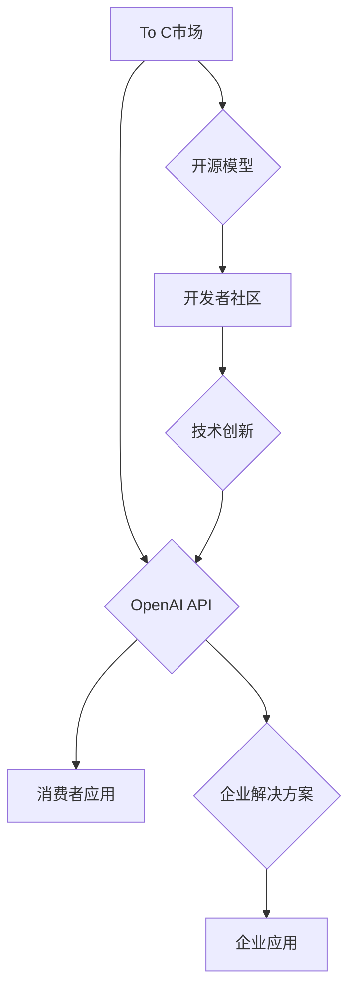

                 

## OpenAI的成功之道：贾扬清的分析，在To C和To B市场的平衡

> 关键词：OpenAI, 贾扬清,  人工智能,  To C, To B,  市场平衡,  技术创新,  商业模式

### 1. 背景介绍

OpenAI，一个由马斯克、萨莫赫等科技巨头联合创立的非营利人工智能研究公司，近年来在人工智能领域取得了令人瞩目的成就。从GPT-3的横空出世到DALL-E 2的惊艳表现，OpenAI不断突破技术边界，引领人工智能发展潮流。 

然而，OpenAI的成功并非偶然。其创始人之一，贾扬清，是一位深谙人工智能发展规律的科技 visionary。他敏锐地洞察到人工智能技术发展趋势，并构建了OpenAI独特的商业模式，在To C（面向消费者）和To B（面向企业）市场之间找到了平衡点。

本文将从贾扬清的分析角度出发，探讨OpenAI的成功之道，分析其在To C和To B市场之间的平衡策略，并展望其未来发展趋势。

### 2. 核心概念与联系

OpenAI的核心概念是将人工智能技术应用于解决人类面临的重大挑战，并使其造福于全人类。其商业模式则围绕着开放性、合作性和可持续发展三个核心原则构建。

**2.1  开放性**

OpenAI致力于将人工智能技术开源，让更多开发者和研究者参与到人工智能的开发和应用中。通过开放共享技术和数据，OpenAI希望加速人工智能的发展进程，并推动其在各个领域的广泛应用。

**2.2  合作性**

OpenAI积极与学术界、工业界和政府机构合作，共同推动人工智能技术的发展和应用。通过建立合作伙伴关系，OpenAI能够汇聚各方资源，共同解决人工智能面临的挑战，并加速其落地应用。

**2.3  可持续发展**

OpenAI致力于构建一个可持续发展的商业模式，确保其能够长期投入到人工智能研究和开发中。其商业模式包括开源软件、API服务、以及与企业合作开发定制解决方案等多种形式。

**Mermaid 流程图**



### 3. 核心算法原理 & 具体操作步骤

OpenAI的核心算法原理主要基于深度学习技术，特别是Transformer模型架构。

**3.1  算法原理概述**

Transformer模型是一种基于注意力机制的深度神经网络架构，能够有效处理序列数据，例如文本和语音。其核心特点是能够捕捉序列中不同元素之间的长距离依赖关系，从而实现更精准的理解和生成。

**3.2  算法步骤详解**

1. **输入层:** 将输入序列（例如文本句子）转换为向量表示。
2. **编码器:** 利用多层Transformer模块对输入序列进行编码，提取其语义特征。
3. **解码器:** 利用多层Transformer模块对编码后的语义特征进行解码，生成输出序列（例如文本摘要或翻译结果）。
4. **输出层:** 将解码后的输出序列转换为可理解的形式，例如文本或语音。

**3.3  算法优缺点**

**优点:**

* 能够有效处理长距离依赖关系，提升文本理解和生成能力。
* 训练效率高，能够在大型数据集上进行高效训练。
* 具有良好的泛化能力，能够应用于多种自然语言处理任务。

**缺点:**

* 计算复杂度高，需要强大的计算资源进行训练。
* 参数量大，容易过拟合。
* 对训练数据质量要求高，需要大量高质量的训练数据。

**3.4  算法应用领域**

Transformer模型在自然语言处理领域有着广泛的应用，例如：

* 机器翻译
* 文本摘要
* 问答系统
* 语音识别
* 代码生成

### 4. 数学模型和公式 & 详细讲解 & 举例说明

Transformer模型的核心数学模型是注意力机制。注意力机制能够学习到输入序列中不同元素之间的重要程度，并根据其重要程度分配不同的权重。

**4.1  数学模型构建**

注意力机制的数学模型可以表示为：

$$
Attention(Q, K, V) = softmax(\frac{QK^T}{\sqrt{d_k}})V
$$

其中：

* $Q$：查询矩阵
* $K$：键矩阵
* $V$：值矩阵
* $d_k$：键向量的维度
* $softmax$：softmax函数

**4.2  公式推导过程**

注意力机制的公式推导过程可以分为以下几个步骤：

1. 计算查询矩阵 $Q$ 和键矩阵 $K$ 的点积，并进行归一化处理。
2. 应用softmax函数对归一化后的点积进行归一化，得到注意力权重。
3. 将注意力权重与值矩阵 $V$ 进行加权求和，得到最终的注意力输出。

**4.3  案例分析与讲解**

例如，在机器翻译任务中，查询矩阵 $Q$ 表示目标语言的词向量，键矩阵 $K$ 表示源语言的词向量，值矩阵 $V$ 表示源语言词向量的嵌入表示。

通过注意力机制，模型能够学习到源语言中哪些词与目标语言的词语相关，并根据其相关性分配不同的权重。

### 5. 项目实践：代码实例和详细解释说明

OpenAI提供了多种API和开源工具，开发者可以利用这些工具进行项目实践。

**5.1  开发环境搭建**

OpenAI API可以使用Python语言进行调用。需要安装Python和相应的库，例如requests和openai。

**5.2  源代码详细实现**

```python
import openai

openai.api_key = "YOUR_API_KEY"

response = openai.Completion.create(
  engine="text-davinci-003",
  prompt="写一首关于人工智能的诗歌",
  max_tokens=100
)

print(response.choices[0].text)
```

**5.3  代码解读与分析**

这段代码使用OpenAI的API调用text-davinci-003引擎，生成一首关于人工智能的诗歌。

* `openai.api_key = "YOUR_API_KEY"`：设置OpenAI API的密钥。
* `openai.Completion.create()`：调用OpenAI的Completion API，生成文本。
* `engine="text-davinci-003"`：指定使用的模型引擎。
* `prompt="写一首关于人工智能的诗歌"`：设置输入提示。
* `max_tokens=100`：限制生成的文本长度。

**5.4  运行结果展示**

运行这段代码后，会输出一首关于人工智能的诗歌。

### 6. 实际应用场景

OpenAI的AI技术在各个领域都有着广泛的应用场景。

**6.1  教育领域**

* 智能辅导系统：提供个性化的学习辅导，帮助学生提高学习效率。
* 自动批改系统：自动批改作业，解放教师的时间，提高教学质量。

**6.2  医疗领域**

* 疾病诊断辅助系统：帮助医生更快、更准确地诊断疾病。
* 药物研发加速器：加速药物研发进程，开发新的治疗方法。

**6.3  金融领域**

* 风险评估系统：评估投资风险，帮助投资者做出更明智的决策。
* 金融欺诈检测系统：识别和预防金融欺诈行为。

**6.4  未来应用展望**

随着人工智能技术的不断发展，OpenAI的AI技术将在更多领域得到应用，例如：

* 自动驾驶
* 人机交互
* 个性化推荐

### 7. 工具和资源推荐

**7.1  学习资源推荐**

* OpenAI官方文档：https://platform.openai.com/docs/
* 深度学习课程：https://www.deeplearning.ai/

**7.2  开发工具推荐**

* Python：https://www.python.org/
* TensorFlow：https://www.tensorflow.org/
* PyTorch：https://pytorch.org/

**7.3  相关论文推荐**

* Attention Is All You Need：https://arxiv.org/abs/1706.03762

### 8. 总结：未来发展趋势与挑战

OpenAI在人工智能领域取得了令人瞩目的成就，其独特的商业模式和技术创新为人工智能的发展注入了新的活力。

**8.1  研究成果总结**

OpenAI的研究成果在自然语言处理、计算机视觉、机器人等多个领域取得了突破性进展，其开发的GPT-3、DALL-E 2等模型展现了人工智能技术的强大潜力。

**8.2  未来发展趋势**

未来，OpenAI将继续致力于将人工智能技术应用于解决人类面临的重大挑战，例如气候变化、医疗保健和教育。

**8.3  面临的挑战**

OpenAI也面临着一些挑战，例如：

* 算法的安全性与可解释性
* 数据隐私与安全
* 人工智能的伦理问题

**8.4  研究展望**

OpenAI将继续加强与学术界、工业界和政府机构的合作，共同推动人工智能技术的发展和应用，并致力于构建一个安全、可持续和惠及全人类的未来。

### 9. 附录：常见问题与解答

**9.1  OpenAI的API如何使用？**

OpenAI提供了详细的API文档，开发者可以参考文档进行使用。

**9.2  OpenAI的开源模型有哪些？**

OpenAI开源了一些模型，例如GPT-2和CLIP。

**9.3  OpenAI的商业模式是什么？**

OpenAI的商业模式包括开源软件、API服务、以及与企业合作开发定制解决方案等多种形式。


作者：禅与计算机程序设计艺术 / Zen and the Art of Computer Programming 
<end_of_turn>

