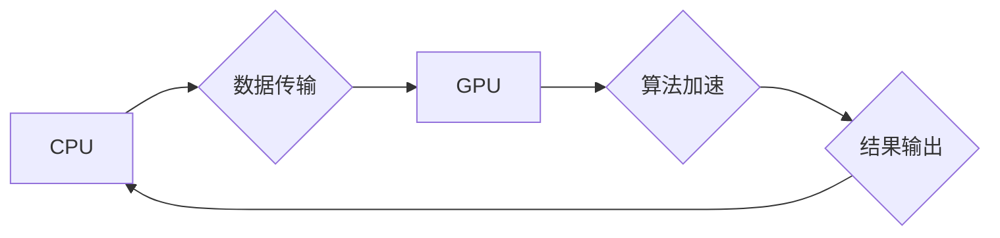

                 

## OpenCV图像处理算法加速

> 关键词：OpenCV, 图像处理, 算法加速, GPU加速, CUDA, 深度学习, 性能优化

## 1. 背景介绍

OpenCV（Open Source Computer Vision Library）是一个开源的计算机视觉库，提供了广泛的图像处理和计算机视觉算法。它在机器人、自动驾驶、医疗影像分析、人脸识别等领域得到了广泛应用。然而，随着图像分辨率的不断提高和算法复杂度的增加，传统的CPU处理方式已经难以满足实时性和性能需求。因此，图像处理算法加速成为一个重要的研究方向。

## 2. 核心概念与联系

图像处理算法加速的核心概念是利用硬件加速技术提高算法的执行速度。常见的硬件加速技术包括GPU（图形处理单元）加速和FPGA（现场可编程门阵列）加速。

**2.1 GPU加速**

GPU拥有大量的并行处理单元，能够高效地处理大量数据并行计算，特别适合图像处理算法，因为图像处理算法通常具有高度的并行性。

**2.2 CUDA**

CUDA（Compute Unified Device Architecture）是NVIDIA公司开发的一种并行计算平台和编程模型，可以利用GPU的并行计算能力加速应用程序的执行。

**2.3 架构图**



## 3. 核心算法原理 & 具体操作步骤

### 3.1 算法原理概述

OpenCV提供了多种图像处理算法，例如图像滤波、边缘检测、特征提取等。这些算法通常可以被分解成多个小的并行计算任务，适合GPU加速。

### 3.2 算法步骤详解

1. 将图像数据从CPU传输到GPU。
2. 将OpenCV算法代码移植到CUDA平台，并利用CUDA内核进行并行计算。
3. 将计算结果从GPU传输回CPU。

### 3.3 算法优缺点

**优点:**

* 显著提高图像处理速度。
* 能够处理高分辨率图像。
* 适用于实时图像处理应用。

**缺点:**

* 需要学习CUDA编程模型。
* GPU内存有限，可能需要数据分块处理。
* 开发和调试成本相对较高。

### 3.4 算法应用领域

* **机器人视觉:** 导航、目标识别、环境感知等。
* **自动驾驶:** 车道线检测、障碍物识别、车牌识别等。
* **医疗影像分析:** 病灶检测、图像分割、三维重建等。
* **人脸识别:** 人脸检测、人脸识别、人脸跟踪等。

## 4. 数学模型和公式 & 详细讲解 & 举例说明

### 4.1 数学模型构建

图像处理算法通常基于数学模型，例如卷积操作、傅里叶变换等。这些模型可以用来描述图像的特征和变化。

### 4.2 公式推导过程

例如，卷积操作的数学模型如下：

$$
y(x,y) = \sum_{i=-m}^{m} \sum_{j=-n}^{n} f(i,j) \cdot h(x+i,y+j)
$$

其中：

* $y(x,y)$ 是卷积后的图像像素值。
* $f(x,y)$ 是输入图像的像素值。
* $h(x,y)$ 是卷积核的像素值。
* $m$ 和 $n$ 是卷积核的大小。

### 4.3 案例分析与讲解

例如，使用高斯滤波器对图像进行平滑处理。高斯滤波器是一种常用的卷积核，可以用来减少图像噪声。

$$
h(x,y) = \frac{1}{2\pi \sigma^2} e^{-\frac{x^2 + y^2}{2\sigma^2}}
$$

其中：

* $\sigma$ 是高斯滤波器的标准差。

通过将高斯滤波器与图像进行卷积操作，可以得到平滑后的图像。

## 5. 项目实践：代码实例和详细解释说明

### 5.1 开发环境搭建

* 安装CUDA Toolkit。
* 安装OpenCV库。
* 安装C++编译器。

### 5.2 源代码详细实现

```cpp
#include <opencv2/opencv.hpp>
#include <cuda_runtime.h>

// CUDA内核函数
__global__ void gaussianBlurKernel(const float* input, float* output, int width, int height, float sigma) {
    int x = blockIdx.x * blockDim.x + threadIdx.x;
    int y = blockIdx.y * blockDim.y + threadIdx.y;

    if (x < width && y < height) {
        // 计算高斯滤波器
        float sum = 0.0f;
        for (int i = -1; i <= 1; i++) {
            for (int j = -1; j <= 1; j++) {
                int neighborX = x + i;
                int neighborY = y + j;
                if (neighborX >= 0 && neighborX < width && neighborY >= 0 && neighborY < height) {
                    sum += input[neighborY * width + neighborX] * exp(-(i*i + j*j) / (2 * sigma * sigma));
                }
            }
        }
        output[y * width + x] = sum;
    }
}

int main() {
    // 读取图像
    cv::Mat image = cv::imread("input.jpg");

    // 创建CUDA设备
    cudaDeviceProp prop;
    cudaGetDeviceProperties(&prop, 0);

    // 将图像数据从CPU传输到GPU
    float* d_input;
    cudaMalloc(&d_input, image.rows * image.cols * sizeof(float));
    cudaMemcpy(d_input, image.data, image.rows * image.cols * sizeof(float), cudaMemcpyHostToDevice);

    // 设置高斯滤波器参数
    float sigma = 1.0f;

    // 计算图像平滑
    int width = image.cols;
    int height = image.rows;
    int threadsPerBlock = 256;
    int blocksPerGridX = (width + threadsPerBlock - 1) / threadsPerBlock;
    int blocksPerGridY = (height + threadsPerBlock - 1) / threadsPerBlock;
    float* d_output;
    cudaMalloc(&d_output, image.rows * image.cols * sizeof(float));
    gaussianBlurKernel<<<blocksPerGridX, blocksPerGridY>>>(d_input, d_output, width, height, sigma);

    // 将结果从GPU传输回CPU
    cv::Mat output(height, width, CV_32FC1);
    cudaMemcpy(output.data, d_output, output.rows * output.cols * sizeof(float), cudaMemcpyDeviceToHost);

    // 显示结果
    cv::imshow("Output", output);
    cv::waitKey(0);

    // 释放CUDA内存
    cudaFree(d_input);
    cudaFree(d_output);

    return 0;
}
```

### 5.3 代码解读与分析

* 代码首先使用CUDA API初始化CUDA设备和分配GPU内存。
* 然后，将图像数据从CPU传输到GPU。
* 接着，定义一个CUDA内核函数`gaussianBlurKernel`，该函数实现高斯滤波操作。
* 使用`<<<blocksPerGridX, blocksPerGridY>>>`语法将内核函数调度到GPU上执行。
* 最后，将结果从GPU传输回CPU，并显示结果图像。

### 5.4 运行结果展示

运行代码后，可以得到平滑后的图像，图像噪声明显减少。

## 6. 实际应用场景

### 6.1 图像降噪

在图像采集过程中，噪声是不可避免的。使用GPU加速的图像滤波算法可以有效地减少图像噪声，提高图像质量。

### 6.2 图像边缘检测

边缘检测是图像处理中一个重要的步骤，可以用来提取图像的轮廓和特征。GPU加速的边缘检测算法可以提高检测速度，并处理高分辨率图像。

### 6.3 图像特征提取

图像特征提取是计算机视觉中一个关键步骤，可以用来识别和分类图像。GPU加速的特征提取算法可以提高提取速度，并处理大量图像数据。

### 6.4 未来应用展望

随着GPU计算能力的不断提升，图像处理算法加速将会有更广泛的应用，例如：

* **实时视频处理:** 能够实现实时图像识别、跟踪和分析。
* **三维重建:** 能够快速重建三维物体模型。
* **医学影像分析:** 能够提高医学影像诊断的准确性和效率。

## 7. 工具和资源推荐

### 7.1 学习资源推荐

* **OpenCV官方文档:** https://docs.opencv.org/
* **CUDA官方文档:** https://docs.nvidia.com/cuda/
* **Coursera深度学习课程:** https://www.coursera.org/learn/deep-learning

### 7.2 开发工具推荐

* **Visual Studio:** https://visualstudio.microsoft.com/
* **CLion:** https://www.jetbrains.com/clion/

### 7.3 相关论文推荐

* **CUDA Programming Guide:** https://docs.nvidia.com/cuda/cuda-c-programming-guide/index.html
* **OpenCV Image Processing Techniques:** https://docs.opencv.org/4.x/d6/d00/tutorial_py_table_of_contents_image_processing.html

## 8. 总结：未来发展趋势与挑战

### 8.1 研究成果总结

图像处理算法加速技术取得了显著进展，GPU加速技术已经成为图像处理领域的主流技术。

### 8.2 未来发展趋势

* **深度学习加速:** 将深度学习算法与GPU加速技术结合，实现更强大的图像处理能力。
* **混合加速:** 利用CPU、GPU和FPGA等多种硬件资源进行协同加速，提高算法效率。
* **边缘计算:** 将图像处理算法部署到边缘设备上，实现实时和离线处理。

### 8.3 面临的挑战

* **算法移植和优化:** 将传统算法移植到GPU平台并进行优化是一个复杂的任务。
* **数据传输效率:** 数据传输是GPU加速中的瓶颈，需要提高数据传输效率。
* **开发成本:** GPU加速开发成本相对较高，需要专业的技术人员和工具支持。

### 8.4 研究展望

未来，图像处理算法加速技术将继续发展，并应用于更多领域。

## 9. 附录：常见问题与解答

* **Q: 如何选择合适的GPU加速框架？**

* **A:** 选择GPU加速框架需要考虑算法特性、硬件平台和开发成本等因素。常见的GPU加速框架包括CUDA、OpenCL和HIP。

* **Q: 如何优化GPU加速算法？**

* **A:** 优化GPU加速算法需要考虑数据传输、线程调度、内存管理等方面。可以使用GPU性能分析工具来帮助优化算法。


作者：禅与计算机程序设计艺术 / Zen and the Art of Computer Programming<end_of_turn>

