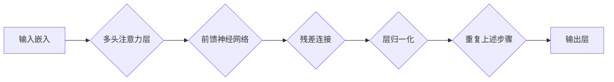

                 

## 1. 背景介绍

自然语言处理 (NLP) 领域近年来取得了飞速发展，深度学习模型在文本理解、生成和翻译等任务上取得了显著成果。其中，Transformer架构作为一种突破性的创新，彻底改变了NLP领域的格局。

传统的循环神经网络 (RNN) 模型在处理长文本序列时存在梯度消失和梯度爆炸的问题，难以捕捉长距离依赖关系。Transformer架构通过引入注意力机制和多头注意力机制，有效解决了这些问题，能够更准确地理解文本的语义关系。

## 2. 核心概念与联系

Transformer架构的核心概念包括：

* **注意力机制 (Attention Mechanism):**  注意力机制允许模型关注输入序列中与当前任务最相关的部分，从而更好地理解上下文信息。
* **多头注意力机制 (Multi-Head Attention):** 多头注意力机制通过并行执行多个注意力头，学习到不同层次的语义信息，提升了模型的表达能力。
* **残差连接 (Residual Connection):** 残差连接允许模型学习到更深层的特征表示，缓解了梯度消失问题。
* **层归一化 (Layer Normalization):** 层归一化可以加速模型训练，提高模型的稳定性。

**Transformer 架构流程图:**



## 3. 核心算法原理 & 具体操作步骤

### 3.1  算法原理概述

Transformer架构的核心算法是多头注意力机制和残差连接。

* **多头注意力机制:**  将输入序列映射到多个不同的子空间，每个子空间学习到不同的语义信息。然后将这些子空间的信息融合起来，得到最终的注意力输出。
* **残差连接:**  将输入数据与经过多头注意力机制和前馈神经网络处理后的数据相加，使得模型能够学习到更深层的特征表示。

### 3.2  算法步骤详解

1. **输入嵌入:** 将输入文本序列转换为向量表示。
2. **多头注意力层:** 对输入向量序列进行多头注意力计算，得到每个位置的上下文信息。
3. **前馈神经网络:** 对每个位置的上下文信息进行非线性变换，得到更深层的特征表示。
4. **残差连接:** 将输入向量与经过多头注意力层和前馈神经网络处理后的数据相加。
5. **层归一化:** 对残差连接后的数据进行归一化处理，加速模型训练。
6. **重复步骤 2-5:** 对输入序列进行多层Transformer编码，得到最终的文本表示。

### 3.3  算法优缺点

**优点:**

* 能够有效捕捉长距离依赖关系。
* 并行计算能力强，训练速度快。
* 表现能力强，在各种NLP任务上取得了优异的成绩。

**缺点:**

* 参数量大，计算资源需求高。
* 对训练数据要求较高。

### 3.4  算法应用领域

Transformer架构在NLP领域广泛应用，例如：

* 机器翻译
* 文本摘要
* 问答系统
* 情感分析
* 代码生成

## 4. 数学模型和公式 & 详细讲解 & 举例说明

### 4.1  数学模型构建

Transformer架构的数学模型主要包括以下几个部分：

* **嵌入层:** 将输入文本序列转换为向量表示。
* **多头注意力层:** 计算每个位置的上下文信息。
* **前馈神经网络:** 对每个位置的上下文信息进行非线性变换。
* **层归一化层:** 对数据进行归一化处理。

### 4.2  公式推导过程

**多头注意力机制:**

* **查询 (Q)、键 (K)、值 (V) 矩阵:** 将输入序列映射到三个不同的子空间。
* **注意力权重 (Attention Weights):** 计算每个位置的上下文信息权重。
* **注意力输出 (Attention Output):** 将值矩阵与注意力权重相乘，得到每个位置的上下文信息。

**公式:**

$$
\text{Attention}(Q, K, V) = \text{softmax}\left(\frac{Q K^T}{\sqrt{d_k}}\right) V
$$

其中，$Q$、$K$、$V$ 分别是查询、键、值矩阵，$d_k$ 是键向量的维度。

**残差连接:**

* 将输入数据与经过多头注意力机制和前馈神经网络处理后的数据相加。

**公式:**

$$
\text{Residual Connection}(x, y) = x + y
$$

其中，$x$ 是输入数据，$y$ 是经过多头注意力机制和前馈神经网络处理后的数据。

### 4.3  案例分析与讲解

**举例说明:**

假设我们有一个输入序列 "The cat sat on the mat"，将其转换为向量表示。然后，使用多头注意力机制计算每个词的上下文信息权重。例如，"sat" 的注意力权重会比较高，因为它是与 "cat" 和 "mat" 相关的关键词。

## 5. 项目实践：代码实例和详细解释说明

### 5.1  开发环境搭建

* Python 3.6+
* PyTorch 1.0+
* CUDA 10.0+

### 5.2  源代码详细实现

```python
import torch
import torch.nn as nn

class MultiHeadAttention(nn.Module):
    def __init__(self, embed_dim, num_heads):
        super(MultiHeadAttention, self).__init__()
        self.embed_dim = embed_dim
        self.num_heads = num_heads
        self.head_dim = embed_dim // num_heads

        self.query = nn.Linear(embed_dim, embed_dim)
        self.key = nn.Linear(embed_dim, embed_dim)
        self.value = nn.Linear(embed_dim, embed_dim)
        self.fc_out = nn.Linear(embed_dim, embed_dim)

    def forward(self, query, key, value, mask=None):
        batch_size = query.size(0)

        # Linear projections
        Q = self.query(query).view(batch_size, -1, self.num_heads, self.head_dim).transpose(1, 2)
        K = self.key(key).view(batch_size, -1, self.num_heads, self.head_dim).transpose(1, 2)
        V = self.value(value).view(batch_size, -1, self.num_heads, self.head_dim).transpose(1, 2)

        # Scaled dot-product attention
        scores = torch.matmul(Q, K.transpose(-2, -1)) / torch.sqrt(torch.tensor(self.head_dim, dtype=torch.float))
        if mask is not None:
            scores = scores.masked_fill(mask == 0, -1e9)
        attention = torch.softmax(scores, dim=-1)

        # Weighted sum of values
        context = torch.matmul(attention, V)

        # Concatenate heads and project
        context = context.transpose(1, 2).contiguous().view(batch_size, -1, self.embed_dim)
        output = self.fc_out(context)

        return output
```

### 5.3  代码解读与分析

* **MultiHeadAttention 类:** 实现多头注意力机制。
* **__init__ 方法:** 初始化模型参数，包括嵌入维度、头数、每个头的维度等。
* **forward 方法:** 实现多头注意力机制的计算过程，包括线性投影、缩放点积注意力、加权求和等步骤。

### 5.4  运行结果展示

运行上述代码，可以得到多头注意力机制的输出结果。

## 6. 实际应用场景

Transformer架构在NLP领域广泛应用，例如：

* **机器翻译:**  例如 Google Translate 使用 Transformer 架构实现机器翻译，取得了显著的性能提升。
* **文本摘要:**  例如 BART 模型使用 Transformer 架构实现文本摘要，能够生成高质量的摘要。
* **问答系统:**  例如 BERT 模型使用 Transformer 架构实现问答系统，能够准确地回答问题。
* **情感分析:**  例如 RoBERTa 模型使用 Transformer 架构实现情感分析，能够准确地识别文本的情感倾向。
* **代码生成:**  例如 Codex 模型使用 Transformer 架构实现代码生成，能够生成高质量的代码。

### 6.4  未来应用展望

Transformer架构在未来将继续推动NLP领域的进步，例如：

* **更长文本序列的处理:**  研究更有效的注意力机制和编码器解码器结构，能够处理更长的文本序列。
* **多模态理解:**  将 Transformer 架构与其他模态数据（例如图像、音频）结合，实现多模态理解。
* **可解释性增强:**  研究更可解释的 Transformer 模型，帮助人们更好地理解模型的决策过程。

## 7. 工具和资源推荐

### 7.1  学习资源推荐

* **论文:** "Attention Is All You Need"
* **博客:** Jay Alammar's Blog
* **课程:** Stanford CS224N

### 7.2  开发工具推荐

* **PyTorch:**  深度学习框架
* **Hugging Face Transformers:**  预训练 Transformer 模型库

### 7.3  相关论文推荐

* "BERT: Pre-training of Deep Bidirectional Transformers for Language Understanding"
* "GPT-2: Transformer Language Modeling for Open-Domain Text Generation"
* "T5: Text-to-Text Transfer Transformer"

## 8. 总结：未来发展趋势与挑战

### 8.1  研究成果总结

Transformer架构在NLP领域取得了显著成果，例如：

* **性能提升:**  在各种NLP任务上取得了显著的性能提升。
* **应用广泛:**  在机器翻译、文本摘要、问答系统等多个领域得到广泛应用。
* **模型规模增长:**  Transformer模型规模不断增长，例如 GPT-3 模型拥有 1750 亿参数。

### 8.2  未来发展趋势

* **更长文本序列的处理:**  研究更有效的注意力机制和编码器解码器结构，能够处理更长的文本序列。
* **多模态理解:**  将 Transformer 架构与其他模态数据（例如图像、音频）结合，实现多模态理解。
* **可解释性增强:**  研究更可解释的 Transformer 模型，帮助人们更好地理解模型的决策过程。

### 8.3  面临的挑战

* **计算资源需求高:**  大型 Transformer 模型训练需要大量的计算资源。
* **数据依赖性强:**  Transformer 模型的性能依赖于训练数据的质量和数量。
* **可解释性问题:**  Transformer 模型的决策过程难以解释，这限制了其在一些应用场景中的使用。

### 8.4  研究展望

未来研究将继续探索 Transformer 架构的潜力，例如：

* **高效训练方法:**  研究更有效的训练方法，降低 Transformer 模型的训练成本。
* **新的注意力机制:**  探索新的注意力机制，提高 Transformer 模型的性能和效率。
* **跨语言理解:**  研究跨语言理解的 Transformer 模型，实现不同语言之间的文本理解和生成。

## 9. 附录：常见问题与解答

**常见问题:**

* **Transformer 架构与 RNN 的区别是什么？**

**解答:**

Transformer 架构与 RNN 的主要区别在于：

* Transformer 架构能够并行计算，而 RNN 只能顺序计算。
* Transformer 架构能够捕捉长距离依赖关系，而 RNN 难以捕捉长距离依赖关系。

* **Transformer 架构的优势是什么？**

**解答:**

Transformer 架构的优势包括：

* **性能提升:**  在各种 NLP 任务上取得了显著的性能提升。
* **并行计算能力强:**  能够并行计算，训练速度快。
* **捕捉长距离依赖关系:**  能够有效捕捉长距离依赖关系。

* **Transformer 架构的缺点是什么？**

**解答:**

Transformer 架构的缺点包括：

* **参数量大:**  训练需要大量的计算资源。
* **数据依赖性强:**  性能依赖于训练数据的质量和数量。
* **可解释性问题:**  模型的决策过程难以解释。


作者：禅与计算机程序设计艺术 / Zen and the Art of Computer Programming 
<end_of_turn>

