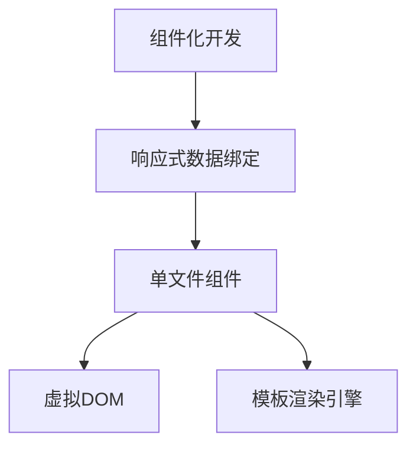

                 

# Vue.js 入门：渐进式 JavaScript 框架

> 关键词：Vue.js, 渐进式前端框架, MVC 模式, 组件化开发, 单文件组件, 模板渲染引擎, 响应式数据绑定

## 1. 背景介绍

### 1.1 问题由来
随着Web应用场景的快速变化和用户需求的日益复杂，传统的单体架构前端开发模式已经难以应对。如何在不增加开发复杂度和维护成本的情况下，构建高效、可维护、可扩展的前端应用？这是一个亟待解决的问题。

### 1.2 问题核心关键点
为了解决这个问题，前端开发者探索了各种框架和模式，最终在2013年，由Jamie Chen、Evgeni Bikchandani和Kevin Kosen linewidth共同推出了Vue.js。Vue.js是一个渐进式的JavaScript框架，它借鉴了Angular和React的优势，同时避免了它们的复杂性和学习成本。它的核心思想是通过组件化开发、响应式数据绑定和单文件组件等技术，将前端开发复杂度降到最低。

Vue.js的设计理念是“渐进式前端框架”，即用户可以根据实际需求，逐步引入Vue.js的特性和功能。它可以作为小项目的简易框架，也可以作为大型项目的核心骨架，可以与现有的代码结构无缝集成，实现灵活的混合开发模式。

Vue.js的定位是渐进式前端框架，意味着它不需要像Angular或React那样，要求开发人员全面理解MVC或组件生命周期管理等复杂概念。Vue.js从基础的模板语法开始，逐步引导开发者了解和使用更高级的功能，最终实现完整的MVVM模式。

### 1.3 问题研究意义
Vue.js的出现，为前端开发提供了一种全新的解决方案。它不仅降低了前端开发的复杂度和维护成本，还提升了开发效率和应用性能。同时，Vue.js还具有良好的可扩展性和兼容性，能够很好地与现有的JavaScript库和框架集成。

通过研究Vue.js的特性和开发模式，开发者可以更好地理解前端开发的本质，提升自身的技术水平和开发效率。这对于推动前端开发技术的进步，以及促进前端应用场景的不断扩展，具有重要意义。

## 2. 核心概念与联系

### 2.1 核心概念概述

为了更好地理解Vue.js，本节将介绍几个关键的核心概念：

- **组件化开发**：将前端应用拆分为多个独立的组件，每个组件负责独立的功能模块，通过组合和复用实现复杂的用户界面。

- **响应式数据绑定**：通过监听数据变化，自动更新页面内容，实现动态数据更新和交互。

- **单文件组件**：将HTML模板、CSS样式和JavaScript逻辑集成到单个文件，方便管理和维护。

- **虚拟DOM**：通过将实际DOM操作转换为虚拟DOM操作，减少DOM操作次数，提升应用性能。

- **模板渲染引擎**：Vue.js提供了基于模板的渲染引擎，支持模板语法、指令、计算属性等特性，方便开发者构建复杂的用户界面。

这些核心概念之间的逻辑关系可以通过以下Mermaid流程图来展示：



这个流程图展示了Vue.js的核心概念及其之间的关系：

1. 组件化开发是Vue.js的基础，通过组合多个独立的组件，实现复杂的前端应用。
2. 响应式数据绑定使得数据变化能够自动更新页面，实现动态数据交互。
3. 单文件组件将HTML、CSS和JavaScript集成到单个文件中，方便管理和维护。
4. 虚拟DOM通过将DOM操作转换为虚拟操作，减少DOM操作次数，提升应用性能。
5. 模板渲染引擎提供了基于模板的渲染机制，支持模板语法、指令、计算属性等特性。

这些核心概念共同构成了Vue.js的技术框架，使得前端开发变得简单高效。

## 3. 核心算法原理 & 具体操作步骤

### 3.1 算法原理概述

Vue.js的核心算法原理基于MVVM模式，即模型-视图-视图模型。在MVVM模式中，模型代表数据，视图代表用户界面，视图模型负责数据和视图之间的双向绑定。当模型数据发生变化时，视图模型会更新视图，反之亦然。

Vue.js的响应式数据绑定机制，使得模型数据的变化能够自动更新视图，无需手动操作DOM。同时，Vue.js提供了一系列指令、计算属性和钩子函数，方便开发者实现复杂的交互逻辑和数据处理。

### 3.2 算法步骤详解

以下是Vue.js核心算法原理的具体操作步骤：

1. **组件化**：将前端应用拆分为多个独立的组件，每个组件负责独立的功能模块。使用`Vue.component`方法定义组件，并使用`<component>`标签引入组件。

2. **响应式数据绑定**：使用`v-model`指令实现双向数据绑定，当数据变化时，视图自动更新。

3. **模板语法和指令**：使用`<template>`标签编写模板，支持模板语法、指令、计算属性等特性。指令用于处理数据和视图的逻辑，计算属性用于动态计算视图数据。

4. **计算属性和方法**：通过`computed`和`methods`属性，定义计算属性和方法，实现动态计算和逻辑处理。

5. **生命周期钩子函数**：通过`created`、`mounted`、`beforeDestroy`等钩子函数，实现组件的生命周期管理，如初始化、挂载和卸载。

### 3.3 算法优缺点

Vue.js的优点包括：

- 简单易学：Vue.js从基础的模板语法开始，逐步引导开发者了解和使用更高级的功能，降低了学习成本。
- 灵活高效：Vue.js提供了一系列指令、计算属性和钩子函数，方便开发者实现复杂的交互逻辑和数据处理。
- 性能优化：通过虚拟DOM和响应式数据绑定机制，Vue.js能够高效地更新视图，减少DOM操作次数，提升应用性能。

Vue.js的缺点包括：

- 学习曲线：尽管Vue.js简单易学，但在深入使用时，仍需要掌握一些高级特性和技巧。
- 灵活性不足：Vue.js的模板语法和指令有一定的限制，不如Angular或React灵活。
- 生态系统：相比于Angular和React，Vue.js的生态系统相对较小，缺乏一些高级功能。

### 3.4 算法应用领域

Vue.js的应用领域非常广泛，包括：

- 单页面应用（SPA）：通过组件化和路由实现复杂的单页面应用。
- 移动端应用：通过Vue.js和相关库（如Vuex、Vuetify等）构建高质量的移动端应用。
- 渐进式Web应用（PWA）：通过Vue.js和Service Worker等技术，实现具有原生应用体验的渐进式Web应用。
- 桌面应用：通过Electron等技术，将Vue.js应用移植到桌面端。

Vue.js不仅适用于前端应用开发，还可以与其他框架和库结合使用，构建复杂的混合应用。

## 4. 数学模型和公式 & 详细讲解 & 举例说明

### 4.1 数学模型构建

Vue.js的数学模型主要基于MVVM模式和响应式数据绑定机制。以下是Vue.js的核心数学模型：

1. **组件模型**：将前端应用拆分为多个独立的组件，每个组件负责独立的功能模块。

2. **响应式数据绑定**：通过监听数据变化，自动更新页面内容，实现动态数据更新和交互。

3. **虚拟DOM**：通过将实际DOM操作转换为虚拟DOM操作，减少DOM操作次数，提升应用性能。

4. **模板渲染引擎**：Vue.js提供了基于模板的渲染引擎，支持模板语法、指令、计算属性等特性，方便开发者构建复杂的用户界面。

### 4.2 公式推导过程

以下是Vue.js响应式数据绑定的公式推导过程：

假设有一个Vue实例`vm`，包含数据`data`和视图模型`methods`，使用`v-model`指令实现双向数据绑定。当`data`发生变化时，`vm`会自动更新视图，同时`methods`会重新计算视图数据，最终更新到页面中。

```js
// Vue实例
const vm = new Vue({
  data: {
    message: 'Hello, Vue!'
  },
  methods: {
    changeMessage() {
      this.message = 'Hello, Vue 2!'
    }
  },
  template: `
    <div>
      <p>{{ message }}</p>
      <button @click="changeMessage">Change Message</button>
    </div>
  `
})
```

当点击按钮时，`changeMessage`方法会更新`message`数据，并通过`vm`的响应式系统，自动更新视图中的文本内容。

### 4.3 案例分析与讲解

以下是一个简单的Vue.js案例，展示如何使用Vue.js实现一个简单的计数器：

```html
<template>
  <div>
    <p>Count: {{ counter }}</p>
    <button @click="increment">+1</button>
    <button @click="decrement">-1</button>
  </div>
</template>

<script>
export default {
  data() {
    return {
      counter: 0
    }
  },
  methods: {
    increment() {
      this.counter++
    },
    decrement() {
      this.counter--
    }
  }
}
</script>
```

该案例展示了如何使用Vue.js定义数据、方法和模板，实现基本的计数器功能。通过使用`v-model`指令，实现双向数据绑定，使得`counter`数据的变化能够自动更新到页面中。

## 5. 项目实践：代码实例和详细解释说明

### 5.1 开发环境搭建

要在本地搭建Vue.js开发环境，需要进行以下步骤：

1. 安装Node.js和npm。
2. 安装Vue.js和相关依赖库（如Vuex、Vuetify等）。
3. 创建Vue.js项目，使用`vue create my-project`命令创建项目模板。
4. 启动开发服务器，使用`npm run serve`命令运行开发服务器。

### 5.2 源代码详细实现

以下是一个简单的Vue.js项目，展示如何使用Vue.js构建单页面应用：

1. 创建`main.js`文件，定义Vue实例和组件：

```js
import Vue from 'vue'
import App from './App.vue'

new Vue({
  render: h => h(App)
}).$mount('#app')
```

2. 创建`App.vue`文件，定义组件模板和数据：

```js
<template>
  <div>
    <h1>{{ message }}</h1>
    <p>{{ count }}</p>
  </div>
</template>

<script>
export default {
  data() {
    return {
      message: 'Hello, Vue!',
      count: 0
    }
  },
  created() {
    setInterval(() => {
      this.count++
    }, 1000)
  }
}
</script>
```

3. 创建`index.html`文件，引入Vue实例：

```html
<!DOCTYPE html>
<html lang="en">
<head>
  <meta charset="UTF-8">
  <title>Vue.js Demo</title>
</head>
<body>
  <div id="app"></div>
  <script src="path/to/your/project/build/static/js/manifest.js"></script>
</body>
</html>
```

### 5.3 代码解读与分析

以下是`main.js`和`App.vue`文件的代码解读：

- `main.js`文件：
  - 通过`import Vue`导入Vue.js，并使用`new Vue`创建Vue实例。
  - 使用`render`方法指定组件模板，并使用`$mount`方法挂载到页面元素`#app`上。

- `App.vue`文件：
  - 通过`<template>`标签定义组件模板，包含`<h1>`和`<p>`元素。
  - 使用`data`属性定义组件数据，包括`message`和`count`。
  - 使用`created`钩子函数定时更新`count`数据，实现动态计数器效果。

## 6. 实际应用场景

### 6.1 渐进式Web应用（PWA）

通过Vue.js和Service Worker等技术，可以实现具有原生应用体验的渐进式Web应用（PWA）。PWA可以离线运行、快速响应、可安装、支持推送通知等功能，大大提升了Web应用的用户体验。

### 6.2 移动端应用

Vue.js可以通过相关库（如Vuex、Vuetify等）构建高质量的移动端应用。通过使用Vue.js和Vue Router等技术，可以实现复杂的路由导航和组件化开发，提升应用性能和用户体验。

### 6.3 桌面应用

通过Electron等技术，可以将Vue.js应用移植到桌面端，实现跨平台、高效率的桌面应用开发。

### 6.4 未来应用展望

随着Web应用场景的不断扩展和用户需求的日益复杂，Vue.js在渐进式Web应用、移动端应用、桌面应用等领域的应用前景广阔。

## 7. 工具和资源推荐

### 7.1 学习资源推荐

为了帮助开发者系统掌握Vue.js的理论基础和实践技巧，这里推荐一些优质的学习资源：

1. Vue.js官方文档：Vue.js官方文档提供了详细的API和指南，是学习Vue.js的最佳入门途径。

2. Vue.js生态系统：Vue.js生态系统提供了大量优质的插件和工具，如Vuex、Vuetify、ElementUI等，可以加速开发进程。

3. Vue.js社区：Vue.js社区是一个活跃的开发者社区，提供了大量的教程、文章和代码示例，方便开发者学习和交流。

4. Vue.js书籍：《Vue.js权威指南》、《Vue.js实战》等书籍，详细介绍了Vue.js的特性和开发模式，适合深入学习。

5. Vue.js视频教程：如Bilibili、YouTube等平台的Vue.js视频教程，通过视频形式展示Vue.js的开发过程和实践技巧。

### 7.2 开发工具推荐

高效的开发离不开优秀的工具支持。以下是几款用于Vue.js开发的工具：

1. VSCode：VSCode是一款功能强大的代码编辑器，支持Vue.js语法高亮、自动完成、调试等特性，是Vue.js开发的首选工具。

2. WebStorm：WebStorm是JetBrains公司推出的Web开发IDE，支持Vue.js、Angular和React等多种前端框架，功能丰富、易用性高。

3. Git：Git是一款版本控制系统，用于管理项目代码和历史版本，是Vue.js开发不可或缺的工具。

4. npm：npm是Node.js的包管理工具，用于安装和发布Vue.js相关的依赖库和组件，方便开发者快速集成和扩展功能。

5. Vue CLI：Vue CLI是Vue.js的命令行工具，用于创建、构建和管理Vue.js项目，提供了丰富的开发体验和命令。

### 7.3 相关论文推荐

Vue.js的设计理念和实现机制源于业界多年的经验和实践。以下是几篇奠基性的相关论文，推荐阅读：

1. Vue.js官方文档：Vue.js官方文档提供了详细的API和指南，是学习Vue.js的最佳入门途径。

2. Vue.js生态系统：Vue.js生态系统提供了大量优质的插件和工具，如Vuex、Vuetify、ElementUI等，可以加速开发进程。

3. Vue.js社区：Vue.js社区是一个活跃的开发者社区，提供了大量的教程、文章和代码示例，方便开发者学习和交流。

4. Vue.js书籍：《Vue.js权威指南》、《Vue.js实战》等书籍，详细介绍了Vue.js的特性和开发模式，适合深入学习。

5. Vue.js视频教程：如Bilibili、YouTube等平台的Vue.js视频教程，通过视频形式展示Vue.js的开发过程和实践技巧。

## 8. 总结：未来发展趋势与挑战

### 8.1 总结

本文对Vue.js的特性和开发模式进行了全面系统的介绍。首先阐述了Vue.js的起源和设计理念，明确了Vue.js在渐进式前端框架中的重要地位。其次，从原理到实践，详细讲解了Vue.js的核心算法原理和操作步骤，给出了Vue.js开发的完整代码实例。同时，本文还广泛探讨了Vue.js在渐进式Web应用、移动端应用、桌面应用等多个领域的应用前景，展示了Vue.js的广泛适用性和强大潜力。

通过本文的系统梳理，可以看到，Vue.js为前端开发提供了一种全新的解决方案。它不仅降低了前端开发的复杂度和维护成本，还提升了开发效率和应用性能。未来，随着Vue.js的不断演进和完善，必将在更多的应用场景中发挥更大的作用。

### 8.2 未来发展趋势

展望未来，Vue.js将呈现以下几个发展趋势：

1. 组件化深入发展：Vue.js将继续深化组件化开发模式，推出更多组件库和插件，提升组件的可复用性和灵活性。

2. 生态系统持续优化：Vue.js的生态系统将继续扩展和优化，支持更多框架和工具，提升开发效率和应用性能。

3. 渐进式框架不断完善：Vue.js将继续探索渐进式开发模式，推出更多渐进式开发工具和插件，支持更多的场景和需求。

4. 跨平台和混合应用普及：Vue.js将继续探索跨平台和混合应用的开发模式，支持更多的平台和环境，提升应用的普适性。

5. 生态系统社区化发展：Vue.js将继续强化社区化发展，吸引更多的开发者和贡献者，共同推动Vue.js的进步和创新。

以上趋势凸显了Vue.js的广泛应用前景，为前端开发带来了新的机遇和挑战。随着技术的不断演进，Vue.js必将在更多领域发挥重要作用。

### 8.3 面临的挑战

尽管Vue.js已经取得了显著的成就，但在迈向更加智能化、普适化应用的过程中，它仍面临诸多挑战：

1. 学习曲线：尽管Vue.js简单易学，但在深入使用时，仍需要掌握一些高级特性和技巧，学习曲线较陡峭。

2. 生态系统不完善：虽然Vue.js生态系统不断完善，但相比Angular和React，仍有一些不足之处，需要进一步优化和扩展。

3. 组件化程度不够：尽管Vue.js支持组件化开发，但在某些复杂场景下，仍然需要编写大量冗余代码，降低开发效率。

4. 社区支持不足：虽然Vue.js社区活跃，但在一些高级特性和插件上，支持力度仍显不足，需要进一步加强。

5. 兼容性问题：尽管Vue.js兼容性较好，但在一些老旧浏览器和低版本Node.js环境下，仍存在一些兼容性问题。

6. 性能优化挑战：尽管Vue.js性能优化较好，但在处理大量数据和复杂组件时，仍存在一些性能瓶颈，需要进一步优化。

这些挑战需要开发者在使用Vue.js时，不断探索和解决，才能最大化利用Vue.js的优势，实现高效、灵活、可靠的前端开发。

### 8.4 研究展望

面对Vue.js面临的种种挑战，未来的研究需要在以下几个方面寻求新的突破：

1. 组件化开发深度优化：推出更多组件库和插件，提升组件的可复用性和灵活性，减少开发冗余。

2. 生态系统持续扩展：加强生态系统的建设和管理，引入更多优质插件和工具，提升开发效率和应用性能。

3. 渐进式框架进一步完善：探索更多渐进式开发模式，支持更多场景和需求，提升应用的普适性。

4. 跨平台和混合应用深度探索：支持更多平台和环境，提升应用的普适性和灵活性，推动跨平台应用的发展。

5. 生态系统社区化建设：加强社区建设和管理，吸引更多开发者和贡献者，共同推动Vue.js的进步和创新。

这些研究方向的探索，将引领Vue.js技术不断演进，为前端开发带来新的机遇和挑战，推动前端技术的发展和创新。

## 9. 附录：常见问题与解答

**Q1：Vue.js与Angular、React的区别是什么？**

A: Vue.js与Angular、React都是现代前端框架，但它们的设计理念和实现机制有所不同：

1. Vue.js是一个渐进式前端框架，可以从基础的模板语法开始，逐步引入更高级的特性和功能，降低了学习成本。
2. Angular是一个完整的MVC框架，需要全面理解MVC和组件生命周期管理等复杂概念，学习曲线较陡峭。
3. React是一个声明式组件库，通过虚拟DOM实现高效的渲染，支持复杂的组件树和状态管理。

Vue.js的优点在于简单易学、灵活高效，适合小型项目和渐进式开发。

**Q2：Vue.js的生命周期钩子函数有哪些？**

A: Vue.js的生命周期钩子函数包括：

1. `created`：组件创建时调用，一般用于初始化数据和状态。
2. `mounted`：组件挂载时调用，一般用于数据初始化和组件渲染。
3. `beforeDestroy`：组件销毁前调用，一般用于清理资源和执行最后的清理工作。

通过使用这些生命周期钩子函数，可以实现组件的创建、挂载和销毁等逻辑，提升开发效率和代码可读性。

**Q3：如何优化Vue.js的性能？**

A: 以下几种方法可以优化Vue.js的性能：

1. 使用虚拟DOM：通过将实际DOM操作转换为虚拟DOM操作，减少DOM操作次数，提升应用性能。
2. 使用响应式数据绑定：通过监听数据变化，自动更新页面内容，减少手动操作DOM的次数。
3. 使用组件化开发：通过将应用拆分为多个独立的组件，实现复用和优化。
4. 使用懒加载和异步加载：通过懒加载和异步加载，减少页面加载时间，提升用户体验。
5. 使用路由缓存和懒加载：通过路由缓存和懒加载，提升应用的性能和用户体验。

这些方法可以显著提升Vue.js应用的性能和用户体验，提升应用的质量和稳定性。

**Q4：Vue.js与Vuex的关系是什么？**

A: Vuex是Vue.js的官方状态管理库，用于管理组件之间的状态和数据同步。Vue.js通过Vuex实现了状态管理和数据同步，使得组件之间可以方便地共享数据和状态。

Vuex提供了状态树、mutations、actions、getters等特性，方便开发者实现复杂的状态管理和数据同步逻辑。通过使用Vuex，可以实现跨组件的状态管理和数据同步，提升应用的可维护性和可扩展性。

**Q5：Vue.js的优点和缺点是什么？**

A: Vue.js的优点包括：

1. 简单易学：Vue.js从基础的模板语法开始，逐步引导开发者了解和使用更高级的功能，降低了学习成本。
2. 灵活高效：Vue.js提供了一系列指令、计算属性和钩子函数，方便开发者实现复杂的交互逻辑和数据处理。
3. 性能优化：通过虚拟DOM和响应式数据绑定机制，Vue.js能够高效地更新视图，减少DOM操作次数，提升应用性能。

Vue.js的缺点包括：

1. 学习曲线：尽管Vue.js简单易学，但在深入使用时，仍需要掌握一些高级特性和技巧。
2. 灵活性不足：Vue.js的模板语法和指令有一定的限制，不如Angular或React灵活。
3. 生态系统：相比于Angular和React，Vue.js的生态系统相对较小，缺乏一些高级功能。

**Q6：Vue.js的组件化开发有哪些优点？**

A: Vue.js的组件化开发具有以下优点：

1. 可复用性高：通过组件化开发，可以将应用拆分为多个独立的组件，实现复用和共享。
2. 维护成本低：通过组件化开发，可以将复杂应用拆分为多个小模块，提升代码的可维护性和可读性。
3. 灵活性强：通过组件化开发，可以实现复杂的逻辑和数据处理，提升应用的灵活性和扩展性。
4. 开发效率高：通过组件化开发，可以提升开发效率和开发速度，减少开发冗余。

通过使用组件化开发，可以显著提升Vue.js应用的开发效率和代码质量，提升应用的性能和用户体验。

---

作者：禅与计算机程序设计艺术 / Zen and the Art of Computer Programming

