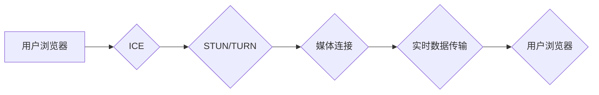

                 

## WebRTC 技术：浏览器中的实时通信

> 关键词：WebRTC, 实时通信, 浏览器, 音视频, 数据传输, P2P, STUN, TURN, ICE

## 1. 背景介绍

随着互联网技术的不断发展，人们对实时通信的需求日益增长。传统的实时通信技术，例如基于服务器的 VoIP 和视频会议系统，存在着延迟高、成本高、安全性低等问题。为了解决这些问题，WebRTC（Web Real-Time Communication）应运而生。WebRTC 是一种开源的 Web 标准，它允许浏览器直接进行实时音频、视频和数据传输，无需安装任何插件或应用程序。

WebRTC 的出现，为实时通信带来了革命性的改变。它简化了开发流程，降低了成本，提高了安全性，并为各种应用场景提供了强大的支持。例如，视频会议、在线游戏、远程医疗、远程教育等领域都受益于 WebRTC 的应用。

## 2. 核心概念与联系

WebRTC 的核心概念包括：

* **P2P 通信：** WebRTC 采用点对点（P2P）通信模式，允许用户直接与对方进行连接，无需通过中间服务器。这使得通信更加直接、高效、低延迟。
* **数据通道：** WebRTC 提供了数据通道，用于传输非音频视频数据，例如聊天消息、游戏数据等。
* **媒体流：** WebRTC 使用媒体流来传输音频和视频数据。媒体流可以是单向的，也可以是双向的。
* **ICE（Interactive Connectivity Establishment）：** ICE 是一种协议，用于帮助浏览器建立连接。它会尝试多种网络路径，找到最优的连接方式。
* **STUN（Session Traversal Utilities for NAT）和 TURN（Traversal Using Relays around NAT）：** STUN 和 TURN 协议用于解决 NAT（网络地址转换）带来的连接问题。

**核心概念架构流程图：**



## 3. 核心算法原理 & 具体操作步骤

### 3.1  算法原理概述

WebRTC 的核心算法原理主要包括：

* **网络地址发现：** 使用 ICE 协议，浏览器会尝试发现对方的网络地址。
* **连接建立：** 使用 STUN 和 TURN 协议，浏览器会绕过 NAT 限制，建立连接。
* **媒体流传输：** 使用 RTP（实时传输协议）和 RTCP（实时传输控制协议），浏览器会传输音频和视频数据。
* **数据通道传输：** 使用 WebSockets 或其他协议，浏览器会传输非媒体数据。

### 3.2  算法步骤详解

1. **用户浏览器发起连接请求：** 用户浏览器会向对方浏览器发送一个连接请求，包含自己的网络地址和媒体类型等信息。
2. **ICE 协议进行网络地址发现：** 浏览器会使用 ICE 协议，尝试发现对方的网络地址。ICE 会尝试多种网络路径，例如直接连接、STUN 服务器、TURN 服务器等。
3. **STUN 和 TURN 协议绕过 NAT 限制：** 如果浏览器无法直接连接对方，则会使用 STUN 和 TURN 协议，通过服务器进行连接。
4. **建立媒体连接：** 浏览器会使用 RTP 和 RTCP 协议，建立媒体连接，开始传输音频和视频数据。
5. **数据通道传输：** 浏览器可以使用 WebSockets 或其他协议，建立数据通道，传输非媒体数据。

### 3.3  算法优缺点

**优点：**

* **低延迟：** P2P 通信模式，减少了网络传输延迟。
* **低成本：** 不需要使用第三方服务器，降低了成本。
* **高安全性：** 使用加密协议，保障数据安全。
* **跨平台支持：** 支持多种操作系统和浏览器。

**缺点：**

* **NAT 穿透问题：** 需要使用 STUN 和 TURN 协议，才能解决 NAT 穿透问题。
* **网络质量依赖：** 网络质量会影响通信质量。
* **浏览器兼容性：** 部分老旧浏览器可能不支持 WebRTC。

### 3.4  算法应用领域

WebRTC 的应用领域非常广泛，包括：

* **视频会议：** 例如 Zoom、Google Meet 等。
* **在线游戏：** 例如 Fortnite、League of Legends 等。
* **远程医疗：** 例如远程诊断、远程手术等。
* **远程教育：** 例如在线课程、远程辅导等。
* **实时聊天：** 例如 WhatsApp、Facebook Messenger 等。

## 4. 数学模型和公式 & 详细讲解 & 举例说明

### 4.1  数学模型构建

WebRTC 的核心算法涉及到网络传输、数据处理、媒体编码等多个方面，可以使用数学模型来描述其工作原理。例如，可以建立一个网络传输模型，描述数据包的发送、接收、丢包等过程。

### 4.2  公式推导过程

在网络传输模型中，可以定义一些关键参数，例如：

* **数据包大小：** $D$
* **发送速率：** $R$
* **丢包率：** $P$

根据这些参数，可以推导出数据包的传输时间、平均传输速率等公式。

### 4.3  案例分析与讲解

例如，假设数据包大小为 $1024$ 字节，发送速率为 $100$ Mbps，丢包率为 $0.01$。

* **平均传输时间：** $T = D / R = 1024 / (100 * 10^6) = 10.24 * 10^{-6}$ 秒
* **平均传输速率：** $R_{avg} = R * (1 - P) = 100 * 10^6 * (1 - 0.01) = 99 * 10^6$ bps

## 5. 项目实践：代码实例和详细解释说明

### 5.1  开发环境搭建

WebRTC 的开发环境搭建相对简单，主要需要安装以下软件：

* **Web 浏览器：** 支持 WebRTC 的浏览器，例如 Chrome、Firefox、Edge 等。
* **代码编辑器：** 例如 Visual Studio Code、Atom、Sublime Text 等。
* **Node.js：** 用于运行 WebRTC 服务器端代码。

### 5.2  源代码详细实现

以下是一个简单的 WebRTC 音视频通话示例代码：

```javascript
// 客户端代码
const localStream = await navigator.mediaDevices.getUserMedia({ audio: true, video: true });
const peerConnection = new RTCPeerConnection();

// 添加本地媒体流到 PeerConnection
localStream.getTracks().forEach(track => peerConnection.addTrack(track, localStream));

// ... 其他代码 ...

// 服务器端代码
const server = require('http').createServer();
const wss = require('ws').Server({ server });

wss.on('connection', (ws) => {
  // ... 处理连接逻辑 ...
});

server.listen(8080, () => {
  console.log('Server listening on port 8080');
});
```

### 5.3  代码解读与分析

* 客户端代码：使用 `navigator.mediaDevices.getUserMedia()` 获取用户的音频和视频流，并将其添加到 `RTCPeerConnection` 对象中。
* 服务器端代码：使用 WebSocket 服务器处理客户端连接，并进行媒体流转发等操作。

### 5.4  运行结果展示

运行上述代码后，可以实现两个浏览器之间的实时音视频通话。

## 6. 实际应用场景

WebRTC 的应用场景非常广泛，例如：

* **视频会议：** WebRTC 可以用于构建低延迟、高品质的视频会议系统，例如 Zoom、Google Meet 等。
* **在线游戏：** WebRTC 可以用于构建实时在线游戏，例如 Fortnite、League of Legends 等。
* **远程医疗：** WebRTC 可以用于远程诊断、远程手术等医疗场景。
* **远程教育：** WebRTC 可以用于在线课程、远程辅导等教育场景。
* **实时聊天：** WebRTC 可以用于构建实时聊天应用，例如 WhatsApp、Facebook Messenger 等。

### 6.4  未来应用展望

WebRTC 的未来应用前景十分广阔，例如：

* **增强现实（AR）和虚拟现实（VR）：** WebRTC 可以用于构建沉浸式的 AR 和 VR 应用，例如远程协作、虚拟旅游等。
* **物联网（IoT）：** WebRTC 可以用于构建物联网设备之间的实时通信，例如智能家居、智能工厂等。
* **边缘计算：** WebRTC 可以用于构建边缘计算应用，例如实时数据分析、边缘 AI 等。

## 7. 工具和资源推荐

### 7.1  学习资源推荐

* **WebRTC 官方网站：** https://webrtc.org/
* **WebRTC 文档：** https://developer.mozilla.org/en-US/docs/Web/API/WebRTC_API
* **WebRTC 教程：** https://www.w3schools.com/html/html5_webRTC.asp

### 7.2  开发工具推荐

* **Chrome DevTools：** 用于调试 WebRTC 应用。
* **Firefox Developer Tools：** 用于调试 WebRTC 应用。
* **WebRTC.js：** 一个 JavaScript 库，用于简化 WebRTC 开发。

### 7.3  相关论文推荐

* **WebRTC：A New Era of Real-Time Communication on the Web**
* **The Architecture of WebRTC**
* **WebRTC: A Survey**

## 8. 总结：未来发展趋势与挑战

### 8.1  研究成果总结

WebRTC 技术已经取得了显著的成果，为实时通信带来了革命性的改变。它简化了开发流程，降低了成本，提高了安全性，并为各种应用场景提供了强大的支持。

### 8.2  未来发展趋势

WebRTC 的未来发展趋势包括：

* **更低延迟：** 通过优化网络传输协议和算法，进一步降低通信延迟。
* **更高安全性：** 使用更先进的加密算法和身份验证机制，保障数据安全。
* **更广泛的应用场景：** 将 WebRTC 应用于更多领域，例如 AR/VR、IoT、边缘计算等。

### 8.3  面临的挑战

WebRTC 还面临着一些挑战，例如：

* **NAT 穿透问题：** 仍然存在 NAT 穿透问题，需要不断改进 STUN 和 TURN 协议。
* **浏览器兼容性：** 部分老旧浏览器可能不支持 WebRTC，需要提高浏览器兼容性。
* **网络质量依赖：** 网络质量会影响通信质量，需要开发更鲁棒的算法。

### 8.4  研究展望

未来，WebRTC 技术将继续发展，为实时通信带来更多创新和突破。研究者将继续致力于解决 WebRTC 的挑战，并探索其在更多领域的应用。

## 9. 附录：常见问题与解答

**常见问题：**

* **WebRTC 是什么？**

WebRTC 是一个开源的 Web 标准，它允许浏览器直接进行实时音频、视频和数据传输，无需安装任何插件或应用程序。

* **WebRTC 的优势是什么？**

WebRTC 的优势包括：低延迟、低成本、高安全性、跨平台支持等。

* **WebRTC 的应用场景有哪些？**

WebRTC 的应用场景非常广泛，例如视频会议、在线游戏、远程医疗、远程教育等。

* **如何学习 WebRTC？**

可以参考 WebRTC 官方网站、文档、教程等资源。

**解答：**

* **WebRTC 是一个开源的 Web 标准，它允许浏览器直接进行实时音频、视频和数据传输，无需安装任何插件或应用程序。**
* **WebRTC 的优势包括：低延迟、低成本、高安全性、跨平台支持等。**
* **WebRTC 的应用场景非常广泛，例如视频会议、在线游戏、远程医疗、远程教育等。**
* **可以参考 WebRTC 官方网站、文档、教程等资源学习 WebRTC。**


作者：禅与计算机程序设计艺术 / Zen and the Art of Computer Programming 
<end_of_turn>

