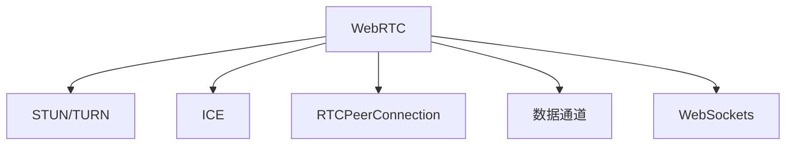

                 

# WebRTC技术：构建实时通信应用

> 关键词：WebRTC, 实时通信, 音视频流, 媒体传输, STUN/TURN, 安全性, 数据通道, P2P, 实现指南

## 1. 背景介绍

### 1.1 问题由来
在互联网迅速发展的今天，实时通信应用（RTC，Real-Time Communications）成为了人们日常生活和工作中不可或缺的一部分。从视频会议、在线教育、远程办公，到即时通讯、游戏直播、医疗咨询，实时通信技术无所不在，为人们提供了高效、便捷的沟通方式。

然而，随着用户规模的不断扩大和应用场景的日益丰富，传统的RTC技术在性能、安全性和可扩展性等方面面临着诸多挑战。传统的WebRTC技术虽然能够满足基本的音视频传输需求，但在跨网络、跨平台、跨浏览器等复杂环境中，无法提供高效、稳定、安全的通信体验。因此，研究新的WebRTC技术，提升实时通信应用的性能和安全性，成为了迫切需要解决的问题。

### 1.2 问题核心关键点
WebRTC技术旨在构建高性能、低延迟、安全可靠的实时通信系统。其主要核心关键点包括：

- 实时音视频流传输：WebRTC支持低延迟、高清晰度的音视频流传输，能够满足实时通信的需求。
- 媒体传输协议：WebRTC采用STUN/TURN协议，确保在不同网络环境下的音视频流传输畅通无阻。
- 数据通道：WebRTC支持数据通道（Data Channel），实现点对点（P2P）的数据传输。
- 安全机制：WebRTC引入了多种安全机制，确保通信的安全性和隐私保护。
- 跨平台兼容性：WebRTC支持多种操作系统和浏览器，具有广泛的跨平台兼容性。

这些关键点构成了WebRTC技术的核心，使得其在实时通信应用中具有不可替代的地位。本文将从这些核心关键点出发，详细讲解WebRTC技术的工作原理、核心算法和具体操作步骤，并提供实用的开发指南和实际应用场景，帮助开发者构建高效、安全、可靠的实时通信应用。

## 2. 核心概念与联系

### 2.1 核心概念概述

为更好地理解WebRTC技术，本节将介绍几个密切相关的核心概念：

- **WebRTC**：WebRTC（Web Real-Time Communication）是一个开源的JavaScript库，旨在实现浏览器间的点对点实时通信。WebRTC支持音视频流、数据通道等多种通信方式，能够构建高性能、低延迟的实时通信系统。
- **STUN/TURN协议**：STUN（Session Traversal Utilities for NAT）和TURN（Traversal Using Relay NAT）是WebRTC中用于穿越NAT和防火墙的协议。通过STUN/TURN服务器，WebRTC能够实现穿越不同网络的音视频流传输。
- **ICE协议**：ICE（Interactive Connectivity Establishment）协议是WebRTC中用于网络连接的协议，通过不断的连接尝试，ICE协议能够在复杂的互联网环境中建立稳定的通信连接。
- **RTCPeerConnection**：RTCPeerConnection是WebRTC中的核心API，用于建立和管理音视频流和数据通道的连接。
- **数据通道（Data Channel）**：数据通道是WebRTC中用于点对点数据传输的通道，与音视频流通道（Stream）区分开来。
- **WebSockets**：WebSockets是WebRTC中用于传输信令和控制信息的协议，支持双向通信和实时传输。

这些核心概念之间的逻辑关系可以通过以下Mermaid流程图来展示：



这个流程图展示了一个完整的WebRTC通信过程：

1. WebRTC通过STUN/TURN协议穿越NAT和防火墙，确保音视频流传输的通畅。
2. ICE协议用于建立稳定的连接，确保通信的可靠性。
3. RTCPeerConnection API用于建立和管理音视频流和数据通道的连接。
4. 数据通道支持点对点数据传输，与音视频流通道分离。
5. WebSockets用于传输信令和控制信息，实现双向通信和实时传输。

这些概念共同构成了WebRTC技术的核心，使得其能够在复杂的互联网环境中实现高效、稳定的实时通信。

## 3. 核心算法原理 & 具体操作步骤

### 3.1 算法原理概述

WebRTC技术的核心算法主要包括以下几个方面：

1. **音视频流传输算法**：WebRTC采用NACK和RED（Rate Control withRED）算法，实现音视频流的差错控制和流量控制。
2. **STUN/TURN协议**：STUN和TURN协议用于穿越NAT和防火墙，确保音视频流传输的通畅。
3. **ICE协议**：ICE协议用于建立稳定的连接，确保通信的可靠性。
4. **数据通道传输算法**：WebRTC使用RTCPeerConnection API，建立和管理数据通道的连接。
5. **WebSockets协议**：WebSockets协议用于传输信令和控制信息，实现双向通信和实时传输。

这些核心算法共同构成了WebRTC技术的基础，确保了实时通信应用的高效、稳定和安全性。

### 3.2 算法步骤详解

#### 3.2.1 音视频流传输算法

音视频流传输算法的核心在于差错控制和流量控制，以确保音视频流传输的稳定性和可靠性。WebRTC采用了NACK和RED算法，实现了这两个目标。

**NACK算法**：NACK（Negative Acknowledgment）算法用于识别和重传丢失的音视频包。当接收端检测到某个音视频包丢失时，会发送NACK请求，要求发送端重新发送该包。发送端接收到NACK请求后，会立即重传该包，以确保音视频流传输的完整性。

**RED算法**：RED（Rate Control with RED）算法用于控制音视频流的传输速率，以避免网络拥塞和带宽浪费。WebRTC通过RTCP协议收集网络状态信息，并根据这些信息调整音视频流的传输速率。当网络状态不佳时，RED算法会自动降低音视频流的传输速率，以减少网络拥塞和延迟。

**具体操作步骤**：
1. 发送端将音视频包分块并发送。
2. 接收端检测到某个音视频包丢失，发送NACK请求。
3. 发送端接收到NACK请求后，立即重传丢失的音视频包。
4. WebRTC通过RTCP协议收集网络状态信息，并根据这些信息调整音视频流的传输速率。

#### 3.2.2 STUN/TURN协议

STUN和TURN协议是WebRTC中用于穿越NAT和防火墙的协议，确保音视频流传输的通畅。

**STUN协议**：STUN协议用于探测NAT类型和获取外网IP地址，以便发送端和接收端能够建立稳定的连接。STUN协议通过发送STUN请求和响应，获取内网地址和端口号，并将其映射到外网地址和端口号，从而实现穿越NAT和防火墙的目标。

**TURN协议**：TURN协议用于在无法穿越NAT和防火墙的情况下，通过中继服务器进行音视频流传输。当发送端无法与接收端直接建立连接时，TURN协议会自动将音视频流转发到中继服务器，再由中继服务器转发给接收端，从而实现穿越NAT和防火墙的目标。

**具体操作步骤**：
1. 发送端和接收端通过STUN协议获取内网地址和端口号。
2. 发送端和接收端建立ICE连接，进行连接尝试。
3. 如果连接尝试失败，发送端和接收端通过TURN协议，将音视频流转发到中继服务器。
4. 中继服务器再将音视频流转发给接收端。

#### 3.2.3 ICE协议

ICE协议用于建立稳定的连接，确保通信的可靠性。ICE协议通过不断的连接尝试，找到最佳连接路径，并在连接过程中进行多次握手，以确保连接的稳定性和可靠性。

**具体操作步骤**：
1. 发送端和接收端通过STUN/TURN协议获取内网地址和端口号。
2. 发送端和接收端进行ICE连接尝试，多次发送连接请求和响应，以建立稳定的连接。
3. 在连接过程中，发送端和接收端进行多次握手，以确保连接的稳定性和可靠性。

#### 3.2.4 数据通道传输算法

数据通道是WebRTC中用于点对点数据传输的通道，与音视频流通道（Stream）区分开来。

**具体操作步骤**：
1. 发送端和接收端通过RTCPeerConnection API建立数据通道连接。
2. 发送端将数据分块并通过数据通道传输。
3. 接收端接收到数据后，根据数据通道标识进行解析，并执行相应的处理操作。

#### 3.2.5 WebSockets协议

WebSockets协议用于传输信令和控制信息，实现双向通信和实时传输。

**具体操作步骤**：
1. 发送端和接收端通过WebSocket协议建立双向连接。
2. 发送端发送信令和控制信息，接收端接收并处理这些信息。
3. 接收端将处理结果通过WebSocket协议发送回发送端。

### 3.3 算法优缺点

WebRTC技术的核心算法具有以下优点：

1. **高效性**：WebRTC采用了NACK和RED算法，实现了音视频流的差错控制和流量控制，确保音视频流传输的稳定性和可靠性。
2. **安全性**：WebRTC引入了多种安全机制，确保通信的安全性和隐私保护。
3. **可扩展性**：WebRTC支持跨平台、跨浏览器的兼容性，具有广泛的适用性。

同时，WebRTC技术也存在一些缺点：

1. **复杂性**：WebRTC技术涉及多个协议和算法，实现起来较为复杂。
2. **性能瓶颈**：在一些复杂的网络环境中，WebRTC的性能可能会受到影响。
3. **兼容性问题**：不同浏览器和操作系统的兼容性问题，可能导致一些功能无法实现。

尽管存在这些缺点，WebRTC技术凭借其高效、稳定、安全的特性，仍然成为了构建实时通信应用的首选。

### 3.4 算法应用领域

WebRTC技术广泛应用于实时通信应用中，包括但不限于以下领域：

- 视频会议：WebRTC技术可以支持高清视频会议，实现多人同时通话，提升视频会议的体验。
- 在线教育：WebRTC技术可以实现实时互动教学，提升在线教育的效果。
- 远程办公：WebRTC技术可以实现多人实时协作，提升远程办公的效率。
- 游戏直播：WebRTC技术可以实现实时互动游戏直播，提升游戏的体验。
- 医疗咨询：WebRTC技术可以实现实时医疗咨询，提升医疗服务的质量。

此外，WebRTC技术还被广泛应用于智能家居、智能车联网等领域，为这些领域带来了新的应用可能性。

## 4. 数学模型和公式 & 详细讲解 & 举例说明

### 4.1 数学模型构建

WebRTC技术的数学模型主要涉及音视频流传输、STUN/TURN协议、ICE协议等多个方面。以下分别介绍这些数学模型的构建。

#### 4.1.1 音视频流传输模型

音视频流传输模型主要涉及NACK算法和RED算法。以下公式描述了NACK算法和RED算法的数学模型：

**NACK算法**：
$$
R(k) = R_{k-1} + \Delta R(k)
$$
其中，$R(k)$ 表示第 $k$ 个音视频包的传输速率，$R_{k-1}$ 表示第 $k-1$ 个音视频包的传输速率，$\Delta R(k)$ 表示第 $k$ 个音视频包的速率调整量。

**RED算法**：
$$
R(k) = R_{k-1} + \Delta R(k)
$$
其中，$R(k)$ 表示第 $k$ 个音视频包的传输速率，$R_{k-1}$ 表示第 $k-1$ 个音视频包的传输速率，$\Delta R(k)$ 表示第 $k$ 个音视频包的速率调整量。

#### 4.1.2 STUN/TURN协议模型

STUN/TURN协议模型主要涉及NAT和防火墙穿越的数学模型。以下公式描述了STUN协议和TURN协议的数学模型：

**STUN协议**：
$$
\begin{aligned}
& \text{内网地址} = f(\text{STUN请求}) \\
& \text{外网地址} = g(\text{内网地址}, \text{内网端口号})
\end{aligned}
$$
其中，$f(\text{STUN请求})$ 表示STUN请求处理函数，$g(\text{内网地址}, \text{内网端口号})$ 表示将内网地址和端口号映射到外网地址和端口号的函数。

**TURN协议**：
$$
\begin{aligned}
& \text{中继服务器地址} = f(\text{TURN请求}) \\
& \text{中继服务器端口号} = g(\text{TURN请求}, \text{外网地址}, \text{外网端口号})
\end{aligned}
$$
其中，$f(\text{TURN请求})$ 表示TURN请求处理函数，$g(\text{TURN请求}, \text{外网地址}, \text{外网端口号})$ 表示将外网地址和端口号映射到中继服务器地址和端口号的函数。

#### 4.1.3 ICE协议模型

ICE协议模型主要涉及网络连接的数学模型。以下公式描述了ICE协议的数学模型：

**ICE协议**：
$$
\begin{aligned}
& \text{连接尝试次数} = f(\text{ICE请求}) \\
& \text{连接成功} = g(\text{连接尝试次数}, \text{网络状态})
\end{aligned}
$$
其中，$f(\text{ICE请求})$ 表示ICE请求处理函数，$g(\text{连接尝试次数}, \text{网络状态})$ 表示根据网络状态和连接尝试次数判断连接是否成功的函数。

### 4.2 公式推导过程

以下对WebRTC技术中的核心算法公式进行推导：

#### 4.2.1 NACK算法推导

NACK算法的核心在于重传丢失的音视频包，确保音视频流传输的完整性。以下公式描述了NACK算法的推导过程：

**NACK算法**：
$$
R(k) = R_{k-1} + \Delta R(k)
$$
其中，$R(k)$ 表示第 $k$ 个音视频包的传输速率，$R_{k-1}$ 表示第 $k-1$ 个音视频包的传输速率，$\Delta R(k)$ 表示第 $k$ 个音视频包的速率调整量。

### 4.3 案例分析与讲解

#### 4.3.1 音视频流传输案例

假设发送端和接收端建立了一个音视频流连接，发送端发送了10个音视频包，其中第3个音视频包丢失。接收端检测到第3个音视频包丢失，并发送NACK请求。发送端接收到NACK请求后，立即重传第3个音视频包，最终接收端成功接收所有音视频包。

**具体操作步骤**：
1. 发送端发送10个音视频包。
2. 接收端检测到第3个音视频包丢失，发送NACK请求。
3. 发送端接收到NACK请求后，重传第3个音视频包。
4. 接收端成功接收所有音视频包。

#### 4.3.2 STUN/TURN协议案例

假设发送端和接收端建立了一个音视频流连接，发送端和接收端通过STUN协议获取内网地址和端口号，并通过TURN协议进行音视频流传输。

**具体操作步骤**：
1. 发送端和接收端通过STUN协议获取内网地址和端口号。
2. 发送端和接收端建立ICE连接，进行连接尝试。
3. 发送端和接收端通过TURN协议，将音视频流转发到中继服务器。
4. 中继服务器再将音视频流转发给接收端。

## 5. 项目实践：代码实例和详细解释说明

### 5.1 开发环境搭建

为了构建WebRTC实时通信应用，需要先搭建好开发环境。以下是WebRTC开发环境的搭建步骤：

1. 安装Node.js：从官网下载并安装Node.js，并确保安装最新版本。

2. 安装WebRTC SDK：从WebRTC官网下载并安装WebRTC SDK，并将其引入开发项目中。

3. 安装WebSocket库：从NPM安装WebSocket库，用于处理WebSocket连接和信令传输。

4. 安装RTCPeerConnection API：WebRTC API提供了RTCPeerConnection API，用于建立和管理音视频流和数据通道的连接。

### 5.2 源代码详细实现

以下是一个简单的WebRTC实时通信应用的代码实现：

```javascript
// 创建RTCPeerConnection实例
var pc = new RTCPeerConnection();

// 创建本地音视频流
var localStream = new MediaStream();
localStream.addTrack(new MediaStreamTrack({ kind: 'video' }));
localStream.addTrack(new MediaStreamTrack({ kind: 'audio' }));

// 设置音视频流通道参数
pc.addStream(localStream);
pc.ontrack = function(event) {
  // 处理音视频流通道
};

// 创建数据通道
pc.createDataChannel('dataChannel');

// 创建WebSocket连接
var socket = new WebSocket('wss://example.com/');

// 处理WebSocket连接和信令
socket.onopen = function(event) {
  // 处理WebSocket连接打开
};

socket.onmessage = function(event) {
  // 处理WebSocket消息
};

socket.onclose = function(event) {
  // 处理WebSocket连接关闭
};

// 处理音视频流和数据通道
pc.onicecandidate = function(event) {
  // 处理ICE候选
};
pc.oniceconnectionstatechange = function(event) {
  // 处理ICE连接状态变化
};

pc.onaddstream = function(event) {
  // 处理音视频流添加
};
pc.onremovestream = function(event) {
  // 处理音视频流移除
};

pc.ondatachannel = function(event) {
  // 处理数据通道
};

pc.ontrack = function(event) {
  // 处理音视频流通道
};
```

### 5.3 代码解读与分析

以上代码实现了一个简单的WebRTC实时通信应用，包括音视频流和数据通道的建立和管理，以及WebSocket连接的创建和信令传输。

**RTCPeerConnection**：RTCPeerConnection是WebRTC中的核心API，用于建立和管理音视频流和数据通道的连接。

**ICE连接尝试**：ICE协议通过不断的连接尝试，找到最佳连接路径，并在连接过程中进行多次握手，以确保连接的稳定性和可靠性。

**数据通道传输**：数据通道是WebRTC中用于点对点数据传输的通道，与音视频流通道分离。

**WebSocket连接**：WebSocket协议用于传输信令和控制信息，实现双向通信和实时传输。

## 6. 实际应用场景

### 6.1 智能家居

WebRTC技术可以应用于智能家居领域，实现远程控制和管理。通过WebRTC连接，用户可以远程控制家中的智能设备，如灯光、温控、安防等，实现智能家居的远程控制和管理。

### 6.2 智能车联网

WebRTC技术可以应用于智能车联网领域，实现车车通信和车联网服务。通过WebRTC连接，车辆可以实时获取其他车辆的位置和状态信息，实现自动驾驶、智能导航等功能，提升驾驶体验和安全水平。

### 6.3 医疗咨询

WebRTC技术可以应用于医疗咨询领域，实现远程医疗和实时互动。通过WebRTC连接，医生和患者可以实时视频通话，进行诊断和治疗，提升医疗服务的质量和效率。

## 7. 工具和资源推荐

### 7.1 学习资源推荐

为了帮助开发者系统掌握WebRTC技术，这里推荐一些优质的学习资源：

1. WebRTC官方文档：WebRTC官网提供了详细的官方文档，涵盖WebRTC技术的基本概念、API接口、协议原理等内容，是学习WebRTC技术的必备资料。

2. WebRTC教程：WebRTC官网提供了丰富的教程和示例代码，帮助开发者快速上手WebRTC技术，实现实际的实时通信应用。

3. WebRTC样例代码：WebRTC官网提供了大量样例代码，涵盖音视频流传输、数据通道传输、WebSocket连接等多个方面，供开发者参考和借鉴。

4. WebRTC在线课程：Coursera、Udacity等在线教育平台提供了WebRTC相关的课程，涵盖WebRTC技术的基础、应用、优化等多个方面，帮助开发者系统学习WebRTC技术。

5. WebRTC书籍：《WebRTC 2023》、《WebRTC原理与实践》等书籍，深入浅出地介绍了WebRTC技术的基本原理、应用场景、最佳实践等内容，适合开发者系统学习WebRTC技术。

### 7.2 开发工具推荐

为了高效开发WebRTC应用，以下是几款常用的开发工具：

1. Visual Studio Code：Visual Studio Code是一款轻量级的代码编辑器，支持多种编程语言和插件，适合WebRTC应用开发。

2. IntelliJ IDEA：IntelliJ IDEA是一款功能强大的Java开发工具，支持多种WebRTC API和插件，适合WebRTC应用的开发和调试。

3. Eclipse：Eclipse是一款开源的Java开发工具，支持多种WebRTC API和插件，适合WebRTC应用的开发和调试。

4. Firefox：Firefox是一款开源的Web浏览器，支持WebRTC协议和插件，适合WebRTC应用的开发和测试。

5. Chrome：Chrome是一款流行的Web浏览器，支持WebRTC协议和插件，适合WebRTC应用的开发和测试。

### 7.3 相关论文推荐

WebRTC技术的研究始于学术界，以下是几篇奠基性的相关论文，推荐阅读：

1. 《WebRTC: Communication in Real-time through Web browsers》：该论文详细介绍了WebRTC技术的基本原理和实现细节，是WebRTC技术的入门必读。

2. 《ICE Protocol for Internet Communication: Basic Framework and Implementation》：该论文详细介绍了ICE协议的实现细节，是WebRTC技术中的核心内容。

3. 《WebRTC Based Real-Time Video Communication System》：该论文介绍了WebRTC技术在实时视频通信中的应用，是WebRTC技术的实际应用案例。

4. 《WebRTC: State of the Art in Real-Time Communication》：该论文总结了WebRTC技术的最新进展和趋势，是WebRTC技术的研究综述。

这些论文代表了大规模语言模型微调技术的最新进展，通过学习这些前沿成果，可以帮助研究者把握学科前进方向，激发更多的创新灵感。

## 8. 总结：未来发展趋势与挑战

### 8.1 总结

本文对WebRTC技术进行了全面系统的介绍。首先阐述了WebRTC技术在实时通信应用中的重要性，明确了WebRTC技术的核心概念和关键点。其次，从原理到实践，详细讲解了WebRTC技术的核心算法和具体操作步骤，提供了实用的开发指南和实际应用场景。通过本文的系统梳理，可以看到，WebRTC技术已经成为构建实时通信应用的重要工具，具有高效、稳定、安全的特性。

### 8.2 未来发展趋势

展望未来，WebRTC技术将呈现以下几个发展趋势：

1. **跨平台兼容性增强**：随着WebRTC技术的不断发展，跨平台兼容性将得到进一步提升，能够在更多操作系统和浏览器中实现实时通信。

2. **性能和安全性提升**：WebRTC技术将继续优化音视频流传输和数据通道传输的性能，引入更多的安全机制，确保通信的安全性和隐私保护。

3. **应用场景拓展**：WebRTC技术将应用于更多领域，如智能家居、智能车联网、医疗咨询等，提升各行业的数字化水平。

4. **生态系统完善**：WebRTC生态系统将不断完善，更多开发者和组织将加入WebRTC社区，推动WebRTC技术的发展和应用。

### 8.3 面临的挑战

尽管WebRTC技术已经取得了瞩目成就，但在迈向更加智能化、普适化应用的过程中，它仍面临着诸多挑战：

1. **网络环境复杂性**：不同网络环境下的音视频流传输和数据通道传输性能不稳定，需要引入更多的优化策略。

2. **跨浏览器兼容性**：不同浏览器对WebRTC协议和API的支持程度不同，可能导致一些功能无法实现。

3. **性能瓶颈**：在一些复杂的网络环境中，WebRTC的性能可能会受到影响，需要引入更多的优化策略。

4. **安全性问题**：WebRTC技术需要引入更多的安全机制，确保通信的安全性和隐私保护。

5. **跨平台兼容性**：WebRTC技术需要进一步提升跨平台兼容性，能够在更多操作系统和浏览器中实现实时通信。

### 8.4 研究展望

面对WebRTC技术所面临的种种挑战，未来的研究需要在以下几个方面寻求新的突破：

1. **网络环境优化**：通过优化音视频流传输和数据通道传输的算法和协议，提高WebRTC技术在不同网络环境下的性能和稳定性。

2. **跨浏览器兼容**：引入更多的浏览器兼容性策略，确保WebRTC技术在更多浏览器中实现实时通信。

3. **性能优化**：引入更多的性能优化策略，如网络优化、压缩算法、混合精度计算等，提高WebRTC技术的性能和效率。

4. **安全机制完善**：引入更多的安全机制，如加密传输、认证机制等，确保WebRTC通信的安全性和隐私保护。

5. **跨平台兼容**：引入更多的跨平台兼容性策略，确保WebRTC技术在更多操作系统和浏览器中实现实时通信。

这些研究方向的探索，必将引领WebRTC技术迈向更高的台阶，为构建安全、可靠、可扩展的实时通信系统铺平道路。面向未来，WebRTC技术还需要与其他人工智能技术进行更深入的融合，如语音识别、图像处理等，多路径协同发力，共同推动实时通信技术的发展。只有勇于创新、敢于突破，才能不断拓展WebRTC技术的边界，让实时通信技术更好地造福人类社会。

## 9. 附录：常见问题与解答

**Q1：WebRTC技术适用于哪些应用场景？**

A: WebRTC技术适用于需要实时音视频通信的应用场景，如视频会议、在线教育、远程办公、游戏直播、医疗咨询等。通过WebRTC技术，用户可以实时、高效地进行音视频通信，提升用户体验和应用效果。

**Q2：WebRTC技术如何实现跨平台兼容性？**

A: WebRTC技术通过引入多种浏览器兼容策略，确保在不同浏览器和操作系统中实现实时通信。例如，通过Polyfill技术，WebRTC技术可以在不支持WebRTC协议的浏览器中实现兼容。

**Q3：WebRTC技术在音视频流传输中如何实现差错控制和流量控制？**

A: WebRTC技术通过引入NACK算法和RED算法，实现音视频流的差错控制和流量控制。NACK算法用于重传丢失的音视频包，确保音视频流传输的完整性。RED算法用于控制音视频流的传输速率，避免网络拥塞和带宽浪费。

**Q4：WebRTC技术在数据通道传输中如何实现点对点通信？**

A: WebRTC技术通过RTCPeerConnection API，建立和管理数据通道的连接，实现点对点通信。数据通道支持传输任意类型的数据，如文件、消息等。

**Q5：WebRTC技术如何确保通信的安全性和隐私保护？**

A: WebRTC技术引入了多种安全机制，确保通信的安全性和隐私保护。例如，通过STS（Session Token Service）协议，WebRTC技术可以实现加密通信和身份验证。通过DtlsSrtpTransport协议，WebRTC技术可以实现端到端加密传输。

**Q6：WebRTC技术在实际应用中如何优化性能？**

A: WebRTC技术在实际应用中可以通过多种策略优化性能，如网络优化、压缩算法、混合精度计算等。例如，通过使用H.264视频编码和AAC音频编码，WebRTC技术可以提高音视频流的压缩比和传输效率。通过使用网络优化算法，WebRTC技术可以提升音视频流传输的稳定性和鲁棒性。

**Q7：WebRTC技术在跨浏览器兼容中需要注意哪些问题？**

A: WebRTC技术在跨浏览器兼容中需要注意以下几点：

1. 不同浏览器对WebRTC协议和API的支持程度不同，可能导致一些功能无法实现。

2. 不同浏览器对WebRTC协议和API的实现细节不同，可能导致一些兼容性问题。

3. 不同浏览器对WebRTC协议和API的性能表现不同，可能导致一些性能问题。

**Q8：WebRTC技术在未来应用中如何应对新的挑战？**

A: WebRTC技术在未来应用中可以通过以下几个策略应对新的挑战：

1. 引入更多的优化策略，如网络优化、压缩算法、混合精度计算等，提高WebRTC技术的性能和效率。

2. 引入更多的安全机制，如加密传输、认证机制等，确保WebRTC通信的安全性和隐私保护。

3. 引入更多的跨平台兼容性策略，确保WebRTC技术在更多操作系统和浏览器中实现实时通信。

4. 引入更多的跨浏览器兼容性策略，确保WebRTC技术在更多浏览器中实现实时通信。

5. 引入更多的跨平台兼容性策略，确保WebRTC技术在更多操作系统和浏览器中实现实时通信。

通过这些策略的引入，WebRTC技术将能够更好地应对未来的应用挑战，提升实时通信系统的性能和安全性。

