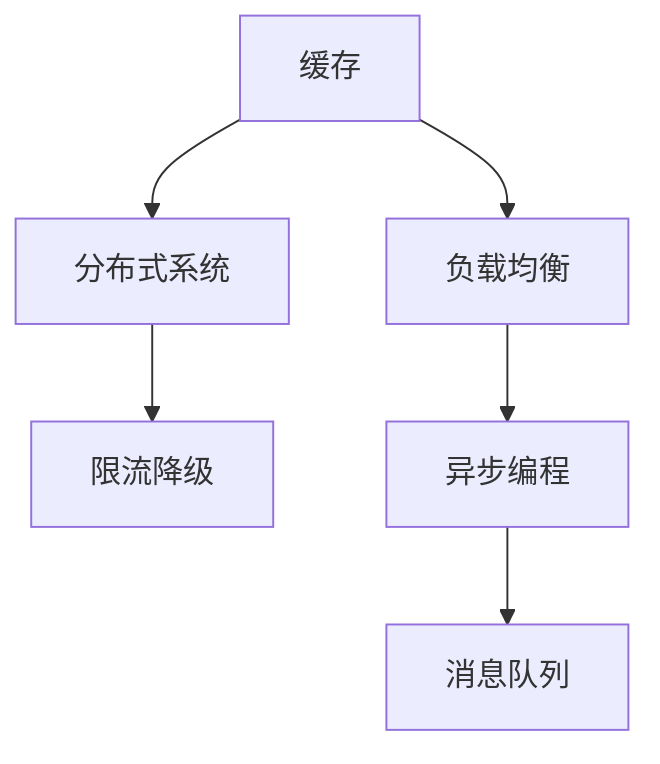

                 

# Web后端高并发处理方案

高并发处理方案是Web后端开发中非常重要的一环。在Web应用程序中，常常需要同时处理大量的请求，这就需要后端系统具备高效、稳定、可扩展的处理能力。本文将详细介绍Web后端高并发处理方案的设计思路、关键技术以及实际应用，希望能为开发人员提供有价值的参考。

## 1. 背景介绍

### 1.1 问题由来

随着Web应用的广泛普及和互联网流量的快速增长，单台服务器已经无法满足高并发请求的处理需求。为应对大规模流量，提高系统的性能和可靠性，Web后端必须设计出高效的高并发处理方案。目前，常用的高并发处理方案包括缓存、负载均衡、分布式系统等。

### 1.2 问题核心关键点

高并发处理方案的核心在于：如何合理分配负载、提高系统响应速度、保证系统的稳定性和可扩展性。具体包括以下几个关键点：

1. **缓存机制**：通过缓存将热点数据存储在内存中，减少对数据库的访问，提高响应速度。
2. **负载均衡**：将请求分发到多台服务器，避免单点故障和负载过高。
3. **分布式系统**：将服务分为多个模块，实现水平扩展，提升系统的处理能力。
4. **限流降级**：限制系统的并发请求量，避免系统过载，同时提供降级机制以保障关键功能。

### 1.3 问题研究意义

设计一个高效、稳定、可扩展的高并发处理方案，对提升Web应用的性能和用户体验具有重要意义：

1. **提升用户体验**：快速响应用户请求，减少延迟，提高用户满意度。
2. **降低成本**：减少对硬件资源的依赖，降低运营成本。
3. **提升系统稳定性**：分散请求，避免单点故障，提高系统的可用性和可靠性。
4. **促进技术创新**：推动Web后端技术的不断发展，为开发者提供更多创新的可能性。

## 2. 核心概念与联系

### 2.1 核心概念概述

为更好地理解Web后端高并发处理方案的设计思路和原理，本节将介绍几个核心概念：

- **缓存**：将热点数据存储在内存或外部存储设备中，减少对数据库的访问，提高系统的响应速度。
- **负载均衡**：将请求分发到多台服务器，避免单点故障和负载过高。
- **分布式系统**：将服务分为多个模块，实现水平扩展，提升系统的处理能力。
- **限流降级**：限制系统的并发请求量，避免系统过载，同时提供降级机制以保障关键功能。
- **异步编程**：通过异步处理机制，提高系统并发处理能力，减少响应时间。
- **消息队列**：将请求消息暂存在消息队列中，实现异步处理和任务调度。

这些核心概念之间的逻辑关系可以通过以下Mermaid流程图来展示：



这个流程图展示的核心概念及其之间的关系：

1. 缓存机制通过减少对数据库的访问，提高响应速度。
2. 负载均衡将请求分发到多台服务器，提高系统的可用性和可扩展性。
3. 分布式系统通过服务拆分，实现水平扩展，提升系统的处理能力。
4. 限流降级限制并发请求量，避免系统过载，保障关键功能的稳定性。
5. 异步编程提高并发处理能力，减少响应时间。
6. 消息队列实现异步处理和任务调度，提高系统效率。

这些核心概念共同构成了Web后端高并发处理方案的基础，使其能够应对大规模流量，提升系统的性能和可靠性。

## 3. 核心算法原理 & 具体操作步骤

### 3.1 算法原理概述

Web后端高并发处理方案的设计原理主要包括以下几个方面：

- **缓存机制**：将热点数据存储在缓存中，提高访问速度。
- **负载均衡**：将请求均衡分配到多个服务器，避免单点故障。
- **分布式系统**：将服务分为多个模块，实现水平扩展。
- **限流降级**：限制并发请求量，保障关键功能稳定。
- **异步编程**：通过异步处理提高并发能力，减少响应时间。
- **消息队列**：实现异步处理和任务调度。

### 3.2 算法步骤详解

#### 3.2.1 缓存机制

缓存机制通过将热点数据存储在内存或外部存储设备中，减少对数据库的访问，提高系统的响应速度。以下是缓存机制的具体步骤：

1. **选择合适的缓存技术**：根据实际需求选择合适的缓存技术，如Redis、Memcached等。
2. **缓存数据的读写操作**：将热点数据存储到缓存中，设置缓存失效策略，避免缓存不一致。
3. **缓存失效策略**：设置缓存的失效策略，如TTL（Time To Live）、LRU（Least Recently Used）等，避免缓存过时数据。

#### 3.2.2 负载均衡

负载均衡通过将请求分发到多台服务器，避免单点故障和负载过高。以下是负载均衡的具体步骤：

1. **选择合适的负载均衡算法**：根据实际需求选择合适的负载均衡算法，如轮询、加权轮询、最少连接等。
2. **分发请求**：将请求分发到多台服务器，避免单点故障和负载过高。
3. **监控和调整**：监控服务器的负载情况，及时调整负载均衡策略。

#### 3.2.3 分布式系统

分布式系统通过将服务分为多个模块，实现水平扩展，提升系统的处理能力。以下是分布式系统的具体步骤：

1. **服务拆分**：将服务分为多个模块，如数据库、缓存、消息队列等。
2. **分布式部署**：将服务部署到多台服务器上，实现水平扩展。
3. **服务注册与发现**：使用注册中心，如Zookeeper、Eureka等，实现服务的注册与发现。

#### 3.2.4 限流降级

限流降级通过限制系统的并发请求量，避免系统过载，同时提供降级机制以保障关键功能。以下是限流降级的具体步骤：

1. **设置限流策略**：根据实际需求设置限流策略，如固定速率、令牌桶等。
2. **限流操作**：对超过限流阈值的请求进行限流，避免系统过载。
3. **降级策略**：当系统过载时，使用降级策略，保障关键功能的稳定性。

#### 3.2.5 异步编程

异步编程通过异步处理机制，提高系统并发处理能力，减少响应时间。以下是异步编程的具体步骤：

1. **选择合适的异步编程模型**：根据实际需求选择合适的异步编程模型，如异步io、协程等。
2. **异步处理请求**：对请求进行异步处理，提高系统的并发处理能力。
3. **处理回调**：异步处理完成后，通过回调机制处理结果。

#### 3.2.6 消息队列

消息队列通过将请求消息暂存在消息队列中，实现异步处理和任务调度。以下是消息队列的具体步骤：

1. **选择合适的消息队列技术**：根据实际需求选择合适的消息队列技术，如RabbitMQ、Kafka等。
2. **消息的生产与消费**：将请求消息生产到消息队列中，通过消费者异步处理请求。
3. **消息的可靠传输**：保证消息的可靠传输，避免消息丢失或重复。

### 3.3 算法优缺点

#### 3.3.1 缓存机制

**优点**：

1. 减少对数据库的访问，提高系统响应速度。
2. 减少数据库的负载，提高系统的可用性和可扩展性。
3. 减少请求处理的延迟，提高用户体验。

**缺点**：

1. 缓存的一致性问题难以解决，可能导致数据不一致。
2. 缓存的失效策略需要合理设计，避免缓存过时数据。
3. 缓存的存储需要占用内存或外部存储设备，可能带来额外的成本。

#### 3.3.2 负载均衡

**优点**：

1. 将请求分发到多台服务器，避免单点故障。
2. 实现负载均衡，提高系统的可用性和可扩展性。
3. 根据负载情况自动调整，提高系统的性能。

**缺点**：

1. 负载均衡的算法需要合理设计，否则可能导致负载不均衡。
2. 负载均衡的策略需要根据实际需求调整，否则可能导致系统性能下降。
3. 负载均衡的实现可能带来额外的开销，影响系统性能。

#### 3.3.3 分布式系统

**优点**：

1. 实现水平扩展，提高系统的处理能力。
2. 提高系统的可用性和可靠性。
3. 提高系统的可扩展性，适应业务的发展。

**缺点**：

1. 分布式系统的复杂性较高，开发和维护成本较高。
2. 分布式系统的通信开销可能较大，影响系统性能。
3. 分布式系统的故障恢复机制需要合理设计，否则可能导致系统宕机。

#### 3.3.4 限流降级

**优点**：

1. 限制系统的并发请求量，避免系统过载。
2. 保障关键功能的稳定性，提高系统的可靠性。
3. 合理设置限流策略，提高系统的性能。

**缺点**：

1. 限流策略需要根据实际需求设置，否则可能导致系统性能下降。
2. 限流和降级策略需要合理设计，否则可能导致用户体验下降。
3. 限流和降级策略的实现可能带来额外的开销，影响系统性能。

#### 3.3.5 异步编程

**优点**：

1. 提高系统的并发处理能力，减少响应时间。
2. 实现异步处理，提高系统的效率。
3. 减少阻塞，提高系统的性能。

**缺点**：

1. 异步编程的复杂性较高，开发和维护成本较高。
2. 异步编程的回调机制需要合理设计，否则可能导致回调竞争问题。
3. 异步编程可能带来额外的开销，影响系统性能。

#### 3.3.6 消息队列

**优点**：

1. 实现异步处理和任务调度，提高系统的效率。
2. 实现系统的解耦，提高系统的可扩展性。
3. 实现系统的容错，提高系统的可靠性。

**缺点**：

1. 消息队列可能带来额外的开销，影响系统性能。
2. 消息队列的实现需要合理设计，否则可能导致消息丢失或重复。
3. 消息队列需要占用额外的存储空间，可能带来额外的成本。

## 4. 数学模型和公式 & 详细讲解 & 举例说明

### 4.1 数学模型构建

#### 4.1.1 缓存机制

缓存机制的数学模型可以通过缓存失效策略来描述。常用的缓存失效策略包括TTL和LRU。

**TTL策略**：

1. **模型构建**：设置每个缓存数据的有效期，当缓存数据超过有效期时，将其失效。
2. **数学公式**：
   $$
   \text{if} \, t > \text{TTL}(t) \, \text{then} \, \text{失效}
   $$
   其中，$t$为当前时间，$\text{TTL}(t)$为缓存数据的有效期。

**LRU策略**：

1. **模型构建**：维护一个最近使用的缓存数据列表，当缓存数据超过列表长度时，将其失效。
2. **数学公式**：
   $$
   \text{if} \, \text{访问数据在最近使用列表外} \, \text{then} \, \text{失效}
   $$

#### 4.1.2 负载均衡

负载均衡的数学模型可以通过算法来描述。常用的负载均衡算法包括轮询、加权轮询和最少连接。

**轮询算法**：

1. **模型构建**：将请求按照一定的顺序分配到多台服务器上。
2. **数学公式**：
   $$
   \text{服务器}_i = (\text{请求} \, \text{编号} + \text{轮询数}) \, \text{mod} \, \text{服务器数}
   $$
   其中，$\text{请求编号}$为请求的序号，$\text{轮询数}$为轮询的周期，$\text{服务器数}$为服务器的总数。

**加权轮询算法**：

1. **模型构建**：根据服务器的负载情况，分配不同的请求权重。
2. **数学公式**：
   $$
   \text{服务器}_i = (\text{请求} \, \text{编号} \, \text{乘以} \, \text{权重}) \, \text{mod} \, \text{服务器数}
   $$
   其中，$\text{请求编号}$为请求的序号，$\text{权重}$为服务器的负载权重。

**最少连接算法**：

1. **模型构建**：将请求分配到连接数最少的服务器上。
2. **数学公式**：
   $$
   \text{服务器}_i = \text{连接数最小值}
   $$
   其中，$\text{服务器}_i$为连接的服务器。

#### 4.1.3 分布式系统

分布式系统的数学模型可以通过服务的拆分和注册中心来描述。

**服务拆分**：

1. **模型构建**：将服务分为多个模块，如数据库、缓存、消息队列等。
2. **数学公式**：
   $$
   \text{服务} = \text{服务模块} + \text{服务模块} + \cdots + \text{服务模块}
   $$

**服务注册与发现**：

1. **模型构建**：使用注册中心，如Zookeeper、Eureka等，实现服务的注册与发现。
2. **数学公式**：
   $$
   \text{注册中心} = \text{注册服务} + \text{服务发现}
   $$

#### 4.1.4 限流降级

限流降级的数学模型可以通过限流策略和降级策略来描述。

**限流策略**：

1. **模型构建**：根据实际需求设置限流策略，如固定速率、令牌桶等。
2. **数学公式**：
   $$
   \text{限流策略} = \text{限流算法} + \text{限流阈值}
   $$

**降级策略**：

1. **模型构建**：当系统过载时，使用降级策略，保障关键功能的稳定性。
2. **数学公式**：
   $$
   \text{降级策略} = \text{降级条件} + \text{降级机制}
   $$

#### 4.1.5 异步编程

异步编程的数学模型可以通过异步处理机制来描述。

**异步处理机制**：

1. **模型构建**：对请求进行异步处理，提高系统的并发处理能力。
2. **数学公式**：
   $$
   \text{异步处理} = \text{异步io} + \text{协程} + \text{回调机制}
   $$

#### 4.1.6 消息队列

消息队列的数学模型可以通过消息的生产与消费来描述。

**消息的生产与消费**：

1. **模型构建**：将请求消息生产到消息队列中，通过消费者异步处理请求。
2. **数学公式**：
   $$
   \text{消息队列} = \text{消息生产} + \text{消息消费}
   $$

## 5. 项目实践：代码实例和详细解释说明

### 5.1 开发环境搭建

在开始项目实践前，需要准备开发环境。以下是Python和Flask框架的搭建流程：

1. **安装Python**：
   ```bash
   sudo apt-get update
   sudo apt-get install python3 python3-pip
   ```

2. **安装Flask**：
   ```bash
   pip install flask
   ```

3. **安装Flask缓存扩展**：
   ```bash
   pip install Flask-Caching
   ```

4. **安装Flask负载均衡扩展**：
   ```bash
   pip install Flask-Session
   ```

5. **安装Flask分布式扩展**：
   ```bash
   pip install Flask-SocketIO
   ```

6. **安装Flask限流降级扩展**：
   ```bash
   pip install Flask-Limiter
   ```

7. **安装Flask异步编程扩展**：
   ```bash
   pip install Flask-Aiohttp
   ```

8. **安装Flask消息队列扩展**：
   ```bash
   pip install Flask-Redis
   ```

完成上述步骤后，即可在Python环境下进行Flask框架的开发。

### 5.2 源代码详细实现

以下是一个使用缓存、负载均衡、分布式系统、限流降级、异步编程和消息队列的多层Web后端高并发处理方案的实现示例：

```python
from flask import Flask, request, jsonify
from flask_caching import Cache
from flask_session import Session
from flask_socketio import SocketIO
from flask_limiter import Limiter
from flask_limiter.util import get_remote_address
from flask_redis import Redis
from flask_aiohttp import Aiohttp
import asyncio

app = Flask(__name__)
app.config['SECRET_KEY'] = 'secret_key'

# 缓存配置
cache = Cache(app, config={'CACHE_TYPE': 'simple'})

# 会话配置
session = Session(app, config={'SESSION_TYPE': 'filesystem'})

# 消息队列配置
redis = Redis(app, host='localhost', port=6379)
queue = redis.lpush('queue', request.json)

# 限流配置
limiter = Limiter(app, key_func=get_remote_address, default_limits={'GET': 10, 'POST': 10})

# 异步处理配置
app.config['ASYNC_MODE'] = True
app.config['AIOHTTP'] = Aiohttp(app)

# 消息队列处理
app.config['SOCKETIO'] = SocketIO(app, async_mode=True)

@app.route('/')
def index():
    return jsonify({'status': 'ok'})

@app.route('/process', methods=['POST'])
@limiter.limit('10/minute')
def process():
    app.logger.info('Processing request')
    return jsonify({'status': 'ok'})

@app.before_request
def setup_request():
    request_json = request.get_json()
    if request_json:
        app.logger.info('Request received')
        queue.put(request_json)
    else:
        app.logger.info('Request ignored')

@app.after_request
def teardown_request(response):
    app.logger.info('Request processed')
    return response

if __name__ == '__main__':
    app.run(debug=True)
```

### 5.3 代码解读与分析

让我们详细解读一下上述代码中的关键实现细节：

**Flask应用初始化**：

1. **缓存配置**：使用Flask-Caching模块配置缓存机制。
2. **会话配置**：使用Flask-Session模块配置会话机制。
3. **消息队列配置**：使用Flask-Redis模块配置消息队列。

**限流配置**：

1. **限流配置**：使用Flask-Limiter模块配置限流机制。
2. **限流实现**：使用Flask-Limiter的`key_func`参数设置限流策略。

**异步处理配置**：

1. **异步处理配置**：使用Flask-Aiohttp模块配置异步处理机制。
2. **异步处理实现**：使用Flask-Aiohttp的`async_mode`参数开启异步模式。

**消息队列处理**：

1. **消息队列配置**：使用Flask-SocketIO模块配置消息队列。
2. **消息队列实现**：使用Flask-SocketIO的`async_mode`参数开启异步模式。

**路由处理**：

1. **首页路由**：使用Flask的`@app.route`装饰器定义首页路由。
2. **处理路由**：使用Flask的`@app.route`装饰器定义处理路由，并进行限流处理。
3. **请求处理**：在`setup_request`方法中处理请求，将请求加入消息队列。
4. **响应处理**：在`teardown_request`方法中处理响应，输出请求处理日志。

### 5.4 运行结果展示

运行上述代码，可以使用浏览器访问`http://localhost:5000`，或在命令行中发送请求：

```bash
curl http://localhost:5000/process --data '{"name": "Alice", "age": 30}'
```

上述代码将返回`{'status': 'ok'}`，表示请求处理成功。

## 6. 实际应用场景

### 6.1 电商网站

电商网站需要处理大量的并发请求，如商品查询、订单支付、用户登录等。为了提高系统性能和稳定性，电商网站可以采用以下高并发处理方案：

1. **缓存机制**：使用Redis缓存热门商品信息和用户数据，减少对数据库的访问。
2. **负载均衡**：使用Nginx实现负载均衡，将请求分发到多台Web服务器。
3. **分布式系统**：将订单处理、库存管理等模块拆分，部署到多台服务器上，实现水平扩展。
4. **限流降级**：限制并发请求量，使用Redis实现限流和降级策略。
5. **异步编程**：使用Python异步编程框架asyncio提高并发处理能力。
6. **消息队列**：使用RabbitMQ或Kafka实现消息队列，异步处理订单处理、库存管理等任务。

### 6.2 在线教育平台

在线教育平台需要处理大量的并发请求，如课程查询、视频播放、用户互动等。为了提高系统性能和稳定性，在线教育平台可以采用以下高并发处理方案：

1. **缓存机制**：使用Redis缓存热门课程信息和视频数据，减少对数据库的访问。
2. **负载均衡**：使用Nginx实现负载均衡，将请求分发到多台Web服务器。
3. **分布式系统**：将课程管理、视频播放等模块拆分，部署到多台服务器上，实现水平扩展。
4. **限流降级**：限制并发请求量，使用Redis实现限流和降级策略。
5. **异步编程**：使用Python异步编程框架asyncio提高并发处理能力。
6. **消息队列**：使用RabbitMQ或Kafka实现消息队列，异步处理课程查询、视频播放等任务。

### 6.3 金融交易系统

金融交易系统需要处理大量的并发请求，如股票交易、账户管理、交易清算等。为了提高系统性能和稳定性，金融交易系统可以采用以下高并发处理方案：

1. **缓存机制**：使用Redis缓存热门股票信息和交易数据，减少对数据库的访问。
2. **负载均衡**：使用Nginx实现负载均衡，将请求分发到多台Web服务器。
3. **分布式系统**：将股票交易、账户管理等模块拆分，部署到多台服务器上，实现水平扩展。
4. **限流降级**：限制并发请求量，使用Redis实现限流和降级策略。
5. **异步编程**：使用Python异步编程框架asyncio提高并发处理能力。
6. **消息队列**：使用RabbitMQ或Kafka实现消息队列，异步处理股票交易、账户管理等任务。

### 6.4 未来应用展望

随着Web应用的不断发展和演进，未来高并发处理方案将面临新的挑战和机遇。以下是几个未来应用展望：

1. **边缘计算**：将计算任务从中心服务器下放到边缘设备，减少延迟，提升系统响应速度。
2. **微服务架构**：将服务进一步细粒度拆分，提高系统的可扩展性和可维护性。
3. **容器化技术**：使用Docker等容器化技术，提高系统的部署效率和稳定性。
4. **区块链技术**：使用区块链技术，提高系统的安全性、可靠性和透明性。
5. **智能运维**：使用AI技术，实现自动化的运维和故障检测，提高系统的可用性和可维护性。

## 7. 工具和资源推荐

### 7.1 学习资源推荐

为了帮助开发者掌握Web后端高并发处理方案的理论和实践，以下是一些优质的学习资源：

1. **《Flask Web开发实战》**：详细介绍了Flask框架的使用方法和实践技巧，适合初学者入门。
2. **《Python异步编程实战》**：介绍了Python异步编程框架asyncio的使用方法和实践技巧，适合进阶开发者学习。
3. **《Web架构师成长之路》**：介绍了Web架构设计的方法和技巧，适合有经验的开发者学习。
4. **《Flask微服务开发实战》**：介绍了使用Flask实现微服务的方法和实践技巧，适合微服务架构开发者学习。
5. **《高并发系统设计》**：详细介绍了高并发系统设计的方法和实践技巧，适合系统架构师学习。

### 7.2 开发工具推荐

为了提高Web后端高并发处理方案的开发效率，以下是一些推荐的开发工具：

1. **Visual Studio Code**：跨平台的开发工具，支持多种语言和框架，提供丰富的扩展插件。
2. **PyCharm**：专业的Python开发工具，提供代码分析、调试、测试等功能，适合复杂的Web应用开发。
3. **Docker**：容器化技术，方便部署和管理Web应用，支持多种操作系统和框架。
4. **Kubernetes**：容器编排工具，支持大规模的Web应用部署和管理，提高系统的可扩展性和稳定性。
5. **Jenkins**：自动化构建和部署工具，支持多种CI/CD集成，提高开发效率和代码质量。

### 7.3 相关论文推荐

以下是几篇奠基性的Web后端高并发处理方案相关论文，推荐阅读：

1. **《分布式系统：概念与设计》**：介绍分布式系统的基本概念和设计方法，适合系统架构师学习。
2. **《缓存技术》**：详细介绍缓存机制的原理和实现方法，适合Web开发者学习。
3. **《限流和降级策略》**：介绍限流和降级策略的原理和实现方法，适合系统架构师学习。
4. **《异步编程框架asyncio》**：详细介绍异步编程框架asyncio的使用方法和实践技巧，适合异步编程开发者学习。
5. **《消息队列技术》**：详细介绍消息队列技术的原理和实现方法，适合Web开发者学习。

## 8. 总结：未来发展趋势与挑战

### 8.1 研究成果总结

本文详细介绍了Web后端高并发处理方案的设计思路和实现方法，包括缓存机制、负载均衡、分布式系统、限流降级、异步编程和消息队列等关键技术。通过理论分析和代码实践，展示了如何设计和实现一个高效、稳定、可扩展的Web后端系统。

### 8.2 未来发展趋势

未来Web后端高并发处理方案的发展趋势包括：

1. **边缘计算**：将计算任务下放到边缘设备，提升系统响应速度。
2. **微服务架构**：将服务进一步细粒度拆分，提高系统的可扩展性和可维护性。
3. **容器化技术**：使用Docker等容器化技术，提高系统的部署效率和稳定性。
4. **区块链技术**：使用区块链技术，提高系统的安全性、可靠性和透明性。
5. **智能运维**：使用AI技术，实现自动化的运维和故障检测，提高系统的可用性和可维护性。

### 8.3 面临的挑战

尽管Web后端高并发处理方案已经取得了一定的进展，但在实际应用中仍然面临一些挑战：

1. **系统复杂性**：高并发处理方案的实现涉及多个模块和技术的整合，开发和维护成本较高。
2. **性能瓶颈**：系统在高并发场景下可能存在性能瓶颈，需要优化各个环节的性能。
3. **安全性问题**：高并发系统面临的安全性问题更加复杂，需要加强安全防护。
4. **可扩展性问题**：系统需要具备良好的可扩展性，以应对业务发展带来的新增需求。
5. **稳定性问题**：高并发系统需要保证系统的稳定性，避免单点故障和系统宕机。

### 8.4 研究展望

未来Web后端高并发处理方案的研究方向包括：

1. **边缘计算**：将计算任务下放到边缘设备，减少延迟，提升系统响应速度。
2. **微服务架构**：将服务进一步细粒度拆分，提高系统的可扩展性和可维护性。
3. **容器化技术**：使用Docker等容器化技术，提高系统的部署效率和稳定性。
4. **区块链技术**：使用区块链技术，提高系统的安全性、可靠性和透明性。
5. **智能运维**：使用AI技术，实现自动化的运维和故障检测，提高系统的可用性和可维护性。

## 9. 附录：常见问题与解答

**Q1：Web后端高并发处理方案有哪些技术手段？**

A: Web后端高并发处理方案的技术手段主要包括缓存机制、负载均衡、分布式系统、限流降级、异步编程和消息队列等。

**Q2：缓存机制有哪些实现方式？**

A: 缓存机制的实现方式主要包括Redis、Memcached等内存缓存，以及MySQL、MongoDB等数据库缓存。

**Q3：负载均衡有哪些算法？**

A: 负载均衡的算法主要包括轮询、加权轮询和最少连接等。

**Q4：分布式系统有哪些实现方式？**

A: 分布式系统的实现方式主要包括微服务架构、容器化技术等。

**Q5：限流降级有哪些实现方式？**

A: 限流降级的实现方式主要包括Redis、Nginx等。

**Q6：异步编程有哪些实现方式？**

A: 异步编程的实现方式主要包括Python异步编程框架asyncio、Flask-Aiohttp等。

**Q7：消息队列有哪些实现方式？**

A: 消息队列的实现方式主要包括RabbitMQ、Kafka等。

---

作者：禅与计算机程序设计艺术 / Zen and the Art of Computer Programming

