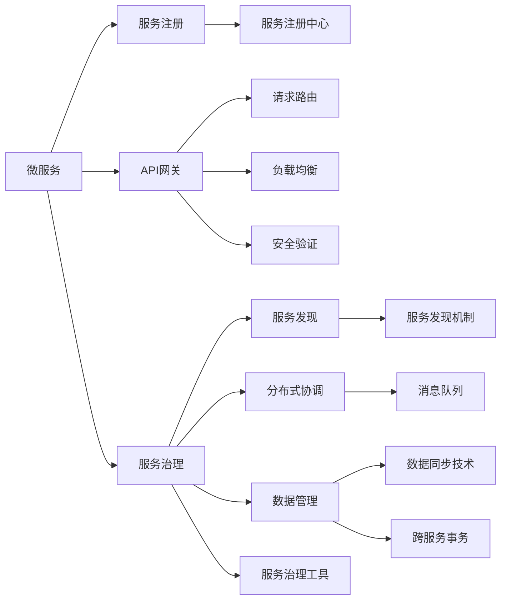

                 

# Web架构设计：从单体到微服务

## 1. 背景介绍

### 1.1 问题由来

随着互联网和Web技术的快速发展，Web应用的需求和复杂度不断提升，传统的单体架构逐渐难以满足需求。单体架构（Monolithic Architecture）指的是将应用程序的所有模块都打包在同一个可执行程序中，这种方式虽然简单直接，但随着项目规模的增长，单体架构带来的诸多问题逐渐显现：

- **维护困难**：单体架构难以划分职责，修改一个模块可能会影响整个系统。
- **扩展困难**：随着用户和功能的增加，单体应用难以横向扩展，必须进行垂直扩展，导致服务器负载过重。
- **技术债务**：为了满足需求，不断添加新的功能，单体架构的技术债务积累越来越严重。
- **测试复杂**：单体架构的测试难度大，依赖关系复杂，测试覆盖面难以保障。

面对这些问题，微服务架构（Microservices Architecture）应运而生，逐渐成为Web应用架构设计的标准选择。

### 1.2 问题核心关键点

微服务架构是一种将大型应用拆分成多个小型服务的方式，每个服务独立部署，运行在不同的进程中。微服务架构的核心目标在于提高系统的可维护性、可扩展性和灵活性。

- **独立部署**：每个微服务独立部署，便于单独维护和升级。
- **细粒度服务**：服务粒度细化，根据业务功能划分服务，提高系统灵活性。
- **服务通信**：各微服务通过API或消息队列进行通信，提高系统解耦性。
- **持续集成**：每个微服务独立开发，通过CI/CD进行持续集成和自动化部署。

微服务架构的优点显而易见，但也存在一些挑战：

- **系统复杂度**：微服务数量众多，系统复杂度增加。
- **分布式协调**：服务间通信依赖网络，分布式环境下的协调和故障处理复杂。
- **数据一致性**：服务间的数据一致性问题难以解决，分布式事务管理复杂。

### 1.3 问题研究意义

微服务架构作为Web应用架构设计的趋势，对于提升Web应用的性能、可维护性和可扩展性具有重要意义：

1. **性能提升**：通过横向扩展微服务，提高系统处理能力和并发能力。
2. **快速迭代**：独立部署的微服务可以快速迭代和部署，提高系统灵活性。
3. **团队协作**：微服务架构将复杂系统分解为多个小型服务，每个服务由独立团队维护，便于协作。
4. **故障隔离**：微服务架构通过服务间的隔离机制，减少服务故障对整个系统的影响。
5. **技术栈灵活性**：每个微服务可以选择合适的技术栈，提高系统开发效率。

## 2. 核心概念与联系

### 2.1 核心概念概述

为更好地理解微服务架构，本节将介绍几个密切相关的核心概念：

- **微服务（Microservice）**：指将大型应用拆分为多个小型服务的方式。每个微服务负责特定功能，独立部署，运行在不同的进程中。
- **服务治理（Service Governance）**：指管理和监控微服务，确保其稳定运行和高效协作。包括服务注册、发现、调用、监控等。
- **服务注册（Service Registry）**：记录和管理所有服务的注册信息，支持服务发现。
- **API网关（API Gateway）**：充当所有微服务之间的代理，提供统一的入口和负载均衡，保护内部服务不受外部攻击。
- **数据管理（Data Management）**：包括数据分片、数据同步、跨服务事务管理等，确保数据一致性和完整性。
- **分布式协调（Distributed Coordination）**：通过消息队列、分布式事务等机制，确保微服务之间的协作和故障恢复。

这些核心概念之间的逻辑关系可以通过以下Mermaid流程图来展示：



这个流程图展示了许多微服务架构的关键组成部分，以及它们之间的联系和协作关系。

## 3. 核心算法原理 & 具体操作步骤
### 3.1 算法原理概述

微服务架构的核心原理是独立部署、细粒度服务和分布式通信。微服务的构建、部署和运维过程与单体应用有所不同，需要考虑更多的因素。

- **构建过程**：将应用模块拆分为多个独立的服务，每个服务独立开发、测试和部署。
- **部署过程**：每个微服务独立部署，运行在不同的进程中。
- **通信过程**：微服务之间通过API网关或消息队列进行通信，保持松耦合关系。
- **监控过程**：通过日志、监控工具对每个微服务进行独立监控，及时发现和解决问题。

### 3.2 算法步骤详解

微服务的构建和部署过程主要包括以下几个步骤：

**Step 1: 服务拆分**
- 根据业务功能划分服务模块，每个服务负责特定功能。
- 定义服务接口，确定服务之间的通信协议。
- 确定服务的边界和职责，避免服务之间的耦合。

**Step 2: 服务开发**
- 每个服务独立开发，遵循统一的开发规范和标准。
- 使用合适的技术栈进行开发，提高开发效率。
- 进行单元测试和集成测试，保证服务质量。

**Step 3: 服务部署**
- 每个服务独立部署，运行在不同的进程中。
- 使用容器化技术（如Docker）进行封装和部署。
- 设置自动部署和监控机制，确保服务稳定运行。

**Step 4: 服务治理**
- 使用服务注册中心（如Consul、Zookeeper）进行服务注册和发现。
- 使用API网关（如Kong、Zuul）进行请求路由和负载均衡。
- 使用服务治理工具（如Spring Cloud）进行服务监控和调用管理。

**Step 5: 分布式协调**
- 使用消息队列（如RabbitMQ、Kafka）进行异步通信。
- 实现跨服务的事务管理，保证数据一致性。
- 处理服务故障和异常，确保系统的稳定性和可靠性。

### 3.3 算法优缺点

微服务架构有以下优点：
1. **可维护性**：独立部署的微服务便于维护和升级。
2. **可扩展性**：服务可以独立扩展，提高系统的处理能力和并发能力。
3. **灵活性**：服务可以根据业务需求独立开发和部署。
4. **技术栈灵活性**：每个服务可以选择合适的技术栈，提高开发效率。

但微服务架构也存在一些缺点：
1. **复杂性增加**：系统复杂度增加，管理和监控难度加大。
2. **通信延迟**：服务间通信依赖网络，可能会带来通信延迟。
3. **数据一致性问题**：跨服务的数据一致性难以保证，分布式事务管理复杂。

### 3.4 算法应用领域

微服务架构广泛适用于各种规模的Web应用，包括：

- **电商平台**：将订单、库存、支付、物流等模块拆分为独立的微服务，实现高并发和高可用。
- **金融系统**：将交易、清算、风控、反欺诈等功能模块独立部署，提高系统的稳定性和安全性。
- **社交网络**：将用户、内容、关系、广告等功能模块独立服务化，支持大规模用户和内容的管理。
- **物流系统**：将订单、仓储、配送、客服等功能模块独立服务化，实现快速响应和高效协作。

## 4. 数学模型和公式 & 详细讲解 & 举例说明（备注：数学公式请使用latex格式，latex嵌入文中独立段落使用 $$，段落内使用 $)
### 4.1 数学模型构建

微服务架构的构建和部署过程可以用数学模型来描述。假设有一个由N个微服务组成的应用，每个服务的服务编号为 $i$（$i \in [1, N]$）。服务之间的调用关系可以用服务调用图表示，其中顶点表示服务，边表示服务调用关系。

定义服务调用的成功率 $p_{ij}$ 为服务 $i$ 调用服务 $j$ 的成功概率。服务调用的延时时间 $t_{ij}$ 为服务 $i$ 调用服务 $j$ 的延迟时间。服务调用的故障率 $\lambda_{ij}$ 为服务 $i$ 调用服务 $j$ 的故障率。

则整个应用的平均响应时间和故障率可以用数学模型表示为：

$$
T = \sum_{i=1}^N \sum_{j=1}^N p_{ij} t_{ij}
$$

$$
F = \sum_{i=1}^N \sum_{j=1}^N p_{ij} \lambda_{ij}
$$

### 4.2 公式推导过程

对于服务调用的成功概率 $p_{ij}$，可以近似认为是服务 $j$ 的可用概率，即 $p_{ij} = 1 - \lambda_{ij}$。将此代入平均响应时间和故障率的公式，得：

$$
T = \sum_{i=1}^N \sum_{j=1}^N (1 - \lambda_{ij}) t_{ij}
$$

$$
F = \sum_{i=1}^N \sum_{j=1}^N (1 - \lambda_{ij}) \lambda_{ij}
$$

进一步简化，得：

$$
T = \sum_{i=1}^N \sum_{j=1}^N t_{ij} - \sum_{i=1}^N \sum_{j=1}^N \lambda_{ij} t_{ij}
$$

$$
F = \sum_{i=1}^N \sum_{j=1}^N \lambda_{ij}
$$

其中 $\sum_{i=1}^N \sum_{j=1}^N t_{ij}$ 表示所有服务间调用延时的总和，$\sum_{i=1}^N \sum_{j=1}^N \lambda_{ij} t_{ij}$ 表示所有服务间调用故障的延时总和，$\sum_{i=1}^N \sum_{j=1}^N \lambda_{ij}$ 表示所有服务间调用故障的概率总和。

### 4.3 案例分析与讲解

假设一个电商平台，将订单、库存、支付、物流等模块拆分为独立的微服务，每个服务单独部署。订单模块（Order Service）调用库存模块（Inventory Service）获取库存信息，调用支付模块（Payment Service）进行支付，调用物流模块（Logistics Service）进行发货。

订单模块调用库存模块的成功概率为 $p_{01} = 0.9$，调用支付模块的成功概率为 $p_{02} = 0.95$，调用物流模块的成功概率为 $p_{03} = 0.98$。订单模块调用库存模块的延时为 $t_{01} = 0.2$ 秒，调用支付模块的延时为 $t_{02} = 0.5$ 秒，调用物流模块的延时为 $t_{03} = 0.3$ 秒。

订单模块调用库存模块的故障率为 $\lambda_{01} = 0.01$，调用支付模块的故障率为 $\lambda_{02} = 0.05$，调用物流模块的故障率为 $\lambda_{03} = 0.02$。

则整个电商平台的平均响应时间为：

$$
T = 0.2 + 0.5 + 0.3 - (0.01 \times 0.2 + 0.05 \times 0.5 + 0.02 \times 0.3)
$$

计算得 $T = 1.1$ 秒。

## 5. 项目实践：代码实例和详细解释说明
### 5.1 开发环境搭建

在进行微服务项目实践前，我们需要准备好开发环境。以下是使用Java Spring Boot开发微服务的步骤：

1. 安装Java JDK：从官网下载并安装Java JDK 11以上版本。
2. 安装Maven：从官网下载并安装Maven 3.8以上版本。
3. 安装Spring Boot：从官网下载并安装Spring Boot 2.4以上版本。
4. 安装Docker：从官网下载并安装Docker Desktop或Docker Engine。
5. 安装Git和GitHub：从官网下载并安装Git和GitHub Desktop。

完成上述步骤后，即可在本地环境中开始微服务项目的开发。

### 5.2 源代码详细实现

下面我们以一个简单的电商订单微服务为例，给出使用Spring Boot进行微服务开发的完整代码实现。

首先，定义订单服务（Order Service）的Spring Boot项目，配置pom.xml文件：

```xml
<dependency>
    <groupId>org.springframework.boot</groupId>
    <artifactId>spring-boot-starter-web</artifactId>
</dependency>
```

然后，定义订单服务（Order Service）的控制器（Controller）和接口（Service）：

```java
@RestController
public class OrderController {

    @Autowired
    private OrderService orderService;

    @GetMapping("/orders")
    public List<Order> getAllOrders() {
        return orderService.getAllOrders();
    }

    @GetMapping("/orders/{id}")
    public Order getOrderById(@PathVariable Long id) {
        return orderService.getOrderById(id);
    }

    @PostMapping("/orders")
    public Order createOrder(@RequestBody Order order) {
        return orderService.createOrder(order);
    }

    @PutMapping("/orders/{id}")
    public Order updateOrder(@PathVariable Long id, @RequestBody Order order) {
        return orderService.updateOrder(id, order);
    }

    @DeleteMapping("/orders/{id}")
    public void deleteOrder(@PathVariable Long id) {
        orderService.deleteOrder(id);
    }
}
```

```java
@Service
public class OrderService {

    @Autowired
    private OrderRepository orderRepository;

    public List<Order> getAllOrders() {
        return orderRepository.findAll();
    }

    public Order getOrderById(Long id) {
        return orderRepository.findById(id).orElse(null);
    }

    public Order createOrder(Order order) {
        return orderRepository.save(order);
    }

    public Order updateOrder(Long id, Order order) {
        Order existingOrder = getOrderById(id);
        if (existingOrder != null) {
            existingOrder.setName(order.getName());
            existingOrder.setAddress(order.getAddress());
            existingOrder.setAmount(order.getAmount());
            orderRepository.save(existingOrder);
        }
        return existingOrder;
    }

    public void deleteOrder(Long id) {
        orderRepository.deleteById(id);
    }
}
```

最后，启动订单服务（Order Service）的Spring Boot应用：

```bash
mvn spring-boot:run
```

### 5.3 代码解读与分析

这里我们重点分析订单服务的代码实现：

**OrderController类**：
- 定义了RESTful风格的API接口，使用Spring Boot的注解定义了不同的HTTP方法。
- 通过@Autowired注解注入OrderService服务，调用其方法实现数据操作。

**OrderService类**：
- 继承Spring Boot的Service接口，使用@Autowired注解注入OrderRepository仓库。
- 实现OrderRepository接口中的方法，通过调用Spring Data JPA提供的CRUD操作实现数据管理。

**Spring Boot和Spring Data JPA**：
- 使用Spring Boot可以快速启动微服务，简化开发过程。
- 使用Spring Data JPA可以方便地进行数据操作，提高开发效率。

## 6. 实际应用场景
### 6.1 智能客服系统

智能客服系统是微服务架构的一个典型应用场景。智能客服系统通过将客服功能拆分为多个独立的服务模块，实现高并发和高可用，提升客户体验。

- **用户管理服务**：负责用户注册、登录、权限管理等。
- **知识库服务**：负责维护知识库，提供问题解答。
- **语音识别服务**：负责语音识别和转文本。
- **自然语言处理服务**：负责文本理解、情感分析、意图识别等。
- **对话生成服务**：负责生成自然流畅的回复。
- **系统监控服务**：负责系统日志、监控、告警等。

智能客服系统通过微服务架构，实现各服务模块的独立部署和扩展，同时通过API网关进行请求路由和负载均衡，确保系统的稳定性和高效性。

### 6.2 金融系统

金融系统是微服务架构的另一个重要应用场景。金融系统通过将交易、清算、风控、反欺诈等功能模块独立服务化，实现高可用和高性能。

- **交易服务**：负责订单处理、交易记录、账户管理等。
- **清算服务**：负责资金清算、账务核对等。
- **风控服务**：负责风险评估、交易监控、反欺诈等。
- **反欺诈服务**：负责欺诈检测、交易验证等。

金融系统通过微服务架构，实现各服务模块的独立部署和扩展，同时通过API网关进行请求路由和负载均衡，确保系统的稳定性和高效性。

### 6.3 电商系统

电商系统也是微服务架构的典型应用场景。电商系统通过将订单、库存、支付、物流等功能模块独立服务化，实现高并发和高可用。

- **订单服务**：负责订单处理、库存管理、支付验证等。
- **库存服务**：负责商品管理、库存统计等。
- **支付服务**：负责支付验证、支付记录等。
- **物流服务**：负责订单跟踪、物流管理等。

电商系统通过微服务架构，实现各服务模块的独立部署和扩展，同时通过API网关进行请求路由和负载均衡，确保系统的稳定性和高效性。

### 6.4 未来应用展望

随着微服务架构的不断发展，其应用场景将进一步拓展，具体展望如下：

1. **物联网应用**：将传感器、设备和应用服务独立服务化，实现设备数据采集、存储、分析等。
2. **区块链应用**：将区块链网络、智能合约、共识机制等独立服务化，实现分布式账本和去中心化应用。
3. **人工智能应用**：将数据预处理、模型训练、推理服务等独立服务化，实现端到端的AI解决方案。
4. **边缘计算应用**：将边缘计算节点、数据处理、设备管理等独立服务化，实现实时数据处理和设备管理。

微服务架构在各种应用场景中展现出强大的生命力，将成为未来Web应用架构设计的标配。

## 7. 工具和资源推荐
### 7.1 学习资源推荐

为了帮助开发者系统掌握微服务架构的理论基础和实践技巧，这里推荐一些优质的学习资源：

1. **《微服务架构:原理与实践》**：介绍微服务架构的基本概念、设计原则、实现技术等，是一本全面的微服务架构指南。
2. **《Spring Cloud微服务框架》**：详细讲解Spring Cloud框架的微服务解决方案，涵盖微服务构建、部署、管理等各个方面。
3. **《Docker实战》**：详细介绍Docker容器技术，讲解容器化微服务的构建和部署。
4. **《Kubernetes实战》**：详细介绍Kubernetes容器编排技术，讲解微服务的自动化部署和运维。
5. **《微服务架构与DevOps》**：讲解微服务架构和DevOps的结合，讲解微服务的持续集成、持续部署等技术。

通过对这些资源的学习实践，相信你一定能够快速掌握微服务架构的理论基础和实践技巧，并用于解决实际的Web应用问题。

### 7.2 开发工具推荐

高效的开发离不开优秀的工具支持。以下是几款用于微服务开发的常用工具：

1. **Spring Boot**：基于Spring框架的快速开发框架，支持微服务架构的快速开发和部署。
2. **Docker**：容器化技术，支持微服务的独立部署和扩展。
3. **Kubernetes**：容器编排技术，支持微服务的自动化部署和运维。
4. **Jenkins**：持续集成工具，支持微服务的自动化测试和部署。
5. **Swagger**：API文档工具，支持微服务的API文档生成和测试。
6. **Kong**：API网关工具，支持微服务的请求路由和负载均衡。

合理利用这些工具，可以显著提升微服务开发和部署的效率，加快创新迭代的步伐。

### 7.3 相关论文推荐

微服务架构的发展源于学界的持续研究。以下是几篇奠基性的相关论文，推荐阅读：

1. **《Microservices: A lightweight, granular software architecture》**：提出微服务架构的概念，阐述其设计原则和实现技术。
2. **《Designing Distributed Systems with Microservices》**：详细讲解微服务架构的设计和实现，涵盖服务拆分、服务通信、服务治理等方面。
3. **《Spring Cloud: Microservices on Cloud Foundry》**：详细讲解Spring Cloud框架的微服务解决方案，涵盖服务构建、部署、管理等各个方面。
4. **《Service Mesh: A Connective Layer for Microservices》**：提出服务网格的概念，讲解服务网格在微服务架构中的应用。
5. **《Docker: The Docker Engine, a platform for distributed computing》**：详细介绍Docker容器技术，讲解容器化微服务的构建和部署。

这些论文代表了大微服务架构的发展脉络。通过学习这些前沿成果，可以帮助研究者把握学科前进方向，激发更多的创新灵感。

## 8. 总结：未来发展趋势与挑战
### 8.1 总结

本文对微服务架构进行了全面系统的介绍。首先阐述了微服务架构的研究背景和意义，明确了微服务在提升系统可维护性、可扩展性和灵活性方面的独特价值。其次，从原理到实践，详细讲解了微服务的构建和部署过程，给出了微服务项目开发的完整代码实例。同时，本文还广泛探讨了微服务架构在智能客服、金融系统、电商系统等诸多行业领域的应用前景，展示了微服务架构的广阔前景。此外，本文精选了微服务架构的学习资源，力求为读者提供全方位的技术指引。

通过本文的系统梳理，可以看到，微服务架构作为Web应用架构设计的趋势，对于提升Web应用的性能、可维护性和可扩展性具有重要意义。未来，伴随微服务架构的不断发展，微服务系统将实现更广泛的应用，成为Web应用架构设计的标配。

### 8.2 未来发展趋势

展望未来，微服务架构将呈现以下几个发展趋势：

1. **持续集成和持续部署（CI/CD）**：微服务架构需要高效的持续集成和持续部署工具，确保快速迭代和高质量交付。
2. **服务网格（Service Mesh）**：通过服务网格，实现微服务之间的高效通信和故障恢复，提高系统的稳定性和可靠性。
3. **云原生技术**：微服务架构需要云原生技术的支持，如Kubernetes容器编排、Docker容器化等，实现弹性扩展和自动化运维。
4. **DevOps文化**：微服务架构需要DevOps文化的支持，实现自动化测试、部署、监控和报警，提升开发效率和系统稳定性。
5. **自动化工具**：微服务架构需要更多的自动化工具，如自动化测试、自动化部署、自动化监控等，提高开发和运维效率。
6. **跨云环境支持**：微服务架构需要支持跨云环境的部署和运维，实现多云环境的无缝切换和高效管理。

以上趋势凸显了微服务架构的广阔前景。这些方向的探索发展，必将进一步提升微服务系统的性能和可维护性，为Web应用的开发和运维带来更多的便捷和灵活性。

### 8.3 面临的挑战

尽管微服务架构已经取得了瞩目成就，但在迈向更加智能化、普适化应用的过程中，它仍面临诸多挑战：

1. **系统复杂度**：微服务数量众多，系统复杂度增加，管理和监控难度加大。
2. **通信延迟**：服务间通信依赖网络，可能会带来通信延迟。
3. **数据一致性问题**：跨服务的数据一致性难以保证，分布式事务管理复杂。
4. **技术栈选择**：不同微服务选择不同的技术栈，增加了技术栈的复杂性。
5. **服务依赖关系**：服务间依赖关系复杂，服务部署和故障排查困难。
6. **安全性和合规性**：微服务架构需要更严格的安全性和合规性管理。

正视微服务架构面临的这些挑战，积极应对并寻求突破，将使微服务架构迈向更高的台阶，为构建高性能、高可靠、高可维护的微服务系统铺平道路。

### 8.4 研究展望

面对微服务架构所面临的挑战，未来的研究需要在以下几个方面寻求新的突破：

1. **分布式事务管理**：研究更高效、更可靠的分布式事务管理方案，确保跨服务的数据一致性。
2. **服务通信优化**：研究更高效、更可靠的服务通信机制，减少服务间通信的延迟。
3. **自动化运维**：研究更高效、更可靠的自动化运维工具，确保微服务系统的稳定性和可靠性。
4. **跨服务数据同步**：研究更高效、更可靠的数据同步机制，确保微服务系统的数据一致性。
5. **服务治理工具**：研究更高效、更可靠的服务治理工具，实现微服务系统的灵活管理和调度。
6. **微服务安全机制**：研究更严格、更可靠的安全机制，确保微服务系统的安全性和合规性。

这些研究方向的探索，必将引领微服务架构技术迈向更高的台阶，为构建高性能、高可靠、高可维护的微服务系统提供强有力的技术支持。面向未来，微服务架构还需要与其他人工智能技术进行更深入的融合，如知识表示、因果推理、强化学习等，多路径协同发力，共同推动Web应用的创新和发展。只有勇于创新、敢于突破，才能不断拓展微服务架构的边界，让微服务架构更好地造福人类社会。

## 9. 附录：常见问题与解答

**Q1：微服务架构是否适用于所有Web应用？**

A: 微服务架构在大多数Web应用上都能取得不错的效果，特别是对于数据量较大、业务复杂的应用。但对于一些特定领域的Web应用，如实时性要求极高的系统，微服务架构可能不太适用。此时可以考虑其他架构设计，如事件驱动架构、CQRS等。

**Q2：微服务架构的通信机制有哪些？**

A: 微服务架构的通信机制主要有以下几种：
1. RESTful API：通过HTTP请求和响应进行通信。
2. gRPC：基于Protocol Buffers协议的高性能通信机制。
3. Apache Kafka：基于消息队列进行异步通信。
4. RabbitMQ：基于消息队列进行异步通信。

**Q3：微服务架构的优点和缺点是什么？**

A: 微服务架构的优点包括：
1. 高并发和高可用性：通过服务拆分，实现负载均衡和高并发处理。
2. 独立部署和扩展：每个服务独立部署，方便扩展和升级。
3. 松耦合关系：通过服务网关和消息队列实现松耦合，减少服务间依赖。
4. 独立开发和测试：每个服务独立开发和测试，提升开发效率和系统质量。

微服务架构的缺点包括：
1. 系统复杂度增加：微服务数量众多，系统复杂度增加。
2. 通信延迟：服务间通信依赖网络，可能会带来通信延迟。
3. 数据一致性问题：跨服务的数据一致性难以保证，分布式事务管理复杂。

**Q4：微服务架构的实现工具有哪些？**

A: 微服务架构的实现工具主要有以下几种：
1. Spring Boot：基于Spring框架的快速开发框架。
2. Docker：容器化技术，支持微服务的独立部署和扩展。
3. Kubernetes：容器编排技术，支持微服务的自动化部署和运维。
4. Jenkins：持续集成工具，支持微服务的自动化测试和部署。
5. Swagger：API文档工具，支持微服务的API文档生成和测试。
6. Kong：API网关工具，支持微服务的请求路由和负载均衡。

合理利用这些工具，可以显著提升微服务开发的效率和质量。

**Q5：微服务架构如何实现负载均衡和故障恢复？**

A: 微服务架构可以通过服务网关和负载均衡器实现负载均衡和故障恢复。负载均衡器（如Nginx、HAProxy等）可以将请求分配到不同的微服务实例，提高系统的并发处理能力。故障恢复机制（如 circuit breaker、retrier等）可以在服务出现故障时，自动降级或重试，确保系统的稳定性和可靠性。

---

作者：禅与计算机程序设计艺术 / Zen and the Art of Computer Programming

