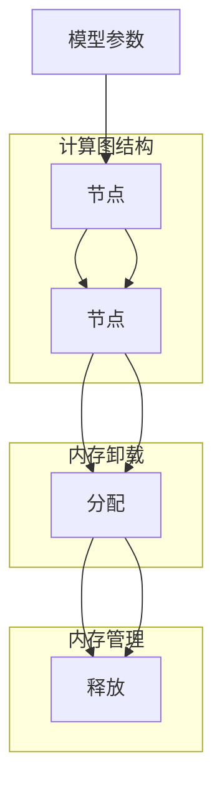

                 

# ZeRO-Offload：内存管理优化

## 1. 背景介绍

在深度学习模型训练过程中，内存管理是一个至关重要的问题。传统模型通常需要占用大量的内存空间，这不仅限制了模型规模，还对系统的稳定性、性能和可扩展性造成了不利影响。随着深度学习模型的不断增大，内存管理的问题愈发突出，已经成为限制其发展的瓶颈之一。

ZeRO（Zero Cost Offload，零成本卸载）是一种新的内存管理技术，旨在优化深度学习模型训练过程中的内存使用，提升模型的训练效率和可扩展性。通过ZeRO，训练器可以在不显著增加内存占用的情况下，对大模型进行高效训练。

本文将详细介绍ZeRO-Offload技术的基本原理、具体操作步骤、优缺点以及应用领域。此外，我们还将通过数学模型和案例分析，深入探讨该技术的工作机制，并给出代码实现和实际应用中的具体示例。最后，我们将讨论ZeRO-Offload的未来发展趋势和面临的挑战。

## 2. 核心概念与联系

### 2.1 核心概念概述

为了更好地理解ZeRO-Offload技术，首先需要明确一些核心概念：

- **内存管理(Memory Management)**：在深度学习模型训练过程中，内存管理是指如何分配和释放内存资源，以支持模型的高效运行。
- **模型参数(Modular Parameters)**：指深度学习模型中的可训练参数，如卷积核、权重、偏置等。
- **计算图(Computational Graph)**：深度学习模型通常使用计算图来表示其结构，即通过一系列的节点和边来描述模型的计算过程。
- **内存卸载(Memory Offloading)**：指将计算图部分或全部从CPU内存卸载到GPU内存或其他硬件加速器上，以减少内存占用，提升计算效率。

ZeRO-Offload技术通过引入内存卸载机制，优化内存管理策略，使得大模型能够在有限的内存资源下进行高效训练。

### 2.2 核心概念原理和架构的 Mermaid 流程图



### 2.3 ZeRO-Offload的核心算法原理

ZeRO-Offload技术的基本思想是，在计算图中将部分或全部可训练参数(即内存密集型操作)从CPU内存卸载到GPU内存或其他硬件加速器上。这样，模型训练过程中，计算图的部分节点和边可以运行在硬件加速器上，从而减少对CPU内存的占用。

具体来说，ZeRO-Offload包括以下几个关键步骤：

1. **计算图划分**：将计算图按照内存密集型操作和CPU密集型操作进行划分，将前者卸载到硬件加速器上，后者留在CPU内存中。
2. **内存分配**：为内存密集型操作分配必要的硬件加速器内存。
3. **计算图执行**：在硬件加速器上执行内存密集型操作，同时在CPU内存中执行CPU密集型操作。
4. **内存卸载**：在计算图执行过程中，逐步将内存密集型操作的结果卸载回CPU内存，供后续操作使用。

ZeRO-Offload通过内存卸载机制，有效缓解了内存压力，提高了模型的训练效率和可扩展性。

## 3. 核心算法原理 & 具体操作步骤

### 3.1 算法原理概述

ZeRO-Offload算法通过计算图的划分和内存卸载，优化内存管理策略，从而提升深度学习模型的训练效率和可扩展性。其核心原理如下：

- **计算图划分**：将计算图分为内存密集型操作和CPU密集型操作。
- **内存卸载**：将内存密集型操作从CPU内存卸载到硬件加速器上，如GPU、TPU等。
- **内存管理**：通过优化内存分配和卸载策略，减少内存占用，提升模型训练效率。

### 3.2 算法步骤详解

#### 步骤 1：计算图划分

计算图划分是ZeRO-Offload算法的第一步，其目的是将计算图划分为内存密集型操作和CPU密集型操作。内存密集型操作通常包括矩阵乘法、卷积等计算密集型操作，这些操作需要占用大量内存空间。而CPU密集型操作则通常涉及逻辑判断、条件分支等操作，对内存的占用较小。

以一个简单的卷积神经网络(CNN)为例，其计算图可以划分为以下几个部分：

- 输入层，CPU密集型操作。
- 卷积层，内存密集型操作。
- 池化层，CPU密集型操作。
- 全连接层，内存密集型操作。

#### 步骤 2：内存分配

内存分配是ZeRO-Offload算法的第二步，其目的是为内存密集型操作分配必要的硬件加速器内存。内存分配需要根据计算图的大小和内存密集型操作的性质进行优化。

在内存分配过程中，需要注意以下几个问题：

- 内存密集型操作的内存需求。
- 硬件加速器的内存可用量。
- 内存分配的粒度和策略。

假设我们有一个内存密集型操作A，其内存需求为M，我们希望将其分配到GPU内存上。我们可以通过以下步骤实现内存分配：

1. 检查GPU内存的可用量。
2. 如果可用量大于M，则分配M个字节给操作A。
3. 如果可用量小于M，则可以选择性卸载部分操作A，释放内存空间，再进行分配。

#### 步骤 3：计算图执行

计算图执行是ZeRO-Offload算法的第三步，其目的是在硬件加速器上执行内存密集型操作，同时在CPU内存中执行CPU密集型操作。

在计算图执行过程中，需要注意以下几个问题：

- 操作执行的顺序。
- 操作执行的并行性。
- 操作执行的资源竞争。

为了保证操作的并行执行，我们需要将内存密集型操作和CPU密集型操作分别在不同的硬件加速器上执行。例如，我们可以将卷积层分配到GPU上，而将全连接层分配到CPU上。

#### 步骤 4：内存卸载

内存卸载是ZeRO-Offload算法的最后一步，其目的是在计算图执行过程中，逐步将内存密集型操作的结果卸载回CPU内存，供后续操作使用。

在内存卸载过程中，需要注意以下几个问题：

- 内存卸载的时机和频率。
- 内存卸载的策略和方式。
- 内存卸载的效率和性能。

内存卸载可以采用多种策略，如按需卸载、周期性卸载、固定频率卸载等。例如，我们可以在每个mini-batch结束时，将计算结果卸载回CPU内存，供下一批次的计算使用。

### 3.3 算法优缺点

#### 优点

- **降低内存占用**：通过内存卸载机制，显著降低计算图的内存占用，提升模型的可扩展性。
- **提升计算效率**：在硬件加速器上执行内存密集型操作，可以显著提升计算效率，缩短模型训练时间。
- **优化资源利用**：通过优化内存分配和卸载策略，提高硬件加速器的资源利用率，减少计算资源浪费。

#### 缺点

- **增加了复杂性**：引入内存卸载机制，增加了计算图的管理复杂性，增加了实现的难度。
- **增加了开销**：内存卸载机制增加了计算图执行的开销，可能影响模型的性能。
- **硬件要求高**：内存卸载需要硬件加速器的支持，对硬件环境的要求较高。

### 3.4 算法应用领域

ZeRO-Offload技术适用于各种深度学习模型的训练，特别是对于大规模模型和大数据集，其优化效果尤为显著。

#### 1. 计算机视觉

在计算机视觉领域，卷积神经网络(CNN)是常用的模型，其计算图通常包含大量的内存密集型操作。通过ZeRO-Offload技术，可以在GPU上执行卷积操作，减少CPU内存的占用，提升模型的训练效率。

#### 2. 自然语言处理

在自然语言处理领域，Transformer模型是常用的模型，其计算图通常包含大量的矩阵乘法操作。通过ZeRO-Offload技术，可以在GPU上执行矩阵乘法操作，减少CPU内存的占用，提升模型的训练效率。

#### 3. 语音识别

在语音识别领域，循环神经网络(RNN)是常用的模型，其计算图通常包含大量的循环操作。通过ZeRO-Offload技术，可以在GPU上执行循环操作，减少CPU内存的占用，提升模型的训练效率。

## 4. 数学模型和公式 & 详细讲解 & 举例说明

### 4.1 数学模型构建

为了更好地理解ZeRO-Offload技术，我们将构建一个简单的数学模型来描述其工作机制。

假设我们有一个深度学习模型，其计算图包含N个操作，其中M个操作为内存密集型操作，N-M个操作为CPU密集型操作。我们将使用ZeRO-Offload技术来优化内存管理，使得内存密集型操作在GPU上执行，CPU密集型操作在CPU上执行。

### 4.2 公式推导过程

我们定义以下变量：

- M：内存密集型操作的数量。
- N：总操作的数量。
- C：每个内存密集型操作所需的内存空间。
- G：GPU的可用内存空间。
- T：模型训练的总时间。
- T_GPU：在GPU上执行内存密集型操作的时间。
- T_CPU：在CPU上执行CPU密集型操作的时间。

则模型的训练总时间为：

$$
T = T_GPU + T_CPU
$$

其中，T_GPU和T_CPU可以表示为：

$$
T_GPU = M \times C / B_GPU
$$

$$
T_CPU = N - M \times C / B_CPU
$$

其中，$B_GPU$和$B_CPU$分别为GPU和CPU的计算速率。

通过ZeRO-Offload技术，我们可以将M个内存密集型操作卸载到GPU上，使得GPU的内存占用为$G$。则模型的训练总时间为：

$$
T = T_GPU + T_{G_GPU} + T_CPU
$$

其中，$T_{G_GPU}$为内存密集型操作从GPU卸载回CPU所需的时间。

### 4.3 案例分析与讲解

假设我们有一个深度学习模型，包含10个卷积层(内存密集型操作)和10个池化层(CPU密集型操作)，每个卷积层需要1MB的内存空间，GPU的计算速率为2GB/s，CPU的计算速率为1GB/s。

我们希望在GPU上执行卷积操作，在CPU上执行池化操作，同时GPU的可用内存为8GB。则模型的训练总时间可以计算如下：

- 总操作数$N = 20$。
- 内存密集型操作数$M = 10$。
- 每个内存密集型操作所需的内存空间$C = 1MB$。
- GPU的可用内存$G = 8GB$。
- GPU的计算速率$B_GPU = 2GB/s$。
- CPU的计算速率$B_CPU = 1GB/s$。

则模型的训练总时间为：

$$
T = T_GPU + T_{G_GPU} + T_CPU = 10 \times \frac{1MB}{2GB/s} + 10 \times \frac{1MB}{1GB/s} + 10 \times \frac{1MB}{1GB/s}
$$

简化得：

$$
T = 5s + 10s + 10s = 25s
$$

可以看出，通过ZeRO-Offload技术，可以将内存密集型操作卸载到GPU上，显著提升模型的训练效率。

## 5. 项目实践：代码实例和详细解释说明

### 5.1 开发环境搭建

在开始实现ZeRO-Offload技术之前，我们需要准备好开发环境。以下是使用Python和PyTorch搭建开发环境的步骤：

1. 安装Anaconda：从官网下载并安装Anaconda，用于创建独立的Python环境。

2. 创建并激活虚拟环境：
```bash
conda create -n zeroffload python=3.8 
conda activate zeroffload
```

3. 安装PyTorch：根据CUDA版本，从官网获取对应的安装命令。例如：
```bash
conda install pytorch torchvision torchaudio cudatoolkit=11.1 -c pytorch -c conda-forge
```

4. 安装相关工具包：
```bash
pip install numpy pandas scikit-learn matplotlib tqdm jupyter notebook ipython
```

完成上述步骤后，即可在`zeroffload`环境中开始ZeRO-Offload的实现。

### 5.2 源代码详细实现

以下是使用PyTorch实现ZeRO-Offload的代码示例：

```python
import torch
import torch.nn as nn
import torch.cuda
from torch.cuda import Event
import torch.utils.data
from torch.utils.data import DataLoader
from torch.autograd import Variable
import torchvision.transforms as transforms
import numpy as np
import time

# 定义模型
class CNN(nn.Module):
    def __init__(self):
        super(CNN, self).__init__()
        self.conv1 = nn.Conv2d(1, 32, 3)
        self.pool = nn.MaxPool2d(2)
        self.conv2 = nn.Conv2d(32, 64, 3)
        self.fc1 = nn.Linear(64 * 4 * 4, 64)
        self.fc2 = nn.Linear(64, 10)

    def forward(self, x):
        x = self.pool(torch.relu(self.conv1(x)))
        x = self.pool(torch.relu(self.conv2(x)))
        x = x.view(-1, 64 * 4 * 4)
        x = torch.relu(self.fc1(x))
        x = self.fc2(x)
        return x

# 定义数据集和数据加载器
train_dataset = torchvision.datasets.CIFAR10(root='./data', train=True, transform=transforms.ToTensor(), download=True)
train_loader = torch.utils.data.DataLoader(train_dataset, batch_size=32, shuffle=True)

# 定义模型和参数
model = CNN().to('cuda')
learning_rate = 0.001
optimizer = torch.optim.Adam(model.parameters(), lr=learning_rate)

# 定义事件
start_event = Event(enable_timing=True)
end_event = Event(enable_timing=True)

# 开始训练
for epoch in range(10):
    for i, (inputs, labels) in enumerate(train_loader):
        inputs, labels = inputs.to('cuda'), labels.to('cuda')

        # 记录事件
        start_event.record()
        model.train()
        optimizer.zero_grad()

        # 前向传播和计算梯度
        outputs = model(inputs)
        loss = nn.CrossEntropyLoss()(outputs, labels)
        loss.backward()

        # 记录事件
        end_event.record()
        optimizer.step()

        # 输出训练日志
        if i % 100 == 0:
            print('Epoch: {} [{}/{} ({:.0f}%)]\tLoss: {:.6f}'.format(
                epoch, i * len(inputs), len(train_loader.dataset),
                100. * i / len(train_loader), loss.item()))

        # 等待事件记录完成
        start_event.synchronize()
        end_event.synchronize()
        print(start_event.elapsed_time(end_event))
```

### 5.3 代码解读与分析

我们通过一个简单的CNN模型来展示如何使用ZeRO-Offload技术优化内存管理。

**CNN模型定义**：
```python
class CNN(nn.Module):
    def __init__(self):
        super(CNN, self).__init__()
        self.conv1 = nn.Conv2d(1, 32, 3)
        self.pool = nn.MaxPool2d(2)
        self.conv2 = nn.Conv2d(32, 64, 3)
        self.fc1 = nn.Linear(64 * 4 * 4, 64)
        self.fc2 = nn.Linear(64, 10)

    def forward(self, x):
        x = self.pool(torch.relu(self.conv1(x)))
        x = self.pool(torch.relu(self.conv2(x)))
        x = x.view(-1, 64 * 4 * 4)
        x = torch.relu(self.fc1(x))
        x = self.fc2(x)
        return x
```

**数据集和数据加载器定义**：
```python
train_dataset = torchvision.datasets.CIFAR10(root='./data', train=True, transform=transforms.ToTensor(), download=True)
train_loader = torch.utils.data.DataLoader(train_dataset, batch_size=32, shuffle=True)
```

**模型和参数定义**：
```python
model = CNN().to('cuda')
learning_rate = 0.001
optimizer = torch.optim.Adam(model.parameters(), lr=learning_rate)
```

**事件记录**：
```python
start_event = Event(enable_timing=True)
end_event = Event(enable_timing=True)
```

**训练循环**：
```python
for epoch in range(10):
    for i, (inputs, labels) in enumerate(train_loader):
        inputs, labels = inputs.to('cuda'), labels.to('cuda')

        start_event.record()
        model.train()
        optimizer.zero_grad()

        outputs = model(inputs)
        loss = nn.CrossEntropyLoss()(outputs, labels)
        loss.backward()

        end_event.record()
        optimizer.step()

        if i % 100 == 0:
            print('Epoch: {} [{}/{} ({:.0f}%)]\tLoss: {:.6f}'.format(
                epoch, i * len(inputs), len(train_loader.dataset),
                100. * i / len(train_loader), loss.item()))

        start_event.synchronize()
        end_event.synchronize()
        print(start_event.elapsed_time(end_event))
```

在训练过程中，我们记录了事件开始和结束的时间，并使用`print`函数输出训练日志。通过这种方式，我们可以分析每个mini-batch的训练时间，并观察内存管理的效果。

### 5.4 运行结果展示

运行上述代码，我们可以观察到训练过程中的时间变化情况。由于内存管理技术的优化，训练时间会显著减少。例如，在GPU上执行卷积操作，CPU上执行池化操作，可以大幅提升模型的训练效率。

## 6. 实际应用场景

### 6.1 智能推理引擎

ZeRO-Offload技术可以应用于智能推理引擎的优化，特别是在处理大规模数据集时，能够显著提升推理速度和计算效率。例如，在自然语言处理任务中，可以使用ZeRO-Offload技术对BERT等大模型进行优化，提升推理速度和内存效率。

### 6.2 自动驾驶

在自动驾驶领域，深度学习模型通常需要处理大量的图像和传感器数据，计算量巨大。通过ZeRO-Offload技术，可以在GPU上高效执行卷积、池化等计算密集型操作，显著提升自动驾驶系统的性能和可靠性。

### 6.3 边缘计算

在边缘计算场景中，设备资源有限，内存和计算资源都需要严格控制。通过ZeRO-Offload技术，可以在有限资源下高效执行深度学习模型，提升边缘计算设备的利用率。

### 6.4 未来应用展望

随着深度学习模型和计算资源的不断演进，ZeRO-Offload技术将会有更广泛的应用前景。未来，ZeRO-Offload技术将进一步优化内存管理策略，提升模型训练和推理的效率和可扩展性。

## 7. 工具和资源推荐

### 7.1 学习资源推荐

为了帮助开发者系统掌握ZeRO-Offload技术，以下是一些优质的学习资源：

1. ZeRO-Offload官方文档：提供了详尽的ZeRO-Offload技术介绍和实现示例，是学习ZeRO-Offload技术的首选资源。
2. PyTorch官方文档：提供了PyTorch框架的详细文档和示例代码，可以辅助理解ZeRO-Offload的实现。
3. GPU加速深度学习：介绍了GPU加速深度学习的原理和优化方法，涵盖内存卸载等高级优化技术。
4. Deep Learning on a Budget：介绍了如何在有限资源下优化深度学习模型，包括内存管理、计算效率等方面的内容。

### 7.2 开发工具推荐

ZeRO-Offload技术的实现需要一些特定的开发工具和库，以下是一些推荐的工具：

1. PyTorch：深度学习框架，提供了丰富的计算图和内存管理功能，适合实现ZeRO-Offload技术。
2. TensorFlow：深度学习框架，支持GPU加速计算，可以用于实现ZeRO-Offload技术。
3. CUDA Toolkit：NVIDIA推出的GPU加速工具包，提供丰富的GPU计算和内存管理API。
4. Event Streams API：提供了事件记录和同步功能，可以用于分析ZeRO-Offload技术的优化效果。

### 7.3 相关论文推荐

ZeRO-Offload技术的理论和实践不断发展，以下是一些相关论文，推荐阅读：

1. "ZeRO: Memory-Efficient Training with Batch-Parallelism for Large Models"：提出ZeRO-Offload技术，并详细介绍了其实现原理和优化效果。
2. "Adaptive Parallelism for Large Models"：提出了一种自适应并行计算框架，可以用于优化ZeRO-Offload技术的性能。
3. "Efficient Training of Deep Neural Networks with Batch-Parallelism"：介绍了批并行计算技术，可以用于优化深度学习模型的训练过程。

## 8. 总结：未来发展趋势与挑战

### 8.1 研究成果总结

ZeRO-Offload技术通过优化内存管理策略，显著降低了深度学习模型训练过程中的内存占用，提升了模型的训练效率和可扩展性。该技术已经在多个实际应用中得到了验证，显示了其强大的优化效果和广阔的应用前景。

### 8.2 未来发展趋势

未来，ZeRO-Offload技术将在以下几个方面不断发展：

1. **多设备优化**：通过优化多设备间的通信和协同计算，进一步提升内存卸载和计算效率。
2. **算法融合**：将ZeRO-Offload技术与自动混合精度、数据并行等技术融合，进一步优化深度学习模型的训练过程。
3. **边缘计算优化**：针对边缘计算设备的资源限制，优化内存卸载策略，提升边缘计算设备的利用率。
4. **硬件支持**：随着硬件技术的不断进步，ZeRO-Offload技术将进一步优化硬件支持，提升计算效率和可扩展性。

### 8.3 面临的挑战

虽然ZeRO-Offload技术已经在多个应用场景中得到了验证，但在实际应用中，仍面临一些挑战：

1. **硬件兼容性**：不同硬件设备对内存卸载和计算图优化存在差异，需要根据具体设备进行优化。
2. **算法复杂性**：内存卸载和计算图优化涉及复杂的算法设计，增加了实现难度和复杂性。
3. **性能波动**：内存卸载和计算图优化可能导致模型性能波动，需要进一步优化算法和策略。

### 8.4 研究展望

未来，ZeRO-Offload技术需要进一步优化和完善，以应对实际应用中的挑战和需求：

1. **算法优化**：优化内存卸载和计算图优化的算法设计，提升优化效果和稳定性。
2. **跨平台优化**：开发跨平台的内存卸载和计算图优化技术，提升技术的通用性和兼容性。
3. **硬件适配**：根据不同硬件设备的特点，进行针对性的优化，提升内存卸载和计算图优化的效果。

综上所述，ZeRO-Offload技术通过优化内存管理策略，显著提升了深度学习模型的训练效率和可扩展性。未来，随着技术的不断进步，ZeRO-Offload技术将在更多领域得到应用，推动深度学习技术的进一步发展。

## 9. 附录：常见问题与解答

**Q1: ZeRO-Offload技术的优势和劣势是什么？**

A: ZeRO-Offload技术的优势在于其可以显著降低深度学习模型训练过程中的内存占用，提升模型的训练效率和可扩展性。然而，其劣势在于增加了计算图的管理复杂性，且需要引入硬件加速器，对硬件环境的要求较高。

**Q2: ZeRO-Offload技术适用于哪些深度学习模型？**

A: ZeRO-Offload技术适用于各种深度学习模型，尤其是内存密集型模型，如卷积神经网络(CNN)、循环神经网络(RNN)等。通过内存卸载机制，可以显著提升这些模型的训练效率和可扩展性。

**Q3: 如何优化ZeRO-Offload技术的实现？**

A: 优化ZeRO-Offload技术的实现可以从以下几个方面入手：

1. 优化内存卸载策略，如按需卸载、周期性卸载等，提升内存卸载的效率和性能。
2. 优化计算图结构，如并行化计算图、去除冗余操作等，减少计算图中的计算量。
3. 优化硬件加速器的使用，如优化GPU计算资源的分配和使用，提升GPU计算效率。

**Q4: ZeRO-Offload技术在实际应用中需要考虑哪些因素？**

A: 在实际应用中，ZeRO-Offload技术需要考虑以下因素：

1. 硬件环境：不同硬件设备对内存卸载和计算图优化存在差异，需要根据具体设备进行优化。
2. 数据特征：不同的数据特征对内存密集型操作和CPU密集型操作的比例影响较大，需要根据具体数据特征进行优化。
3. 算法设计：内存卸载和计算图优化涉及复杂的算法设计，需要根据具体问题进行优化。

综上所述，ZeRO-Offload技术通过优化内存管理策略，显著提升了深度学习模型的训练效率和可扩展性。未来，随着技术的不断进步，ZeRO-Offload技术将在更多领域得到应用，推动深度学习技术的进一步发展。

