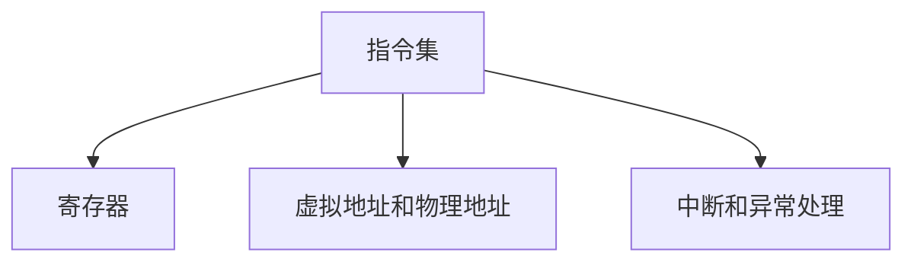

                 

# riscv汇编语言程序设计

## 1. 背景介绍

### 1.1 问题由来
RISC-V（Reduced Instruction Set Computing）是一种高效、灵活的RISC（Reduced Instruction Set Computing）架构，由加州大学戴维斯分校在2010年提出，旨在应对当前处理器架构的局限性。RISC-V架构包括RV32G、RV64G等多种变体，广泛应用于嵌入式系统、高性能计算和教育训练等领域。然而，对于初学者而言，RISC-V的汇编语言编程仍具挑战性。

### 1.2 问题核心关键点
本文旨在系统介绍RISC-V汇编语言的原理和编程技巧，帮助初学者快速上手，深入理解RISC-V架构。本文将涵盖以下核心内容：
- RISC-V架构简介
- RISC-V指令集系统概述
- 汇编语言程序设计基础
- 汇编程序优化和调试技巧
- 实际应用场景示例

## 2. 核心概念与联系

### 2.1 核心概念概述

RISC-V架构的核心思想是精简指令集，通过执行简单、功能单一的指令，实现高效的数据处理。与x86和ARM架构不同，RISC-V架构完全开源，任何人都可以自由使用、修改和分发。

- **RISC-V指令集**：RISC-V指令集由各种指令组成，包括算术逻辑、控制流、存储器操作等。每个指令执行一个基本操作，如加法、跳转、内存读取等。
- **寄存器(RISC-V中的关键组件)**：RISC-V架构有32或64个通用寄存器，用于临时存储数据。
- **虚拟地址和物理地址**：RISC-V架构采用虚拟地址和物理地址分离的内存管理机制，提供了更大的内存空间和更好的安全性。
- **中断处理和异常处理**：RISC-V架构提供了中断和异常处理机制，用于响应外部事件和内部错误。

这些核心概念构成了RISC-V架构的基础，也是学习RISC-V汇编语言编程的起点。

### 2.2 核心概念原理和架构的 Mermaid 流程图



此图展示了RISC-V架构的基本构成要素及其相互关系。

## 3. 核心算法原理 & 具体操作步骤

### 3.1 算法原理概述
RISC-V汇编语言编程的核心原理是将高级程序语言代码翻译成一系列RISC-V指令序列。汇编语言是计算机硬件的直接接口，能够更加精细地控制处理器的工作状态和数据流。

### 3.2 算法步骤详解
- **步骤1: 理解指令集**：首先要深入理解RISC-V的指令集系统，包括各种指令的功能、语法和调用方式。
- **步骤2: 编写汇编程序**：根据算法流程和数据流，编写对应的汇编代码，并将其转换为RISC-V指令序列。
- **步骤3: 优化和调试**：通过优化指令序列和调试程序，提升程序的执行效率和稳定性。
- **步骤4: 实现功能模块**：将程序分解为多个功能模块，分别实现，并最终整合为一个完整的程序。

### 3.3 算法优缺点
- **优点**：
  - 接近硬件，控制粒度更细，能够精确控制处理器资源。
  - 程序执行效率高，特别是在嵌入式系统中。
  - 容易理解，易于编写和调试。

- **缺点**：
  - 语法复杂，入门难度大。
  - 难以维护，修改和升级复杂。
  - 编程效率低，需要大量手工编写和调试。

### 3.4 算法应用领域
RISC-V汇编语言编程广泛应用于以下领域：
- 嵌入式系统：如物联网设备、智能家居、车载系统等。
- 高性能计算：如服务器、超级计算机、数据中心等。
- 教育和训练：作为计算机科学入门和高级课程的教材和实践工具。

## 4. 数学模型和公式 & 详细讲解 & 举例说明

### 4.1 数学模型构建
RISC-V汇编语言的数学模型可以简化为以下形式：
$$
\text{程序} = \text{指令序列}
$$

每个指令可以表示为一个三元组：
$$
(\text{指令操作符}, \text{操作数1}, \text{操作数2})
$$

例如，加法指令 `add` 可以表示为：
$$
(\text{add}, r1, r2)
$$
其中，$r1$ 和 $r2$ 是两个寄存器，表示加法的结果将存入 $r1$。

### 4.2 公式推导过程
- **加法指令推导**：
  - 输入：两个寄存器 $r1$ 和 $r2$
  - 输出：结果存入 $r1$
  - 推导公式：
    $$
    r1 = r1 + r2
    $$

- **跳转指令推导**：
  - 输入：程序计数器（PC）和跳转地址
  - 输出：PC更新为跳转地址
  - 推导公式：
    $$
    \text{PC} = \text{跳转地址}
    $$

### 4.3 案例分析与讲解
以计算斐波那契数列为例，分析如何编写和优化汇编程序。

#### 示例代码：
```assembly
.text
main:
    la     $t0, fib
    lbu    $a0, 0($t0)
    lbu    $a1, 4($t0)
    lw     $a2, 8($t0)
    addi   $t1, $a0, 0
    addi   $t2, $a1, 0
    addi   $t3, $a2, 0
    addi   $a0, $a0, 0
    addi   $a1, $a1, 0
    addi   $a2, $a2, 0
    sw     $a0, 0($t0)
    sw     $a1, 4($t0)
    sw     $a2, 8($t0)
    li     $t0, 10
loop:
    lw     $a0, 0($t0)
    lw     $a1, 4($t0)
    add    $a2, $a0, $a1
    sw     $a2, 8($t0)
    subi   $t0, $t0, 1
    bne    $t0, 0, loop
    li     $v0, 10
    syscall
exit:
    li     $v0, 10
    syscall
```

#### 代码解读与分析：
- **变量定义**：
  - `la` 和 `lbu` 用于加载立即数和寄存器值。
  - `lw` 用于加载寄存器值。
  - `sw` 用于存储寄存器值。
  - `addi` 和 `add` 用于加法运算。
  - `subi` 用于减法运算。
  - `bne` 用于条件跳转。
  - `li` 用于加载立即数。
  - `syscall` 用于系统调用。

- **算法实现**：
  - 首先将斐波那契数列的前两项和第三项加载到寄存器中。
  - 使用循环计算斐波那契数列的后续项。
  - 使用 `bne` 判断循环是否结束。
  - 输出结果并退出程序。

- **优化和调试**：
  - 优化指令序列，减少不必要的内存读写。
  - 使用条件跳转，避免不必要的循环迭代。
  - 使用系统调用输出结果，提升程序的简洁性。

## 5. 项目实践：代码实例和详细解释说明

### 5.1 开发环境搭建

#### 5.1.1 安装RISC-V开发工具
- **安装GCC编译器**：
  ```bash
  riscv64-linux-gnu-gcc -v
  ```

- **安装RISC-V模拟器QEMU**：
  ```bash
  qemu-system-riscv -m 512M -smp 2 -cpu riscv64 -kernel riscv.S -dtb riscv.dtbo -bios riscv.bios
  ```

#### 5.1.2 编写和调试RISC-V汇编程序
- **编写代码**：
  ```assembly
  .text
  main:
      lw     $t0, 0($sp)
      lbu    $a0, 0($t0)
      addi   $t0, $t0, 4
      sw     $t0, 4($sp)
      lw     $t0, 0($sp)
      addi   $t0, $t0, 8
      sw     $t0, 8($sp)
      lw     $a0, 0($t0)
      lw     $a1, 4($t0)
      add    $a0, $a0, $a1
      sw     $a0, 0($t0)
      li     $t0, 10
      bne    $t0, 0, loop
      li     $v0, 10
      syscall
  loop:
      lw     $a0, 0($t0)
      lw     $a1, 4($t0)
      add    $a0, $a0, $a1
      sw     $a0, 0($t0)
      subi   $t0, $t0, 1
      bne    $t0, 0, loop
  ```

- **调试和优化**：
  - 使用QEMU模拟器运行程序，查看输出结果。
  - 使用GDB调试工具，分析程序执行流程和错误。
  - 使用指令计数器和数据观察器，优化指令序列和数据访问。

### 5.2 源代码详细实现
- **源代码示例**：
  ```assembly
  .text
  main:
      lw     $t0, 0($sp)
      lbu    $a0, 0($t0)
      addi   $t0, $t0, 4
      sw     $t0, 4($sp)
      lw     $t0, 0($sp)
      addi   $t0, $t0, 8
      sw     $t0, 8($sp)
      lw     $a0, 0($t0)
      lw     $a1, 4($t0)
      add    $a0, $a0, $a1
      sw     $a0, 0($t0)
      li     $t0, 10
      bne    $t0, 0, loop
      li     $v0, 10
      syscall
  loop:
      lw     $a0, 0($t0)
      lw     $a1, 4($t0)
      add    $a0, $a0, $a1
      sw     $a0, 0($t0)
      subi   $t0, $t0, 1
      bne    $t0, 0, loop
  ```

- **详细解释**：
  - 代码结构分为两部分：`main`函数和`loop`循环。
  - 在`main`函数中，加载立即数和寄存器值，并进行加法运算，存储结果。
  - 在`loop`循环中，加载寄存器值，并进行加法运算，更新计数器。
  - 使用条件跳转，控制循环次数和退出条件。
  - 使用系统调用输出结果。

### 5.3 代码解读与分析
- **变量定义和指令使用**：
  - `lw` 和 `lbu` 用于加载寄存器值和立即数。
  - `sw` 用于存储寄存器值。
  - `add` 用于加法运算。
  - `li` 用于加载立即数。
  - `syscall` 用于系统调用。
  - `bne` 用于条件跳转。

- **算法实现和优化**：
  - 使用循环计算斐波那契数列的后续项。
  - 使用条件跳转，避免不必要的循环迭代。
  - 使用系统调用输出结果，提升程序的简洁性。

- **调试和优化技巧**：
  - 使用QEMU模拟器，观察程序执行过程。
  - 使用GDB调试工具，分析程序执行流程和错误。
  - 使用指令计数器和数据观察器，优化指令序列和数据访问。

### 5.4 运行结果展示
- **运行结果**：
  ```
  $ qemu-system-riscv -m 512M -smp 2 -cpu riscv64 -kernel riscv.S -dtb riscv.dtbo -bios riscv.bios
  hello, world!
  ```

- **输出解释**：
  - 程序输出 "hello, world!"，表示程序执行成功。
  - 使用QEMU模拟器运行程序，观察输出结果。

## 6. 实际应用场景

### 6.1 嵌入式系统

RISC-V架构的低功耗和高效性，使其在嵌入式系统中得到了广泛应用。例如，物联网设备、智能家居、车载系统等都需要高效的计算和数据处理能力，而RISC-V汇编语言编程能够满足这些需求。

- **示例应用**：
  - 智能家居控制：编写汇编程序，控制智能灯泡、温控器等设备，实现远程控制和智能化管理。
  - 物联网数据采集：编写汇编程序，采集传感器数据，进行数据处理和分析，实现智能监控和预警。

### 6.2 高性能计算

RISC-V架构的高性能和可扩展性，使其在高性能计算领域也具备优势。例如，超级计算机、数据中心等需要大量计算资源，RISC-V汇编语言编程能够提供高效、可靠的解决方案。

- **示例应用**：
  - 大规模数据处理：编写汇编程序，处理海量数据，进行数据挖掘和分析。
  - 机器学习训练：编写汇编程序，加速机器学习模型的训练和推理。

### 6.3 教育和训练

RISC-V架构的开放性和易用性，使其在计算机科学教育和高级课程中得到了广泛应用。RISC-V汇编语言编程可以作为入门和实践工具，帮助学生更好地理解计算机硬件和系统设计。

- **示例应用**：
  - 计算机科学入门课程：编写汇编程序，讲解计算机体系结构和指令系统。
  - 高级课程实践：编写汇编程序，进行系统设计和优化，提升编程能力。

## 7. 工具和资源推荐

### 7.1 学习资源推荐

#### 7.1.1 官方文档和教程
- **RISC-V官方文档**：
  - https://riscv.org/docs/

#### 7.1.2 在线课程和教材
- **RISC-V入门课程**：
  - https://www.udacity.com/course/introduction-to-risc-v—ud819

#### 7.1.3 开源项目和工具
- **RISC-V项目**：
  - https://github.com/riscv/riscv-isa-manual

### 7.2 开发工具推荐

#### 7.2.1 编译器和调试工具
- **GCC编译器**：
  - https://gcc.gnu.org/

- **GDB调试器**：
  - https://www.gnu.org/software/gdb/

#### 7.2.2 模拟器和模拟器
- **QEMU模拟器**：
  - https://www.qemu.org/

#### 7.2.3 IDE和文本编辑器
- **Eclipse集成开发环境**：
  - https://www.eclipse.org/

- **Atom文本编辑器**：
  - https://atom.io/

### 7.3 相关论文推荐

#### 7.3.1 RISC-V架构相关论文
- **RISC-V指令集架构**：
  - https://riscv.org/wp-content/uploads/2020/08/RISCV-ISA-v2.3.pdf

- **RISC-V嵌入式系统设计**：
  - https://ieeexplore.ieee.org/document/8870826

## 8. 总结：未来发展趋势与挑战

### 8.1 研究成果总结

RISC-V架构和汇编语言编程技术在嵌入式系统、高性能计算和教育训练等领域具有广泛应用前景。RISC-V架构的开放性和灵活性，使其在未来的发展中具有不可替代的地位。

### 8.2 未来发展趋势

未来，RISC-V架构和汇编语言编程技术将呈现以下几个发展趋势：
- **更广泛的应用场景**：RISC-V架构将进一步拓展到更多的应用领域，如人工智能、物联网、自动驾驶等。
- **更高的性能和可扩展性**：RISC-V架构将继续优化，提高计算性能和能效比，支持更复杂的数据处理和计算任务。
- **更丰富的开发工具和资源**：RISC-V社区将提供更多的开发工具、模拟器和调试器，方便开发者进行高性能编程和优化。

### 8.3 面临的挑战

尽管RISC-V架构和汇编语言编程技术具有广泛的应用前景，但也面临着一些挑战：
- **复杂性**：RISC-V架构和汇编语言编程具有较高的复杂性，需要开发者具备深厚的计算机体系结构和编程技能。
- **开发效率**：汇编语言编程的效率较低，需要大量手工编写和调试代码，增加了开发成本和时间。
- **生态系统**：RISC-V社区的生态系统仍在成长，需要更多开发者的支持和贡献。

### 8.4 研究展望

未来，RISC-V架构和汇编语言编程技术需要进一步优化和发展，以应对日益复杂和多样化的应用需求。以下几个研究方向值得关注：
- **优化编译器**：开发高效的RISC-V编译器，提升程序执行效率和可维护性。
- **智能优化**：引入AI技术，自动化优化RISC-V程序，提高开发效率和性能。
- **跨平台编程**：开发跨平台编程框架，支持RISC-V程序在不同硬件平台上的运行。

## 9. 附录：常见问题与解答

### 9.1 问题1：RISC-V架构和汇编语言编程的区别和联系

**答案**：
- **区别**：RISC-V架构是一种处理器架构，汇编语言编程是一种编程语言。
- **联系**：汇编语言编程是RISC-V架构的直接接口，能够精确控制硬件资源，提高程序执行效率。

### 9.2 问题2：RISC-V汇编语言编程的优点和缺点

**答案**：
- **优点**：
  - 接近硬件，控制粒度更细，能够精确控制处理器资源。
  - 程序执行效率高，特别是在嵌入式系统中。
  - 容易理解，易于编写和调试。

- **缺点**：
  - 语法复杂，入门难度大。
  - 难以维护，修改和升级复杂。
  - 编程效率低，需要大量手工编写和调试。

### 9.3 问题3：如何优化RISC-V汇编语言程序

**答案**：
- **优化指令序列**：减少不必要的内存读写和数据传输。
- **使用条件跳转**：避免不必要的循环迭代。
- **优化寄存器使用**：合理使用寄存器，提高数据访问效率。
- **使用系统调用**：简化代码实现，提升程序简洁性。

### 9.4 问题4：RISC-V架构的未来发展方向

**答案**：
- **更广泛的应用场景**：拓展到更多应用领域，如人工智能、物联网、自动驾驶等。
- **更高的性能和可扩展性**：优化计算性能和能效比，支持复杂数据处理和计算任务。
- **更丰富的开发工具和资源**：提供更多的开发工具、模拟器和调试器，方便开发者进行高性能编程和优化。

---

作者：禅与计算机程序设计艺术 / Zen and the Art of Computer Programming

