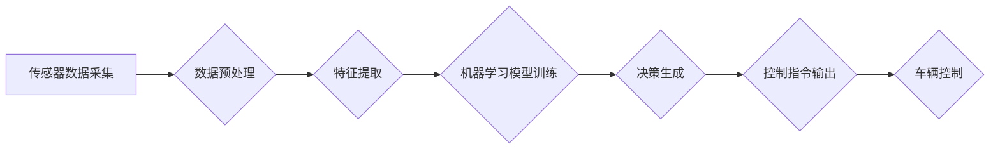

                 

## 人工智能在交通和自动驾驶中的应用

> 关键词：人工智能、自动驾驶、机器学习、深度学习、计算机视觉、传感器融合、路径规划、交通管理

## 1. 背景介绍

交通运输是现代社会不可或缺的一部分，它支撑着经济发展、社会繁荣和人们的日常生活。然而，传统的交通系统面临着诸多挑战，例如交通拥堵、交通事故、能源消耗高、环境污染等。人工智能（AI）技术的快速发展为解决这些问题提供了新的思路和解决方案。

人工智能，特别是机器学习和深度学习，在交通和自动驾驶领域展现出巨大的潜力。AI算法能够从海量交通数据中学习，识别模式，做出智能决策，从而提高交通效率、安全性、可持续性。

## 2. 核心概念与联系

### 2.1 自动驾驶

自动驾驶是指车辆能够感知周围环境，自主做出驾驶决策并控制车辆行驶的系统。自动驾驶技术的核心是人工智能，它利用传感器数据、机器学习算法和路径规划算法实现车辆的自主驾驶。

### 2.2 人工智能在自动驾驶中的应用

* **感知层:** 利用计算机视觉、雷达、激光雷达等传感器获取车辆周围环境信息，识别道路、车道、交通信号灯、行人等。
* **决策层:** 基于感知层获取的信息，利用机器学习算法进行决策，例如判断行驶方向、速度、是否需要变道等。
* **控制层:** 根据决策层的结果，控制车辆的转向、加速、制动等动作。

**Mermaid 流程图:**



## 3. 核心算法原理 & 具体操作步骤

### 3.1 算法原理概述

自动驾驶的核心算法包括：

* **计算机视觉:** 利用深度学习算法识别和理解图像信息，例如识别道路、车道、交通信号灯、行人等。
* **路径规划:** 根据车辆目标和周围环境信息，规划最优行驶路径。
* **运动控制:** 控制车辆的转向、加速、制动等动作，使车辆沿着规划好的路径行驶。

### 3.2 算法步骤详解

**计算机视觉算法:**

1. **图像采集:** 利用摄像头采集车辆周围环境的图像数据。
2. **图像预处理:** 对图像进行预处理，例如去除噪声、调整亮度、对比度等。
3. **特征提取:** 利用深度学习算法提取图像中的特征，例如边缘、纹理、颜色等。
4. **目标识别:** 基于提取的特征，识别图像中的目标，例如道路、车道、交通信号灯、行人等。

**路径规划算法:**

1. **环境建模:** 建立车辆周围环境的模型，例如道路地图、障碍物位置等。
2. **目标设定:** 设置车辆的目标位置。
3. **路径搜索:** 利用搜索算法，例如A*算法，在环境模型中搜索从当前位置到目标位置的最优路径。

**运动控制算法:**

1. **轨迹跟踪:** 根据规划好的路径，控制车辆沿着轨迹行驶。
2. **避障:** 识别周围环境中的障碍物，并采取避障措施。
3. **速度控制:** 根据道路情况和驾驶需求，控制车辆的速度。

### 3.3 算法优缺点

**计算机视觉算法:**

* **优点:** 能够识别和理解复杂的视觉信息，例如道路、车道、交通信号灯、行人等。
* **缺点:** 对光照、天气等环境条件敏感，识别精度可能受到影响。

**路径规划算法:**

* **优点:** 可以规划最优行驶路径，提高车辆的效率和安全性。
* **缺点:** 需要准确的环境模型，否则规划路径可能不准确。

**运动控制算法:**

* **优点:** 可以使车辆平稳、安全地行驶。
* **缺点:** 需要精确的传感器数据和控制算法，否则可能导致车辆失控。

### 3.4 算法应用领域

* **自动驾驶汽车:** 自动驾驶汽车的核心技术就是利用人工智能算法实现车辆的自主驾驶。
* **无人机:** 无人机也利用人工智能算法实现自主飞行。
* **智能交通系统:** 智能交通系统利用人工智能算法优化交通流量，提高交通效率。

## 4. 数学模型和公式 & 详细讲解 & 举例说明

### 4.1 数学模型构建

自动驾驶系统中的许多算法都基于数学模型。例如，路径规划算法通常使用数学模型来表示道路、障碍物和车辆的运动。

**道路模型:** 可以使用多项式函数来表示道路的形状。例如，一条直线道路可以用以下多项式函数表示：

$$y = mx + c$$

其中，$m$ 是道路的斜率，$c$ 是道路的截距。

**障碍物模型:** 可以使用圆形或矩形模型来表示障碍物。例如，一个圆形障碍物可以用以下公式表示：

$$(x - x_c)^2 + (y - y_c)^2 = r^2$$

其中，$(x_c, y_c)$ 是障碍物的中心坐标，$r$ 是障碍物的半径。

**车辆模型:** 可以使用动力学方程来描述车辆的运动。例如，车辆的运动方程可以表示为：

$$m\ddot{x} = F$$

其中，$m$ 是车辆的质量，$\ddot{x}$ 是车辆的加速度，$F$ 是作用在车辆上的力。

### 4.2 公式推导过程

路径规划算法通常使用搜索算法，例如A*算法，来寻找最优路径。A*算法的核心思想是利用启发函数来估算从当前节点到目标节点的距离，并选择距离最短的节点进行搜索。

A*算法的公式如下：

$$f(n) = g(n) + h(n)$$

其中，$f(n)$ 是从起点到节点$n$的总代价，$g(n)$ 是从起点到节点$n$的实际代价，$h(n)$ 是从节点$n$到目标节点的启发函数估算值。

### 4.3 案例分析与讲解

例如，假设我们要规划一条从起点A到终点B的路径，道路上存在一些障碍物。我们可以使用A*算法来寻找最优路径。

1. 建立道路模型和障碍物模型。
2. 使用启发函数估算从每个节点到目标节点的距离。
3. 利用A*算法搜索最优路径。

A*算法会根据节点的总代价$f(n)$选择距离最短的节点进行搜索，最终找到从起点A到终点B的最优路径。

## 5. 项目实践：代码实例和详细解释说明

### 5.1 开发环境搭建

自动驾驶项目开发通常需要以下开发环境：

* **操作系统:** Linux或Windows
* **编程语言:** Python或C++
* **深度学习框架:** TensorFlow或PyTorch
* **仿真平台:** Gazebo或CARLA

### 5.2 源代码详细实现

以下是一个使用Python和OpenCV实现计算机视觉算法的简单代码示例：

```python
import cv2

# 加载摄像头
cap = cv2.VideoCapture(0)

while True:
    # 读取摄像头帧
    ret, frame = cap.read()

    # 将图像转换为灰度图像
    gray = cv2.cvtColor(frame, cv2.COLOR_BGR2GRAY)

    # 使用边缘检测算法检测边缘
    edges = cv2.Canny(gray, 100, 200)

    # 显示图像
    cv2.imshow('Edges', edges)

    # 按键退出
    if cv2.waitKey(1) & 0xFF == ord('q'):
        break

# 释放资源
cap.release()
cv2.destroyAllWindows()
```

### 5.3 代码解读与分析

这段代码首先加载摄像头，然后读取摄像头帧。将图像转换为灰度图像，并使用Canny算法检测边缘。最后，显示图像，并按键盘按键退出。

### 5.4 运行结果展示

运行这段代码后，将会显示一个窗口，显示摄像头捕获的图像的边缘检测结果。

## 6. 实际应用场景

### 6.1 自动驾驶汽车

自动驾驶汽车是人工智能在交通领域最具代表性的应用场景之一。自动驾驶汽车利用传感器数据、机器学习算法和路径规划算法实现车辆的自主驾驶，可以提高交通效率、安全性、舒适性。

### 6.2 无人机

无人机也利用人工智能算法实现自主飞行。例如，无人机可以利用计算机视觉算法识别目标，并根据目标位置规划飞行路径。

### 6.3 智能交通系统

智能交通系统利用人工智能算法优化交通流量，提高交通效率。例如，智能交通信号灯可以根据实时交通流量调整信号灯的亮绿时间，从而减少拥堵。

### 6.4 未来应用展望

人工智能在交通领域的应用前景广阔，未来将有更多新的应用场景出现，例如：

* **智能交通管理:** 利用人工智能算法预测交通流量，优化交通信号灯控制，减少交通拥堵。
* **智能停车:** 利用人工智能算法识别空闲停车位，引导车辆停车。
* **智能货运:** 利用无人驾驶车辆进行货运，提高物流效率。

## 7. 工具和资源推荐

### 7.1 学习资源推荐

* **书籍:**
    * 《深度学习》
    * 《机器学习》
    * 《自动驾驶汽车》
* **在线课程:**
    * Coursera
    * edX
    * Udacity

### 7.2 开发工具推荐

* **编程语言:** Python, C++
* **深度学习框架:** TensorFlow, PyTorch
* **仿真平台:** Gazebo, CARLA

### 7.3 相关论文推荐

* **论文数据库:** arXiv, IEEE Xplore
* **搜索关键词:** 自动驾驶, 人工智能, 深度学习, 计算机视觉, 路径规划

## 8. 总结：未来发展趋势与挑战

### 8.1 研究成果总结

人工智能在交通和自动驾驶领域取得了显著的成果，例如：

* **计算机视觉算法:** 能够识别和理解复杂的视觉信息，例如道路、车道、交通信号灯、行人等。
* **路径规划算法:** 可以规划最优行驶路径，提高车辆的效率和安全性。
* **运动控制算法:** 可以使车辆平稳、安全地行驶。

### 8.2 未来发展趋势

* **更强大的人工智能算法:** 能够处理更复杂的数据，做出更智能的决策。
* **更可靠的传感器技术:** 能够提供更准确、更可靠的传感器数据。
* **更安全的自动驾驶系统:** 能够应对各种复杂路况和突发事件。

### 8.3 面临的挑战

* **数据安全:** 自动驾驶系统需要收集和处理大量数据，数据安全是一个重要的挑战。
* **伦理问题:** 自动驾驶系统可能会面临一些伦理问题，例如在紧急情况下如何做出决策。
* **法律法规:** 自动驾驶技术的法律法规还在不断完善中。

### 8.4 研究展望

未来，人工智能在交通和自动驾驶领域的应用将更加广泛、更加深入。研究者将继续探索更强大的人工智能算法、更可靠的传感器技术和更安全的自动驾驶系统，为人类创造更加便捷、更加安全的交通出行体验。

## 9. 附录：常见问题与解答

* **自动驾驶汽车真的安全吗？**

自动驾驶汽车的安全性仍然是一个挑战，但随着人工智能算法和传感器技术的不断发展，自动驾驶汽车的安全性也在不断提高。

* **自动驾驶汽车什么时候能够普及？**

自动驾驶汽车的普及时间还无法确定，但预计在未来几年内将会逐步普及。

* **自动驾驶汽车会取代人类司机吗？**

自动驾驶汽车可能会改变人类司机的职业，但不会完全取代人类司机。


作者：禅与计算机程序设计艺术 / Zen and the Art of Computer Programming 
<end_of_turn>

