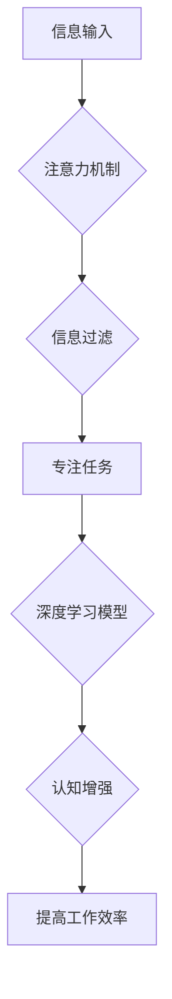

                 

## 人类注意力增强：提升专注力和注意力在商业中的未来趋势预测

> 关键词：注意力增强、专注力、深度学习、脑机接口、商业应用、未来趋势、认知增强

## 1. 背景介绍

在当今信息爆炸的时代，人类的注意力面临着前所未有的挑战。来自社交媒体、电子邮件、新闻推送等各种信息源的不断轰炸，使得人们难以集中精力完成任务，专注力逐渐下降。这不仅影响着个人生活质量，也对商业效率和创新能力造成严重阻碍。

注意力是认知的核心能力之一，它决定着我们如何处理信息、学习新知识、做出决策。注意力力的下降会导致工作效率低下、学习效果差、生活质量下降等一系列问题。对于商业而言，注意力力的下降意味着员工难以集中精力工作，决策效率降低，创新能力受限，最终影响企业竞争力。

近年来，随着人工智能、脑科学等领域的快速发展，人类注意力增强技术逐渐成为研究热点。从软件应用到硬件设备，从认知训练到脑机接口，各种注意力增强方法层出不穷，为提升人类专注力和注意力提供了新的可能性。

## 2. 核心概念与联系

### 2.1 注意力增强

注意力增强是指通过各种技术手段，提升人类的注意力能力，使其能够更有效地集中精力、过滤干扰、提高信息处理效率。

### 2.2  专注力

专注力是指持续地将注意力集中在某一特定目标或任务上，排除其他干扰的能力。

### 2.3  深度学习

深度学习是一种机器学习的子领域，它利用多层神经网络来模拟人类大脑的学习过程，能够从海量数据中学习复杂的模式和特征。

### 2.4  脑机接口

脑机接口 (Brain-Computer Interface, BCI) 是一种连接大脑和外部设备的技术，它能够直接读取大脑信号，并将其转化为控制设备的动作指令。

**Mermaid 流程图**



## 3. 核心算法原理 & 具体操作步骤

### 3.1 算法原理概述

注意力增强算法通常基于深度学习技术，通过训练神经网络模型来识别和过滤干扰信息，提高对目标信息的关注度。

常见的注意力机制包括：

* **自注意力机制 (Self-Attention):**  能够捕捉文本序列中不同词之间的关系，提高对上下文信息的理解能力。
* **位置自注意力机制 (Positional Self-Attention):**  在自注意力机制的基础上，加入了位置信息，能够更好地处理顺序信息。
* **多头注意力机制 (Multi-Head Attention):**  使用多个注意力头来捕捉不同类型的关系，提高模型的表达能力。

### 3.2 算法步骤详解

1. **数据收集和预处理:** 收集大量包含目标信息和干扰信息的样本数据，并进行预处理，例如文本清洗、分词、词向量化等。
2. **模型构建:** 选择合适的深度学习模型架构，例如Transformer、BERT等，并根据任务需求进行调整。
3. **模型训练:** 使用训练数据训练模型，通过反向传播算法优化模型参数，使模型能够准确识别目标信息并过滤干扰信息。
4. **模型评估:** 使用测试数据评估模型性能，例如准确率、召回率、F1-score等。
5. **模型部署:** 将训练好的模型部署到实际应用场景中，例如软件应用程序、硬件设备等。

### 3.3 算法优缺点

**优点:**

* 能够有效提高注意力集中度和信息处理效率。
* 能够过滤干扰信息，减少认知负担。
* 能够个性化定制，根据用户的需求进行调整。

**缺点:**

* 需要大量的数据进行训练，训练成本较高。
* 模型的复杂度较高，需要专业的技术人员进行开发和维护。
* 存在潜在的隐私安全风险。

### 3.4 算法应用领域

* **教育:** 帮助学生集中注意力学习，提高学习效率。
* **医疗:** 辅助医生诊断疾病，提高医疗效率。
* **商业:** 提升员工的工作效率，提高决策质量。
* **游戏:** 增强玩家的游戏体验，提高游戏沉浸感。

## 4. 数学模型和公式 & 详细讲解 & 举例说明

### 4.1 数学模型构建

注意力机制的核心是计算每个输入元素对输出的影响权重。常用的数学模型包括：

* **加权求和模型:**  将每个输入元素与一个权重相乘，然后求和得到输出。

$$
\text{Output} = \sum_{i=1}^{n} w_i \cdot \text{Input}_i
$$

其中，$w_i$ 是第 $i$ 个输入元素的权重，$\text{Input}_i$ 是第 $i$ 个输入元素的值。

* **softmax 函数:**  将多个权重值归一化到 [0, 1] 之间，表示每个输入元素对输出的影响概率。

$$
w_i = \frac{exp(e_i)}{\sum_{j=1}^{n} exp(e_j)}
$$

其中，$e_i$ 是第 $i$ 个输入元素的得分。

### 4.2 公式推导过程

注意力机制的权重计算通常基于输入元素之间的相似度或相关性。常用的相似度度量方法包括：

* **点积:**  计算两个向量的点积。

$$
\text{Similarity} = \text{Input}_i \cdot \text{Input}_j
$$

* **余弦相似度:**  计算两个向量的余弦值。

$$
\text{Similarity} = \frac{\text{Input}_i \cdot \text{Input}_j}{||\text{Input}_i|| ||\text{Input}_j||}
$$

### 4.3 案例分析与讲解

例如，在机器翻译任务中，注意力机制可以帮助模型关注源语言句子中与目标语言句子相关的重要词语，从而提高翻译质量。

## 5. 项目实践：代码实例和详细解释说明

### 5.1 开发环境搭建

* Python 3.x
* TensorFlow 或 PyTorch 深度学习框架
* Jupyter Notebook 或 VS Code 代码编辑器

### 5.2 源代码详细实现

```python
import tensorflow as tf

# 定义注意力机制层
class AttentionLayer(tf.keras.layers.Layer):
    def __init__(self, units):
        super(AttentionLayer, self).__init__()
        self.W1 = tf.keras.layers.Dense(units)
        self.W2 = tf.keras.layers.Dense(units)
        self.V = tf.keras.layers.Dense(1)

    def call(self, inputs):
        # 计算每个词的得分
        scores = self.V(tf.nn.tanh(self.W1(inputs) + self.W2(inputs)))
        # 归一化得分
        attention_weights = tf.nn.softmax(scores, axis=-1)
        # 计算加权求和
        context_vector = tf.matmul(attention_weights, inputs)
        return context_vector

# 定义注意力增强模型
model = tf.keras.Sequential([
    tf.keras.layers.Embedding(input_dim=10000, output_dim=128),
    AttentionLayer(units=64),
    tf.keras.layers.Dense(units=10, activation='softmax')
])

# 训练模型
model.compile(optimizer='adam', loss='sparse_categorical_crossentropy', metrics=['accuracy'])
model.fit(x_train, y_train, epochs=10)
```

### 5.3 代码解读与分析

* `AttentionLayer` 类定义了一个注意力机制层，它包含三个稠密层：`W1`、`W2` 和 `V`。
* `call` 方法计算每个词的得分，并使用 softmax 函数将其归一化到 [0, 1] 之间，表示每个词对输出的影响概率。
* `context_vector` 是加权求和的结果，它代表了输入序列中所有词的加权平均值。
* `model` 是一个包含嵌入层、注意力机制层和全连接层的注意力增强模型。

### 5.4 运行结果展示

训练完成后，可以使用测试数据评估模型性能，例如准确率、召回率、F1-score等。

## 6. 实际应用场景

### 6.1 教育领域

* **在线学习平台:**  帮助学生集中注意力学习，提高学习效率。
* **智能辅导系统:**  根据学生的学习情况，提供个性化的注意力训练和辅导。

### 6.2 医疗领域

* **注意力缺陷多动障碍 (ADHD) 治疗:**  帮助患者提高注意力集中度，减轻症状。
* **认知训练:**  帮助老年人提高认知功能，延缓认知衰退。

### 6.3 商业领域

* **员工培训:**  提升员工的注意力集中度，提高培训效果。
* **决策支持系统:**  帮助决策者集中注意力，做出更明智的决策。

### 6.4 未来应用展望

随着人工智能技术的不断发展，注意力增强技术将应用于更广泛的领域，例如：

* **虚拟现实 (VR) 和增强现实 (AR):**  增强用户沉浸感和交互体验。
* **自动驾驶:**  帮助驾驶员集中注意力，提高驾驶安全。
* **机器人:**  增强机器人的认知能力，使其能够更好地理解和响应人类指令。

## 7. 工具和资源推荐

### 7.1 学习资源推荐

* **书籍:**

    * 《深度学习》 (Deep Learning) - Ian Goodfellow, Yoshua Bengio, Aaron Courville
    * 《注意力机制》 (Attention Is All You Need) - Vaswani et al.

* **在线课程:**

    * Coursera: 深度学习 Specialization
    * Udacity: 自然语言处理 Nanodegree

### 7.2 开发工具推荐

* **TensorFlow:**  开源深度学习框架，提供丰富的注意力机制实现。
* **PyTorch:**  开源深度学习框架，灵活易用，适合研究和开发。
* **Jupyter Notebook:**  交互式代码编辑器，方便进行深度学习模型的开发和调试。

### 7.3 相关论文推荐

* 《Attention Is All You Need》 (Vaswani et al., 2017)
* 《BERT: Pre-training of Deep Bidirectional Transformers for Language Understanding》 (Devlin et al., 2018)
* 《Transformer-XL: Attentive Language Models Beyond a Fixed-Length Context》 (Dai et al., 2019)

## 8. 总结：未来发展趋势与挑战

### 8.1 研究成果总结

近年来，注意力增强技术取得了显著进展，在自然语言处理、计算机视觉等领域取得了突破性成果。

### 8.2 未来发展趋势

* **更强大的注意力机制:**  研究更有效的注意力机制，提高模型的表达能力和泛化能力。
* **跨模态注意力:**  研究跨文本、图像、音频等不同模态的注意力机制，实现更全面的信息理解。
* **脑机接口结合:**  将注意力增强技术与脑机接口结合，实现对大脑活动的直接控制和调节。

### 8.3 面临的挑战

* **数据获取和隐私保护:**  注意力增强算法需要大量的数据进行训练，如何获取高质量的数据并保护用户隐私是一个重要挑战。
* **模型解释性和可信度:**  深度学习模型的内部机制复杂，难以解释其决策过程，如何提高模型的解释性和可信度是一个关键问题。
* **伦理和社会影响:**  注意力增强技术可能会对人类认知能力和社会行为产生影响，需要认真考虑其伦理和社会影响。

### 8.4 研究展望

未来，注意力增强技术将继续朝着更智能、更安全、更可解释的方向发展，为人类社会带来更多福祉。


## 9. 附录：常见问题与解答

**Q1: 注意力增强技术真的能有效提高注意力吗？**

A1: 目前已有大量研究表明，注意力增强技术能够有效提高注意力集中度和信息处理效率。

**Q2: 注意力增强技术有哪些潜在的风险？**

A2: 注意力增强技术可能会导致过度依赖，降低自主学习能力，以及引发隐私安全问题。

**Q3: 如何选择合适的注意力增强技术？**

A3: 选择合适的注意力增强技术需要根据具体的应用场景和需求进行评估。

**Q4: 注意力增强技术的发展趋势是什么？**

A4: 未来注意力增强技术将朝着更智能、更安全、更可解释的方向发展。


作者：禅与计算机程序设计艺术 / Zen and the Art of Computer Programming 
<end_of_turn>

