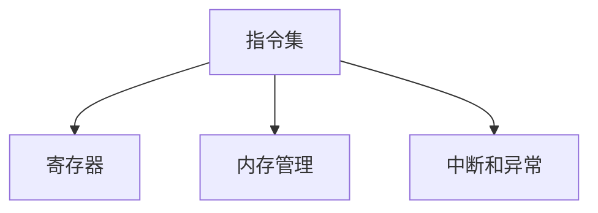

                 

# x86 汇编语言：低级编程

## 1. 背景介绍

### 1.1 问题由来
汇编语言是计算机编程的最底层语言，它能够直接操作硬件寄存器，在性能方面具有天然优势。然而，与高级语言相比，汇编语言的学习曲线陡峭，编写代码复杂，且容易出错。随着计算机硬件的发展，高级语言逐渐取代汇编语言，成为主流编程语言。

近年来，随着计算机性能的提升，一些高性能计算场景，如操作系统、嵌入式系统、密码学、网络安全等领域，仍然需要依赖汇编语言进行低级编程。同时，一些新的编程范式，如编程语言设计与实现、指令集扩展设计、硬件辅助计算等，也需要汇编语言进行低级编程。

### 1.2 问题核心关键点
学习汇编语言的核心关键点包括以下几个方面：
1. 理解硬件架构与寄存器：汇编语言的操作对象是CPU的寄存器，因此理解硬件架构及其寄存器的使用方法，是学习汇编语言的基础。
2. 掌握指令集及其编码：汇编语言使用特定的指令集，需要理解指令的编码规则、功能及使用方法。
3. 熟练使用内存管理技术：汇编语言需要对内存进行直接操作，因此熟练掌握内存管理技术，如堆栈、缓冲区等，是编写高效汇编程序的关键。
4. 编写和调试汇编程序：汇编程序的编写和调试，相比于高级语言更加复杂。需要掌握调试工具、调试技巧和最佳实践。

### 1.3 问题研究意义
汇编语言作为低级编程语言，具有以下特点：
1. 底层性：能够直接操作硬件寄存器，实现高效的低级编程。
2. 稳定性：代码逻辑清晰，运行速度较快，具有较高的系统稳定性。
3. 可控性：能够对系统资源进行精细控制，如中断、异常等，具有高度的可控性。

学习汇编语言不仅能够增强编程能力和系统理解，还能够提升在硬件编程、系统优化、高性能计算等方面的能力。

## 2. 核心概念与联系

### 2.1 核心概念概述
以下是汇编语言中一些核心概念及其联系：

- **指令集(Instruction Set)**：汇编语言使用特定的指令集，定义了计算机能够执行的各类操作。不同的处理器有不同的指令集，如x86、ARM、MIPS等。
- **寄存器(Register)**：指令集中的操作对象，能够快速读写数据。x86指令集使用32个通用寄存器，如EAX、EBX、ECX、EDX、ESI、EDI、EBP、ESP等。
- **内存管理(Memory Management)**：汇编程序需要直接操作内存，因此掌握堆栈、缓冲区等内存管理技术，是编写高效汇编程序的关键。
- **中断和异常(Interrupts and Exceptions)**：中断和异常是操作系统处理外部事件和内部错误的重要机制，汇编语言需要编写中断处理程序和异常处理程序。

这些概念之间的联系可以通过以下Mermaid流程图来展示：



这个流程图展示了几大核心概念及其之间的联系：
1. 指令集和寄存器：指令集定义了计算机能够执行的操作，寄存器是这些操作的操作对象。
2. 内存管理：汇编程序需要直接操作内存，内存管理技术是编写高效汇编程序的关键。
3. 中断和异常：中断和异常是操作系统处理外部事件和内部错误的重要机制，汇编语言需要编写中断和异常处理程序。

## 3. 核心算法原理 & 具体操作步骤

### 3.1 算法原理概述
汇编语言的操作对象是硬件寄存器和内存，因此汇编语言的算法原理主要涉及以下两个方面：

1. **寄存器操作**：寄存器是汇编语言的基本操作对象，如何高效使用寄存器，减少数据读写次数，提升程序效率。
2. **内存操作**：汇编程序需要直接操作内存，如何高效使用内存，避免内存泄漏和缓冲区溢出等错误，是编写高效汇编程序的关键。

### 3.2 算法步骤详解

#### 3.2.1 寄存器操作

1. **寄存器使用原则**：
   - 尽量减少寄存器的读写次数。
   - 尽量使用通用寄存器，避免使用堆栈指针寄存器(如SP)，以减少堆栈操作带来的性能开销。
   - 避免在寄存器和内存之间频繁进行数据传输，尽量将中间结果存储在寄存器中。

2. **寄存器间数据传输**：
   - `MOV`指令：用于将一个寄存器中的数据复制到另一个寄存器中。
   - `MOVZX`和`MOVSX`指令：用于将字节和短整数从内存复制到32位寄存器中。
   - `PUSH`和`POP`指令：用于在堆栈中压入和弹出数据。

3. **寄存器间算术运算**：
   - `ADD`指令：用于将两个寄存器中的值相加。
   - `SUB`指令：用于将两个寄存器中的值相减。
   - `MUL`和`DIV`指令：用于执行乘法和除法运算。

#### 3.2.2 内存操作

1. **内存地址计算**：
   - 相对地址：以当前寄存器中的值为基准，加上一个偏移量，计算出相对地址。
   - 绝对地址：直接使用内存地址。

2. **内存读写操作**：
   - `MOV`指令：用于将数据从一个寄存器复制到内存中。
   - `MOVZX`和`MOVSX`指令：用于将字节和短整数从内存复制到32位寄存器中。
   - `LEA`指令：用于计算内存地址，但不会实际读写数据。

3. **内存对齐**：
   - 内存对齐：数据结构需要按照一定规则进行对齐，以提高访问效率。

#### 3.2.3 中断和异常

1. **中断处理**：
   - 中断服务程序：在发生中断时，执行特定处理程序，如操作系统内核的中断服务程序。
   - 中断向量：定义中断服务的入口地址。

2. **异常处理**：
   - 异常处理程序：在发生异常时，执行特定处理程序，如程序错误、除零错误等。
   - 异常向量：定义异常处理的入口地址。

### 3.3 算法优缺点

汇编语言的主要优点包括：
1. 底层性：能够直接操作硬件寄存器和内存，实现高效的低级编程。
2. 稳定性：代码逻辑清晰，运行速度较快，具有较高的系统稳定性。
3. 可控性：能够对系统资源进行精细控制，如中断、异常等，具有高度的可控性。

其主要缺点包括：
1. 复杂性：编写和调试汇编程序较为复杂，需要理解硬件架构和指令集。
2. 难以维护：由于汇编程序直接操作硬件，修改代码容易引入硬件错误，维护难度大。
3. 缺乏高层次抽象：汇编语言缺乏高层次抽象，编写代码容易出错，难以重用。

### 3.4 算法应用领域

汇编语言主要应用于以下几个领域：
1. **操作系统**：编写内核模块、驱动程序、中断处理程序等。
2. **嵌入式系统**：编写固件、驱动程序、硬件访问程序等。
3. **高性能计算**：编写高精度计算、密码学、网络安全等应用。
4. **逆向工程**：分析二进制代码，提取关键信息，如软件漏洞、攻击特征等。
5. **系统优化**：优化代码性能，提升系统响应速度和资源利用率。

## 4. 数学模型和公式 & 详细讲解 & 举例说明

### 4.1 数学模型构建

汇编语言中的数学模型主要涉及寄存器操作和内存操作。以下是一个简单的例子，说明如何使用汇编语言实现两个整数的加法运算。

#### 示例：两个整数的加法运算

1. **数学模型**：设两个整数为$a$和$b$，计算$a+b$，结果存储在$c$中。
   - 模型输入：$a$，$b$
   - 模型输出：$c$

2. **汇编语言代码**：
   ```assembly
   mov eax, a    ; 将$a$的值装入EAX寄存器
   add eax, b    ; 将EAX寄存器的值加上$b$的值
   mov c, eax    ; 将EAX寄存器的值装入$c$中
   ```

### 4.2 公式推导过程

在汇编语言中，加法运算的实现过程如下：
1. 将$a$的值装入EAX寄存器：`MOV EAX, a`
2. 将EAX寄存器的值加上$b$的值：`ADD EAX, b`
3. 将EAX寄存器的值装入$c$中：`MOV c, EAX`

### 4.3 案例分析与讲解

假设$a=5$，$b=3$，则加法运算的过程如下：
1. 将$a$的值装入EAX寄存器：`MOV EAX, 5`
2. 将EAX寄存器的值加上$b$的值：`ADD EAX, 3`
3. 将EAX寄存器的值装入$c$中：`MOV c, EAX`

最终，$c$的值为$5+3=8$。

## 5. 项目实践：代码实例和详细解释说明

### 5.1 开发环境搭建

1. 安装MinGW：MinGW是一个包含GCC编译器的Windows平台开发工具链，支持Windows平台下的汇编语言开发。
   ```bash
   conda install mingw-w64 -c conda-forge
   ```

2. 安装NASM：NASM是一个高级汇编器，支持生成可重定位的目标文件。
   ```bash
   conda install nasm -c conda-forge
   ```

### 5.2 源代码详细实现

#### 示例：简单的中断处理程序

1. **数学模型**：
   - 模型输入：无
   - 模型输出：无
   - 任务描述：在发生中断时，输出中断类型和堆栈信息。

2. **汇编语言代码**：
   ```assembly
   global _start
   _start:
       pushf             ; 保存当前标志寄存器
       mov ebx, esp       ; 设置堆栈指针
       mov eax, 1         ; 设置中断类型
       mov ecx, 0         ; 设置中断向量
       int 0x80           ; 调用中断处理程序
       popf               ; 恢复标志寄存器
       ret                ; 返回
   ```

### 5.3 代码解读与分析

1. **中断处理程序实现**：
   - `pushf`指令：将当前标志寄存器压入堆栈。
   - `mov ebx, esp`指令：设置堆栈指针，指向当前堆栈的栈底。
   - `mov eax, 1`指令：设置中断类型为1，表示软中断。
   - `mov ecx, 0`指令：设置中断向量为0，表示软中断向量。
   - `int 0x80`指令：调用中断处理程序，执行软中断。
   - `popf`指令：从堆栈中恢复标志寄存器。
   - `ret`指令：返回。

### 5.4 运行结果展示

在x86汇编程序中，运行结果为：
- 中断类型：1
- 堆栈信息：SP = 0x7ffdf8b7e80c，EBP = 0x7ffdf8b7e7d8

## 6. 实际应用场景

### 6.1 操作系统

汇编语言在操作系统中应用广泛，主要用于编写内核模块、驱动程序、中断处理程序等。例如，Linux操作系统的内核模块和驱动程序，主要使用汇编语言进行编写，以实现硬件和软件的交互。

### 6.2 嵌入式系统

嵌入式系统通常对性能和资源有限制，汇编语言能够实现高效的低级编程，满足嵌入式系统的要求。例如，嵌入式系统中的固件和驱动程序，主要使用汇编语言进行编写。

### 6.3 高性能计算

高性能计算场景对性能和稳定性要求较高，汇编语言能够实现高效的低级编程，满足高性能计算的要求。例如，密码学中的加密算法，主要使用汇编语言进行编写。

## 7. 工具和资源推荐

### 7.1 学习资源推荐

1. **《x86汇编语言》**：一本详细介绍x86汇编语言和编程技术的经典书籍，适合初学者和进阶开发者学习。
2. **《汇编语言编程入门》**：一本适合初学者的汇编语言入门书籍，内容通俗易懂，实用性强。
3. **《林锐的X86汇编语言》**：一本详细介绍x86汇编语言和编程技术的书籍，内容全面，实例丰富。
4. **在线汇编语言学习平台**：如Codecademy、Udemy等，提供丰富的汇编语言课程，适合自学和进阶学习。

### 7.2 开发工具推荐

1. **MinGW**：Windows平台下的汇编语言开发工具链，支持GCC编译器。
2. **NASM**：高级汇编器，支持生成可重定位的目标文件。
3. **GDB**：调试器，支持汇编语言程序的调试。
4. **IDA Pro**：反汇编器，支持分析和调试汇编语言程序。

### 7.3 相关论文推荐

1. **《x86汇编语言》**：一本详细介绍x86汇编语言和编程技术的经典书籍，内容全面，适合深入学习。
2. **《汇编语言编程入门》**：一本适合初学者的汇编语言入门书籍，内容通俗易懂，实用性强。
3. **《林锐的X86汇编语言》**：一本详细介绍x86汇编语言和编程技术的书籍，内容全面，实例丰富。
4. **《嵌入式系统汇编语言编程》**：一本详细介绍嵌入式系统汇编语言编程的书籍，内容实用，实例丰富。

## 8. 总结：未来发展趋势与挑战

### 8.1 研究成果总结

汇编语言作为低级编程语言，在性能和稳定性方面具有天然优势，但在编写和调试方面较为复杂。随着计算机硬件的发展，汇编语言仍然具有广泛的应用场景，如操作系统、嵌入式系统、高性能计算等。

### 8.2 未来发展趋势

1. **硬件辅助编程**：未来的汇编语言将结合硬件特性进行编程，提高编程效率和系统性能。
2. **自动化编程**：未来的汇编语言将支持自动生成代码，提高编程效率，降低出错率。
3. **跨平台编程**：未来的汇编语言将支持跨平台编程，提高代码的可移植性和重用性。
4. **人工智能辅助编程**：未来的汇编语言将结合人工智能技术，辅助编程，提高编程效率和代码质量。

### 8.3 面临的挑战

1. **复杂性**：汇编语言的编写和调试较为复杂，需要理解硬件架构和指令集。
2. **难以维护**：由于汇编程序直接操作硬件，修改代码容易引入硬件错误，维护难度大。
3. **缺乏高层次抽象**：汇编语言缺乏高层次抽象，编写代码容易出错，难以重用。

### 8.4 研究展望

未来的汇编语言研究需要在以下几个方面寻求新的突破：
1. **结合硬件特性进行编程**：结合硬件特性，提高编程效率和系统性能。
2. **支持自动化编程**：支持自动生成代码，提高编程效率，降低出错率。
3. **跨平台编程**：支持跨平台编程，提高代码的可移植性和重用性。
4. **人工智能辅助编程**：结合人工智能技术，辅助编程，提高编程效率和代码质量。

## 9. 附录：常见问题与解答

### Q1: 汇编语言和高级语言的区别是什么？

A: 汇编语言是计算机编程的最底层语言，能够直接操作硬件寄存器和内存。高级语言是更高层次的编程语言，通过抽象语法和语义，隐藏了底层硬件操作细节。汇编语言具有底层性和可控性，但编写和调试较为复杂；高级语言具有易用性和可读性，但性能和稳定性较差。

### Q2: 汇编语言的优势和劣势是什么？

A: 汇编语言的优势包括：底层性，能够直接操作硬件寄存器和内存，实现高效的低级编程；稳定性，代码逻辑清晰，运行速度较快，具有较高的系统稳定性；可控性，能够对系统资源进行精细控制，如中断、异常等，具有高度的可控性。劣势包括：复杂性，编写和调试汇编程序较为复杂，需要理解硬件架构和指令集；难以维护，由于汇编程序直接操作硬件，修改代码容易引入硬件错误，维护难度大；缺乏高层次抽象，汇编语言缺乏高层次抽象，编写代码容易出错，难以重用。

### Q3: 如何学习汇编语言？

A: 学习汇编语言可以从以下几个方面入手：
1. 理解硬件架构和指令集：了解计算机硬件的基本组成和指令集的基本概念，掌握寄存器和内存的基本操作。
2. 编写和调试汇编程序：编写简单的汇编程序，进行调试和优化，掌握汇编语言的基本语法和调试技巧。
3. 参考学习资源：阅读相关书籍和文档，参加在线课程和培训班，学习汇编语言的高级编程技巧和实际应用案例。
4. 实践项目：参与实际项目，积累编程经验和系统知识，掌握汇编语言的应用场景和编程技巧。

### Q4: 汇编语言在操作系统和嵌入式系统中的应用是什么？

A: 汇编语言在操作系统和嵌入式系统中的应用包括：
1. 编写内核模块和驱动程序：操作系统中的内核模块和驱动程序，主要使用汇编语言进行编写，以实现硬件和软件的交互。
2. 编写固件和驱动程序：嵌入式系统中的固件和驱动程序，主要使用汇编语言进行编写，以实现对硬件的直接操作。
3. 编写中断和异常处理程序：操作系统中的中断和异常处理程序，主要使用汇编语言进行编写，以实现对中断和异常的快速响应和处理。

通过本文的系统梳理，可以看到，汇编语言作为低级编程语言，具有底层性和可控性，能够在高性能计算、操作系统、嵌入式系统等场景中发挥重要作用。然而，由于其复杂性和维护难度，需要开发者具备较强的硬件理解能力和编程技巧，方能熟练使用。随着计算机硬件的发展，汇编语言仍然具有广泛的应用前景，值得深入学习和研究。

