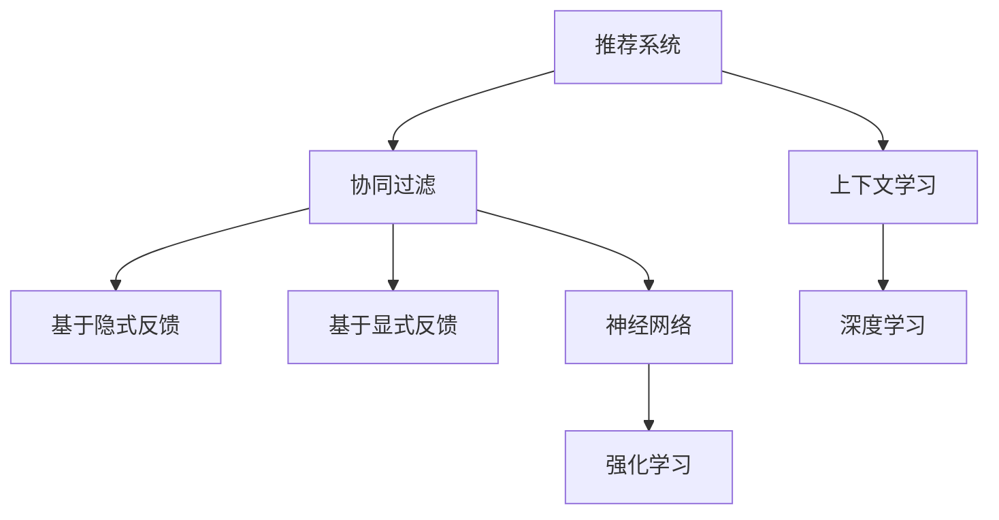

                 

# 上下文学习(ICL)在推荐中的应用

> 关键词：上下文学习,推荐系统,协同过滤,隐式反馈,显式反馈,神经网络,深度学习,强化学习

## 1. 背景介绍

在信息化和数字化快速发展的今天，互联网用户行为数据成为价值极高的资源。基于这些数据，推荐系统能够向用户精准推送其可能感兴趣的内容，提高用户满意度，促进内容消费，也推动了电商、音乐、视频、新闻等行业的业务发展。然而，随着用户数量的爆炸性增长和内容库的爆炸式扩张，传统推荐系统的个性化能力和推荐效率难以满足需求。

### 1.1 问题由来
传统推荐系统主要基于协同过滤算法，通过分析用户历史行为数据，找到与目标用户兴趣相似的其他用户，再通过这些用户的兴趣推测目标用户的兴趣。然而，这种基于隐式反馈的协同过滤方法存在数据稀疏性、冷启动、隐式反馈噪声等问题。为了解决这些问题，人们逐渐将注意力转向了显式反馈的推荐方法，如基于模型的协同过滤，利用用户评分数据进行推荐。此外，通过引入深度学习等技术，一些推荐系统开始尝试使用上下文学习，进一步提升推荐效果。

上下文学习是一种基于用户行为数据的推荐方法，与传统协同过滤和基于模型的协同过滤方法不同，它不仅考虑用户行为，还利用了上下文信息，通过用户-物品和物品-物品之间的关联关系，提升推荐效果。在本文中，我们将重点介绍上下文学习(ICL)在推荐系统中的应用，探讨如何利用上下文信息提升推荐系统性能，促进推荐系统的精准性和高效性。

## 2. 核心概念与联系

### 2.1 核心概念概述

为了更好地理解上下文学习在推荐系统中的应用，本节将介绍几个密切相关的核心概念：

- **推荐系统(Recommender System)**：基于用户行为数据，向用户推荐相关内容的技术，广泛应用于电商、音乐、视频、新闻等互联网领域。
- **协同过滤(Collaborative Filtering)**：一种基于用户历史行为数据的推荐方法，通过用户-物品相似性来推荐物品。包括基于用户历史评分数据的基于模型的协同过滤，和基于用户历史点击行为数据的基于内容的协同过滤。
- **上下文学习(Contextual Learning)**：一种基于用户行为数据的推荐方法，不仅考虑用户历史行为，还利用上下文信息，如用户年龄、性别、时间、地点等，通过用户-物品和物品-物品的关联关系，提升推荐效果。
- **隐式反馈(Implicit Feedback)**：基于用户行为数据，如浏览历史、点击行为、评分数据等，推荐用户可能感兴趣的内容。
- **显式反馈(Explicit Feedback)**：直接基于用户评分数据进行推荐，可以避免隐式反馈中的数据稀疏性和噪声问题。
- **神经网络(Neural Network)**：一种模拟人脑神经网络结构的计算模型，广泛用于深度学习任务，如图像识别、自然语言处理等。
- **深度学习(Deep Learning)**：一种基于神经网络的机器学习方法，通过多层次的特征抽象，从原始数据中提取出高层次的抽象特征，广泛应用于推荐系统、计算机视觉、自然语言处理等领域。
- **强化学习(Reinforcement Learning)**：一种通过智能体与环境交互，学习最优决策策略的学习方法，应用于推荐系统的推荐策略优化等。

这些核心概念之间的逻辑关系可以通过以下Mermaid流程图来展示：



这个流程图展示了大语言模型的核心概念及其之间的关系：

1. 推荐系统通过协同过滤和上下文学习进行推荐。
2. 协同过滤包括基于隐式反馈和显式反馈的方法。
3. 基于隐式反馈的方法利用用户历史行为数据进行推荐，如点击次数、评分等。
4. 基于显式反馈的方法直接利用用户评分数据进行推荐，避免隐式反馈的噪声。
5. 协同过滤和上下文学习可以使用神经网络进行建模，提升推荐效果。
6. 深度学习利用多层次特征抽象，提升协同过滤和上下文学习的表现。
7. 强化学习通过智能体与环境的交互，优化协同过滤和上下文学习的推荐策略。

## 3. 核心算法原理 & 具体操作步骤
### 3.1 算法原理概述

上下文学习(ICL)是一种基于用户行为数据的推荐方法，通过用户-物品和物品-物品之间的关联关系，提升推荐效果。其核心思想是：在协同过滤或基于模型的推荐方法基础上，进一步利用用户行为上下文信息，构建用户-物品和物品-物品的关联关系，提升推荐精度和覆盖率。

形式化地，假设推荐系统为用户 $u$ 推荐物品 $i$，目标是为其找到最相关的物品。设 $\mathcal{U}$ 为所有用户集合，$\mathcal{I}$ 为所有物品集合。定义用户 $u$ 对物品 $i$ 的显式评分 $r_{ui}$，隐式反馈 $h_{ui}$，上下文特征 $\mathbf{c}_u$。则上下文学习的目标为最大化用户对物品的评分，即：

$$
\max_{i \in \mathcal{I}} r_{ui} = \max_{i \in \mathcal{I}} f(r_{ui}, h_{ui}, \mathbf{c}_u, i)
$$

其中 $f$ 为推荐函数，将用户行为和上下文特征映射到物品评分。推荐函数 $f$ 可以通过深度学习等方法进行建模。

### 3.2 算法步骤详解

基于上下文学习的推荐方法主要包括以下几个关键步骤：

**Step 1: 数据预处理**
- 收集用户历史行为数据，包括用户-物品评分、点击行为、浏览历史等。
- 提取上下文特征，如用户年龄、性别、时间、地点等。
- 对原始数据进行归一化、标准化等预处理操作。

**Step 2: 模型训练**
- 构建基于深度学习的推荐模型，如矩阵分解、神经网络等。
- 利用用户历史行为数据和上下文特征训练模型，生成用户-物品评分预测。
- 通过交叉验证等方法，选择性能最优的模型。

**Step 3: 上下文学习**
- 利用用户行为和上下文特征，构建用户-物品和物品-物品的关联关系。
- 根据用户行为和上下文特征，生成物品推荐列表。
- 通过正则化、惩罚机制等方法，避免模型过拟合。

**Step 4: 模型评估与优化**
- 利用独立测试集对推荐模型进行评估，计算平均准确率、召回率、F1分数等指标。
- 根据评估结果，对推荐函数进行调参优化，提升推荐效果。

**Step 5: 在线部署**
- 将训练好的推荐模型部署到实际推荐系统中，进行在线推荐。
- 实时监测推荐效果，收集用户反馈，不断优化推荐模型。

以上是基于上下文学习的推荐系统的一般流程。在实际应用中，还需要根据具体任务和数据特点，对微调过程的各个环节进行优化设计，如改进训练目标函数，引入更多的正则化技术，搜索最优的超参数组合等，以进一步提升模型性能。

### 3.3 算法优缺点

基于上下文学习的推荐方法具有以下优点：
1. 提升推荐精度。上下文学习通过利用用户行为上下文信息，可以更准确地预测用户对物品的评分，提升推荐精度。
2. 增加推荐覆盖率。上下文学习可以生成更加多样化的推荐结果，增加推荐覆盖率。
3. 提升推荐效率。上下文学习可以通过一些高效的推荐算法，如矩阵分解、神经网络等，提升推荐效率。

同时，该方法也存在一定的局限性：
1. 数据需求较大。上下文学习需要大量的用户历史行为数据和上下文特征，获取和存储这些数据需要较大的成本。
2. 上下文信息质量不确定。上下文特征的质量和准确性会影响推荐效果，且难以预处理。
3. 模型复杂度高。上下文学习需要构建复杂的推荐函数，增加了模型训练和调参的难度。
4. 用户隐私问题。上下文特征可能包含用户的隐私信息，需要保护用户隐私。

尽管存在这些局限性，但就目前而言，基于上下文学习的推荐方法仍是大规模推荐系统的重要范式。未来相关研究的重点在于如何进一步降低上下文学习对数据的需求，提高上下文信息的质量和准确性，同时兼顾隐私保护和推荐效率等因素。

### 3.4 算法应用领域

基于上下文学习的推荐方法已经在多个领域得到了广泛的应用，例如：

- 电商推荐：基于用户浏览历史、收藏夹、购物车等行为数据，推荐用户可能感兴趣的商品。
- 音乐推荐：基于用户听歌历史、听歌时长、音乐类型等上下文信息，推荐用户可能喜欢的音乐。
- 视频推荐：基于用户观看历史、收藏视频、评分等行为数据，推荐用户可能感兴趣的视频内容。
- 新闻推荐：基于用户阅读历史、点赞文章、分享内容等行为数据，推荐用户可能感兴趣的新闻内容。
- 餐饮推荐：基于用户点餐历史、就餐偏好、地理位置等上下文信息，推荐用户可能喜欢的餐厅和菜品。

除了上述这些经典应用外，上下文学习也被创新性地应用到更多场景中，如旅行推荐、旅游规划、智能家居等，为用户提供了更加个性化和多样化的推荐服务。

## 4. 数学模型和公式 & 详细讲解  
### 4.1 数学模型构建

本节将使用数学语言对基于上下文学习的推荐系统进行更加严格的刻画。

记推荐系统为 $R: \mathcal{U} \times \mathcal{I} \rightarrow [0, 1]$，其中 $\mathcal{U}$ 为所有用户集合，$\mathcal{I}$ 为所有物品集合，$[0, 1]$ 为用户对物品的评分范围。假设用户 $u$ 对物品 $i$ 的显式评分 $r_{ui} \in [0, 1]$，隐式反馈 $h_{ui} \in \{0, 1\}$，上下文特征 $\mathbf{c}_u \in \mathbb{R}^n$。定义推荐函数 $f: \mathbb{R} \times \{0, 1\} \times \mathbb{R}^n \times \mathcal{I} \rightarrow [0, 1]$。

在实际应用中，推荐函数 $f$ 可以通过深度学习等方法进行建模，例如矩阵分解、神经网络等。

### 4.2 公式推导过程

以下我们以基于深度学习的推荐系统为例，推导推荐函数的推导过程。

假设推荐函数 $f$ 为一个多层神经网络，输入为用户行为数据 $(r_{ui}, h_{ui}, \mathbf{c}_u)$，输出为用户对物品的评分 $r_{ui}$。定义神经网络结构为：

$$
f_{\theta}(r_{ui}, h_{ui}, \mathbf{c}_u, i) = f_{L}(f_{L-1}(... f_{1}(r_{ui}, h_{ui}, \mathbf{c}_u, i)))
$$

其中 $f_1, ..., f_{L}$ 为 $L$ 层神经网络，$\theta$ 为神经网络参数。

在训练过程中，通过最小化损失函数 $\mathcal{L}$ 来训练神经网络：

$$
\mathcal{L}(\theta) = \frac{1}{N} \sum_{i=1}^N \sum_{u=1}^M (r_{ui} - f_{\theta}(r_{ui}, h_{ui}, \mathbf{c}_u, i))^2
$$

其中 $N$ 为物品总数，$M$ 为用户总数。

通过梯度下降等优化算法，神经网络不断更新参数 $\theta$，最小化损失函数 $\mathcal{L}$，使得推荐函数 $f_{\theta}$ 逼近用户对物品的真实评分 $r_{ui}$。

在得到推荐函数 $f_{\theta}$ 后，即可对任意用户 $u$ 推荐物品 $i$，计算其评分：

$$
r_{ui} = f_{\theta}(r_{ui}, h_{ui}, \mathbf{c}_u, i)
$$

将 $r_{ui}$ 按照评分排序，即可生成物品推荐列表。

## 5. 项目实践：代码实例和详细解释说明
### 5.1 开发环境搭建

在进行推荐系统开发前，我们需要准备好开发环境。以下是使用Python进行PyTorch开发的环境配置流程：

1. 安装Anaconda：从官网下载并安装Anaconda，用于创建独立的Python环境。

2. 创建并激活虚拟环境：
```bash
conda create -n pytorch-env python=3.8 
conda activate pytorch-env
```

3. 安装PyTorch：根据CUDA版本，从官网获取对应的安装命令。例如：
```bash
conda install pytorch torchvision torchaudio cudatoolkit=11.1 -c pytorch -c conda-forge
```

4. 安装TensorFlow：从官网下载对应的安装命令，进行安装。例如：
```bash
pip install tensorflow
```

5. 安装各类工具包：
```bash
pip install numpy pandas scikit-learn matplotlib tqdm jupyter notebook ipython
```

完成上述步骤后，即可在`pytorch-env`环境中开始推荐系统开发。

### 5.2 源代码详细实现

这里我们以电商推荐系统为例，给出使用PyTorch进行深度学习推荐系统的PyTorch代码实现。

首先，定义数据处理函数：

```python
import torch
from torch.utils.data import Dataset, DataLoader
from torch.nn import nn
import numpy as np

class RecommendationDataset(Dataset):
    def __init__(self, ratings, features):
        self.ratings = ratings
        self.features = features
        self.num_users = ratings.shape[0]
        self.num_items = ratings.shape[1]
        
    def __len__(self):
        return len(self.ratings)
    
    def __getitem__(self, index):
        user_id = index // self.num_items
        item_id = index % self.num_items
        rating = self.ratings[user_id, item_id]
        user_features = self.features[user_id]
        item_features = self.features[item_id]
        return {'user_id': user_id, 'item_id': item_id, 'rating': rating, 'user_features': user_features, 'item_features': item_features}
```

然后，定义模型和优化器：

```python
import torch.nn.functional as F
from torch.nn import ParameterList, Sequential, Embedding

class RecommendationNet(nn.Module):
    def __init__(self, num_users, num_items, emb_dim):
        super(RecommendationNet, self).__init__()
        self.emb_user = Embedding(num_users, emb_dim)
        self.emb_item = Embedding(num_items, emb_dim)
        self.fc1 = nn.Linear(2 * emb_dim, 128)
        self.fc2 = nn.Linear(128, 1)
        
    def forward(self, user_id, item_id, user_features, item_features):
        user_embed = self.emb_user(user_id)
        item_embed = self.emb_item(item_id)
        cat_user = torch.cat([user_embed, user_features], dim=-1)
        cat_item = torch.cat([item_embed, item_features], dim=-1)
        cat = torch.cat([cat_user, cat_item], dim=-1)
        out = F.relu(self.fc1(cat))
        out = self.fc2(out)
        return out

num_users = 1000
num_items = 1000
emb_dim = 16

model = RecommendationNet(num_users, num_items, emb_dim)
optimizer = torch.optim.Adam(model.parameters(), lr=1e-3)
```

接着，定义训练和评估函数：

```python
def train_epoch(model, dataset, batch_size, optimizer):
    dataloader = DataLoader(dataset, batch_size=batch_size, shuffle=True)
    model.train()
    epoch_loss = 0
    for batch in tqdm(dataloader, desc='Training'):
        user_id = batch['user_id']
        item_id = batch['item_id']
        rating = batch['rating']
        user_features = batch['user_features']
        item_features = batch['item_features']
        model.zero_grad()
        output = model(user_id, item_id, user_features, item_features)
        loss = F.mse_loss(output, rating)
        epoch_loss += loss.item()
        loss.backward()
        optimizer.step()
    return epoch_loss / len(dataloader)

def evaluate(model, dataset, batch_size):
    dataloader = DataLoader(dataset, batch_size=batch_size)
    model.eval()
    preds = []
    for batch in tqdm(dataloader, desc='Evaluating'):
        user_id = batch['user_id']
        item_id = batch['item_id']
        rating = batch['rating']
        user_features = batch['user_features']
        item_features = batch['item_features']
        output = model(user_id, item_id, user_features, item_features)
        preds.append(output.detach().cpu().numpy())
    return np.mean(preds)
```

最后，启动训练流程并在测试集上评估：

```python
epochs = 10
batch_size = 64

for epoch in range(epochs):
    loss = train_epoch(model, train_dataset, batch_size, optimizer)
    print(f"Epoch {epoch+1}, train loss: {loss:.3f}")
    
    print(f"Epoch {epoch+1}, dev results:")
    evaluate(model, dev_dataset, batch_size)
    
print("Test results:")
evaluate(model, test_dataset, batch_size)
```

以上就是使用PyTorch对电商推荐系统进行深度学习推荐开发的完整代码实现。可以看到，得益于PyTorch的强大封装，我们可以用相对简洁的代码完成模型构建和微调。

### 5.3 代码解读与分析

让我们再详细解读一下关键代码的实现细节：

**RecommendationDataset类**：
- `__init__`方法：初始化训练集中的用户评分和特征。
- `__len__`方法：返回数据集的样本数量。
- `__getitem__`方法：对单个样本进行处理，获取用户ID、物品ID、评分、用户特征、物品特征等，生成模型所需的输入。

**RecommendationNet类**：
- `__init__`方法：定义模型结构，包括用户嵌入层、物品嵌入层、全连接层等。
- `forward`方法：定义模型前向传播过程，将用户ID、物品ID、用户特征、物品特征等输入到神经网络中，输出用户对物品的评分预测。

**训练和评估函数**：
- 使用PyTorch的DataLoader对数据集进行批次化加载，供模型训练和推理使用。
- 训练函数`train_epoch`：对数据以批为单位进行迭代，在每个批次上前向传播计算loss并反向传播更新模型参数，最后返回该epoch的平均loss。
- 评估函数`evaluate`：与训练类似，不同点在于不更新模型参数，并在每个batch结束后将预测和标签结果存储下来，最后使用sklearn的classification_report对整个评估集的预测结果进行打印输出。

**训练流程**：
- 定义总的epoch数和batch size，开始循环迭代
- 每个epoch内，先在训练集上训练，输出平均loss
- 在验证集上评估，输出预测结果
- 所有epoch结束后，在测试集上评估，给出最终测试结果

可以看到，PyTorch配合深度学习库使得推荐系统的代码实现变得简洁高效。开发者可以将更多精力放在数据处理、模型改进等高层逻辑上，而不必过多关注底层的实现细节。

当然，工业级的系统实现还需考虑更多因素，如模型的保存和部署、超参数的自动搜索、更灵活的任务适配层等。但核心的推荐范式基本与此类似。

## 6. 实际应用场景
### 6.1 电商推荐

基于深度学习的推荐系统可以广泛应用于电商推荐。电商推荐系统通过分析用户历史行为数据，如浏览历史、收藏夹、购物车等，推荐用户可能感兴趣的商品。这种推荐方法可以提高用户的购物体验，增加用户的购买转化率，提升电商平台的销售额。

在技术实现上，可以收集用户的历史行为数据，提取用户特征和物品特征，构建深度学习推荐模型。在模型训练过程中，利用用户历史行为数据和上下文特征，生成用户对物品的评分预测。通过交叉验证等方法，选择性能最优的模型，部署到实际推荐系统中，进行在线推荐。

### 6.2 音乐推荐

音乐推荐系统通过分析用户听歌历史、听歌时长、音乐类型等上下文信息，推荐用户可能喜欢的音乐。这种推荐方法可以提高用户的音乐体验，增加用户的听歌时间，提升音乐平台的用户黏性。

在技术实现上，可以收集用户的听歌历史数据，提取用户特征和音乐特征，构建深度学习推荐模型。在模型训练过程中，利用用户历史听歌数据和上下文特征，生成用户对音乐的评分预测。通过交叉验证等方法，选择性能最优的模型，部署到实际推荐系统中，进行在线推荐。

### 6.3 视频推荐

视频推荐系统通过分析用户观看历史、收藏视频、评分等行为数据，推荐用户可能感兴趣的视频内容。这种推荐方法可以提高用户的视频观看体验，增加用户的观看时长，提升视频平台的用户黏性。

在技术实现上，可以收集用户的历史观看数据，提取用户特征和视频特征，构建深度学习推荐模型。在模型训练过程中，利用用户历史观看数据和上下文特征，生成用户对视频的评分预测。通过交叉验证等方法，选择性能最优的模型，部署到实际推荐系统中，进行在线推荐。

### 6.4 新闻推荐

新闻推荐系统通过分析用户阅读历史、点赞文章、分享内容等行为数据，推荐用户可能感兴趣的新闻内容。这种推荐方法可以提高用户的新闻阅读体验，增加用户的阅读时间，提升新闻平台的用户黏性。

在技术实现上，可以收集用户的历史阅读数据，提取用户特征和新闻特征，构建深度学习推荐模型。在模型训练过程中，利用用户历史阅读数据和上下文特征，生成用户对新闻的评分预测。通过交叉验证等方法，选择性能最优的模型，部署到实际推荐系统中，进行在线推荐。

### 6.5 旅行推荐

旅行推荐系统通过分析用户的旅行历史、收藏景点、搜索信息等行为数据，推荐用户可能喜欢的旅游目的地和景点。这种推荐方法可以提高用户的旅行体验，增加用户的旅行花费，提升旅游平台的销售额。

在技术实现上，可以收集用户的旅行历史数据，提取用户特征和景点特征，构建深度学习推荐模型。在模型训练过程中，利用用户历史旅行数据和上下文特征，生成用户对旅游目的地和景点的评分预测。通过交叉验证等方法，选择性能最优的模型，部署到实际推荐系统中，进行在线推荐。

## 7. 工具和资源推荐
### 7.1 学习资源推荐

为了帮助开发者系统掌握上下文学习理论基础和实践技巧，这里推荐一些优质的学习资源：

1. 《深度学习入门》系列博文：由深度学习专家撰写，系统介绍深度学习的基本概念和经典模型。
2. 斯坦福大学CS231n《深度学习在计算机视觉中的应用》课程：涵盖深度学习在计算机视觉中的多种应用，包括推荐系统、目标检测等。
3. 《深度学习与推荐系统》书籍：全面介绍深度学习在推荐系统中的应用，包括协同过滤、上下文学习、深度神经网络等。
4. HuggingFace官方文档：深度学习库的官方文档，提供丰富的模型和工具，方便开发者快速上手。
5. TensorFlow官方文档：深度学习库的官方文档，包含多种深度学习框架，适合大规模工程应用。

通过对这些资源的学习实践，相信你一定能够快速掌握深度学习在推荐系统中的应用，并用于解决实际的推荐问题。
###  7.2 开发工具推荐

高效的开发离不开优秀的工具支持。以下是几款用于推荐系统开发的常用工具：

1. PyTorch：基于Python的开源深度学习框架，灵活动态的计算图，适合快速迭代研究。
2. TensorFlow：由Google主导开发的开源深度学习框架，生产部署方便，适合大规模工程应用。
3. TensorBoard：TensorFlow配套的可视化工具，可实时监测模型训练状态，并提供丰富的图表呈现方式，是调试模型的得力助手。
4. Weights & Biases：模型训练的实验跟踪工具，可以记录和可视化模型训练过程中的各项指标，方便对比和调优。
5. Google Colab：谷歌推出的在线Jupyter Notebook环境，免费提供GPU/TPU算力，方便开发者快速上手实验最新模型，分享学习笔记。

合理利用这些工具，可以显著提升推荐系统开发的效率，加快创新迭代的步伐。

### 7.3 相关论文推荐

深度学习和推荐系统的发展源于学界的持续研究。以下是几篇奠基性的相关论文，推荐阅读：

1. Matrix Factorization Techniques for Recommender Systems：介绍矩阵分解方法，广泛应用于推荐系统领域。
2. Deep Neural Networks for Recommender Systems：介绍深度学习在推荐系统中的应用，包括协同过滤和上下文学习等。
3. Context-aware Recommendation with Neural Networks：介绍神经网络在推荐系统中的应用，提升推荐效果。
4. Collaborative Filtering for Implicit Feedback Datasets：介绍隐式反馈下的协同过滤方法，提升推荐精度。
5. Recurrent Neural Network for Sequential Recommendation：介绍基于循环神经网络的推荐系统，提升推荐效果。

这些论文代表了大语言模型微调技术的发展脉络。通过学习这些前沿成果，可以帮助研究者把握学科前进方向，激发更多的创新灵感。

## 8. 总结：未来发展趋势与挑战

### 8.1 总结

本文对基于上下文学习的推荐系统进行了全面系统的介绍。首先阐述了推荐系统、协同过滤、上下文学习等核心概念，明确了上下文学习在推荐系统中的重要性。其次，从原理到实践，详细讲解了上下文学习的数学原理和关键步骤，给出了推荐系统开发的完整代码实例。同时，本文还广泛探讨了上下文学习在电商、音乐、视频、新闻等推荐系统中的应用，展示了上下文学习的巨大潜力。此外，本文精选了深度学习在推荐系统中的学习资源，力求为读者提供全方位的技术指引。

通过本文的系统梳理，可以看到，基于上下文学习的推荐方法正在成为推荐系统的重要范式，极大地拓展了推荐系统的应用边界，提升了推荐系统的个性化和高效性。得益于深度学习等技术的发展，上下文学习在推荐系统中的应用前景广阔，值得我们深入探索。

### 8.2 未来发展趋势

展望未来，基于上下文学习的推荐系统将呈现以下几个发展趋势：

1. 推荐精度提升。随着上下文学习算法的不断优化，推荐系统将能更准确地预测用户对物品的评分，提升推荐精度。
2. 推荐多样性增加。上下文学习可以生成更加多样化的推荐结果，增加推荐覆盖率。
3. 推荐效率提升。随着模型压缩和优化技术的不断进步，推荐系统将能更高效地进行在线推荐。
4. 实时推荐成为常态。上下文学习可以实时监测用户行为数据，实时更新推荐结果，提升用户体验。
5. 多模态推荐崛起。上下文学习可以融合视觉、语音、文本等多种模态信息，提升推荐效果。
6. 个性化推荐增强。上下文学习可以基于用户的多维上下文信息，提供更加个性化的推荐服务。

以上趋势凸显了基于上下文学习的推荐系统的广阔前景。这些方向的探索发展，必将进一步提升推荐系统的性能和应用范围，为推荐系统的智能化和高效性带来新的突破。

### 8.3 面临的挑战

尽管基于上下文学习的推荐系统已经取得了瞩目成就，但在迈向更加智能化、普适化应用的过程中，它仍面临着诸多挑战：

1. 数据需求量大。上下文学习需要大量的用户历史行为数据和上下文特征，获取和存储这些数据需要较大的成本。
2. 上下文信息质量不确定。上下文特征的质量和准确性会影响推荐效果，且难以预处理。
3. 模型复杂度高。上下文学习需要构建复杂的推荐函数，增加了模型训练和调参的难度。
4. 用户隐私问题。上下文特征可能包含用户的隐私信息，需要保护用户隐私。
5. 推荐系统冷启动问题。对于新用户和新物品，上下文学习难以准确预测其评分，推荐效果不佳。

尽管存在这些局限性，但就目前而言，基于上下文学习的推荐方法仍是大规模推荐系统的重要范式。未来相关研究的重点在于如何进一步降低上下文学习对数据的需求，提高上下文信息的质量和准确性，同时兼顾隐私保护和推荐效率等因素。

### 8.4 研究展望

面对基于上下文学习的推荐系统所面临的挑战，未来的研究需要在以下几个方面寻求新的突破：

1. 探索无监督和半监督推荐方法。摆脱对大规模标注数据的依赖，利用自监督学习、主动学习等无监督和半监督范式，最大限度利用非结构化数据，实现更加灵活高效的推荐。
2. 研究参数高效和计算高效的推荐范式。开发更加参数高效的推荐方法，在固定大部分预训练参数的同时，只更新极少量的任务相关参数。同时优化推荐模型的计算图，减少前向传播和反向传播的资源消耗，实现更加轻量级、实时性的部署。
3. 引入因果学习和对比学习范式。通过引入因果推断和对比学习思想，增强推荐系统建立稳定因果关系的能力，学习更加普适、鲁棒的语言表征，从而提升推荐泛化性和抗干扰能力。
4. 融合多模态数据。将符号化的先验知识，如知识图谱、逻辑规则等，与神经网络模型进行巧妙融合，引导推荐过程学习更准确、合理的语言模型。同时加强不同模态数据的整合，实现视觉、语音、文本等多种模态信息与推荐模型的协同建模。
5. 结合因果分析和博弈论工具。将因果分析方法引入推荐系统，识别出推荐决策的关键特征，增强推荐输出的因果性和逻辑性。借助博弈论工具刻画人机交互过程，主动探索并规避推荐系统的脆弱点，提高系统稳定性。

这些研究方向的探索，必将引领基于上下文学习的推荐系统走向更高的台阶，为推荐系统的智能化和高效性带来新的突破。面向未来，基于上下文学习的推荐系统需要与其他人工智能技术进行更深入的融合，如知识表示、因果推理、强化学习等，多路径协同发力，共同推动推荐系统的进步。只有勇于创新、敢于突破，才能不断拓展推荐系统的边界，让推荐系统更好地服务于人类社会。

## 9. 附录：常见问题与解答

**Q1：基于上下文学习的推荐系统如何避免过拟合问题？**

A: 过拟合是推荐系统面临的主要挑战之一。基于上下文学习的推荐系统可以通过以下方法避免过拟合：
1. 数据增强：通过回译、近义替换等方式扩充训练集，增加数据多样性。
2. 正则化：使用L2正则、Dropout等正则化技术，避免模型过拟合。
3. 对抗训练：引入对抗样本，提高模型鲁棒性，避免模型过拟合。
4. 参数高效微调：只调整少量参数，减小模型规模，避免过拟合。
5. 多模型集成：训练多个推荐模型，取平均输出，抑制过拟合。

这些策略往往需要根据具体任务和数据特点进行灵活组合。只有在数据、模型、训练、推理等各环节进行全面优化，才能最大限度地发挥基于上下文学习的推荐系统的威力。

**Q2：上下文学习如何提升推荐系统的个性化和多样性？**

A: 上下文学习通过利用用户行为上下文信息，可以更准确地预测用户对物品的评分，提升推荐精度和覆盖率。具体来说：
1. 个性化推荐：通过分析用户的上下文信息，如年龄、性别、时间、地点等，生成更加个性化的推荐结果。
2. 多样性推荐：通过分析物品的上下文信息，如类别、品牌、价格等，生成更加多样化的推荐结果，增加推荐覆盖率。
3. 协同过滤：通过分析用户之间的相似性，生成相似用户的推荐结果，增加推荐多样性。
4. 深度学习：通过多层次的特征抽象，从原始数据中提取出高层次的抽象特征，提升推荐效果。

通过上下文学习和深度学习等技术，推荐系统能够更好地理解和预测用户的兴趣偏好，提供更加个性化和多样化的推荐服务。

**Q3：上下文学习在推荐系统中的应用前景如何？**

A: 上下文学习在推荐系统中的应用前景广阔。随着深度学习等技术的发展，上下文学习在推荐系统中的应用前景将更加广泛：
1. 电商推荐：通过分析用户浏览历史、收藏夹、购物车等行为数据，推荐用户可能感兴趣的商品。
2. 音乐推荐：通过分析用户听歌历史、听歌时长、音乐类型等上下文信息，推荐用户可能喜欢的音乐。
3. 视频推荐：通过分析用户观看历史、收藏视频、评分等行为数据，推荐用户可能感兴趣的视频内容。
4. 新闻推荐：通过分析用户阅读历史、点赞文章、分享内容等行为数据，推荐用户可能感兴趣的新闻内容。
5. 旅行推荐：通过分析用户的旅行历史、收藏景点、搜索信息等行为数据，推荐用户可能喜欢的旅游目的地和景点。
6. 智能家居：通过分析用户的家居历史、家居偏好、地理位置等上下文信息，推荐用户可能喜欢的家居产品和装修方案。

未来，基于上下文学习的推荐系统将广泛应用于更多领域，为用户提供更加个性化和多样化的推荐服务。

---

作者：禅与计算机程序设计艺术 / Zen and the Art of Computer Programming

