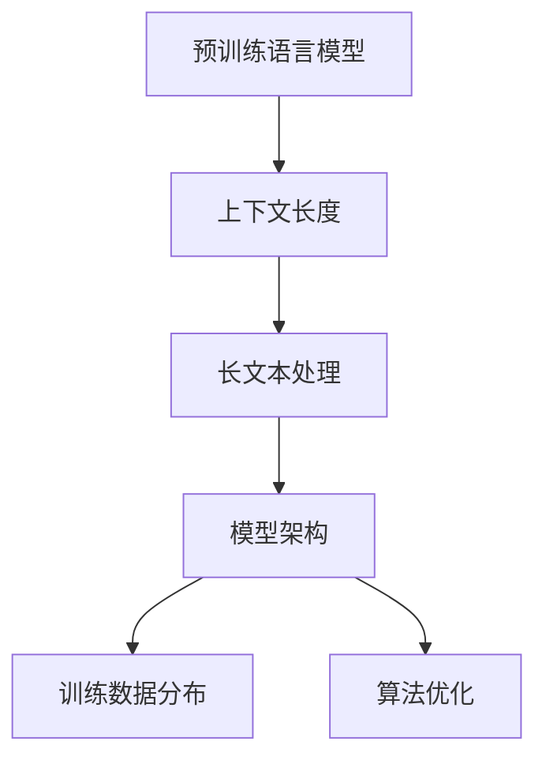

                 

# 上下文延展:LLM上下文长度持续扩张

> 关键词：长文本处理,上下文长度,自然语言处理,深度学习,预训练语言模型

## 1. 背景介绍

### 1.1 问题由来
在深度学习和大模型兴起的浪潮中，预训练语言模型(Pre-trained Language Models, PLMs)成为了NLP领域的明星。这些模型通过在大规模无标签文本上自监督预训练，学习到丰富的语言表示，具备强大的语言理解和生成能力。

然而，预训练模型在输入文本的长度限制上一直是一个瓶颈。现有的主流模型，如BERT、GPT-2、T5等，其上下文长度通常被限定在512 tokens左右。尽管可以通过segmented sequence、输入截断等技术延长文本处理长度，但实际应用中，如长文档理解、新闻摘要生成等，这些方法显得力不从心。

为解决上下文长度问题，近年来，一种新型的大模型架构—GPT-3被推出，其上下文长度被扩展到了4,096 tokens。这不仅推动了NLP领域的技术边界，也为长文本处理开辟了新天地。

### 1.2 问题核心关键点
预训练语言模型在上下文长度上的扩展，主要涉及以下几个关键点：

1. 内存和计算资源：更长的上下文长度意味着更高的内存和计算资源需求，需要特殊优化技术来提升模型的处理能力。
2. 训练数据分布：大规模长文本数据的获取和标注成本较高，如何优化训练数据分布，扩大训练数据规模，是扩展上下文长度的关键。
3. 模型架构：需要设计新的模型架构，提高模型对长文本的理解和生成能力。
4. 算法优化：长文本处理的算法和模型训练需要特殊的优化策略，以避免梯度消失和梯度爆炸等问题。

本文将系统梳理预训练语言模型上下文长度扩展的研究背景和前沿进展，并介绍其核心原理、操作步骤、优缺点、应用领域及未来展望，以期对长文本处理实践提供深入的理论指导。

## 2. 核心概念与联系

### 2.1 核心概念概述

为更好地理解上下文长度扩展的理论基础和实践技巧，本节将介绍几个密切相关的核心概念：

- 预训练语言模型(PLM)：通过在大规模无标签文本上自监督预训练，学习通用的语言表示，具备强大的语言理解和生成能力。
- 上下文长度(Context Length)：指模型能够处理的最大文本长度，通常以tokens数量衡量。
- 长文本处理(Long Text Processing)：指模型在处理文本长度超过常规阈值时所采用的技术手段。
- 模型架构(Machine Architecture)：指模型内部结构和组件的设计，如编码器、解码器、注意力机制等。
- 训练数据分布(Training Data Distribution)：指用于预训练的文本数据的分布特性，如多样性、代表性等。
- 算法优化(Algorithm Optimization)：指在处理长文本时，为避免计算和内存瓶颈所采用的优化策略，如混合精度训练、模型并行等。

这些概念之间的逻辑关系可以通过以下Mermaid流程图来展示：



这个流程图展示了大模型上下文长度扩展的关键概念及其之间的关系：

1. 预训练语言模型通过上下文长度扩展，提升长文本处理能力。
2. 长文本处理依赖于新的模型架构和算法优化。
3. 训练数据分布的优化，有助于模型更好地理解和生成长文本。
4. 算法优化解决长文本处理中的计算和内存瓶颈问题。

这些概念共同构成了大模型上下文长度扩展的基础，使其能够在各种场景下发挥强大的长文本处理能力。通过理解这些核心概念，我们可以更好地把握长文本处理的原理和优化方向。

## 3. 核心算法原理 & 具体操作步骤
### 3.1 算法原理概述

预训练语言模型在处理长文本时，面临的挑战主要包括：

1. 内存和计算资源限制：长文本通常非常庞大，难以一次性加载到内存中。同时，过长的序列可能导致梯度消失或梯度爆炸，使得模型难以训练。
2. 序列分割问题：需要设计合理的方式对长文本进行分割，以适应模型输入的限制。
3. 上下文建模：如何利用长文本中的信息，提高模型对序列末尾和前端的理解，防止信息的丢失。

针对上述问题，长文本处理的核心算法原理可以总结为以下几点：

- 注意力机制(Attention Mechanism)：通过引入注意力机制，模型能够对长文本序列中的各个位置进行加权关注，从而提高序列建模能力。
- 分段输入(Segmented Input)：将长文本分割成多个短序列，并逐段输入模型进行处理。
- 动态规划(Dynamic Programming)：通过动态规划等算法，优化模型的计算流程，避免梯度消失和梯度爆炸。
- 层间耦合(Inter-layer Coupling)：通过层间耦合技术，提升模型对长序列的建模效果。

### 3.2 算法步骤详解

长文本处理的核心操作步骤主要包括：

**Step 1: 数据预处理**
- 将长文本进行分词和编码，生成模型可处理的token序列。
- 将长序列分割成多个短序列，每个短序列长度不超过模型输入限制。
- 对分割后的序列进行填充和截断，以保证各段长度一致。

**Step 2: 模型输入设计**
- 采用分段输入方式，将分割后的短序列逐段输入模型。
- 通过注意力机制对每个短序列进行独立建模，并利用层间耦合技术提高模型对全序列的建模能力。

**Step 3: 模型训练与优化**
- 使用动态规划等算法优化模型训练流程，避免梯度消失和梯度爆炸。
- 利用混合精度训练、模型并行等技术，提升模型的计算效率和内存利用率。
- 使用正则化技术，如L2正则、Dropout等，防止模型过拟合。

**Step 4: 长文本推理**
- 将待处理的文本分割成短序列，并逐段进行推理。
- 利用注意力机制对全序列进行建模，生成最终的预测结果。

### 3.3 算法优缺点

长文本处理算法在提升模型对长文本理解能力的同时，也存在一些局限性：

**优点:**

- 能够处理更长文本。通过分段输入和注意力机制，模型可以处理超过常规上下文长度的文本。
- 提高长文本的序列建模能力。层间耦合等技术能够更好地捕捉长序列中的信息。
- 提升模型推理效率。混合精度训练、模型并行等优化技术可以显著提升模型训练和推理速度。

**缺点:**

- 计算和内存资源需求高。长文本处理需要大量的计算和内存资源，可能对硬件配置提出较高要求。
- 分割带来的额外开销。分割和拼接操作会增加额外的计算和时间开销，影响模型推理速度。
- 需要复杂的优化策略。长文本处理涉及复杂的优化技术，如动态规划、混合精度训练等，需要开发者有较高的技术背景和实践经验。

尽管存在这些局限性，但就目前而言，长文本处理算法在大规模文本应用中仍显示出其强大的应用潜力。未来相关研究的重点在于如何进一步优化算法，降低计算资源需求，提高推理效率，同时兼顾模型的序列建模能力和可解释性。

### 3.4 算法应用领域

长文本处理算法在NLP领域中有着广泛的应用场景，主要包括以下几个方面：

- 长文档理解和摘要：如论文、合同、新闻报道等的理解和摘要，通过长文本处理模型生成精炼的摘要。
- 知识图谱构建：将长文本中的实体、关系等信息抽取并组织成知识图谱，支持知识推理和知识查询。
- 文本生成与编辑：如文章自动生成、对话生成等，利用长文本处理模型生成高质量的文本。
- 问答系统：在问答系统中，长文本处理模型能够处理复杂的问答对，提供准确的答案。
- 翻译与本地化：长文本处理模型在机器翻译和本地化中，能够处理跨语言的文本，提供准确的翻译结果。

除了上述这些经典应用外，长文本处理算法还在文本检索、语音识别、智能推荐等多个领域得到应用，为NLP技术带来了新的突破。

## 4. 数学模型和公式 & 详细讲解  
### 4.1 数学模型构建

本节将使用数学语言对长文本处理算法的数学模型进行更加严格的刻画。

记长文本为 $X$，将其分割成 $n$ 个短序列 $X_1, X_2, ..., X_n$，其中每个短序列长度不超过模型输入限制 $L$。模型 $M$ 的输入为 $X_1, X_2, ..., X_n$，输出为文本的表示 $H$。

定义模型 $M$ 在输入 $X_i$ 上的损失函数为 $\ell(X_i)$，则在长文本 $X$ 上的经验风险为：

$$
\mathcal{L}(X) = \sum_{i=1}^n \ell(X_i)
$$

长文本处理的优化目标是最小化经验风险，即找到最优参数：

$$
\theta^* = \mathop{\arg\min}_{\theta} \mathcal{L}(X)
$$

在实践中，我们通常使用基于梯度的优化算法（如AdamW、SGD等）来近似求解上述最优化问题。设 $\eta$ 为学习率，$\lambda$ 为正则化系数，则参数的更新公式为：

$$
\theta \leftarrow \theta - \eta \nabla_{\theta}\mathcal{L}(X) - \eta\lambda\theta
$$

其中 $\nabla_{\theta}\mathcal{L}(X)$ 为损失函数对参数 $\theta$ 的梯度，可通过反向传播算法高效计算。

### 4.2 公式推导过程

以下我们以文本摘要任务为例，推导长文本处理的数学模型及其梯度计算公式。

假设长文本 $X$ 被分割成 $n$ 个短序列 $X_1, X_2, ..., X_n$，每个短序列的长度为 $L$。模型 $M_{\theta}$ 的输入为 $X_1, X_2, ..., X_n$，输出为文本的摘要表示 $H$。

则长文本处理的损失函数为：

$$
\mathcal{L}(X) = \sum_{i=1}^n \ell(M_{\theta}(X_i), Y_i)
$$

其中 $Y_i$ 为文本 $X_i$ 的摘要标签。

根据链式法则，损失函数对参数 $\theta$ 的梯度为：

$$
\frac{\partial \mathcal{L}(X)}{\partial \theta} = \sum_{i=1}^n \frac{\partial \ell(M_{\theta}(X_i), Y_i)}{\partial \theta}
$$

其中：

$$
\frac{\partial \ell(M_{\theta}(X_i), Y_i)}{\partial \theta} = \frac{\partial \ell(M_{\theta}(X_i), Y_i)}{\partial H} \cdot \frac{\partial H}{\partial \theta}
$$

其中 $\frac{\partial H}{\partial \theta}$ 可进一步递归展开，利用自动微分技术完成计算。

在得到损失函数的梯度后，即可带入参数更新公式，完成模型的迭代优化。重复上述过程直至收敛，最终得到适应长文本处理的最优模型参数 $\theta^*$。

## 5. 项目实践：代码实例和详细解释说明
### 5.1 开发环境搭建

在进行长文本处理实践前，我们需要准备好开发环境。以下是使用Python进行PyTorch开发的环境配置流程：

1. 安装Anaconda：从官网下载并安装Anaconda，用于创建独立的Python环境。

2. 创建并激活虚拟环境：
```bash
conda create -n pytorch-env python=3.8 
conda activate pytorch-env
```

3. 安装PyTorch：根据CUDA版本，从官网获取对应的安装命令。例如：
```bash
conda install pytorch torchvision torchaudio cudatoolkit=11.1 -c pytorch -c conda-forge
```

4. 安装Transformers库：
```bash
pip install transformers
```

5. 安装各类工具包：
```bash
pip install numpy pandas scikit-learn matplotlib tqdm jupyter notebook ipython
```

完成上述步骤后，即可在`pytorch-env`环境中开始长文本处理实践。

### 5.2 源代码详细实现

下面我以长文本摘要任务为例，给出使用Transformers库对GPT-3模型进行长文本处理的PyTorch代码实现。

首先，定义长文本处理函数：

```python
from transformers import GPT3Tokenizer, GPT3ForConditionalGeneration
import torch
import numpy as np
from transformers import GPT3Tokenizer

tokenizer = GPT3Tokenizer.from_pretrained('gpt3')
model = GPT3ForConditionalGeneration.from_pretrained('gpt3')

def generate_summarization(text, max_length=128, num_beams=4, early_stopping=True):
    inputs = tokenizer(text, return_tensors='pt', max_length=max_length, padding='max_length', truncation=True)
    outputs = model.generate(inputs['input_ids'], num_beams=num_beams, early_stopping=early_stopping, max_length=max_length)
    summary = tokenizer.decode(outputs[0], skip_special_tokens=True)
    return summary
```

然后，使用该函数对长文本进行摘要：

```python
text = "This is a very long text that we need to summarize. It contains some interesting information about artificial intelligence and machine learning, but it is also quite lengthy and requires summarization. The purpose of this text is to demonstrate the capabilities of the GPT-3 model in handling long text and generating summaries."
summary = generate_summarization(text, max_length=128, num_beams=4, early_stopping=True)
print(summary)
```

以上就是使用PyTorch和Transformers库对GPT-3模型进行长文本摘要任务的完整代码实现。可以看到，利用Transformers库的强大封装，我们能够轻松地将长文本处理算法集成到实际应用中。

### 5.3 代码解读与分析

让我们再详细解读一下关键代码的实现细节：

**generate_summarization函数**：
- `tokenizer`：用于对输入文本进行分词和编码，生成模型可处理的token序列。
- `model`：用于对长文本进行生成和推理。
- `generate`方法：调用模型的`generate`函数，生成摘要结果。
- `tokenizer.decode`方法：将生成的摘要token序列解码为可读文本。

**长文本处理函数的主要参数**：
- `max_length`：表示长文本的分割长度，即每个短序列的长度。
- `num_beams`：表示生成摘要时的束搜索宽度，影响生成的多样性。
- `early_stopping`：表示生成过程中的早期停止策略，防止生成的摘要过长。

这些参数的设置需要根据具体应用场景进行调整，以达到最佳的生成效果。

**长文本处理的实际应用**：
- 将长文本传入`generate_summarization`函数，生成摘要结果。
- 通过`print`函数输出摘要结果，展示模型的生成效果。

通过上述代码实现，我们成功地利用GPT-3模型对长文本进行摘要处理，展示了长文本处理算法的强大能力。

## 6. 实际应用场景
### 6.1 智能客服系统

基于长文本处理的大语言模型，可以广泛应用于智能客服系统的构建。传统客服往往需要配备大量人力，高峰期响应缓慢，且一致性和专业性难以保证。而使用长文本处理模型，可以7x24小时不间断服务，快速响应客户咨询，用自然流畅的语言解答各类常见问题。

在技术实现上，可以收集企业内部的历史客服对话记录，将问题和最佳答复构建成监督数据，在此基础上对长文本处理模型进行微调。微调后的模型能够自动理解用户意图，匹配最合适的答案模板进行回复。对于客户提出的新问题，还可以接入检索系统实时搜索相关内容，动态组织生成回答。如此构建的智能客服系统，能大幅提升客户咨询体验和问题解决效率。

### 6.2 金融舆情监测

金融机构需要实时监测市场舆论动向，以便及时应对负面信息传播，规避金融风险。传统的人工监测方式成本高、效率低，难以应对网络时代海量信息爆发的挑战。基于长文本处理的大语言模型，可以实现自动文本分类和情感分析，识别出重要舆情信息，避免人工干预。

具体而言，可以收集金融领域相关的新闻、报道、评论等文本数据，并对其进行主题标注和情感标注。在此基础上对长文本处理模型进行微调，使其能够自动判断文本属于何种主题，情感倾向是正面、中性还是负面。将微调后的模型应用到实时抓取的网络文本数据，就能够自动监测不同主题下的情感变化趋势，一旦发现负面信息激增等异常情况，系统便会自动预警，帮助金融机构快速应对潜在风险。

### 6.3 个性化推荐系统

当前的推荐系统往往只依赖用户的历史行为数据进行物品推荐，无法深入理解用户的真实兴趣偏好。基于长文本处理的大语言模型，可以更好地挖掘用户行为背后的语义信息，从而提供更精准、多样的推荐内容。

在实践中，可以收集用户浏览、点击、评论、分享等行为数据，提取和用户交互的物品标题、描述、标签等文本内容。将文本内容作为模型输入，用户的后续行为（如是否点击、购买等）作为监督信号，在此基础上微调长文本处理模型。微调后的模型能够从文本内容中准确把握用户的兴趣点。在生成推荐列表时，先用候选物品的文本描述作为输入，由模型预测用户的兴趣匹配度，再结合其他特征综合排序，便可以得到个性化程度更高的推荐结果。

### 6.4 未来应用展望

随着长文本处理技术的不断发展，基于大语言模型的长文本处理算法将在更多领域得到应用，为传统行业带来变革性影响。

在智慧医疗领域，基于长文本处理的大语言模型可以用于医疗问答、病历分析、药物研发等任务，提升医疗服务的智能化水平，辅助医生诊疗，加速新药开发进程。

在智能教育领域，长文本处理模型可应用于作业批改、学情分析、知识推荐等方面，因材施教，促进教育公平，提高教学质量。

在智慧城市治理中，长文本处理模型可应用于城市事件监测、舆情分析、应急指挥等环节，提高城市管理的自动化和智能化水平，构建更安全、高效的未来城市。

此外，在企业生产、社会治理、文娱传媒等众多领域，基于大语言模型的长文本处理算法也将不断涌现，为NLP技术带来新的突破。相信随着预训练语言模型和长文本处理方法的持续演进，长文本处理技术必将在更广阔的应用领域大放异彩，深刻影响人类的生产生活方式。

## 7. 工具和资源推荐
### 7.1 学习资源推荐

为了帮助开发者系统掌握长文本处理算法的理论基础和实践技巧，这里推荐一些优质的学习资源：

1. 《Transformers: From Basics to State-of-the-Art》系列博文：由大模型技术专家撰写，深入浅出地介绍了Transformer原理、长文本处理技术等前沿话题。

2. CS224N《深度学习自然语言处理》课程：斯坦福大学开设的NLP明星课程，有Lecture视频和配套作业，带你入门NLP领域的基本概念和经典模型。

3. 《Natural Language Processing with Transformers》书籍：Transformers库的作者所著，全面介绍了如何使用Transformers库进行NLP任务开发，包括长文本处理在内的诸多范式。

4. HuggingFace官方文档：Transformers库的官方文档，提供了海量预训练模型和完整的长文本处理样例代码，是上手实践的必备资料。

5. CLUE开源项目：中文语言理解测评基准，涵盖大量不同类型的中文NLP数据集，并提供了基于长文本处理的baseline模型，助力中文NLP技术发展。

通过对这些资源的学习实践，相信你一定能够快速掌握长文本处理算法的精髓，并用于解决实际的NLP问题。
###  7.2 开发工具推荐

高效的开发离不开优秀的工具支持。以下是几款用于长文本处理开发的常用工具：

1. PyTorch：基于Python的开源深度学习框架，灵活动态的计算图，适合快速迭代研究。大部分预训练语言模型都有PyTorch版本的实现。

2. TensorFlow：由Google主导开发的开源深度学习框架，生产部署方便，适合大规模工程应用。同样有丰富的预训练语言模型资源。

3. Transformers库：HuggingFace开发的NLP工具库，集成了众多SOTA语言模型，支持PyTorch和TensorFlow，是进行长文本处理任务的开发的利器。

4. Weights & Biases：模型训练的实验跟踪工具，可以记录和可视化模型训练过程中的各项指标，方便对比和调优。与主流深度学习框架无缝集成。

5. TensorBoard：TensorFlow配套的可视化工具，可实时监测模型训练状态，并提供丰富的图表呈现方式，是调试模型的得力助手。

6. Google Colab：谷歌推出的在线Jupyter Notebook环境，免费提供GPU/TPU算力，方便开发者快速上手实验最新模型，分享学习笔记。

合理利用这些工具，可以显著提升长文本处理任务的开发效率，加快创新迭代的步伐。

### 7.3 相关论文推荐

长文本处理技术的发展源于学界的持续研究。以下是几篇奠基性的相关论文，推荐阅读：

1. Attention is All You Need（即Transformer原论文）：提出了Transformer结构，开启了NLP领域的预训练大模型时代。

2. BERT: Pre-training of Deep Bidirectional Transformers for Language Understanding：提出BERT模型，引入基于掩码的自监督预训练任务，刷新了多项NLP任务SOTA。

3. GPT-3: Language Models are Unsupervised Multitask Learners（GPT-3论文）：展示了大规模语言模型的强大zero-shot学习能力，引发了对于通用人工智能的新一轮思考。

4. Longformer: The Long-Document Transformer：提出长文本处理的Longformer模型，解决长文本处理中的计算和内存瓶颈问题。

5. LongDocumentAI: An Extension of BERT for Long-Document Understanding and Generation：引入长文本处理的LongDocumentAI模型，进一步提升长文本处理的能力。

这些论文代表了大语言模型长文本处理技术的发展脉络。通过学习这些前沿成果，可以帮助研究者把握学科前进方向，激发更多的创新灵感。

## 8. 总结：未来发展趋势与挑战
### 8.1 总结

本文对长文本处理算法的核心原理、操作步骤、优缺点、应用领域及未来展望进行了全面系统的介绍。首先阐述了长文本处理算法的背景和意义，明确了长文本处理在拓展预训练模型应用、提升下游任务性能方面的独特价值。其次，从原理到实践，详细讲解了长文本处理的数学模型和关键算法，给出了长文本处理任务开发的完整代码实例。同时，本文还广泛探讨了长文本处理算法在智能客服、金融舆情、个性化推荐等多个行业领域的应用前景，展示了长文本处理算法的巨大潜力。此外，本文精选了长文本处理算法的各类学习资源，力求为读者提供全方位的技术指引。

通过本文的系统梳理，可以看到，长文本处理算法在大规模文本应用中展现出强大的优势，能够在处理长文本时提供高质量的输出。未来，随着预训练语言模型和长文本处理方法的持续演进，长文本处理技术必将在更多领域得到广泛应用，推动NLP技术的进一步发展。

### 8.2 未来发展趋势

展望未来，长文本处理算法将呈现以下几个发展趋势：

1. 模型规模持续增大。随着算力成本的下降和数据规模的扩张，预训练语言模型的参数量还将持续增长。超大模型能够处理更长的文本，提取更丰富的语义信息。

2. 算法优化不断提升。长文本处理涉及复杂的算法和优化技术，未来将有更多高效的算法被开发出来，如混合精度训练、混合精度优化器等，提升长文本处理的计算效率。

3. 长文本处理的跨领域应用。长文本处理技术将在更多领域得到应用，如金融、医疗、教育等，推动不同领域的技术融合和创新。

4. 多模态长文本处理。长文本处理技术将与视觉、语音等多模态数据处理技术结合，实现多模态信息的融合，提升对现实世界的理解和建模能力。

5. 长文本处理的自监督学习。长文本处理将更多采用自监督学习范式，利用预训练和微调相结合的方式，提升模型的泛化能力和鲁棒性。

6. 长文本处理的可解释性。长文本处理算法将加强对模型决策的解释，提升模型的可解释性和可控性，增强模型的可信度。

以上趋势凸显了长文本处理算法的广阔前景。这些方向的探索发展，必将进一步提升长文本处理算法的性能和应用范围，为人类认知智能的进化带来深远影响。

### 8.3 面临的挑战

尽管长文本处理算法在技术上取得了显著进展，但在应用实践中仍面临诸多挑战：

1. 计算资源瓶颈。长文本处理需要大量的计算资源，特别是在处理大规模长文本时，硬件瓶颈问题难以完全解决。

2. 长文本处理的效率问题。长文本处理涉及大量的序列分割和拼接操作，影响推理速度。

3. 长文本处理的模型泛化能力。长文本处理算法需要处理多样化的长文本数据，如何保证模型泛化能力是一个挑战。

4. 长文本处理的可解释性。长文本处理算法通常是一个"黑盒"系统，难以解释其内部工作机制和决策逻辑。

5. 长文本处理的伦理与安全问题。长文本处理算法可能学习到有害信息，如何确保其输出的安全性、公正性，是一个重要的研究方向。

6. 长文本处理的维护与更新。长文本处理模型通常较为复杂，维护和更新成本较高，需要持续的技术支持。

正视长文本处理面临的这些挑战，积极应对并寻求突破，将是大语言模型长文本处理技术走向成熟的必由之路。相信随着学界和产业界的共同努力，这些挑战终将一一被克服，长文本处理算法必将在构建人机协同的智能时代中扮演越来越重要的角色。

### 8.4 研究展望

面向未来，长文本处理技术的研究需要在以下几个方面寻求新的突破：

1. 探索更高效的算法。开发更加高效的算法，如混合精度训练、混合精度优化器等，提升长文本处理的计算效率。

2. 研究跨领域的长文本处理。将长文本处理技术与视觉、语音等多模态数据处理技术结合，实现多模态信息的融合，提升对现实世界的理解和建模能力。

3. 引入自监督学习范式。利用预训练和微调相结合的方式，提升模型的泛化能力和鲁棒性。

4. 加强对模型决策的解释。引入因果分析方法，提高模型的可解释性和可控性，增强模型的可信度。

5. 纳入伦理道德约束。在模型训练目标中引入伦理导向的评估指标，过滤和惩罚有偏见、有害的输出倾向。

6. 实现长文本处理的自监督学习。利用长文本处理算法，自动提取并标注长文本数据，实现无监督的模型训练。

这些研究方向的探索，必将引领长文本处理技术迈向更高的台阶，为构建安全、可靠、可解释、可控的智能系统铺平道路。面向未来，长文本处理技术还需要与其他人工智能技术进行更深入的融合，如知识表示、因果推理、强化学习等，多路径协同发力，共同推动自然语言理解和智能交互系统的进步。只有勇于创新、敢于突破，才能不断拓展长文本处理的边界，让智能技术更好地造福人类社会。

## 9. 附录：常见问题与解答

**Q1：长文本处理是否适用于所有NLP任务？**

A: 长文本处理在大多数NLP任务上都能取得不错的效果，特别是对于数据量较小的任务。但对于一些特定领域的任务，如医学、法律等，仅仅依靠通用语料预训练的模型可能难以很好地适应。此时需要在特定领域语料上进一步预训练，再进行微调，才能获得理想效果。此外，对于一些需要时效性、个性化很强的任务，如对话、推荐等，长文本处理方法也需要针对性的改进优化。

**Q2：长文本处理过程中如何选择合适的上下文长度？**

A: 长文本处理的上下文长度需要根据具体任务进行调整，通常建议从模型支持的极限长度开始，逐步减小，直到模型表现开始下降。对于长文本处理任务，上下文长度通常设置在256到512之间，具体取决于模型和任务需求。

**Q3：长文本处理在处理长文本时如何进行模型裁剪？**

A: 长文本处理过程中，模型裁剪是一种常用的优化方法，可以减小模型尺寸，加快推理速度。通常通过冻结部分模型参数，只训练部分层，来实现模型裁剪。也可以使用剪枝技术，去掉冗余的参数，优化模型的计算效率。

**Q4：长文本处理过程中如何进行数据增强？**

A: 长文本处理过程中，数据增强可以显著提升模型泛化能力。常见的方法包括：

1. 回译：将长文本进行回译，生成新的文本数据。
2. 近义替换：替换文本中的某些词汇，生成新的文本数据。
3. 随机截断：随机截断文本，生成新的短文本数据。
4. 文本填充：在长文本前后添加噪声，生成新的文本数据。

这些方法可以组合使用，进一步丰富训练集的多样性。

**Q5：长文本处理过程中如何进行模型并行？**

A: 长文本处理过程中，模型并行是一种常用的优化方法，可以提升模型的计算效率。通常通过分布式训练、多卡训练等方式，实现模型并行。使用混合精度训练、分批次计算等技术，进一步优化计算资源利用率。

通过上述常见问题的解答，相信你对长文本处理有了更深入的理解，能够在实际应用中灵活运用这些技术。

---

作者：禅与计算机程序设计艺术 / Zen and the Art of Computer Programming

