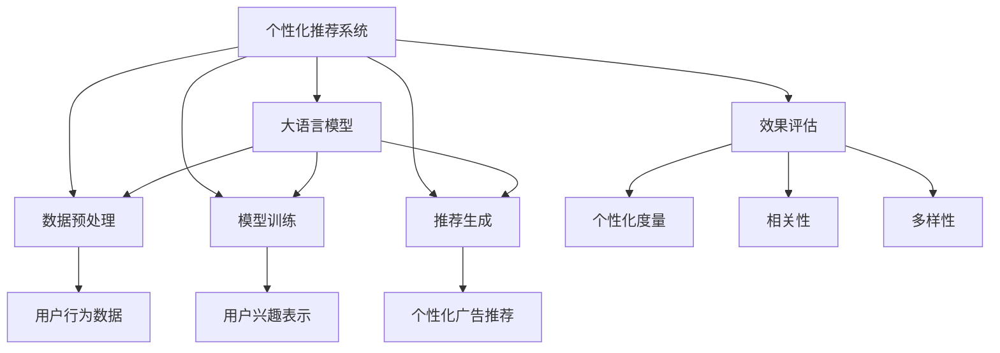

                 

# 个性化广告推荐: LLM的应用

> 关键词：自然语言处理(NLP),深度学习(Deep Learning),个性化推荐,广告推荐系统,大语言模型(Large Language Model, LLM)

## 1. 背景介绍

### 1.1 问题由来

随着互联网的普及和数字经济的兴起，广告推荐系统已成为电商、媒体、娱乐等领域中不可或缺的环节。广告推荐不仅直接影响到用户的购物体验和平台流量，还关系到广告主的品牌曝光和投放效果。然而，传统广告推荐系统往往基于静态特征进行匹配，难以捕捉用户的实时兴趣和行为动态变化。为了解决这一问题，业内开始探索基于用户行为和实时数据进行动态推荐的方法，个性化推荐技术由此应运而生。

个性化推荐系统通过分析用户历史行为数据和实时互动信息，对用户当前兴趣进行精准预测，从而推送个性化的广告内容，提升用户体验和转化率。这一过程中，需要运用NLP技术对用户评论、搜索历史等文本数据进行语义理解，提炼用户兴趣点，进行精准推荐。大语言模型（Large Language Model, LLM）的诞生为个性化推荐提供了新的可能，使推荐系统能够更深入地理解用户的自然语言需求，进一步提升广告效果。

### 1.2 问题核心关键点

个性化推荐的核心在于如何根据用户的历史行为和实时行为，动态生成个性化的广告推荐。大语言模型通过预训练学习到大量的语言知识，具备强大的语义理解能力，能够在用户评论、产品描述等文本数据中提取关键信息，识别出用户的兴趣点。结合用户行为数据，模型能够对用户兴趣进行更精准的预测和推荐。

具体而言，个性化推荐过程包括如下关键环节：
1. 数据预处理：收集用户的历史行为数据，清洗、标准化、提取特征。
2. 模型训练：基于用户行为数据和语义信息，对大语言模型进行微调，学习用户兴趣表示。
3. 推荐生成：根据用户当前行为和兴趣表示，生成个性化的广告推荐。
4. 效果评估：评估推荐结果的个性化、相关性和多样性，不断优化推荐算法。

本文将围绕以上核心环节，深入探讨基于大语言模型的个性化广告推荐技术，分析其在推荐系统中的应用和前景。

## 2. 核心概念与联系

### 2.1 核心概念概述

为更好地理解大语言模型在个性化推荐中的应用，本节将介绍几个密切相关的核心概念：

- 个性化推荐系统(Personalized Recommendation System, PRS)：根据用户的历史行为和实时反馈，对用户进行兴趣建模，动态生成个性化广告推荐。
- 大语言模型(Large Language Model, LLM)：以自回归或自编码模型为代表的大规模预训练语言模型。通过在大规模无标签文本语料上进行预训练，学习到丰富的语言知识，具备强大的语义理解能力。
- 自然语言处理(Natural Language Processing, NLP)：研究如何让计算机理解和生成自然语言的技术，包括文本分类、情感分析、实体识别等。
- 深度学习(Deep Learning)：一种基于神经网络的机器学习范式，能够学习到复杂的数据结构和关系，适用于处理大规模数据集。

这些核心概念之间的逻辑关系可以通过以下Mermaid流程图来展示：



这个流程图展示了大语言模型在个性化推荐中的核心概念及其之间的关系：

1. 个性化推荐系统通过数据预处理和模型训练环节，利用大语言模型的语义理解能力，构建用户兴趣表示。
2. 推荐生成环节，模型根据用户兴趣表示和实时行为数据，动态生成个性化广告推荐。
3. 效果评估环节，通过个性化度量、相关性和多样性指标，评估推荐结果，优化推荐算法。

## 3. 核心算法原理 & 具体操作步骤
### 3.1 算法原理概述

基于大语言模型的个性化广告推荐，本质上是一个有监督的迁移学习过程。其核心思想是：将预训练的大语言模型视作一个强大的"兴趣表示器"，通过在广告推荐数据上进行有监督的微调，使得模型能够准确预测用户对不同广告的兴趣，从而生成个性化的广告推荐。

形式化地，假设预训练模型为 $M_{\theta}$，其中 $\theta$ 为预训练得到的模型参数。给定广告推荐任务 $T$ 的标注数据集 $D=\{(x_i, y_i)\}_{i=1}^N$，其中 $x_i$ 为广告特征向量，$y_i$ 为广告相关性标签，推荐目标为最大化广告的相关性得分 $y_i$。微调的目标是找到新的模型参数 $\hat{\theta}$，使得：

$$
\hat{\theta}=\mathop{\arg\max}_{\theta} \mathcal{L}(M_{\theta},D)
$$

其中 $\mathcal{L}$ 为针对任务 $T$ 设计的损失函数，用于衡量模型预测输出与真实标签之间的差异。常见的损失函数包括交叉熵损失、均方误差损失等。

通过梯度下降等优化算法，微调过程不断更新模型参数 $\theta$，最大化损失函数 $\mathcal{L}$，使得模型输出逼近理想广告相关性得分 $y_i$。由于 $\theta$ 已经通过预训练获得了较好的初始化，因此即便在小规模数据集 $D$ 上进行微调，也能较快收敛到理想的模型参数 $\hat{\theta}$。

### 3.2 算法步骤详解

基于大语言模型的个性化广告推荐一般包括以下几个关键步骤：

**Step 1: 准备广告数据和模型**
- 收集用户的历史行为数据，如浏览、点击、购买等，构建广告推荐的数据集 $D$，其中每个样本 $x_i$ 包含广告的文本描述、图片、价格等特征，$y_i$ 为广告的相关性得分。
- 选择合适的预训练语言模型 $M_{\theta}$，如BERT、GPT等，作为初始化参数。

**Step 2: 设计任务适配层**
- 根据广告推荐任务，在预训练模型的顶层设计合适的输出层和损失函数。对于二分类任务，通常在顶层添加线性分类器和交叉熵损失函数。
- 对于多分类任务，如推荐不同类别的商品广告，可以使用softmax函数和交叉熵损失函数。

**Step 3: 设置微调超参数**
- 选择合适的优化算法及其参数，如 AdamW、SGD 等，设置学习率、批大小、迭代轮数等。
- 设置正则化技术及强度，包括权重衰减、Dropout、Early Stopping 等。
- 确定冻结预训练参数的策略，如仅微调顶层，或全部参数都参与微调。

**Step 4: 执行梯度训练**
- 将训练集数据分批次输入模型，前向传播计算损失函数。
- 反向传播计算参数梯度，根据设定的优化算法和学习率更新模型参数。
- 周期性在验证集上评估模型性能，根据性能指标决定是否触发 Early Stopping。
- 重复上述步骤直到满足预设的迭代轮数或 Early Stopping 条件。

**Step 5: 推荐生成与效果评估**
- 在测试集上评估微调后模型 $M_{\hat{\theta}}$ 的性能，对比微调前后的精度提升。
- 使用微调后的模型对新样本进行推理预测，生成个性化广告推荐。
- 持续收集新的广告数据，定期重新微调模型，以适应数据分布的变化。

以上是基于大语言模型的个性化广告推荐的一般流程。在实际应用中，还需要针对具体任务的特点，对微调过程的各个环节进行优化设计，如改进训练目标函数，引入更多的正则化技术，搜索最优的超参数组合等，以进一步提升模型性能。

### 3.3 算法优缺点

基于大语言模型的个性化广告推荐方法具有以下优点：
1. 多维度兴趣表示。大语言模型能够综合考虑广告文本、图片、价格等多个维度的特征，构建更全面、准确的用户兴趣表示。
2. 动态实时推荐。通过实时更新用户行为数据和语义信息，模型能够动态生成个性化推荐，提高广告的时效性和相关性。
3. 易于集成。大语言模型可以通过微调得到特定广告推荐任务的模型，方便集成到现有的推荐系统中。
4. 可解释性强。通过语义分析，用户可以直观理解推荐广告的来源和理由，提高信任度和满意度。

同时，该方法也存在一定的局限性：
1. 标注成本较高。广告推荐数据的标注需要高人力成本，且数据质量对模型效果有直接影响。
2. 模型复杂度较高。大语言模型参数量庞大，训练和推理资源消耗大，难以在边缘计算等资源受限的环境中使用。
3. 泛化能力有限。当目标任务与预训练数据的分布差异较大时，微调的性能提升有限。

尽管存在这些局限性，但就目前而言，基于大语言模型的广告推荐方法仍是广告推荐领域的研究热点之一。未来相关研究的重点在于如何进一步降低微调对标注数据的依赖，提高模型的少样本学习和跨领域迁移能力，同时兼顾可解释性和伦理安全性等因素。

### 3.4 算法应用领域

基于大语言模型的个性化广告推荐方法，在广告推荐、内容推荐、商品推荐等多个领域得到了广泛的应用，例如：

- 电商广告推荐：根据用户的浏览记录、购买历史等数据，为用户推荐相关商品广告。
- 视频广告推荐：分析用户的观影历史和评分，推荐符合用户兴趣的影片广告。
- 新闻推荐：根据用户的阅读记录和评论，为用户推荐相关新闻内容。
- 商品推荐：结合用户搜索历史、浏览记录等数据，为用户推荐相似商品。

除了上述这些经典应用外，大语言模型微调还被创新性地应用于智能客服、个性化搜索、智能游戏推荐等领域，为广告推荐技术带来了新的突破。随着大语言模型和广告推荐方法的持续演进，相信个性化广告推荐必将在更多领域中发挥更大的作用，推动广告行业的发展。

## 4. 数学模型和公式 & 详细讲解  
### 4.1 数学模型构建

本节将使用数学语言对基于大语言模型的个性化广告推荐过程进行更加严格的刻画。

记广告推荐模型为 $M_{\theta}$，其中 $\theta$ 为模型参数。假设广告推荐任务 $T$ 的训练集为 $D=\{(x_i, y_i)\}_{i=1}^N$，其中 $x_i$ 为广告特征向量，$y_i$ 为广告相关性得分。

定义模型 $M_{\theta}$ 在广告特征 $x$ 上的相关性得分函数为 $S_{\theta}(x)$，则在数据集 $D$ 上的经验风险为：

$$
\mathcal{L}(\theta) = \frac{1}{N}\sum_{i=1}^N [S_{\theta}(x_i)-y_i]^2
$$

微调的优化目标是最小化经验风险，即找到最优参数：

$$
\theta^* = \mathop{\arg\min}_{\theta} \mathcal{L}(\theta)
$$

在实践中，我们通常使用基于梯度的优化算法（如SGD、Adam等）来近似求解上述最优化问题。设 $\eta$ 为学习率，$\lambda$ 为正则化系数，则参数的更新公式为：

$$
\theta \leftarrow \theta - \eta \nabla_{\theta}\mathcal{L}(\theta) - \eta\lambda\theta
$$

其中 $\nabla_{\theta}\mathcal{L}(\theta)$ 为损失函数对参数 $\theta$ 的梯度，可通过反向传播算法高效计算。

### 4.2 公式推导过程

以下我们以二分类任务为例，推导交叉熵损失函数及其梯度的计算公式。

假设模型 $M_{\theta}$ 在广告特征 $x$ 上的输出为 $\hat{y}=M_{\theta}(x) \in [0,1]$，表示广告与用户相关性的概率。真实标签 $y \in \{0,1\}$。则二分类交叉熵损失函数定义为：

$$
\ell(M_{\theta}(x),y) = -[y\log \hat{y} + (1-y)\log (1-\hat{y})]
$$

将其代入经验风险公式，得：

$$
\mathcal{L}(\theta) = -\frac{1}{N}\sum_{i=1}^N [y_i\log S_{\theta}(x_i)+(1-y_i)\log(1-S_{\theta}(x_i))]
$$

根据链式法则，损失函数对参数 $\theta_k$ 的梯度为：

$$
\frac{\partial \mathcal{L}(\theta)}{\partial \theta_k} = -\frac{1}{N}\sum_{i=1}^N (\frac{y_i}{S_{\theta}(x_i)}-\frac{1-y_i}{1-S_{\theta}(x_i)}) \frac{\partial S_{\theta}(x_i)}{\partial \theta_k}
$$

其中 $\frac{\partial S_{\theta}(x_i)}{\partial \theta_k}$ 可进一步递归展开，利用自动微分技术完成计算。

在得到损失函数的梯度后，即可带入参数更新公式，完成模型的迭代优化。重复上述过程直至收敛，最终得到适应广告推荐任务的最优模型参数 $\theta^*$。

## 5. 项目实践：代码实例和详细解释说明
### 5.1 开发环境搭建

在进行个性化广告推荐微调实践前，我们需要准备好开发环境。以下是使用Python进行PyTorch开发的环境配置流程：

1. 安装Anaconda：从官网下载并安装Anaconda，用于创建独立的Python环境。

2. 创建并激活虚拟环境：
```bash
conda create -n pytorch-env python=3.8 
conda activate pytorch-env
```

3. 安装PyTorch：根据CUDA版本，从官网获取对应的安装命令。例如：
```bash
conda install pytorch torchvision torchaudio cudatoolkit=11.1 -c pytorch -c conda-forge
```

4. 安装Transformers库：
```bash
pip install transformers
```

5. 安装各类工具包：
```bash
pip install numpy pandas scikit-learn matplotlib tqdm jupyter notebook ipython
```

完成上述步骤后，即可在`pytorch-env`环境中开始微调实践。

### 5.2 源代码详细实现

下面我们以电商商品推荐为例，给出使用Transformers库对BERT模型进行个性化广告推荐微调的PyTorch代码实现。

首先，定义广告推荐任务的数据处理函数：

```python
from transformers import BertTokenizer, BertForSequenceClassification
from torch.utils.data import Dataset
import torch

class AdDataset(Dataset):
    def __init__(self, texts, labels, tokenizer, max_len=128):
        self.texts = texts
        self.labels = labels
        self.tokenizer = tokenizer
        self.max_len = max_len
        
    def __len__(self):
        return len(self.texts)
    
    def __getitem__(self, item):
        text = self.texts[item]
        label = self.labels[item]
        
        encoding = self.tokenizer(text, return_tensors='pt', max_length=self.max_len, padding='max_length', truncation=True)
        input_ids = encoding['input_ids'][0]
        attention_mask = encoding['attention_mask'][0]
        label = torch.tensor(label, dtype=torch.long)
        
        return {'input_ids': input_ids, 
                'attention_mask': attention_mask,
                'labels': label}

# 标签与id的映射
label2id = {'0': 0, '1': 1}
id2label = {v: k for k, v in label2id.items()}

# 创建dataset
tokenizer = BertTokenizer.from_pretrained('bert-base-cased')

train_dataset = AdDataset(train_texts, train_labels, tokenizer)
dev_dataset = AdDataset(dev_texts, dev_labels, tokenizer)
test_dataset = AdDataset(test_texts, test_labels, tokenizer)
```

然后，定义模型和优化器：

```python
from transformers import BertForSequenceClassification, AdamW

model = BertForSequenceClassification.from_pretrained('bert-base-cased', num_labels=len(label2id))

optimizer = AdamW(model.parameters(), lr=2e-5)
```

接着，定义训练和评估函数：

```python
from torch.utils.data import DataLoader
from tqdm import tqdm
from sklearn.metrics import accuracy_score, precision_score, recall_score

device = torch.device('cuda') if torch.cuda.is_available() else torch.device('cpu')
model.to(device)

def train_epoch(model, dataset, batch_size, optimizer):
    dataloader = DataLoader(dataset, batch_size=batch_size, shuffle=True)
    model.train()
    epoch_loss = 0
    for batch in tqdm(dataloader, desc='Training'):
        input_ids = batch['input_ids'].to(device)
        attention_mask = batch['attention_mask'].to(device)
        labels = batch['labels'].to(device)
        model.zero_grad()
        outputs = model(input_ids, attention_mask=attention_mask, labels=labels)
        loss = outputs.loss
        epoch_loss += loss.item()
        loss.backward()
        optimizer.step()
    return epoch_loss / len(dataloader)

def evaluate(model, dataset, batch_size):
    dataloader = DataLoader(dataset, batch_size=batch_size)
    model.eval()
    preds, labels = [], []
    with torch.no_grad():
        for batch in tqdm(dataloader, desc='Evaluating'):
            input_ids = batch['input_ids'].to(device)
            attention_mask = batch['attention_mask'].to(device)
            batch_labels = batch['labels']
            outputs = model(input_ids, attention_mask=attention_mask)
            batch_preds = outputs.logits.argmax(dim=2).to('cpu').tolist()
            batch_labels = batch_labels.to('cpu').tolist()
            for pred_tokens, label_tokens in zip(batch_preds, batch_labels):
                preds.append(pred_tokens[:len(label_tokens)])
                labels.append(label_tokens)
                
    print(f'Accuracy: {accuracy_score(labels, preds):.4f}')
    print(f'Precision: {precision_score(labels, preds):.4f}')
    print(f'Recall: {recall_score(labels, preds):.4f}')
```

最后，启动训练流程并在测试集上评估：

```python
epochs = 5
batch_size = 16

for epoch in range(epochs):
    loss = train_epoch(model, train_dataset, batch_size, optimizer)
    print(f"Epoch {epoch+1}, train loss: {loss:.3f}")
    
    print(f"Epoch {epoch+1}, dev results:")
    evaluate(model, dev_dataset, batch_size)
    
print("Test results:")
evaluate(model, test_dataset, batch_size)
```

以上就是使用PyTorch对BERT进行个性化广告推荐微调的完整代码实现。可以看到，得益于Transformers库的强大封装，我们可以用相对简洁的代码完成BERT模型的加载和微调。

### 5.3 代码解读与分析

让我们再详细解读一下关键代码的实现细节：

**AdDataset类**：
- `__init__`方法：初始化广告文本、标签、分词器等关键组件。
- `__len__`方法：返回数据集的样本数量。
- `__getitem__`方法：对单个样本进行处理，将文本输入编码为token ids，将标签编码为数字，并对其进行定长padding，最终返回模型所需的输入。

**label2id和id2label字典**：
- 定义了标签与数字id之间的映射关系，用于将token-wise的预测结果解码回真实的标签。

**训练和评估函数**：
- 使用PyTorch的DataLoader对数据集进行批次化加载，供模型训练和推理使用。
- 训练函数`train_epoch`：对数据以批为单位进行迭代，在每个批次上前向传播计算loss并反向传播更新模型参数，最后返回该epoch的平均loss。
- 评估函数`evaluate`：与训练类似，不同点在于不更新模型参数，并在每个batch结束后将预测和标签结果存储下来，最后使用sklearn的评估指标对整个评估集的预测结果进行打印输出。

**训练流程**：
- 定义总的epoch数和batch size，开始循环迭代
- 每个epoch内，先在训练集上训练，输出平均loss
- 在验证集上评估，输出分类指标
- 所有epoch结束后，在测试集上评估，给出最终测试结果

可以看到，PyTorch配合Transformers库使得BERT微调的代码实现变得简洁高效。开发者可以将更多精力放在数据处理、模型改进等高层逻辑上，而不必过多关注底层的实现细节。

当然，工业级的系统实现还需考虑更多因素，如模型的保存和部署、超参数的自动搜索、更灵活的任务适配层等。但核心的微调范式基本与此类似。

## 6. 实际应用场景
### 6.1 电商广告推荐

基于大语言模型的个性化广告推荐，在电商广告推荐中得到了广泛应用。传统电商广告推荐往往基于静态特征进行匹配，难以捕捉用户的实时兴趣和行为动态变化。利用大语言模型，可以根据用户的评论、浏览历史等文本数据，动态生成个性化的广告推荐。

在技术实现上，可以收集用户的评论、浏览记录、购买历史等文本数据，并对其进行语义理解，提炼用户兴趣点。在此基础上，对预训练语言模型进行微调，学习用户兴趣表示。结合用户行为数据，模型能够对用户兴趣进行更精准的预测和推荐。例如，某用户最近评论了多篇运动鞋相关产品，模型可以判断该用户对运动鞋感兴趣，从而在用户浏览运动鞋相关页面时，推荐该用户的感兴趣商品广告。

### 6.2 视频广告推荐

视频广告推荐系统能够根据用户的观影历史和评分，推荐符合用户兴趣的影片广告。视频平台通过分析用户的观影历史，构建视频相关性矩阵，使用大语言模型学习视频描述的语义表示。结合用户观影历史和评分，模型能够动态生成个性化视频广告推荐，提高广告的点击率和转化率。例如，某用户最近频繁观看科幻题材影片，模型可以预测该用户对科幻电影感兴趣，从而在推荐页面上展示相关科幻电影广告。

### 6.3 新闻推荐

新闻推荐系统能够根据用户的阅读记录和评论，推荐相关新闻内容。新闻平台通过分析用户的阅读历史和评论，使用大语言模型学习新闻内容的语义表示。结合用户阅读历史和评论，模型能够动态生成个性化新闻推荐，提升用户的阅读体验和粘性。例如，某用户最近频繁阅读科技新闻，模型可以预测该用户对科技新闻感兴趣，从而在推荐页面上展示相关科技新闻。

### 6.4 未来应用展望

随着大语言模型和广告推荐方法的不断演进，基于微调范式将在更多领域得到应用，为广告推荐技术带来新的突破。

在智慧医疗领域，基于微调的医疗推荐系统将根据患者的病历记录和评论，推荐合适的治疗方案和医疗资源。医疗平台通过分析患者的病历数据和评论，使用大语言模型学习疾病的语义表示。结合患者的病历数据和评论，模型能够动态生成个性化医疗推荐，提高诊疗效果。

在智能教育领域，基于微调的个性化推荐系统将根据学生的学习历史和反馈，推荐合适的学习资源和习题。教育平台通过分析学生的学习记录和反馈，使用大语言模型学习学科内容的语义表示。结合学生的学习历史和反馈，模型能够动态生成个性化推荐，提升学生的学习效果。

在智能城市治理中，基于微调的个性化推荐系统将根据市民的反馈和行为数据，推荐合适的城市服务和生活建议。城市管理平台通过分析市民的反馈和行为数据，使用大语言模型学习城市服务的语义表示。结合市民的反馈和行为数据，模型能够动态生成个性化推荐，提高城市治理效率。

此外，在企业生产、社会治理、文娱传媒等众多领域，基于大语言模型的个性化广告推荐也将不断涌现，为广告推荐技术带来新的应用场景和发展机遇。

## 7. 工具和资源推荐
### 7.1 学习资源推荐

为了帮助开发者系统掌握大语言模型在个性化推荐中的应用，这里推荐一些优质的学习资源：

1. 《深度学习与自然语言处理》系列博文：由大模型技术专家撰写，深入浅出地介绍了深度学习在自然语言处理中的应用，包括个性化推荐、情感分析等前沿话题。

2. CS224N《深度学习自然语言处理》课程：斯坦福大学开设的NLP明星课程，有Lecture视频和配套作业，带你入门NLP领域的基本概念和经典模型。

3. 《Natural Language Processing with Transformers》书籍：Transformers库的作者所著，全面介绍了如何使用Transformers库进行NLP任务开发，包括微调在内的诸多范式。

4. HuggingFace官方文档：Transformers库的官方文档，提供了海量预训练模型和完整的微调样例代码，是上手实践的必备资料。

5. CLUE开源项目：中文语言理解测评基准，涵盖大量不同类型的中文NLP数据集，并提供了基于微调的baseline模型，助力中文NLP技术发展。

通过对这些资源的学习实践，相信你一定能够快速掌握大语言模型在个性化推荐中的应用，并用于解决实际的广告推荐问题。
###  7.2 开发工具推荐

高效的开发离不开优秀的工具支持。以下是几款用于大语言模型个性化推荐微调开发的常用工具：

1. PyTorch：基于Python的开源深度学习框架，灵活动态的计算图，适合快速迭代研究。大部分预训练语言模型都有PyTorch版本的实现。

2. TensorFlow：由Google主导开发的开源深度学习框架，生产部署方便，适合大规模工程应用。同样有丰富的预训练语言模型资源。

3. Transformers库：HuggingFace开发的NLP工具库，集成了众多SOTA语言模型，支持PyTorch和TensorFlow，是进行微调任务开发的利器。

4. Weights & Biases：模型训练的实验跟踪工具，可以记录和可视化模型训练过程中的各项指标，方便对比和调优。与主流深度学习框架无缝集成。

5. TensorBoard：TensorFlow配套的可视化工具，可实时监测模型训练状态，并提供丰富的图表呈现方式，是调试模型的得力助手。

6. Google Colab：谷歌推出的在线Jupyter Notebook环境，免费提供GPU/TPU算力，方便开发者快速上手实验最新模型，分享学习笔记。

合理利用这些工具，可以显著提升大语言模型个性化推荐微调任务的开发效率，加快创新迭代的步伐。

### 7.3 相关论文推荐

大语言模型和个性化推荐技术的发展源于学界的持续研究。以下是几篇奠基性的相关论文，推荐阅读：

1. Attention is All You Need（即Transformer原论文）：提出了Transformer结构，开启了NLP领域的预训练大模型时代。

2. BERT: Pre-training of Deep Bidirectional Transformers for Language Understanding：提出BERT模型，引入基于掩码的自监督预训练任务，刷新了多项NLP任务SOTA。

3. Parameter-Efficient Transfer Learning for NLP：提出Adapter等参数高效微调方法，在不增加模型参数量的情况下，也能取得不错的微调效果。

4. A Survey on Deep Learning in Personalized Recommendation Systems：对深度学习在个性化推荐系统中的应用进行全面综述，涉及多个领域的经典算法和最新进展。

5. Personalized Recommendation with Attention-based Neural Networks：使用注意力机制增强推荐系统，提高推荐效果和用户满意度。

6. Neural Collaborative Filtering：基于神经网络的协同过滤推荐方法，能够处理稀疏数据和高维特征，适用于大规模推荐系统。

这些论文代表了大语言模型在个性化推荐技术的发展脉络。通过学习这些前沿成果，可以帮助研究者把握学科前进方向，激发更多的创新灵感。

## 8. 总结：未来发展趋势与挑战

### 8.1 总结

本文对基于大语言模型的个性化广告推荐方法进行了全面系统的介绍。首先阐述了大语言模型和个性化推荐系统的研究背景和意义，明确了两者结合的理论基础和实际价值。其次，从原理到实践，详细讲解了基于大语言模型的个性化广告推荐过程，包括数据预处理、模型训练、推荐生成和效果评估等关键步骤。同时，本文还广泛探讨了该方法在电商、视频、新闻等多个行业领域的应用前景，展示了其在广告推荐中的巨大潜力。

通过本文的系统梳理，可以看到，基于大语言模型的个性化广告推荐方法不仅能够大幅提升广告的效果，还能实现动态实时推荐，满足用户的多样化需求。未来，伴随大语言模型和广告推荐方法的持续演进，该技术必将在更多领域中发挥更大的作用，推动广告行业的变革。

### 8.2 未来发展趋势

展望未来，基于大语言模型的个性化广告推荐技术将呈现以下几个发展趋势：

1. 多维特征融合。未来推荐系统将更加注重多维度特征的融合，如行为数据、社交关系、文本数据等。大语言模型能够综合处理多模态数据，提供更全面、准确的个性化推荐。

2. 自适应推荐模型。未来的推荐系统将更加注重模型的自适应能力，能够根据用户行为和环境变化动态调整推荐策略。基于大语言模型的自适应推荐模型将更具灵活性和弹性。

3. 跨领域迁移学习。推荐系统将更加注重模型的跨领域迁移能力，能够在不同领域和场景中实现知识迁移。大语言模型具备良好的泛化能力，可以应用于更多领域的推荐系统。

4. 模型轻量化与边缘计算。随着硬件资源的多样化，推荐系统将更加注重模型的轻量化和边缘计算能力，能够在低资源环境下实现高效推荐。基于大语言模型的轻量化推荐模型将具有更强的可部署性和可扩展性。

5. 隐私保护与用户权益保障。随着用户隐私意识的增强，推荐系统将更加注重隐私保护和用户权益保障。基于大语言模型的推荐系统将采用更严格的隐私保护措施，保障用户数据安全和隐私权益。

以上趋势凸显了大语言模型在个性化推荐中的广阔前景。这些方向的探索发展，必将进一步提升推荐系统的性能和应用范围，为广告推荐行业带来新的突破。

### 8.3 面临的挑战

尽管基于大语言模型的个性化广告推荐技术已经取得了显著成果，但在迈向更加智能化、普适化应用的过程中，仍面临诸多挑战：

1. 数据隐私与安全。个性化广告推荐系统需要收集和处理大量的用户数据，如何保护用户隐私和数据安全，避免数据泄露和滥用，将是未来推荐系统的重要挑战。

2. 数据稀疏与冷启动问题。对于新用户和新商品，推荐系统往往面临数据稀疏和冷启动问题，难以准确预测用户兴趣。如何有效利用数据和模型进行预训练，缓解这些问题，需要进一步研究。

3. 模型复杂度与计算资源。大语言模型参数量庞大，训练和推理资源消耗大，难以在边缘计算等资源受限的环境中使用。如何降低模型复杂度，提高资源利用率，仍是未来需要解决的难题。

4. 模型可解释性与透明性。个性化广告推荐系统涉及用户隐私和行为决策，模型需要具备更强的可解释性和透明性，方便用户理解和信任。如何提高模型的可解释性，增强用户信任，也是未来需要研究的课题。

5. 推荐公平性与多样性。个性化广告推荐系统需要保证推荐结果的公平性和多样性，避免推荐偏倚和信息孤岛。如何设计更公平、更多样化的推荐策略，避免推荐偏见，仍需深入研究。

6. 推荐系统伦理与责任。随着推荐系统的广泛应用，如何确保系统的伦理性和责任性，避免算法滥用和负面影响，也是未来需要关注的重要问题。

这些挑战需要学术界、工业界和政策制定者共同努力，才能确保大语言模型在个性化推荐中的公平性、透明性和安全性，构建一个安全、可靠、可解释、可控的智能推荐系统。

### 8.4 研究展望

面向未来，大语言模型在个性化广告推荐领域的研究需要关注以下几个方向：

1. 多模态深度推荐。未来的推荐系统将更加注重多模态数据的融合，如行为数据、文本数据、社交数据等。大语言模型可以综合处理多模态数据，提供更全面、准确的个性化推荐。

2. 自适应推荐模型。未来的推荐系统将更加注重模型的自适应能力，能够根据用户行为和环境变化动态调整推荐策略。基于大语言模型的自适应推荐模型将更具灵活性和弹性。

3. 跨领域迁移学习。推荐系统将更加注重模型的跨领域迁移能力，能够在不同领域和场景中实现知识迁移。大语言模型具备良好的泛化能力，可以应用于更多领域的推荐系统。

4. 模型轻量化与边缘计算。随着硬件资源的多样化，推荐系统将更加注重模型的轻量化和边缘计算能力，能够在低资源环境下实现高效推荐。基于大语言模型的轻量化推荐模型将具有更强的可部署性和可扩展性。

5. 隐私保护与用户权益保障。随着用户隐私意识的增强，推荐系统将更加注重隐私保护和用户权益保障。基于大语言模型的推荐系统将采用更严格的隐私保护措施，保障用户数据安全和隐私权益。

6. 推荐公平性与多样性。个性化广告推荐系统需要保证推荐结果的公平性和多样性，避免推荐偏倚和信息孤岛。如何设计更公平、更多样化的推荐策略，避免推荐偏见，仍需深入研究。

7. 推荐系统伦理与责任。随着推荐系统的广泛应用，如何确保系统的伦理性和责任性，避免算法滥用和负面影响，也是未来需要关注的重要问题。

这些研究方向的探索，必将引领个性化广告推荐技术迈向更高的台阶，为广告推荐行业带来新的突破。面向未来，大语言模型微调技术还需要与其他人工智能技术进行更深入的融合，如知识表示、因果推理、强化学习等，多路径协同发力，共同推动个性化广告推荐系统的进步。只有勇于创新、敢于突破，才能不断拓展广告推荐系统的边界，让智能技术更好地造福用户。

## 9. 附录：常见问题与解答

**Q1：大语言模型微调是否适用于所有个性化广告推荐场景？**

A: 大语言模型微调在大多数个性化广告推荐场景中都能取得不错的效果，特别是对于数据量较小的场景。但对于一些特定领域的推荐任务，如专业领域的广告推荐，仅仅依靠通用语料预训练的模型可能难以很好地适应。此时需要在特定领域语料上进一步预训练，再进行微调，才能获得理想效果。

**Q2：微调过程中如何选择合适的学习率？**

A: 微调的学习率一般要比预训练时小1-2个数量级，如果使用过大的学习率，容易破坏预训练权重，导致过拟合。一般建议从1e-5开始调参，逐步减小学习率，直至收敛。也可以使用warmup策略，在开始阶段使用较小的学习率，再逐渐过渡到预设值。需要注意的是，不同的优化器(如AdamW、Adafactor等)以及不同的学习率调度策略，可能需要设置不同的学习率阈值。

**Q3：大语言模型在个性化广告推荐中存在哪些局限性？**

A: 大语言模型在个性化广告推荐中存在以下局限性：
1. 数据隐私与安全。个性化广告推荐系统需要收集和处理大量的用户数据，如何保护用户隐私和数据安全，避免数据泄露和滥用，将是未来推荐系统的重要挑战。
2. 数据稀疏与冷启动问题。对于新用户和新商品，推荐系统往往面临数据稀疏和冷启动问题，难以准确预测用户兴趣。如何有效利用数据和模型进行预训练，缓解这些问题，需要进一步研究。
3. 模型复杂度与计算资源。大语言模型参数量庞大，训练和推理资源消耗大，难以在边缘计算等资源受限的环境中使用。如何降低模型复杂度，提高资源利用率，仍是未来需要解决的难题。
4. 模型可解释性与透明性。个性化广告推荐系统涉及用户隐私和行为决策，模型需要具备更强的可解释性和透明性，方便用户理解和信任。如何提高模型的可解释性，增强用户信任，也是未来需要研究的课题。
5. 推荐公平性与多样性。个性化广告推荐系统需要保证推荐结果的公平性和多样性，避免推荐偏倚和信息孤岛。如何设计更公平、更多样化的推荐策略，避免推荐偏见，仍需深入研究。
6. 推荐系统伦理与责任。随着推荐系统的广泛应用，如何确保系统的伦理性和责任性，避免算法滥用和负面影响，也是未来需要关注的重要问题。

这些挑战需要学术界、工业界和政策制定者共同努力，才能确保大语言模型在个性化广告推荐中的公平性、透明性和安全性，构建一个安全、可靠、可解释、可控的智能推荐系统。

**Q4：推荐系统中如何处理数据稀疏与冷启动问题？**

A: 数据稀疏和冷启动问题是一般推荐系统面临的主要挑战之一，可以采用以下方法来解决：
1. 多源数据融合。将用户行为数据、社交网络数据、兴趣标签等多种数据源进行融合，增加数据的多样性和丰富度，提升模型的预测准确性。
2. 冷启动策略。对于新用户和新商品，可以使用基于用户兴趣推断、基于商品特征推断等多种策略进行初期推荐。例如，对于新用户，可以推荐平台上的热门商品，或基于用户行为历史进行推荐。
3. 预训练模型。使用大语言模型进行预训练，学习用户和商品的通用语义表示，提升模型的泛化能力和冷启动效果。在微调过程中，可以将预训练模型和用户行为数据结合起来，进行联合训练，进一步提升推荐效果。

这些方法需要根据具体的推荐场景和数据特点进行灵活选择，以综合提升推荐系统的性能和用户体验。

---

作者：禅与计算机程序设计艺术 / Zen and the Art of Computer Programming

