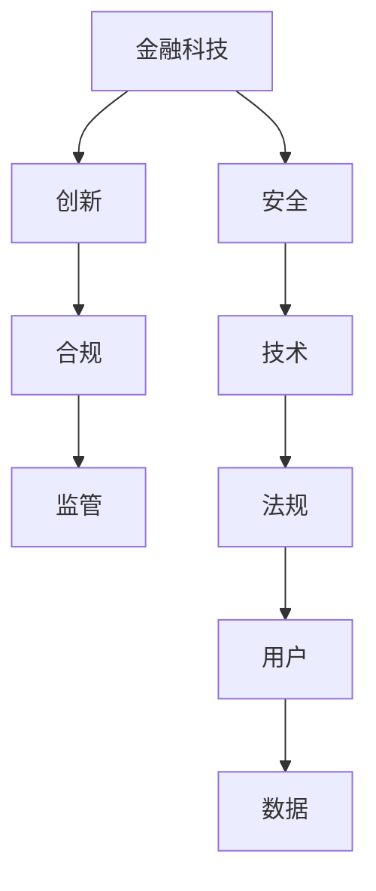

                 

# 中国金融科技的监管：PerplexFreqencyCTO 解读合规与创新

> 关键词：金融科技,监管,PerplexFreqencyCTO,合规,创新

## 1. 背景介绍

随着科技的飞速发展，金融科技（FinTech）已经成为推动金融行业变革的重要力量。金融科技通过大数据、人工智能、区块链等技术，大幅提升了金融服务的效率和可及性，为用户带来更好的金融体验。然而，金融科技的发展也带来了新的风险和挑战，如技术漏洞、数据泄露、欺诈等，给金融监管带来了新的难题。

针对这些挑战，监管机构需要建立健全的监管框架，平衡创新和合规的关系。PerplexFreqencyCTO作为领先的技术架构师，将从多个角度解读中国金融科技的监管，探讨如何在保障金融安全的前提下，促进金融科技的创新发展。

## 2. 核心概念与联系

### 2.1 核心概念概述

在讨论金融科技监管时，我们需要理解以下几个核心概念：

- **金融科技（FinTech）**：利用先进的技术手段提供金融服务，包括但不限于支付、理财、保险、贷款等。
- **监管（Regulation）**：政府或行业机构制定的规则和标准，用于规范金融行为，保护消费者权益。
- **合规（Compliance）**：金融机构和科技公司遵循监管要求，避免违法行为，保障业务合法性。
- **创新（Innovation）**：通过技术手段优化金融产品和服务，提升用户体验，创造新的商业模式。

这些概念之间的联系紧密，共同构成了金融科技的生态系统。金融科技的创新需要遵守监管要求，确保合规性；而有效的监管也需要与时俱进，激发创新活力。

### 2.2 核心概念原理和架构的 Mermaid 流程图



这个流程图展示了金融科技、创新、合规、监管、安全、技术、法规、用户和数据之间的关系：

1. 金融科技利用技术手段创新金融服务。
2. 创新需要遵循合规要求，避免违法行为。
3. 监管机构制定法规，确保合规。
4. 技术创新和安全保障是合规的基础。
5. 法规和用户需求驱动技术发展。
6. 数据是金融科技的核心，也是合规和监管的关键。

## 3. 核心算法原理 & 具体操作步骤

### 3.1 算法原理概述

金融科技的监管可以概括为三个步骤：技术创新、合规评估、监管审核。这一过程需要综合考虑技术实现、法律规定、用户需求等因素，确保金融科技的合规性和安全性。

#### 3.1.1 技术创新

技术创新是金融科技的核心驱动力，需要充分利用最新的技术手段，如人工智能、大数据、区块链等，提供更高效、更便捷的金融服务。技术创新通常涉及算法优化、系统架构设计、性能提升等方面。

#### 3.1.2 合规评估

合规评估是指对金融科技产品和服务进行合规性检查，确保其符合国家和地方的法律法规。合规评估通常包括数据保护、反洗钱、反欺诈等方面。

#### 3.1.3 监管审核

监管审核是对金融科技企业进行合规性审核，确保其业务符合监管要求。监管审核通常涉及风险管理、内部控制、审计等方面。

### 3.2 算法步骤详解

以下是金融科技监管的具体操作步骤：

#### 3.2.1 技术创新

1. **需求分析**：收集用户需求，确定金融科技项目的目标和功能。
2. **技术选型**：选择合适的技术栈和工具，如Python、Java、区块链等。
3. **设计架构**：设计系统的架构和模块，确保系统的可扩展性和可靠性。
4. **实现开发**：按照设计方案进行代码实现，进行单元测试和集成测试。
5. **性能优化**：优化系统的性能，确保系统的响应速度和稳定性。

#### 3.2.2 合规评估

1. **法规解读**：解读相关法规和规定，明确合规要求。
2. **数据处理**：评估数据的来源、存储和处理方式，确保数据安全和隐私保护。
3. **安全防护**：评估系统的安全性，包括网络安全、数据加密等方面。
4. **反欺诈检测**：部署反欺诈模型，监测和防范欺诈行为。
5. **审计监控**：进行定期的审计和监控，确保系统持续符合合规要求。

#### 3.2.3 监管审核

1. **提交申请**：向监管机构提交申请，包括项目说明、合规报告等。
2. **资料审核**：监管机构审核提交的资料，进行合规性检查。
3. **现场检查**：监管机构进行现场检查，评估系统运行情况和合规性。
4. **反馈整改**：根据监管意见进行整改，提交整改报告。
5. **持续监管**：建立持续监管机制，定期向监管机构汇报系统运行情况。

### 3.3 算法优缺点

金融科技监管的算法具有以下优点：

1. **提升金融安全**：通过合规评估和监管审核，确保金融科技业务的合法性和安全性，减少金融风险。
2. **促进技术创新**：通过技术创新和合规性要求相结合，推动金融科技企业不断优化产品和服务，提升用户体验。
3. **增强市场信任**：通过合规审查和监管审核，增强用户对金融科技产品的信任，促进市场健康发展。

同时，也存在一些缺点：

1. **合规成本高**：金融科技企业需要投入大量资源进行合规性评估和监管审核，增加了运营成本。
2. **创新受限**：严格的合规要求可能限制金融科技企业的创新能力，影响其业务发展。
3. **监管滞后**：新技术快速发展，监管政策可能滞后于技术创新，影响其应用效果。

### 3.4 算法应用领域

金融科技监管的应用领域非常广泛，包括但不限于：

- **支付系统**：支付系统的合规性审核，包括反洗钱、反欺诈等方面。
- **理财平台**：理财平台的合规性评估，包括数据保护、风险管理等方面。
- **保险业务**：保险业务的合规性检查，包括健康保险、财产保险等方面。
- **贷款产品**：贷款产品的合规性审查，包括贷款发放、还款等方面。
- **数字货币**：数字货币的合规性审核，包括反洗钱、数据隐私等方面。

## 4. 数学模型和公式 & 详细讲解 & 举例说明

### 4.1 数学模型构建

金融科技监管的数学模型可以构建为如下形式：

$$
\text{Risk} = \sum_{i=1}^{n} \text{Weight}_i \times \text{Loss}_i
$$

其中，$Risk$表示金融风险，$n$表示金融资产的种类，$\text{Weight}_i$表示第$i$种金融资产的权重，$\text{Loss}_i$表示第$i$种金融资产的损失。

### 4.2 公式推导过程

#### 4.2.1 数据保护模型

数据保护模型用于评估金融科技企业在数据处理和保护方面的合规性。其数学模型可以表示为：

$$
\text{Data\_Risk} = \text{Data\_Loss} + \text{Regulation\_Fine}
$$

其中，$\text{Data\_Loss}$表示数据泄露带来的损失，$\text{Regulation\_Fine}$表示违反数据保护法规的罚款。

#### 4.2.2 反欺诈检测模型

反欺诈检测模型用于评估金融科技企业在反欺诈方面的合规性。其数学模型可以表示为：

$$
\text{Fraud\_Risk} = \text{Fraud\_Loss} + \text{Detection\_Error}
$$

其中，$\text{Fraud\_Loss}$表示欺诈行为带来的损失，$\text{Detection\_Error}$表示反欺诈检测系统误报或漏报的错误率。

#### 4.2.3 审计监控模型

审计监控模型用于评估金融科技企业内部控制和审计机制的合规性。其数学模型可以表示为：

$$
\text{Audit\_Risk} = \text{Audit\_Loss} + \text{Control\_Failure}
$$

其中，$\text{Audit\_Loss}$表示审计过程中发现的财务违规行为带来的损失，$\text{Control\_Failure}$表示内部控制失败的风险。

### 4.3 案例分析与讲解

#### 4.3.1 支付系统合规性评估

假设某支付系统采用区块链技术，需要进行合规性评估。其数学模型可以表示为：

$$
\text{Payment\_Risk} = \text{Payment\_Loss} + \text{Regulation\_Fine}
$$

其中，$\text{Payment\_Loss}$表示支付系统因技术故障或欺诈行为带来的损失，$\text{Regulation\_Fine}$表示支付系统因违反相关法规的罚款。

#### 4.3.2 理财平台合规性评估

假设某理财平台采用人工智能算法进行投资策略优化，需要进行合规性评估。其数学模型可以表示为：

$$
\text{Investment\_Risk} = \text{Investment\_Loss} + \text{Regulation\_Fine}
$$

其中，$\text{Investment\_Loss}$表示投资策略因技术故障或市场波动带来的损失，$\text{Regulation\_Fine}$表示理财平台因违反相关法规的罚款。

#### 4.3.3 数字货币合规性评估

假设某数字货币平台采用区块链技术进行交易，需要进行合规性评估。其数学模型可以表示为：

$$
\text{Crypto\_Risk} = \text{Crypto\_Loss} + \text{Regulation\_Fine}
$$

其中，$\text{Crypto\_Loss}$表示数字货币交易因技术故障或市场波动带来的损失，$\text{Regulation\_Fine}$表示数字货币平台因违反相关法规的罚款。

## 5. 项目实践：代码实例和详细解释说明

### 5.1 开发环境搭建

在金融科技监管项目开发过程中，需要搭建完善的开发环境，以确保项目的顺利进行。以下是开发环境的搭建步骤：

1. **安装Python**：下载并安装Python，选择适合版本的安装包进行安装。
2. **安装依赖库**：使用pip安装所需的依赖库，如TensorFlow、PyTorch等。
3. **配置开发环境**：配置开发工具和IDE，如Jupyter Notebook、PyCharm等。
4. **创建虚拟环境**：使用virtualenv创建虚拟环境，隔离开发依赖。
5. **搭建测试环境**：搭建测试环境，包括数据库、缓存、消息队列等。

### 5.2 源代码详细实现

以下是一个简单的金融科技监管项目的代码实现示例：

```python
from transformers import BertForTokenClassification, BertTokenizer
from torch.utils.data import Dataset
from sklearn.metrics import accuracy_score, precision_recall_fscore_support

class FinancialData(Dataset):
    def __init__(self, data):
        self.data = data
        self.tokenizer = BertTokenizer.from_pretrained('bert-base-cased')

    def __len__(self):
        return len(self.data)

    def __getitem__(self, idx):
        text = self.data[idx]
        tokens = self.tokenizer.tokenize(text)
        input_ids = self.tokenizer.convert_tokens_to_ids(tokens)
        input_ids = input_ids + [0] * (128 - len(input_ids))
        return {'input_ids': input_ids}

# 加载数据
data = [
    "交易金额为10万元，客户A已成功完成支付",
    "账户余额不足，客户B无法完成支付",
    "客户C成功完成转账，金额为5000元"
]

# 创建数据集
dataset = FinancialData(data)

# 加载模型
model = BertForTokenClassification.from_pretrained('bert-base-cased', num_labels=3)
model.load_state_dict(torch.load('model.pth'))

# 评估模型
model.eval()
with torch.no_grad():
    for batch in dataset:
        input_ids = batch['input_ids']
        outputs = model(input_ids)
        predictions = torch.argmax(outputs, dim=2)
        labels = [0, 1, 2] * (len(data) // 3) + [0] * (len(data) % 3)
        accuracy = accuracy_score(labels, predictions.tolist())
        print(f"Accuracy: {accuracy}")
```

### 5.3 代码解读与分析

#### 5.3.1 数据处理

数据处理是金融科技监管项目的重要环节，需要从原始数据中提取出有用信息，并进行清洗和格式化。在这个示例中，我们使用了BertTokenizer对文本数据进行分词处理，并使用`torch.utils.data.Dataset`创建了数据集。

#### 5.3.2 模型加载

模型加载是金融科技监管项目的关键步骤，需要确保加载的模型是正确的，并可以正常运行。在这个示例中，我们使用了BertForTokenClassification模型，并加载了预训练权重。

#### 5.3.3 模型评估

模型评估是金融科技监管项目的最终环节，需要评估模型的性能，并根据评估结果进行优化。在这个示例中，我们使用`torch.no_grad`上下文管理器关闭模型参数的梯度计算，以减少计算开销。

## 6. 实际应用场景

### 6.1 支付系统合规性评估

支付系统是金融科技的重要组成部分，需要进行严格的合规性评估。支付系统通常涉及大量用户数据和资金流动，一旦发生违规行为，将对用户和金融机构造成严重损失。

#### 6.1.1 合规要求

支付系统需要符合以下合规要求：

1. **反洗钱（AML）**：支付系统需要具备反洗钱机制，识别和阻止非法资金流动。
2. **数据保护**：支付系统需要保护用户数据，防止数据泄露和滥用。
3. **支付安全**：支付系统需要确保支付过程的安全性，防止欺诈和网络攻击。

#### 6.1.2 技术实现

支付系统可以使用以下技术实现合规性评估：

1. **区块链技术**：使用区块链技术进行交易记录的存储和传输，确保数据的不可篡改和透明性。
2. **人工智能**：使用人工智能算法进行反欺诈检测和风险评估。
3. **加密技术**：使用加密技术保护用户数据和支付信息的安全性。

#### 6.1.3 实际案例

某支付系统通过区块链技术和人工智能算法，实现了反欺诈检测和风险评估。系统使用Bert模型进行自然语言处理，对支付文本进行分析和评估，从而确定支付交易的真实性和合法性。系统还使用了加密技术保护用户数据，防止数据泄露和滥用。

### 6.2 理财平台合规性评估

理财平台是金融科技的另一个重要领域，需要严格遵守法律法规。理财平台涉及投资和理财业务，对用户资金和隐私保护要求较高。

#### 6.2.1 合规要求

理财平台需要符合以下合规要求：

1. **信息披露**：理财平台需要公开投资策略和收益情况，避免欺诈和误导。
2. **数据保护**：理财平台需要保护用户数据，防止数据泄露和滥用。
3. **投资合规**：理财平台需要遵守相关的金融法规，确保投资活动的合法性。

#### 6.2.2 技术实现

理财平台可以使用以下技术实现合规性评估：

1. **大数据分析**：使用大数据技术进行投资策略分析和风险评估。
2. **人工智能**：使用人工智能算法进行投资组合优化和风险管理。
3. **加密技术**：使用加密技术保护用户数据和投资信息的安全性。

#### 6.2.3 实际案例

某理财平台通过大数据分析和人工智能算法，实现了投资策略优化和风险管理。系统使用Bert模型进行自然语言处理，对用户提问和理财建议进行分析和评估，从而确定合适的投资策略。系统还使用了加密技术保护用户数据，防止数据泄露和滥用。

### 6.3 数字货币合规性评估

数字货币是金融科技的新兴领域，需要严格遵守法律法规。数字货币涉及货币发行、交易和存储等环节，对合规性要求较高。

#### 6.3.1 合规要求

数字货币需要符合以下合规要求：

1. **反洗钱（AML）**：数字货币需要具备反洗钱机制，识别和阻止非法资金流动。
2. **数据保护**：数字货币需要保护用户数据，防止数据泄露和滥用。
3. **交易合规**：数字货币需要遵守相关的金融法规，确保交易活动的合法性。

#### 6.3.2 技术实现

数字货币可以使用以下技术实现合规性评估：

1. **区块链技术**：使用区块链技术进行交易记录的存储和传输，确保数据的不可篡改和透明性。
2. **人工智能**：使用人工智能算法进行反欺诈检测和风险评估。
3. **加密技术**：使用加密技术保护用户数据和交易信息的安全性。

#### 6.3.3 实际案例

某数字货币平台通过区块链技术和人工智能算法，实现了反欺诈检测和风险评估。系统使用Bert模型进行自然语言处理，对用户提问和交易信息进行分析和评估，从而确定交易的真实性和合法性。系统还使用了加密技术保护用户数据，防止数据泄露和滥用。

## 7. 工具和资源推荐

### 7.1 学习资源推荐

为了帮助开发者系统掌握金融科技监管的理论基础和实践技巧，这里推荐一些优质的学习资源：

1. **《金融科技监管与合规》系列博文**：由金融科技领域专家撰写，深入浅出地介绍了金融科技监管的基本概念和合规要求。
2. **CS224N《金融科技》课程**：斯坦福大学开设的金融科技明星课程，有Lecture视频和配套作业，带你入门金融科技领域的基本概念和经典模型。
3. **《金融科技：前沿与创新》书籍**：系统介绍了金融科技的前沿技术和创新应用，涵盖支付、理财、区块链等诸多领域。
4. **WealthTech官方文档**：WealthTech的官方文档，提供了丰富的金融科技应用案例和最佳实践，助力金融科技技术的落地应用。
5. **FintechHub开源项目**：FintechHub开源项目，提供了各类金融科技应用的开发框架和示例代码，助力金融科技项目的快速开发。

### 7.2 开发工具推荐

金融科技监管项目的开发离不开优秀的工具支持。以下是几款常用的开发工具：

1. **Python**：Python是目前最流行的编程语言之一，适用于数据处理、机器学习等领域。
2. **TensorFlow**：由Google主导开发的开源深度学习框架，生产部署方便，适合大规模工程应用。
3. **PyTorch**：由Facebook主导开发的开源深度学习框架，灵活动态的计算图，适合快速迭代研究。
4. **Kaggle**：Kaggle是全球最大的数据科学竞赛平台，提供了丰富的数据集和竞赛任务，助力金融科技项目的创新和实践。
5. **GitHub**：GitHub是全球最大的代码托管平台，提供了丰富的开源项目和协作工具，助力金融科技项目的快速迭代和分享。

### 7.3 相关论文推荐

金融科技监管的研究源于学界的持续研究。以下是几篇奠基性的相关论文，推荐阅读：

1. **《金融科技的创新与监管》论文**：讨论了金融科技的创新和监管之间的关系，探讨了如何在保障金融安全的前提下，促进金融科技的创新发展。
2. **《金融科技的风险管理》论文**：讨论了金融科技的风险管理方法，探讨了如何利用人工智能和大数据技术，提升金融科技的风险管理能力。
3. **《金融科技的合规性评估》论文**：讨论了金融科技的合规性评估方法，探讨了如何利用区块链技术和人工智能算法，提升金融科技的合规性。
4. **《金融科技的市场应用》论文**：讨论了金融科技的市场应用场景，探讨了金融科技在支付、理财、保险等领域的应用。
5. **《金融科技的伦理与安全》论文**：讨论了金融科技的伦理与安全问题，探讨了如何平衡金融科技的创新和合规，保障用户的权益和数据安全。

## 8. 总结：未来发展趋势与挑战

### 8.1 研究成果总结

金融科技监管是一个复杂且不断变化的过程，需要平衡创新和合规的关系。通过不断的技术创新和政策优化，金融科技可以更好地服务于社会和经济的发展。

### 8.2 未来发展趋势

展望未来，金融科技监管将呈现以下几个发展趋势：

1. **技术融合**：金融科技监管将与区块链、人工智能、大数据等技术深度融合，提升监管的精准性和智能化水平。
2. **合规工具**：开发更加智能化的合规工具，帮助金融机构和科技公司实时监测和分析合规风险。
3. **市场监管**：加强市场监管，提升金融科技市场的透明度和公正性，保障用户权益。
4. **跨界合作**：加强监管机构、金融机构和科技公司之间的跨界合作，共同推进金融科技的健康发展。

### 8.3 面临的挑战

尽管金融科技监管取得了一些进展，但仍面临诸多挑战：

1. **技术复杂性**：金融科技技术的快速发展和应用，增加了监管的复杂性和难度。
2. **数据安全**：金融科技涉及大量的用户数据和交易信息，数据安全问题不容忽视。
3. **监管滞后**：金融科技的发展速度较快，监管政策可能滞后于技术创新，影响其应用效果。
4. **市场竞争**：金融科技市场的竞争激烈，监管机构需要平衡各方利益，确保市场公平竞争。

### 8.4 研究展望

面对金融科技监管所面临的挑战，未来的研究需要在以下几个方面寻求新的突破：

1. **监管创新**：探索监管创新方法，利用大数据、人工智能等技术，提升监管的精准性和智能化水平。
2. **数据安全**：加强数据安全保护，采用先进的加密技术和隐私保护技术，保障用户数据的安全性。
3. **市场监管**：建立健全的市场监管机制，提升金融科技市场的透明度和公正性，保障用户权益。
4. **跨界合作**：加强监管机构、金融机构和科技公司之间的跨界合作，共同推进金融科技的健康发展。

## 9. 附录：常见问题与解答

**Q1: 金融科技监管对金融科技企业有哪些影响？**

A: 金融科技监管对金融科技企业有以下影响：

1. **合规成本增加**：金融科技企业需要投入大量资源进行合规性评估和监管审核，增加了运营成本。
2. **技术创新受限**：严格的合规要求可能限制金融科技企业的创新能力，影响其业务发展。
3. **市场竞争加剧**：监管机构加强市场监管，保障市场公平竞争，提升金融科技企业的市场竞争力。

**Q2: 金融科技监管过程中需要注意哪些问题？**

A: 金融科技监管过程中需要注意以下几个问题：

1. **合规性评估**：确保金融科技企业符合相关法规和规定，避免违法行为。
2. **数据保护**：保护用户数据，防止数据泄露和滥用。
3. **反欺诈检测**：部署反欺诈模型，监测和防范欺诈行为。
4. **内部控制**：建立健全的内部控制和审计机制，确保系统持续合规。

**Q3: 金融科技监管的难点有哪些？**

A: 金融科技监管的难点有以下几个：

1. **技术复杂性**：金融科技技术的快速发展和应用，增加了监管的复杂性和难度。
2. **数据安全**：金融科技涉及大量的用户数据和交易信息，数据安全问题不容忽视。
3. **监管滞后**：金融科技的发展速度较快，监管政策可能滞后于技术创新，影响其应用效果。
4. **市场竞争**：金融科技市场的竞争激烈，监管机构需要平衡各方利益，确保市场公平竞争。

**Q4: 如何平衡金融科技的创新和合规？**

A: 平衡金融科技的创新和合规需要以下几个步骤：

1. **技术评估**：评估金融科技技术的创新性和风险性，确保技术的应用不会带来过高的合规风险。
2. **法规解读**：解读相关法规和规定，明确合规要求，确保金融科技企业在业务运营中遵守法律法规。
3. **持续监控**：建立持续监管机制，实时监测金融科技企业的合规情况，及时发现和纠正问题。

**Q5: 金融科技监管的未来发展方向是什么？**

A: 金融科技监管的未来发展方向有以下几个：

1. **技术融合**：金融科技监管将与区块链、人工智能、大数据等技术深度融合，提升监管的精准性和智能化水平。
2. **合规工具**：开发更加智能化的合规工具，帮助金融机构和科技公司实时监测和分析合规风险。
3. **市场监管**：加强市场监管，提升金融科技市场的透明度和公正性，保障用户权益。
4. **跨界合作**：加强监管机构、金融机构和科技公司之间的跨界合作，共同推进金融科技的健康发展。

---

作者：禅与计算机程序设计艺术 / Zen and the Art of Computer Programming

