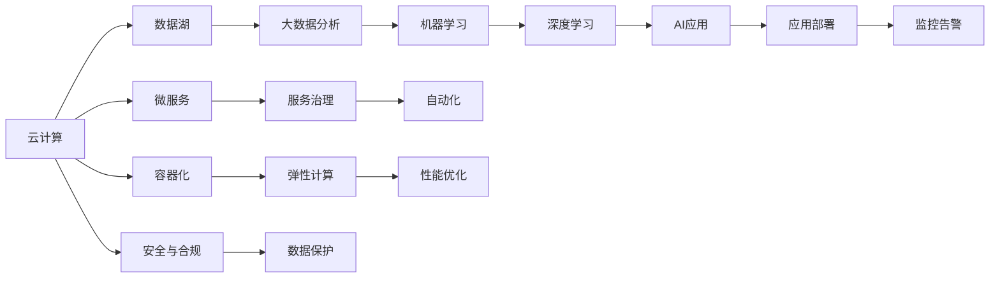

                 

# 云计算与AI的融合：Lepton AI的技术愿景

> 关键词：云计算, AI融合, Lepton AI, 云原生, 微服务, 数据湖, 自动化, 机器学习, 大数据, 容器化

## 1. 背景介绍

### 1.1 问题由来
在信息技术迅猛发展的今天，云计算和人工智能(AI)技术的融合已成为推动数字化转型的关键力量。云原生、微服务、数据湖、容器化等技术，为AI应用提供了高效、灵活、可扩展的基础设施。而人工智能则通过大数据分析、机器学习、深度学习等技术，赋予了云计算更多的智能和自动化能力。

人工智能与云计算的深度结合，不仅推动了传统行业的信息化升级，也催生了许多新的商业模式和应用场景。例如，智能客服、智能推荐、智能运维、智慧医疗等。然而，随着云上AI应用场景的不断扩展，对数据、模型、算力等资源的需求也日益增加。如何更高效地构建、管理和运行这些复杂的AI应用，成为云计算和AI领域亟需解决的问题。

### 1.2 问题核心关键点
云计算与AI融合的核心问题在于如何通过云平台构建高效、灵活、可扩展的AI应用基础设施。具体包括：
- 数据存储与处理：如何高效地存储、管理和分析大规模数据。
- 模型训练与推理：如何高效地构建、训练和部署AI模型。
- 服务治理与调度：如何有效地管理AI服务的生命周期，确保服务质量和可靠性。
- 性能优化与监控：如何实时监控和优化AI应用性能，保障业务连续性。

云计算和AI的融合，需要从基础设施、开发工具、运营管理等多个层面进行协同创新，构建端到端的AI应用生态系统。

### 1.3 问题研究意义
研究云计算与AI融合的理论与实践，对于推动云计算和AI技术的深度融合，提升云上AI应用的质量和效率，具有重要意义：

1. **降低成本**：通过云计算提供的弹性计算资源和按需计费模式，减少企业在硬件、软件和运维等方面的投入。
2. **提高效率**：利用云平台提供的自动化工具和微服务架构，快速构建和部署AI应用，缩短开发周期。
3. **增强灵活性**：基于云原生技术构建的AI应用，具备更好的扩展性和弹性，可以更灵活地应对业务变化。
4. **提升性能**：借助云计算平台的大规模计算能力和优化算法，提升AI应用的性能和可靠性。
5. **保障安全**：通过云平台的数据安全、身份认证和监控机制，保障AI应用的安全性和合规性。

## 2. 核心概念与联系

### 2.1 核心概念概述

云计算与AI融合涉及多个关键概念，这些概念之间的联系通过以下Mermaid流程图展示：



这个流程图展示出云计算和AI融合的主要概念及其相互关系：

1. 云计算提供弹性计算、数据存储、容器化等基础设施。
2. 数据湖和大数据分析技术，帮助企业积累和管理大规模数据。
3. 容器化技术，实现了AI应用的自动化部署和扩展。
4. 微服务架构，提升了AI应用的灵活性和可维护性。
5. 服务治理机制，保障AI应用的服务质量和可靠性。
6. 机器学习和深度学习技术，为AI应用提供智能推理和预测能力。
7. 自动化工具，提升了AI应用的开发、部署和运维效率。
8. 性能优化技术，保障AI应用的实时性和稳定性。
9. 安全与合规机制，保护AI应用的数据和隐私。
10. 监控告警系统，确保AI应用的连续性和健康运行。

这些核心概念共同构成了云计算与AI融合的基础框架，使得AI应用能够更高效、灵活、安全地运行在云上。

## 3. 核心算法原理 & 具体操作步骤
### 3.1 算法原理概述

云计算与AI融合的关键在于构建高效的AI应用基础设施，通过云计算提供的弹性计算资源和自动化工具，实现AI应用的快速构建、训练、部署和优化。

具体算法原理包括以下几个方面：

- **数据存储与处理**：利用数据湖和大数据分析技术，高效存储、管理和分析大规模数据。
- **模型训练与推理**：通过云计算的弹性计算能力，高效构建、训练和部署AI模型。
- **服务治理与调度**：基于微服务架构和服务治理机制，管理AI服务的生命周期，确保服务质量和可靠性。
- **性能优化与监控**：实时监控和优化AI应用性能，保障业务连续性。

### 3.2 算法步骤详解

云计算与AI融合的实现流程如下：

1. **数据收集与处理**：从业务系统和第三方数据源收集数据，利用数据湖和大数据分析技术进行清洗、转换和存储。
2. **模型构建与训练**：使用云计算提供的弹性计算资源，构建和训练AI模型。
3. **模型部署与应用**：利用容器化和微服务技术，将AI模型部署到云平台，实现服务化调用。
4. **服务治理与调度**：使用服务治理工具，管理AI服务的生命周期，实现自动化部署和更新。
5. **性能优化与监控**：通过监控告警系统，实时监控AI应用性能，进行调优和优化。
6. **安全与合规**：利用云计算平台的安全与合规机制，保护AI应用的数据和隐私。

### 3.3 算法优缺点

云计算与AI融合的算法具有以下优点：

- **高效灵活**：利用云计算的弹性计算和自动化工具，可以快速构建和部署AI应用。
- **成本低廉**：按需计费的模式降低了硬件和软件投入，提升了企业的IT成本效率。
- **高可用性**：云平台提供高可用性保障，确保AI应用和服务持续运行。
- **易扩展性**：云平台支持弹性扩展，可以根据业务需求动态调整资源配置。
- **低维护成本**：云平台提供自动化的运维服务，减少了人工运维成本和错误。

同时，该算法也存在一些缺点：

- **数据隐私**：在云上存储和管理数据，可能面临数据泄露和安全问题。
- **服务依赖**：对云平台的服务质量和稳定性高度依赖，一旦服务中断，可能影响业务连续性。
- **开发复杂度**：云计算和AI技术的融合，增加了应用的复杂度和开发难度。

### 3.4 算法应用领域

云计算与AI融合的应用领域广泛，涵盖了金融、医疗、零售、制造等多个行业。以下是几个典型的应用场景：

- **金融风险管理**：利用机器学习和深度学习技术，构建实时风险评估和预警系统。
- **智慧医疗**：通过大数据分析和AI模型，提升医疗影像诊断、疾病预测和治疗方案推荐能力。
- **智能制造**：利用AI技术优化生产流程、预测设备故障、提升产品质量。
- **智能客服**：利用自然语言处理和机器学习技术，提升客户服务效率和质量。
- **零售推荐**：通过用户行为分析和大数据技术，构建个性化推荐系统，提升销售转化率。
- **智能运维**：利用AI技术进行基础设施监控、故障预测和自动化运维，提升系统可靠性。

## 4. 数学模型和公式 & 详细讲解 & 举例说明
### 4.1 数学模型构建

云计算与AI融合的数学模型构建涉及多个方面，以下以机器学习模型的构建为例进行详细说明。

假设我们要构建一个基于机器学习的预测模型，用于预测用户购买行为。模型的输入为历史用户数据，输出为用户的购买行为。模型训练的目标是最小化预测误差，即：

$$
\min_{\theta} \sum_{i=1}^{n} (y_i - \hat{y}_i)^2
$$

其中，$y_i$ 为真实标签，$\hat{y}_i$ 为模型预测结果，$\theta$ 为模型参数。

### 4.2 公式推导过程

机器学习模型的推导过程主要涉及以下几个步骤：

1. **数据预处理**：对原始数据进行清洗、归一化、特征选择等预处理操作，得到训练数据集 $\{(x_i, y_i)\}_{i=1}^{n}$。
2. **模型选择**：选择合适的机器学习模型，如线性回归、决策树、随机森林等。
3. **模型训练**：使用训练数据集，通过梯度下降等优化算法，最小化损失函数，得到模型参数 $\theta$。
4. **模型评估**：使用测试数据集评估模型性能，常用的评估指标包括准确率、召回率、F1分数等。
5. **模型调优**：根据模型评估结果，调整模型参数，优化模型性能。

### 4.3 案例分析与讲解

以下以一个具体的案例来说明云计算与AI融合的应用过程。

假设我们要构建一个基于深度学习的推荐系统，用于推荐用户可能感兴趣的商品。模型的输入为用户的浏览记录、购买记录等历史数据，输出为用户可能感兴趣的商品列表。模型的训练过程如下：

1. **数据收集与处理**：从电商平台收集用户历史数据，进行清洗、归一化等预处理操作，构建训练数据集 $\{(x_i, y_i)\}_{i=1}^{n}$，其中 $x_i$ 为用户历史数据，$y_i$ 为用户感兴趣的商品列表。
2. **模型构建与训练**：使用深度学习模型，如卷积神经网络(CNN)、循环神经网络(RNN)等，构建推荐模型。在云计算平台上，利用弹性计算资源，使用反向传播算法进行模型训练，最小化损失函数。
3. **模型部署与应用**：利用容器化和微服务技术，将训练好的模型部署到云平台，实现服务化调用。
4. **服务治理与调度**：使用服务治理工具，管理推荐服务的生命周期，实现自动化部署和更新。
5. **性能优化与监控**：通过监控告警系统，实时监控推荐服务性能，进行调优和优化。
6. **安全与合规**：利用云计算平台的安全与合规机制，保护用户数据和隐私。

## 5. 项目实践：代码实例和详细解释说明
### 5.1 开发环境搭建

云计算与AI融合的项目开发需要一定的技术栈和工具支持。以下是开发环境搭建的步骤：

1. **安装云计算平台**：安装AWS、阿里云、华为云等云平台的SDK和CLI工具，如AWS CLI、阿里云SDK等。
2. **安装数据处理工具**：安装Apache Hadoop、Apache Spark、Pandas等数据处理工具，用于大数据分析。
3. **安装机器学习框架**：安装TensorFlow、PyTorch、Scikit-learn等机器学习框架，用于构建和训练AI模型。
4. **安装容器化工具**：安装Docker、Kubernetes等容器化工具，用于应用部署和扩展。
5. **安装自动化工具**：安装Ansible、Jenkins、CI/CD等自动化工具，用于持续集成和部署。
6. **安装监控告警工具**：安装Prometheus、Grafana等监控告警工具，用于性能监控和优化。

### 5.2 源代码详细实现

下面以TensorFlow为例，展示如何在云计算平台上构建和训练一个简单的机器学习模型。

首先，定义模型的输入和输出：

```python
import tensorflow as tf

# 定义输入
input_tensor = tf.keras.layers.Input(shape=(input_dim,))

# 定义模型
hidden_layer = tf.keras.layers.Dense(hidden_dim, activation='relu')(input_tensor)
output_tensor = tf.keras.layers.Dense(output_dim, activation='softmax')(hidden_layer)

# 定义模型结构
model = tf.keras.Model(inputs=input_tensor, outputs=output_tensor)
```

然后，定义模型的训练过程：

```python
# 定义损失函数
loss_function = tf.keras.losses.CategoricalCrossentropy()

# 定义优化器
optimizer = tf.keras.optimizers.Adam(learning_rate=learning_rate)

# 定义评估指标
evaluation_function = tf.keras.metrics.CategoricalAccuracy()

# 编译模型
model.compile(loss=loss_function, optimizer=optimizer, metrics=evaluation_function)

# 训练模型
model.fit(x_train, y_train, epochs=num_epochs, batch_size=batch_size)
```

最后，将训练好的模型部署到云平台：

```python
# 定义模型保存路径
model.save(model_path)

# 部署模型
deploy_model_to_cloud(model_path, endpoint)
```

### 5.3 代码解读与分析

让我们再详细解读一下关键代码的实现细节：

**模型定义**：
- 使用TensorFlow的Keras API，定义输入层、隐藏层和输出层。
- 隐藏层使用ReLU激活函数，输出层使用softmax函数，用于多分类任务。

**模型编译**：
- 定义损失函数为交叉熵损失，优化器为Adam，评估指标为准确率。
- 使用`compile`方法编译模型，指定损失函数、优化器和评估指标。

**模型训练**：
- 使用`fit`方法训练模型，指定训练数据、训练轮数、批次大小等参数。
- 使用回调函数进行模型保存和评估，记录训练过程中的损失和准确率。

**模型部署**：
- 使用`save`方法保存训练好的模型，以便后续部署。
- 使用云平台提供的API，将模型部署到指定端点，供其他服务调用。

以上代码展示了在云计算平台上构建和训练一个简单的机器学习模型的全流程。可以看到，通过云计算提供的弹性计算和自动化工具，模型的构建和训练过程变得简单高效。

## 6. 实际应用场景
### 6.1 金融风险管理

在金融领域，基于云计算与AI融合的技术，可以构建实时风险评估和预警系统。具体应用场景包括：

- **信用风险评估**：利用机器学习和大数据分析技术，对客户的信用行为进行分析，评估其信用风险。
- **市场风险预警**：通过预测模型，实时监控市场动态，预警潜在的市场风险。
- **欺诈检测**：利用异常检测模型，识别和防止金融欺诈行为。

### 6.2 智慧医疗

在医疗领域，基于云计算与AI融合的技术，可以提升医疗影像诊断、疾病预测和治疗方案推荐能力。具体应用场景包括：

- **医学影像诊断**：利用深度学习模型，对医学影像进行自动分析和诊断，提升诊断速度和准确率。
- **疾病预测**：通过大数据分析和机器学习技术，预测患者的疾病风险和患病概率。
- **治疗方案推荐**：根据患者的病情和历史数据，推荐最适合的治疗方案。

### 6.3 智能制造

在制造领域，基于云计算与AI融合的技术，可以优化生产流程、预测设备故障、提升产品质量。具体应用场景包括：

- **生产流程优化**：利用机器学习模型，优化生产工艺和流程，提升生产效率。
- **设备故障预测**：通过预测模型，实时监控设备状态，预测设备故障，提前进行维护。
- **质量控制**：利用图像识别和机器学习技术，自动检测产品缺陷，提升产品质量。

### 6.4 智能客服

在客服领域，基于云计算与AI融合的技术，可以构建智能客服系统，提升客户服务效率和质量。具体应用场景包括：

- **智能问答**：利用自然语言处理和机器学习技术，自动回答客户咨询，提高客户满意度。
- **情绪识别**：通过情感分析模型，识别客户情绪，提升服务质量和用户体验。
- **多渠道整合**：将电话、邮件、社交媒体等多渠道客服系统整合，提升客户体验。

### 6.5 零售推荐

在零售领域，基于云计算与AI融合的技术，可以构建个性化推荐系统，提升销售转化率。具体应用场景包括：

- **用户行为分析**：利用大数据分析和机器学习技术，分析用户行为数据，挖掘用户兴趣和需求。
- **商品推荐**：根据用户兴趣和行为数据，推荐用户可能感兴趣的商品。
- **库存管理**：通过预测模型，优化库存管理和供应链管理，提升运营效率。

## 7. 工具和资源推荐
### 7.1 学习资源推荐

为了帮助开发者系统掌握云计算与AI融合的理论与实践，以下是一些优质的学习资源：

1. **《云计算与AI融合实践》书籍**：该书系统介绍了云计算与AI融合的原理和实践，包含多个实际案例，适合开发者和研究者。
2. **《机器学习实战》系列课程**：Coursera等平台提供的机器学习课程，涵盖了从基础到高级的机器学习知识，适合初学者和进阶者。
3. **《TensorFlow实战》书籍**：该书详细介绍了TensorFlow的使用方法和案例，适合TensorFlow开发者。
4. **《Kubernetes实战》书籍**：该书详细介绍了Kubernetes的使用方法和案例，适合Kubernetes开发者。
5. **《微服务架构》课程**：Udemy等平台提供的微服务架构课程，涵盖了微服务的设计、开发和部署，适合开发者和架构师。

通过这些学习资源，可以全面掌握云计算与AI融合的理论与实践，提升开发和应用能力。

### 7.2 开发工具推荐

云计算与AI融合的开发需要多方面的工具支持，以下是一些常用的工具：

1. **AWS CLI**：AWS的命令行工具，用于管理云资源和服务。
2. **阿里云SDK**：阿里云的SDK工具，用于管理云资源和服务。
3. **Hadoop**：大数据处理工具，用于大规模数据的存储和处理。
4. **Spark**：大数据处理框架，用于分布式数据处理和计算。
5. **TensorFlow**：机器学习和深度学习框架，用于构建和训练AI模型。
6. **Kubernetes**：容器编排工具，用于应用部署和扩展。
7. **Prometheus**：监控工具，用于实时监控应用性能。
8. **Grafana**：可视化工具，用于展示监控数据和指标。
9. **Ansible**：自动化工具，用于持续集成和部署。

合理利用这些工具，可以显著提升云计算与AI融合任务的开发效率，加快创新迭代的步伐。

### 7.3 相关论文推荐

云计算与AI融合技术的发展源于学界的持续研究。以下是几篇奠基性的相关论文，推荐阅读：

1. **《云计算与AI融合技术综述》**：系统综述了云计算与AI融合的关键技术和应用场景。
2. **《大数据与AI融合的挑战与机遇》**：讨论了大数据与AI融合的挑战和机遇，提出了多种解决方案。
3. **《微服务架构在云计算中的应用》**：介绍了微服务架构在云计算中的应用，讨论了其优势和挑战。
4. **《基于容器化的AI应用构建与部署》**：讨论了容器化技术在AI应用构建与部署中的应用，提出了多种优化方法。
5. **《云计算与AI融合的安全与隐私保护》**：讨论了云计算与AI融合的安全和隐私保护问题，提出了多种解决方案。

这些论文代表了大数据与AI融合技术的发展脉络，通过学习这些前沿成果，可以帮助研究者把握学科前进方向，激发更多的创新灵感。

## 8. 总结：未来发展趋势与挑战
### 8.1 研究成果总结

云计算与AI融合技术的研究已经取得了诸多成果，涵盖了云计算基础设施、数据存储与处理、模型训练与推理、服务治理与调度、性能优化与监控等多个方面。以下是一些关键的研究成果：

1. **弹性计算与资源管理**：云计算平台提供了弹性计算和资源管理能力，能够根据业务需求动态调整资源配置。
2. **数据湖与大数据分析**：数据湖和大数据分析技术，高效存储和管理大规模数据，为AI应用提供数据支持。
3. **模型构建与训练**：基于云计算的弹性计算能力，可以高效构建和训练AI模型，提升模型性能。
4. **服务治理与调度**：微服务架构和服务治理机制，实现了AI服务的自动化部署和更新，提升了服务质量和可靠性。
5. **性能优化与监控**：实时监控和优化AI应用性能，保障业务连续性。
6. **安全与合规**：利用云计算平台的安全与合规机制，保护数据和隐私。

这些研究成果为云计算与AI融合的应用提供了坚实的理论基础和技术支持。

### 8.2 未来发展趋势

云计算与AI融合技术的发展前景广阔，未来将呈现以下几个趋势：

1. **AI原生云平台**：云计算平台将更加原生化地支持AI应用，提供更多AI相关的基础设施和服务。
2. **边缘计算与AI融合**：将AI计算和推理能力下沉到边缘设备，提升实时性和响应速度。
3. **混合云与多云融合**：通过混合云和多云技术，提升数据和计算资源的灵活性和可扩展性。
4. **容器化与微服务融合**：容器化技术和微服务架构的结合，提升了AI应用的部署和扩展能力。
5. **AI自动优化**：利用自动化工具和优化算法，实现AI应用的自动化调优和优化。
6. **模型训练与推理的融合**：将模型训练与推理融合，提升AI应用的性能和效率。

这些趋势将推动云计算与AI融合技术的发展，提升AI应用的质量和效率。

### 8.3 面临的挑战

尽管云计算与AI融合技术已经取得了显著进展，但在实际应用中也面临诸多挑战：

1. **数据隐私**：在云上存储和管理数据，可能面临数据泄露和安全问题。
2. **服务依赖**：对云平台的服务质量和稳定性高度依赖，一旦服务中断，可能影响业务连续性。
3. **开发复杂度**：云计算和AI技术的融合，增加了应用的复杂度和开发难度。
4. **性能优化**：云计算平台提供的计算资源有限，需要优化模型和算法，提升性能和效率。
5. **安全与合规**：云计算平台的安全与合规机制需要进一步完善，确保数据和隐私安全。

这些挑战需要从技术、管理、运营等多个层面进行协同创新，才能更好地支持云计算与AI融合的应用。

### 8.4 研究展望

云计算与AI融合技术的研究仍需不断深入和创新，未来可以从以下几个方面进行探索：

1. **数据隐私保护**：研究新的数据隐私保护技术，确保数据在云上的安全性和隐私性。
2. **服务质量保障**：通过服务治理和监控工具，提升云上AI服务的质量和服务连续性。
3. **模型压缩与优化**：研究模型压缩和优化技术，提升模型性能和效率。
4. **边缘计算与AI融合**：研究边缘计算与AI融合技术，提升实时性和响应速度。
5. **跨云与多云融合**：研究跨云与多云融合技术，提升数据和计算资源的灵活性和可扩展性。
6. **自动优化与调优**：研究自动优化与调优技术，提升AI应用的性能和效率。
7. **模型训练与推理的融合**：研究模型训练与推理的融合技术，提升AI应用的性能和效率。

这些研究方向将推动云计算与AI融合技术的不断发展和完善，为人工智能技术在云计算平台的落地应用提供坚实的技术支持。

## 9. 附录：常见问题与解答

**Q1：如何选择合适的云计算平台？**

A: 选择合适的云计算平台，需要考虑以下因素：

1. **性能和成本**：根据业务需求和预算，选择性能和成本最优的云计算平台。
2. **可靠性和稳定性**：选择高可靠性和稳定性的云计算平台，确保业务连续性。
3. **安全性与隐私保护**：选择具备强有力的安全与隐私保护机制的云计算平台，确保数据安全。
4. **易用性和生态系统**：选择易用性强、生态系统完善的云计算平台，便于应用开发和部署。

**Q2：如何优化云计算与AI融合的应用性能？**

A: 优化云计算与AI融合的应用性能，可以从以下几个方面入手：

1. **数据预处理**：对原始数据进行清洗、归一化、特征选择等预处理操作，提高模型训练和推理的效率。
2. **模型优化**：选择高效的模型结构和算法，提升模型性能和效率。
3. **资源优化**：利用云计算平台的弹性计算和资源管理能力，优化资源配置，提升系统性能。
4. **调优与优化**：使用监控工具和自动化工具，实时监控和优化应用性能，提升响应速度和稳定性。

**Q3：如何在云上构建安全的AI应用？**

A: 在云上构建安全的AI应用，需要考虑以下几个方面：

1. **数据加密**：对敏感数据进行加密存储和传输，确保数据安全。
2. **身份认证和访问控制**：使用身份认证和访问控制机制，保护应用和服务的安全性。
3. **监控与告警**：使用监控工具，实时监控应用性能和安全事件，及时发现和响应安全威胁。
4. **安全审计与合规**：定期进行安全审计和合规检查，确保应用符合安全标准和法规要求。

---

作者：禅与计算机程序设计艺术 / Zen and the Art of Computer Programming

