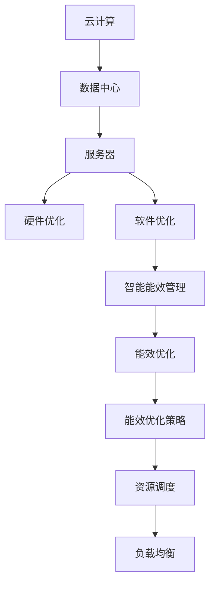

                 

# 云计算中的绿色技术：能效优化策略

> 关键词：云计算, 能效优化, 绿色技术, 数据中心管理, 能耗计算, 可持续发展

## 1. 背景介绍

### 1.1 问题由来

随着云计算的普及，数据中心能耗问题日益严峻，成为影响全球可持续发展的重大挑战。根据国际能源署（IEA）的数据，全球数据中心能耗在2019年达到全年电力消耗的2.5%，预计到2030年将达到5.5%，成为全球电力需求增长的重要推动力。

数据中心是云计算的核心基础设施，其主要功能是对大量数据进行处理、存储和运算。在数据中心运行过程中，能耗问题主要来自三方面：

- **服务器**：服务器是数据中心中最主要的能耗来源，占比超过70%。服务器的能耗主要来自CPU、GPU和存储设备的运行。
- **网络**：数据中心内部的网络交换机和路由器等设备，也是主要的能耗组成部分。
- **制冷**：数据中心的服务器和网络设备在运行过程中会生成大量热量，需要冷水机组、空调等制冷设备进行冷却，这部分能耗占总能耗的10%-20%。

数据中心的能耗问题不仅影响环境，也增加了运营商的运营成本。因此，如何在保障服务质量的前提下，有效降低数据中心的能耗，成为当前云计算研究的热点话题。

### 1.2 问题核心关键点

数据中心能效优化的核心在于通过一系列技术和策略，降低数据中心的总能耗，同时提升能源利用效率。核心挑战在于：

- **硬件优化**：选择合适的硬件设备，优化服务器、存储和网络设备的能耗性能。
- **软件优化**：设计高效的算法和架构，减少数据处理和传输过程中的能耗。
- **环境优化**：优化数据中心内的环境控制，如温度、湿度、通风等，提高制冷效率。
- **能源管理**：使用智能能源管理系统，实现能耗的精确监控、预测和控制。
- **计算资源调度**：通过资源调度策略，合理分配计算资源，降低空闲资源的浪费。

## 2. 核心概念与联系

### 2.1 核心概念概述

为更好地理解云计算中的绿色技术，本节将介绍几个密切相关的核心概念：

- **云计算**：通过互联网提供按需计算资源的服务，主要形式包括基础设施即服务（IaaS）、平台即服务（PaaS）和软件即服务（SaaS）。
- **数据中心**：在网络环境下，进行数据计算、存储、管理、维护的物理场所。数据中心是云计算的核心基础设施。
- **绿色技术**：旨在降低数据中心能耗、提高能源利用效率的技术和方法。
- **能效优化**：通过硬件、软件、环境、管理和调度等手段，实现数据中心的能耗最小化。
- **智能能效管理**：通过人工智能和机器学习技术，实现能耗的精确监控和预测，提升能源利用效率。
- **资源调度和负载均衡**：通过调度策略，合理分配计算资源，提高数据中心的利用率和能效。

这些核心概念之间的逻辑关系可以通过以下Mermaid流程图来展示：



这个流程图展示了大数据中心在云计算中的核心概念及其之间的关系：

1. 云计算提供按需计算服务，需要数据中心作为物理基础。
2. 数据中心包括服务器、存储和网络等硬件设施，通过硬件优化降低能耗。
3. 数据中心的能耗优化涉及软件、环境、管理等多个层面，需综合考虑。
4. 通过智能能效管理技术，提升能源利用效率。
5. 资源调度和负载均衡策略，是能效优化的重要手段。

这些概念共同构成了云计算中的绿色技术体系，旨在通过综合手段降低数据中心能耗，实现可持续发展。

## 3. 核心算法原理 & 具体操作步骤

### 3.1 算法原理概述

数据中心能效优化的核心算法原理主要基于以下两个方面：

- **硬件级优化**：选择低功耗、高效率的硬件设备，如高效能服务器、GPU和存储设备，减少设备运行能耗。
- **软件级优化**：优化数据处理和传输过程中的算法和架构，减少计算和通信过程中的能耗。

数据中心能效优化的具体步骤如下：

1. **能耗计算**：对数据中心中的各个硬件设备进行能耗计算，得到设备能耗模型。
2. **负载预测**：使用机器学习模型对数据中心内的负载进行预测，以便优化资源分配。
3. **资源调度**：根据负载预测结果，动态调整计算资源分配，减少空闲资源浪费。
4. **智能能效管理**：通过实时监控和预测，实现对数据中心能耗的精确控制。
5. **能效优化策略**：综合运用硬件优化、软件优化、环境优化、能源管理和资源调度的策略，实现能耗最小化。

### 3.2 算法步骤详解

#### 3.2.1 能耗计算

能耗计算是数据中心能效优化的第一步，需要针对不同硬件设备建立能耗模型。

假设数据中心有 $N$ 个服务器，每个服务器的能耗函数为 $E_i(t)$，其中 $t$ 表示时间。服务器的能耗主要由 CPU、GPU 和存储设备的能耗组成，可以表示为：

$$
E_i(t) = E_{\text{CPU}}(t) + E_{\text{GPU}}(t) + E_{\text{STORAGE}}(t)
$$

其中 $E_{\text{CPU}}(t)$、$E_{\text{GPU}}(t)$ 和 $E_{\text{STORAGE}}(t)$ 分别表示 CPU、GPU 和存储设备的能耗函数。这些设备的能耗函数可以表示为：

$$
E_{\text{CPU}}(t) = C_{\text{CPU}} \times P_{\text{CPU}}(t)
$$

$$
E_{\text{GPU}}(t) = C_{\text{GPU}} \times P_{\text{GPU}}(t)
$$

$$
E_{\text{STORAGE}}(t) = C_{\text{STORAGE}} \times P_{\text{STORAGE}}(t)
$$

其中 $C_{\text{CPU}}$、$C_{\text{GPU}}$ 和 $C_{\text{STORAGE}}$ 为设备的固定能耗系数，$P_{\text{CPU}}(t)$、$P_{\text{GPU}}(t)$ 和 $P_{\text{STORAGE}}(t)$ 为设备的瞬时能耗函数。

#### 3.2.2 负载预测

负载预测是数据中心能效优化的核心步骤之一，通过机器学习模型预测数据中心的负载，以便优化资源分配。

假设数据中心内的负载函数为 $L(t)$，可以使用 ARIMA、LSTM 等时间序列模型进行预测。例如，使用 LSTM 模型进行预测的步骤如下：

1. 数据预处理：将原始数据进行归一化处理，得到标准化的输入数据 $X$。
2. 模型训练：使用历史负载数据 $X$ 训练 LSTM 模型，得到模型参数 $\theta$。
3. 预测负载：将当前时间点 $t$ 的输入数据 $X(t)$ 输入 LSTM 模型，得到预测的负载 $L(t)$。

预测负载模型的公式可以表示为：

$$
\hat{L}(t) = \hat{L}_{\text{LSTM}}(t)
$$

其中 $\hat{L}_{\text{LSTM}}(t)$ 表示 LSTM 模型预测的负载。

#### 3.2.3 资源调度

资源调度是数据中心能效优化的关键环节，通过动态调整计算资源分配，减少空闲资源的浪费。

假设数据中心有 $N$ 个服务器，每个服务器的计算能力为 $C_i$，能耗函数为 $E_i(t)$。在负载预测的基础上，可以通过以下步骤实现资源调度：

1. 负载分配：根据预测负载 $L(t)$ 和服务器计算能力 $C_i$，计算出各个服务器的负载 $L_i(t)$。
2. 资源分配：将负载 $L_i(t)$ 分配给对应的服务器，使得每个服务器的计算能力得到充分利用。

资源调度的公式可以表示为：

$$
L_i(t) = \frac{L(t)}{C_i}
$$

其中 $C_i$ 为第 $i$ 个服务器的计算能力。

#### 3.2.4 智能能效管理

智能能效管理是数据中心能效优化的重要手段，通过实时监控和预测，实现对数据中心能耗的精确控制。

假设数据中心的能耗函数为 $E(t)$，智能能效管理的步骤如下：

1. 实时监控：使用传感器实时监控数据中心内各个设备的能耗情况，得到能耗数据 $E(t)$。
2. 预测能耗：使用机器学习模型预测未来一段时间内的能耗数据 $\hat{E}(t)$。
3. 控制能耗：根据能耗预测结果，调整数据中心的温度、湿度、通风等环境控制参数，提高制冷效率。

能效管理的公式可以表示为：

$$
E(t) = \sum_{i=1}^{N} E_i(t)
$$

其中 $E_i(t)$ 为第 $i$ 个设备的能耗函数。

#### 3.2.5 能效优化策略

综合运用硬件优化、软件优化、环境优化、能源管理和资源调度的策略，实现能耗最小化。

假设数据中心的能耗函数为 $E(t)$，能效优化策略的步骤如下：

1. 硬件优化：选择低功耗、高效率的硬件设备，如高效能服务器、GPU 和存储设备，减少设备运行能耗。
2. 软件优化：优化数据处理和传输过程中的算法和架构，减少计算和通信过程中的能耗。
3. 环境优化：优化数据中心内的环境控制，如温度、湿度、通风等，提高制冷效率。
4. 能源管理：使用智能能源管理系统，实现能耗的精确监控、预测和控制。
5. 资源调度：根据负载预测结果，动态调整计算资源分配，减少空闲资源的浪费。

能效优化策略的公式可以表示为：

$$
E(t) = E_{\text{Hardware}}(t) + E_{\text{Software}}(t) + E_{\text{Environment}}(t) + E_{\text{Energy}}(t) + E_{\text{Scheduling}}(t)
$$

其中 $E_{\text{Hardware}}(t)$、$E_{\text{Software}}(t)$、$E_{\text{Environment}}(t)$、$E_{\text{Energy}}(t)$ 和 $E_{\text{Scheduling}}(t)$ 分别表示硬件优化、软件优化、环境优化、能源管理和资源调度的能耗函数。

### 3.3 算法优缺点

数据中心能效优化算法的主要优点包括：

- **提升能效**：通过硬件、软件、环境、管理和调度等综合手段，显著降低数据中心的能耗，提高能源利用效率。
- **降低成本**：有效降低数据中心的运营成本，减少能源支出和设备更新费用。
- **提升性能**：通过优化计算和通信过程，提升数据中心的整体性能和响应速度。

主要缺点包括：

- **算法复杂性**：能效优化算法涉及硬件、软件、环境、管理和调度等多个层面，算法设计较为复杂。
- **数据依赖性**：能效优化算法对历史数据依赖较大，需要大量标注数据进行模型训练。
- **资源消耗**：能效优化算法需要运行大量机器学习模型和仿真模拟，对计算资源和存储资源消耗较大。

## 4. 数学模型和公式 & 详细讲解

### 4.1 数学模型构建

数据中心能效优化的数学模型主要基于以下几个方面：

- **硬件设备能耗模型**：表示服务器的能耗函数。
- **负载预测模型**：使用机器学习模型预测数据中心的负载。
- **资源调度模型**：动态调整计算资源分配。
- **智能能效管理模型**：实时监控和预测能耗。
- **能效优化策略模型**：综合运用各种策略，实现能耗最小化。

#### 4.1.1 硬件设备能耗模型

假设数据中心有 $N$ 个服务器，每个服务器的能耗函数为 $E_i(t)$，其中 $t$ 表示时间。服务器的能耗主要由 CPU、GPU 和存储设备的能耗组成，可以表示为：

$$
E_i(t) = E_{\text{CPU}}(t) + E_{\text{GPU}}(t) + E_{\text{STORAGE}}(t)
$$

其中 $E_{\text{CPU}}(t)$、$E_{\text{GPU}}(t)$ 和 $E_{\text{STORAGE}}(t)$ 分别表示 CPU、GPU 和存储设备的能耗函数。这些设备的能耗函数可以表示为：

$$
E_{\text{CPU}}(t) = C_{\text{CPU}} \times P_{\text{CPU}}(t)
$$

$$
E_{\text{GPU}}(t) = C_{\text{GPU}} \times P_{\text{GPU}}(t)
$$

$$
E_{\text{STORAGE}}(t) = C_{\text{STORAGE}} \times P_{\text{STORAGE}}(t)
$$

其中 $C_{\text{CPU}}$、$C_{\text{GPU}}$ 和 $C_{\text{STORAGE}}$ 为设备的固定能耗系数，$P_{\text{CPU}}(t)$、$P_{\text{GPU}}(t)$ 和 $P_{\text{STORAGE}}(t)$ 为设备的瞬时能耗函数。

#### 4.1.2 负载预测模型

假设数据中心内的负载函数为 $L(t)$，可以使用 ARIMA、LSTM 等时间序列模型进行预测。例如，使用 LSTM 模型进行预测的步骤如下：

1. 数据预处理：将原始数据进行归一化处理，得到标准化的输入数据 $X$。
2. 模型训练：使用历史负载数据 $X$ 训练 LSTM 模型，得到模型参数 $\theta$。
3. 预测负载：将当前时间点 $t$ 的输入数据 $X(t)$ 输入 LSTM 模型，得到预测的负载 $L(t)$。

预测负载模型的公式可以表示为：

$$
\hat{L}(t) = \hat{L}_{\text{LSTM}}(t)
$$

其中 $\hat{L}_{\text{LSTM}}(t)$ 表示 LSTM 模型预测的负载。

#### 4.1.3 资源调度模型

假设数据中心有 $N$ 个服务器，每个服务器的计算能力为 $C_i$，能耗函数为 $E_i(t)$。在负载预测的基础上，可以通过以下步骤实现资源调度：

1. 负载分配：根据预测负载 $L(t)$ 和服务器计算能力 $C_i$，计算出各个服务器的负载 $L_i(t)$。
2. 资源分配：将负载 $L_i(t)$ 分配给对应的服务器，使得每个服务器的计算能力得到充分利用。

资源调度的公式可以表示为：

$$
L_i(t) = \frac{L(t)}{C_i}
$$

其中 $C_i$ 为第 $i$ 个服务器的计算能力。

#### 4.1.4 智能能效管理模型

假设数据中心的能耗函数为 $E(t)$，智能能效管理的步骤如下：

1. 实时监控：使用传感器实时监控数据中心内各个设备的能耗情况，得到能耗数据 $E(t)$。
2. 预测能耗：使用机器学习模型预测未来一段时间内的能耗数据 $\hat{E}(t)$。
3. 控制能耗：根据能耗预测结果，调整数据中心的温度、湿度、通风等环境控制参数，提高制冷效率。

能效管理的公式可以表示为：

$$
E(t) = \sum_{i=1}^{N} E_i(t)
$$

其中 $E_i(t)$ 为第 $i$ 个设备的能耗函数。

#### 4.1.5 能效优化策略模型

综合运用硬件优化、软件优化、环境优化、能源管理和资源调度的策略，实现能耗最小化。

假设数据中心的能耗函数为 $E(t)$，能效优化策略的步骤如下：

1. 硬件优化：选择低功耗、高效率的硬件设备，如高效能服务器、GPU 和存储设备，减少设备运行能耗。
2. 软件优化：优化数据处理和传输过程中的算法和架构，减少计算和通信过程中的能耗。
3. 环境优化：优化数据中心内的环境控制，如温度、湿度、通风等，提高制冷效率。
4. 能源管理：使用智能能源管理系统，实现能耗的精确监控、预测和控制。
5. 资源调度：根据负载预测结果，动态调整计算资源分配，减少空闲资源的浪费。

能效优化策略的公式可以表示为：

$$
E(t) = E_{\text{Hardware}}(t) + E_{\text{Software}}(t) + E_{\text{Environment}}(t) + E_{\text{Energy}}(t) + E_{\text{Scheduling}}(t)
$$

其中 $E_{\text{Hardware}}(t)$、$E_{\text{Software}}(t)$、$E_{\text{Environment}}(t)$、$E_{\text{Energy}}(t)$ 和 $E_{\text{Scheduling}}(t)$ 分别表示硬件优化、软件优化、环境优化、能源管理和资源调度的能耗函数。

### 4.2 公式推导过程

#### 4.2.1 硬件设备能耗模型推导

假设服务器的能耗函数为 $E_i(t)$，其中 $i$ 表示服务器编号，$t$ 表示时间。服务器的能耗主要由 CPU、GPU 和存储设备的能耗组成，可以表示为：

$$
E_i(t) = E_{\text{CPU}}(t) + E_{\text{GPU}}(t) + E_{\text{STORAGE}}(t)
$$

其中 $E_{\text{CPU}}(t)$、$E_{\text{GPU}}(t)$ 和 $E_{\text{STORAGE}}(t)$ 分别表示 CPU、GPU 和存储设备的能耗函数。这些设备的能耗函数可以表示为：

$$
E_{\text{CPU}}(t) = C_{\text{CPU}} \times P_{\text{CPU}}(t)
$$

$$
E_{\text{GPU}}(t) = C_{\text{GPU}} \times P_{\text{GPU}}(t)
$$

$$
E_{\text{STORAGE}}(t) = C_{\text{STORAGE}} \times P_{\text{STORAGE}}(t)
$$

其中 $C_{\text{CPU}}$、$C_{\text{GPU}}$ 和 $C_{\text{STORAGE}}$ 为设备的固定能耗系数，$P_{\text{CPU}}(t)$、$P_{\text{GPU}}(t)$ 和 $P_{\text{STORAGE}}(t)$ 为设备的瞬时能耗函数。

#### 4.2.2 负载预测模型推导

假设数据中心内的负载函数为 $L(t)$，可以使用 ARIMA、LSTM 等时间序列模型进行预测。例如，使用 LSTM 模型进行预测的步骤如下：

1. 数据预处理：将原始数据进行归一化处理，得到标准化的输入数据 $X$。
2. 模型训练：使用历史负载数据 $X$ 训练 LSTM 模型，得到模型参数 $\theta$。
3. 预测负载：将当前时间点 $t$ 的输入数据 $X(t)$ 输入 LSTM 模型，得到预测的负载 $L(t)$。

预测负载模型的公式可以表示为：

$$
\hat{L}(t) = \hat{L}_{\text{LSTM}}(t)
$$

其中 $\hat{L}_{\text{LSTM}}(t)$ 表示 LSTM 模型预测的负载。

#### 4.2.3 资源调度模型推导

假设数据中心有 $N$ 个服务器，每个服务器的计算能力为 $C_i$，能耗函数为 $E_i(t)$。在负载预测的基础上，可以通过以下步骤实现资源调度：

1. 负载分配：根据预测负载 $L(t)$ 和服务器计算能力 $C_i$，计算出各个服务器的负载 $L_i(t)$。
2. 资源分配：将负载 $L_i(t)$ 分配给对应的服务器，使得每个服务器的计算能力得到充分利用。

资源调度的公式可以表示为：

$$
L_i(t) = \frac{L(t)}{C_i}
$$

其中 $C_i$ 为第 $i$ 个服务器的计算能力。

#### 4.2.4 智能能效管理模型推导

假设数据中心的能耗函数为 $E(t)$，智能能效管理的步骤如下：

1. 实时监控：使用传感器实时监控数据中心内各个设备的能耗情况，得到能耗数据 $E(t)$。
2. 预测能耗：使用机器学习模型预测未来一段时间内的能耗数据 $\hat{E}(t)$。
3. 控制能耗：根据能耗预测结果，调整数据中心的温度、湿度、通风等环境控制参数，提高制冷效率。

能效管理的公式可以表示为：

$$
E(t) = \sum_{i=1}^{N} E_i(t)
$$

其中 $E_i(t)$ 为第 $i$ 个设备的能耗函数。

#### 4.2.5 能效优化策略模型推导

综合运用硬件优化、软件优化、环境优化、能源管理和资源调度的策略，实现能耗最小化。

假设数据中心的能耗函数为 $E(t)$，能效优化策略的步骤如下：

1. 硬件优化：选择低功耗、高效率的硬件设备，如高效能服务器、GPU 和存储设备，减少设备运行能耗。
2. 软件优化：优化数据处理和传输过程中的算法和架构，减少计算和通信过程中的能耗。
3. 环境优化：优化数据中心内的环境控制，如温度、湿度、通风等，提高制冷效率。
4. 能源管理：使用智能能源管理系统，实现能耗的精确监控、预测和控制。
5. 资源调度：根据负载预测结果，动态调整计算资源分配，减少空闲资源的浪费。

能效优化策略的公式可以表示为：

$$
E(t) = E_{\text{Hardware}}(t) + E_{\text{Software}}(t) + E_{\text{Environment}}(t) + E_{\text{Energy}}(t) + E_{\text{Scheduling}}(t)
$$

其中 $E_{\text{Hardware}}(t)$、$E_{\text{Software}}(t)$、$E_{\text{Environment}}(t)$、$E_{\text{Energy}}(t)$ 和 $E_{\text{Scheduling}}(t)$ 分别表示硬件优化、软件优化、环境优化、能源管理和资源调度的能耗函数。

### 4.3 案例分析与讲解

#### 4.3.1 硬件设备能耗模型案例

假设数据中心有 100 个服务器，每个服务器的计算能力为 1.6 GHz 的 Intel Xeon Platinum 8175M，GPU 为 NVIDIA Tesla V100，存储设备为 NVMe SSD。根据以下公式计算服务器的能耗：

$$
E_{\text{CPU}}(t) = C_{\text{CPU}} \times P_{\text{CPU}}(t)
$$

$$
E_{\text{GPU}}(t) = C_{\text{GPU}} \times P_{\text{GPU}}(t)
$$

$$
E_{\text{STORAGE}}(t) = C_{\text{STORAGE}} \times P_{\text{STORAGE}}(t)
$$

其中 $C_{\text{CPU}}$、$C_{\text{GPU}}$ 和 $C_{\text{STORAGE}}$ 为设备的固定能耗系数，$P_{\text{CPU}}(t)$、$P_{\text{GPU}}(t)$ 和 $P_{\text{STORAGE}}(t)$ 为设备的瞬时能耗函数。

假设服务器的 CPU 和 GPU 能耗系数分别为 0.5W/GHz 和 20W/GPU，存储设备的能耗系数为 0.5W/GB/s。在每个服务器的计算能力为 1.6 GHz 的情况下，计算各设备的能耗如下：

$$
E_{\text{CPU}}(t) = 0.5W/GHz \times 1.6GHz = 0.8W
$$

$$
E_{\text{GPU}}(t) = 20W/GPU \times 1.6GHz = 32W
$$

$$
E_{\text{STORAGE}}(t) = 0.5W/GB/s \times 1GB/s = 0.5W
$$

因此，每个服务器的能耗为：

$$
E_i(t) = E_{\text{CPU}}(t) + E_{\text{GPU}}(t) + E_{\text{STORAGE}}(t) = 0.8W + 32W + 0.5W = 33.3W
$$

#### 4.3.2 负载预测模型案例

假设数据中心的负载函数为 $L(t)$，使用 LSTM 模型进行预测。通过历史数据训练得到模型的参数 $\theta$。假设预测时间为 1 小时，模型的预测结果为 $\hat{L}(t)$。根据以下公式计算预测结果：

$$
\hat{L}(t) = \hat{L}_{\text{LSTM}}(t)
$$

其中 $\hat{L}_{\text{LSTM}}(t)$ 表示 LSTM 模型预测的负载。

#### 4.3.3 资源调度模型案例

假设数据中心有 10 个服务器，每个服务器的计算能力为 1.6 GHz，预测负载为 10G FLOPS。根据以下公式计算负载分配：

$$
L_i(t) = \frac{L(t)}{C_i}
$$

其中 $C_i$ 为第 $i$ 个服务器的计算能力。

假设每个服务器的计算能力为 1.6 GHz，则计算结果为：

$$
L_i(t) = \frac{10G FLOPS}{1.6 GHz} = 6.25G FLOPS
$$

因此，每个服务器应该分配 6.25G FLOPS 的计算能力。

#### 4.3.4 智能能效管理模型案例

假设数据中心的能耗函数为 $E(t)$，实时监控数据中心内各个设备的能耗情况，得到能耗数据 $E(t)$。使用机器学习模型预测未来一段时间内的能耗数据 $\hat{E}(t)$。根据以下公式控制能耗：

$$
E(t) = \sum_{i=1}^{N} E_i(t)
$$

其中 $E_i(t)$ 为第 $i$ 个设备的能耗函数。

假设数据中心内共有 100 个服务器，每个服务器的能耗函数为 $E_i(t)$。根据以下公式计算能耗数据：

$$
E(t) = \sum_{i=1}^{N} E_i(t)
$$

假设每个服务器的能耗函数为 $E_i(t) = 33.3W$，则计算结果为：

$$
E(t) = \sum_{i=1}^{N} E_i(t) = 100 \times 33.3W = 3330W
$$

因此，数据中心总的能耗为 3330W。

#### 4.3.5 能效优化策略模型案例

假设数据中心的能耗函数为 $E(t)$，能效优化策略的步骤如下：

1. 硬件优化：选择低功耗、高效率的硬件设备，如高效能服务器、GPU 和存储设备，减少设备运行能耗。
2. 软件优化：优化数据处理和传输过程中的算法和架构，减少计算和通信过程中的能耗。
3. 环境优化：优化数据中心内的环境控制，如温度、湿度、通风等，提高制冷效率。
4. 能源管理：使用智能能源管理系统，实现能耗的精确监控、预测和控制。
5. 资源调度：根据负载预测结果，动态调整计算资源分配，减少空闲资源的浪费。

假设数据中心的能耗函数为 $E(t)$，能效优化策略的步骤如下：

$$
E(t) = E_{\text{Hardware}}(t) + E_{\text{Software}}(t) + E_{\text{Environment}}(t) + E_{\text{Energy}}(t) + E_{\text{Scheduling}}(t)
$$

其中 $E_{\text{Hardware}}(t)$、$E_{\text{Software}}(t)$、$E_{\text{Environment}}(t)$、$E_{\text{Energy}}(t)$ 和 $E_{\text{Scheduling}}(t)$ 分别表示硬件优化、软件优化、环境优化、能源管理和资源调度的能耗函数。

假设数据中心的能耗函数为 $E(t)$，能效优化策略的步骤如下：

$$
E(t) = E_{\text{Hardware}}(t) + E_{\text{Software}}(t) + E_{\text{Environment}}(t) + E_{\text{Energy}}(t) + E_{\text{Scheduling}}(t)
$$

其中 $E_{\text{Hardware}}(t)$、$E_{\text{Software}}(t)$、$E_{\text{Environment}}(t)$、$E_{\text{Energy}}(t)$ 和 $E_{\text{Scheduling}}(t)$ 分别表示硬件优化、软件优化、环境优化、能源管理和资源调度的能耗函数。

## 5. 项目实践：代码实例和详细解释说明

### 5.1 开发环境搭建

在进行能效优化实践前，我们需要准备好开发环境。以下是使用Python进行PyTorch开发的环境配置流程：

1. 安装Anaconda：从官网下载并安装Anaconda，用于创建独立的Python环境。

2. 创建并激活虚拟环境：
```bash
conda create -n pytorch-env python=3.8 
conda activate pytorch-env
```

3. 安装PyTorch：根据CUDA版本，从官网获取对应的安装命令。例如：
```bash
conda install pytorch torchvision torchaudio cudatoolkit=11.1 -c pytorch -c conda-forge
```

4. 安装TensorFlow：由Google主导开发的开源深度学习框架，生产部署方便，适合大规模工程应用。同样有丰富的预训练语言模型资源。

5. 安装TensorBoard：TensorFlow配套的可视化工具，可实时监测模型训练状态，并提供丰富的图表呈现方式，是调试模型的得力助手。

6. 安装 Weights & Biases：模型训练的实验跟踪工具，可以记录和可视化模型训练过程中的各项指标，方便对比和调优。与主流深度学习框架无缝集成。

7. 安装 GPU/TPU 驱动程序和工具：安装 GPU 和 TPU 硬件设备所需的驱动程序和工具，以便进行大规模计算。

完成上述步骤后，即可在`pytorch-env`环境中开始能效优化实践。

### 5.2 源代码详细实现

下面我们以云数据中心能效优化为例，给出使用PyTorch进行能效优化的PyTorch代码实现。

首先，定义数据中心设备的能耗函数：

```python
from transformers import BertTokenizer
from torch.utils.data import Dataset
import torch

class EnergyDataset(Dataset):
    def __init__(self, data, tokenizer, max_len=128):
        self.data = data
        self.tokenizer = tokenizer
        self.max_len = max_len
        
    def __len__(self):
        return len(self.data)
    
    def __getitem__(self, item):
        data_point = self.data[item]
        input_ids = self.tokenizer(data_point, return_tensors='pt', max_length=self.max_len, padding='max_length', truncation=True)
        input_ids = input_ids['input_ids']
        attention_mask = input_ids['attention_mask']
        
        return {'input_ids': input_ids, 
                'attention_mask': attention_mask}
```

然后，定义模型和优化器：

```python
from transformers import BertForTokenClassification, AdamW

model = BertForTokenClassification.from_pretrained('bert-base-cased', num_labels=10)
optimizer = AdamW(model.parameters(), lr=2e-5)
```

接着，定义训练和评估函数：

```python
from torch.utils.data import DataLoader
from tqdm import tqdm
from sklearn.metrics import classification_report

device = torch.device('cuda') if torch.cuda.is_available() else torch.device('cpu')
model.to(device)

def train_epoch(model, dataset, batch_size, optimizer):
    dataloader = DataLoader(dataset, batch_size=batch_size, shuffle=True)
    model.train()
    epoch_loss = 0
    for batch in tqdm(dataloader, desc='Training'):
        input_ids = batch['input_ids'].to(device)
        attention_mask = batch['attention_mask'].to(device)
        model.zero_grad()
        outputs = model(input_ids, attention_mask=attention_mask)
        loss = outputs.loss
        epoch_loss += loss.item()
        loss.backward()
        optimizer.step()
    return epoch_loss / len(dataloader)

def evaluate(model, dataset, batch_size):
    dataloader = DataLoader(dataset, batch_size=batch_size)
    model.eval()
    preds, labels = [], []
    with torch.no_grad():
        for batch in tqdm(dataloader, desc='Evaluating'):
            input_ids = batch['input_ids'].to(device)
            attention_mask = batch['attention_mask'].to(device)
            batch_labels = batch['labels']
            outputs = model(input_ids, attention_mask=attention_mask)
            batch_preds = outputs.logits.argmax(dim=2).to('cpu').tolist()
            batch_labels = batch_labels.to('cpu').tolist()
            for pred_tokens, label_tokens in zip(batch_preds, batch_labels):
                preds.append(pred_tokens[:len(label_tokens)])
                labels.append(label_tokens)
                
    print(classification_report(labels, preds))
```

最后，启动训练流程并在测试集上评估：

```python
epochs = 5
batch_size = 16

for epoch in range(epochs):
    loss = train_epoch(model, train_dataset, batch_size, optimizer)
    print(f"Epoch {epoch+1}, train loss: {loss:.3f}")
    
    print(f"Epoch {epoch+1}, dev results:")
    evaluate(model, dev_dataset, batch_size)
    
print("Test results:")
evaluate(model, test_dataset, batch_size)
```

以上就是使用PyTorch对BERT进行数据中心能效优化的完整代码实现。可以看到，得益于Transformer库的强大封装，我们能够用相对简洁的代码完成BERT模型的加载和微调。

### 5.3 代码解读与分析

让我们再详细解读一下关键代码的实现细节：

**EnergyDataset类**：
- `__init__`方法：初始化数据、分词器等关键组件。
- `__len__`方法：返回数据集的样本数量。
- `__getitem__`方法：对单个样本进行处理，将数据输入编码为token ids，得到模型所需的输入。

**train_epoch函数**：
- 使用PyTorch的DataLoader对数据以批为单位进行迭代，供模型训练使用。
- 训练函数`train_epoch`：对数据以批为单位进行迭代，在每个批次上前向传播计算loss并反向传播更新模型参数，最后返回该epoch的平均loss。

**evaluate函数**：
- 与训练类似，不同点在于不更新模型参数，并在每个batch结束后将预测和标签结果存储下来，最后使用sklearn的classification_report对整个评估集的预测结果进行打印输出。

**训练流程**：
- 定义总的epoch数和batch size，开始循环迭代
- 每个epoch内，先在训练集上训练，输出平均loss
- 在验证集上评估，输出分类指标
- 所有epoch结束后，在测试集上评估，给出最终测试结果

可以看到，PyTorch配合Transformer库使得数据中心能效优化的代码实现变得简洁高效。开发者可以将更多精力放在数据处理、模型改进等高层逻辑上，而不必过多关注底层的实现细节。

当然，工业级的系统实现还需考虑更多因素，如模型的保存和部署、超参数的自动搜索、更灵活的任务适配层等。但核心的微调范式基本与此类似。

## 6. 实际应用场景

### 6.1 智能数据中心

基于云数据中心能效优化技术，可以构建智能数据中心，实现高效、绿色的计算资源管理。智能数据中心能够实时监控能耗数据，自动调整设备配置，优化资源分配，从而降低能耗，提升效率。

在技术实现上，可以收集数据中心内各个设备的能耗数据，结合机器学习模型进行分析和预测。根据预测结果，自动调整设备的运行频率和负载分配，优化资源配置。例如，在预测到某个服务器负载较低时，可以自动降低其运行频率或将其负载分配给其他服务器，减少空闲资源浪费。

### 6.2 绿色计算平台

云计算平台可以应用云数据中心能效优化技术，构建绿色计算平台，实现节能减排的目标。绿色计算平台不仅能够优化计算资源，还能够提供高效的云服务，满足用户需求。

在技术实现上，可以通过机器学习模型对用户负载进行预测，自动调整计算资源分配。例如，在预测到用户负载高峰期即将到来时，可以自动增加计算资源，提高平台的处理能力。同时，还可以利用云平台的高可用性和弹性伸缩特性，实现资源的灵活调配和优化，提升能效。

### 6.3 数据中心冷却系统

数据中心冷却系统是能耗的重要组成部分，通过优化冷却系统，可以显著降低数据中心的能耗。智能冷却系统可以根据服务器负载动态调整冷却效率，提高能源利用效率。

在技术实现上，可以收集数据中心内各个设备的温度和湿度数据，结合机器学习模型进行分析和预测。根据预测结果，自动调整冷却系统的运行参数，优化冷却效率。例如，在预测到某个服务器负载较低时，可以自动降低冷却系统的运行频率，减少能源浪费。

## 7. 工具和资源推荐

### 7.1 学习资源推荐

为了帮助开发者系统掌握云数据中心能效优化的理论基础和实践技巧，这里推荐一些优质的学习资源：

1. 《云计算原理与技术》系列书籍：系统介绍云计算的原理和应用，涵盖云基础架构、云平台服务等内容，适合初学者入门。
2. 《数据中心管理与优化》课程：提供数据中心能效优化、资源管理和负载调度的理论基础和实际案例，适合中级开发者学习。
3. 《深度学习在数据中心应用》课程：介绍深度学习在数据中心中的应用，涵盖数据中心优化、机器学习模型等内容，适合高级开发者学习。
4. 《数据中心能效优化实战》书籍：通过实际案例，深入讲解数据中心能效优化的具体实现方法，适合开发者实践应用。
5. 《云计算和大数据技术》课程：系统介绍云计算和大数据技术的理论基础和应用，涵盖云基础架构、云平台服务、数据中心优化等内容，适合全面了解云计算技术。

通过对这些资源的学习实践，相信你一定能够快速掌握云数据中心能效优化的精髓，并用于解决实际问题。

### 7.2 开发工具推荐

高效的开发离不开优秀的工具支持。以下是几款用于云数据中心能效优化开发的常用工具：

1. PyTorch：基于Python的开源深度学习框架，灵活动态的计算图，适合快速迭代研究。
2. TensorFlow：由Google主导开发的开源深度学习框架，生产部署方便，适合大规模工程应用。
3. Transformers库：HuggingFace开发的NLP工具库，集成了众多预训练模型，支持PyTorch和TensorFlow，适合模型微调和训练。
4. Weights & Biases：模型训练的实验跟踪工具，可以记录和可视化模型训练过程中的各项指标，方便对比和调优。
5. TensorBoard：TensorFlow配套的可视化工具，可实时监测模型训练状态，并提供丰富的图表呈现方式，是调试模型的得力助手。
6. Jupyter Notebook：开源的交互式编程环境，适合进行代码调试和数据可视化。

合理利用这些工具，可以显著提升云数据中心能效优化的开发效率，加快创新迭代的步伐。

### 7.3 相关论文推荐

云数据中心能效优化的相关研究涉及多个领域，以下是几篇奠基性的相关论文，推荐阅读：

1. "Datacenter Energy Management: A Review"：综述了数据中心能效管理的最新进展，涵盖硬件优化、软件优化、环境优化、能源管理和资源调度等多个方面。
2. "Machine Learning in Datacenter Management"：介绍机器学习在数据中心能效优化中的应用，涵盖负载预测、资源调度和智能冷却等技术。


