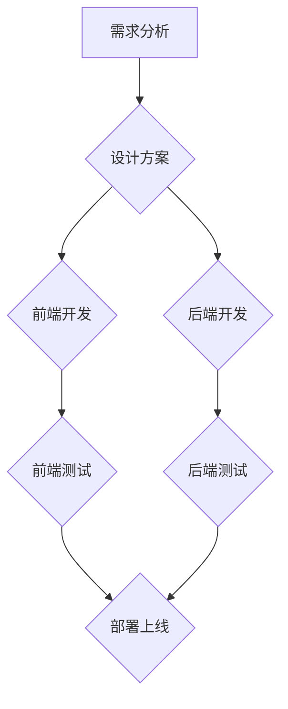

                 

## 全栈工程师之路：Web与移动端开发技能图谱

> 关键词：全栈工程师, Web开发, 移动端开发, 前端开发, 后端开发, 数据库, API, 框架, 工具

### 1. 背景介绍

在当今科技飞速发展的时代，软件开发行业呈现出蓬勃的景象。随着互联网和移动互联网的快速普及，对软件开发人才的需求量不断攀升。为了适应市场需求，一种新的软件开发模式——全栈工程师应运而生。

全栈工程师是指具备前端、后端、数据库等多个领域的全面技术能力的软件开发人员。他们能够独立完成软件项目的开发全流程，从需求分析、设计、开发、测试到部署，都能胜任。全栈工程师的出现，不仅提高了开发效率，也降低了项目成本，成为软件开发行业的新宠。

### 2. 核心概念与联系

**2.1 全栈工程师的定义**

全栈工程师是一个综合性的角色，需要掌握前端、后端、数据库等多个领域的知识和技能。

* **前端开发:** 负责用户界面（UI）的设计和开发，包括HTML、CSS、JavaScript等技术。
* **后端开发:** 负责服务器端逻辑和数据处理，包括编程语言（如Python、Java、Node.js）、数据库（如MySQL、MongoDB）、API等技术。
* **数据库:** 负责数据存储和管理，包括数据库设计、数据模型、SQL等技术。

**2.2 全栈工程师的技能图谱**

全栈工程师需要掌握的技能可以分为以下几个层次：

* **基础层:** 掌握编程语言基础、数据结构和算法、操作系统等基础知识。
* **中间层:** 掌握前端开发框架（如React、Vue、Angular）、后端开发框架（如Django、Spring Boot）、数据库操作等技术。
* **高级层:** 掌握云计算、微服务架构、DevOps等高级技术。

**2.3 全栈工程师的优势**

* **全面的技术能力:** 全栈工程师能够独立完成软件项目的开发全流程，减少对其他开发人员的依赖。
* **更高的效率:** 全栈工程师能够快速理解项目需求，并高效地进行开发和测试。
* **更低的成本:** 全栈工程师能够减少团队规模，降低项目成本。

**2.4 全栈工程师的挑战**

* **技术门槛高:** 全栈工程师需要掌握多个领域的知识和技能，技术门槛较高。
* **学习成本高:** 全栈工程师需要不断学习新的技术，学习成本较高。
* **工作压力大:** 全栈工程师需要承担多个角色的责任，工作压力较大。

**2.5 Mermaid 流程图**



### 3. 核心算法原理 & 具体操作步骤

**3.1 算法原理概述**

算法是解决特定问题的一系列步骤或规则。在软件开发中，算法是实现软件功能的核心。全栈工程师需要掌握多种算法，例如排序算法、搜索算法、数据结构算法等。

**3.2 算法步骤详解**

* **排序算法:** 将数据按照特定规则进行排序。常见的排序算法包括冒泡排序、插入排序、快速排序、归并排序等。
* **搜索算法:** 在数据集合中查找特定元素。常见的搜索算法包括线性搜索、二分搜索等。
* **数据结构算法:** 涉及数据存储和操作的算法，例如链表、栈、队列、树、图等。

**3.3 算法优缺点**

不同的算法具有不同的优缺点，需要根据实际情况选择合适的算法。例如，快速排序算法的时间复杂度较低，但空间复杂度较高；线性搜索算法简单易实现，但时间复杂度较高。

**3.4 算法应用领域**

算法广泛应用于软件开发各个领域，例如：

* **搜索引擎:** 使用排序算法和搜索算法来对网页进行排名和搜索。
* **社交媒体:** 使用数据结构算法来存储和管理用户数据。
* **电商平台:** 使用排序算法和搜索算法来推荐商品。

### 4. 数学模型和公式 & 详细讲解 & 举例说明

**4.1 数学模型构建**

数学模型是用来描述和分析现实世界现象的抽象模型。在软件开发中，数学模型可以用来描述算法的复杂度、数据结构的性能等。

**4.2 公式推导过程**

例如，时间复杂度是一个常用的数学模型，用来衡量算法执行时间与输入数据大小的关系。常见的算法时间复杂度包括：

* **O(1):** 常数时间复杂度，算法执行时间与输入数据大小无关。
* **O(log n):** 对数时间复杂度，算法执行时间与输入数据大小的 logarithm 成正比。
* **O(n):** 线性时间复杂度，算法执行时间与输入数据大小成正比。
* **O(n log n):** 对数线性时间复杂度，例如快速排序算法。
* **O(n^2):** 平方时间复杂度，例如冒泡排序算法。

**4.3 案例分析与讲解**

例如，线性搜索算法的时间复杂度为 O(n)，这意味着算法执行时间与输入数据大小成正比。如果输入数据大小为 n，则算法执行时间为 O(n)。

**4.4 数学公式**

$$
T(n) = O(n)
$$

其中：

* T(n) 表示算法执行时间
* n 表示输入数据大小

### 5. 项目实践：代码实例和详细解释说明

**5.1 开发环境搭建**

* 安装 Node.js 和 npm
* 安装 Git
* 创建一个新的 Node.js 项目

**5.2 源代码详细实现**

```javascript
// 这是一个简单的 Node.js 服务器端代码示例

const express = require('express');
const app = express();

app.get('/', (req, res) => {
  res.send('Hello World!');
});

app.listen(3000, () => {
  console.log('Server listening on port 3000');
});
```

**5.3 代码解读与分析**

* `const express = require('express');`：导入 Express.js 框架。
* `const app = express();`：创建 Express.js 应用实例。
* `app.get('/', (req, res) => { ... });`：定义一个 GET 请求的路由，当访问根路径 '/' 时，执行回调函数。
* `res.send('Hello World!');`：向客户端发送 "Hello World!" 字符串。
* `app.listen(3000, () => { ... });`：启动服务器，监听 3000 端口。

**5.4 运行结果展示**

运行代码后，访问 http://localhost:3000/，将会看到 "Hello World!" 的输出。

### 6. 实际应用场景

**6.1 Web 开发**

全栈工程师在 Web 开发中负责整个项目的开发流程，包括前端 UI 设计、后端逻辑开发、数据库设计和管理、API 接口开发等。

**6.2 移动端开发**

全栈工程师可以开发跨平台移动应用，例如使用 React Native 或 Flutter 等框架。

**6.3 数据分析**

全栈工程师可以利用数据分析工具和技术，对数据进行分析和挖掘，并开发数据可视化应用。

**6.4 云计算**

全栈工程师可以利用云计算平台，开发和部署云原生应用。

**6.5 未来应用展望**

随着人工智能、大数据、物联网等技术的快速发展，全栈工程师的需求将会更加旺盛。未来，全栈工程师将更加注重云计算、微服务架构、人工智能等领域的知识和技能。

### 7. 工具和资源推荐

**7.1 学习资源推荐**

* **在线课程:** Udemy、Coursera、edX 等平台提供丰富的软件开发课程。
* **书籍:** 《JavaScript高级程序设计》、《设计模式：复现与实践》等书籍。
* **博客:** Hacker News、Medium 等平台上有许多优秀的软件开发博客。

**7.2 开发工具推荐**

* **代码编辑器:** VS Code、Sublime Text、Atom 等。
* **版本控制系统:** Git、GitHub 等。
* **调试工具:** Chrome DevTools、Node.js Debugger 等。

**7.3 相关论文推荐**

* **算法复杂度分析:** 《Introduction to Algorithms》
* **数据结构:** 《Data Structures and Algorithms in Python》
* **软件架构:** 《Designing Data-Intensive Applications》

### 8. 总结：未来发展趋势与挑战

**8.1 研究成果总结**

全栈工程师的出现，推动了软件开发模式的变革，提高了开发效率和降低了项目成本。

**8.2 未来发展趋势**

* **云原生开发:** 全栈工程师将更加注重云计算平台和微服务架构的知识和技能。
* **人工智能:** 全栈工程师将利用人工智能技术，开发智能应用。
* **区块链:** 全栈工程师将参与区块链应用的开发和部署。

**8.3 面临的挑战**

* **技术更新迭代:** 软件开发技术更新迭代迅速，全栈工程师需要不断学习新的技术。
* **项目复杂度增加:** 项目规模和复杂度不断增加，全栈工程师需要具备更强的解决问题的能力。
* **人才短缺:** 全栈工程师人才短缺，市场需求量大。

**8.4 研究展望**

未来，全栈工程师的职业发展将更加多元化，需要不断学习和提升自身技能，才能在激烈的竞争中脱颖而出。

### 9. 附录：常见问题与解答

**9.1 如何成为一名全栈工程师？**

* 掌握基础编程语言和数据结构算法。
* 学习前端开发框架和后端开发框架。
* 积累项目经验，并不断学习新的技术。

**9.2 全栈工程师的薪资水平如何？**

全栈工程师的薪资水平取决于经验、技能和工作地点等因素。一般来说，经验丰富的全栈工程师薪资水平较高。

**9.3 全栈工程师的职业发展前景如何？**

全栈工程师的职业发展前景广阔，随着软件开发行业的不断发展，对全栈工程师的需求将会持续增长。


作者：禅与计算机程序设计艺术 / Zen and the Art of Computer Programming 
<end_of_turn>

