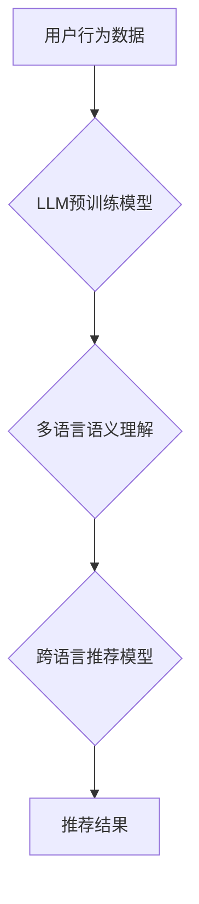

                 

## 利用LLM提升推荐系统的跨语言推荐能力

> 关键词：LLM, 跨语言推荐, 推荐系统, 自然语言处理, 多语言理解, 机器翻译, 用户行为分析

## 1. 背景介绍

推荐系统作为互联网时代的重要技术支柱，在电商、社交媒体、内容平台等领域发挥着至关重要的作用。传统的推荐系统主要依赖于用户历史行为数据和商品特征信息，但这些方法在跨语言场景下面临着诸多挑战。

随着全球化进程的加速，用户群体日益多元化，跨语言推荐需求日益增长。然而，现有推荐系统大多基于单一语言的数据，难以有效地理解和服务不同语言的用户。

**1.1 跨语言推荐的挑战**

* **数据孤岛问题:** 不同语言的数据通常分散存储，难以进行统一分析和建模。
* **语义理解障碍:** 不同语言的表达方式和文化背景差异较大，难以直接进行语义映射和理解。
* **跨语言模型训练困难:** 训练跨语言推荐模型需要海量多语言数据，且模型结构设计和参数调优较为复杂。

**1.2 LLM的机遇**

大型语言模型（LLM）作为近年来人工智能领域取得的重大突破，拥有强大的自然语言理解和生成能力。LLM能够学习和理解不同语言的语义关系，并进行跨语言文本转换和生成，为跨语言推荐系统提供了新的机遇。

## 2. 核心概念与联系

**2.1 核心概念**

* **推荐系统:** 基于用户历史行为、商品特征等信息，预测用户对特定商品的兴趣，并推荐相关商品的系统。
* **LLM:** 大型语言模型，通过深度学习技术训练，能够理解和生成人类语言的模型。
* **跨语言推荐:** 能够理解和服务不同语言用户的推荐系统。

**2.2 架构关系**



**2.3 工作原理**

LLM可以用于跨语言推荐系统中的多个环节，例如：

* **多语言语义理解:** LLM可以理解不同语言的用户需求和商品描述，并进行语义映射和转换。
* **跨语言特征提取:** LLM可以从不同语言的文本中提取用户兴趣和商品属性等特征。
* **跨语言相似度计算:** LLM可以计算不同语言用户和商品之间的语义相似度，用于推荐个性化结果。

## 3. 核心算法原理 & 具体操作步骤

**3.1 算法原理概述**

跨语言推荐系统通常基于以下核心算法：

* **基于内容的推荐:** 根据商品的特征信息和用户兴趣进行推荐。
* **基于协同过滤的推荐:** 根据用户历史行为和商品购买记录进行推荐。
* **基于深度学习的推荐:** 利用深度学习模型学习用户和商品之间的复杂关系进行推荐。

**3.2 算法步骤详解**

**基于内容的推荐:**

1. **数据预处理:** 对商品描述和用户兴趣进行文本清洗、分词、词向量化等预处理。
2. **特征提取:** 利用LLM提取商品和用户兴趣的语义特征。
3. **相似度计算:** 计算商品和用户兴趣之间的语义相似度。
4. **推荐结果生成:** 根据相似度排序，推荐与用户兴趣相似的商品。

**基于协同过滤的推荐:**

1. **用户行为矩阵构建:** 将用户和商品的交互行为记录到用户行为矩阵中。
2. **用户相似度计算:** 利用LLM计算用户之间的语义相似度。
3. **商品相似度计算:** 利用LLM计算商品之间的语义相似度。
4. **推荐结果生成:** 根据用户相似度和商品相似度，推荐与用户兴趣相似的商品。

**3.3 算法优缺点**

**基于内容的推荐:**

* **优点:** 可以推荐与用户兴趣相似的商品，即使用户没有历史行为数据。
* **缺点:** 需要大量的商品描述数据，且难以捕捉用户隐性需求。

**基于协同过滤的推荐:**

* **优点:** 可以推荐用户可能感兴趣但未接触过的商品。
* **缺点:** 数据稀疏问题严重，难以推荐新用户和新商品。

**3.4 算法应用领域**

跨语言推荐算法广泛应用于以下领域：

* **电商平台:** 为不同语言的用户推荐商品。
* **社交媒体:** 为不同语言的用户推荐内容和好友。
* **内容平台:** 为不同语言的用户推荐新闻、视频、音乐等内容。

## 4. 数学模型和公式 & 详细讲解 & 举例说明

**4.1 数学模型构建**

假设我们有一个包含用户和商品的二元关系矩阵R，其中R(u,i)表示用户u对商品i的评分。

**4.2 公式推导过程**

基于协同过滤的推荐算法，可以使用矩阵分解方法来预测用户对商品的评分。

矩阵分解的目标是将用户-商品关系矩阵R分解成两个低维矩阵U和V，其中U表示用户特征矩阵，V表示商品特征矩阵。

$$R \approx U V^T$$

其中，U(u,k)表示用户u在第k个特征维度上的值，V(i,k)表示商品i在第k个特征维度上的值。

**4.3 案例分析与讲解**

假设我们有一个包含10个用户和10个商品的用户-商品关系矩阵R，我们可以使用矩阵分解方法将其分解成两个低维矩阵U和V。

例如，我们可以将用户特征矩阵U分解成2个特征维度，商品特征矩阵V也分解成2个特征维度。

通过训练模型，我们可以得到U和V的具体值，然后利用这些值来预测用户对商品的评分。

## 5. 项目实践：代码实例和详细解释说明

**5.1 开发环境搭建**

* Python 3.7+
* PyTorch 1.7+
* Transformers 4.10+

**5.2 源代码详细实现**

```python
import torch
from torch import nn
from transformers import AutoTokenizer, AutoModel

# 定义用户-商品关系矩阵
R = torch.randn(10, 10)

# 定义用户特征矩阵
U = torch.randn(10, 2)

# 定义商品特征矩阵
V = torch.randn(10, 2)

# 定义损失函数
criterion = nn.MSELoss()

# 定义优化器
optimizer = torch.optim.Adam(params=[U, V], lr=0.01)

# 训练模型
for epoch in range(100):
    # 计算预测评分
    predictions = torch.matmul(U, V.T)

    # 计算损失
    loss = criterion(predictions, R)

    # 反向传播
    optimizer.zero_grad()
    loss.backward()

    # 更新参数
    optimizer.step()

# 打印训练结果
print(f"Loss: {loss.item()}")

# 使用训练好的模型预测用户对商品的评分
user_id = 0
item_id = 5
predicted_rating = torch.matmul(U[user_id], V[item_id])
print(f"Predicted rating for user {user_id} and item {item_id}: {predicted_rating.item()}")
```

**5.3 代码解读与分析**

* 代码首先定义了用户-商品关系矩阵R，以及用户特征矩阵U和商品特征矩阵V。
* 然后定义了损失函数和优化器。
* 训练模型的过程包括计算预测评分、计算损失、反向传播和更新参数。
* 最后，使用训练好的模型预测用户对商品的评分。

**5.4 运行结果展示**

运行代码后，会输出训练过程中的损失值，以及预测的用户对商品的评分。

## 6. 实际应用场景

**6.1 跨语言电商推荐**

跨语言电商平台可以利用LLM提升商品推荐的准确性和个性化程度，为不同语言的用户提供更精准的商品推荐。

**6.2 跨语言内容推荐**

跨语言内容平台可以利用LLM推荐不同语言的用户感兴趣的内容，例如新闻、视频、音乐等。

**6.3 跨语言社交媒体推荐**

跨语言社交媒体平台可以利用LLM推荐不同语言的用户感兴趣的社交内容和好友，例如帖子、评论、话题等。

**6.4 未来应用展望**

随着LLM技术的不断发展，跨语言推荐系统将更加智能化、个性化和精准化。

## 7. 工具和资源推荐

**7.1 学习资源推荐**

* **论文:**
    * "BERT: Pre-training of Deep Bidirectional Transformers for Language Understanding"
    * "XLNet: Generalized Autoregressive Pretraining for Language Understanding"
    * "T5: Text-to-Text Transfer Transformer"
* **书籍:**
    * "Deep Learning" by Ian Goodfellow, Yoshua Bengio, and Aaron Courville
    * "Natural Language Processing with Python" by Steven Bird, Ewan Klein, and Edward Loper

**7.2 开发工具推荐**

* **PyTorch:** 深度学习框架
* **Transformers:** 预训练语言模型库
* **HuggingFace:** 预训练模型和数据集平台

**7.3 相关论文推荐**

* "Cross-lingual Recommendation with BERT"
* "Multilingual Recommendation via Cross-lingual Transfer Learning"
* "A Survey on Cross-lingual Information Retrieval"

## 8. 总结：未来发展趋势与挑战

**8.1 研究成果总结**

LLM在跨语言推荐系统中的应用取得了显著成果，能够有效提升推荐系统的准确性和个性化程度。

**8.2 未来发展趋势**

* **更强大的LLM模型:** 未来将出现更强大的LLM模型，能够更好地理解和生成不同语言的文本。
* **更有效的跨语言推荐算法:** 将开发更有效的跨语言推荐算法，能够更好地利用LLM的优势。
* **更个性化的跨语言推荐体验:** 将提供更个性化的跨语言推荐体验，满足不同用户的需求。

**8.3 面临的挑战**

* **数据稀疏问题:** 跨语言推荐数据通常稀疏，难以训练有效的模型。
* **模型训练成本:** 训练大型LLM模型需要大量的计算资源和时间。
* **跨语言语义理解的复杂性:** 不同语言的语义关系复杂，难以完全理解和映射。

**8.4 研究展望**

未来研究将重点关注解决跨语言推荐系统面临的挑战，例如开发更有效的跨语言推荐算法、利用多模态数据提升推荐效果、构建更强大的跨语言推荐模型等。

## 9. 附录：常见问题与解答

**9.1 如何选择合适的LLM模型？**

选择合适的LLM模型取决于具体的应用场景和数据规模。

对于小型数据集，可以使用预训练好的小型LLM模型。

对于大型数据集，可以使用预训练好的大型LLM模型，或者进行微调训练。

**9.2 如何处理跨语言数据？**

可以使用机器翻译工具将不同语言的数据翻译成统一的语言，或者使用跨语言学习方法直接学习不同语言的数据。

**9.3 如何评估跨语言推荐系统的性能？**

可以使用传统的推荐系统评估指标，例如准确率、召回率、NDCG等，也可以使用专门针对跨语言推荐的评估指标。


作者：禅与计算机程序设计艺术 / Zen and the Art of Computer Programming 
<end_of_turn>

