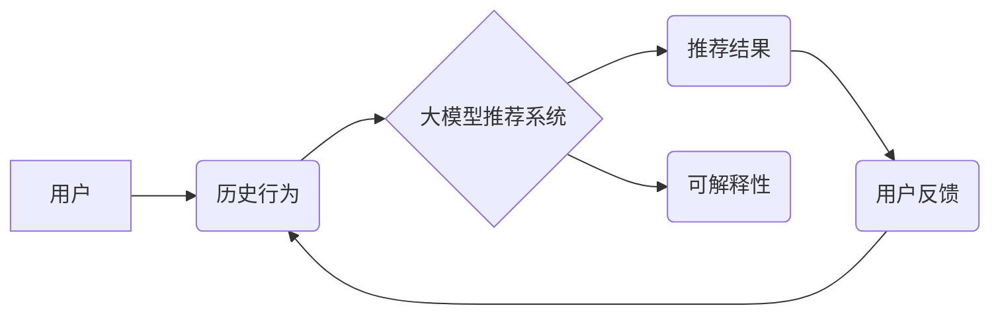

                 

## 基于大模型的推荐系统可解释性研究

> 关键词：大模型、推荐系统、可解释性、黑盒模型、模型解释、用户偏好、推荐算法

## 1. 背景介绍

推荐系统作为信息过滤和个性化服务的重要组成部分，在电商、社交媒体、视频平台等领域发挥着越来越重要的作用。随着大模型技术的快速发展，基于大模型的推荐系统展现出强大的学习能力和推荐精度，但同时也面临着可解释性挑战。

传统的推荐系统，例如基于协同过滤、内容过滤和基于规则的推荐算法，其决策过程相对透明，易于理解。然而，随着模型复杂度的增加，基于深度学习的大模型推荐系统往往呈现出“黑盒”特性，其内部决策机制难以被人类理解。

大模型推荐系统的可解释性问题引起了广泛关注，因为它直接关系到用户对推荐结果的信任和接受度。当用户无法理解推荐系统的推荐理由时，他们可能会对推荐结果产生怀疑，甚至拒绝使用。

## 2. 核心概念与联系

### 2.1  推荐系统

推荐系统旨在根据用户的历史行为、偏好和上下文信息，预测用户对特定物品的兴趣，并提供个性化的推荐列表。

### 2.2  大模型

大模型是指参数量巨大、训练数据海量的人工智能模型，通常拥有强大的泛化能力和学习能力。

### 2.3  可解释性

可解释性是指机器学习模型的决策过程能够被人类理解和解释的能力。

**核心概念关系图:**



## 3. 核心算法原理 & 具体操作步骤

### 3.1  算法原理概述

基于大模型的推荐系统通常采用Transformer架构，例如BERT、GPT等，通过学习用户和物品之间的语义关系，预测用户对物品的兴趣。

### 3.2  算法步骤详解

1. **数据预处理:** 收集用户行为数据、物品信息等，并进行清洗、转换、编码等预处理操作。
2. **模型训练:** 使用预处理后的数据训练Transformer模型，优化模型参数，使其能够准确预测用户对物品的兴趣。
3. **推荐生成:** 将新用户的行为数据输入到训练好的模型中，预测用户对物品的兴趣分数，并根据分数排序生成推荐列表。

### 3.3  算法优缺点

**优点:**

* 强大的学习能力，能够捕捉用户和物品之间的复杂关系。
* 高的推荐精度，能够提供更精准的推荐结果。

**缺点:**

* 模型复杂度高，训练成本高。
* 可解释性差，难以理解模型的决策过程。

### 3.4  算法应用领域

* 电子商务推荐
* 内容推荐
* 社交媒体推荐
* 视频平台推荐

## 4. 数学模型和公式 & 详细讲解 & 举例说明

### 4.1  数学模型构建

基于大模型的推荐系统通常采用以下数学模型：

* **用户-物品交互矩阵:** 用矩阵表示用户和物品之间的交互关系，其中每个元素表示用户对物品的评分或点击行为。

* **嵌入向量:** 将用户和物品映射到低维向量空间，以便模型学习它们的语义关系。

* **注意力机制:** 用于学习用户和物品之间的重要关系，赋予不同特征不同的权重。

### 4.2  公式推导过程

Transformer模型的核心是注意力机制，其计算公式如下：

$$
Attention(Q, K, V) = softmax(\frac{QK^T}{\sqrt{d_k}})V
$$

其中：

* $Q$：查询向量
* $K$：键向量
* $V$：值向量
* $d_k$：键向量的维度
* $softmax$：softmax函数

### 4.3  案例分析与讲解

假设用户A对电影A和电影B都进行了评分，电影A的评分为5，电影B的评分为3。

我们可以将用户A和电影A、电影B分别映射到嵌入向量空间，得到用户A的嵌入向量和电影A、电影B的嵌入向量。

然后，使用注意力机制计算用户A对电影A和电影B的注意力权重，结果表明用户A对电影A的注意力权重更高，说明用户A更喜欢电影A。

## 5. 项目实践：代码实例和详细解释说明

### 5.1  开发环境搭建

* Python 3.7+
* PyTorch 1.7+
* Transformers 4.0+

### 5.2  源代码详细实现

```python
from transformers import AutoModelForSequenceClassification, AutoTokenizer

# 加载预训练模型和词典
model_name = "bert-base-uncased"
tokenizer = AutoTokenizer.from_pretrained(model_name)
model = AutoModelForSequenceClassification.from_pretrained(model_name)

# 预处理数据
def preprocess_data(text):
    inputs = tokenizer(text, return_tensors="pt")
    return inputs

# 生成推荐结果
def generate_recommendations(user_input):
    inputs = preprocess_data(user_input)
    outputs = model(**inputs)
    # ... 提取推荐结果 ...

# 示例代码
user_input = "我喜欢看科幻电影"
recommendations = generate_recommendations(user_input)
print(recommendations)
```

### 5.3  代码解读与分析

* 代码首先加载预训练的BERT模型和词典。
* 然后定义一个预处理函数，将用户输入文本转换为模型可识别的格式。
* 生成推荐结果函数使用预处理后的数据输入到模型中，并提取推荐结果。
* 示例代码演示了如何使用该函数生成基于用户输入的推荐结果。

### 5.4  运行结果展示

运行结果将显示出基于用户输入的推荐电影列表。

## 6. 实际应用场景

### 6.1  电商推荐

基于大模型的推荐系统可以根据用户的浏览历史、购买记录、购物车内容等信息，推荐用户可能感兴趣的商品。

### 6.2  内容推荐

基于大模型的推荐系统可以根据用户的阅读习惯、观看历史、点赞行为等信息，推荐用户可能感兴趣的文章、视频、音乐等内容。

### 6.3  社交媒体推荐

基于大模型的推荐系统可以根据用户的关注关系、互动行为、兴趣标签等信息，推荐用户可能感兴趣的用户、话题、群组等内容。

### 6.4  未来应用展望

随着大模型技术的不断发展，基于大模型的推荐系统将应用于更多领域，例如个性化教育、医疗保健、金融服务等。

## 7. 工具和资源推荐

### 7.1  学习资源推荐

* **论文:**

    * Vaswani, A., Shazeer, N., Parmar, N., Uszkoreit, J., Jones, L., Gomez, A. N., ... & Polosukhin, I. (2017). Attention is all you need. Advances in neural information processing systems, 30.
    * Devlin, J., Chang, M. W., Lee, K., & Toutanova, K. (2018). Bert: Pre-training of deep bidirectional transformers for language understanding. arXiv preprint arXiv:1810.04805.

* **书籍:**

    * Deep Learning with Python by Francois Chollet
    * Natural Language Processing with PyTorch by Jason Brownlee

### 7.2  开发工具推荐

* **PyTorch:** 深度学习框架
* **Transformers:** 预训练模型库
* **TensorBoard:** 模型可视化工具

### 7.3  相关论文推荐

* **Explainable AI for Recommender Systems: A Survey**
* **Towards Interpretable Deep Learning for Recommender Systems**
* **LIME: Local Interpretable Model-Agnostic Explanations**

## 8. 总结：未来发展趋势与挑战

### 8.1  研究成果总结

基于大模型的推荐系统在推荐精度方面取得了显著的进步，但也面临着可解释性挑战。

### 8.2  未来发展趋势

* **模型可解释性研究:** 开发新的模型解释方法，提高用户对推荐结果的理解。
* **联邦学习:** 利用联邦学习技术，保护用户隐私的同时进行模型训练。
* **多模态推荐:** 将文本、图像、音频等多模态数据融合到推荐系统中，提供更丰富的推荐结果。

### 8.3  面临的挑战

* **模型复杂度:** 大模型的复杂性使得其可解释性研究更加困难。
* **数据隐私:** 用户数据隐私保护是基于大模型推荐系统面临的重要挑战。
* **公平性:** 确保推荐结果公平公正，避免歧视和偏见。

### 8.4  研究展望

未来，基于大模型的推荐系统将朝着更智能、更可解释、更公平的方向发展。

## 9. 附录：常见问题与解答

* **Q: 如何评估基于大模型的推荐系统的可解释性？**

* **A:** 可解释性评估方法包括：

    * **人类评估:** 邀请专家或用户对推荐结果进行解释性评估。
    * **自动化评估:** 使用自动化方法，例如LIME、SHAP等，量化模型的解释性。

* **Q: 如何提高基于大模型的推荐系统的可解释性？**

* **A:** 提高可解释性的方法包括：

    * 使用可解释的模型架构，例如线性模型、决策树等。
    * 使用注意力机制，突出模型关注的关键特征。
    * 使用局部解释方法，解释单个推荐结果背后的决策过程。


作者：禅与计算机程序设计艺术 / Zen and the Art of Computer Programming 
<end_of_turn>

