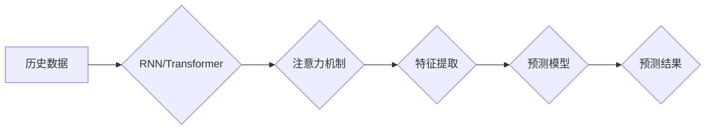

                 

## 基于注意力机制的时空序列预测精确化

> 关键词：时空序列预测、注意力机制、深度学习、RNN、Transformer、精确化

## 1. 背景介绍

时空序列预测是机器学习领域的重要研究方向，广泛应用于天气预报、交通流量预测、股票价格预测等领域。传统的预测方法，如ARIMA模型和Prophet模型，往往难以捕捉复杂时空序列中的长期依赖关系和非线性特征。近年来，随着深度学习技术的快速发展，基于深度学习的时空序列预测方法取得了显著的进展。

其中，循环神经网络（RNN）及其变体，如长短期记忆网络（LSTM）和门控循环单元（GRU），由于其能够处理序列数据的能力，在时空序列预测中取得了成功。然而，传统的RNN模型在处理长序列数据时仍然存在梯度消失和梯度爆炸的问题，难以捕捉长距离依赖关系。

注意力机制的提出为解决上述问题提供了新的思路。注意力机制能够学习到序列中不同时间步长的重要性，并赋予它们不同的权重，从而更好地捕捉长距离依赖关系。将注意力机制与RNN结合，形成了基于注意力机制的RNN模型，例如Transformer和其变体，在许多自然语言处理任务中取得了优异的性能。

## 2. 核心概念与联系

### 2.1 时空序列预测

时空序列预测是指根据历史数据预测未来某个时间点的值。时空序列数据包含了时间和空间两个维度，其预测目标通常是未来某个时间点的某个变量的值。

### 2.2 注意力机制

注意力机制是一种机器学习模型中用来模拟人类注意力机制的技术。它允许模型关注输入序列中与预测目标相关的部分，并忽略无关的部分。注意力机制可以提高模型的准确性和效率，尤其是在处理长序列数据时。

### 2.3 RNN 和 Transformer

循环神经网络（RNN）是一种专门用于处理序列数据的网络结构。它具有循环连接，能够捕获序列中时间步长之间的依赖关系。

Transformer是一种基于注意力机制的序列模型，它摒弃了RNN的循环连接，而是通过多头注意力机制和前馈神经网络来捕捉序列中的长距离依赖关系。

**Mermaid 流程图**



## 3. 核心算法原理 & 具体操作步骤

### 3.1 算法原理概述

基于注意力机制的时空序列预测算法通常包括以下步骤：

1. **数据预处理:** 将原始时空序列数据进行清洗、标准化等预处理操作，使其适合模型训练。
2. **特征提取:** 使用RNN或Transformer模型提取时空序列数据的特征，并利用注意力机制学习到不同时间步长的重要性。
3. **预测模型:** 基于提取的特征，构建一个预测模型，例如线性回归模型或多层感知机模型，用于预测未来某个时间点的值。
4. **模型训练:** 使用训练数据训练预测模型，并通过评估指标，例如均方误差（MSE）或平均绝对误差（MAE），评估模型的性能。

### 3.2 算法步骤详解

1. **数据预处理:**

   - **缺失值处理:** 使用平均值、中位数或其他插值方法填充缺失值。
   - **标准化:** 将数据标准化到均值为0，标准差为1的范围内，提高模型训练效率。
   - **特征工程:** 提取时空序列数据的特征，例如趋势、季节性、周期性等，并将其作为模型输入。

2. **特征提取:**

   - **RNN模型:** 使用LSTM或GRU单元构建RNN模型，并利用其循环连接捕获序列中时间步长之间的依赖关系。
   - **Transformer模型:** 使用多头注意力机制和前馈神经网络构建Transformer模型，并利用其并行计算能力和长距离依赖关系捕捉能力提取特征。

3. **预测模型:**

   - **线性回归模型:** 使用线性回归模型预测未来某个时间点的值，其预测结果为输入特征的线性组合。
   - **多层感知机模型:** 使用多层感知机模型预测未来某个时间点的值，其预测结果为多个隐藏层的激活函数的组合。

4. **模型训练:**

   - 使用训练数据训练预测模型，并使用优化算法，例如梯度下降算法，更新模型参数。
   - 通过评估指标，例如MSE或MAE，评估模型的性能，并根据评估结果调整模型参数或结构。

### 3.3 算法优缺点

**优点:**

- 能够捕捉复杂时空序列中的长期依赖关系和非线性特征。
- 性能优于传统的预测方法，例如ARIMA模型和Prophet模型。
- 可以处理高维数据和长序列数据。

**缺点:**

- 训练时间较长，需要大量的计算资源。
- 模型参数较多，容易过拟合。
- 对数据质量要求较高，需要进行充分的数据预处理。

### 3.4 算法应用领域

- 天气预报
- 交通流量预测
- 股票价格预测
- 能源需求预测
- 销售预测
- 医疗诊断

## 4. 数学模型和公式 & 详细讲解 & 举例说明

### 4.1 数学模型构建

基于注意力机制的时空序列预测模型通常可以表示为一个函数，其输入为历史数据，输出为未来某个时间点的预测值。

$$
y_t = f(x_1, x_2, ..., x_T, \theta)
$$

其中：

- $y_t$ 为未来时间步 $t$ 的预测值。
- $x_1, x_2, ..., x_T$ 为历史数据序列。
- $\theta$ 为模型参数。
- $f$ 为模型函数，通常由多个神经网络层组成。

### 4.2 公式推导过程

注意力机制的核心思想是学习到序列中不同时间步长的重要性，并赋予它们不同的权重。

假设我们有一个长度为 $T$ 的序列 $x = (x_1, x_2, ..., x_T)$，我们想要预测序列的最后一个时间步 $x_T$ 的值。

注意力机制会计算每个时间步 $x_i$ 与 $x_T$ 之间的相似度，并根据相似度计算每个时间步的权重 $a_i$。

$$
a_i = \frac{exp(score(x_i, x_T))}{\sum_{j=1}^{T} exp(score(x_j, x_T))}
$$

其中 $score(x_i, x_T)$ 为 $x_i$ 与 $x_T$ 之间的相似度，可以使用点积、余弦相似度等方法计算。

然后，使用这些权重对历史数据序列进行加权求和，得到一个新的表示向量 $c$。

$$
c = \sum_{i=1}^{T} a_i x_i
$$

这个新的表示向量 $c$ 包含了序列中与 $x_T$ 最相关的部分的信息，可以作为预测模型的输入。

### 4.3 案例分析与讲解

例如，在天气预报任务中，我们可以使用基于注意力机制的RNN模型预测未来一天的天气状况。

模型的输入为历史的天气数据，例如温度、湿度、风速等。

注意力机制可以学习到哪些历史天气数据对未来天气状况的影响最大，并赋予它们更高的权重。

这样，模型能够更好地捕捉天气变化的复杂关系，并做出更准确的预测。

## 5. 项目实践：代码实例和详细解释说明

### 5.1 开发环境搭建

- Python 3.6+
- TensorFlow 或 PyTorch 深度学习框架
- NumPy 科学计算库
- Pandas 数据处理库
- Matplotlib 数据可视化库

### 5.2 源代码详细实现

```python
import tensorflow as tf

# 定义模型
model = tf.keras.Sequential([
    tf.keras.layers.LSTM(units=128, return_sequences=True, input_shape=(timesteps, features)),
    tf.keras.layers.LSTM(units=64),
    tf.keras.layers.Dense(units=1)
])

# 编译模型
model.compile(optimizer='adam', loss='mse')

# 训练模型
model.fit(X_train, y_train, epochs=10, batch_size=32)

# 评估模型
loss = model.evaluate(X_test, y_test)
print('Test loss:', loss)

# 预测
predictions = model.predict(X_new)
```

### 5.3 代码解读与分析

- 使用LSTM层构建RNN模型，并设置返回序列输出，以便后续层接收序列信息。
- 使用Dense层作为输出层，预测单个时间步的预测值。
- 使用Adam优化器和均方误差损失函数训练模型。
- 使用训练数据训练模型，并设置训练轮数和批处理大小。
- 使用测试数据评估模型性能，并打印测试损失。
- 使用新数据预测未来时间步的预测值。

### 5.4 运行结果展示

运行代码后，可以得到模型的训练过程和测试结果，例如训练损失、测试损失、预测值等。

## 6. 实际应用场景

### 6.1 天气预报

基于注意力机制的时空序列预测模型可以用于预测未来天气状况，例如温度、降雨量、风速等。

### 6.2 交通流量预测

基于注意力机制的时空序列预测模型可以用于预测未来交通流量，例如道路拥堵情况、交通事故发生概率等。

### 6.3 股票价格预测

基于注意力机制的时空序列预测模型可以用于预测未来股票价格，例如股票涨跌幅、股票价格波动等。

### 6.4 未来应用展望

随着深度学习技术的不断发展，基于注意力机制的时空序列预测模型将在更多领域得到应用，例如：

- 医疗诊断
- 销售预测
- 能源需求预测
- 欺诈检测

## 7. 工具和资源推荐

### 7.1 学习资源推荐

- **书籍:**
    - Deep Learning by Ian Goodfellow, Yoshua Bengio, and Aaron Courville
    - Attention Is All You Need by Vaswani et al.
- **课程:**
    - Deep Learning Specialization by Andrew Ng on Coursera
    - Natural Language Processing Specialization by deeplearning.ai on Coursera

### 7.2 开发工具推荐

- **深度学习框架:** TensorFlow, PyTorch
- **数据处理库:** NumPy, Pandas
- **数据可视化库:** Matplotlib, Seaborn

### 7.3 相关论文推荐

- Attention Is All You Need (Vaswani et al., 2017)
- Transformer-XL: Attentive Language Modeling Beyond Millions of Tokens (Dai et al., 2019)
- Longformer: The Long-Document Transformer (Beltagy et al., 2020)

## 8. 总结：未来发展趋势与挑战

### 8.1 研究成果总结

基于注意力机制的时空序列预测模型取得了显著的进展，在许多实际应用场景中取得了优异的性能。

### 8.2 未来发展趋势

- **模型效率:** 研究更高效的注意力机制和模型架构，降低模型训练和预测时间。
- **数据效率:** 研究利用少量数据训练高性能模型的方法。
- **解释性:** 研究提高模型解释性的方法，使模型预测结果更易于理解。
- **多模态:** 研究将注意力机制应用于多模态时空序列预测，例如结合图像、音频等数据进行预测。

### 8.3 面临的挑战

- **数据质量:** 基于注意力机制的模型对数据质量要求较高，需要进行充分的数据预处理。
- **模型复杂度:** 这些模型通常比较复杂，需要大量的计算资源进行训练。
- **可解释性:** 这些模型的内部工作机制比较复杂，难以解释模型的预测结果。

### 8.4 研究展望

未来，基于注意力机制的时空序列预测模型将继续朝着更高效、更强大、更可解释的方向发展，并在更多领域得到应用。


## 9. 附录：常见问题与解答

**Q1: 注意力机制是如何工作的？**

A1: 注意力机制通过计算每个时间步与目标时间步之间的相似度，并根据相似度计算每个时间步的权重，从而学习到序列中不同时间步长的重要性。

**Q2: 基于注意力机制的时空序列预测模型有哪些优点？**

A2: 这些模型能够捕捉复杂时空序列中的长期依赖关系和非线性特征，性能优于传统的预测方法。

**Q3: 如何选择合适的注意力机制？**

A3: 选择合适的注意力机制取决于具体的应用场景和数据特点。常见的注意力机制包括多头注意力机制、自注意力机制、交叉注意力机制等。

**Q4: 如何评估基于注意力机制的时空序列预测模型的性能？**

A4: 常用的评估指标包括均方误差（MSE）、平均绝对误差（MAE）、平均绝对百分比误差（MAPE）等。

**作者：禅与计算机程序设计艺术 / Zen and the Art of Computer Programming**<end_of_turn>

