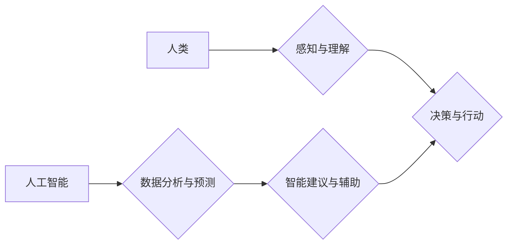

                 

## 关键词：增强智能、人机协同、认知拓展、深度学习、自然语言处理、计算机视觉、算法原理、数学模型、项目实践、应用场景

## 1. 背景介绍

人类文明的进步离不开对认知能力的不断提升。从语言的诞生到文字的出现，再到科学技术的革新，每一次突破都源于我们对世界更深层次的理解和掌控。而随着人工智能技术的飞速发展，我们正站在一个新的历史节点上，即将迎来一场深刻的人机协同革命。

增强智能（Augmented Intelligence，简称AI）的概念应运而生，它旨在通过人工智能技术辅助人类，而不是取代人类。AI的目的是提升人类的认知能力，帮助我们更高效地处理信息、解决问题、做出决策，从而拓展人类认知的新领域。

与传统的AI模式相比，增强智能更加注重人机协同，强调人类与人工智能之间的互补和融合。它将人工智能技术作为人类认知能力的扩展工具，赋予人类更强大的智能，帮助我们更好地应对复杂挑战。

## 2. 核心概念与联系

增强智能的核心概念是人机协同，它将人工智能技术与人类智慧相结合，形成一个协同作战的系统。

**Mermaid 流程图：**



**核心概念原理和架构：**

* **感知与理解：** 人类通过感官获取信息，并对信息进行理解和解释。
* **决策与行动：** 基于对信息的理解，人类做出决策并采取行动。
* **数据分析与预测：** 人工智能通过对大量数据的分析，可以识别模式、进行预测，并提供智能建议。
* **智能建议与辅助：** 人工智能的智能建议可以帮助人类做出更明智的决策，并辅助人类完成复杂的任务。

增强智能的核心架构是人机协同循环，人类和人工智能相互补充，共同完成任务。

## 3. 核心算法原理 & 具体操作步骤

### 3.1  算法原理概述

增强智能的核心算法主要包括深度学习、自然语言处理和计算机视觉等。

* **深度学习：** 深度学习是一种机器学习算法，它利用多层神经网络来模拟人类大脑的学习过程。深度学习算法能够从海量数据中学习复杂的模式和特征，并进行预测和分类。
* **自然语言处理：** 自然语言处理是指让计算机能够理解和处理人类语言的技术。自然语言处理算法可以用于文本分析、机器翻译、语音识别等领域。
* **计算机视觉：** 计算机视觉是指让计算机能够“看”和理解图像的技术。计算机视觉算法可以用于图像识别、物体检测、场景理解等领域。

### 3.2  算法步骤详解

**以深度学习为例，其基本步骤如下：**

1. **数据收集和预处理：** 收集大量相关数据，并进行清洗、格式化等预处理工作。
2. **模型构建：** 根据任务需求，选择合适的深度学习模型架构，例如卷积神经网络（CNN）、循环神经网络（RNN）等。
3. **模型训练：** 使用训练数据训练深度学习模型，调整模型参数，使其能够准确地进行预测或分类。
4. **模型评估：** 使用测试数据评估模型的性能，例如准确率、召回率等指标。
5. **模型部署：** 将训练好的模型部署到实际应用场景中，用于进行预测或分类。

### 3.3  算法优缺点

**深度学习算法的优点：**

* 能够学习复杂的模式和特征。
* 性能优于传统机器学习算法。
* 可应用于多种领域。

**深度学习算法的缺点：**

* 需要大量数据进行训练。
* 训练过程耗时和耗能。
* 模型解释性较差。

### 3.4  算法应用领域

深度学习算法已广泛应用于以下领域：

* **图像识别：** 人脸识别、物体检测、图像分类等。
* **自然语言处理：** 机器翻译、文本摘要、情感分析等。
* **语音识别：** 语音转文本、语音助手等。
* **医疗诊断：** 疾病预测、影像分析等。
* **金融风险控制：** 欺诈检测、信用评估等。

## 4. 数学模型和公式 & 详细讲解 & 举例说明

### 4.1  数学模型构建

深度学习模型的核心是神经网络，它由多个层级的神经元组成。每个神经元接收来自上一层的输入信号，并通过激活函数进行处理，输出到下一层。

**神经网络模型的数学表示：**

$$
y = f(W x + b)
$$

其中：

* $y$ 是输出值。
* $x$ 是输入值。
* $W$ 是权重矩阵。
* $b$ 是偏置向量。
* $f$ 是激活函数。

### 4.2  公式推导过程

深度学习模型的训练过程是通过反向传播算法来进行的。反向传播算法的核心思想是利用梯度下降法来更新模型参数，使得模型的输出值与真实值之间的误差最小化。

**反向传播算法的公式推导过程：**

1. 计算输出值与真实值的误差。
2. 计算误差对模型参数的梯度。
3. 使用梯度下降法更新模型参数。

### 4.3  案例分析与讲解

**以图像分类为例，解释反向传播算法的应用：**

1. 将图像输入到深度学习模型中，模型输出图像所属的类别概率。
2. 将模型输出的概率与真实类别进行比较，计算误差。
3. 计算误差对模型参数（权重和偏置）的梯度。
4. 使用梯度下降法更新模型参数，使得模型输出的概率与真实类别之间的误差最小化。

## 5. 项目实践：代码实例和详细解释说明

### 5.1  开发环境搭建

* **操作系统：** Ubuntu 18.04 或更高版本
* **编程语言：** Python 3.6 或更高版本
* **深度学习框架：** TensorFlow 或 PyTorch
* **其他工具：** Jupyter Notebook、Git

### 5.2  源代码详细实现

```python
import tensorflow as tf

# 定义模型结构
model = tf.keras.models.Sequential([
    tf.keras.layers.Conv2D(32, (3, 3), activation='relu', input_shape=(28, 28, 1)),
    tf.keras.layers.MaxPooling2D((2, 2)),
    tf.keras.layers.Conv2D(64, (3, 3), activation='relu'),
    tf.keras.layers.MaxPooling2D((2, 2)),
    tf.keras.layers.Flatten(),
    tf.keras.layers.Dense(10, activation='softmax')
])

# 编译模型
model.compile(optimizer='adam',
              loss='sparse_categorical_crossentropy',
              metrics=['accuracy'])

# 加载数据集
(x_train, y_train), (x_test, y_test) = tf.keras.datasets.mnist.load_data()

# 数据预处理
x_train = x_train.astype('float32') / 255
x_test = x_test.astype('float32') / 255
x_train = x_train.reshape((x_train.shape[0], 28, 28, 1))
x_test = x_test.reshape((x_test.shape[0], 28, 28, 1))

# 训练模型
model.fit(x_train, y_train, epochs=5)

# 评估模型
loss, accuracy = model.evaluate(x_test, y_test)
print('Test loss:', loss)
print('Test accuracy:', accuracy)
```

### 5.3  代码解读与分析

这段代码实现了使用TensorFlow框架训练一个简单的图像分类模型。

* 首先定义了模型结构，包括卷积层、池化层和全连接层。
* 然后编译模型，指定优化器、损失函数和评价指标。
* 加载MNIST数据集，并对数据进行预处理。
* 训练模型，并评估模型的性能。

### 5.4  运行结果展示

训练完成后，模型能够准确地识别MNIST数据集中的手写数字。

## 6. 实际应用场景

### 6.1  医疗诊断

* **疾病预测：** 利用深度学习算法分析患者的医疗影像、病历等数据，预测疾病的发生风险。
* **影像分析：** 利用计算机视觉算法分析医疗影像，辅助医生诊断疾病。

### 6.2  金融风险控制

* **欺诈检测：** 利用机器学习算法分析交易数据，识别异常交易行为，防止欺诈行为。
* **信用评估：** 利用深度学习算法分析客户的信用历史数据，评估客户的信用风险。

### 6.3  智能客服

* **聊天机器人：** 利用自然语言处理算法，构建智能聊天机器人，为客户提供24小时在线服务。
* **语音助手：** 利用语音识别和自然语言理解算法，构建语音助手，帮助用户完成各种任务。

### 6.4  未来应用展望

增强智能技术将应用于越来越多的领域，例如：

* **教育：** 个性化学习、智能辅导。
* **交通：** 自动驾驶、智能交通管理。
* **制造：** 智能制造、工业自动化。
* **娱乐：** 个性化内容推荐、虚拟现实体验。

## 7. 工具和资源推荐

### 7.1  学习资源推荐

* **书籍：**
    * 《深度学习》
    * 《机器学习》
    * 《人工智能：一种现代方法》
* **在线课程：**
    * Coursera
    * edX
    * Udacity

### 7.2  开发工具推荐

* **深度学习框架：** TensorFlow、PyTorch、Keras
* **编程语言：** Python
* **数据可视化工具：** Matplotlib、Seaborn

### 7.3  相关论文推荐

* **《ImageNet Classification with Deep Convolutional Neural Networks》**
* **《Attention Is All You Need》**
* **《BERT: Pre-training of Deep Bidirectional Transformers for Language Understanding》**

## 8. 总结：未来发展趋势与挑战

### 8.1  研究成果总结

增强智能技术取得了显著的进展，在多个领域取得了突破性成果。深度学习算法的性能不断提升，自然语言处理和计算机视觉技术也取得了长足进步。

### 8.2  未来发展趋势

* **模型更加强大：** 模型规模将继续扩大，模型能力将进一步提升。
* **应用更加广泛：** 增强智能技术将应用于更多领域，例如医疗、教育、交通等。
* **人机协同更加紧密：** 人工智能将更加融入人类生活，与人类形成更加紧密的协同关系。

### 8.3  面临的挑战

* **数据安全和隐私保护：** 增强智能技术依赖于大量数据，如何保障数据安全和隐私保护是一个重要挑战。
* **算法解释性和可信度：** 深度学习算法的“黑箱”特性使得其解释性和可信度不足，需要进一步研究。
* **伦理和社会影响：** 增强智能技术的发展可能带来伦理和社会问题，需要进行深入探讨和规范。

### 8.4  研究展望

未来，增强智能技术将继续发展，并对人类社会产生深远影响。我们需要加强对增强智能技术的研究，探索其潜力，并积极应对其带来的挑战，确保其健康发展，造福人类社会。

## 9. 附录：常见问题与解答

**Q1：增强智能与传统人工智能有什么区别？**

**A1：** 增强智能侧重于人机协同，将人工智能技术作为人类认知能力的扩展工具，而传统人工智能则更注重构建独立的智能系统。

**Q2：增强智能技术有哪些应用场景？**

**A2：** 增强智能技术应用场景广泛，例如医疗诊断、金融风险控制、智能客服等。

**Q3：如何学习增强智能技术？**

**A3：** 可以通过阅读相关书籍、参加在线课程、学习深度学习框架等方式学习增强智能技术。


作者：禅与计算机程序设计艺术 / Zen and the Art of Computer Programming 
<end_of_turn>

