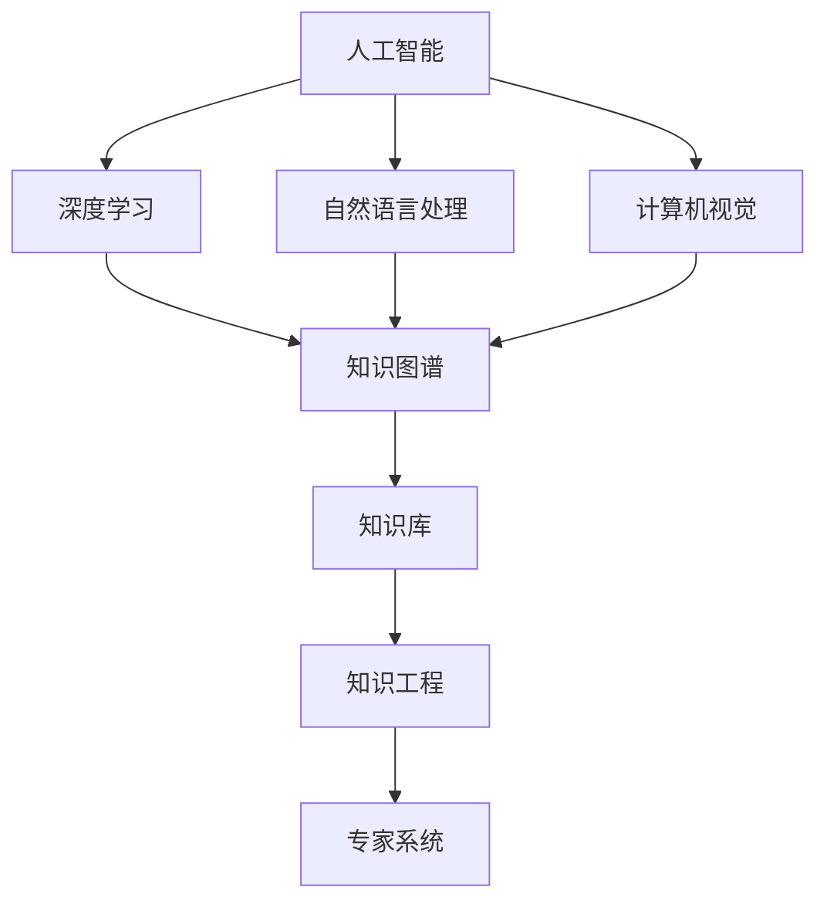

                 

# 人才争夺战中的Lepton AI：如何吸引顶尖AI工程师

## 1. 背景介绍

### 1.1 问题由来
随着人工智能（AI）技术的飞速发展，AI人才成为了各大科技公司、初创企业和研究机构的抢夺对象。在AI领域，尤其是深度学习、计算机视觉、自然语言处理等领域，顶尖工程师不仅具备深厚的理论知识，还具备强大的实践能力。这些工程师是推动AI技术创新、产品落地和行业应用的关键力量。然而，AI人才的稀缺性以及众多企业的激烈竞争，使得企业面临严峻的人才争夺战。

### 1.2 问题核心关键点
AI人才争夺的核心在于如何打造有吸引力且高效的人才吸引和管理体系，以确保能够招聘、培养并留住顶尖AI工程师。这包括提供有竞争力的薪酬福利、职业发展机会、工作环境和文化氛围等，以及建立一个能够激发创造力和协同合作的组织结构。

### 1.3 问题研究意义
吸引和留住顶尖AI工程师对于推动企业创新、提升产品竞争力、加速技术产业化进程具有重要意义。顶尖AI工程师的加入不仅可以提升企业研发能力和技术实力，还可以带来新的研究思路和方法，推动技术的突破和创新。

## 2. 核心概念与联系

### 2.1 核心概念概述

为更好地理解如何吸引顶尖AI工程师，本节将介绍几个密切相关的核心概念：

- 人工智能(AI)：涵盖机器学习、深度学习、自然语言处理、计算机视觉等领域的综合性技术。AI技术的发展离不开人才的支撑。
- 深度学习(Deep Learning)：一种基于多层神经网络的机器学习技术，擅长处理非线性、高维数据。
- 自然语言处理(NLP)：使计算机能够理解和生成人类语言的技术，包括文本分类、机器翻译、问答系统等。
- 计算机视觉(Computer Vision)：使计算机能够识别、分析和理解图像和视频中的视觉信息的技术。
- 知识图谱(Knowledge Graph)：通过图形结构表示和存储实体及其关系，支持自然语言理解和推理。
- 知识库(Knowledge Base)：存储特定领域知识的结构化数据库，如WordNet、Freebase等。
- 知识工程(Knowledge Engineering)：构建和维护知识库的技术，涉及知识获取、知识表示、知识推理等。
- 专家系统(Expert System)：利用知识库和推理机制模拟专家决策过程，解决复杂问题。

这些核心概念之间的逻辑关系可以通过以下Mermaid流程图来展示：



这个流程图展示了大语言模型的核心概念及其之间的关系：

1. 人工智能通过深度学习、自然语言处理和计算机视觉等技术手段，处理和理解复杂数据。
2. 知识图谱和知识库通过知识工程技术，构建和管理领域的知识体系。
3. 专家系统利用知识库和推理机制，辅助解决复杂问题。

## 3. 核心算法原理 & 具体操作步骤
### 3.1 算法原理概述

吸引顶尖AI工程师的算法原理可以归结为以下几个方面：

1. **人才吸引理论**：
   - **马斯洛需求层次理论**：满足工程师的生理、安全、社交、尊重和自我实现需求，建立全面的薪酬福利体系。
   - **双因素理论**：通过提升工作本身的吸引力和外部激励（如物质奖励），提升工程师的工作动机。
   - **期望理论**：通过匹配期望与实际，确保薪酬福利与企业发展紧密挂钩，增强归属感。

2. **招聘策略**：
   - **定制化招聘**：根据不同职位的需求，设计有针对性的招聘策略，吸引特定背景和技能的AI工程师。
   - **多渠道招聘**：通过多种渠道（如社交媒体、行业会议、人才中介等）获取高质量的候选人，提升招聘效率。
   - **内部推荐**：鼓励现有员工推荐合适人选，降低招聘成本，提升候选人质量。

3. **培训与发展**：
   - **持续学习**：提供丰富的培训资源，帮助工程师不断提升技能和知识。
   - **职业规划**：制定清晰的职业发展路径，提供晋升机会和领导岗位。
   - **跨领域合作**：鼓励工程师跨领域合作，拓宽视野，提升创新能力。

### 3.2 算法步骤详解

基于以上原理，以下是吸引顶尖AI工程师的具体操作步骤：

1. **需求分析**：
   - 明确企业需要哪些技能和背景的AI工程师，制定详细的职位描述。
   - 分析不同职位的工作内容、挑战和要求，设计有针对性的招聘策略。

2. **薪酬福利设计**：
   - 参考市场标准，设计有竞争力的薪酬方案，包括基本工资、奖金、股权激励等。
   - 提供全面的福利体系，包括健康保险、退休金、带薪休假等。

3. **招聘渠道选择**：
   - 根据目标候选人的特点，选择合适的招聘渠道，如LinkedIn、GitHub、AI专业论坛等。
   - 参加行业会议、AI黑客马拉松等活动，建立企业品牌，吸引潜在候选人。

4. **面试和评估**：
   - 设计科学合理的面试流程，包括技术面试、行为面试、团队合作测试等。
   - 组建专业的面试团队，邀请技术专家和HR共同参与评估，确保公平公正。

5. **入职培训**：
   - 提供全面的入职培训，包括企业文化、技术栈、工具和流程等。
   - 安排导师或资深工程师辅导新员工，快速融入团队。

6. **职业发展支持**：
   - 建立明确的职业发展路径，提供晋升和加薪机会。
   - 定期举办技术交流会、讲座和培训，提升员工技术水平。

7. **绩效评估与反馈**：
   - 设定明确的绩效评估标准，定期进行绩效评估和反馈。
   - 提供个性化的职业发展建议，帮助员工提升技能和表现。

### 3.3 算法优缺点

吸引顶尖AI工程师的算法具有以下优点：

1. **提高人才吸引力**：通过设计有竞争力的薪酬福利和职业发展路径，吸引和留住顶尖AI工程师。
2. **提升招聘效率**：通过多渠道招聘和定制化招聘策略，提高招聘效率，降低招聘成本。
3. **增强员工忠诚度**：通过持续学习和发展支持，提升员工满意度和归属感，增强企业忠诚度。

同时，该算法也存在一些局限性：

1. **成本高**：设计有竞争力的薪酬福利和职业发展路径需要投入大量资源。
2. **复杂度高**：需要精细化设计招聘策略和面试流程，对HR团队的要求较高。
3. **灵活性不足**：某些顶级AI工程师可能更注重自由和灵活的工作环境，不适合所有企业。

### 3.4 算法应用领域

吸引顶尖AI工程师的算法在AI领域得到了广泛应用，适用于各种企业和技术团队，如：

- 高科技企业：如Google、Facebook、Amazon等，提供有竞争力的薪酬福利和职业发展机会，吸引全球顶尖AI人才。
- 初创企业：如OpenAI、DeepMind、Magic Labs等，通过灵活的招聘策略和创业环境，吸引有创业精神的高潜力AI人才。
- 研究机构：如斯坦福大学、麻省理工学院等，提供优厚的学术环境和研究资源，吸引全球顶尖学术人才。
- 大型企业和集团：如IBM、Microsoft、Samsung等，通过多元化的招聘渠道和强大的企业文化，吸引和留住高水平AI工程师。

## 4. 数学模型和公式 & 详细讲解

### 4.1 数学模型构建

吸引顶尖AI工程师的算法可以抽象为一个数学模型，其中输入为企业的薪酬福利、培训与发展、招聘策略和职业支持等，输出为AI工程师的满意度和忠诚度。

令 $S$ 为AI工程师的满意度，$L$ 为AI工程师的忠诚度。模型的输入包括：

- $P$：基本工资、奖金、股权激励等薪酬福利。
- $T$：培训资源、学习机会、职业发展路径等职业发展支持。
- $R$：招聘渠道、面试流程、团队合作测试等招聘策略。
- $V$：企业文化、领导风格、工作环境等职业支持。

则模型可表示为：

$$ S = f(P, T, R, V) $$

$$ L = g(S, P, T, R, V) $$

其中 $f$ 和 $g$ 为非线性函数，表示薪酬福利、职业发展、招聘策略和职业支持对满意度和忠诚度的影响。

### 4.2 公式推导过程

令 $P_{base}$ 为基本工资，$P_{bonus}$ 为奖金，$P_{stock}$ 为股权激励；$T_{train}$ 为培训资源，$T_{career}$ 为职业发展路径；$R_{recruit}$ 为招聘渠道，$R_{interview}$ 为面试流程，$R_{team}$ 为团队合作测试；$V_{culture}$ 为企业文化，$V_{leadership}$ 为领导风格，$V_{environment}$ 为工作环境。

令 $a_1, a_2, \ldots, a_7$ 为对应系数，则有：

$$ S = a_1 P_{base} + a_2 P_{bonus} + a_3 P_{stock} + a_4 T_{train} + a_5 T_{career} + a_6 R_{recruit} + a_7 R_{interview} $$

$$ L = b_1 S + b_2 P_{base} + b_3 P_{bonus} + b_4 T_{train} + b_5 T_{career} + b_6 R_{recruit} + b_7 R_{interview} $$

其中 $a_1, a_2, \ldots, a_7$ 和 $b_1, b_2, \ldots, b_7$ 为调节系数，用于描述不同因素对满意度和忠诚度的影响强度。

### 4.3 案例分析与讲解

以下以谷歌（Google）为例，分析其如何通过算法吸引和留住顶尖AI工程师：

1. **薪酬福利**：
   - 提供具有竞争力的薪酬和奖金，每年年终发放股权激励。
   - 提供丰富的福利，如健康保险、带薪休假、免费餐饮等。

2. **职业发展**：
   - 提供清晰的职业发展路径，鼓励员工不断提升技能和承担更多责任。
   - 举办技术交流会和培训课程，提升员工技术水平。

3. **招聘策略**：
   - 在多个渠道（如LinkedIn、GitHub、AI论坛等）发布招聘信息，吸引优秀候选人。
   - 组织AI黑客马拉松、实习项目等活动，提升企业品牌影响力。

4. **团队合作**：
   - 组建跨职能团队，鼓励不同背景和技能的工程师合作。
   - 设立导师制度，为新员工提供指导和支持。

5. **企业文化**：
   - 强调开放、创新和多样性，提供自由的工作环境和灵活的工作方式。
   - 提供员工成长和自我实现的机会，增强员工的归属感和满意度。

## 5. 项目实践：代码实例和详细解释说明

### 5.1 开发环境搭建

在进行招聘算法实践前，我们需要准备好开发环境。以下是使用Python进行数据分析和机器学习的开发环境配置流程：

1. 安装Anaconda：从官网下载并安装Anaconda，用于创建独立的Python环境。

2. 创建并激活虚拟环境：
```bash
conda create -n pythontutorial python=3.8 
conda activate pythontutorial
```

3. 安装必要的Python库：
```bash
conda install numpy pandas matplotlib scikit-learn scikit-optimize
```

4. 安装机器学习框架：
```bash
pip install tensorflow pytorch scikit-learn
```

完成上述步骤后，即可在`pythontutorial`环境中开始招聘算法实践。

### 5.2 源代码详细实现

这里我们以招聘AI工程师为例，给出使用Scikit-learn进行员工满意度预测的Python代码实现。

首先，定义员工满意度和忠诚度的训练数据集：

```python
import pandas as pd
from sklearn.model_selection import train_test_split
from sklearn.preprocessing import StandardScaler
from sklearn.ensemble import RandomForestClassifier

# 加载数据
data = pd.read_csv('employee_data.csv')

# 定义满意度为因变量，其他因素为自变量
X = data[['P_{base}', 'P_{bonus}', 'P_{stock}', 'T_{train}', 'T_{career}', 'R_{recruit}', 'R_{interview}', 'V_{culture}', 'V_{leadership}', 'V_{environment}']]
y = data['S']

# 划分训练集和测试集
X_train, X_test, y_train, y_test = train_test_split(X, y, test_size=0.2, random_state=42)

# 标准化数据
scaler = StandardScaler()
X_train = scaler.fit_transform(X_train)
X_test = scaler.transform(X_test)
```

然后，使用随机森林模型进行训练和评估：

```python
# 定义随机森林模型
model = RandomForestClassifier(n_estimators=100, random_state=42)

# 训练模型
model.fit(X_train, y_train)

# 评估模型
accuracy = model.score(X_test, y_test)
print(f'Accuracy: {accuracy:.2f}')
```

最后，在实际招聘中，可以使用上述模型预测候选人的满意度，从而做出更有针对性的招聘决策。

### 5.3 代码解读与分析

让我们再详细解读一下关键代码的实现细节：

**数据预处理**：
- 使用Pandas库加载数据集，并进行数据清洗和特征选择。
- 定义满意度为因变量，其他因素为自变量，构建训练集和测试集。
- 使用标准化技术对数据进行归一化处理，提升模型性能。

**模型选择与训练**：
- 定义随机森林模型，并通过fit方法进行训练。
- 使用score方法在测试集上评估模型的准确率，并输出结果。

在实际应用中，招聘算法还需要考虑更多因素，如候选人的背景、技能、文化匹配度等。通过不断优化模型和算法，可以更好地预测和吸引顶尖AI工程师。

## 6. 实际应用场景

### 6.1 谷歌（Google）

谷歌作为全球领先的科技公司，通过其独特的招聘算法，成功吸引和留住了大量的顶尖AI工程师。谷歌的招聘算法包括以下几个关键点：

1. **多样性和包容性**：谷歌强调多样性和包容性，鼓励不同背景和文化的员工加入，提升团队的创新力和多样性。
2. **文化契合度**：谷歌在招聘过程中，通过面试和评估，重点考察候选人与企业文化的契合度，确保员工能够长期留在公司。
3. **发展机会**：谷歌提供广泛的职业发展机会，包括培训、学习、职业晋升等，满足员工的多样化需求。

谷歌的招聘算法不仅提升了AI人才的吸引力和忠诚度，还为公司的持续创新和快速发展提供了坚实的人才保障。

### 6.2 微软（Microsoft）

微软通过其强大的企业文化和技术平台，吸引了全球顶尖的AI工程师。微软的招聘算法包括以下几个关键点：

1. **技术领先**：微软强调技术领先和创新，提供最新的技术和平台，满足AI工程师对新技术的追求。
2. **跨领域合作**：微软鼓励跨部门和跨领域的合作，促进不同领域的知识和技术融合，提升团队的整体创新能力。
3. **领导力培养**：微软注重领导力的培养，提供广泛的领导力培训和发展机会，帮助员工成为未来的领导者。

微软的招聘算法不仅提升了AI人才的吸引力和满意度，还为公司的技术创新和产业应用提供了强有力的人才保障。

### 6.3 亚马逊（Amazon）

亚马逊通过其灵活的招聘策略和激励机制，吸引了大量的顶尖AI工程师。亚马逊的招聘算法包括以下几个关键点：

1. **灵活的工作环境**：亚马逊提供灵活的工作时间和工作地点，满足员工对工作环境的需求。
2. **高激励机制**：亚马逊通过高薪酬和股权激励，吸引和留住顶尖AI工程师。
3. **快速晋升机制**：亚马逊建立快速晋升机制，为优秀员工提供快速晋升的机会，提升员工的职业发展动力。

亚马逊的招聘算法不仅提升了AI人才的吸引力和满意度，还为公司的业务扩展和市场竞争力提供了坚实的人才保障。

### 6.4 未来应用展望

随着AI技术的不断发展和应用，招聘算法的未来趋势将更加智能化和个性化。以下是几个可能的趋势：

1. **数据驱动招聘**：通过大数据和机器学习技术，提升招聘效率和准确性，预测候选人的表现和适应性。
2. **个性化招聘**：根据候选人的背景和技能，提供个性化的招聘建议，提高招聘成功率。
3. **自动化招聘**：通过自动化工具和算法，降低招聘过程中的人工干预，提升招聘效率。
4. **跨领域合作**：鼓励跨领域和跨团队的合作，提升团队的多样性和创新能力。
5. **领导力培养**：注重领导力的培养和提升，培养未来的技术和管理领袖。

这些趋势将进一步提升招聘算法的智能化和个性化水平，帮助企业更高效地吸引和留住顶尖AI工程师。

## 7. 工具和资源推荐

### 7.1 学习资源推荐

为了帮助开发者系统掌握招聘算法的理论基础和实践技巧，这里推荐一些优质的学习资源：

1. 《招聘算法与人才管理》系列博文：由招聘专家撰写，深入浅出地介绍了招聘算法和人才管理的基本概念和实践技巧。

2. 《数据科学与人才管理》课程：由知名的数据科学和人才管理专家开设的在线课程，涵盖数据驱动招聘、人才管理等前沿话题。

3. 《招聘管理实战》书籍：系统介绍了招聘管理的各个环节，包括职位发布、简历筛选、面试评估等，适合招聘经理和HR人员参考。

4. LinkedIn Learning：提供丰富的招聘和管理课程，包括招聘技巧、人才管理、跨领域合作等，适合不同背景的HR人员学习。

5. Glassdoor：提供大量的公司评价和员工反馈，帮助候选人了解企业的工作环境和企业文化，辅助招聘决策。

通过对这些资源的学习实践，相信你一定能够快速掌握招聘算法的精髓，并用于解决实际的招聘问题。

### 7.2 开发工具推荐

高效的开发离不开优秀的工具支持。以下是几款用于招聘算法开发的常用工具：

1. Python：作为数据分析和机器学习的主流编程语言，Python提供丰富的库和框架，支持数据处理、机器学习和数据分析等任务。

2. R：作为数据分析和统计分析的主流编程语言，R提供强大的数据处理和统计分析能力，适用于招聘数据分析和建模。

3. Excel：作为常见的电子表格软件，Excel提供丰富的数据分析和可视化功能，适用于初步数据处理和分析。

4. Tableau：作为数据可视化的主流工具，Tableau提供直观的可视化图表，帮助分析数据和理解招聘趋势。

5. Python库和框架：如Pandas、NumPy、Scikit-learn、TensorFlow等，提供丰富的数据分析和机器学习功能，支持招聘算法的开发和优化。

合理利用这些工具，可以显著提升招聘算法的开发效率，加快创新迭代的步伐。

### 7.3 相关论文推荐

招聘算法的持续发展离不开学界的持续研究。以下是几篇奠基性的相关论文，推荐阅读：

1. "A Study of Recruitment in the Information Technology Industry"：探讨IT行业招聘策略和人才管理，提出招聘过程中的关键因素和优化建议。

2. "Recruitment and Retention in Technology Companies"：研究技术公司的人才吸引和保留策略，分析不同因素对员工满意度和忠诚度的影响。

3. "Towards a Theory of RecruitmenT: Insights from Survey Research"：通过调查研究，揭示招聘过程中的关键因素和最佳实践，为招聘算法提供理论支持。

4. "Developing a Recruitment Model for Software Engineers"：构建软件工程师招聘模型，通过机器学习技术预测候选人的表现和适应性，提升招聘效率和准确性。

5. "Hiring Algorithms and Their Impact on Employee Satisfaction"：分析招聘算法对员工满意度的影响，提出优化招聘算法的建议，提升招聘效果。

这些论文代表了大语言模型招聘算法的未来发展方向，通过学习这些前沿成果，可以帮助研究者把握学科前进方向，激发更多的创新灵感。

## 8. 总结：未来发展趋势与挑战

### 8.1 总结

本文对吸引顶尖AI工程师的算法进行了全面系统的介绍。首先阐述了招聘算法的研究背景和意义，明确了招聘算法在吸引和留住顶尖AI工程师方面的重要价值。其次，从原理到实践，详细讲解了招聘算法的数学原理和操作步骤，给出了招聘算法任务开发的完整代码实例。同时，本文还广泛探讨了招聘算法在谷歌、微软、亚马逊等公司的应用前景，展示了招聘算法的巨大潜力。此外，本文精选了招聘算法的各类学习资源，力求为读者提供全方位的技术指引。

通过本文的系统梳理，可以看到，招聘算法在AI领域得到了广泛应用，适用于各种企业和技术团队，如高科技企业、初创企业、研究机构、大型企业和集团等。通过设计有竞争力的薪酬福利、职业发展机会、招聘策略和职业支持，招聘算法可以吸引和留住顶尖AI工程师，为公司的持续创新和快速发展提供坚实的人才保障。未来，伴随招聘算法的不断演进，相信AI人才的吸引和保留将更加智能化和个性化，推动企业在激烈的AI人才争夺战中脱颖而出。

### 8.2 未来发展趋势

招聘算法的未来发展趋势将呈现以下几个方向：

1. **数据驱动**：通过大数据和机器学习技术，提升招聘效率和准确性，预测候选人的表现和适应性。
2. **个性化招聘**：根据候选人的背景和技能，提供个性化的招聘建议，提高招聘成功率。
3. **自动化招聘**：通过自动化工具和算法，降低招聘过程中的人工干预，提升招聘效率。
4. **跨领域合作**：鼓励跨领域和跨团队的合作，提升团队的多样性和创新能力。
5. **领导力培养**：注重领导力的培养和提升，培养未来的技术和管理领袖。
6. **技术领先**：通过提供最新的技术和平台，满足AI工程师对新技术的追求。

这些趋势将进一步提升招聘算法的智能化和个性化水平，帮助企业更高效地吸引和留住顶尖AI工程师。

### 8.3 面临的挑战

尽管招聘算法已经取得了显著成效，但在迈向更加智能化和个性化应用的过程中，仍面临诸多挑战：

1. **数据隐私**：招聘过程中需要处理大量敏感数据，如何保护数据隐私和安全，是一个重要的挑战。
2. **公平性**：招聘算法需要避免偏见和歧视，确保公平公正，提升员工满意度和归属感。
3. **成本控制**：设计和维护招聘算法需要投入大量资源，如何平衡成本和效果，需要进一步优化。
4. **技术挑战**：招聘算法需要结合多领域知识和技能，如何融合技术和管理，需要进一步探索。
5. **企业文化**：招聘算法需要与企业文化相匹配，如何塑造和提升企业文化，需要持续努力。

这些挑战需要企业在招聘算法的设计和实施过程中，不断优化和调整，才能实现最佳效果。

### 8.4 研究展望

面对招聘算法面临的种种挑战，未来的研究需要在以下几个方面寻求新的突破：

1. **数据隐私保护**：研究隐私保护技术，如差分隐私、联邦学习等，保护招聘过程中的数据隐私和安全。
2. **公平性研究**：研究公平性算法，如公平性机器学习、公平性评估指标等，确保招聘算法的公平公正。
3. **成本优化**：研究成本优化技术，如自动化招聘工具、智能推荐系统等，降低招聘成本，提升招聘效率。
4. **技术融合**：研究跨领域技术和方法，如知识图谱、因果推理等，提升招聘算法的智能化和多样化。
5. **企业文化建设**：研究企业文化建设方法，如领导力培养、团队建设等，塑造和提升企业的文化氛围。

这些研究方向的探索，必将引领招聘算法迈向更高的台阶，为招聘过程带来更多智能化和个性化解决方案，帮助企业在激烈的AI人才争夺战中脱颖而出。

## 9. 附录：常见问题与解答

**Q1：招聘算法是否适用于所有企业？**

A: 招聘算法适用于各种企业和技术团队，如高科技企业、初创企业、研究机构、大型企业和集团等。通过设计有竞争力的薪酬福利、职业发展机会、招聘策略和职业支持，招聘算法可以吸引和留住顶尖AI工程师，为公司的持续创新和快速发展提供坚实的人才保障。

**Q2：如何提升招聘算法的效率？**

A: 提升招聘算法的效率，可以从以下几个方面入手：
1. **自动化招聘工具**：通过自动化工具和算法，降低招聘过程中的人工干预，提升招聘效率。
2. **智能推荐系统**：利用大数据和机器学习技术，推荐最适合的候选人，提高招聘成功率。
3. **跨领域合作**：鼓励跨领域和跨团队的合作，提升团队的多样性和创新能力。
4. **快速反馈机制**：建立快速反馈机制，及时了解候选人的反馈，调整招聘策略，提升招聘效果。

**Q3：如何提升招聘算法的公平性？**

A: 提升招聘算法的公平性，可以从以下几个方面入手：
1. **公平性评估指标**：研究公平性评估指标，如性别、种族、年龄等，确保招聘算法的公平公正。
2. **多样性和包容性**：强调多样性和包容性，鼓励不同背景和文化的员工加入，提升团队的创新力和多样性。
3. **无偏见算法**：研究无偏见算法，如公平性机器学习、公平性数据处理等，避免招聘过程中的偏见和歧视。

**Q4：招聘算法是否可以与其他人才管理工具结合使用？**

A: 招聘算法可以与其他人才管理工具结合使用，进一步提升人才管理的效果。例如，可以结合绩效评估工具、培训发展工具、薪酬福利管理工具等，实现全面的人才管理和优化。通过数据驱动、个性化招聘、跨领域合作和领导力培养等技术手段，招聘算法可以与其他工具协同工作，提升企业的人才吸引和保留能力。

**Q5：如何处理招聘算法中的数据隐私问题？**

A: 处理招聘算法中的数据隐私问题，可以从以下几个方面入手：
1. **数据匿名化**：对招聘数据进行匿名化处理，保护候选人的隐私。
2. **差分隐私**：研究差分隐私技术，保护招聘过程中的数据隐私和安全。
3. **联邦学习**：利用联邦学习技术，在保护数据隐私的前提下，实现数据共享和协作。

这些技术手段可以帮助企业在招聘过程中更好地保护数据隐私和安全，提升招聘算法的公平性和可信度。

---

作者：禅与计算机程序设计艺术 / Zen and the Art of Computer Programming

