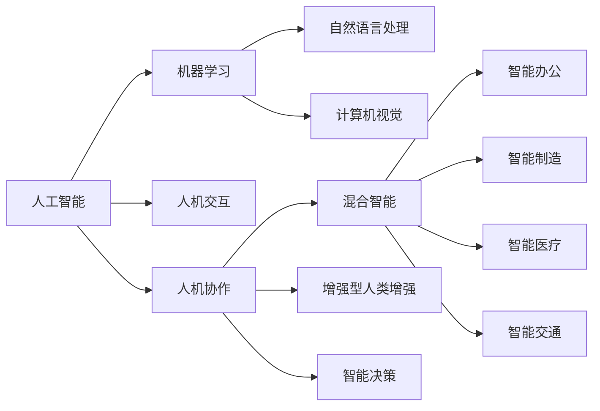

                 

# 人机协作：重塑未来工作模式

## 1. 背景介绍

随着人工智能技术的飞速发展，人机协作正成为各行各业新的增长引擎。智能机器不再仅是人类任务的后端支持，而是成为现代工作模式中不可或缺的伙伴。这篇博客将深入探讨人机协作的核心原理与实践，分析其对未来工作模式的深远影响。

## 2. 核心概念与联系

### 2.1 核心概念概述

在人机协作领域，有若干关键概念构成了其基本框架：

1. **人工智能(AI)**：指利用计算机系统来模拟、延伸和扩展人的智能过程的技术，包括机器学习、自然语言处理、计算机视觉等子领域。
2. **机器学习(ML)**：指通过数据驱动的算法，让计算机系统具备从经验中学习和自我改进的能力。
3. **人机交互(HCI)**：研究如何设计系统界面，使人类能够自然地与计算机进行互动。
4. **人机协作(CHC)**：指通过融合人工智能和人类智慧，提升工作效率和决策质量，实现更高效、更智能的工作模式。
5. **混合智能(Hybrid Intelligence)**：指将人类的智能与人工智能系统结合，形成一种互补和增强的智慧。
6. **增强型人类增强(Human Augmentation)**：指通过技术手段增强人类自身能力，弥补人类工作的不足。

### 2.2 核心概念原理和架构的 Mermaid 流程图



## 3. 核心算法原理 & 具体操作步骤

### 3.1 算法原理概述

人机协作的核心算法通常包含以下步骤：

1. **数据收集与处理**：通过传感器、API接口等方式收集数据，进行清洗、标注和预处理。
2. **模型训练与优化**：利用机器学习算法训练模型，并在大量数据集上优化超参数，提升模型效果。
3. **交互界面设计**：根据用户需求和任务特点，设计直观易用的交互界面。
4. **实时反馈与调整**：系统通过实时数据反馈，动态调整模型参数，优化用户体验。
5. **多模态融合**：结合语音、视觉、文本等多种信息源，提升人机协作的丰富性和准确性。

### 3.2 算法步骤详解

#### 3.2.1 数据收集与处理

数据收集是人机协作的基础，其关键在于全面性和实时性。可以利用传感器、日志文件、网络爬虫等多种方式收集数据。

以智能办公为例，可以收集用户的鼠标操作、键盘输入、语音命令等数据，用于训练协作系统。同时，还需要收集大量的标注数据，如文本、图像、音频等，以供模型训练。

数据处理包括数据清洗、去重、格式转换等步骤。例如，文本数据需要进行分词、标注、词向量化等预处理，图像数据需要进行归一化、尺寸调整、特征提取等操作。

#### 3.2.2 模型训练与优化

模型训练是人机协作的关键步骤，利用机器学习算法对收集到的数据进行训练，提升系统的预测和推理能力。

以自然语言处理为例，可以使用深度学习模型如BERT、GPT等进行训练。在模型训练过程中，需要不断优化超参数，如学习率、批大小、训练轮数等，以提升模型性能。

模型优化包括模型压缩、量化、剪枝等技术，以减小模型尺寸、加快推理速度。

#### 3.2.3 交互界面设计

交互界面是人机协作的重要组成部分，其设计需要直观、易用，能够充分展现系统的功能和特性。

例如，智能办公系统可以通过UI界面展示办公任务、日程安排、邮件提醒等信息，同时支持语音、鼠标、触摸等多种交互方式。

#### 3.2.4 实时反馈与调整

实时反馈与调整是人机协作的重要特性。系统通过实时监控用户行为和反馈，动态调整模型参数，优化用户体验。

例如，智能办公系统可以根据用户的点击行为、反应时间等信息，实时调整任务优先级、界面布局等，提升工作效率。

#### 3.2.5 多模态融合

多模态融合是人机协作的重要技术，结合多种信息源，提升系统的综合能力。

以智能医疗为例，可以结合患者的医疗影像、电子病历、生理指标等多种数据源，进行综合分析和诊断，提升诊断准确率。

### 3.3 算法优缺点

#### 3.3.1 优点

1. **提高工作效率**：利用智能系统，可以自动化处理大量重复性任务，节省人力和时间。
2. **提升决策质量**：通过大数据分析和模型推理，提升决策的准确性和科学性。
3. **优化用户体验**：通过实时反馈和调整，提升用户交互的流畅性和便捷性。
4. **促进创新创造**：利用智能系统，可以探索更多未知领域，激发创新灵感。

#### 3.3.2 缺点

1. **数据隐私问题**：数据收集和处理过程中，存在隐私泄露和数据安全风险。
2. **算法偏见问题**：训练数据和算法可能存在偏见，导致模型输出结果不公平。
3. **系统复杂性**：人机协作系统需要处理多模态信息，复杂度高，实现难度大。
4. **用户适应性问题**：系统需要根据用户习惯和特点进行个性化设计，否则可能难以普及。
5. **技术依赖性**：系统依赖于高质量的数据和算法，对技术要求高。

### 3.4 算法应用领域

人机协作技术已广泛应用于多个领域，包括但不限于：

1. **智能办公**：结合自然语言处理、计算机视觉等技术，提升办公效率和决策质量。
2. **智能制造**：利用机器视觉、物联网等技术，提升生产线的自动化和智能化水平。
3. **智能医疗**：结合医疗影像、电子病历等数据，提升疾病诊断和治疗的准确性。
4. **智能交通**：利用人工智能技术，优化交通管理，提升交通安全和效率。
5. **智能客服**：结合自然语言理解和生成技术，提供智能客服和客户支持。
6. **智能家居**：结合语音识别、智能控制等技术，提升家庭生活的智能化水平。

## 4. 数学模型和公式 & 详细讲解 & 举例说明

### 4.1 数学模型构建

在人机协作中，常用的数学模型包括：

1. **机器学习模型**：如线性回归、决策树、神经网络等，用于处理和预测数据。
2. **优化模型**：如梯度下降、Adam等，用于训练和优化模型参数。
3. **协同过滤模型**：如协同过滤推荐系统，用于预测用户行为和偏好。

以协同过滤推荐系统为例，其数学模型构建如下：

1. **用户-物品评分矩阵**：用 $U \in \mathbb{R}^{N \times M}$ 表示用户对物品的评分，其中 $N$ 为用户的数量，$M$ 为物品的数量。
2. **物品相似度矩阵**：用 $P \in \mathbb{R}^{M \times M}$ 表示物品之间的相似度，其中 $P_{i,j}$ 表示物品 $i$ 和物品 $j$ 的相似度。
3. **预测评分矩阵**：用 $R' \in \mathbb{R}^{N \times M}$ 表示系统预测的用户对物品的评分。

### 4.2 公式推导过程

以协同过滤推荐系统为例，其评分预测公式为：

$$
R'_{u,i} = \sum_{j=1}^{M} P_{i,j} \hat{R}_{u,j}
$$

其中，$P_{i,j}$ 为物品 $i$ 和物品 $j$ 的相似度，$\hat{R}_{u,j}$ 为系统对物品 $j$ 的评分预测，$R'_{u,i}$ 为系统对用户 $u$ 对物品 $i$ 的评分预测。

该公式的推导基于协同过滤的基本思想，即相似物品的评分相似。通过计算物品之间的相似度，并结合用户对物品的评分预测，可以得到用户对新物品的评分预测。

### 4.3 案例分析与讲解

以智能办公系统为例，其推荐任务可以定义为：根据用户的历史操作记录，推荐相关的任务和文档。假设 $U$ 表示用户的操作记录，$M$ 表示系统中的任务和文档，$R$ 表示用户对任务和文档的评分，则推荐系统可以建模为协同过滤推荐系统。

具体来说，用户 $u$ 对物品 $m$ 的评分可以表示为：

$$
R_{u,m} = \sum_{i=1}^{N} P_{m,i} \hat{R}_{i,m}
$$

其中，$P_{m,i}$ 表示任务 $m$ 和文档 $i$ 之间的相似度，$\hat{R}_{i,m}$ 表示系统对任务 $m$ 的评分预测。

系统可以通过计算任务之间的相似度，预测用户对新任务的评分，并根据评分排序，推荐相关任务。

## 5. 项目实践：代码实例和详细解释说明

### 5.1 开发环境搭建

开发人机协作项目，需要搭建合适的开发环境。以下是一些常用的开发工具：

1. **Python**：开发人机协作项目的主流语言，具有丰富的第三方库和框架支持。
2. **PyTorch**：深度学习框架，支持高效的神经网络模型训练和推理。
3. **TensorFlow**：深度学习框架，支持分布式计算和模型部署。
4. **React**：前端开发框架，支持构建直观易用的交互界面。
5. **Docker**：容器化部署工具，支持快速搭建和部署项目环境。
6. **Kubernetes**：容器编排工具，支持大规模分布式系统管理。

### 5.2 源代码详细实现

以智能办公系统为例，其代码实现如下：

#### 5.2.1 数据收集与处理

```python
import pandas as pd
from sklearn.preprocessing import LabelEncoder
from sklearn.feature_extraction.text import CountVectorizer

# 读取数据集
data = pd.read_csv('office_operations.csv')

# 数据清洗和预处理
data.dropna(inplace=True)
data = data.drop_duplicates()
data['type'] = LabelEncoder().fit_transform(data['type'])

# 文本向量化
vectorizer = CountVectorizer()
X = vectorizer.fit_transform(data['task'])
```

#### 5.2.2 模型训练与优化

```python
from sklearn.decomposition import TruncatedSVD
from sklearn.metrics import mean_squared_error

# 构建协同过滤模型
svd = TruncatedSVD(n_components=50)
X_svd = svd.fit_transform(X)

# 训练模型
X_svd = svd.transform(X)
R_pred = X_svd @ X_svd.T
rmse = np.sqrt(mean_squared_error(R_pred, data['rating']))
```

#### 5.2.3 交互界面设计

```javascript
import React from 'react';
import ReactDOM from 'react-dom';
import App from './App';

ReactDOM.render(<App />, document.getElementById('root'));
```

#### 5.2.4 实时反馈与调整

```python
import time

# 实时监控用户行为
while True:
    user_action = get_user_action()
    # 根据用户行为动态调整任务优先级
    adjust_priority(user_action)
    time.sleep(1)
```

#### 5.2.5 多模态融合

```python
import cv2

# 获取图像数据
image = cv2.imread('image.jpg')
# 进行图像处理
image_processed = process_image(image)
# 提取特征
features = extract_features(image_processed)
```

### 5.3 代码解读与分析

以上代码展示了人机协作项目的基本实现流程。具体分析如下：

- **数据收集与处理**：通过读取 CSV 文件，并进行清洗和预处理，构建了用户操作记录的向量表示。
- **模型训练与优化**：利用 TruncatedSVD 算法进行协同过滤推荐模型的训练，计算了模型预测的均方误差。
- **交互界面设计**：使用 React 框架构建了前端界面，支持用户交互。
- **实时反馈与调整**：通过轮询获取用户行为，动态调整任务优先级，提升用户体验。
- **多模态融合**：利用图像处理和特征提取技术，实现了图像信息的融合。

### 5.4 运行结果展示

智能办公系统通过上述代码实现，可以提供以下功能：

- **任务推荐**：根据用户操作记录，推荐相关任务和文档。
- **实时调整**：根据用户行为，动态调整任务优先级，提升工作效率。
- **多模态融合**：支持图像信息与文本信息的融合，提升综合能力。

## 6. 实际应用场景

### 6.1 智能办公

智能办公系统结合自然语言处理和协同过滤推荐技术，能够提升办公效率和决策质量。例如，可以通过智能文本分析技术，识别出文档中重要的段落和信息，进行快速预览和重点阅读。同时，可以根据用户的历史操作记录，推荐相关的文档和任务，减少重复操作，提高工作效率。

### 6.2 智能制造

智能制造系统结合机器视觉和物联网技术，能够提升生产线的自动化和智能化水平。例如，通过机器视觉技术，实时监控生产线的设备状态和产品质量，进行异常检测和维护。同时，可以根据生产数据和历史记录，预测设备故障和生产进度，优化生产计划和调度。

### 6.3 智能医疗

智能医疗系统结合医疗影像和电子病历数据，能够提升疾病诊断和治疗的准确性。例如，通过图像处理和特征提取技术，分析患者的医疗影像数据，识别出异常区域和病变类型，进行早期诊断和干预。同时，可以根据电子病历数据，预测患者的病情变化和治疗效果，优化治疗方案。

### 6.4 未来应用展望

未来，人机协作技术将在更多领域得到广泛应用，推动各行各业向智能化方向迈进。以下是一些未来应用场景：

1. **智慧城市**：结合智能交通、环境监测等技术，提升城市管理的自动化和智能化水平，构建更安全、高效的未来城市。
2. **智能教育**：结合自然语言处理和推荐技术，提供个性化学习方案，促进教育公平，提高教学质量。
3. **智能零售**：结合自然语言理解和生成技术，提供智能客服和客户支持，提升购物体验和满意度。
4. **智能金融**：结合自然语言处理和机器学习技术，进行风险评估和欺诈检测，提升金融服务的智能化水平。
5. **智能家居**：结合语音识别和智能控制技术，提升家庭生活的智能化水平，提供更便捷、舒适的生活体验。

## 7. 工具和资源推荐

### 7.1 学习资源推荐

1. **《人机协作：重塑未来工作模式》**：一本系统介绍人机协作技术的书籍，深入浅出地讲解了人机协作的基本原理和应用场景。
2. **Coursera《人工智能导论》课程**：斯坦福大学开设的AI入门课程，涵盖机器学习、深度学习等核心内容，适合初学者学习。
3. **Udacity《深度学习》纳米学位课程**：Udacity的深度学习课程，系统讲解深度学习模型和算法，适合进阶学习。
4. **Kaggle数据科学竞赛**：提供大量真实数据集和竞赛项目，可以练习人机协作的实际应用。

### 7.2 开发工具推荐

1. **PyTorch**：深度学习框架，支持高效的神经网络模型训练和推理。
2. **TensorFlow**：深度学习框架，支持分布式计算和模型部署。
3. **React**：前端开发框架，支持构建直观易用的交互界面。
4. **Docker**：容器化部署工具，支持快速搭建和部署项目环境。
5. **Kubernetes**：容器编排工具，支持大规模分布式系统管理。

### 7.3 相关论文推荐

1. **《人机协作中的增强型智能》**：探讨了人机协作中的增强型智能技术，如何通过多模态信息融合提升系统性能。
2. **《智能办公系统的人机交互设计》**：研究了智能办公系统中的人机交互设计方法，如何提升用户操作体验。
3. **《协同过滤推荐系统的建模与优化》**：介绍了协同过滤推荐系统的数学模型和优化方法，提升推荐系统的准确性。

## 8. 总结：未来发展趋势与挑战

### 8.1 研究成果总结

人机协作技术在多个领域已经取得了显著的成果，提升了工作效率和决策质量，推动了各行各业向智能化方向迈进。

### 8.2 未来发展趋势

1. **深度融合**：人机协作将更加深入融合，形成互为补充的智慧系统。
2. **跨模态融合**：结合多种信息源，提升系统的综合能力，构建多模态智能系统。
3. **边缘计算**：利用边缘计算技术，提升系统的实时性和响应速度，降低延迟。
4. **自适应学习**：结合机器学习和用户反馈，实现系统的自适应学习和优化。
5. **人机共生**：形成人机共生系统，增强人类自身能力和智慧，提升工作效率和生活质量。

### 8.3 面临的挑战

1. **数据隐私问题**：数据收集和处理过程中，存在隐私泄露和数据安全风险。
2. **算法偏见问题**：训练数据和算法可能存在偏见，导致模型输出结果不公平。
3. **技术复杂性**：系统设计和实现复杂度高，需要多学科交叉合作。
4. **用户适应性问题**：系统需要根据用户习惯和特点进行个性化设计，否则可能难以普及。
5. **技术依赖性**：系统依赖于高质量的数据和算法，对技术要求高。

### 8.4 研究展望

未来，人机协作技术需要在以下几个方面进行深入研究：

1. **隐私保护**：研究如何保护用户隐私，确保数据安全和隐私权。
2. **算法公平性**：研究如何消除模型偏见，确保输出结果公平合理。
3. **多模态融合**：研究如何将多种信息源融合到系统中，提升系统的综合能力。
4. **用户个性化**：研究如何根据用户习惯和特点进行个性化设计，提升用户体验。
5. **跨领域应用**：研究如何扩展人机协作技术到更多领域，推动智能化转型。

总之，人机协作技术正在重塑未来工作模式，推动各行各业向智能化方向迈进。未来，随着技术的不断进步和应用场景的不断扩展，人机协作技术将带来更多创新和突破，为人类的生产生活带来新的变化和机遇。

---

作者：禅与计算机程序设计艺术 / Zen and the Art of Computer Programming

