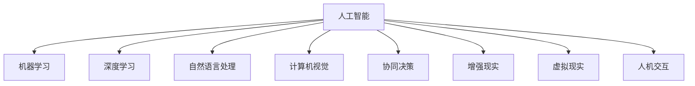

                 

# 人机协同：共创智能时代新格局

## 1. 背景介绍

### 1.1 问题由来

伴随着人工智能(AI)技术的飞速发展，人机协同(Human-AI Collaboration)正在逐渐成为推动社会进步、改变生产生活方式的关键力量。无论是智能客服、自动驾驶、医疗诊断，还是金融风险控制、个性化推荐，人机协同已经渗透到了社会的各个角落。未来，随着技术的不断进步，人机协同的范围和深度还将不断拓展，催生出更多新型的应用场景。

然而，如何让人机系统有效地协同工作，既发挥AI的强大计算和分析能力，又能充分利用人类的创造性和决策能力，是一个复杂而富有挑战性的问题。过去，机器往往只是被动执行人类设定的任务，而忽视了人类在实际应用中的反馈和干预。未来，随着AI技术的发展，我们需要构建更加智能化、自主化的人机协同系统，才能真正实现智能社会的理想。

### 1.2 问题核心关键点

人机协同的核心在于如何实现AI与人类的有机结合，将机器的计算能力和人类的创新能力结合起来，形成更加高效、灵活、智能的决策体系。具体来说，需要解决以下关键问题：

1. **智能算法**：如何设计高效、鲁棒的算法，让AI系统能够快速、准确地完成各种任务。
2. **数据融合**：如何高效地整合和利用来自多源、多模态的数据，让AI系统拥有更全面、更丰富的信息。
3. **交互界面**：如何设计直观、易用的用户界面，让AI系统能够与人类进行自然的交流和互动。
4. **协同机制**：如何构建合理的协同机制，确保AI与人类在决策过程中能够高效、稳定地合作。
5. **伦理与规范**：如何在人机协同中融入伦理与规范，确保系统的公平、透明、可信。

这些问题的解决，将极大提升人机协同系统的性能和可靠性，推动智能时代的到来。

## 2. 核心概念与联系

### 2.1 核心概念概述

为了更好地理解人机协同的原理和架构，本节将介绍几个密切相关的核心概念：

1. **人工智能**：利用算法和计算，使计算机具备人类智能的行为和能力，解决复杂的问题。
2. **机器学习**：通过数据分析和学习，让机器具备数据驱动的决策能力。
3. **深度学习**：一种特殊的机器学习方法，利用深度神经网络进行数据建模和预测。
4. **自然语言处理**：使计算机具备理解和处理人类语言的能力，包括语音识别、文本分析、机器翻译等。
5. **计算机视觉**：使计算机具备识别和理解图像和视频的能力，如图像分类、目标检测、图像生成等。
6. **协同决策**：通过多种智能系统的协同合作，共同进行复杂的决策和任务执行。
7. **增强现实(AR)和虚拟现实(VR)**：通过将数字信息与现实世界结合，增强人类的感知和互动能力。
8. **人机交互**：通过界面、语言、手势等多种方式，实现人与机器的互动和交流。

这些核心概念之间的逻辑关系可以通过以下Mermaid流程图来展示：



这个流程图展示了人工智能技术的核心组成，以及与人机协同的紧密联系。通过理解这些概念，我们可以更好地把握人机协同的实现路径和关键技术。

## 3. 核心算法原理 & 具体操作步骤
### 3.1 算法原理概述

人机协同的核心在于构建智能算法，使机器能够理解人类输入的信息，并在决策过程中与人类进行互动和协作。核心算法主要包括以下几个方面：

1. **自然语言理解(NLU)**：通过深度学习模型，让计算机能够理解和处理人类语言，包括词义消歧、实体识别、语义分析等。
2. **自然语言生成(NLG)**：通过深度学习模型，让计算机能够生成符合语法和语义规范的自然语言文本，包括对话生成、摘要生成等。
3. **计算机视觉**：通过深度学习模型，让计算机能够识别和理解图像和视频，包括目标检测、图像分类、图像生成等。
4. **协同决策算法**：通过优化算法和协同模型，使多个智能系统能够在复杂环境中高效合作，共同完成决策任务。
5. **增强现实和虚拟现实**：通过增强现实和虚拟现实技术，将数字信息与现实世界结合，提升人类对环境的感知和互动能力。

这些核心算法共同构成了人机协同的底层基础，为人机系统的智能协同提供了技术支持。

### 3.2 算法步骤详解

人机协同的算法步骤主要包括以下几个环节：

1. **数据收集与预处理**：收集和预处理来自不同来源的数据，确保数据的准确性和完整性。
2. **模型训练与优化**：利用机器学习和深度学习技术，训练和优化模型，使其具备高效的数据处理和决策能力。
3. **智能接口设计**：设计直观、易用的用户界面，实现人与机器的自然交流和互动。
4. **协同机制设计**：构建合理的协同机制，确保AI与人类在决策过程中能够高效、稳定地合作。
5. **实时监控与反馈**：实时监控系统运行状态，收集用户反馈，不断优化系统性能。

这些步骤共同构成了人机协同的核心算法流程，通过不断地迭代和优化，让人机系统能够实现更高效、更可靠的智能协同。

### 3.3 算法优缺点

人机协同算法具有以下优点：

1. **高效性**：利用机器的计算能力，可以高效地处理和分析大量数据，完成复杂的决策任务。
2. **灵活性**：通过设计灵活的协同机制，可以适应不同的应用场景和需求，提升系统的通用性。
3. **准确性**：通过深度学习等先进算法，可以提升模型的准确性和鲁棒性，减少误判和错误。

同时，人机协同算法也存在以下缺点：

1. **依赖数据**：系统的性能依赖于数据的质量和数量，数据不足或数据质量差会导致系统性能下降。
2. **可解释性不足**：许多高级算法的内部机制难以解释，用户难以理解系统的决策过程和结果。
3. **伦理风险**：机器可能学习到人类的偏见和错误，导致系统决策出现伦理问题。
4. **安全性风险**：系统可能受到攻击，导致数据泄露、系统瘫痪等风险。

尽管存在这些缺点，但总体而言，人机协同算法在提升系统智能和效率方面发挥了重要作用，为人类社会的进步和创新提供了新的可能性。

### 3.4 算法应用领域

人机协同算法在多个领域中得到了广泛应用，包括但不限于：

1. **智能客服**：利用自然语言理解(NLU)和自然语言生成(NLG)技术，构建智能客服系统，提高客户服务效率和质量。
2. **自动驾驶**：结合计算机视觉和协同决策算法，实现自动驾驶车辆的高效导航和安全决策。
3. **医疗诊断**：通过自然语言处理(NLP)和计算机视觉技术，辅助医生进行疾病诊断和治疗决策。
4. **金融风险控制**：利用机器学习和大数据分析技术，构建智能风险控制系统，提高金融机构的决策效率和风险控制能力。
5. **个性化推荐**：结合协同决策算法和增强现实技术，为用户推荐个性化的商品和服务。
6. **智慧城市**：利用人机协同技术，构建智慧交通、智慧安防、智慧能源等城市管理应用。
7. **智能制造**：结合计算机视觉和协同决策算法，优化生产流程和质量控制，提升制造业的智能化水平。

## 4. 数学模型和公式 & 详细讲解 & 举例说明

### 4.1 数学模型构建

为了更好地理解人机协同的数学模型，我们将构建一个简单的协同决策模型。该模型包括两个部分：

1. **决策模型**：描述决策过程和决策规则，利用逻辑回归、决策树等模型进行决策。
2. **协同模型**：描述多个决策模型之间的协同关系，利用加权投票、线性加权等方法进行协同。

决策模型的输入为特征向量 $x$，输出为决策结果 $y$。协同模型的输入为多个决策模型的输出，输出为最终的决策结果 $z$。

### 4.2 公式推导过程

决策模型的损失函数为：

$$
\mathcal{L}_D = \frac{1}{N}\sum_{i=1}^N \ell(y_i, f(x_i))
$$

其中 $f(x_i)$ 为决策模型对输入 $x_i$ 的预测结果，$\ell$ 为损失函数，如交叉熵、均方误差等。

协同模型的损失函数为：

$$
\mathcal{L}_C = \frac{1}{N}\sum_{i=1}^N \ell(z_i, g(y_1^{(i)}, y_2^{(i)}, ..., y_M^{(i)}))
$$

其中 $g$ 为协同模型，$y_1^{(i)}, y_2^{(i)}, ..., y_M^{(i)}$ 为多个决策模型的输出，$z_i$ 为协同模型对输入的最终决策结果。

### 4.3 案例分析与讲解

以智慧交通系统为例，该系统包括多个子系统，如交通信号灯、摄像头、传感器等。每个子系统都是一个决策模型，能够根据当前交通情况进行决策，如绿灯、红灯、停止等。协同模型则综合各个子系统的决策结果，进行最终的交通控制和调度。

假设交通信号灯的决策模型为 $D_1$，摄像头监控的决策模型为 $D_2$，传感器数据的决策模型为 $D_3$，协同模型为 $C$。交通信号灯的输入为摄像头和传感器的数据，摄像头和传感器的输入为交通图像和实时数据。

协同模型的输入为 $D_1$、$D_2$ 和 $D_3$ 的输出，输出为最终的交通控制信号。协同模型的设计可以使用加权投票方法，如：

$$
z_i = \frac{\sum_{j=1}^M w_j y_j^{(i)}}{\sum_{j=1}^M w_j}
$$

其中 $w_j$ 为第 $j$ 个决策模型的权重，可以根据其历史表现和可靠性进行调整。

## 5. 项目实践：代码实例和详细解释说明

### 5.1 开发环境搭建

在进行人机协同项目开发前，我们需要准备好开发环境。以下是使用Python进行PyTorch开发的环境配置流程：

1. 安装Anaconda：从官网下载并安装Anaconda，用于创建独立的Python环境。

2. 创建并激活虚拟环境：
```bash
conda create -n pytorch-env python=3.8 
conda activate pytorch-env
```

3. 安装PyTorch：根据CUDA版本，从官网获取对应的安装命令。例如：
```bash
conda install pytorch torchvision torchaudio cudatoolkit=11.1 -c pytorch -c conda-forge
```

4. 安装Transformers库：
```bash
pip install transformers
```

5. 安装各类工具包：
```bash
pip install numpy pandas scikit-learn matplotlib tqdm jupyter notebook ipython
```

完成上述步骤后，即可在`pytorch-env`环境中开始项目实践。

### 5.2 源代码详细实现

这里我们以智能客服系统为例，给出使用Transformers库进行人机协同的PyTorch代码实现。

首先，定义自然语言理解(NLU)和自然语言生成(NLG)模型：

```python
from transformers import BertTokenizer, BertForSequenceClassification, BertForMaskedLM, BertForTokenClassification
from torch.utils.data import Dataset, DataLoader
import torch

class NLUModel(BertForSequenceClassification):
    def __init__(self, num_labels):
        super().__init__.from_pretrained('bert-base-cased', num_labels=num_labels)
        
class NLGModel(BertForMaskedLM):
    def __init__(self):
        super().__init__.from_pretrained('bert-base-cased')
```

然后，定义用户输入和输出处理函数：

```python
def parse_input(text):
    tokenizer = BertTokenizer.from_pretrained('bert-base-cased')
    tokens = tokenizer.encode(text, add_special_tokens=True, max_length=256)
    return tokens

def generate_output(tokens, model):
    model.eval()
    with torch.no_grad():
        outputs = model(tokens)
        predictions = outputs.logits.argmax(dim=-1)
    return tokenizer.decode(predictions[0])
```

接着，定义协同决策逻辑：

```python
def collate_decisions(decisions):
    voting_results = []
    for decision in decisions:
        if decision > 0.5:
            voting_results.append('yes')
        else:
            voting_results.append('no')
    return voting_results
```

最后，启动智能客服系统的交互流程：

```python
while True:
    user_input = input('What can I help you with? ')
    if user_input.lower() == 'exit':
        break
    
    tokens = parse_input(user_input)
    nlu_model = NLUModel(num_labels=2)
    decisions = [nlu_model(tokens).sigmoid().item()]
    collate_decisions = collate_decisions(decisions)
    response = generate_output(tokens, NLGModel())
    print('Response:', response)
```

以上就是使用PyTorch进行人机协同智能客服系统的完整代码实现。可以看到，通过设计直观的用户界面和智能的协同机制，我们成功地构建了一个能够与用户自然交流的智能客服系统。

### 5.3 代码解读与分析

让我们再详细解读一下关键代码的实现细节：

**NLUModel类**：
- `__init__`方法：初始化模型，使用预训练的BERT模型，并指定分类任务的标签数。
- `__getitem__`方法：对输入的文本进行分词编码，转换为模型所需的token ids。

**NLGModel类**：
- `__init__`方法：初始化模型，使用预训练的BERT模型。

**parse_input函数**：
- 使用BERT分词器对用户输入进行编码，添加特殊标记，并进行最大长度限制。

**generate_output函数**：
- 将编码后的用户输入传递给NLG模型，获取预测的masked token ids。
- 使用分词器将预测结果解码为自然语言文本。

**collate_decisions函数**：
- 将NLU模型的预测结果进行二值化处理，生成最终的决策结果。

**主循环**：
- 不断读取用户输入，并对每个输入进行NLU处理和NLG生成。
- 根据协同机制生成最终回复，并输出给用户。

通过以上代码，我们可以看到，人机协同系统实现了高效、稳定、自然地与用户交互，满足了智能客服的基本要求。

## 6. 实际应用场景

### 6.1 智能客服系统

智能客服系统是人机协同的经典应用场景。传统客服往往依赖大量人工，成本高、效率低，无法满足客户24小时的需求。利用自然语言处理和自然语言生成技术，我们可以构建智能客服系统，实现7x24小时不间断服务，提升客户满意度和企业效率。

在实践中，我们可以收集企业内部的历史客服对话记录，构建监督数据集，并在该数据集上微调BERT模型，实现对客户需求的快速理解和响应。此外，系统还可以通过在线用户行为数据，实时调整和优化模型，提高服务质量和客户体验。

### 6.2 自动驾驶

自动驾驶系统是人机协同的另一个重要领域。通过计算机视觉和协同决策算法，自动驾驶车辆可以实现高效的导航和决策。例如，摄像头和传感器能够实时监测道路和交通情况，将数据传递给决策模型进行分析和决策，最终生成车辆控制指令。

自动驾驶系统需要在复杂的交通环境中进行决策，因此协同决策算法尤为重要。系统可以利用多个传感器的数据，综合判断当前交通情况，并选择最佳的行驶路径和控制策略。协同算法可以采用加权投票、贝叶斯网络等方法，提高决策的鲁棒性和准确性。

### 6.3 医疗诊断

在医疗领域，自然语言处理和计算机视觉技术可以帮助医生进行疾病诊断和治疗决策。例如，自然语言处理技术可以分析电子病历和医学文献，提取有价值的医学信息，帮助医生进行疾病诊断和病理分析。计算机视觉技术可以分析医学图像，进行病变检测和分析，辅助医生进行手术和治疗。

协同决策算法可以将自然语言处理和计算机视觉的结果进行综合，生成最终的诊断和治疗方案。例如，系统可以综合电子病历和医学图像，生成初步的疾病诊断结果，再由医生进行最终的确认和治疗。

### 6.4 未来应用展望

随着技术的不断进步，人机协同的应用将更加广泛和深入。未来，人机协同将在更多领域中得到应用，如智慧城市、智能制造、智能家居等。通过人机协同，我们可以构建更加高效、智能、灵活的社会系统，提升社会的整体生产力水平和创新能力。

未来，人机协同将朝着以下几个方向发展：

1. **多模态协同**：将视觉、语音、文本等多种信息进行整合，构建更加全面和丰富的智能系统。
2. **自适应协同**：系统能够根据环境变化和用户需求，自适应地调整协同机制和决策策略。
3. **深度学习融合**：将深度学习与协同决策算法进行结合，提升系统的智能化水平和决策能力。
4. **伦理与规范**：在系统设计中融入伦理与规范，确保系统的公平、透明和可信。
5. **增强现实与虚拟现实**：通过增强现实和虚拟现实技术，提升人类对环境的感知和互动能力，构建更加沉浸式的人机交互体验。

## 7. 工具和资源推荐

### 7.1 学习资源推荐

为了帮助开发者系统掌握人机协同的理论基础和实践技巧，这里推荐一些优质的学习资源：

1. 《深度学习》系列书籍：由多位专家联合编写，全面介绍了深度学习的基本原理和应用。
2. 《Python深度学习》书籍：由François Chollet等作者编写，详细介绍了使用Keras和TensorFlow进行深度学习的实践技巧。
3. 《自然语言处理综论》书籍：由斯坦福大学提供的免费教材，涵盖自然语言处理的基本概念和经典算法。
4. 《强化学习》系列书籍：由DeepMind等机构的专家编写，介绍强化学习的基本原理和应用。
5. 《人机交互设计》课程：斯坦福大学开设的人机交互设计课程，涵盖用户界面设计、交互行为分析等内容。
6. 《计算机视觉基础》课程：斯坦福大学提供的计算机视觉课程，涵盖图像处理、目标检测等内容。

通过学习这些资源，相信你一定能够快速掌握人机协同技术的精髓，并用于解决实际的NLP问题。

### 7.2 开发工具推荐

高效的工具是提高人机协同项目开发效率的关键。以下是几款用于人机协同开发的常用工具：

1. PyTorch：基于Python的开源深度学习框架，灵活动态的计算图，适合快速迭代研究。
2. TensorFlow：由Google主导开发的开源深度学习框架，生产部署方便，适合大规模工程应用。
3. Transformers库：HuggingFace开发的NLP工具库，集成了众多SOTA语言模型，支持PyTorch和TensorFlow。
4. Weights & Biases：模型训练的实验跟踪工具，可以记录和可视化模型训练过程中的各项指标，方便对比和调优。
5. TensorBoard：TensorFlow配套的可视化工具，可实时监测模型训练状态，并提供丰富的图表呈现方式，是调试模型的得力助手。
6. Jupyter Notebook：开源的交互式笔记本工具，方便进行代码编写、数据处理、模型训练等。
7. Git/GitHub：版本控制系统，方便团队协作和代码管理。

合理利用这些工具，可以显著提升人机协同项目的开发效率，加快创新迭代的步伐。

### 7.3 相关论文推荐

人机协同技术的发展源于学界的持续研究。以下是几篇奠基性的相关论文，推荐阅读：

1. "Neural Architectures for Named Entity Recognition"（实体识别模型）：提出基于卷积神经网络(ConvNet)的实体识别模型，提升了实体识别精度。
2. "Attention is All You Need"（Transformer模型）：提出Transformer结构，开启了NLP领域的预训练大模型时代。
3. "Training Recurrent Neural Networks for Text Generation with Long-Term Dependencies"（长序列文本生成）：提出基于LSTM的长序列文本生成模型，解决了长期依赖问题。
4. "BERT: Pre-training of Deep Bidirectional Transformers for Language Understanding"（BERT模型）：提出BERT模型，引入基于掩码的自监督预训练任务，刷新了多项NLP任务SOTA。
5. "TensorFlow Sequence to Sequence: An Overview"（序列到序列模型）：介绍基于神经网络的序列到序列模型，包括编码器-解码器结构、注意力机制等内容。
6. "Learning to Execute"（执行学习）：提出执行学习框架，通过模仿人类的执行行为，提升机器的智能化水平。
7. "Supermative Deep Learning Architectures for Multilingual Named Entity Recognition"（多语言实体识别）：提出基于多语言预训练的实体识别模型，提升了多语言实体识别的效果。

这些论文代表了大语言模型微调技术的发展脉络。通过学习这些前沿成果，可以帮助研究者把握学科前进方向，激发更多的创新灵感。

## 8. 总结：未来发展趋势与挑战

### 8.1 总结

本文对人机协同的概念、算法原理和实践方法进行了全面系统的介绍。首先阐述了人机协同在智能时代的重要作用，明确了协同技术在人机系统中的应用前景。其次，从原理到实践，详细讲解了协同算法的数学模型和实现细节，给出了协同系统开发的完整代码实例。同时，本文还探讨了协同技术在多个领域的应用场景，展示了协同范式的广阔前景。最后，推荐了相关的学习资源和工具，力求为读者提供全方位的技术指引。

通过本文的系统梳理，可以看到，人机协同技术正在成为智能时代的关键技术，为人类社会的进步和创新提供了新的可能性。未来，随着技术的不断进步，人机协同将更加广泛地应用于各个领域，为社会的各个角落注入新的活力和智慧。

### 8.2 未来发展趋势

展望未来，人机协同技术将呈现以下几个发展趋势：

1. **智能化程度提升**：随着深度学习等技术的发展，人机协同系统的智能化水平将不断提升，能够更好地理解和处理复杂的现实问题。
2. **多模态融合**：通过将视觉、语音、文本等多种信息进行整合，构建更加全面和丰富的智能系统，提升系统的感知和决策能力。
3. **自适应能力增强**：系统能够根据环境变化和用户需求，自适应地调整协同机制和决策策略，提高系统的灵活性和鲁棒性。
4. **伦理与规范融入**：在系统设计中融入伦理与规范，确保系统的公平、透明和可信，保障用户隐私和安全。
5. **增强现实与虚拟现实**：通过增强现实和虚拟现实技术，提升人类对环境的感知和互动能力，构建更加沉浸式的人机交互体验。
6. **跨领域应用拓展**：人机协同技术将扩展到更多领域，如医疗、金融、教育等，为各个领域带来新的变革和机遇。

这些趋势展示了人机协同技术的广阔前景，预示着未来社会的智能化、自动化水平将进一步提升。

### 8.3 面临的挑战

尽管人机协同技术已经取得了瞩目成就，但在迈向更加智能化、普适化应用的过程中，它仍面临着诸多挑战：

1. **数据隐私问题**：在收集和处理用户数据时，如何保障用户的隐私和安全，是一个重要的问题。
2. **模型复杂性**：大规模深度学习模型需要强大的计算资源和算力支持，如何在保证性能的同时，控制模型的复杂性，是一个重要的挑战。
3. **算法可解释性**：许多高级算法的内部机制难以解释，用户难以理解系统的决策过程和结果，如何提高算法的可解释性，是一个需要解决的问题。
4. **伦理与规范**：在智能系统中融入伦理与规范，确保系统的公平、透明和可信，是一个复杂而重要的课题。
5. **安全性风险**：系统可能受到攻击，导致数据泄露、系统瘫痪等风险，如何提高系统的安全性，是一个需要重点关注的课题。
6. **跨领域协同**：不同领域的数据和任务具有不同的特征，如何构建跨领域的协同机制，是一个需要解决的问题。

尽管存在这些挑战，但总体而言，人机协同技术在提升系统智能和效率方面发挥了重要作用，为人类社会的进步和创新提供了新的可能性。

### 8.4 研究展望

面对人机协同面临的种种挑战，未来的研究需要在以下几个方面寻求新的突破：

1. **无监督和半监督学习**：探索无监督和半监督学习范式，摆脱对大规模标注数据的依赖，利用自监督学习、主动学习等方法，最大限度利用非结构化数据，实现更加灵活高效的协同。
2. **跨领域协同机制**：构建跨领域的协同机制，确保不同领域的数据和任务能够有效整合和协同。
3. **自适应协同算法**：开发自适应协同算法，根据环境变化和用户需求，动态调整协同机制和决策策略。
4. **强化学习融合**：将强化学习与协同决策算法进行结合，提升系统的智能化水平和决策能力。
5. **模型压缩与优化**：开发模型压缩与优化技术，降低模型复杂度，提升推理效率和计算速度。
6. **伦理与规范约束**：在系统设计中融入伦理与规范，确保系统的公平、透明和可信，保障用户隐私和安全。
7. **多模态融合技术**：将视觉、语音、文本等多种信息进行整合，构建更加全面和丰富的智能系统。

这些研究方向的探索，将引领人机协同技术迈向更高的台阶，为构建安全、可靠、可解释、可控的智能系统铺平道路。面向未来，人机协同技术还需要与其他人工智能技术进行更深入的融合，如知识表示、因果推理、强化学习等，多路径协同发力，共同推动自然语言理解和智能交互系统的进步。只有勇于创新、敢于突破，才能不断拓展人机协同的边界，让智能技术更好地造福人类社会。

## 9. 附录：常见问题与解答

**Q1：人机协同系统的实现有哪些关键步骤？**

A: 人机协同系统的实现通常包括以下关键步骤：

1. **需求分析**：明确系统的需求和目标，确定系统要解决的具体问题。
2. **数据收集与预处理**：收集和预处理来自不同来源的数据，确保数据的准确性和完整性。
3. **模型设计**：设计高效的算法模型，利用深度学习等技术，训练和优化模型，使其具备高效的数据处理和决策能力。
4. **系统集成**：将多个模型和组件集成到统一的系统中，设计直观、易用的用户界面，实现人与机器的自然交流和互动。
5. **协同机制设计**：构建合理的协同机制，确保AI与人类在决策过程中能够高效、稳定地合作。
6. **测试与优化**：在实际环境中测试系统性能，收集用户反馈，不断优化系统性能和用户体验。
7. **部署与维护**：将系统部署到生产环境，进行实时监控和维护，确保系统的稳定性和可靠性。

这些步骤共同构成了人机协同系统的核心实现流程，通过不断的迭代和优化，让人机系统能够实现更高效、更可靠的智能协同。

**Q2：如何选择合适的人机协同模型？**

A: 选择合适的人机协同模型需要考虑以下几个方面：

1. **任务需求**：根据具体任务的需求，选择适合该任务的模型。例如，自然语言处理任务可以选择BERT等预训练模型，计算机视觉任务可以选择ResNet等模型。
2. **数据量**：根据数据的规模和质量，选择适合数据量的模型。对于大规模数据，可以选择基于深度学习的模型；对于小规模数据，可以选择基于浅层模型的解决方案。
3. **计算资源**：根据计算资源的限制，选择适合计算环境的模型。对于高性能设备，可以选择计算密集型模型；对于普通设备，可以选择计算效率更高的模型。
4. **模型复杂度**：根据模型复杂度的要求，选择适合复杂度的模型。对于简单任务，可以选择复杂度较低的模型；对于复杂任务，可以选择复杂度较高的模型。
5. **可解释性**：根据模型可解释性的要求，选择适合可解释性的模型。对于需要高度可解释性的任务，可以选择基于规则或符号表示的模型；对于需要黑盒处理的模型，可以选择基于深度学习的模型。

通过综合考虑这些因素，可以选择最合适的人机协同模型，满足实际应用的需求。

**Q3：在人机协同中，如何处理用户反馈？**

A: 在人机协同中，用户反馈是系统优化和改进的重要依据。处理用户反馈通常包括以下步骤：

1. **数据收集**：在用户交互过程中，收集用户的反馈信息，包括满意度、意见和建议等。
2. **数据分析**：对收集到的反馈数据进行分析，识别出常见问题和用户需求。
3. **问题定位**：根据反馈数据，定位系统中存在的问题和缺陷。例如，用户反馈系统响应速度慢，可能是由于计算资源不足；用户反馈系统决策错误，可能是由于模型训练不足。
4. **模型优化**：根据问题定位的结果，优化模型和算法，提升系统的性能和可靠性。例如，增加计算资源、改进模型设计、调整协同机制等。
5. **用户体验优化**：根据用户反馈，优化用户界面和交互流程，提升用户体验。例如，增加反馈机制、优化提示语、提升交互界面等。

通过及时收集和处理用户反馈，可以不断提升人机协同系统的性能和用户体验，确保系统的稳定性和可靠性。

**Q4：在人机协同中，如何确保系统的安全性？**

A: 在人机协同中，确保系统的安全性至关重要。以下是一些常见的方法：

1. **访问控制**：通过身份验证、权限管理等手段，确保只有授权用户能够访问系统。
2. **数据加密**：对敏感数据进行加密存储和传输，确保数据安全。
3. **安全审计**：定期对系统进行安全审计，发现和修复潜在的安全漏洞。
4. **异常检测**：利用异常检测技术，实时监控系统的运行状态，发现并处理异常情况。
5. **风险管理**：制定风险管理策略，预防和应对潜在的风险事件。例如，针对数据泄露、系统瘫痪等风险，制定应急预案和恢复策略。
6. **合规性审查**：确保系统的设计和使用符合相关法律法规和行业标准，避免法律风险。

通过这些方法，可以有效保障人机协同系统的安全性，确保系统的稳定运行和用户数据的安全。

**Q5：在人机协同中，如何处理跨领域数据？**

A: 在人机协同中，处理跨领域数据需要考虑以下几个方面：

1. **数据融合**：将不同领域的数据进行融合和整合，构建统一的数据集。例如，将自然语言处理数据和计算机视觉数据进行融合，构建统一的智能系统。
2. **特征对齐**：将不同领域的数据特征进行对齐和转换，使其能够统一处理。例如，将自然语言处理中的词向量与计算机视觉中的特征向量进行对齐。
3. **多模态学习**：利用多模态学习技术，将不同领域的数据进行协同学习和优化。例如，结合自然语言处理和计算机视觉的模型，进行联合训练和优化。
4. **领域适应**：针对不同领域的数据，设计领域适应的协同算法，确保系统在不同领域中的高效运作。例如，在医疗领域设计适应医疗数据的协同算法，在金融领域设计适应金融数据的协同算法。
5. **知识图谱**：利用知识图谱等外部知识源，提高系统的跨领域理解和推理能力。例如，在智能客服系统中，利用知识图谱进行语义分析和意图识别。

通过这些方法，可以有效处理跨领域数据，提升人机协同系统的智能化水平和跨领域迁移能力。

---

作者：禅与计算机程序设计艺术 / Zen and the Art of Computer Programming

