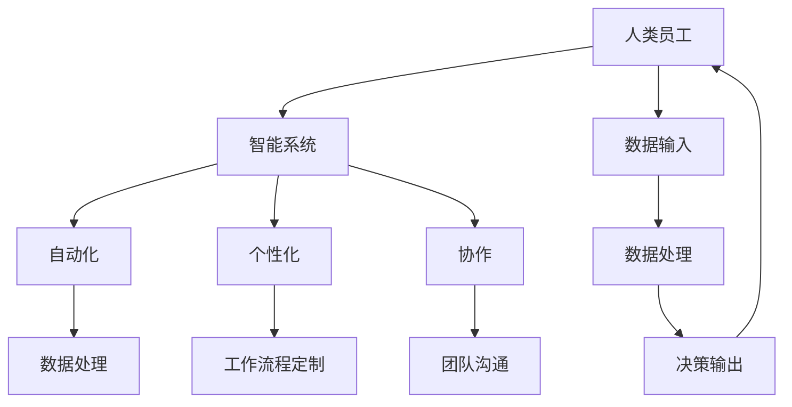

                 

# 人机协同：未来工作的核心驱动力

在当前的技术浪潮下，人工智能（AI）和机器学习（ML）正逐渐成为推动各行各业变革的关键力量。特别是在工作场所，人机协同模式正在重塑未来的工作方式。本文将探讨人机协同的概念、原理和操作步骤，并详细讨论其在实际应用中的优势与挑战，旨在为未来的工作模式提供新的视角。

## 1. 背景介绍

### 1.1 问题由来

随着信息技术的飞速发展，企业需要应对日益复杂多变的外部环境，并不断提高自身的竞争力。然而，传统的工作方式难以适应快速变化的需求，人机协同模式应运而生。人机协同结合了人类和机器的优势，旨在通过智能系统提升工作效率和创新能力。

### 1.2 问题核心关键点

- **人机协同**：将人类和机器的优势相结合，形成互补的协作模式，共同完成复杂任务。
- **智能系统**：利用AI和ML技术构建的智能工具，能够自动处理大量数据、识别模式、做出决策。
- **工作方式**：通过重新设计工作流程，让智能系统与人类员工协作，提升工作效率和创新能力。
- **未来工作**：探讨如何通过人机协同实现未来的工作模式变革，提高生产力和创造力。

### 1.3 问题研究意义

研究人机协同模式，对于提升工作效率、优化工作流程、增强创新能力具有重要意义。具体如下：

- **效率提升**：通过自动化和智能化工具，显著减少重复性工作，提高整体工作效率。
- **成本节约**：减少人力成本，提高资源利用率，降低企业运营成本。
- **创新加速**：智能系统能够快速处理大量数据，发现潜在机会，推动产品和服务的创新。
- **决策支持**：提供数据驱动的决策支持，减少决策错误，提升管理水平。

## 2. 核心概念与联系

### 2.1 核心概念概述

为了更好地理解人机协同模式，本节将介绍几个核心概念及其相互之间的关系：

- **人机协同**：将人类和机器的各自优势相结合，形成互补的工作模式。
- **智能系统**：通过AI和ML技术构建的系统，能够自动化处理数据、识别模式、做出决策。
- **自动化**：利用机器学习算法实现自动化操作，减少人工干预。
- **个性化**：根据员工的工作习惯和偏好，定制化工作流程和工具。
- **协作**：通过智能系统促进团队协作，提升团队效率。

这些概念之间通过数据流动和信息交互，形成一个协同工作的闭环系统。以下是一个简单的Mermaid流程图，展示了这些概念之间的联系：



### 2.2 核心概念原理和架构

人机协同模式的原理在于利用机器处理数据和模式识别，将复杂任务分解为多个子任务，由人类和机器协同完成。其架构一般包括数据输入、数据处理、决策输出和反馈循环四个环节：

1. **数据输入**：通过传感器、设备或手动输入等方式，收集工作相关的数据。
2. **数据处理**：智能系统对输入的数据进行清洗、特征提取、模式识别等处理，生成决策所需的信息。
3. **决策输出**：智能系统根据处理后的数据，做出决策并输出结果。
4. **反馈循环**：根据输出结果和实际效果，调整系统参数和算法，不断优化系统性能。

## 3. 核心算法原理 & 具体操作步骤

### 3.1 算法原理概述

人机协同的算法原理主要基于机器学习和数据分析技术，通过智能系统对大量数据进行自动化的处理和分析，辅助人类决策。以下是关键算法步骤：

1. **数据预处理**：对输入的数据进行清洗、特征提取、归一化等预处理操作，确保数据质量。
2. **模式识别**：利用机器学习算法（如分类、聚类、回归等）识别数据中的模式和规律。
3. **决策支持**：根据模式识别结果，生成数据驱动的决策支持，辅助人类做出决策。
4. **反馈优化**：根据实际效果和反馈信息，调整算法参数和模型，持续优化系统性能。

### 3.2 算法步骤详解

以下是一个典型的人机协同算法步骤详解：

**Step 1: 数据收集与预处理**

- 使用传感器、设备或手动输入等方式，收集工作相关的数据。
- 对数据进行清洗、特征提取、归一化等预处理操作，确保数据质量。

**Step 2: 模式识别与决策支持**

- 利用机器学习算法对预处理后的数据进行模式识别，生成决策支持。
- 根据决策支持，生成数据驱动的决策结果。

**Step 3: 反馈循环与优化**

- 根据决策结果和实际效果，收集反馈信息。
- 调整算法参数和模型，优化系统性能。

### 3.3 算法优缺点

人机协同算法具有以下优点：

- **效率提升**：通过自动化处理和数据分析，显著提高工作效率。
- **成本节约**：减少人工干预，降低运营成本。
- **决策支持**：提供数据驱动的决策支持，减少决策错误。

同时，该算法也存在以下缺点：

- **依赖数据质量**：对输入数据的质量要求较高，数据偏差可能导致误判。
- **算法复杂**：需要复杂的算法和大量计算资源，维护和优化成本较高。
- **隐私风险**：处理个人数据时，需要严格保护隐私，避免数据泄露。

### 3.4 算法应用领域

人机协同算法已在多个领域得到广泛应用，包括但不限于以下几类：

1. **制造业**：利用智能系统对生产数据进行分析和优化，提升生产效率和产品质量。
2. **医疗健康**：通过智能诊断系统，辅助医生进行疾病诊断和治疗决策。
3. **金融服务**：利用机器学习算法进行风险评估和客户服务，提高服务质量和客户满意度。
4. **物流运输**：利用智能调度系统，优化物流路径和运输效率，降低成本。
5. **零售电商**：通过智能推荐系统，提升销售转化率和客户体验。
6. **教育培训**：利用智能评估系统，提供个性化学习方案，提升学习效果。

## 4. 数学模型和公式 & 详细讲解 & 举例说明

### 4.1 数学模型构建

人机协同模型的构建通常包括以下步骤：

1. **数据收集**：通过传感器、设备或手动输入等方式，收集工作相关的数据。
2. **数据预处理**：对输入的数据进行清洗、特征提取、归一化等预处理操作。
3. **模型选择**：根据任务需求，选择合适的机器学习模型，如回归、分类、聚类等。
4. **训练与优化**：利用训练集数据，训练模型并根据验证集数据进行优化。
5. **预测与决策**：利用训练好的模型，对新数据进行预测并生成决策支持。

### 4.2 公式推导过程

以分类任务为例，假设我们有一个数据集 $D=\{(x_i, y_i)\}_{i=1}^N$，其中 $x_i$ 表示输入特征，$y_i$ 表示分类标签。我们的目标是通过训练一个分类器 $f(x)$，使得对于新输入 $x'$，能准确预测其分类标签 $y'$。

我们可以使用分类算法，如逻辑回归、支持向量机、决策树等，构建分类器。对于逻辑回归，其损失函数为：

$$
\mathcal{L} = \frac{1}{N} \sum_{i=1}^N \log(1 + e^{-y_i f(x_i)})
$$

其中 $f(x)$ 表示分类器的输出，$y_i$ 为真实标签，$e$ 为自然对数底数。利用梯度下降等优化算法，最小化损失函数，求解最优的模型参数 $\theta$。

### 4.3 案例分析与讲解

假设我们有一个工厂生产线，需要实时监控生产设备的运行状态，以避免故障和停机。我们可以收集设备的传感器数据，如温度、压力、振动等，作为输入特征 $x$。通过训练一个分类器，对每个特征进行分类，预测设备的运行状态 $y$。

- **数据收集**：使用传感器收集设备的运行数据，存储为 $D$。
- **数据预处理**：对数据进行清洗、归一化等预处理，确保数据质量。
- **模型选择**：选择适合的多分类算法，如随机森林、支持向量机等。
- **训练与优化**：利用训练集数据，训练模型并根据验证集数据进行优化。
- **预测与决策**：利用训练好的模型，对新数据进行预测，生成设备运行状态的决策支持。

## 5. 项目实践：代码实例和详细解释说明

### 5.1 开发环境搭建

在进行人机协同项目开发前，我们需要准备好开发环境。以下是使用Python进行PyTorch开发的环境配置流程：

1. 安装Anaconda：从官网下载并安装Anaconda，用于创建独立的Python环境。

2. 创建并激活虚拟环境：
```bash
conda create -n pytorch-env python=3.8 
conda activate pytorch-env
```

3. 安装PyTorch：根据CUDA版本，从官网获取对应的安装命令。例如：
```bash
conda install pytorch torchvision torchaudio cudatoolkit=11.1 -c pytorch -c conda-forge
```

4. 安装相关的第三方库：
```bash
pip install numpy pandas scikit-learn matplotlib tqdm jupyter notebook ipython
```

完成上述步骤后，即可在`pytorch-env`环境中开始项目开发。

### 5.2 源代码详细实现

以下是一个基于机器学习进行智能系统开发的人机协同项目示例：

首先，定义数据处理函数：

```python
import numpy as np
from sklearn.model_selection import train_test_split

def preprocess_data(X, y, test_size=0.2):
    X_train, X_test, y_train, y_test = train_test_split(X, y, test_size=test_size, random_state=42)
    X_train = np.hstack([X_train, np.ones((X_train.shape[0], 1))])  # 添加偏差项
    X_test = np.hstack([X_test, np.ones((X_test.shape[0], 1))])
    return X_train, X_test, y_train, y_test
```

然后，定义模型训练函数：

```python
import torch
from torch import nn
from torch import optim

def train_model(X_train, y_train, X_test, y_test, model, criterion, optimizer, epochs=10):
    X_train, y_train = torch.from_numpy(X_train).float(), torch.from_numpy(y_train).float()
    X_test, y_test = torch.from_numpy(X_test).float(), torch.from_numpy(y_test).float()

    model.train()
    criterion.train()
    optimizer = optim.Adam(model.parameters(), lr=0.001)

    for epoch in range(epochs):
        loss = 0
        for i in range(len(X_train)):
            optimizer.zero_grad()
            outputs = model(X_train[i])
            loss += criterion(outputs, y_train[i])
            loss.backward()
            optimizer.step()

        if epoch % 1 == 0:
            print(f"Epoch {epoch+1}/{epochs}, loss: {loss.item()}")

    return model
```

接着，定义模型评估函数：

```python
def evaluate_model(model, X_test, y_test):
    X_test, y_test = torch.from_numpy(X_test).float(), torch.from_numpy(y_test).float()

    with torch.no_grad():
        outputs = model(X_test)
        _, predicted = torch.max(outputs, dim=1)
        accuracy = (predicted == y_test).sum().item() / len(y_test)
        print(f"Accuracy: {accuracy}")
```

最后，启动训练流程并在测试集上评估：

```python
# 示例数据
X = np.random.rand(100, 10)
y = np.random.randint(0, 3, 100)

# 数据预处理
X_train, X_test, y_train, y_test = preprocess_data(X, y)

# 定义模型
model = nn.Sequential(nn.Linear(11, 64), nn.ReLU(), nn.Linear(64, 3))

# 定义损失函数和优化器
criterion = nn.CrossEntropyLoss()
optimizer = optim.Adam(model.parameters(), lr=0.001)

# 训练模型
trained_model = train_model(X_train, y_train, X_test, y_test, model, criterion, optimizer)

# 评估模型
evaluate_model(trained_model, X_test, y_test)
```

这就是一个基于机器学习进行智能系统开发的人机协同项目示例。可以看到，使用PyTorch和Scikit-learn等库，可以轻松实现数据的预处理、模型训练和评估。开发者可以根据具体需求，灵活设计数据处理和模型优化策略。

### 5.3 代码解读与分析

让我们再详细解读一下关键代码的实现细节：

**preprocess_data函数**：
- 对输入数据进行划分，保留80%数据用于训练，20%数据用于测试。
- 添加偏差项，确保输入数据形式符合模型要求。

**train_model函数**：
- 使用Adam优化器，设定学习率0.001。
- 通过循环迭代，不断更新模型参数，最小化损失函数。
- 每轮迭代后，输出当前损失值，以便监控训练进展。

**evaluate_model函数**：
- 在测试集上评估模型，计算准确率。
- 使用with torch.no_grad()确保评估过程中不更新模型参数。

**示例数据**：
- 生成100个随机样本，作为输入特征X和输出标签y。

**模型定义**：
- 使用Sequential模型，定义一个包含两个线性层和ReLU激活函数的神经网络。

**损失函数和优化器定义**：
- 使用交叉熵损失函数和Adam优化器。

**训练模型**：
- 调用train_model函数，训练模型并返回训练后的模型。

**评估模型**：
- 调用evaluate_model函数，计算模型在测试集上的准确率。

## 6. 实际应用场景

### 6.1 智能制造

智能制造通过人机协同模式，利用智能系统优化生产流程，提升生产效率和产品质量。例如，通过智能监控系统实时监测生产设备的运行状态，及时发现和解决问题，避免设备故障和停机。

**应用场景**：
- 利用传感器收集生产设备的运行数据，通过机器学习算法进行分析，预测设备故障。
- 实时调整生产参数，优化生产流程，提高生产效率。
- 根据故障预测结果，提前进行设备维护，降低维护成本。

**技术难点**：
- 数据的实时收集和处理。
- 高效的算法模型选择和优化。
- 数据的隐私和安全保护。

### 6.2 智慧医疗

智慧医疗通过人机协同模式，利用智能系统辅助医生进行诊断和治疗，提升医疗服务的质量和效率。例如，通过智能诊断系统，辅助医生进行疾病诊断和治疗决策。

**应用场景**：
- 收集患者的医疗数据，如病历、影像、实验室检查等。
- 利用机器学习算法进行数据分析和模式识别，生成疾病诊断和治疗方案。
- 提供医生辅助决策支持，提高诊疗准确性和效率。

**技术难点**：
- 医疗数据的复杂性和多样性。
- 模型的可解释性和透明度。
- 数据的隐私和安全保护。

### 6.3 金融服务

金融服务通过人机协同模式，利用智能系统进行风险评估和客户服务，提升服务质量和客户满意度。例如，通过智能评估系统，辅助客户进行贷款评估和投资决策。

**应用场景**：
- 收集客户的金融数据，如财务报表、信用记录等。
- 利用机器学习算法进行数据分析和风险评估，生成贷款和投资建议。
- 提供客户服务支持，提升客户满意度和忠诚度。

**技术难点**：
- 金融数据的复杂性和敏感性。
- 模型的公平性和透明性。
- 数据的隐私和安全保护。

### 6.4 未来应用展望

随着人机协同技术的不断发展，其在未来将会有更加广泛的应用前景。以下是我们对未来应用前景的展望：

1. **全面智能化**：未来的智能系统将更加全面，涵盖从生产到服务各个环节，实现全流程智能化。
2. **精准决策**：利用人工智能算法，提升决策的精准性和科学性，减少人为错误。
3. **个性化服务**：通过数据分析，提供更加个性化和定制化的服务，提升用户体验。
4. **跨领域融合**：与其他人工智能技术，如物联网、区块链等，进行深度融合，推动技术进步。
5. **人机协同融合**：实现人机无缝协作，提升工作效率和创造力。

## 7. 工具和资源推荐

### 7.1 学习资源推荐

为了帮助开发者系统掌握人机协同的理论基础和实践技巧，这里推荐一些优质的学习资源：

1. **《人工智能：一个现代的方法》**：斯坦福大学的经典教材，全面介绍人工智能的基本概念和算法。
2. **《深度学习》**：Ian Goodfellow等人所著，深入介绍深度学习的基本原理和应用。
3. **Coursera《机器学习》课程**：Andrew Ng开设的课程，通过视频和作业，系统介绍机器学习的基本概念和算法。
4. **Kaggle竞赛**：Kaggle是一个著名的数据科学竞赛平台，通过参加竞赛，提升数据处理和模型优化能力。
5. **Hugging Face官方文档**：Hugging Face是一个领先的自然语言处理库，提供丰富的预训练模型和教程，适合初学者入门。

### 7.2 开发工具推荐

高效的开发离不开优秀的工具支持。以下是几款用于人机协同开发的常用工具：

1. **PyTorch**：基于Python的开源深度学习框架，支持动态计算图，适合快速迭代研究。
2. **TensorFlow**：由Google主导开发的开源深度学习框架，生产部署方便，适合大规模工程应用。
3. **Scikit-learn**：Python的机器学习库，提供丰富的算法和工具，适合快速实现原型和模型评估。
4. **Weights & Biases**：模型训练的实验跟踪工具，可以记录和可视化模型训练过程中的各项指标。
5. **TensorBoard**：TensorFlow配套的可视化工具，可实时监测模型训练状态，并提供丰富的图表呈现方式。
6. **Jupyter Notebook**：一个交互式的Python开发环境，支持代码编写、数据处理、模型训练等全流程开发。

### 7.3 相关论文推荐

人机协同技术的发展源于学界的持续研究。以下是几篇奠基性的相关论文，推荐阅读：

1. **《人机协同：人工智能的未来》**：探讨人机协同模式在人工智能中的应用，提出未来的发展方向。
2. **《深度学习在金融服务中的应用》**：介绍深度学习在金融服务中的应用，如风险评估、客户服务等。
3. **《智能制造：基于数据驱动的生产优化》**：介绍智能制造的概念和技术，探讨如何通过数据驱动优化生产流程。
4. **《智能医疗：人工智能在医疗中的应用》**：探讨人工智能在医疗中的应用，如疾病诊断、治疗方案等。

这些论文代表了大数据、人工智能和机器学习领域的最新研究成果，通过学习这些前沿成果，可以帮助研究者把握学科前进方向，激发更多的创新灵感。

## 8. 总结：未来发展趋势与挑战

### 8.1 研究成果总结

本文对人机协同模式进行了全面系统的介绍，系统地分析了其背景、核心概念、算法原理和操作步骤，并通过代码实例和案例分析进行了详细讲解。本文从理论到实践，为读者提供了一个完整的人机协同开发框架，帮助其理解并应用人机协同模式。

### 8.2 未来发展趋势

展望未来，人机协同技术将呈现以下几个发展趋势：

1. **全面智能化**：未来的智能系统将更加全面，涵盖从生产到服务各个环节，实现全流程智能化。
2. **精准决策**：利用人工智能算法，提升决策的精准性和科学性，减少人为错误。
3. **个性化服务**：通过数据分析，提供更加个性化和定制化的服务，提升用户体验。
4. **跨领域融合**：与其他人工智能技术，如物联网、区块链等，进行深度融合，推动技术进步。
5. **人机协同融合**：实现人机无缝协作，提升工作效率和创造力。

### 8.3 面临的挑战

尽管人机协同技术已经取得了瞩目成就，但在迈向更加智能化、普适化应用的过程中，它仍面临着诸多挑战：

1. **数据质量**：数据质量是影响人机协同性能的关键因素，需要保证数据的全面性、准确性和时效性。
2. **算法复杂性**：复杂的算法模型需要大量的计算资源和维护成本，需要进一步优化和简化。
3. **隐私保护**：在处理敏感数据时，需要严格保护隐私，避免数据泄露。
4. **技术兼容性**：不同技术之间的兼容性问题，需要在设计上考虑统一的数据格式和接口。
5. **跨领域应用**：不同领域的业务需求和数据特征不同，需要针对性地设计和优化系统。

### 8.4 研究展望

面向未来，人机协同技术需要在以下几个方面寻求新的突破：

1. **数据采集和预处理**：提升数据的全面性和实时性，确保数据质量。
2. **算法优化和简化**：降低算法复杂度，提高模型效率。
3. **隐私保护和伦理**：在数据处理过程中，确保隐私保护和伦理合规。
4. **跨领域应用**：针对不同领域的需求，设计和优化人机协同系统。
5. **人机协同融合**：实现人机无缝协作，提升工作效率和创造力。

## 9. 附录：常见问题与解答

**Q1：人机协同是否适用于所有应用场景？**

A: 人机协同模式适用于大多数应用场景，尤其是需要大量数据分析和决策支持的领域。但对于一些需要高自主性和创新能力的场景，如创意工作、科学研究等，人类员工的参与和贡献仍然不可或缺。

**Q2：如何选择合适的算法模型？**

A: 选择合适的算法模型需要考虑多个因素，包括任务的复杂性、数据的特征、计算资源的限制等。一般建议采用模型可解释性高的算法，如逻辑回归、决策树等，在复杂任务上使用深度学习模型，如神经网络、支持向量机等。

**Q3：数据隐私和安全如何保护？**

A: 数据隐私和安全是人机协同应用中必须严格考虑的问题。可以采用数据匿名化、加密存储、访问控制等措施，确保数据在处理过程中的安全性和隐私保护。

**Q4：人机协同的效率和效果如何提升？**

A: 提升人机协同的效率和效果需要从多个方面入手，包括优化算法模型、提升数据质量、合理分配资源等。同时，根据实际需求，灵活调整人机协作的策略，提升整体性能。

**Q5：人机协同的开发和部署需要注意哪些问题？**

A: 人机协同的开发和部署需要考虑多个环节，包括数据收集、预处理、模型训练、评估和部署等。同时，需要合理设计系统架构，确保系统的可扩展性和可靠性。

---

作者：禅与计算机程序设计艺术 / Zen and the Art of Computer Programming

