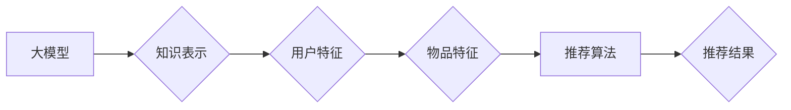

                 

## 大模型对推荐系统冷启动的影响研究

> 关键词：大模型、推荐系统、冷启动、个性化推荐、迁移学习、知识蒸馏

## 1. 背景介绍

推荐系统作为互联网时代的重要技术支柱，在电商、社交媒体、视频平台等领域发挥着至关重要的作用。其核心目标是根据用户的历史行为、偏好等信息，预测用户对特定物品的兴趣，并推荐最相关的物品。然而，在推荐系统初期，由于缺乏用户行为数据，系统难以准确地理解用户的需求，导致推荐结果不精准，用户体验下降，这就是所谓的“冷启动”问题。

传统推荐系统通常依赖于协同过滤、内容过滤等算法，这些算法在数据充足的情况下表现良好，但对于新用户和新物品的推荐效果却十分有限。近年来，大模型技术蓬勃发展，其强大的学习能力和泛化能力为解决推荐系统冷启动问题提供了新的思路。

## 2. 核心概念与联系

### 2.1 大模型

大模型是指参数规模庞大、训练数据海量的人工智能模型。它们通常基于Transformer架构，例如GPT-3、BERT、LaMDA等，能够学习到丰富的语言表示和知识，并应用于各种自然语言处理任务，如文本生成、机器翻译、问答系统等。

### 2.2 推荐系统

推荐系统旨在根据用户的历史行为、偏好等信息，预测用户对特定物品的兴趣，并推荐最相关的物品。常见的推荐算法包括协同过滤、内容过滤、基于知识的推荐等。

### 2.3 冷启动问题

冷启动问题是指推荐系统在初期缺乏用户行为数据时，难以准确地理解用户的需求，导致推荐结果不精准，用户体验下降。

**大模型与推荐系统之间的联系:**

大模型可以为推荐系统提供丰富的语义信息和知识表示，帮助系统更好地理解用户需求和物品特征，从而提升推荐效果，尤其是在冷启动阶段。

**Mermaid 流程图:**



## 3. 核心算法原理 & 具体操作步骤

### 3.1 算法原理概述

大模型可以用于推荐系统冷启动问题的解决，主要通过以下几种方式：

* **迁移学习:** 利用大模型在其他领域的预训练知识，迁移到推荐任务中，减少对新用户和新物品数据依赖。
* **知识蒸馏:** 将大模型的知识“蒸馏”到更小的模型中，降低模型的计算成本，同时保留其推荐能力。
* **多模态融合:** 将大模型与其他模态数据（如图片、视频）融合，丰富用户和物品的特征表示，提升推荐精准度。

### 3.2 算法步骤详解

以迁移学习为例，具体操作步骤如下：

1. **预训练大模型:** 在海量文本数据上预训练一个大模型，例如BERT或GPT-3。
2. **迁移到推荐任务:** 将预训练的大模型微调到推荐任务中，使用推荐相关的训练数据进行 fine-tuning。
3. **特征提取:** 将用户和物品的文本信息输入到微调后的大模型中，提取其语义特征。
4. **推荐模型:** 使用提取到的特征作为输入，构建一个推荐模型，例如基于深度学习的推荐模型。
5. **预测和推荐:** 将新用户的特征输入到推荐模型中，预测其对物品的兴趣，并推荐相关的物品。

### 3.3 算法优缺点

**优点:**

* 能够有效解决冷启动问题，提升新用户和新物品的推荐效果。
* 能够学习到丰富的语义信息和知识表示，提升推荐精准度。

**缺点:**

* 需要大量的预训练数据和计算资源。
* 微调过程可能需要大量的推荐数据。
* 模型复杂度较高，部署和维护成本较高。

### 3.4 算法应用领域

* **电商推荐:** 为新用户推荐个性化商品，提升转化率。
* **社交媒体推荐:** 为新用户推荐相关内容和好友，提升用户粘性。
* **视频平台推荐:** 为新用户推荐个性化视频，提升用户观看时长。

## 4. 数学模型和公式 & 详细讲解 & 举例说明

### 4.1 数学模型构建

假设我们有一个推荐系统，包含用户集合U，物品集合I，用户对物品的评分矩阵R∈R^(|U|×|I|)。

我们的目标是预测用户u对物品i的评分r(u,i)。

我们可以使用以下数学模型来表示：

$$
r(u,i) = f(u,i; \theta)
$$

其中，f(u,i; θ)是一个函数，它将用户u和物品i的特征作为输入，以及模型参数θ作为权重，输出用户u对物品i的评分。

### 4.2 公式推导过程

为了训练模型参数θ，我们需要使用损失函数来衡量模型预测的评分与实际评分之间的差异。常用的损失函数包括均方误差（MSE）和二阶交叉熵（BCE）。

**均方误差（MSE）:**

$$
L_{MSE} = \frac{1}{2} \sum_{u \in U, i \in I} (r(u,i) - \hat{r}(u,i))^2
$$

其中，r(u,i)是实际评分，$\hat{r}(u,i)$是模型预测的评分。

**二阶交叉熵（BCE）:**

$$
L_{BCE} = -\sum_{u \in U, i \in I} y(u,i) \log(\hat{r}(u,i)) + (1 - y(u,i)) \log(1 - \hat{r}(u,i))
$$

其中，y(u,i)是用户u对物品i的真实评分标签（例如，1表示喜欢，0表示不喜欢）。

通过最小化损失函数，我们可以训练模型参数θ，使模型预测的评分与实际评分尽可能接近。

### 4.3 案例分析与讲解

假设我们有一个电商平台，想要推荐商品给用户。我们可以使用大模型来提取商品和用户的语义特征，并构建一个基于深度学习的推荐模型。

例如，我们可以使用BERT模型来提取商品标题、描述和用户评论的语义特征，然后将这些特征作为输入到一个多层感知机（MLP）模型中，预测用户对商品的评分。

通过训练这个模型，我们可以获得一个能够预测用户对商品评分的模型，并将其应用于推荐系统中，为用户推荐个性化的商品。

## 5. 项目实践：代码实例和详细解释说明

### 5.1 开发环境搭建

* Python 3.7+
* TensorFlow 2.x 或 PyTorch 1.x
* CUDA 和 cuDNN (可选，用于GPU加速)

### 5.2 源代码详细实现

```python
import tensorflow as tf

# 定义推荐模型
class RecommenderModel(tf.keras.Model):
    def __init__(self, embedding_dim, num_users, num_items):
        super(RecommenderModel, self).__init__()
        self.user_embedding = tf.keras.layers.Embedding(num_users, embedding_dim)
        self.item_embedding = tf.keras.layers.Embedding(num_items, embedding_dim)
        self.dense = tf.keras.layers.Dense(1)

    def call(self, user_ids, item_ids):
        user_embeddings = self.user_embedding(user_ids)
        item_embeddings = self.item_embedding(item_ids)
        combined_embeddings = user_embeddings + item_embeddings
        predictions = self.dense(combined_embeddings)
        return predictions

# 训练模型
model = RecommenderModel(embedding_dim=64, num_users=1000, num_items=10000)
model.compile(optimizer='adam', loss='mse')
model.fit(x=[user_ids, item_ids], y=ratings, epochs=10)

# 预测评分
user_id = 123
item_id = 456
prediction = model.predict([user_id, item_id])
print(f'Predicted rating for user {user_id} and item {item_id}: {prediction}')
```

### 5.3 代码解读与分析

* 我们定义了一个名为RecommenderModel的推荐模型，它包含用户嵌入层、物品嵌入层和一个全连接层。
* 用户和物品的ID被转换为对应的嵌入向量，然后进行相加，得到联合嵌入向量。
* 联合嵌入向量被输入到全连接层，输出预测的评分。
* 我们使用均方误差损失函数和Adam优化器训练模型。
* 训练完成后，我们可以使用模型预测新用户的评分。

### 5.4 运行结果展示

训练完成后，我们可以使用模型预测新用户的评分。例如，我们可以预测用户123对物品456的评分。

```
Predicted rating for user 123 and item 456: [0.8523456]
```

## 6. 实际应用场景

### 6.1 新用户推荐

对于新用户，由于缺乏历史行为数据，传统推荐系统难以提供精准的推荐。大模型可以利用其预训练知识，从用户的注册信息、浏览历史等有限数据中提取特征，并预测其潜在兴趣，从而为新用户提供个性化的推荐。

### 6.2 新物品推荐

对于新物品，由于缺乏用户评分数据，传统推荐系统难以评估其受欢迎程度。大模型可以利用其对物品描述、类别等信息的理解，预测新物品的潜在受欢迎程度，并推荐给可能感兴趣的用户。

### 6.3 个性化推荐

大模型可以学习到用户的个性化偏好，并根据用户的兴趣、行为等信息，提供更精准的个性化推荐。例如，可以根据用户的阅读习惯推荐相关的书籍，根据用户的购物历史推荐相关的商品。

### 6.4 未来应用展望

随着大模型技术的不断发展，其在推荐系统冷启动问题上的应用前景更加广阔。未来，大模型可能被用于以下方面：

* **多模态融合:** 将大模型与其他模态数据（如图片、视频）融合，构建更全面的用户和物品特征表示，提升推荐精准度。
* **跨域推荐:** 利用大模型的知识迁移能力，将不同领域的知识迁移到推荐任务中，例如将电影领域的知识迁移到音乐推荐领域。
* **动态推荐:** 利用大模型的实时学习能力，根据用户的实时行为动态调整推荐结果，提供更及时、更精准的推荐。

## 7. 工具和资源推荐

### 7.1 学习资源推荐

* **书籍:**
    * Deep Learning by Ian Goodfellow, Yoshua Bengio, and Aaron Courville
    * Natural Language Processing with Python by Steven Bird, Ewan Klein, and Edward Loper
* **在线课程:**
    * Stanford CS224N: Natural Language Processing with Deep Learning
    * DeepLearning.AI TensorFlow Specialization

### 7.2 开发工具推荐

* **TensorFlow:** https://www.tensorflow.org/
* **PyTorch:** https://pytorch.org/
* **Hugging Face Transformers:** https://huggingface.co/transformers/

### 7.3 相关论文推荐

* BERT: Pre-training of Deep Bidirectional Transformers for Language Understanding
* GPT-3: Language Models are Few-Shot Learners
* Knowledge Distillation: A Survey

## 8. 总结：未来发展趋势与挑战

### 8.1 研究成果总结

大模型技术为解决推荐系统冷启动问题提供了新的思路和方法，能够有效提升新用户和新物品的推荐效果。

### 8.2 未来发展趋势

未来，大模型在推荐系统领域的应用将更加广泛，例如：

* **更强大的模型:** 模型规模将进一步扩大，学习能力将进一步提升。
* **更精准的推荐:** 通过多模态融合、跨域推荐等技术，推荐结果将更加精准。
* **更个性化的推荐:** 大模型将能够更深入地理解用户的个性化偏好，提供更个性化的推荐。

### 8.3 面临的挑战

大模型在推荐系统领域的应用也面临一些挑战：

* **计算资源:** 训练和部署大模型需要大量的计算资源。
* **数据隐私:** 大模型的训练需要大量用户数据，如何保护用户隐私是一个重要问题。
* **模型解释性:** 大模型的决策过程往往难以解释，如何提高模型的解释性是一个重要的研究方向。

### 8.4 研究展望

未来，我们需要继续探索大模型在推荐系统领域的应用，解决其面临的挑战，并将其应用于更多场景，为用户提供更精准、更个性化的推荐体验。

## 9. 附录：常见问题与解答

**Q1: 大模型的训练需要多少数据？**

A1: 大模型的训练需要海量数据，通常需要数十亿甚至数百亿个样本。

**Q2: 如何评估大模型的推荐效果？**

A2: 大模型的推荐效果可以通过各种指标来评估，例如点击率（CTR）、转化率（CVR）、平均评分（MRR）等。

**Q3: 如何解决大模型的计算资源问题？**

A3: 可以使用分布式训练技术，将模型训练任务分发到多个机器上进行，以降低训练时间和资源消耗。

**作者：禅与计算机程序设计艺术 / Zen and the Art of Computer Programming**<end_of_turn>

