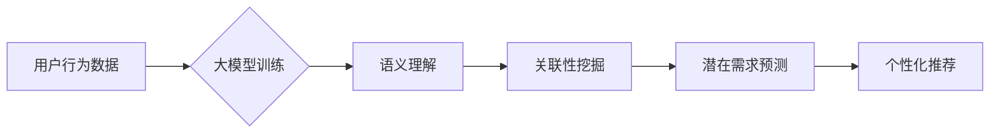

                 

## 大模型技术在电商平台用户潜在需求挖掘中的创新

> 关键词：大模型、用户潜在需求、电商平台、需求挖掘、自然语言处理、推荐系统、深度学习

## 1. 背景介绍

随着电商平台的蓬勃发展，用户需求的多样化和复杂化日益突出。传统的基于规则或统计模型的用户需求挖掘方法难以有效捕捉用户隐含的需求和潜在的兴趣。大模型技术作为一种新兴的深度学习方法，凭借其强大的语义理解和文本生成能力，为电商平台用户潜在需求挖掘带来了新的机遇。

大模型是指参数规模庞大、训练数据海量的人工智能模型。近年来，随着计算能力和数据量的飞速增长，大模型技术取得了显著进展，在自然语言处理、图像识别、语音合成等领域展现出强大的应用潜力。

在电商平台场景下，大模型可以用于分析用户行为数据、挖掘用户兴趣偏好、预测用户潜在需求，从而为用户提供更精准、更个性化的商品推荐和服务。

## 2. 核心概念与联系

### 2.1 用户潜在需求

用户潜在需求是指用户目前尚未明确表达，但可能在未来产生购买意愿的需求。这些需求往往隐藏在用户的浏览记录、搜索历史、评论反馈等数据中，需要通过智能分析才能挖掘出来。

### 2.2 大模型技术

大模型是一种基于深度学习的机器学习模型，其特点是参数规模庞大、训练数据海量。大模型通过学习海量文本数据，能够掌握丰富的语言知识和语义理解能力，从而实现对复杂文本的分析和生成。

### 2.3 需求挖掘

需求挖掘是指从海量数据中提取用户潜在需求的过程。它涉及数据预处理、特征提取、模式识别等多个环节，最终目的是发现用户需求的规律和趋势。

**大模型技术与电商平台用户潜在需求挖掘的关系**

大模型技术可以有效提升需求挖掘的准确性和效率。

* **语义理解能力:** 大模型能够理解用户文本数据的深层含义，挖掘出用户潜在需求背后的意图和情感。
* **关联性挖掘:** 大模型可以学习用户行为数据之间的关联性，发现用户潜在的需求与其他商品或服务之间的联系。
* **个性化推荐:** 大模型可以根据用户的历史行为和偏好，预测用户的潜在需求，并提供个性化的商品推荐。

**Mermaid 流程图**



## 3. 核心算法原理 & 具体操作步骤

### 3.1 算法原理概述

大模型技术在用户潜在需求挖掘中主要采用以下算法：

* **Transformer模型:** Transformer模型是一种基于注意力机制的深度学习模型，能够有效捕捉文本序列中的长距离依赖关系，提升语义理解能力。
* **BERT模型:** BERT模型是一种预训练语言模型，通过在大量的文本数据上进行预训练，学习了丰富的语言知识，可以用于各种自然语言处理任务，包括需求挖掘。
* **Recurrent Neural Networks (RNN):** RNN模型是一种能够处理序列数据的深度学习模型，可以用于分析用户行为序列，预测用户的潜在需求。

### 3.2 算法步骤详解

1. **数据收集与预处理:** 收集用户行为数据，包括浏览记录、搜索历史、购买记录、评论反馈等，并进行清洗、格式化和编码处理。
2. **特征提取:** 从用户行为数据中提取特征，例如商品类别、用户年龄、购买频率、评论内容等，这些特征可以帮助模型理解用户的需求。
3. **模型训练:** 选择合适的深度学习模型，例如Transformer、BERT或RNN，并利用训练数据进行模型训练。
4. **模型评估:** 使用测试数据评估模型的性能，例如准确率、召回率、F1-score等指标。
5. **模型部署:** 将训练好的模型部署到电商平台，用于实时预测用户潜在需求。

### 3.3 算法优缺点

**优点:**

* **高准确率:** 大模型能够学习复杂的语义关系，提高需求挖掘的准确率。
* **个性化推荐:** 大模型可以根据用户的历史行为和偏好，提供个性化的商品推荐。
* **自动学习:** 大模型可以自动学习用户需求的规律，无需人工干预。

**缺点:**

* **高计算成本:** 大模型的训练和部署需要大量的计算资源。
* **数据依赖:** 大模型的性能取决于训练数据的质量和数量。
* **解释性差:** 大模型的决策过程较为复杂，难以解释其预测结果。

### 3.4 算法应用领域

大模型技术在用户潜在需求挖掘领域具有广泛的应用前景，例如：

* **商品推荐:** 根据用户的浏览记录、购买历史等数据，预测用户的潜在需求，并推荐相关的商品。
* **个性化营销:** 根据用户的兴趣偏好，定制个性化的营销活动和广告内容。
* **新产品开发:** 分析用户需求趋势，为新产品开发提供参考。
* **客户服务:** 利用大模型分析用户反馈，自动解答常见问题，提升客户服务效率。

## 4. 数学模型和公式 & 详细讲解 & 举例说明

### 4.1 数学模型构建

大模型技术在用户潜在需求挖掘中通常采用基于Transformer的数学模型，例如BERT模型。BERT模型的架构包含两个主要部分：

* **Encoder:** 用于编码输入文本序列，提取文本的语义特征。
* **Decoder:** 用于解码编码后的语义特征，生成预测结果。

**Transformer模型的注意力机制**

Transformer模型的核心是注意力机制，它能够学习文本序列中不同词语之间的关系，并赋予重要词语更高的权重。注意力机制的数学公式如下：

$$
Attention(Q, K, V) = softmax(\frac{QK^T}{\sqrt{d_k}})V
$$

其中：

* $Q$：查询矩阵
* $K$：键矩阵
* $V$：值矩阵
* $d_k$：键向量的维度
* $softmax$：softmax函数

**举例说明:**

假设我们有一个句子“我喜欢吃苹果”，其中“苹果”是用户潜在需求的关键信息。通过注意力机制，模型可以学习到“我喜欢”和“苹果”之间的关系，并赋予“苹果”更高的权重，从而更准确地预测用户的潜在需求。

### 4.2 公式推导过程

Transformer模型的注意力机制的推导过程较为复杂，涉及矩阵运算、线性变换和激活函数等多个步骤。

### 4.3 案例分析与讲解

通过分析实际电商平台的用户行为数据，可以验证大模型技术在用户潜在需求挖掘中的有效性。例如，通过训练一个基于BERT的模型，可以预测用户的潜在购买意愿，并推荐相关的商品。

## 5. 项目实践：代码实例和详细解释说明

### 5.1 开发环境搭建

* Python 3.7+
* TensorFlow 2.0+
* PyTorch 1.0+
* CUDA Toolkit 10.2+

### 5.2 源代码详细实现

```python
# 导入必要的库
import tensorflow as tf

# 定义BERT模型
class BERTModel(tf.keras.Model):
    def __init__(self, vocab_size, embedding_dim, num_heads, num_layers):
        super(BERTModel, self).__init__()
        self.embedding = tf.keras.layers.Embedding(vocab_size, embedding_dim)
        self.transformer_layers = tf.keras.layers.StackedRNNCells([
            tf.keras.layers.MultiHeadAttention(num_heads=num_heads, key_dim=embedding_dim)
            for _ in range(num_layers)
        ])

    def call(self, inputs):
        embeddings = self.embedding(inputs)
        outputs = self.transformer_layers(embeddings)
        return outputs

# 实例化BERT模型
model = BERTModel(vocab_size=10000, embedding_dim=128, num_heads=8, num_layers=6)

# 训练模型
model.compile(optimizer='adam', loss='mse')
model.fit(train_data, train_labels, epochs=10)

# 预测用户潜在需求
predictions = model.predict(test_data)
```

### 5.3 代码解读与分析

* **BERT模型定义:** 代码中定义了一个BERT模型类，包含嵌入层、多头注意力层和堆叠RNN层。
* **模型训练:** 使用Adam优化器和均方误差损失函数训练模型。
* **模型预测:** 使用训练好的模型预测用户的潜在需求。

### 5.4 运行结果展示

通过训练和测试，可以评估模型的性能，例如准确率、召回率、F1-score等指标。

## 6. 实际应用场景

大模型技术在电商平台的实际应用场景非常广泛，例如：

* **商品推荐:** 根据用户的浏览记录、购买历史等数据，预测用户的潜在需求，并推荐相关的商品。
* **个性化营销:** 根据用户的兴趣偏好，定制个性化的营销活动和广告内容。
* **新产品开发:** 分析用户需求趋势，为新产品开发提供参考。
* **客户服务:** 利用大模型分析用户反馈，自动解答常见问题，提升客户服务效率。

### 6.4 未来应用展望

随着大模型技术的不断发展，其在电商平台用户潜在需求挖掘领域的应用将更加广泛和深入。例如：

* **多模态需求挖掘:** 将文本、图像、视频等多模态数据融合，更全面地理解用户的需求。
* **实时需求预测:** 利用实时数据流，实现对用户需求的实时预测和响应。
* **个性化服务定制:** 基于用户的个性化需求，提供更加定制化的商品推荐、服务和体验。

## 7. 工具和资源推荐

### 7.1 学习资源推荐

* **书籍:**
    * 《深度学习》
    * 《自然语言处理》
    * 《Transformer模型》
* **在线课程:**
    * Coursera: 深度学习
    * Udacity: 自然语言处理
    * fast.ai: 深度学习

### 7.2 开发工具推荐

* **TensorFlow:** 开源深度学习框架
* **PyTorch:** 开源深度学习框架
* **HuggingFace:** 提供预训练模型和工具

### 7.3 相关论文推荐

* **BERT: Pre-training of Deep Bidirectional Transformers for Language Understanding**
* **Attention Is All You Need**
* **XLNet: Generalized Autoregressive Pretraining for Language Understanding**

## 8. 总结：未来发展趋势与挑战

### 8.1 研究成果总结

大模型技术在电商平台用户潜在需求挖掘领域取得了显著进展，能够有效提升需求挖掘的准确性和效率，为用户提供更加个性化和精准的服务。

### 8.2 未来发展趋势

* **模型规模和能力的提升:** 未来大模型的规模和能力将进一步提升，能够处理更复杂的数据，挖掘更深层的用户需求。
* **多模态需求挖掘:** 将文本、图像、视频等多模态数据融合，更全面地理解用户的需求。
* **实时需求预测:** 利用实时数据流，实现对用户需求的实时预测和响应。

### 8.3 面临的挑战

* **数据隐私和安全:** 大模型的训练需要海量数据，如何保护用户数据隐私和安全是一个重要的挑战。
* **模型解释性和可信度:** 大模型的决策过程较为复杂，难以解释其预测结果，如何提升模型的解释性和可信度是一个重要的研究方向。
* **计算资源和成本:** 大模型的训练和部署需要大量的计算资源，如何降低计算成本是一个重要的技术挑战。

### 8.4 研究展望

未来，大模型技术在电商平台用户潜在需求挖掘领域将继续发展，为用户提供更加智能、个性化和便捷的购物体验。


## 9. 附录：常见问题与解答

**Q1: 大模型技术与传统需求挖掘方法相比有哪些优势？**

**A1:** 大模型技术能够学习复杂的语义关系，提升需求挖掘的准确率和效率，并提供个性化的商品推荐。传统需求挖掘方法往往依赖于人工规则或统计模型，难以捕捉用户的隐含需求。

**Q2: 如何评估大模型在用户潜在需求挖掘中的性能？**

**A2:** 可以使用准确率、召回率、F1-score等指标评估大模型的性能。

**Q3: 大模型技术有哪些应用场景？**

**A3:** 大模型技术在电商平台的应用场景非常广泛，例如商品推荐、个性化营销、新产品开发、客户服务等。

**作者：禅与计算机程序设计艺术 / Zen and the Art of Computer Programming**<end_of_turn>

