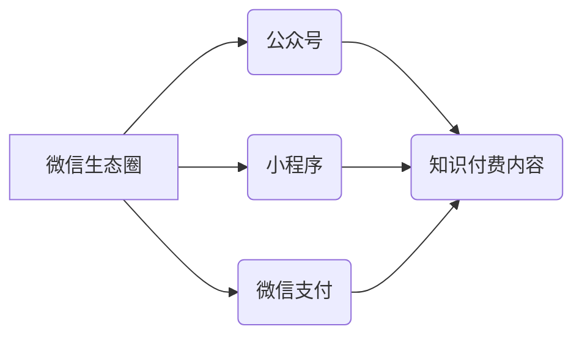

                 

## 如何利用微信生态圈进行知识付费

> 关键词：微信生态圈、知识付费、小程序、公众号、社群运营、内容营销、用户运营、数据分析

## 1. 背景介绍

知识付费作为一种新型的商业模式，近年来在互联网领域蓬勃发展。随着移动互联网的普及和用户对优质内容的需求不断增长，微信生态圈凭借其庞大的用户群体和完善的生态系统，成为知识付费的重要阵地。

微信生态圈涵盖了微信公众号、微信小程序、微信支付等多种服务，为知识付费提供了一个完整的闭环系统。公众号可以发布高质量的内容，吸引用户关注；小程序可以提供更便捷的付费服务和用户体验；微信支付可以实现快速、安全的支付结算。

## 2. 核心概念与联系

**2.1 微信生态圈概述**

微信生态圈是一个庞大的用户网络，由微信平台及其相关服务构成。其核心价值在于连接用户、内容和服务，为用户提供便捷、丰富的体验。

**2.2 知识付费模式**

知识付费是指通过付费的方式获取知识、技能和信息。它可以采用多种形式，例如线上课程、付费文章、咨询服务等。

**2.3 微信生态圈与知识付费的结合**

微信生态圈为知识付费提供了以下优势：

* **庞大的用户群体:** 微信拥有超过12亿活跃用户，为知识付费提供了一个巨大的潜在市场。
* **完善的生态系统:** 微信平台提供了一系列服务，例如公众号、小程序、支付等，可以帮助知识付费创作者进行内容发布、用户运营和支付结算。
* **便捷的用户体验:** 微信的界面简洁易用，用户可以通过微信轻松获取和支付知识付费内容。

**2.4 核心概念关系图**



## 3. 核心算法原理 & 具体操作步骤

**3.1 算法原理概述**

知识付费在微信生态圈的推广主要依靠内容营销、用户运营和数据分析等算法。

* **内容营销算法:** 通过分析用户兴趣和行为，推荐相关知识付费内容，提高用户转化率。
* **用户运营算法:** 通过用户画像、标签化等手段，精准推送内容，提高用户粘性。
* **数据分析算法:** 通过收集用户行为数据，分析用户偏好和需求，优化内容和运营策略。

**3.2 算法步骤详解**

1. **用户画像构建:** 收集用户基本信息、兴趣爱好、阅读习惯等数据，构建用户画像。
2. **内容推荐:** 根据用户画像，推荐相关知识付费内容，并根据用户反馈进行调整。
3. **社群运营:** 建立微信群或社群，与用户互动，提供更深入的知识分享和交流平台。
4. **数据分析:** 收集用户行为数据，分析用户偏好和需求，优化内容和运营策略。

**3.3 算法优缺点**

* **优点:** 能够精准推送内容，提高用户转化率和粘性。
* **缺点:** 需要大量的数据支持，算法模型需要不断优化。

**3.4 算法应用领域**

* **教育培训:** 在线课程、辅导服务等。
* **专业技能:** 技能培训、职业认证等。
* **兴趣爱好:** 文艺创作、手工制作等。

## 4. 数学模型和公式 & 详细讲解 & 举例说明

**4.1 数学模型构建**

知识付费转化率可以采用以下数学模型进行预测:

$$
Conversion Rate = \frac{Number of Purchases}{Number of Impressions}
$$

其中:

* Conversion Rate: 转化率
* Number of Purchases: 购买数量
* Number of Impressions: 展示次数

**4.2 公式推导过程**

该公式基于用户行为分析，假设用户行为服从泊松分布，则转化率可以近似表示为:

$$
Conversion Rate \approx \frac{λ}{N}
$$

其中:

* λ: 平均购买次数
* N: 展示次数

**4.3 案例分析与讲解**

假设一个微信公众号发布了一篇关于编程的付费文章，该文章展示了1000次，其中有100人购买了该文章。

则该文章的转化率为:

$$
Conversion Rate = \frac{100}{1000} = 0.1 = 10%
$$

## 5. 项目实践：代码实例和详细解释说明

**5.1 开发环境搭建**

* **微信公众平台:** 注册微信公众号，获取公众号ID和AppID等信息。
* **微信小程序:** 开发微信小程序，实现知识付费功能。
* **开发工具:** 使用微信官方提供的开发工具，例如微信开发者工具、微信小程序IDE等。

**5.2 源代码详细实现**

以下是一个简单的微信小程序知识付费代码示例，用于展示付费文章的购买流程:

```javascript
// pages/article/article.js
Page({
  data: {
    articleId: '123456', // 文章ID
    price: 9.9, // 文章价格
  },
  // 购买文章
  buyArticle: function() {
    // 调用微信支付接口
    wx.requestPayment({
      timeStamp: '', // 时间戳
      nonceStr: '', // 随机字符串
      package: '', // 支付参数
      signType: 'MD5', // 签名类型
      paySign: '', // 签名
      success: function(res) {
        // 支付成功
        console.log('支付成功');
      },
      fail: function(res) {
        // 支付失败
        console.log('支付失败');
      }
    });
  }
});
```

**5.3 代码解读与分析**

* `articleId`: 文章ID，用于标识具体的付费文章。
* `price`: 文章价格，用于设置付费金额。
* `buyArticle`: 购买文章的函数，调用微信支付接口进行支付操作。
* `wx.requestPayment`: 微信支付接口，用于发起支付请求。

**5.4 运行结果展示**

当用户点击购买按钮时，会弹出微信支付界面，用户可以选择支付方式完成支付。支付成功后，用户可以访问付费文章内容。

## 6. 实际应用场景

**6.1 教育培训**

* 在线课程: 知识付费平台可以提供各种在线课程，例如编程、设计、语言学习等。
* 辅导服务: 知识付费平台可以提供一对一或小班辅导服务，帮助用户解决学习难题。

**6.2 专业技能**

* 技能培训: 知识付费平台可以提供各种专业技能培训，例如市场营销、财务管理、项目管理等。
* 职业认证: 知识付费平台可以提供职业认证课程，帮助用户提升职业技能和竞争力。

**6.3 兴趣爱好**

* 文艺创作: 知识付费平台可以提供写作、绘画、音乐创作等方面的课程和指导。
* 手工制作: 知识付费平台可以提供手工制作课程，例如陶艺、编织、手工皂制作等。

**6.4 未来应用展望**

* **个性化学习:** 基于用户画像和学习行为，提供个性化学习方案和内容推荐。
* **沉浸式体验:** 利用虚拟现实、增强现实等技术，打造更沉浸式的学习体验。
* **元宇宙学习:** 在元宇宙环境中构建虚拟课堂和学习社区，提供更丰富的学习互动体验。

## 7. 工具和资源推荐

**7.1 学习资源推荐**

* **微信公众号:** 关注微信公众号，获取最新的知识付费资讯和案例分享。
* **微信小程序:** 使用微信小程序，体验知识付费的便捷性和多样性。
* **在线课程:** 学习相关知识付费领域的在线课程，例如微信营销、内容运营、数据分析等。

**7.2 开发工具推荐**

* **微信开发者工具:** 微信官方提供的开发工具，用于开发微信公众号和小程序。
* **微信小程序IDE:** 微信官方提供的集成开发环境，用于开发微信小程序。
* **第三方开发工具:** 一些第三方公司也提供微信公众号和小程序开发工具，例如腾讯云、阿里云等。

**7.3 相关论文推荐**

* **微信生态系统研究**
* **知识付费模式分析**
* **用户行为分析与预测**

## 8. 总结：未来发展趋势与挑战

**8.1 研究成果总结**

* 微信生态圈为知识付费提供了强大的平台和工具支持。
* 知识付费模式在教育培训、专业技能、兴趣爱好等领域取得了成功应用。
* 算法模型和数据分析技术可以帮助提高知识付费的效率和效果。

**8.2 未来发展趋势**

* 个性化学习和沉浸式体验将成为知识付费的未来发展趋势。
* 元宇宙学习将为知识付费提供新的发展空间。
* 知识付费将与其他新兴技术融合，例如人工智能、区块链等。

**8.3 面临的挑战**

* 如何提高知识付费的质量和用户体验。
* 如何应对知识付费市场的竞争和监管挑战。
* 如何构建可持续的知识付费生态系统。

**8.4 研究展望**

* 深入研究知识付费的商业模式和用户行为。
* 开发更智能、更个性化的知识付费算法模型。
* 探索知识付费与新兴技术的融合应用。

## 9. 附录：常见问题与解答

**9.1 如何选择合适的知识付费平台？**

* 考虑平台的用户群体、内容质量、服务水平等因素。
* 比较不同平台的收费标准、支付方式、售后服务等。

**9.2 如何保护知识产权？**

* 使用版权声明和知识产权保护工具。
* 采取法律手段维护知识产权。

**9.3 如何提升知识付费的转化率？**

* 提供高质量、有价值的内容。
* 优化用户体验，提高用户粘性。
* 利用数据分析，精准推送内容。


作者：禅与计算机程序设计艺术 / Zen and the Art of Computer Programming 
<end_of_turn>

