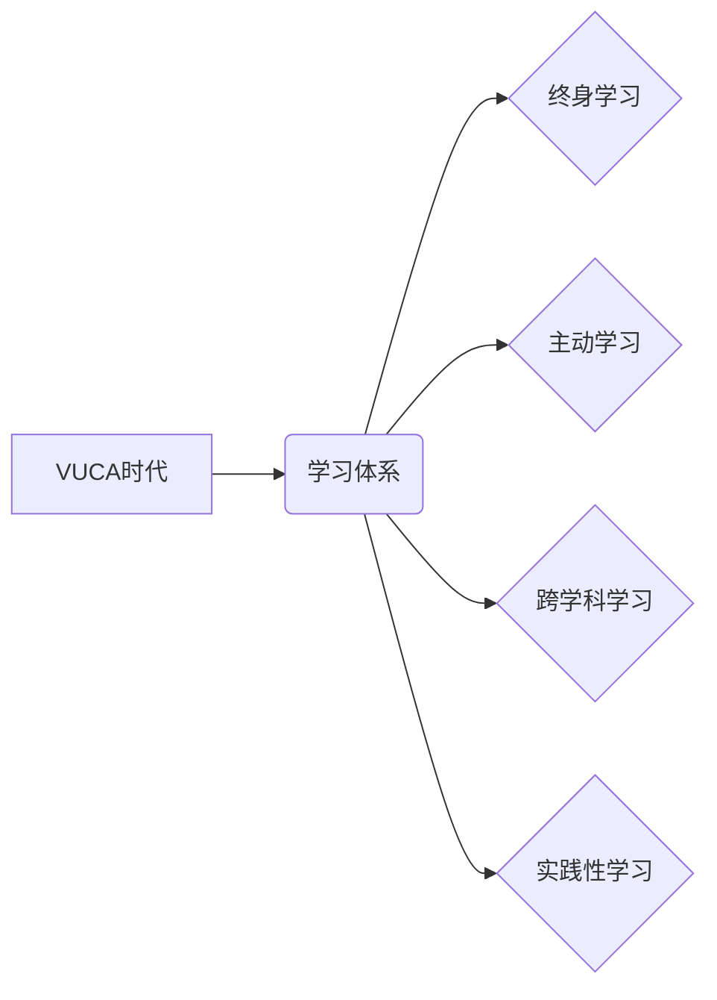

                 

## 学习体系：VUCA时代的重要技能

> 关键词：VUCA时代、学习体系、人工智能、编程、软件架构、数据分析、机器学习、深度学习

### 1. 背景介绍

当今世界正处于一个充满变革和不确定性的时代，被广泛称为VUCA时代。VUCA是一个首字母缩略词，代表着**V**olatility（波动性）、**U**ncertainty（不确定性）、**C**omplexity（复杂性）和**A**mbiguity（模糊性）。在这个时代，传统学习模式和技能体系已经难以适应快速变化的科技环境和市场需求。

VUCA时代对个人和组织提出了严峻的挑战，也为学习者和创新者带来了无限机遇。为了在VUCA时代立于不败之地，我们需要建立一个全新的学习体系，培养适应未来发展趋势的重要技能。

### 2. 核心概念与联系

**2.1 VUCA时代概述**

VUCA时代的特点是：

* **波动性:** 世界局势和市场环境变化迅速，难以预测。
* **不确定性:** 未来充满未知，难以把握方向。
* **复杂性:** 问题和挑战日益复杂，难以简单解决。
* **模糊性:** 信息和知识的边界越来越模糊，难以清晰界定。

**2.2 学习体系构建**

为了应对VUCA时代的挑战，我们需要构建一个灵活、高效、持续学习的体系，其核心概念包括：

* **终身学习:** 

学习不再是单一的阶段性活动，而是贯穿于整个生命周期。
* **主动学习:** 

学习者需要主动探索知识，而非被动接受信息。
* **跨学科学习:** 

不同学科之间的知识和技能相互关联，需要进行跨学科学习，才能获得更全面的理解。
* **实践性学习:** 

理论知识需要与实践相结合，才能真正掌握和应用。

**2.3  核心概念关系图**



### 3. 核心算法原理 & 具体操作步骤

**3.1 算法原理概述**

在VUCA时代，数据分析和机器学习算法成为重要的学习技能。这些算法能够帮助我们从海量数据中提取有价值的信息，洞察趋势，做出更明智的决策。

**3.2 算法步骤详解**

1. **数据收集:** 首先需要收集相关的数据，确保数据质量和代表性。
2. **数据预处理:** 对收集到的数据进行清洗、转换和特征工程，使其适合算法训练。
3. **模型选择:** 根据具体问题和数据特点选择合适的机器学习算法，例如线性回归、逻辑回归、决策树、支持向量机等。
4. **模型训练:** 使用训练数据训练选择的算法模型，调整模型参数，使其能够准确预测或分类。
5. **模型评估:** 使用测试数据评估模型的性能，例如准确率、召回率、F1-score等指标。
6. **模型部署:** 将训练好的模型部署到实际应用场景中，用于预测或分类新的数据。

**3.3 算法优缺点**

* **优点:** 能够自动学习数据模式，提高预测和分类精度，自动化处理海量数据。
* **缺点:** 需要大量数据进行训练，算法选择和参数调优需要专业知识，容易受到数据偏差的影响。

**3.4 算法应用领域**

* **金融:** 欺诈检测、风险评估、投资预测
* **医疗:** 疾病诊断、药物研发、患者风险预测
* **电商:** 商品推荐、用户画像、精准营销
* **交通:** 交通流量预测、驾驶辅助系统、自动驾驶

### 4. 数学模型和公式 & 详细讲解 & 举例说明

**4.1 数学模型构建**

机器学习算法通常基于数学模型，例如线性回归模型：

$$y = w_0 + w_1x_1 + w_2x_2 + ... + w_nx_n + \epsilon$$

其中：

* $y$ 是预测结果
* $w_0, w_1, w_2, ..., w_n$ 是模型参数
* $x_1, x_2, ..., x_n$ 是输入特征
* $\epsilon$ 是误差项

**4.2 公式推导过程**

模型参数的学习过程通常使用最小二乘法，目标是找到使误差平方和最小的参数值。

**4.3 案例分析与讲解**

假设我们想要预测房价，输入特征包括房屋面积、房间数量、地理位置等。我们可以使用线性回归模型，通过训练数据学习房价与这些特征之间的关系，最终得到一个预测房价的模型。

### 5. 项目实践：代码实例和详细解释说明

**5.1 开发环境搭建**

可以使用Python语言和相关的机器学习库，例如Scikit-learn，搭建开发环境。

**5.2 源代码详细实现**

```python
from sklearn.linear_model import LinearRegression
from sklearn.model_selection import train_test_split
import pandas as pd

# 加载数据
data = pd.read_csv('house_data.csv')

# 分割数据
X = data[['area', 'rooms', 'location']]
y = data['price']
X_train, X_test, y_train, y_test = train_test_split(X, y, test_size=0.2)

# 创建线性回归模型
model = LinearRegression()

# 训练模型
model.fit(X_train, y_train)

# 预测测试数据
y_pred = model.predict(X_test)

# 评估模型性能
from sklearn.metrics import mean_squared_error
mse = mean_squared_error(y_test, y_pred)
print(f'Mean Squared Error: {mse}')
```

**5.3 代码解读与分析**

这段代码首先加载房价数据，然后将数据分割成训练集和测试集。接着创建线性回归模型，并使用训练集训练模型。最后使用测试集预测房价，并计算模型的均方误差作为性能指标。

**5.4 运行结果展示**

运行结果会显示测试集的预测房价和实际房价之间的均方误差，可以用来评估模型的预测精度。

### 6. 实际应用场景

机器学习算法在各个领域都有广泛的应用场景，例如：

* **个性化推荐:**  电商平台根据用户的购买历史和浏览记录，推荐个性化的商品。
* **欺诈检测:**  银行和支付平台使用机器学习算法检测信用卡欺诈交易。
* **医疗诊断:**  医生可以使用机器学习算法辅助诊断疾病，提高诊断准确率。

### 6.4 未来应用展望

随着人工智能技术的不断发展，机器学习算法将在未来发挥更重要的作用，例如：

* **自动驾驶:**  机器学习算法将成为自动驾驶汽车的核心技术，实现车辆的自主决策和控制。
* **个性化教育:**  机器学习算法可以根据学生的学习进度和特点，提供个性化的学习方案。
* **药物研发:**  机器学习算法可以加速药物研发过程，帮助科学家发现新的药物和治疗方法。

### 7. 工具和资源推荐

**7.1 学习资源推荐**

* **在线课程:** Coursera、edX、Udacity等平台提供丰富的机器学习课程。
* **书籍:** 《机器学习》by Tom Mitchell，《深入理解机器学习》by 周志华。
* **博客和网站:**  Towards Data Science、Machine Learning Mastery等网站提供最新的机器学习资讯和教程。

**7.2 开发工具推荐**

* **Python:**  Python 是机器学习开发最常用的编程语言。
* **Scikit-learn:**  Scikit-learn 是 Python 的一个机器学习库，提供各种常用的机器学习算法和工具。
* **TensorFlow:**  TensorFlow 是 Google 开发的开源机器学习框架，支持深度学习。

**7.3 相关论文推荐**

* **《机器学习》by Tom Mitchell**
* **《深入理解机器学习》by 周志华**

### 8. 总结：未来发展趋势与挑战

**8.1 研究成果总结**

在VUCA时代，学习体系和人工智能技术的发展取得了显著成果，为解决复杂问题和应对挑战提供了新的思路和方法。

**8.2 未来发展趋势**

* **人工智能的持续发展:**  人工智能技术将继续发展，应用场景将更加广泛。
* **个性化学习的普及:**  个性化学习将成为主流的学习模式，帮助每个人根据自己的需求和特点进行学习。
* **跨学科学习的加强:**  不同学科之间的知识和技能将更加融合，形成新的学习体系。

**8.3 面临的挑战**

* **数据安全和隐私保护:**  随着人工智能技术的应用，数据安全和隐私保护问题将更加突出。
* **算法偏见和公平性:**  机器学习算法可能存在偏见，需要进行公平性评估和改进。
* **人才培养和技能缺口:**  人工智能技术发展需要大量的人才，需要加强人才培养和技能培训。

**8.4 研究展望**

未来研究将重点关注以下几个方面：

* **更安全、更可靠的人工智能算法**
* **更个性化、更有效的学习体系**
* **跨学科学习的创新模式**


### 9. 附录：常见问题与解答

**9.1 如何选择合适的机器学习算法？**

选择合适的机器学习算法需要根据具体问题和数据特点进行考虑。例如，对于分类问题，可以考虑使用逻辑回归、决策树、支持向量机等算法；对于回归问题，可以考虑使用线性回归、支持向量回归等算法。

**9.2 如何评估机器学习模型的性能？**

常用的机器学习模型性能评估指标包括准确率、召回率、F1-score、均方误差等。

**9.3 如何解决机器学习算法中的数据偏差问题？**

数据偏差问题可以通过以下方法解决：

* 使用更全面的数据进行训练
* 使用数据增强技术增加训练数据的数量和多样性
* 使用公平性评估方法检测和修正算法中的偏见


作者：禅与计算机程序设计艺术 / Zen and the Art of Computer Programming 
<end_of_turn>

