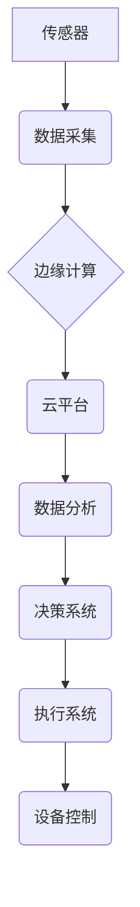

                 

## 工业物联网：智能制造和预测性维护

> 关键词：工业物联网、智能制造、预测性维护、传感器、数据分析、机器学习、云计算、边缘计算

## 1. 背景介绍

工业革命4.0的浪潮席卷全球，智能制造和数字化转型成为企业发展的关键驱动力。工业物联网（IIoT）作为连接工业设备、传感器和软件系统的核心技术，正在深刻地改变着制造业的面貌。IIoT通过收集和分析来自工业设备的实时数据，实现对生产过程的实时监控、优化和预测，从而提升生产效率、降低运营成本和提高产品质量。

传统制造业面临着诸多挑战，例如生产效率低下、设备故障率高、维护成本高、资源浪费严重等。IIoT的应用可以有效解决这些问题，实现智能化、自动化和可持续发展。

## 2. 核心概念与联系

**2.1 核心概念**

* **工业物联网（IIoT）：** 指将传感器、网络、云计算和数据分析技术应用于工业生产环境，实现设备互联、数据共享和智能决策的系统。
* **智能制造：** 通过数字化、网络化和智能化技术，实现生产过程的自动化、优化和智能化，提高生产效率、产品质量和资源利用率。
* **预测性维护：** 基于对设备运行数据的分析和预测，提前识别潜在故障，并采取措施进行预防性维护，避免设备停机和生产中断。

**2.2 架构**



**2.3 联系**

IIoT为智能制造提供了数据基础和技术支撑。通过传感器收集设备运行数据，边缘计算进行实时处理和分析，云平台提供数据存储和分析能力，数据分析系统识别趋势和异常，决策系统制定优化方案，执行系统控制设备运行，最终实现智能制造的目标。预测性维护是IIoT应用的重要场景之一，通过对设备运行数据的分析和预测，可以提前识别潜在故障，避免设备停机和生产中断，提高设备利用率和生产效率。

## 3. 核心算法原理 & 具体操作步骤

**3.1 算法原理概述**

预测性维护的核心算法主要包括：

* **时间序列分析：** 利用历史数据分析设备运行趋势，预测未来故障概率。
* **机器学习：** 利用机器学习算法从设备运行数据中学习特征，识别故障模式和预测故障时间。
* **深度学习：** 利用深度神经网络对复杂数据进行分析，提高故障预测的准确率。

**3.2 算法步骤详解**

1. **数据采集：** 从设备传感器收集运行数据，包括温度、压力、振动、电流等。
2. **数据预处理：** 对采集到的数据进行清洗、转换和特征提取，去除噪声和异常值，提取有用的特征信息。
3. **模型训练：** 选择合适的算法模型，利用历史数据进行模型训练，学习设备运行规律和故障模式。
4. **模型评估：** 利用测试数据评估模型的预测精度，调整模型参数以提高预测准确率。
5. **故障预测：** 将实时运行数据输入到训练好的模型中，预测未来故障概率和故障时间。
6. **决策执行：** 根据预测结果，制定相应的维护策略，例如提前更换易损部件、调整设备参数或进行预防性维护。

**3.3 算法优缺点**

* **时间序列分析：** 优点：简单易实现，计算量小。缺点：对数据趋势变化敏感，难以处理非线性关系。
* **机器学习：** 优点：能够学习复杂数据模式，预测精度较高。缺点：需要大量训练数据，模型训练时间长。
* **深度学习：** 优点：能够处理高维数据，预测精度更高。缺点：模型复杂度高，训练数据量大，计算资源需求高。

**3.4 算法应用领域**

* **工业设备故障预测：** 预防设备故障，降低停机时间和维修成本。
* **生产过程优化：** 分析生产数据，优化生产流程，提高生产效率。
* **能源管理：** 监测设备能源消耗，优化能源使用，降低能源成本。
* **质量控制：** 识别产品缺陷，提高产品质量。

## 4. 数学模型和公式 & 详细讲解 & 举例说明

**4.1 数学模型构建**

预测性维护模型通常基于统计学和机器学习方法，构建数学模型来描述设备运行状态和故障概率。

**4.2 公式推导过程**

例如，可以使用时间序列分析方法，构建ARIMA模型来预测设备故障时间。ARIMA模型的数学公式如下：

$$
y_t = c + \phi_1 y_{t-1} + \phi_2 y_{t-2} + ... + \phi_p y_{t-p} + \theta_1 \epsilon_{t-1} + \theta_2 \epsilon_{t-2} + ... + \theta_q \epsilon_{t-q} + \epsilon_t
$$

其中：

* $y_t$：时间t点的设备运行状态
* $c$：截距项
* $\phi_i$：自回归系数
* $y_{t-i}$：时间t-i点的设备运行状态
* $\theta_i$：移动平均系数
* $\epsilon_t$：随机误差项

**4.3 案例分析与讲解**

假设我们有一台机器的运行数据，包括每天的生产量和设备故障次数。我们可以使用ARIMA模型来预测未来设备故障次数。首先，我们需要对历史数据进行分析，确定ARIMA模型的参数值，例如p、d、q。然后，我们可以将模型应用于未来数据，预测未来设备故障次数。

## 5. 项目实践：代码实例和详细解释说明

**5.1 开发环境搭建**

* 操作系统：Linux或Windows
* Python版本：3.6以上
* 必要的库：pandas、numpy、scikit-learn、matplotlib等

**5.2 源代码详细实现**

```python
import pandas as pd
from sklearn.model_selection import train_test_split
from sklearn.linear_model import LinearRegression
from sklearn.metrics import mean_squared_error

# 加载数据
data = pd.read_csv('设备运行数据.csv')

# 数据预处理
# ...

# 划分训练集和测试集
X_train, X_test, y_train, y_test = train_test_split(data[['特征1', '特征2', ...]], data['故障次数'], test_size=0.2)

# 创建线性回归模型
model = LinearRegression()

# 训练模型
model.fit(X_train, y_train)

# 预测测试集结果
y_pred = model.predict(X_test)

# 评估模型性能
mse = mean_squared_error(y_test, y_pred)
print('均方误差:', mse)

# ...
```

**5.3 代码解读与分析**

* 代码首先加载设备运行数据，并进行数据预处理，例如缺失值处理、特征工程等。
* 然后，将数据划分成训练集和测试集，用于模型训练和评估。
* 选择线性回归模型作为预测模型，并使用训练集训练模型。
* 将训练好的模型应用于测试集，预测故障次数。
* 最后，使用均方误差等指标评估模型性能。

**5.4 运行结果展示**

运行结果将显示模型的预测精度，例如均方误差值。

## 6. 实际应用场景

**6.1 智能制造**

* **设备状态监控：** 实时监控设备运行状态，识别异常情况，及时进行维护。
* **生产过程优化：** 分析生产数据，优化生产流程，提高生产效率和产品质量。
* **质量控制：** 利用传感器数据识别产品缺陷，提高产品质量。

**6.2 预测性维护**

* **设备故障预测：** 预防设备故障，降低停机时间和维修成本。
* **维护计划优化：** 根据设备运行数据和故障预测结果，制定合理的维护计划，提高维护效率。
* **库存管理：** 预测设备易损部件需求，优化库存管理，降低库存成本。

**6.3 其他应用场景**

* **能源管理：** 监测设备能源消耗，优化能源使用，降低能源成本。
* **安全监控：** 利用传感器数据监测安全状况，及时预警潜在安全风险。
* **环境监测：** 监测环境参数，例如温度、湿度、气体浓度等，及时发现环境问题。

**6.4 未来应用展望**

随着物联网技术的不断发展，IIoT将在未来发挥更加重要的作用。例如：

* **边缘计算的应用将更加广泛：** 将数据处理和分析能力部署到设备附近，降低数据传输延迟，提高实时性。
* **人工智能技术的应用将更加深入：** 利用机器学习和深度学习算法，提高故障预测的准确率和智能化程度。
* **数据安全和隐私保护将更加重要：** 随着IIoT数据量的增加，数据安全和隐私保护将成为更加重要的挑战。

## 7. 工具和资源推荐

**7.1 学习资源推荐**

* **书籍：**
    * 《工业物联网：架构、应用和未来》
    * 《工业物联网：实践指南》
* **在线课程：**
    * Coursera: Industrial Internet of Things
    * edX: Industrial Internet of Things

**7.2 开发工具推荐**

* **数据采集工具：**
    * ThingSpeak
    * MQTT
* **数据分析工具：**
    * Apache Spark
    * Hadoop
* **云平台：**
    * AWS IoT
    * Azure IoT
    * Google Cloud IoT

**7.3 相关论文推荐**

* **工业物联网架构和标准：**
    * Industrial Internet Consortium (IIC)
* **预测性维护算法：**
    * "A Review of Predictive Maintenance Systems: Technologies, Applications and Future Trends"
    * "Deep Learning for Predictive Maintenance: A Survey"

## 8. 总结：未来发展趋势与挑战

**8.1 研究成果总结**

IIoT技术已经取得了显著的成果，在智能制造、预测性维护等领域得到了广泛应用。

**8.2 未来发展趋势**

* **边缘计算的普及：** 将数据处理和分析能力部署到设备附近，提高实时性。
* **人工智能技术的深度应用：** 利用机器学习和深度学习算法，提高故障预测的准确率和智能化程度。
* **数据安全和隐私保护的加强：** 随着IIoT数据量的增加，数据安全和隐私保护将成为更加重要的挑战。

**8.3 面临的挑战**

* **数据标准化和互操作性：** 不同设备和系统的数据格式不统一，导致数据互操作性差。
* **数据安全和隐私保护：** IIoT数据涉及到敏感信息，需要采取有效的安全措施保护数据安全和隐私。
* **技术人才短缺：** IIoT领域需要大量的技术人才，而目前人才供给不足。

**8.4 研究展望**

未来，IIoT技术将继续发展，并与其他新兴技术融合，例如区块链、5G等，为我们带来更加智能、高效和可持续的未来。


## 9. 附录：常见问题与解答

**9.1 如何选择合适的IIoT平台？**

选择IIoT平台需要考虑以下因素：

* **功能需求：** 平台是否支持您需要的功能，例如数据采集、存储、分析、可视化等。
* **平台规模：** 平台是否能够支持您的数据量和设备数量。
* **成本：** 平台的费用是否符合您的预算。
* **安全性：** 平台是否提供足够的安全性保障。

**9.2 如何保证IIoT数据的安全？**

IIoT数据安全需要从以下几个方面考虑：

* **数据加密：** 对传输和存储的数据进行加密，防止数据被窃取。
* **身份验证和授权：** 对访问IIoT系统的用户进行身份验证和授权，防止未授权用户访问数据。
* **数据备份和恢复：** 定期备份IIoT数据，并制定数据恢复计划，防止数据丢失。

**9.3 如何解决IIoT数据标准化问题？**

IIoT数据标准化需要行业共同努力，制定统一的数据标准和协议。

**作者：禅与计算机程序设计艺术 / Zen and the Art of Computer Programming**<end_of_turn>

