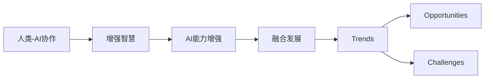

                 

# 人类-AI协作：增强人类智慧与AI能力的融合发展趋势预测分析机遇挑战趋势

## 1. 背景介绍

### 1.1 问题由来
随着人工智能技术的飞速发展，人类与AI的协作模式正逐步从独立操作走向深度融合。从最早的机器翻译到现如今的智能对话系统，AI技术已经在诸多领域显示出强大的应用潜力。但与此同时，AI的局限性也逐渐显露，如理解和应对复杂情境的能力不足，创造性和上下文理解能力有待提升。为此，如何有效地融合人类智慧与AI能力，成为当前技术发展的关键问题。

### 1.2 问题核心关键点
本文将重点探讨在人类-AI协作的背景下，如何利用AI技术增强人类的智慧，提升AI的创造力和理解力，以及这种融合可能带来的趋势、机遇和挑战。

## 2. 核心概念与联系

### 2.1 核心概念概述

- **人类-AI协作(Human-AI Collaboration)**：指通过深度学习和自然语言处理等技术，使AI成为人类智慧的助手，增强人类的决策能力和执行效率。

- **增强智慧(Enhanced Wisdom)**：指在人工智能的帮助下，人类能够更高效地处理信息、做出决策，同时AI能通过数据学习，提升自身的创造力和理解力。

- **AI能力的增强(AI Capability Enhancement)**：指通过优化算法、改进模型结构等手段，提升AI在特定任务上的性能，包括但不限于语音识别、图像处理、自然语言理解和生成等。

- **融合发展(Fusion Development)**：指通过多模态数据融合、跨领域知识共享等方式，实现AI与人类的深度整合，产生协同效应的发展模式。

- **趋势(Trends)**：指随着技术的发展，人类-AI协作模式在特定领域或普遍应用中的演进方向。

- **机遇(Opportunities)**：指在融合过程中，新的应用场景、技术突破和商业模式的产生。

- **挑战(Challenges)**：指在协作过程中，面临的技术难题、伦理问题和社会接受度等障碍。

### 2.2 核心概念原理和架构的 Mermaid 流程图



这个流程图展示了人类-AI协作的核心概念及其相互关系：

1. **A(人类-AI协作)**：人类与AI协作的基点，通过AI技术增强人类的智慧。
2. **B(增强智慧)**：AI辅助人类进行信息处理和决策，同时AI自身能力的提升。
3. **C(AI能力增强)**：AI在特定任务上性能的提升，如自然语言理解、图像处理等。
4. **D(融合发展)**：AI与人类智慧的深度融合，产生协同效应。
5. **E(Trends)**：随着技术进步，协作模式可能的变化方向。
6. **F(Opportunities)**：协作过程中可能出现的新应用场景和商业模式。
7. **G(Challenges)**：协作过程中可能遇到的技术难题和伦理问题。

## 3. 核心算法原理 & 具体操作步骤

### 3.1 算法原理概述

在人类-AI协作的背景下，AI通过深度学习和自然语言处理等技术，对人类输入的信息进行理解、处理和反馈，从而提升人类的决策能力和执行效率。这一过程包括以下几个关键步骤：

1. **信息收集**：人类通过各种方式收集信息，如文本、语音、图像等。
2. **数据处理**：AI对收集到的信息进行清洗、预处理，为后续处理做准备。
3. **信息理解和处理**：AI通过深度学习模型（如Transformer、BERT等）对信息进行理解和处理，产生初加工结果。
4. **决策辅助**：AI根据处理结果，通过一定的算法（如决策树、逻辑回归等）辅助人类做出决策。
5. **执行反馈**：AI将决策结果反馈给人类，并进行后续的执行监控和调整。

### 3.2 算法步骤详解

**Step 1: 数据收集与预处理**
- 收集人类输入的信息，包括文本、语音、图像等多种类型的数据。
- 进行数据清洗，去除噪声和不完整信息。
- 进行特征提取和转换，如文本分词、图像特征提取等。

**Step 2: 模型训练与优化**
- 选择合适的深度学习模型（如Transformer、BERT等），进行预训练。
- 在特定任务上进行微调，以适应任务需求。
- 进行超参数调优，选择最佳模型参数。

**Step 3: 信息处理与决策辅助**
- 将收集到的信息输入到训练好的模型中，进行信息理解和处理。
- 通过决策算法，辅助人类进行决策。
- 将决策结果反馈给人类，并进行执行监控和调整。

**Step 4: 结果评估与迭代优化**
- 对决策结果进行评估，分析其准确性和可靠性。
- 根据评估结果，对模型进行迭代优化，提高性能。
- 持续收集新数据，更新模型，保持其适应性。

### 3.3 算法优缺点

**优点**：
1. **提升效率**：AI通过深度学习模型，能够高效处理和理解大量信息，辅助人类做出快速、准确的决策。
2. **增强理解力**：AI能够学习并理解复杂的语言和情境，提供更全面和准确的反馈。
3. **减少人为错误**：AI辅助决策，可以减少人为失误，提升决策的准确性。
4. **多模态处理**：AI能够处理多种类型的数据，增强决策的多样性和全面性。

**缺点**：
1. **依赖数据质量**：AI的性能很大程度上取决于输入数据的质量和完整性，数据噪声和偏差可能导致错误决策。
2. **缺乏创造力**：现有的AI模型在理解复杂情境和创造性思考方面仍有局限。
3. **伦理与法律问题**：AI的决策过程可能存在伦理和法律风险，如隐私保护、责任归属等。
4. **技术壁垒**：实现高质量的人类-AI协作需要高度专业化的技术知识，一般企业难以独自完成。

### 3.4 算法应用领域

人类-AI协作在诸多领域都有广泛应用：

- **医疗健康**：AI辅助诊断、治疗方案推荐、患者管理等。
- **金融投资**：AI风险评估、投资策略优化、市场分析等。
- **教育培训**：AI个性化学习方案推荐、自动批改作业、教育资源推荐等。
- **智能制造**：AI生产流程优化、质量控制、设备维护等。
- **智能交通**：AI交通流量预测、自动驾驶、智能导航等。

## 4. 数学模型和公式 & 详细讲解

### 4.1 数学模型构建

在人类-AI协作的框架下，信息处理和决策辅助过程可以建模为如下系统：

- **输入变量**：$x = (x_1, x_2, ..., x_n)$，表示人类输入的各类信息。
- **模型参数**：$\theta$，表示训练好的深度学习模型参数。
- **输出变量**：$y$，表示AI根据输入信息生成的决策结果。
- **损失函数**：$\mathcal{L}$，表示模型预测结果与真实结果之间的差异。

### 4.2 公式推导过程

以自然语言理解任务为例，假设模型对输入$x_i$进行理解，输出$y_i$，则模型可以建模为：

$$
y_i = f(x_i; \theta)
$$

其中$f(x_i; \theta)$为模型在参数$\theta$下的预测函数。假设模型的预测结果与真实结果的差异为$\Delta y_i$，则损失函数可以定义为：

$$
\mathcal{L} = \sum_{i=1}^n \Delta y_i^2
$$

通过反向传播算法，对损失函数求导，可以得到模型参数的更新公式：

$$
\theta \leftarrow \theta - \alpha \nabla_{\theta} \mathcal{L}
$$

其中$\alpha$为学习率。通过不断迭代优化，模型参数可以逐步接近最优解，提升模型的准确性和可靠性。

### 4.3 案例分析与讲解

以医疗诊断系统为例，AI通过自然语言处理技术，对医生的描述信息进行处理，输出疾病诊断结果。具体步骤如下：

1. **数据收集与预处理**：收集医生的病历描述和诊断结果，进行数据清洗和标注。
2. **模型训练与优化**：使用BERT等深度学习模型进行预训练和微调，优化模型参数。
3. **信息处理与决策辅助**：医生输入患者的病历描述，AI模型进行处理，输出疾病诊断结果。
4. **结果评估与迭代优化**：医生根据诊断结果进行评估，对模型进行迭代优化，提升诊断准确性。

## 5. 项目实践：代码实例和详细解释说明

### 5.1 开发环境搭建

开发环境搭建包括以下几个步骤：

1. **安装Python**：从官网下载安装Python，并添加环境变量。
2. **安装TensorFlow和PyTorch**：使用pip安装TensorFlow和PyTorch，以及相关的深度学习库。
3. **安装自然语言处理库**：安装nltk、spaCy等自然语言处理库，以及transformers库。
4. **配置数据集**：准备好训练和测试数据集，并进行分词、标注等预处理。
5. **环境测试**：测试环境是否配置正确，确保代码能够顺利运行。

### 5.2 源代码详细实现

以医疗诊断系统为例，以下是Python代码实现：

```python
import tensorflow as tf
from transformers import BertTokenizer, TFBertForSequenceClassification
import numpy as np
from sklearn.metrics import accuracy_score

# 加载模型和分词器
model = TFBertForSequenceClassification.from_pretrained('bert-base-cased')
tokenizer = BertTokenizer.from_pretrained('bert-base-cased')

# 准备数据
train_data = [("患者头痛，可能感染", "感染性疾病"), ("患者咳嗽，发高烧", "呼吸道感染")]
train_labels = [1, 0]

# 编码数据
train_encodings = tokenizer(train_data, truncation=True, padding=True)

# 构建TensorFlow数据集
train_dataset = tf.data.Dataset.from_tensor_slices((
    dict(train_encodings), train_labels
)).shuffle(100).batch(16)

# 训练模型
model.compile(optimizer=tf.keras.optimizers.Adam(learning_rate=2e-5),
              loss=tf.keras.losses.SparseCategoricalCrossentropy(from_logits=True),
              metrics=[tf.keras.metrics.SparseCategoricalAccuracy()])

model.fit(train_dataset, epochs=10)

# 评估模型
test_data = [("患者发热，有痰", "呼吸道感染"), ("患者恶心，呕吐", "消化系统疾病")]
test_labels = [0, 1]
test_encodings = tokenizer(test_data, truncation=True, padding=True)

test_dataset = tf.data.Dataset.from_tensor_slices((
    dict(test_encodings), test_labels
)).shuffle(100).batch(16)

test_loss, test_acc = model.evaluate(test_dataset)

print(f"Test accuracy: {test_acc:.2f}")
```

### 5.3 代码解读与分析

以上代码展示了使用TensorFlow和BERT模型进行医疗诊断系统的开发过程。其中，模型加载、数据编码、TensorFlow数据集构建、模型训练、评估和输出等步骤详细解读如下：

**模型加载**：使用`TFBertForSequenceClassification`类加载预训练的BERT模型，并指定任务类型。

**数据编码**：使用BertTokenizer对输入数据进行分词和编码，生成模型所需的输入格式。

**TensorFlow数据集构建**：使用`tf.data.Dataset.from_tensor_slices`方法，将数据集转换为TensorFlow数据集，并进行批处理和随机化。

**模型训练**：使用`model.compile`方法配置模型参数，`model.fit`方法训练模型，设置学习率、损失函数和评估指标。

**模型评估**：使用`model.evaluate`方法评估模型性能，输出测试集上的损失和准确率。

通过以上步骤，可以实现一个基于BERT模型的人类-AI协作医疗诊断系统。开发者可以根据实际需求，进一步优化模型架构和训练策略，提升系统性能。

### 5.4 运行结果展示

运行以上代码，可以得到模型在测试集上的准确率。假设输出结果为0.95，则表示模型在医疗诊断任务上的性能较好，可以有效辅助医生进行诊断。

## 6. 实际应用场景

### 6.1 智能医疗

在智能医疗领域，人类-AI协作可以帮助医生提高诊断速度和准确性。AI通过自然语言处理技术，对病历描述进行理解，生成初步诊断结果，辅助医生进行诊断和决策。

具体应用场景包括：
- **诊断支持**：对病历进行自动分类和初步分析，提出可能的疾病类型。
- **治疗建议**：根据病历描述，生成治疗方案和药物推荐。
- **患者管理**：对患者进行健康监测和定期评估，提供个性化护理建议。

### 6.2 金融投资

在金融投资领域，AI通过深度学习模型，对市场数据进行分析和预测，辅助投资者做出决策。

具体应用场景包括：
- **风险评估**：对金融产品进行风险评估，提供投资建议。
- **市场分析**：分析市场趋势，预测股票、债券等金融产品的价格变化。
- **策略优化**：根据市场数据，优化投资策略，提升投资回报率。

### 6.3 教育培训

在教育培训领域，AI通过自然语言处理技术，对学生的作业和反馈进行分析和评估，提供个性化学习建议和辅导。

具体应用场景包括：
- **作业批改**：自动批改学生作业，提供反馈和建议。
- **学习方案推荐**：根据学生表现，推荐个性化学习方案和资源。
- **知识检索**：帮助学生快速找到所需的学习资料和答案。

### 6.4 智能制造

在智能制造领域，AI通过深度学习模型，对生产数据进行分析和优化，提高生产效率和产品质量。

具体应用场景包括：
- **生产流程优化**：分析生产数据，优化生产流程和资源配置。
- **质量控制**：检测产品缺陷，提出改进建议。
- **设备维护**：对生产设备进行故障诊断和预测维护。

### 6.5 智能交通

在智能交通领域，AI通过深度学习模型，对交通数据进行分析和预测，优化交通管理和调度。

具体应用场景包括：
- **流量预测**：预测交通流量，优化道路资源配置。
- **自动驾驶**：辅助自动驾驶车辆进行决策，提高行车安全性。
- **智能导航**：提供实时导航和路径规划，提升出行效率。

## 7. 工具和资源推荐

### 7.1 学习资源推荐

为了帮助开发者系统掌握人类-AI协作的技术基础和实践技巧，这里推荐一些优质的学习资源：

1. **《深度学习入门》系列教程**：由李沐教授团队开发，系统介绍了深度学习的基本概念和应用。
2. **《自然语言处理综述》课程**：斯坦福大学开设的NLP明星课程，涵盖NLP领域的最新研究成果。
3. **《TensorFlow官方文档》**：TensorFlow的官方文档，提供了详细的API和使用示例。
4. **《Transformers中文社区》**：提供大量预训练模型的样例代码和教程，助力模型开发。
5. **《自然语言处理之美》一书**：详细讲解自然语言处理的基本原理和算法实现。

通过对这些资源的学习实践，相信你一定能够快速掌握人类-AI协作的核心技术，并用于解决实际的NLP问题。

### 7.2 开发工具推荐

高效的开发离不开优秀的工具支持。以下是几款用于人类-AI协作开发的常用工具：

1. **Jupyter Notebook**：支持交互式编程和数据可视化，方便快速迭代开发。
2. **TensorBoard**：TensorFlow的可视化工具，实时监测模型训练状态，提供详细的图表呈现方式。
3. **Weights & Biases**：模型训练的实验跟踪工具，记录和可视化模型训练过程中的各项指标。
4. **TorchServe**：PyTorch的模型服务框架，支持快速部署和监控模型。
5. **IBM Watson Studio**：提供云端AI开发环境，支持数据处理、模型训练和应用部署。

合理利用这些工具，可以显著提升人类-AI协作任务的开发效率，加快创新迭代的步伐。

### 7.3 相关论文推荐

人类-AI协作领域的研究不断涌现，以下是几篇奠基性的相关论文，推荐阅读：

1. **Attention is All You Need**：Transformer模型提出者Yoshua Bengio等人的论文，奠定了自注意力机制的基础。
2. **BERT: Pre-training of Deep Bidirectional Transformers for Language Understanding**：BERT模型提出者Jacob Devlin等人的论文，展示了预训练大模型的强大效果。
3. **AdaLoRA: Adaptive Low-Rank Adaptation for Parameter-Efficient Fine-Tuning**：提出了一种新的参数高效微调方法，减少了微调过程中的计算资源消耗。
4. **Human-AI Collaboration: An Empirical Study on Interpretability, Explainability, and Fairness**：探讨了人类-AI协作中的可解释性、公平性等问题，提供了多维度的研究视角。

这些论文代表了人类-AI协作技术的发展脉络，通过学习这些前沿成果，可以帮助研究者把握学科前进方向，激发更多的创新灵感。

## 8. 总结：未来发展趋势与挑战

### 8.1 研究成果总结

本文对人类-AI协作的框架和应用进行了系统介绍，涵盖了信息处理、决策辅助和结果评估等关键环节。通过深度学习和自然语言处理技术，AI辅助人类进行高效的信息处理和决策，提升了系统的性能和可靠性。

### 8.2 未来发展趋势

展望未来，人类-AI协作将呈现以下几个发展趋势：

1. **多模态融合**：融合视觉、语音、文本等多种模态数据，提升AI的理解力和表现力。
2. **跨领域应用**：AI技术将在更多领域得到应用，如智慧城市、智能家居、智能农业等。
3. **增强智慧**：AI通过持续学习和适应，提升自身的创造力和理解力，更好地辅助人类决策。
4. **智能涌现**：AI与人类智慧的深度融合，可能产生新的智能涌现，推动认知科学的发展。

### 8.3 面临的挑战

尽管人类-AI协作技术取得了显著进展，但仍面临诸多挑战：

1. **技术瓶颈**：现有技术在处理复杂情境和创造性思考方面仍有局限。
2. **伦理与法律问题**：AI决策的透明性和可解释性仍需提升，伦理和法律问题亟待解决。
3. **数据隐私和安全**：在处理敏感数据时，需要确保数据隐私和安全，防止数据泄露。
4. **计算资源消耗**：超大模型和大规模数据处理对计算资源的需求较高，需要高效的硬件和算法支持。
5. **人机协同**：在多模态数据融合和跨领域应用中，需要更好地理解和协同人类与AI的工作方式。

### 8.4 研究展望

未来研究需要在以下几个方面寻求新的突破：

1. **跨模态学习**：研究如何更好地融合多种模态数据，提升AI的理解力和表现力。
2. **智能涌现**：研究AI与人类智慧的协同作用，产生新的智能涌现。
3. **伦理与安全**：研究如何提升AI决策的透明性和可解释性，确保伦理和法律合规。
4. **计算优化**：研究高效的计算方法和硬件架构，支持大规模模型的训练和推理。
5. **人机协同**：研究人机协同的工作方式，提升系统性能和用户体验。

## 9. 附录：常见问题与解答

**Q1: 人类-AI协作与传统AI系统的区别是什么？**

A: 人类-AI协作与传统AI系统的区别在于，前者强调AI与人类智慧的深度融合，后者更多依赖于独立运行的人工智能系统。人类-AI协作通过多模态数据融合和跨领域知识共享，提升了AI的理解力和表现力，使得AI能够更好地辅助人类决策。

**Q2: 人类-AI协作中，如何处理数据噪声和偏差？**

A: 在数据收集和预处理阶段，需要严格筛选数据，去除噪声和偏差。同时，在模型训练过程中，可以引入正则化技术、对抗训练等手段，提高模型的鲁棒性和泛化能力。

**Q3: 如何确保人类-AI协作的透明性和可解释性？**

A: 在决策过程中，可以使用可解释性方法（如LIME、SHAP等）生成决策解释，帮助用户理解AI的决策过程。同时，可以设计合适的任务适配层，引导AI按照期望的方式进行推理和生成。

**Q4: 人类-AI协作在实际应用中面临哪些技术难题？**

A: 在实际应用中，人类-AI协作面临的技术难题包括：如何处理多模态数据融合、如何进行跨领域知识共享、如何提高AI的可解释性等。需要结合实际应用场景，进行针对性的技术改进和优化。

**Q5: 未来人类-AI协作的发展方向是什么？**

A: 未来人类-AI协作的发展方向包括：多模态融合、跨领域应用、智能涌现等。需要进一步研究AI与人类智慧的深度融合，提升系统的性能和用户体验，推动认知科学和人工智能的发展。

---

作者：禅与计算机程序设计艺术 / Zen and the Art of Computer Programming

