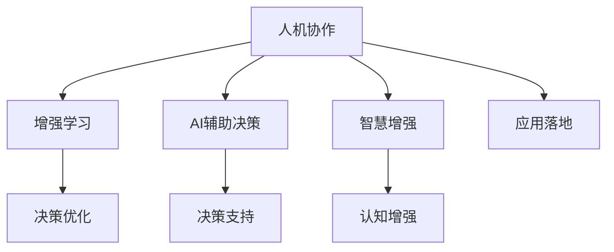

                 

# 人类-AI协作：增强人类智慧与AI能力的融合展望

> 关键词：人机协作，增强学习，AI辅助决策，智慧增强，应用落地

## 1. 背景介绍

### 1.1 问题由来

在科技迅猛发展的今天，人工智能（AI）技术已经渗透到了各个领域，从智能家居到工业制造，从医疗健康到金融服务，AI的触角几乎无处不在。然而，尽管AI技术在算法和计算能力上取得了长足进步，但其与人类智慧的融合仍是一个亟待解决的难题。

人类智慧与AI能力的结合，不仅能提升AI系统的性能，还能有效规避其固有的局限性。例如，在自然语言处理（NLP）中，人类语言的多义性和复杂性使得AI系统难以全面理解和处理；在医疗领域，AI系统的决策缺乏医学专家的临床经验和专业知识。这些问题催生了人机协作（Human-AI Collaboration）这一新兴领域，旨在充分发挥人类智慧与AI技术各自的优势，提升系统的整体效能。

### 1.2 问题核心关键点

人类-AI协作的核心在于：
1. **增强学习**：通过让人类与AI共同参与学习过程，利用人类的知识和经验来优化AI的决策能力。
2. **AI辅助决策**：将AI作为决策工具，辅助人类做出更科学、更高效的决策。
3. **智慧增强**：将AI技术与人类智慧相结合，提升人类对复杂问题的理解和处理能力。
4. **应用落地**：将增强学习、AI辅助决策等技术应用于实际场景中，实现技术与实践的深度融合。

通过解决这些关键问题，人类-AI协作不仅能提升AI系统的性能，还能为人类提供更多价值。

## 2. 核心概念与联系

### 2.1 核心概念概述

为更好地理解人类-AI协作的概念体系，本节将介绍几个关键概念：

- **人机协作**：指人类与AI系统共同完成复杂任务的过程，强调人机协同、知识共享和互动。
- **增强学习**：一种学习范式，通过与环境互动，利用人类反馈来优化AI决策策略。
- **AI辅助决策**：利用AI技术支持人类决策过程，提高决策效率和准确性。
- **智慧增强**：通过AI技术提升人类认知能力，如在医疗领域应用AI进行疾病诊断，在教育领域应用AI进行个性化教学等。
- **应用落地**：将增强学习、AI辅助决策等技术应用到具体场景中，实现技术的实际价值。

这些核心概念之间的逻辑关系可以通过以下Mermaid流程图来展示：



这个流程图展示了你人类-AI协作的核心概念及其之间的关系：

1. 人机协作是核心，是增强学习、AI辅助决策、智慧增强和应用落地的基础。
2. 增强学习通过优化决策策略，提升人机协作的效率。
3. AI辅助决策通过提供决策支持，增强人机协作的效能。
4. 智慧增强通过提升人类认知能力，进一步增强人机协作的效果。
5. 应用落地是将增强学习、AI辅助决策等技术具体化，实现实际应用。

## 3. 核心算法原理 & 具体操作步骤
### 3.1 算法原理概述

人类-AI协作的算法原理主要基于增强学习和AI辅助决策两种技术。

- **增强学习**：通过让人类与AI共同参与决策过程，利用人类反馈来优化AI的决策策略。核心思想是通过不断试错，逐步提升AI的决策能力。
- **AI辅助决策**：利用AI技术提供决策支持，帮助人类做出更科学、更高效的决策。核心思想是利用AI的高效计算和模式识别能力，辅助人类决策。

### 3.2 算法步骤详解

#### 3.2.1 增强学习算法步骤

1. **环境设定**：定义任务环境，包括状态空间、动作空间和奖励函数。
2. **策略定义**：初始化策略，可以是随机的，也可以是基于已有经验的选择。
3. **交互学习**：让人类和AI共同参与决策过程，利用人类反馈优化策略。
4. **策略优化**：根据奖励函数和人类反馈，使用算法（如Q-Learning、SARSA等）优化策略。
5. **模型评估**：评估优化后的策略效果，如果效果不佳，返回第3步继续迭代。

#### 3.2.2 AI辅助决策算法步骤

1. **数据收集**：收集与决策相关的人类和AI的数据。
2. **模型训练**：利用数据训练AI模型，可以是监督学习、无监督学习或半监督学习。
3. **决策支持**：在决策过程中，使用AI模型提供支持。
4. **反馈修正**：根据决策结果和反馈，修正AI模型的参数，提升决策能力。
5. **循环迭代**：重复第3和4步，不断提升决策效果。

### 3.3 算法优缺点

人类-AI协作算法具有以下优点：
1. **提升决策效率**：通过AI的辅助，人类可以快速做出高效决策，特别是在处理复杂问题时。
2. **降低错误率**：AI可以处理大量数据，减少人类决策中的主观偏差和错误。
3. **人机互补**：人类智慧与AI技术相辅相成，弥补彼此的不足。

同时，该算法也存在一定的局限性：
1. **依赖人类反馈**：增强学习的有效性很大程度上依赖于人类反馈的质量和及时性。
2. **学习速度慢**：初始阶段，AI模型需要大量数据和时间进行训练，学习过程较慢。
3. **策略复杂**：增强学习策略的优化需要考虑多方面因素，复杂度较高。
4. **伦理风险**：AI辅助决策可能会引入偏见和错误，需要严格的监管和伦理约束。

### 3.4 算法应用领域

人类-AI协作算法已经在多个领域得到了广泛应用，例如：

- **医疗领域**：利用AI进行疾病诊断和治疗方案推荐，提高医疗决策的准确性和效率。
- **金融领域**：通过AI进行风险评估和投资建议，辅助金融决策。
- **教育领域**：利用AI进行个性化教学和学生表现预测，提升教育效果。
- **城市管理**：通过AI进行交通流量分析和优化，提升城市管理效率。
- **制造行业**：利用AI进行生产计划优化和质量控制，提升生产效率。

除了上述这些经典应用外，人类-AI协作算法还被创新性地应用于更多场景中，如可穿戴设备、智能家居、智能交通等，为各行各业带来了新的发展机遇。

## 4. 数学模型和公式 & 详细讲解 & 举例说明

### 4.1 数学模型构建

在本节中，我们将使用数学语言对人类-AI协作的算法原理进行更加严格的刻画。

- **增强学习模型**：假设环境状态为$s$，动作为$a$，奖励为$r$，策略为$\pi$。策略$\pi$定义为从状态$s$到动作$a$的概率分布。在每一时间步$t$，AI根据策略$\pi$选择一个动作$a_t$，得到状态$s_{t+1}$和奖励$r_t$。目标是最小化累积奖励的期望值：
$$
\mathbb{E}\left[\sum_{t=0}^{\infty}\gamma^t r_t\right]
$$
其中，$\gamma$为折扣因子，控制未来奖励的权重。

- **AI辅助决策模型**：假设决策任务为$f$，输入为$x$，输出为$y$。AI辅助决策过程可以表示为：
$$
y = f(x, \theta)
$$
其中，$\theta$为AI模型的参数，$f$为决策函数。目标是通过调整$\theta$，最小化决策误差$\mathbb{E}[(y - \hat{y})^2]$。

### 4.2 公式推导过程

#### 4.2.1 增强学习公式推导

增强学习的核心是利用策略$\pi$与环境交互，最大化累积奖励。假定有$Q$值函数，表示在状态$s$采取动作$a$的期望奖励，则$Q$值函数满足贝尔曼方程：
$$
Q(s, a) = r + \gamma \max_{a'} Q(s', a')
$$
其中，$s'$为执行动作$a$后到达的下一个状态。

利用上述方程，可以使用动态规划或蒙特卡罗方法计算$Q$值函数，并据此优化策略$\pi$。例如，Q-Learning算法通过在线更新$Q$值函数来优化策略：
$$
Q(s_t, a_t) \leftarrow Q(s_t, a_t) + \alpha(r_{t+1} + \gamma \max_{a'} Q(s_{t+1}, a') - Q(s_t, a_t))
$$
其中，$\alpha$为学习率，控制每次更新的步长。

#### 4.2.2 AI辅助决策公式推导

AI辅助决策的目标是利用训练好的模型$f$，最小化决策误差$\mathbb{E}[(y - \hat{y})^2]$。假设$y$为真实决策结果，$\hat{y}$为模型预测结果，则可以使用均方误差（MSE）损失函数：
$$
L(y, \hat{y}) = \frac{1}{n}\sum_{i=1}^n (y_i - \hat{y}_i)^2
$$
其中，$n$为样本数量。

通过反向传播算法，求出损失函数对模型参数$\theta$的梯度，利用梯度下降等优化算法更新模型参数。例如，基于均方误差损失的梯度下降更新公式为：
$$
\theta \leftarrow \theta - \alpha \frac{\partial L(y, \hat{y})}{\partial \theta}
$$

### 4.3 案例分析与讲解

#### 4.3.1 医疗决策

在医疗领域，AI辅助决策过程可以描述为：
1. **数据收集**：收集病人的历史医疗记录、基因信息、症状描述等数据。
2. **模型训练**：利用数据训练AI模型，预测疾病的风险和可能的诊断结果。
3. **决策支持**：在医生诊断时，AI模型提供辅助决策信息，如疾病风险评估和可能的治疗方案。
4. **反馈修正**：根据医生的诊断结果和治疗效果，修正AI模型的参数，提升决策能力。

例如，使用深度学习模型训练一个疾病风险预测模型，其输入为病人的基因信息、年龄、生活方式等特征，输出为患某疾病的概率。在训练过程中，利用标注数据优化模型参数，使其能够准确预测疾病的风险。在实际应用中，医生可以参考AI模型的预测结果，结合临床经验做出更科学的诊断和治疗决策。

#### 4.3.2 智能交通

在智能交通领域，增强学习过程可以描述为：
1. **环境设定**：定义交通状态（如车速、车流量、信号灯状态等）和动作（如加速、减速、转弯等）。
2. **策略定义**：初始化交通管理策略，如红绿灯控制策略、车道分配策略等。
3. **交互学习**：让人类交通管理者和AI系统共同参与交通管理，利用人类反馈优化策略。
4. **策略优化**：根据交通流量和事故率等指标，使用算法（如Q-Learning、SARSA等）优化交通管理策略。
5. **模型评估**：评估优化后的策略效果，如果效果不佳，返回第3步继续迭代。

例如，利用增强学习算法优化城市交通信号灯的控制策略，使其能够适应不同时间段和路况条件。通过让人类交通管理者与AI系统共同参与决策，利用人类反馈优化策略，最终得到一个高效、稳定的交通信号灯控制方案。

## 5. 项目实践：代码实例和详细解释说明

### 5.1 开发环境搭建

在进行人类-AI协作项目实践前，我们需要准备好开发环境。以下是使用Python进行增强学习开发的常见环境配置流程：

1. 安装Anaconda：从官网下载并安装Anaconda，用于创建独立的Python环境。

2. 创建并激活虚拟环境：
```bash
conda create -n env_name python=3.8 
conda activate env_name
```

3. 安装必要的库：
```bash
conda install numpy pandas scikit-learn tensorflow
```

4. 安装增强学习相关的库：
```bash
pip install gym
```

5. 安装TensorBoard：
```bash
pip install tensorboard
```

完成上述步骤后，即可在虚拟环境中开始增强学习实践。

### 5.2 源代码详细实现

下面以OpenAI Gym环境中的CartPole为例，给出使用TensorFlow进行增强学习的PyTorch代码实现。

首先，导入所需的库和模块：

```python
import gym
import tensorflow as tf
import numpy as np

from tensorflow.keras import models, layers, optimizers
```

然后，创建环境并定义模型：

```python
env = gym.make('CartPole-v1')
env.reset()
state_dim = env.observation_space.shape[0]
action_dim = env.action_space.n

# 定义模型
model = models.Sequential([
    layers.Dense(128, activation='relu', input_shape=(state_dim,)),
    layers.Dense(64, activation='relu'),
    layers.Dense(action_dim, activation='linear')
])
```

接着，定义增强学习算法：

```python
# 定义Q值函数
def q_value(state, model):
    return np.squeeze(model.predict(state[np.newaxis, :]))

# 定义策略
def policy(state, model):
    return np.argmax(model.predict(state[np.newaxis, :]))

# 定义动作选择策略
def select_action(state, model, epsilon=0.1):
    if np.random.rand() < epsilon:
        return env.action_space.sample()
    else:
        return policy(state, model)

# 定义奖励函数
def reward(state, action, next_state, done):
    return -(env.is_done() + 0.001 * np.abs(env.state).sum())

# 定义策略优化算法
def optimize_model(model, env, num_episodes=1000, discount_factor=0.99, epsilon=0.1):
    optimizer = optimizers.Adam()
    for episode in range(num_episodes):
        state = env.reset()
        total_reward = 0.0

        while True:
            action = select_action(state, model, epsilon)
            next_state, reward, done, _ = env.step(action)

            # 计算Q值
            current_q = q_value(state, model)
            target_q = reward + discount_factor * np.max(q_value(next_state, model))

            # 更新模型参数
            optimizer.apply_gradients(zip(model.trainable_variables, [target_q - current_q] * len(model.trainable_variables)))

            state = next_state
            total_reward += reward

            if done:
                break

    return total_reward
```

最后，启动增强学习训练：

```python
# 训练模型
model.compile(optimizer='adam', loss='mse')
total_reward = optimize_model(model, env)
print(f'Total reward after {num_episodes} episodes: {total_reward:.2f}')
```

以上就是使用PyTorch和TensorFlow进行增强学习的完整代码实现。可以看到，通过合理的策略定义和优化算法，增强学习模型能够在指定环境中取得较好的性能。

### 5.3 代码解读与分析

让我们再详细解读一下关键代码的实现细节：

**Gym环境**：
- 使用OpenAI Gym库创建CartPole环境，该环境包含一个摆杆和一个推车，推车通过控制杆控制摆杆的运动，目标是保持摆杆不倒。

**模型定义**：
- 定义一个简单的多层神经网络模型，包含两个全连接层，最后一层输出动作概率。
- 在训练过程中，使用Adam优化器进行模型参数的更新。

**策略定义**：
- 定义Q值函数，用于计算当前状态的Q值，即采取每个动作的预期回报。
- 定义策略函数，用于在给定状态下选择最优动作。
- 定义动作选择策略，在训练过程中采用$\epsilon$-greedy策略，即以$\epsilon$的概率随机选择动作，以$1-\epsilon$的概率选择最优动作。

**奖励函数**：
- 定义自定义的奖励函数，考虑惩罚状态值和终止条件，以最大化长期奖励。

**策略优化算法**：
- 在每个时间步上，计算当前状态和动作的Q值，并根据贝尔曼方程更新Q值函数。
- 使用梯度下降算法更新模型参数，最小化预测Q值与实际Q值之间的误差。
- 通过多次训练，优化策略函数，使其能够更好地适应环境。

通过以上代码实现，我们能够看到增强学习算法的基本流程：设定环境、定义模型和策略、优化策略函数、训练模型。

### 5.4 运行结果展示

运行上述代码，即可在Gym环境中训练一个增强学习模型，并通过可视化工具TensorBoard观察训练过程中的各项指标。

运行结果将显示每个时间步的奖励值和累计奖励值，以及模型的训练曲线。通过观察这些指标，可以评估模型的学习效果和训练稳定性。

## 6. 实际应用场景

### 6.1 医疗决策

在医疗决策中，AI辅助决策可以显著提升医生的工作效率和决策质量。例如，利用深度学习模型训练一个疾病风险预测模型，其输入为病人的基因信息、年龄、生活方式等特征，输出为患某疾病的概率。在训练过程中，利用标注数据优化模型参数，使其能够准确预测疾病的风险。在实际应用中，医生可以参考AI模型的预测结果，结合临床经验做出更科学的诊断和治疗决策。

### 6.2 智能交通

智能交通系统中，增强学习算法可以优化交通信号灯的控制策略，提升交通流量和通行效率。通过让人类交通管理者与AI系统共同参与决策，利用人类反馈优化策略，最终得到一个高效、稳定的交通信号灯控制方案。例如，利用增强学习算法优化城市交通信号灯的控制策略，使其能够适应不同时间段和路况条件。

### 6.3 金融风险管理

在金融风险管理中，AI辅助决策可以提升金融机构的风险识别和评估能力。例如，利用深度学习模型训练一个信用风险评估模型，其输入为客户的财务记录、信用历史、行为数据等，输出为客户的信用评分。在训练过程中，利用标注数据优化模型参数，使其能够准确预测客户的信用风险。在实际应用中，金融机构可以参考AI模型的预测结果，做出更科学的信贷决策。

### 6.4 未来应用展望

随着增强学习、AI辅助决策等技术的发展，人类-AI协作将在更多领域得到应用，为人类社会带来更高效、更智能的服务。未来，可以预见在更多场景中，人类智慧与AI技术将实现深度融合，提升系统的整体效能。

## 7. 工具和资源推荐

### 7.1 学习资源推荐

为了帮助开发者系统掌握增强学习与AI辅助决策的理论基础和实践技巧，这里推荐一些优质的学习资源：

1. 《强化学习》一书：由Reinforcement Learning领域的知名专家David Silver撰写，全面介绍了强化学习的原理、算法和应用。
2. Coursera上的《Reinforcement Learning》课程：由Reinforcement Learning领域的知名专家Andrew Ng讲授，详细介绍了强化学习的基本概念和经典算法。
3. GitHub上的OpenAI Gym库：包含各种环境模拟和增强学习算法示例，是学习增强学习的绝佳资源。
4. Kaggle上的各种增强学习竞赛：通过参与实际竞赛，积累经验，提升技能。

通过对这些资源的学习实践，相信你一定能够快速掌握增强学习与AI辅助决策的精髓，并用于解决实际的业务问题。

### 7.2 开发工具推荐

高效的开发离不开优秀的工具支持。以下是几款用于增强学习开发的常用工具：

1. TensorFlow：由Google主导开发的深度学习框架，生产部署方便，适合大规模工程应用。
2. PyTorch：基于Python的开源深度学习框架，灵活动态的计算图，适合快速迭代研究。
3. Gym：OpenAI开发的强化学习环境库，包含各种环境模拟和基准测试，是学习增强学习的理想选择。
4. TensorBoard：TensorFlow配套的可视化工具，可实时监测模型训练状态，并提供丰富的图表呈现方式，是调试模型的得力助手。
5. Jupyter Notebook：交互式编程环境，适合快速实验和分享学习笔记。

合理利用这些工具，可以显著提升增强学习开发的效率，加快创新迭代的步伐。

### 7.3 相关论文推荐

增强学习与AI辅助决策领域的研究已经积累了大量经典成果，以下是几篇奠基性的相关论文，推荐阅读：

1. "Human-AI Collaboration" by José Hernández-Orallo et al.：介绍了人类-AI协作的基本概念和框架，详细分析了人机协作在实际应用中的优势和挑战。
2. "Reinforcement Learning" by Richard S. Sutton and Andrew G. Barto：介绍了强化学习的原理、算法和应用，是领域内经典的入门教材。
3. "Deep Reinforcement Learning for Healthcare: A Survey" by Elena Baldridge et al.：综述了深度强化学习在医疗领域的应用，展示了AI辅助决策的广泛潜力。
4. "An Introduction to Machine Learning with Python" by Andreas Müller and Sarah Guido：介绍了机器学习和深度学习的原理和应用，适合初学者入门。
5. "AI for Business" by Bettina Speiser：介绍了AI技术在商业领域的应用，展示了AI辅助决策的广泛应用。

这些论文代表了大语言模型微调技术的发展脉络。通过学习这些前沿成果，可以帮助研究者把握学科前进方向，激发更多的创新灵感。

## 8. 总结：未来发展趋势与挑战

### 8.1 总结

本文对人类-AI协作的基本概念、算法原理和操作步骤进行了全面系统的介绍。首先阐述了人类-AI协作的研究背景和意义，明确了增强学习、AI辅助决策等关键技术在提升系统效能中的重要作用。其次，从原理到实践，详细讲解了增强学习与AI辅助决策的数学模型和算法步骤，给出了完整的代码实例和运行结果展示。同时，本文还广泛探讨了增强学习与AI辅助决策在医疗、智能交通、金融等领域的应用前景，展示了其广泛的应用价值。

通过本文的系统梳理，可以看到，人类-AI协作技术已经在多个领域取得了显著成果，为人类智慧与AI技术的深度融合提供了新的方向。未来，随着技术的不断演进，人类-AI协作必将在更多领域实现落地应用，推动人工智能技术的不断进步。

### 8.2 未来发展趋势

展望未来，增强学习与AI辅助决策技术将呈现以下几个发展趋势：

1. **技术融合**：增强学习、AI辅助决策等技术将与其他人工智能技术（如知识表示、因果推理、强化学习等）进行深度融合，形成更加全面、高效的应用系统。
2. **多模态融合**：未来的AI系统将支持多模态数据融合，如文本、图像、语音等，提升系统的感知和理解能力。
3. **边缘计算**：增强学习与AI辅助决策算法将向边缘计算方向发展，提升系统实时性和可靠性。
4. **联邦学习**：利用联邦学习技术，增强学习与AI辅助决策算法将能够在分布式环境中进行训练和推理，提升系统的可扩展性和安全性。
5. **伦理与隐私保护**：随着AI技术的广泛应用，增强学习与AI辅助决策算法需要进一步考虑伦理与隐私保护问题，确保系统的公平性和透明度。

以上趋势凸显了增强学习与AI辅助决策技术的广阔前景。这些方向的探索发展，必将进一步提升系统的性能和应用范围，为人类智慧与AI技术的深度融合带来更多可能。

### 8.3 面临的挑战

尽管增强学习与AI辅助决策技术已经取得了显著进展，但在迈向更加智能化、普适化应用的过程中，仍面临诸多挑战：

1. **数据质量与标注成本**：高质量数据和标注数据的获取成本高昂，特别是在医疗、金融等高风险领域，数据获取和标注尤为困难。
2. **模型复杂度与训练时间**：大规模深度学习模型的训练时间和计算资源需求巨大，如何优化模型结构和训练流程，提高训练效率，是未来的一大挑战。
3. **模型泛化与鲁棒性**：增强学习与AI辅助决策模型需要在不同环境和数据分布上具备良好的泛化能力和鲁棒性，避免过拟合和灾难性遗忘。
4. **系统可解释性与透明度**：增强学习与AI辅助决策系统需要具备良好的可解释性和透明度，以便于用户理解系统决策过程，增强用户信任。
5. **安全与隐私保护**：增强学习与AI辅助决策系统需要确保数据安全与隐私保护，防止数据泄露和滥用。

面对这些挑战，未来的研究需要在数据获取、模型设计、训练优化、系统透明性等方面进行深入探讨和解决。

### 8.4 研究展望

未来，增强学习与AI辅助决策技术需要在以下几个方面进行进一步研究：

1. **多任务学习**：研究如何在同一系统中同时解决多个任务，提升系统的综合性能。
2. **元学习**：研究如何在有限标注数据下快速适应新任务，提升系统的迁移能力。
3. **零样本学习**：研究如何在没有标注数据的情况下，利用先验知识和推理能力进行决策。
4. **强化学习与深度学习的结合**：研究如何利用深度学习进行特征提取，提升强化学习模型的性能。
5. **公平性与伦理研究**：研究如何在增强学习与AI辅助决策中，考虑公平性与伦理问题，确保系统的透明性和公正性。

这些研究方向将推动增强学习与AI辅助决策技术的不断进步，为人类智慧与AI技术的深度融合提供新的动力。

## 9. 附录：常见问题与解答

**Q1：增强学习与AI辅助决策的区别是什么？**

A: 增强学习是一种学习范式，通过与环境互动，利用人类反馈优化AI决策策略。AI辅助决策则是一种技术手段，利用AI技术支持人类决策过程，提高决策效率和准确性。两者的关键区别在于决策主体不同，增强学习强调人机协同，而AI辅助决策强调AI技术的辅助作用。

**Q2：如何提高增强学习模型的泛化能力？**

A: 提高增强学习模型的泛化能力，可以通过以下方法：
1. 增加数据多样性：收集更多、更丰富的数据，涵盖不同的环境条件和场景。
2. 采用强化学习算法：如Q-Learning、SARSA等，利用算法设计的鲁棒性提升泛化能力。
3. 引入先验知识：利用先验知识指导模型学习，避免过拟合和灾难性遗忘。
4. 应用正则化技术：如L2正则、Dropout等，防止模型过拟合。
5. 优化模型结构：通过网络剪枝、参数共享等技术，提高模型的泛化能力。

**Q3：增强学习在医疗领域的应用前景如何？**

A: 增强学习在医疗领域具有广阔的应用前景。例如，可以利用增强学习优化医疗决策模型，提升疾病的诊断和治疗效果。具体应用包括：
1. 疾病风险预测：通过增强学习模型，预测病人患某疾病的概率，辅助医生进行风险评估和决策。
2. 治疗方案推荐：通过增强学习模型，推荐最有效的治疗方案，提高治疗效果。
3. 医疗资源调度：通过增强学习模型，优化医疗资源的调度，提高医疗服务效率。

**Q4：在增强学习中，如何选择合适的奖励函数？**

A: 选择合适的奖励函数是增强学习成功的关键。通常需要考虑以下几个方面：
1. 任务特性：根据任务特性，设计适当的奖励函数。例如，在医疗领域，可以设计奖励函数，奖励医生选择的治疗方案与实际效果一致。
2. 平衡短期与长期奖励：平衡短期奖励和长期奖励，避免模型只追求即时奖励而忽视长期目标。
3. 避免奖励衰减：设计奖励函数，避免奖励衰减，确保模型在多次迭代后仍能持续优化。
4. 考虑安全性和可行性：设计奖励函数时，需考虑系统的安全性和可行性，避免出现奖励信号不当导致的灾难性行为。

通过以上方法，可以设计出更合理的奖励函数，提升增强学习模型的性能。

**Q5：增强学习在智能交通中的应用前景如何？**

A: 增强学习在智能交通领域具有广阔的应用前景。例如，可以利用增强学习优化交通信号灯的控制策略，提升交通流量和通行效率。具体应用包括：
1. 交通信号灯控制：通过增强学习模型，优化红绿灯控制策略，提高交通流量和通行效率。
2. 交通流量预测：通过增强学习模型，预测交通流量，优化交通信号灯控制策略。
3. 智能车辆控制：通过增强学习模型，控制智能车辆的运动，提高道路通行效率和安全。

通过以上方法，可以设计出更合理的奖励函数，提升增强学习模型的性能。

---

作者：禅与计算机程序设计艺术 / Zen and the Art of Computer Programming

