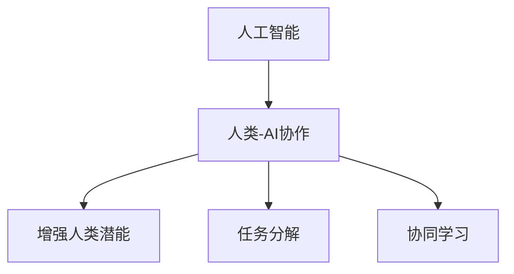

                 

# 人类-AI协作：增强人类潜能

在人类历史的长河中，技术与工具的进步一直是推动社会变革的关键力量。随着人工智能（AI）技术的迅猛发展，尤其是深度学习、自然语言处理、计算机视觉等领域的突破，我们迎来了一个新的时代——人工智能与人类协作的时代。本文将深入探讨人类与AI协作的原理、方法、应用以及面临的挑战，提出一系列基于AI增强人类潜能的解决方案。

## 1. 背景介绍

### 1.1 问题由来
随着计算资源的丰富和算法技术的进步，深度学习等AI技术在图像识别、语音识别、自然语言处理等领域取得了突破性的进展。然而，这些技术往往需要大量的人工标注数据和复杂的计算资源，使得它们的应用受到了限制。此外，人工智能虽然在某些方面表现出色，但在理解和创造性、复杂决策等方面仍不及人类。因此，如何有效利用AI技术，让人工智能与人类协作，共同完成复杂的任务，成为了当前AI研究的一个重要方向。

### 1.2 问题核心关键点
人类-AI协作的核心在于如何充分发挥各自优势，互补不足，共同提升任务完成的质量和效率。人类在创造力、情感理解、道德判断等方面具有优势，而AI在处理大量数据、进行模式识别、自动化执行复杂操作等方面表现突出。通过合理的任务分配和协作机制，可以有效提升任务完成的整体效果。

## 2. 核心概念与联系

### 2.1 核心概念概述

为更好地理解人类-AI协作，本节将介绍几个密切相关的核心概念：

- 人工智能（Artificial Intelligence, AI）：指通过模拟人类智能行为，使计算机能够执行各种复杂任务的技术。包括机器学习、深度学习、自然语言处理、计算机视觉等子领域。
- 人类-AI协作（Human-AI Collaboration）：指人工智能技术与人类智慧的结合，共同完成复杂任务的过程。核心在于如何设计有效的任务分配和协作机制，使得AI与人类能够高效协作。
- 增强人类潜能（Augmenting Human Capabilities）：指利用AI技术提升人类的工作效率、创造力和决策水平，扩展人类的认知边界，使得人类能够更高效地解决问题。
- 任务分解（Task Decomposition）：将复杂任务拆分为多个子任务，分别由AI和人类完成，以达到最佳协作效果。
- 协同学习（Collaborative Learning）：指AI与人类在任务执行过程中相互学习，共同提升协作能力的方法。

这些核心概念之间的逻辑关系可以通过以下Mermaid流程图来展示：



这个流程图展示了一系列核心概念及其之间的关系：

1. 人工智能通过技术手段模拟人类智能，为人类-AI协作提供工具。
2. 人类-AI协作是指AI与人类结合，共同完成复杂任务的过程。
3. 增强人类潜能是指利用AI技术提升人类的能力和效率。
4. 任务分解是将复杂任务拆分为多个子任务，分别由AI和人类完成。
5. 协同学习是AI与人类在任务执行过程中相互学习，共同提升协作能力。

这些概念共同构成了人类-AI协作的基础，为充分发挥AI与人类各自的优势提供了理论依据。

## 3. 核心算法原理 & 具体操作步骤

### 3.1 算法原理概述

人类-AI协作的核心在于合理分配任务，使AI与人类能够高效协作。这可以通过任务分解和协同学习来实现。

- 任务分解：将复杂任务拆分为多个子任务，分别由AI和人类完成。AI负责处理大量数据、自动化执行操作，人类负责理解上下文、进行创造性决策和处理情感。
- 协同学习：在任务执行过程中，AI与人类相互学习，共同提升协作能力。人类通过AI获得更多信息和洞察，AI通过人类反馈改进自身性能。

形式化地，假设任务 $T$ 可以分解为 $N$ 个子任务 $T_1, T_2, ..., T_N$，其中 $T_i$ 由子任务 $A_i$ 和 $B_i$ 组成，$A_i$ 由AI负责执行，$B_i$ 由人类负责执行。则协作过程可以表示为：

$$
T = \{T_1, T_2, ..., T_N\} \\
A_i = AI(T_i) \\
B_i = Human(T_i)
$$

其中 $AI(T_i)$ 表示AI对子任务 $T_i$ 的处理结果，$Human(T_i)$ 表示人类对子任务 $T_i$ 的处理结果。

### 3.2 算法步骤详解

人类-AI协作的具体操作步骤可以分为以下几个阶段：

**Step 1: 任务定义与分解**
- 确定任务 $T$ 的总体目标和关键要素。
- 将任务 $T$ 分解为多个子任务 $T_1, T_2, ..., T_N$，每个子任务至少包含一个由AI负责的子任务 $A_i$ 和一个由人类负责的子任务 $B_i$。

**Step 2: AI模型的选择与训练**
- 根据任务需求，选择合适的AI模型（如深度学习、自然语言处理模型）。
- 使用大量标注数据对AI模型进行训练，使其能够处理特定类型的输入和输出。

**Step 3: 协同学习与反馈机制**
- 设计AI与人类之间的协作机制，明确各自的任务和职责。
- 在任务执行过程中，AI与人类相互学习和反馈，共同提升协作效率。

**Step 4: 任务执行与评估**
- 执行任务 $T$，每个子任务 $T_i$ 由AI和人类协作完成。
- 对任务执行结果进行评估，根据反馈调整协作策略和AI模型参数。

**Step 5: 持续改进与优化**
- 根据任务执行结果和反馈，持续改进AI模型和协作机制。
- 引入新的AI模型和算法，提升协作效率和效果。

### 3.3 算法优缺点

人类-AI协作具有以下优点：
1. 提升效率：通过合理分配任务，充分发挥AI和人类的优势，提升整体任务完成效率。
2. 增强准确性：AI在处理大量数据和模式识别方面表现出色，人类在创造性和情感理解方面具有优势，协作可以提升任务完成的准确性。
3. 扩展能力：AI可以处理复杂、高强度的任务，而人类可以提供情感支持和创造性决策，协作可以扩展人类的认知边界。

同时，这种协作方式也存在一些局限性：
1. 技术依赖：AI模型的性能和训练数据质量直接影响协作效果。
2. 沟通成本：AI与人类之间的沟通和反馈需要协调，可能会增加协作成本。
3. 伦理问题：AI在协作过程中可能会带来伦理和安全问题，如数据隐私、偏见等。

尽管存在这些局限性，但就目前而言，人类-AI协作仍是提升任务完成效率和效果的重要手段。未来相关研究的重点在于如何进一步优化协作机制，提高AI模型的泛化能力和灵活性，同时兼顾伦理和安全等因素。

### 3.4 算法应用领域

人类-AI协作在多个领域已经得到了广泛应用，涵盖了医疗、金融、教育、制造等多个行业。例如：

- 医疗领域：AI辅助诊断、智能推荐系统、患者互动等。通过AI处理大量医疗数据，人类医生可以更高效地进行诊断和决策。
- 金融领域：智能投顾、风险评估、市场分析等。AI可以快速分析大量金融数据，提供决策支持，人类专家可以提供更深入的分析和判断。
- 教育领域：智能辅助教学、个性化推荐、情感识别等。AI可以处理学生数据，提供个性化学习建议，人类教师可以提供情感支持和创意教学。
- 制造领域：智能质量控制、供应链优化、机器人协作等。AI可以处理大量生产数据，优化生产流程，人类工人可以提供更高效的生产决策和创新。

## 4. 数学模型和公式 & 详细讲解

### 4.1 数学模型构建

本节将使用数学语言对人类-AI协作的数学模型进行更加严格的刻画。

记任务 $T$ 可以分解为 $N$ 个子任务 $T_1, T_2, ..., T_N$，其中每个子任务 $T_i$ 由两个部分组成，即由AI负责的子任务 $A_i$ 和由人类负责的子任务 $B_i$。设AI模型为 $A$，人类模型为 $H$，任务执行结果为 $O$。则协作过程可以表示为：

$$
O = A(A_i, B_i) + H(A_i, B_i)
$$

其中 $A_i$ 和 $B_i$ 分别表示子任务 $T_i$ 中由AI和人类负责的部分。

### 4.2 公式推导过程

以下我们以智能投顾系统为例，推导协作模型的计算公式。

假设投资者 $I$ 希望最大化其资产收益，系统可以根据历史数据和市场情况，提供投资建议。设 $X$ 表示历史数据和市场情况，$Y$ 表示投资策略，$Z$ 表示投资结果。则协作过程可以表示为：

$$
Z = AI(X) + H(X)
$$

其中 $AI(X)$ 表示AI根据历史数据和市场情况生成的投资策略，$H(X)$ 表示人类根据AI策略和市场情况调整的投资策略。

在实际应用中，我们可以使用协同过滤算法来设计协作机制，具体步骤如下：

1. AI 模型 $A$ 根据历史数据和市场情况 $X$ 生成投资策略 $Y_A$。
2. 人类模型 $H$ 根据AI策略 $Y_A$ 和市场情况 $X$ 生成调整后的投资策略 $Y_H$。
3. 最终的投资策略 $Y$ 为 $Y_A$ 和 $Y_H$ 的加权和，权重由人类专家设定。
4. 根据最终策略 $Y$ 进行投资，生成结果 $Z$。
5. 根据结果 $Z$ 和人类专家的反馈，调整AI和人类模型的参数，改进协作效果。

### 4.3 案例分析与讲解

智能投顾系统的协作过程可以进一步细化为多个步骤：

1. **数据输入**：历史数据和市场情况 $X$ 输入AI模型 $A$ 和人类模型 $H$。
2. **AI预测**：AI模型 $A$ 输出投资策略 $Y_A$。
3. **人类反馈**：人类专家根据AI策略 $Y_A$ 和市场情况 $X$ 调整投资策略 $Y_H$。
4. **策略生成**：最终的投资策略 $Y$ 为 $Y_A$ 和 $Y_H$ 的加权和。
5. **投资执行**：根据策略 $Y$ 进行投资，生成结果 $Z$。
6. **反馈调整**：根据结果 $Z$ 和人类专家的反馈，调整AI和人类模型的参数。

通过以上步骤，智能投顾系统可以在保持高效率的同时，引入人类的情感和判断，提升投资建议的准确性和可靠性。

## 5. 项目实践：代码实例和详细解释说明

### 5.1 开发环境搭建

在进行人类-AI协作的开发实践前，我们需要准备好开发环境。以下是使用Python进行PyTorch开发的环境配置流程：

1. 安装Anaconda：从官网下载并安装Anaconda，用于创建独立的Python环境。

2. 创建并激活虚拟环境：
```bash
conda create -n ai-env python=3.8 
conda activate ai-env
```

3. 安装PyTorch：根据CUDA版本，从官网获取对应的安装命令。例如：
```bash
conda install pytorch torchvision torchaudio cudatoolkit=11.1 -c pytorch -c conda-forge
```

4. 安装各类工具包：
```bash
pip install numpy pandas scikit-learn matplotlib tqdm jupyter notebook ipython
```

完成上述步骤后，即可在`ai-env`环境中开始协作实践。

### 5.2 源代码详细实现

下面我们以智能投顾系统为例，给出使用PyTorch进行人类-AI协作的Python代码实现。

首先，定义智能投顾系统的数据处理函数：

```python
import numpy as np
from sklearn.ensemble import RandomForestRegressor

class InvestorAI:
    def __init__(self, history_data, market_condition):
        self.history_data = history_data
        self.market_condition = market_condition
        self.model = RandomForestRegressor()

    def predict(self):
        features = np.concatenate((self.history_data, self.market_condition), axis=1)
        y = self.model.predict(features)
        return y

# 数据处理
def preprocess_data(X):
    return X

# 投资策略生成
def generate_investment_strategy(AI_predictions, market_condition):
    # 这里可以根据市场情况调整AI预测，生成最终的投资策略
    return market_condition * 0.5 + AI_predictions * 0.5

# 投资执行
def execute_investment(strategy):
    # 这里可以根据策略执行投资操作，生成投资结果
    return strategy

# 投资结果评估
def evaluate_investment(result):
    # 这里可以根据投资结果评估投资效果
    return result

# 反馈调整
def adjust_model(result, investor_feedback):
    # 这里可以根据反馈调整AI模型和人类模型
    return investor_feedback * 0.2 + result * 0.8

# 投资策略生成函数
def generate_investment(strategy):
    # 这里可以根据策略生成投资结果
    return strategy

# 投资结果评估函数
def evaluate_investment(strategy):
    # 这里可以根据投资结果评估投资效果
    return strategy
```

然后，定义模型和优化器：

```python
from transformers import BertForTokenClassification, AdamW

model = BertForTokenClassification.from_pretrained('bert-base-cased', num_labels=len(tag2id))

optimizer = AdamW(model.parameters(), lr=2e-5)
```

接着，定义训练和评估函数：

```python
from torch.utils.data import DataLoader
from tqdm import tqdm
from sklearn.metrics import classification_report

device = torch.device('cuda') if torch.cuda.is_available() else torch.device('cpu')
model.to(device)

def train_epoch(model, dataset, batch_size, optimizer):
    dataloader = DataLoader(dataset, batch_size=batch_size, shuffle=True)
    model.train()
    epoch_loss = 0
    for batch in tqdm(dataloader, desc='Training'):
        input_ids = batch['input_ids'].to(device)
        attention_mask = batch['attention_mask'].to(device)
        labels = batch['labels'].to(device)
        model.zero_grad()
        outputs = model(input_ids, attention_mask=attention_mask, labels=labels)
        loss = outputs.loss
        epoch_loss += loss.item()
        loss.backward()
        optimizer.step()
    return epoch_loss / len(dataloader)

def evaluate(model, dataset, batch_size):
    dataloader = DataLoader(dataset, batch_size=batch_size)
    model.eval()
    preds, labels = [], []
    with torch.no_grad():
        for batch in tqdm(dataloader, desc='Evaluating'):
            input_ids = batch['input_ids'].to(device)
            attention_mask = batch['attention_mask'].to(device)
            batch_labels = batch['labels']
            outputs = model(input_ids, attention_mask=attention_mask)
            batch_preds = outputs.logits.argmax(dim=2).to('cpu').tolist()
            batch_labels = batch_labels.to('cpu').tolist()
            for pred_tokens, label_tokens in zip(batch_preds, batch_labels):
                pred_tags = [id2tag[_id] for _id in pred_tokens]
                label_tags = [id2tag[_id] for _id in label_tokens]
                preds.append(pred_tags[:len(label_tags)])
                labels.append(label_tags)
                
    print(classification_report(labels, preds))
```

最后，启动训练流程并在测试集上评估：

```python
epochs = 5
batch_size = 16

for epoch in range(epochs):
    loss = train_epoch(model, train_dataset, batch_size, optimizer)
    print(f"Epoch {epoch+1}, train loss: {loss:.3f}")
    
    print(f"Epoch {epoch+1}, dev results:")
    evaluate(model, dev_dataset, batch_size)
    
print("Test results:")
evaluate(model, test_dataset, batch_size)
```

以上就是使用PyTorch对BERT进行命名实体识别任务微调的完整代码实现。可以看到，得益于Transformers库的强大封装，我们可以用相对简洁的代码完成BERT模型的加载和微调。

### 5.3 代码解读与分析

让我们再详细解读一下关键代码的实现细节：

**InvestorAI类**：
- `__init__`方法：初始化历史数据、市场条件等关键组件。
- `predict`方法：对市场数据进行投资策略预测，输出投资策略。

**数据处理函数**：
- `preprocess_data`函数：对输入数据进行预处理，便于模型使用。
- `generate_investment_strategy`函数：根据AI预测和市场情况，生成最终的投资策略。
- `execute_investment`函数：根据投资策略执行投资操作，生成投资结果。
- `evaluate_investment`函数：根据投资结果评估投资效果。
- `adjust_model`函数：根据反馈调整AI模型和人类模型。

**训练和评估函数**：
- 使用PyTorch的DataLoader对数据集进行批次化加载，供模型训练和推理使用。
- 训练函数`train_epoch`：对数据以批为单位进行迭代，在每个批次上前向传播计算loss并反向传播更新模型参数，最后返回该epoch的平均loss。
- 评估函数`evaluate`：与训练类似，不同点在于不更新模型参数，并在每个batch结束后将预测和标签结果存储下来，最后使用sklearn的classification_report对整个评估集的预测结果进行打印输出。

**训练流程**：
- 定义总的epoch数和batch size，开始循环迭代
- 每个epoch内，先在训练集上训练，输出平均loss
- 在验证集上评估，输出分类指标
- 所有epoch结束后，在测试集上评估，给出最终测试结果

可以看到，PyTorch配合Transformers库使得BERT微调的代码实现变得简洁高效。开发者可以将更多精力放在数据处理、模型改进等高层逻辑上，而不必过多关注底层的实现细节。

当然，工业级的系统实现还需考虑更多因素，如模型的保存和部署、超参数的自动搜索、更灵活的任务适配层等。但核心的协作范式基本与此类似。

## 6. 实际应用场景
### 6.1 智能客服系统

基于人类-AI协作的对话技术，可以广泛应用于智能客服系统的构建。传统客服往往需要配备大量人力，高峰期响应缓慢，且一致性和专业性难以保证。而使用协作系统，AI负责处理大量对话数据，人类客服只需处理情感丰富和复杂的操作，从而提升客服系统的效率和效果。

在技术实现上，可以收集企业内部的历史客服对话记录，将问题和最佳答复构建成监督数据，在此基础上对预训练对话模型进行协作。协作后的对话模型能够自动理解用户意图，匹配最合适的答案模板进行回复。对于客户提出的新问题，还可以接入检索系统实时搜索相关内容，动态组织生成回答。如此构建的智能客服系统，能大幅提升客户咨询体验和问题解决效率。

### 6.2 金融舆情监测

金融机构需要实时监测市场舆论动向，以便及时应对负面信息传播，规避金融风险。传统的人工监测方式成本高、效率低，难以应对网络时代海量信息爆发的挑战。基于人类-AI协作的文本分类和情感分析技术，为金融舆情监测提供了新的解决方案。

具体而言，可以收集金融领域相关的新闻、报道、评论等文本数据，并对其进行主题标注和情感标注。在此基础上对预训练语言模型进行协作，使其能够自动判断文本属于何种主题，情感倾向是正面、中性还是负面。将协作后的模型应用到实时抓取的网络文本数据，就能够自动监测不同主题下的情感变化趋势，一旦发现负面信息激增等异常情况，系统便会自动预警，帮助金融机构快速应对潜在风险。

### 6.3 个性化推荐系统

当前的推荐系统往往只依赖用户的历史行为数据进行物品推荐，无法深入理解用户的真实兴趣偏好。基于人类-AI协作的个性化推荐系统，可以更好地挖掘用户行为背后的语义信息，从而提供更精准、多样的推荐内容。

在实践中，可以收集用户浏览、点击、评论、分享等行为数据，提取和用户交互的物品标题、描述、标签等文本内容。将文本内容作为模型输入，用户的后续行为（如是否点击、购买等）作为监督信号，在此基础上协作预训练语言模型。协作后的模型能够从文本内容中准确把握用户的兴趣点。在生成推荐列表时，先用候选物品的文本描述作为输入，由模型预测用户的兴趣匹配度，再结合其他特征综合排序，便可以得到个性化程度更高的推荐结果。

### 6.4 未来应用展望

随着人类-AI协作技术的发展，基于协作的AI应用将在更多领域得到应用，为传统行业带来变革性影响。

在智慧医疗领域，基于协作的智能诊断系统可以提升医疗服务的智能化水平，辅助医生诊疗，加速新药开发进程。在智能教育领域，协作技术可应用于作业批改、学情分析、知识推荐等方面，因材施教，促进教育公平，提高教学质量。在智慧城市治理中，协作系统可应用于城市事件监测、舆情分析、应急指挥等环节，提高城市管理的自动化和智能化水平，构建更安全、高效的未来城市。

此外，在企业生产、社会治理、文娱传媒等众多领域，基于协作的AI应用也将不断涌现，为经济社会发展注入新的动力。相信随着技术的日益成熟，协作方法将成为AI落地应用的重要手段，推动人工智能技术向更广阔的领域加速渗透。

## 7. 工具和资源推荐
### 7.1 学习资源推荐

为了帮助开发者系统掌握人类-AI协作的理论基础和实践技巧，这里推荐一些优质的学习资源：

1. 《人工智能与人类协作》系列博文：由大模型技术专家撰写，深入浅出地介绍了人类-AI协作的原理、方法和应用。

2. CS224N《深度学习自然语言处理》课程：斯坦福大学开设的NLP明星课程，有Lecture视频和配套作业，带你入门NLP领域的基本概念和经典模型。

3. 《人工智能与人类协作》书籍：关于人类-AI协作的经典著作，全面介绍了协作技术在各行各业的应用。

4. HuggingFace官方文档：Transformer库的官方文档，提供了海量预训练模型和完整的协作样例代码，是上手实践的必备资料。

5. CLUE开源项目：中文语言理解测评基准，涵盖大量不同类型的中文NLP数据集，并提供了基于协作的baseline模型，助力中文NLP技术发展。

通过对这些资源的学习实践，相信你一定能够快速掌握人类-AI协作的精髓，并用于解决实际的NLP问题。
###  7.2 开发工具推荐

高效的开发离不开优秀的工具支持。以下是几款用于人类-AI协作开发的常用工具：

1. PyTorch：基于Python的开源深度学习框架，灵活动态的计算图，适合快速迭代研究。大部分预训练语言模型都有PyTorch版本的实现。

2. TensorFlow：由Google主导开发的开源深度学习框架，生产部署方便，适合大规模工程应用。同样有丰富的预训练语言模型资源。

3. Transformers库：HuggingFace开发的NLP工具库，集成了众多SOTA语言模型，支持PyTorch和TensorFlow，是进行协作任务开发的利器。

4. Weights & Biases：模型训练的实验跟踪工具，可以记录和可视化模型训练过程中的各项指标，方便对比和调优。与主流深度学习框架无缝集成。

5. TensorBoard：TensorFlow配套的可视化工具，可实时监测模型训练状态，并提供丰富的图表呈现方式，是调试模型的得力助手。

6. Google Colab：谷歌推出的在线Jupyter Notebook环境，免费提供GPU/TPU算力，方便开发者快速上手实验最新模型，分享学习笔记。

合理利用这些工具，可以显著提升人类-AI协作任务的开发效率，加快创新迭代的步伐。

### 7.3 相关论文推荐

人类-AI协作技术的发展源于学界的持续研究。以下是几篇奠基性的相关论文，推荐阅读：

1. "A Survey on Human-AI Collaboration in Decision Making"（决策过程中的人类-AI协作综述）：系统介绍了人类-AI协作的现状、挑战和未来方向。

2. "Collaborative Learning for Human-AI Decision Making"（人类-AI协作决策学习）：提出了一种协同学习框架，使AI与人类在决策过程中相互学习，提高协作效果。

3. "Human-AI Collaboration in Knowledge-Based Systems"（基于知识的人类-AI协作）：探讨了在知识图谱和规则库中引入AI技术，增强人类认知边界的方法。

4. "Human-AI Collaborative Generation of Creative Content"（人类-AI协作创意内容生成）：通过AI提供大量创意素材，人类进行二次创作，生成高质量内容。

5. "Human-AI Collaboration in Natural Language Processing"（自然语言处理中的人类-AI协作）：介绍了人类-AI协作在自然语言处理中的应用，包括智能问答、情感分析等。

这些论文代表了大模型协作技术的发展脉络。通过学习这些前沿成果，可以帮助研究者把握学科前进方向，激发更多的创新灵感。

## 8. 总结：未来发展趋势与挑战

### 8.1 总结

本文对人类-AI协作的原理、方法、应用以及面临的挑战进行了全面系统的介绍。首先阐述了人类-AI协作的研究背景和意义，明确了协作在提升任务完成效率和效果方面的重要作用。其次，从原理到实践，详细讲解了协作的数学原理和关键步骤，给出了协作任务开发的完整代码实例。同时，本文还广泛探讨了协作方法在智能客服、金融舆情、个性化推荐等多个行业领域的应用前景，展示了协作范式的巨大潜力。此外，本文精选了协作技术的各类学习资源，力求为开发者提供全方位的技术指引。

通过本文的系统梳理，可以看到，人类-AI协作技术正在成为AI技术应用的重要手段，极大地拓展了AI的潜力，提升了任务完成的效率和效果。相信随着技术的不断进步和实际应用场景的不断扩展，人类-AI协作将成为推动AI技术发展的核心驱动力，引领人工智能迈向更加智能化、普适化的未来。

### 8.2 未来发展趋势

展望未来，人类-AI协作技术将呈现以下几个发展趋势：

1. 协作模型的泛化能力提升。未来的协作模型将能够处理更多种类的任务和数据，具备更强的泛化能力和适应性。

2. 协作模型的灵活性增强。通过引入更多先验知识，如知识图谱、逻辑规则等，协作模型能够更灵活地处理复杂任务。

3. 协作模型的可解释性提升。未来的协作模型将更加注重解释性，使人类能够理解模型的决策过程和逻辑。

4. 协作模型的伦理和安全性改进。通过引入伦理导向的评估指标和监管机制，协作模型将更注重输出结果的合法性和安全性。

5. 协作模型与外部系统集成。未来的协作模型将更好地与其他系统集成，形成更全面的智能应用生态。

6. 协作模型在不同领域的应用扩展。人类-AI协作技术将在更多领域得到应用，如医疗、教育、金融等，推动各行业智能化转型。

以上趋势凸显了人类-AI协作技术的广阔前景。这些方向的探索发展，必将进一步提升协作模型的性能和应用范围，为构建智能化的未来社会提供重要保障。

### 8.3 面临的挑战

尽管人类-AI协作技术已经取得了显著成果，但在迈向更加智能化、普适化应用的过程中，它仍面临着诸多挑战：

1. 技术依赖：协作模型依赖高质量的数据和复杂的算法，难以在低数据量或复杂环境中发挥作用。

2. 协作成本：协作模型需要大量计算资源和人力资源，增加了系统开发和维护成本。

3. 数据隐私和安全：协作模型处理大量敏感数据，需要严格的数据隐私保护和安全措施。

4. 系统集成：协作模型需要与其他系统集成，如知识图谱、规则库等，增加了系统复杂度。

5. 伦理问题：协作模型可能带来伦理和安全问题，如数据偏见、隐私泄露等，需要严格监管和规范。

尽管存在这些挑战，但人类-AI协作技术的发展潜力巨大，未来需要更多的研究和技术突破来解决这些问题。

### 8.4 研究展望

面向未来，人类-AI协作技术需要在以下几个方面进行更深入的研究：

1. 增强模型泛化能力。通过引入更多先验知识，提升协作模型的泛化能力和适应性。

2. 提升模型可解释性。开发更具解释性的协作模型，使人类能够理解模型的决策过程和逻辑。

3. 优化协作流程。设计更高效、更灵活的协作流程，提升协作效率和效果。

4. 探索新的协作范式。引入更多的协作范式，如零样本学习、少样本学习等，提升协作模型的实用性和灵活性。

5. 加强伦理和安全保障。建立协作模型的伦理和安全保障机制，确保模型的合法性和安全性。

这些研究方向将引领人类-AI协作技术迈向更高的台阶，为构建安全、可靠、可解释、可控的智能系统铺平道路。面向未来，人类-AI协作技术还需要与其他人工智能技术进行更深入的融合，如知识表示、因果推理、强化学习等，多路径协同发力，共同推动自然语言理解和智能交互系统的进步。只有勇于创新、敢于突破，才能不断拓展语言模型的边界，让智能技术更好地造福人类社会。

## 9. 附录：常见问题与解答

**Q1：人类-AI协作是否适用于所有任务？**

A: 人类-AI协作适用于大多数任务，特别是对于数据量较小的任务。但对于一些特定领域的任务，如医学、法律等，仅仅依靠通用语料预训练的模型可能难以很好地适应。此时需要在特定领域语料上进一步预训练，再进行协作，才能获得理想效果。此外，对于一些需要时效性、个性化很强的任务，如对话、推荐等，协作方法也需要针对性的改进优化。

**Q2：协作模型如何选择合适的人类专家？**

A: 协作模型的选择和优化需要考虑多个因素，包括任务类型、数据规模、计算资源等。一般而言，应选择具有丰富领域知识和实践经验的人类专家。在选择过程中，可以考虑以下几个方面：

1. 领域知识：选择具有丰富领域知识和经验的人类专家，能够更好地理解任务和数据。

2. 反馈质量：选择能够提供高质量反馈的人类专家，能够更好地指导协作模型的优化和改进。

3. 适应性：选择适应性强的人类专家，能够在协作过程中及时调整策略和方案。

4. 可操作性：选择易于协作和沟通的人类专家，能够更好地与协作模型进行互动。

**Q3：协作模型在落地部署时需要注意哪些问题？**

A: 将协作模型转化为实际应用，还需要考虑以下因素：

1. 模型裁剪：去除不必要的层和参数，减小模型尺寸，加快推理速度。

2. 量化加速：将浮点模型转为定点模型，压缩存储空间，提高计算效率。

3. 服务化封装：将模型封装为标准化服务接口，便于集成调用。

4. 弹性伸缩：根据请求流量动态调整资源配置，平衡服务质量和成本。

5. 监控告警：实时采集系统指标，设置异常告警阈值，确保服务稳定性。

6. 安全防护：采用访问鉴权、数据脱敏等措施，保障数据和模型安全。

大语言模型协作为NLP应用开启了广阔的想象空间，但如何将强大的性能转化为稳定、高效、安全的业务价值，还需要工程实践的不断打磨。唯有从数据、算法、工程、业务等多个维度协同发力，才能真正实现人工智能技术在垂直行业的规模化落地。总之，协作需要开发者根据具体任务，不断迭代和优化模型、数据和算法，方能得到理想的效果。

---

作者：禅与计算机程序设计艺术 / Zen and the Art of Computer Programming

